# 乙醇偶合制备C4烯烃的多元回归与神经网络模型

## 摘要

乙醇催化偶合是制备C4烯烃的重要方法，本文对乙醇催化偶合制备C4烯烃工艺条件进行研究，建立多元回归模型与BP神经网络模型，对各问题进行分析。

对于问题一第一部分，首先画出各催化剂组合乙醇转化率和C4烯烃选择性与温度散点图，结合相关文献综合分析误差后，初步判断出变化趋势。之后，利用指数拟合、线性拟合得出乙醇转化率与温度的关系：利用三次多项式拟合得出C4 烯烃选择性与温度的关系。利用 Matlab 和 Origin 求解出具体方程，并在附录中给出具体拟合图。最终根据线性型、指数型、多项式峰值情况分为5类进行分析，给出了21种催化剂组合具体5种分类情况。

对于问题一第二部分，我们首先在附件一基础上分析得出乙醇催化偶合制备C4烯烃的整体反应过程，明确了各指标间的关系。之后，针对附件2各指标进行分析，利用Matlab拟合出随时间变化图像，发现乙醇转化率和C4烯烃收率随时间的推移呈现指数型衰减特征，并得出在197min-273min时间段内生成C4烯烃的主反应逐渐达到平衡，其他副反应有一定滞后性等相关结论。

对于问题二，我们在定性分析的基础上，进行定量分析，确定多元回归方程，并对影响程度进行分析。首先通过对比分析得出两种装料方式对重要指标无明显影响，其次将催化剂组合及温度等综合性变量转换成数值型自变量与因变量，利用逐步线性回归法与主成分分析法建立多元回归模型：之后进行初步检验，在此基础上进行了非线性变量处理、增加交互项处理、归一化处理等优化处理，求解出多元回归方程。最终得到结论：对于乙醇的转化率，温度的影响最大，其次是乙醇浓度；对于C4烯烃选择性，主要是由温度影响。同时也验证了第一问选取的拟合函数具有合理性。

对于问题三，先经过综合分析，我们从现有数据集具有非线性特征切入，结合BP神经网络具有非线性映射能力等优点，利用BP神经网络进行建模及求解。通过测试分析当隐藏神经元个数为5，模型训练方法为贝叶斯正则化时求解效果较好。在相同实验条件下：最大C4烯烃收率为51.31%；催化剂组合为200mg0.5wt%Co/SiO2-200mgHAP-乙醇浓度0.3ml/min:温度为450度。当温度低于350度时，最大C4烯烃收率为38.47%；催化剂组合为200mg2wt%Co/SiO2-200mgHAP-乙醇浓度2.1ml/min；温度为350度。

对于问题四，我们从寻找C4烯烃收率在全局范围内的最优峰值和验证问题三中求解出的两组最优值是否符合预测值出发，利用欧式距离建立的广度模型以及在神经网络模型中确定的各个自变量权重建立模型，最终设计出具体的5次实验：400mg 1wt%Co/SiO2-400mg HAP-乙醇浓度 0.9ml/min，400度；500mg1wt%Co/SiO2-500mg HAP-乙醇浓度 0.9ml/min，450 度；600mg 1wt%Co/SiO2-600mg HAP-乙醇浓度0.9ml/min，500度；200mg 0.5wt%Co/SiO2- 200mg HAP-乙醇浓度 0.3ml/min，450度；200mg2wt%Co/SiO2-200mg HAP-乙醇浓度2.1ml/min，350度。

关键词：非线性函数拟合；多元回归：BP神经网络；C4烯烃收率

## 一、问题重述

## 1.1 问题背景

C4烯烃作为重要的化工原料，广泛应用在化工产品及医药的生产中，乙醇是制备C4烯烃的原料。在实际生产过程中，催化剂组合及温度对C4烯烃选择性和C4烯烃收率均有影响。某个化工实验室针对不同催化剂在不同温度下进行了一系列实验，已给出性能数据表及350度时某种催化剂组合的测试数据。分析表格每种催化剂组合中重要指标变化的具体规律，探索乙醇催化偶合制备C4烯烃的工艺条件有非常重要的应用价值和实际意义。

## 1.2 具体问题重述

问题一：根据性能数据表中每种催化剂组合的具体数据，进行横向研究，分别分析乙醇转化率、C4烯烃选择性与温度的关系。并对附件2中350度时给定的某种催化剂组合在一次实验不同时间的测试结果进行分析。

问题二：根据性能数据表中每种催化剂组合的具体数据，进行纵向研究，探讨不同催化剂组合及温度对乙醇转化率以及C4烯烃选择性大小的影响。

问题三：选择合适的催化剂组合与温度，给出在相同实验条件下C4烯烃收率尽可能高的方案。当温度低于350度时，再选择合适的催化剂组合与温度，给出当温度低于350度时C4烯烃收率尽可能高的方案。

问题四：结合前三问分析的结论与制定的方案，在此基础上再增加5 次实验，给出具体的设计方案，并说明详细理由。

## 二、问题分析

该问题以化工生产领域中乙醇催化偶合制备C4烯烃为背景，在性能数据表中给出了在不同催化剂组合及不同温度条件下，乙醇转化率、C4烯烃选择性、乙醇选择性等各项数据指标具体值，在附件二中给出了某种催化剂组合在350度条件下一次实验中不同时间的测试结果。我们通过综合分析化学工业生产中乙醇催化偶合制备C4烯烃的过程，从化学反应中间产物、副反应、不同温度下的主产物等多角度进行考虑，在已知的化学背景及原理基础上建立相应的数学模型，分步骤解决题目给出的四个问题。从层进关系考虑，我们需要利用已有的数据逐步进行以下四个步骤：针对每种催化剂组合指标的横向分析、针对不同催化剂组合指标的纵向分析、针对相同实验条件情况和温度低于350度情况给出使C4烯烃收率尽可能高的催化剂组合与温度设计方案、综合分析已有结果给出增加5次实验的具体设计方案。

## 2.1 研究每种催化剂组合重要指标与温度的关系

问题一第一部分要求针对性能数据表中每种催化剂组合的数据进行横向研究，分别分析乙醇转化率、C4烯烃选择性与温度的关系。首先我们分别画出了每种催化剂组合乙醇转化率和C4烯烃选择性与温度的散点图，在此基础上查阅了相关文献，初步得出乙醇转化率总体上随着温度升高而增大、部分催化剂组合C4烯烃选择性随着温度升高产生峰值的结论。由于已有数据量较小，并且温度与两个指标间均没有相关性，我们考虑以最小二乘法原理为基础，利用指数拟合、线性拟合得出乙醇转化率与温度的关系，利用n次多项式拟合得出C4烯烃选择性与温度的关系，并对n的值进行最优确定。最终可根据乙醇转化率拟合的类别、C4烯烃选择性峰值的存在情况进行分类，得到每种催化剂组合的具体分类情况。

## 2.2 350度时某催化剂组合单次实验测试结果分析

问题一第二部分要求针对附件2中反应温度为350度时某种催化剂组合在单次实验不同时间测试结果进行分析。首先我们可在附件一基础上分析得出乙醇催化偶合制备C4烯烃的整体反应过程，明确各指标间的关系；之后针对附件二重要指标的数据利用数学方法拟合出具体变化图像进行分析，得出在350度时乙醇转化率、C4烯烃选择性、C4烯烃收率等指标随时间变化的规律，并可分析出该条件下生成C4烯烃主反应的反应平衡时间以及副反应进程情况；最终可根据后续第三问的模型反推出附件二具体的催化剂组合情况。

## 2.3 探讨不同催化剂组合及温度对重要指标的影响

问题二要求针对性能数据表中每种催化剂组合的数据进行纵向研究，探讨不同催化剂组合及温度对乙醇转化率以及C4烯烃选择性大小的影响。我们需要在定性分析的基础上，进行定量分析，确定变量之间的相关关系，找出合适的数学表达式，并对影响程度进行分析。可利用逐步线性回归法与主成分分析法建立多元回归模型，将催化剂组合及温度等综合性变量进行拆分，转换成数值型自变量与因变量，之后可利用多元线性回归进行检验，在此基础上进行非线性变量处理、增加交互项处理、归一化处理等，得出具体的关系式方程，并可定量分析出每个自变量对因变量的影响程度。

## 2.4 以C4 烯烃收率尽可能高为目标的方案选取

问题三要求以C4烯烃收率尽可能高为目标，给出在相同实验条件下和温度低于350度条件下的具体催化剂组合与温度方案。我们首先考虑从非线性规划角度出发，衔接问题二结果进行求解。但经过检验发现此做法误差较大，结果较不具备合理性。因此我们再从现有数据集具有非线性特征切入，考虑到BP神经网络具有非线性映射能力等优点，可以利用BP神经网络进行建模及求解。通过大量尝试可确定输入自变量、神经元个数及训练方法，最终求解出具体方案结果。

## 2.5 增加 5 次实验的设计方案

问题四要求增加5次实验，给出具体的设计方案，并说明详细理由。这需要结合前三问分析得出的结论与建立的P神经网络模型，在此基础上进行增加实验的设计。我们从寻找全局最优解和对第三问模型进行检验两个角度出发，设计出2组5次实验：第1组实验用于寻找C4烯烃收率在全局范围内的最优峰值，根据通过欧式距离建立的广度模型以及在BP神经网络模型中确定的各个自变量权重，初步确定C4烯烃的收率在全局范围内存在一个峰值，由于在出现峰值前C4烯烃的收率单调递增，在出现峰值后C4烯烃的收率单调递减，因此我们需在峰值前、峰值处、峰值后各做3次实验，依此确定峰值的合理性：第2组实验则用于验证问题三中求解出的两组最优值是否符合预测值，我们在问题三中利用

BP神经网络模型对全温度、低于350度的现有实验条件进行了搜索，但找到的只是我们通过模型得到的预测值，因此我们需要对全温度、低于350度的数据各进行一次实验，以此比较实验值与预测值的差距，并进行误差分析。

## 三、模型假设

1、假设实验数据允许存在一定的误差范围。

2、假设做对比实验时遵循控制变量法控制其他实验条件完全相同。

3、假设问题三中“若使温度低于350度”表示温度小于等于350度的情况。

## 四、符号说明及名词定义

<table><tr><td>符号</td><td>定义</td></tr><tr><td>η</td><td>乙醇转化率</td></tr><tr><td>N</td><td>C4 烯烃选择性</td></tr><tr><td>T</td><td>温度</td></tr><tr><td> $\omega$ </td><td>C4烯烃收率</td></tr><tr><td> $M _ { C o / S i O _ { 2 } }$ </td><td> $C o / S i O _ { 2 }$  的质量</td></tr><tr><td> $M _ { H A P }$ </td><td>HAP的质量</td></tr><tr><td> $P _ { 1 }$ </td><td> $\scriptstyle { C o } / { S i O _ { 2 } }$  与  $H A P$  的装料比（质量比）</td></tr><tr><td> $P _ { 2 }$ </td><td>Co负载量  $( C o \ E E S i O _ { 2 }$  的质量比）</td></tr><tr><td>c</td><td>豆月 乙醇浓度</td></tr></table>

## 五、模型的建立与求解

## 5.1 问题一第一部分：研究各催化剂组合重要指标与温度关系

为分别分析各催化剂组合的乙醇转化率、C4 烯烃选择性与温度的关系，我们首先从各催化剂组合的乙醇转化率、C4烯烃选择性与温度的散点图出发，综合相关文献的研究结果，结合已有数据量较小且温度与两个指标间均无相关性的特点，以最小二乘法原理为基础，根据各组散点图具体特征分别建立了线性拟合模型、指数拟合模型、多项式拟合模型，并且对拟合出的函数进行具体求解，最终根据求解结果将21组催化剂组合进行分类。

## 5.1.1 各催化剂组合重要指标与温度关系模型的建立

## 5.1.1.1 基于散点图的初步判断

为了更加直观地分析两个重要指标与温度的变化关系，我们利用Matlab分别画出了每种催化剂组合乙醇转化率和C4烯烃选择性与温度的散点图，共计产生42张散点图。在此基础上，我们通过观察这42张散点图的形状特点，初步将乙醇转化率与温度散点图分为两类：线性增长类和指数增长类：初步将C4烯烃选择性与温度散点图分为两类：存在峰值类和不存在峰值类。四种类型的散点图如下：

## (1) 乙醇转化率与温度两类特征散点图

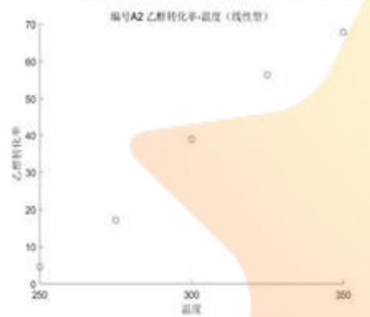  
图 5.1-1 线性增长型散点图

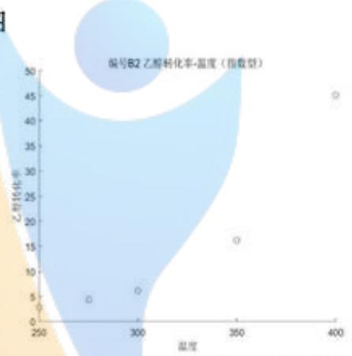  
图5.1-2指数增长型散点图

## (2) C4 烯烃选择性与温度两类特征散点图

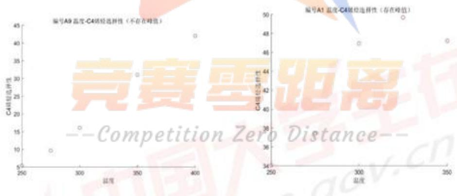  
图 5.1-3 存在峰值型散点图  
图 5.1-4 不存在峰值型散点图

## (3) 异常点的处理

我们通过观察发现A5、A6组在温度为275度情况下乙醇转化率出现略微下降的情况，通过查阅化工领域相关文献可知：在 $C o / S i O _ { 2 } - H A P$ 比例为1:1，以

250度为起始条件时，随着反应温度的增加，乙醇的转化率逐渐增加。1]再综合考虑到实验数据存在一定的误差范围，因此在后续整体拟合分析中可忽略这两个点乙醇转化率略微下降的情况。

## 5.1.1.2 基于最小二乘法原理的曲线拟合模型的建立

## (1) 拟合函数的确定

在以上步骤中，我们通过观察42张散点图的形状特点，初步将乙醇转化率与温度散点图分为两类：线性增长类和指数增长类；初步将C4烯烃选择性与温度散点图分为两类：存在峰值类和不存在峰值类。因此可以初步判断使用三种拟合函数：直线型函数拟合、指数型函数拟合、多项式型函数拟合。

## ①乙醇转化率与温度拟合函数确定

因为乙醇转化率在总体上均是随着温度的增大而增大，我们选取直线型函数

$$
y = a x + b\tag{5.1.1}
$$

和指数型函数

$$
y = A _ { 1 } e ^ { \frac { x } { t _ { 1 } } } + y _ { 0 }\tag{5.1.2}
$$

进行拟合。

## ② C4 烯烃选择性与温度拟合函数确定

因为部分催化剂组合C4烯烃选择性随着温度升高产生峰值，且已有数据量较小，温度与C4烯烃选择性没有相关性。我们选取n次多项式型函数

$$
y = a _ { 1 } x ^ { n } + a _ { 2 } x ^ { n - 1 } + \cdots + a _ { n } x + a _ { n + 1 }\tag{5.1.3}
$$

进行拟合。但又因为每组催化剂组合以5个点居多，我们考虑三次多项式拟合和四次多项式拟合进行具体对比判断。

## (3) 拟合模型的建立

## ①乙醇转化率与温度拟合模型

我们对21 种不同催化剂组合的乙醇转化率与温度的散点图基于最小二乘法原理用直线型函数 $y = a x + b$ 和指数型函数 $y = A _ { 1 } e ^ { \frac { x } { t _ { 1 } } } + y _ { 0 }$ 进行拟合，并对比分析，以B1为例，如下图：

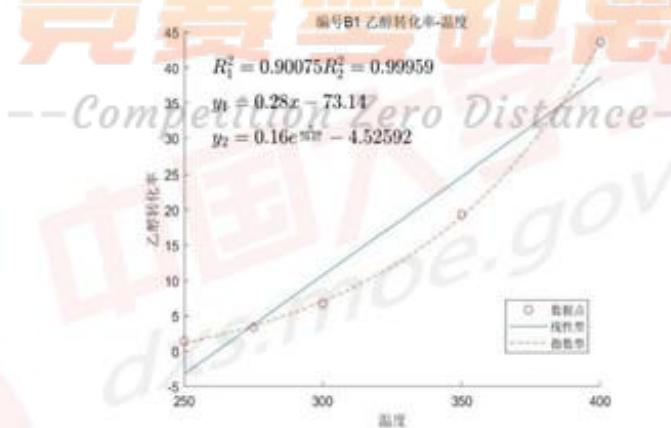  
图5.1-5 B1 组直线拟合与指数拟合对比图

由对比图可直观看出对于B1 组乙醇转化率与温度的关系显然指数拟合效果更好，线性拟合的 $R ^ { 2 } = 0 . 9 0 0 7 5$ ，指数拟合 $R ^ { 2 } = 0 . 9 9 9 5 9$ ，指数拟合R²明显大于线性拟合，这说明指数拟合可较好地描述B1组乙醇转化率随温度变化的关系。最终将21种组合全部进行上述过程，确定出最优的拟合曲线类型与具体方程。

## ② C4 烯烃选择性与温度拟合模型

我们对21种不同催化剂组合的C4烯烃选择性与温度的散点图均用n次多项式型函数 $y = a _ { 1 } x ^ { n } + a _ { 2 } x ^ { n - 1 } + \cdots + a _ { n } x + a _ { n + 1 }$ 进行拟合。因为每组催化剂组合以5个点居多，我们考虑用三次多项式拟合和四次多项式拟合进行具体对比判断。以A10为例，如下图：

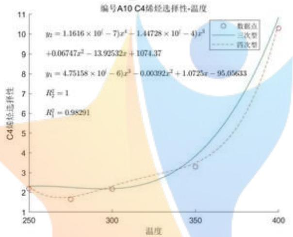  
图5.1-6 A10组三次多项式拟合与四次多项式拟合对比图

由对比图可直观看出对于A10组C4烯烃选择性与温度的关系用三次多项式拟合效果更好，由于只有5个点，四次多项式拟合 $R ^ { 2 } = 1$ ，这说明四次多项式拟合仅仅是根据这5个点确定了一个具体的方程，并没有起到总体拟合的效果，而三次多项式拟合较好地描述了C4烯烃选择性随温度变化的关系。通过将21种组合全部进行上述过程，发现对于每种组合三次多项式拟合的效果均更好，最终可确定出具体方程。 BE 区X

## 5.1.2 各催化剂组合重要指标与温度关系模型的求解

## 5.1.2.1 两个指标与温度关系具体拟合曲线方程

我们利用Origin软件中曲线拟合函数，以温度为自变量，乙醇转化率和C4烯烃选择性为因变量，对42张散点图进行了具体拟合，得出了具体方程，结果如下表：

表5.1-1 两个指标与温度的具体拟合方程
<table><tr><td colspan="1" rowspan="1">组号</td><td colspan="1" rowspan="1">乙醇转化率η与温度T方程</td><td colspan="1" rowspan="1">C4 烯烃选择性z与温度T方程</td></tr><tr><td colspan="1" rowspan="1">A1</td><td colspan="1" rowspan="1"> $\eta = 0 . 1 0 e ^ { \frac { T } { 5 8 . 2 6 } } - 4 . 9 9$ </td><td colspan="1" rowspan="1"> $z = - 6 . 0 7 \times 1 0 ^ { - 5 } T ^ { 3 } + 5 . 2 5 \times 1 0 ^ { - 2 } T ^ { 2 }$  $- 1 4 . 8 4 T + 1 4 0 9 . 2 4$ </td></tr><tr><td colspan="1" rowspan="1">A2</td><td colspan="1" rowspan="1"> $\eta = 0 . 6 6 T - 1 6 1 . 8 9$ </td><td colspan="1" rowspan="1"> $\begin{array} { c } { z = - 3 . 0 1 \times 1 0 ^ { - 5 } T ^ { 3 } + 3 . 0 2 \times 1 0 ^ { - 2 } T ^ { 2 } } \\ { - 9 . 7 2 T + 1 0 2 9 . 1 4 } \end{array}$ </td></tr><tr><td colspan="1" rowspan="1">A3</td><td colspan="1" rowspan="1"> $\eta = 0 . 4 2 T - 9 5 . 8 8$ </td><td colspan="1" rowspan="1"> $\overline { { z = - 1 . 8 6 \times 1 0 ^ { - 5 } T ^ { 3 } + 1 . 8 5 \times 1 0 ^ { - 2 } T ^ { 2 } } }$ -5.71T+ 565.65</td></tr><tr><td colspan="1" rowspan="1">A4</td><td colspan="1" rowspan="1"> $\eta = 0 . 5 8 T - 1 4 4 . 5 7$ </td><td colspan="1" rowspan="1"> $\begin{array} { c } { z = - 2 . 1 1 \times 1 0 ^ { - 5 } T ^ { 3 } + 2 . 1 8 \times 1 0 ^ { - 2 } T ^ { 2 } } \\ { - 7 . 1 4 T + 7 6 3 . 6 7 } \end{array}$ </td></tr><tr><td colspan="1" rowspan="1">A5</td><td colspan="1" rowspan="1"> $\eta = 0 . 1 0 e ^ { \frac { T } { 6 0 . 8 5 } } + 6 . 9 0$ </td><td colspan="1" rowspan="1"> $\begin{array} { c } { z = 1 . 3 8 \times 1 0 ^ { - 5 } T ^ { 3 } - 1 . 2 4 \times 1 0 ^ { - 2 } T ^ { 2 } } \\ { + 3 . 8 2 T - 3 9 5 . 6 2 } \end{array}$ </td></tr><tr><td colspan="1" rowspan="1">A6</td><td colspan="1" rowspan="1"> $\eta = 0 . 5 0 T - 1 1 9 . 8 3$ </td><td colspan="1" rowspan="1"> $\begin{array} { c } { z = 3 . 2 2 \times 1 0 ^ { - 5 } T ^ { 3 } - 2 . 9 2 \times 1 0 ^ { - 2 } T ^ { 2 } } \\ { + 8 . 7 8 T - 8 7 3 . 5 0 } \end{array}$ </td></tr><tr><td colspan="1" rowspan="1">A7</td><td colspan="1" rowspan="1"> $\eta = 0 . 3 8 T - 7 4 . 2 6$ </td><td colspan="1" rowspan="1"> $\begin{array} { c } { z = - 2 . 0 3 \times 1 0 ^ { - 6 } T ^ { 3 } + 3 . 1 3 \times 1 0 ^ { - 3 } T ^ { 2 } } \\ { - 1 . 2 0 T + 1 4 1 . 0 2 } \end{array}$ </td></tr><tr><td colspan="1" rowspan="1">A8</td><td colspan="1" rowspan="1"> $\eta = 1 . 1 9 e ^ { \frac { T } { 9 9 . 5 7 } } - 9 . 4 3$ </td><td colspan="1" rowspan="1"> $\begin{array} { c } { z = - 2 . 1 2 \times 1 0 ^ { - 6 } T ^ { 3 } + 2 . 8 1 \times 1 0 ^ { - 3 } T ^ { 2 } } \\ { - 0 . 9 0 T + 8 8 . 8 0 } \end{array}$ </td></tr><tr><td colspan="1" rowspan="1">A9</td><td colspan="1" rowspan="1"> $\eta = 0 . 0 0 3 8 e ^ { \frac { T } { 4 3 . 2 6 } } + 0 . 7 9$ </td><td colspan="1" rowspan="1"> $z = - 1 . 1 0 \times 1 0 ^ { - 5 } T ^ { 3 } + 1 . 0 7 \times 1 0 ^ { - 2 } T ^ { 2 }$ -3.19T+303.92</td></tr><tr><td colspan="1" rowspan="1">A10</td><td colspan="1" rowspan="1"> $\eta = 0 . 0 0 4 1 e ^ { \frac { T } { 4 5 . 0 4 } } - 0 . 9 6$ </td><td colspan="1" rowspan="1"> $\begin{array} { c } { z = 4 . 7 5 \times 1 0 ^ { - 6 } T ^ { 3 } - 3 . 9 2 \times 1 0 ^ { - 3 } T ^ { 2 } } \\ { + 1 . 0 7 T - 9 5 . 0 6 } \end{array}$ </td></tr><tr><td colspan="1" rowspan="1">A11</td><td colspan="1" rowspan="1"> $\begin{array} { c } { \eta = 7 . 3 6 \times 1 0 ^ { - 4 } e ^ { \frac { T } { 3 7 . 3 3 } } } \\ { - 0 . 5 4 } \end{array}$ </td><td colspan="1" rowspan="1"> $\begin{array} { c } { z = 6 . 0 4 \times { 1 0 ^ { - 7 } } { T ^ { 3 } } - 4 . 0 4 \times { 1 0 ^ { - 4 } } { T ^ { 2 } } } \\ { + 0 . 1 2 T - 1 4 . 0 7 } \end{array}$ </td></tr><tr><td colspan="1" rowspan="1">A12</td><td colspan="1" rowspan="1"> $\eta = 0 . 1 8 e ^ { \frac { T } { 7 1 . 3 0 } } - 4 . 9 2$ </td><td colspan="1" rowspan="1"> $\begin{array} { c } { z = - 3 . 2 0 \times 1 0 ^ { - 6 } T ^ { 3 } + 4 . 0 1 \times 1 0 ^ { - 3 } T ^ { 2 } } \\ { - 1 . 3 8 T + 1 4 9 . 5 3 } \end{array}$ </td></tr><tr><td colspan="1" rowspan="1">A13</td><td colspan="1" rowspan="1"> $\eta = 0 . 0 1 7 e ^ { \frac { T } { 5 1 . 2 1 } } - 1 . 2 3$ </td><td colspan="1" rowspan="1"> $\begin{array} { c } { { z = - 1 . 3 4 \times 1 0 ^ { - 5 } T ^ { 3 } + 1 . 2 8 \times 1 0 ^ { - 2 } T ^ { 2 } } } \\ { { - 3 . 8 2 T + 3 7 1 . 8 8 } } \end{array}$ </td></tr><tr><td colspan="1" rowspan="1">A14</td><td colspan="1" rowspan="1"> $\eta = 0 . 2 1 e ^ { \frac { T } { 7 0 . 9 6 } } - 4 . 4 4$ </td><td colspan="1" rowspan="1"> $z = - 3 . 9 6 \times 1 0 ^ { - 7 } T ^ { 3 } + 1 . 3 5 \times 1 0 ^ { - 3 } T ^ { 2 }$ -0.62T + 77.78</td></tr><tr><td colspan="1" rowspan="1">B1</td><td colspan="1" rowspan="1"> $\eta = 0 . 1 6 e ^ { \frac { T } { 7 0 . 0 7 } } - 4 . 5 3$ </td><td colspan="1" rowspan="1"> $\begin{array} { c } { z = - 7 . 7 2 \times 1 0 ^ { - 6 } T ^ { 3 } + 8 . 4 3 \times 1 0 ^ { - 3 } T ^ { 2 } } \\ { - 2 . 7 6 T + 2 9 0 . 3 9 } \end{array}$ </td></tr><tr><td colspan="1" rowspan="1">B2</td><td colspan="1" rowspan="1"> $\eta = 0 . 0 1 e ^ { \frac { T } { 4 6 . 6 2 } } + 1 . 1 5$ </td><td colspan="1" rowspan="1"> $\begin{array} { c } { z = - 7 . 1 1 \times 1 0 ^ { - 6 } T ^ { 3 } + 7 . 9 1 \times 1 0 ^ { - 3 } T ^ { 2 } } \\ { - 2 . 6 1 T + 2 7 2 . 9 2 } \end{array}$ </td></tr><tr><td colspan="1" rowspan="1">B3</td><td colspan="1" rowspan="1"> $\eta = 0 . 0 0 1 e ^ { \frac { T } { 4 1 . 0 4 } } - 0 . 3 6$ </td><td colspan="1" rowspan="1"> $z = 1 . 7 1 \times 1 0 ^ { - 6 } T ^ { 3 } - 1 . 1 9 \times 1 0 ^ { - 3 } T ^ { 2 }$ + 0.34T-35.17</td></tr><tr><td colspan="1" rowspan="1">B4</td><td colspan="1" rowspan="1"> $\eta = 0 . 0 0 3 e ^ { \frac { \eta } { 4 2 . 8 0 } } - 0 . 4 2$ </td><td colspan="1" rowspan="1"> $\begin{array} { c } { { z \equiv - 6 . 4 1 \times 1 0 ^ { - 6 } T ^ { 3 } ( - 7 . 2 5 \times 1 0 ^ { - 3 } T ^ { 2 } } } \\ { { - 2 . 5 5 T + 2 9 1 . 3 2 } } \end{array}$ </td></tr><tr><td colspan="1" rowspan="1">B5</td><td colspan="1" rowspan="1"> $\eta = 0 . 0 1 e ^ { \frac { T } { 4 7 . 6 6 } } + 0 . 3 9$ </td><td colspan="1" rowspan="1"> $\begin{array} { c } { z = - 2 . 4 3 \times 1 0 ^ { - 6 } T ^ { 3 } + 3 . 0 2 \times 1 0 ^ { - 3 } T ^ { 2 } } \\ { - 1 . 0 3 T + 1 1 2 . 0 4 } \end{array}$ </td></tr><tr><td colspan="1" rowspan="1">B6</td><td colspan="1" rowspan="1"> $\eta = 0 . 0 9 e ^ { \frac { T } { 6 1 . 1 4 } } - 1 . 6 8$ </td><td colspan="1" rowspan="1"> $\overline { { z = - 1 . 9 6 \times 1 0 ^ { - 5 } T ^ { 3 } + 1 . 9 5 \times 1 0 ^ { - 2 } T ^ { 2 } } }$ - 6.15T + 632.30</td></tr><tr><td colspan="1" rowspan="1">B7</td><td colspan="1" rowspan="1"> $\eta = 0 . 0 9 e ^ { \frac { T } { 5 9 . 7 4 } } - 1 . 3 5$ </td><td colspan="1" rowspan="1"> $\begin{array} { c } { z = - 6 . 1 4 \times 1 0 ^ { - 6 } T ^ { 3 } + 6 . 4 4 \times 1 0 ^ { - 3 } T ^ { 2 } } \\ { - 1 . 9 8 T + 1 9 1 . 5 6 } \end{array}$ </td></tr></table>

## 5.1.2.2 不同类型的图像分析

我们利用Origin软件中曲线拟合函数，以温度为自变量，乙醇转化率和C4烯烃选择性为因变量，得到5种不同类型，共计42张拟合图像。5张代表性拟合图像展示如下：

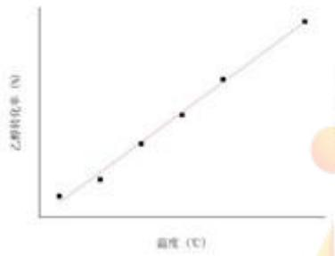  
图 5.1-7 直线型

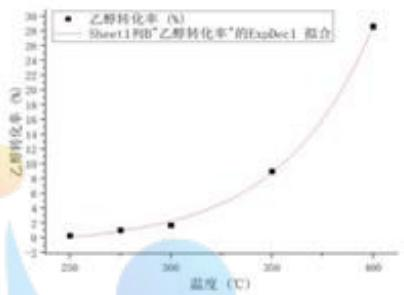  
图 5.1-8 指数型

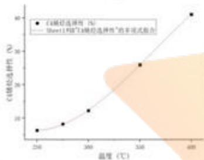

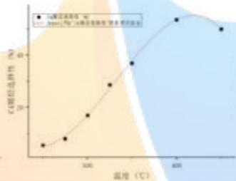

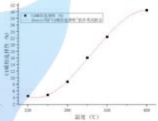  
图5.1-9 三次无峰值型 图5.1-9 三次有峰值型 图5.1-10 即将存在峰值型

(1) 直线型拟合表示：在一定范围内，乙醇转化率随温度的增大均匀增大。

(2) 指数型拟合表示：在一定范围内，乙醇转化率随温度的增大变化速率加快，呈现指数增长特征。

(3)三次多项式无峰值型拟合表示：在一定范围内，C4烯烃选择性随着温度的变化逐渐增大，呈现三次多项式增长部分特征。

(4)三次多项式有峰值型拟合表示：在一定范围内，C4烯烃选择性随着温度的变化不单调，在某温度时C4烯烃选择性有最大值。

(5)三次多项式即将存在峰值型拟合表示：在一定范围内，C4烯烃选择性随着温度的变化逐渐增大，但在观测数据末端的斜率值接近于0，这说明在此基础上进一步升高温度，将会出现最大值。

## 5.1.2.3 两个指标与温度关系的分类

通过分析上述求解得出的具体函数方程，我们可将21种催化剂组合进行分类，分类结果表如下：

表5.1-2 21种催化剂组合分类情况
<table><tr><td rowspan=1 colspan=1>编号</td><td rowspan=1 colspan=1>乙醇转化率与温度拟合方程类型</td><td rowspan=1 colspan=1>C4 烯烃选择性与温度拟合方程类型</td><td rowspan=1 colspan=1>组号</td></tr><tr><td rowspan=1 colspan=1>①</td><td rowspan=1 colspan=1>线性型</td><td rowspan=1 colspan=1>不存在峰值</td><td rowspan=1 colspan=1>A2、A4、A6、A7</td></tr><tr><td rowspan=1 colspan=1>②</td><td rowspan=1 colspan=1>线性型</td><td rowspan=1 colspan=1>存在峰值</td><td rowspan=1 colspan=1>A3</td></tr><tr><td rowspan=1 colspan=1>③</td><td rowspan=1 colspan=1>指数型</td><td rowspan=1 colspan=1>不存在峰值</td><td rowspan=1 colspan=1>A5、A8、A9、A10、A11、A12、A14、B1、B2、B3、B4、B5、B7</td></tr><tr><td rowspan=1 colspan=1>④</td><td rowspan=1 colspan=1>指数型</td><td rowspan=1 colspan=1>存在峰值</td><td rowspan=1 colspan=1>A1</td></tr><tr><td rowspan=1 colspan=1>⑤</td><td rowspan=1 colspan=1>指数型</td><td rowspan=1 colspan=1>即将存在峰值</td><td rowspan=1 colspan=1>A13、B6</td></tr></table>

## 5.2问题一第二部分：350度时某催化剂组合单次实验测试结果分析

为了对附件2中反应温度为350度时某种催化剂组合在单次实验不同时间测试结果进行分析，我们首先在附件一基础上分析得出乙醇催化偶合制备C4烯烃的整体反应过程，明确各指标间的关系；之后针对附件2重要指标的数据利用数学方法拟合出具体变化图像进行分析，得出在350度时乙醇转化率、C4 烯烃选择性、C4烯烃收率等指标随时间变化的规律，并分析出该条件下生成C4烯烃主反应的反应平衡时间以及副反应进程情况；最终根据后续第三问建立的模型反推出附件2具体的催化剂组合情况。

## 5.2.1 乙醇催化偶合制备 C4 烯烃的整体反应过程

我们通过对性能数据表中给出的数据进行综合分析，结合相关文献，大体明确了乙醇催化偶合制备C4烯烃可能的整体反应过程：

首先乙醇先在 $C o / S i O _ { 2 }$ 催化下转换成中间产物乙醛，HAP的加入降低了乙醛的选择性，催化乙醛转化为C4烯烃和碳数为4-12脂肪醇的催化剂。在适当条件下，当温度低于350度时，碳数为4-12脂肪醇为主产物：温度高于350度时，C4 烯烃为主产物。甲基苯甲醛和甲基苯甲醇为加入HAP条件下的副产物，乙烯为生成C4烯烃时的副产物。

由此可见，在适当条件下，350度是主产物从碳数为4-12脂肪醇转变为C4烯烃的关键温度。附件2表示某组合单次实验在350度条件下，各指标随着时间变化的情况。

## 5.2.2各指标随时间变化规律分析

我们对附件二中所有指标进行了分析，并选取乙醇转化率、C4烯烃选择性、C4烯烃收率等重要指标结合时间变化进行具体分析。

## (1) 乙醇转化率随时间变化关系

根据附件2中数据，我们利用Origin软件进行了曲线拟合，拟合图如下：

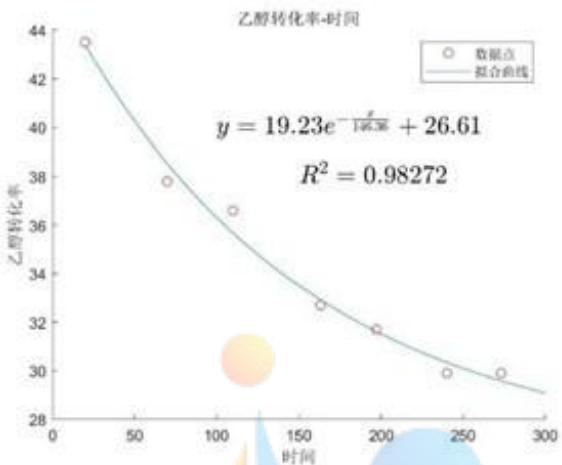  
图5.2-1 乙醇转化率随时间呈指数衰减特征

可直观分析出乙醇转化率随着时间的推移逐渐下降，呈现指数型衰减特征。且拟合曲线 $R ^ { 2 } = 0 . 9 8 2 7 2$ ，这说明拟合效果良好。且在240min和273min时，乙醇转化率均为29.9%未发生变化，这说明在197min-273min中间的某个时刻，某些化学反应可能达到了平衡状态。

## (2) C4 烯烃选择性随时间变化关系

根据附件 2 中数据，我们发现C4 烯烃选择性始终在39%左右波动，且在240min时取到观测数据中的最大值，273min时略微下降。结合上述关于乙醇转化率的分析，可大致判断出在197min-273min时间段内，生成C4烯烃的反应可能达到平衡，但某些其他反应仍在进行。

## (3) C4 烯烃收率时间变化关系

C4烯烃收率=其乙醇转化率×C4烯烃选择性，根据附件2中数据，我们利用Origin软件进行了曲线拟合，拟合图如下：

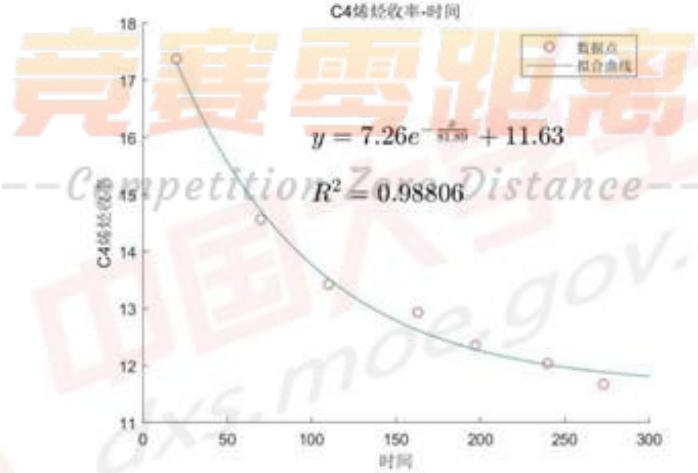  
图5.2-2 C4 烯烃收率随时间呈指数衰减特征

可直观分析出C4烯烃收率随着时间的推移逐渐下降，呈现指数型衰减特征。且拟合曲线R²=0.98806，说明拟合效果良好。

## (4) 乙醛选择性随时间变化关系

根据附件2中数据，我们发现乙醛选择性随着时间的推移逐渐升高，但在163min之后随时间推移增长幅度较小。由上述分析已知乙醇首先在催化剂条件下生成乙醛，乙醛是中间产物。乙醛选择性逐渐升高是由于乙醇始终以固定速率通入，直接在催化剂催化下反应转化为乙醛，但其他反应的推进取决于乙醛的浓度，有一定的滞后性，导致乙醛选择性随时间推移呈现逐渐升高的特征。

## (5) 碳数为4-12脂肪醇选择性随时间变化关系

根据附件2中数据，我们发现碳数为4-12脂肪醇选择性随着时间的推移大体呈现逐渐下降的特征，但在240min时略有回升，在273min又取到观测数据中的最小值。由上述分析已知碳数为4-12脂肪醇与C4烯烃属于竞争关系，两者选择性大小由反应温度影响。而在197min-240min时间段内，C4烯烃选择性和碳数为4-12脂肪醇选择性均略微增大又略微下降，这说明在该时间段内某时刻主反应可能已经达到了平衡状态，但其他反应向正方向进行速率大于主反应，其他反应生成产物增多导致C4烯烃和脂肪醇选择性均有所下降。

## (6) 其他产物随时间变化关系

根据附件2中数据，我们发现从240min变化至273min时，其他产物选择性明显变大，这说明在此时间段其他副反应产物生成速率大于主反应产物生成速率，间接说明在197min-273min某时刻，主反应可能达到平衡状态。

## 5.2.3 具体结论

(1)乙醇转化率随着时间的推移逐渐下降，呈现指数型衰减特征。

(2) C4 烯烃收率随着时间的推移逐渐下降，呈现指数型衰减特征。

(3) 在197min-273min时间段内，生成 C4 烯烃的主反应逐渐达到平衡，但其他副反应仍在进行。

(4) 碳数为4-12脂肪醇与C4烯烃为竞争关系，碳数为4-12脂肪醇选择性随着时间的推移整体逐渐下降，说明主反应向生成C4烯烃的方向进行较大。

(5)乙醇在催化剂催化下直接生成乙醛，乙醛是中间产物，其他反应的推进取决于乙醛的浓度，有一定的滞后性。

$$
\_ { } - \mathcal { C } o m p e t i t i o n \ Z e r o D i s t a n e e -- 
$$

## 5.3问题二：探讨不同催化剂组合及温度对重要指标的影响

## 5.3.1基于逐步线性回归与主成分分析的多元回归模型建立

通过对附件一中的21组数据进行组与组之间的纵向对比，可知当催化剂组合与温度发生变化时，乙醇转化率与C4烯烃选择性的值也发生了相应的变化，即纵向对比中存在以乙醇转化率、C4烯烃选择性为因变量，催化剂组合、温度为自变量的函数关系。

根据题意，我们需要实现：

(1)根据自变量催化剂组合、温度的值，预测因变量乙醇转化率、C4烯烃选择性的取值，并在此基础上分析预测的精度，进行误差分析。

(2)在自变量催化剂组合、温度之间进行因素分析，区分重要因素与次要因素，并确立其关系。

(3)在定性分析的基础上，进行定量分析，确定变量之间的相关关系，找出合适的数学表达式。

出于以上3点考虑，我们选择对上述变量进行回归分析，考察因素之间的相关性以及变量之间的数量变化规律，最终通过回归方程的形式反映该关系。

## 5.3.1.1 两种装料方式的分析

题目已给出编号A1\~A14的催化剂实验中使用装料方式I，B1\~B7的催化剂实验中使用装料方式II。我们首先要对两种不同装料方式进行分析。在附件1性能数据表中我们发现A12和B1组除装料方式有区别外，其他任何变量均无差别。根据对比实验控制变量法则，我们对这两组实验数据进行分析，分析对比图如下：

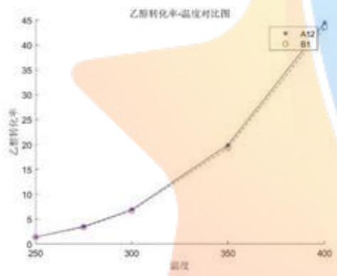

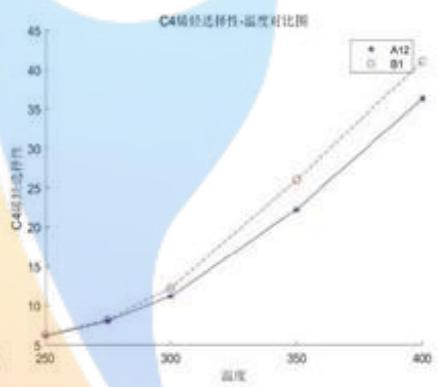

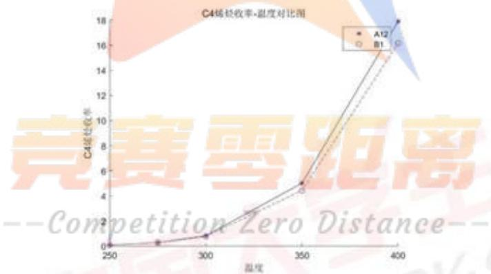  
图5.3-1：A12与B1组重要指标随温度变化对比图

从对比图中可直观分析出，A12与B1乙醇转化率、C4烯烃选择性、C4烯烃收率随温度的变化情况基本相同，并无明显差异。

这说明两种装料方式对重要指标的变化并无显著影响。因此在后续多元回归分析模型建立及BP神经网络训练时，可将A、B组进行统一处理。

## 5.3.1.2回归变量的确定

为了进行回归分析，我们需要将参与回归的变量处理为Matlab可分析的数值型变量，或以等级变量的形式对其分类。

## (1) 自变量

本题中的自变量有催化剂组合与温度，其中催化剂组合为综合型变量，温度为数值型变量。因此我们需对催化剂组合进行分解。

以催化剂组合A1为例，“200mg 1wt%Co/SiO2- 200mg HAP-乙醇浓度1.68ml/min”我们可将其分解为如下的5个子变量：

① ${ C o } / { S i O _ { 2 } }$ 的质量 ${ M _ { C o / S i O _ { 2 } } }$

② ${ \pmb { H } } { \pmb { A } } { \pmb { P } }$ 的质量 $M _ { H A P }$

③ ${ C o } / { S i O _ { 2 } }$ 与 ${ \pmb { H } } A P$ 的装料比（质量比） $\scriptstyle { P _ { 1 } }$

④ $\pmb { C o }$ 负载量 $( C o$ 与 $s i o _ { 2 }$ 的质量比) $\boldsymbol { P } _ { 2 }$

⑤乙醇浓度c

加上温度T，共有6个自变量参与回归分析。

## (2) 因变量

本题中的因变量有乙醇转化率与C4烯烃选择性，二者皆为数值型变量，可直接进行计算，故共有2个因变量参与回归分析。

## 5.3.1.3 回归模型的基本假定

(1)对于回归模型的计算结果，我们需要一个随机误差项来评价该模型的误差程度，这里我们遵循高斯一马尔可夫假定：随机误差项服从一个零均值、同方差的正态分布，即： $\displaystyle u \sim N ( 0 , \sigma ^ { 2 } )$

(2)解释变量之间不存在多重共线性。

## 5.3.1.4 逐步线性回归模型

对于5.2.1中确定的6个自变量以及2个因变量，我们可以得到一个多元线性回归模型：

$$
\left\{ y _ { i } = \beta _ { 0 } + \sum _ { j = 1 } ^ { 6 } \beta _ { j } x _ { j } \ : + u , \ : i = 1 , 2 \right.\tag{5.3.1}
$$

其中 $\beta _ { j } , j = 0 , \ldots , 6$ 为回归系数。

基于该模型我们可以得到n个独立观测数据 $[ b _ { i } , a _ { i 1 } , \ldots , a _ { i 6 } ]$ ，其中 $b _ { i }$ 为 $y$ 的观测值， $a _ { i 1 } , \dots , a _ { i 6 }$ 分别为 $x _ { 1 } , \ldots , x _ { 6 }$ 的观测值， $i = 1 , \dots , n , n > 6$ 6

由此可将模型优化得到：

$$
\begin{array} { l } { { \displaystyle \left\{ b _ { i k } = \beta _ { 0 } + \sum _ { j = 1 } ^ { 6 } \beta _ { j } a _ { i j } \ + u , \qquad k = 1 , 2 \right. } } \\ { { \displaystyle \left. \begin{array} { l } { { \displaystyle } } \\ { { \displaystyle u _ { i } \sim N ( 0 , \sigma ^ { 2 } ) , \ } } \end{array} \right. \qquad i = 1 , \ldots , n } } \end{array}\tag{5.3.2}
$$

由于该多元线性回归模型在处理变量时一次性引入全部变量，因此对于某些显著性水平存在较大偏差的变量，误差水平较高。为了解决此问题，考虑引入逐步回归的思想，即将变量逐个引入模型，每引入一个变量后都对其进行一次检验，测试其p值（其反映每个自变量对因变量的影响显著性水平，当某一个自变量的$p$ 值 $< 0 .$ 05时，我们称其对因变量的影响显著)。

可以看出，逐步回归是一个反复的过程，直到既没有显著的解释变量被选入回归方程，也没有不显著的解释变量从回归方程中被剔除为止，而经历过逐步回归优化后的多元线性回归模型就可以保证最终得到的解释变量最优。

## 5.3.1.5 主成分分析

在完成了5.3.1.3中的多元逐步线性回归后，容易产生较强的多重共线性，即回归方程中的多个解释变量之间的相关性过强。这就导致了回归系数的置信区间增大、精确度与显著性水平降低。

通过主成分分析，我们可以大幅削减多重共线性造成的自变量信息重叠对模型的负面影响。

为了便于评判，我们定义：

$R _ { i } ^ { 2 }$ 自变量与模型中其他自变量的负相关系数的平方，即该变量对其他变量进行线性回归的拟合优度。我们认为如果 $R ^ { 2 } \ge 0 . 8$ 则可以采用该组回归方程。

$T o l _ { i } = 1 - R _ { i } ^ { 2 }$ ：对于模型多重共线性的容忍度。

$\begin{array} { r } { V I T _ { i } = \frac { 1 } { 1 - R _ { i } ^ { 2 } } ; } \end{array}$ 方差膨胀因子。

在进行主成分分析时，我们先提取原始变量的主成分变量，而后将因变量对主成分变量进行回归，最后将主成分变量用原始自变量表示，即得到因变量对原始变量的回归方程。

## 5.3.2 问题二模型的求解

## 5.3.2.1 多元线性回归检验

首先由5.3.1中建立的线性模型，对 $x _ { i } , i = 1 , \ldots , 6$ 进行多元线性回归，得到结果如下：

① $\mathbf { y _ { 1 } }$ (乙醇转化率）关于x的回归方程

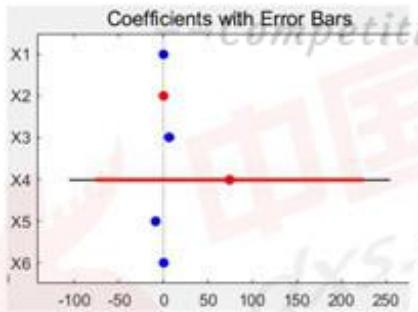  
图5.3-2: $y _ { 3 }$ 带误差条的系数

调整后的拟合优度：

$$
A d j R - s q = 0 . 7 9 5 4 3 3
$$

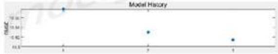  
图5.3-3 $y _ { 1 }$ 均方根误差的调整历史

## ② $\mathbf { y _ { 2 } }$ (C4 烯烃选择性）关于x的回归方程

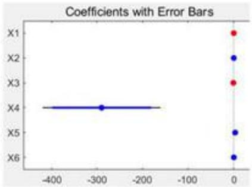  
图5.3-4: $y _ { 2 }$ 带误差条的系数

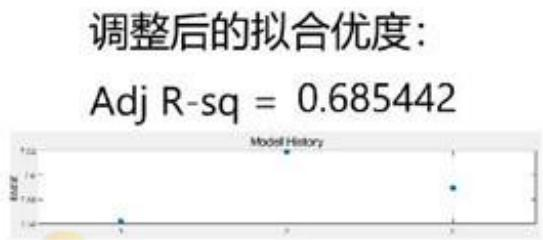  
图5.3-5 $y _ { 2 }$ 均方根误差的调整历史

由图可以看出， $y _ { 1 }$ $y _ { 2 }$ 的各个变量 $p$ 值很小，但其调整后的 $R ^ { 2 }$ 值都没有超过0.8，因此该结果不能被接受，还需通过进一步的改进以提升 $R ^ { 2 }$

## 5.3.2.2 处理非线性变量

通过对问题一的求解，我们已知：

(1) 乙醇转化率满足：

$$
y _ { 1 } ^ { * } = A _ { 1 } e ^ { \frac { x } { t _ { 1 } } } + y _ { 0 }\tag{5.3.3}
$$

(2) C4 烯烃选择性满足：

$$
y _ { 2 } ^ { * } = a _ { 1 } x ^ { 3 } + a _ { 2 } x ^ { 2 } + a _ { 3 } x + a _ { 4 }\tag{5.3.4}
$$

其中 $_ { x }$ 为温度 $\boldsymbol { r }$ 。

由（1）知，对于乙醇转化率 $y _ { 1 }$ ，可进行取对数处理，则 $\log { ( y _ { 1 } ) }$ 与x成线性关系：

由（2）知，对于C4烯烃选择性，我们在原有的6个变量外再增添一个变量$T ^ { 3 }$ ，记为 $x _ { 7 }$ ，则 $y _ { 2 }$ 与 $x ^ { 3 }$ 成线性关系。

经过上述的非线性处理，我们对处理后的数据再次进行逐步线性回归分析，结果如下：

## ① 非线性处理后 $\mathbf { \dot { y _ { 1 } ^ { * } } }$ （乙醇转化率）关于 $_ { x }$ 的回归方程

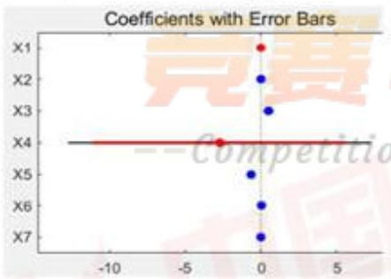  
图5.3-6: $y _ { 1 } ^ { * }$ 带误差条的系数

调整后的拟合优度：

$$
A d j R - S 9 \approx 0 . 8 2 8 9 1 6
$$

  
图5.3-7 $y _ { 1 } ^ { * }$ 均方根误差的调整历史

② 非线性处理后 $y _ { 2 } ^ { * }$ (C4 烯烃选择性)关于x的回归方程

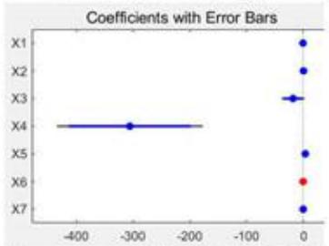  
图5.3-8: $y _ { 2 } ^ { * }$ 带误差条的系数

调整后的拟合优度：

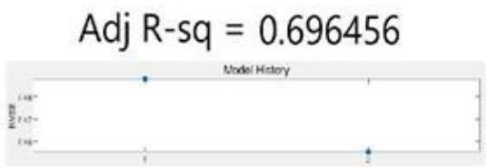  
图5.3-9 $y _ { 2 } ^ { * }$ 均方根误差的调整历史

由上图分析可知： $y _ { 1 } ^ { * } , y _ { 2 } ^ { * }$ 的各个变量 $p$ 值仍然很小，在经过我们的调整之后乙醇转化率的 $R ^ { 2 }$ 得到了显著提升，由原来的0.78上升到0.83，符合标准。而调整之后C4烯烃选择性的R²提升并不明显，且远没有达到0.8。所以我们需要对于数据进行下一步的处理。

## 5.3.2.3 增加交互项

我们对于上述所做回归分析的 $R ^ { 2 }$ 并不理想，所以考虑加入二次项 $x _ { i } x _ { j } ( 1 \leq$ $i \le j \le 6 )$ ，模型记作

$$
y = a _ { o } + \sum _ { i = 1 } ^ { 7 } a _ { i } x _ { i } + \sum _ { 1 \leq i \leq j \leq 6 } a _ { i j } x _ { i } x _ { j }\tag{5.3.5}
$$

在具体计算中，我们设 $x _ { 8 } = x _ { 1 } ^ { 2 } , x _ { 9 } = x _ { 2 } ^ { 2 } , \ldots , x _ { 2 8 } = x _ { 5 } x _ { 6 }$

在增加交互项之后， 再一次对含有二次项数据进行逐步线性回归分析，具体结果如下：

## ① 增加交互项后 $y _ { 1 } ^ { * }$ （乙醇转化率）关于x的回归方程

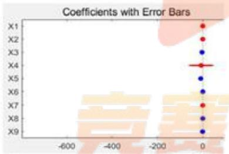  
图5.3-10: $y _ { 1 } ^ { * }$ 带误差条的系数

调整后的拟合优度：

$$
A d j R - S 9 = 0 . 9 3 4 9 9 4
$$

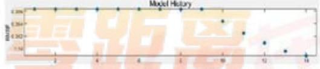  
图5.3-11 yi均方根误差的调整历史

② 增加交互项后 $y _ { 2 } ^ { * }$ (C4 烯烃选择性）关于x的回归方程

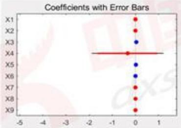  
图5.3-12: $y _ { 2 } ^ { * }$ 带误差条的系数

调整后的拟合优度：

$$
\mathsf { A d j } \mathsf { R } \mathsf { - } \mathsf { S q } = 0 . 8 0 2 7 8 6
$$

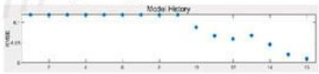  
图5.3-13 $y _ { 2 } ^ { * }$ 均方根误差的调整历史

根据回归分析的结果可以看出，两个回归结果的 $R ^ { 2 }$ 值进一步得到了提高，且都上升到0.8以上。这说明此时回归的效果很好，但无法看出各个项目的权值所以需要对于所有的数据进行归一化处理。

我们这里使用z-score标准化：

$$
\widehat { x _ { k l } } = \frac { x _ { k l } - \mu _ { k } } { \sigma _ { k } } , k = 1 , 2 \ldots , 2 8 , l = 1 , 2 , \ldots , 1 1 4\tag{5.3.6}
$$

其中 $\mu _ { k }$ 为 $x _ { k l }$ 的平均值， $\sigma _ { k }$ 为 ${ x } _ { k l }$ 的标准差。

在做完数据归一化处理之后，再次使用逐步回归法分析数据，可以得到催化剂组合及温度对乙醇转化率以及C4 烯烃选择性的具体回归方程，如下所示：

## (1) 以乙醇转化率为因变量的回归方程

$$
\begin{array} { r l } & { \ln \widehat { y _ { 1 } } = 0 . 7 1 \widehat { x _ { 3 } } - 1 . 8 9 \widehat { x _ { 5 } } + 1 . 4 1 \widehat { x _ { 6 } } - 0 . 8 2 \widehat { x _ { 2 } ^ { 2 } } - 0 . 4 2 \widehat { x _ { 3 } ^ { 2 } } - 0 . 2 5 \widehat { x _ { 4 } ^ { 2 } } + 0 . 6 2 \widehat { x _ { 5 } ^ { 2 } } } \\ & { \qquad - 0 . 9 8 \widehat { x _ { 6 } ^ { 2 } } + 0 . 2 7 \widehat { x _ { 1 } x _ { 4 } } + 0 . 5 3 \widehat { x _ { 1 } x _ { 5 } } + 1 . 6 5 \widehat { x _ { 1 } x _ { 6 } } + 0 . 9 4 \widehat { x _ { 2 } x _ { 3 } } } \\ & { \qquad - 2 . 0 4 \widehat { x _ { 2 } x _ { 6 } } + 0 . 8 9 \widehat { x _ { 5 } x _ { 6 } } } \end{array}
$$

(2) 以C4 烯烃选择性为因变量的回归方程

$$
\begin{array} { r l } { \widehat { y _ { 2 } } = } & { - 0 . 5 5 \widehat { x _ { 5 } } - 1 1 . 6 9 \widehat { x _ { 6 } } - 1 . 5 5 \widehat { x _ { 4 } ^ { 2 } } + 2 3 . 5 7 \widehat { x _ { 6 } ^ { 2 } } + 0 . 2 3 \widehat { x _ { 1 } x _ { 4 } } + 0 . 6 1 \widehat { x _ { 1 } x _ { 5 } } } \\ & { \qquad - 1 . 3 8 \widehat { x _ { 1 } x _ { 6 } } - 1 . 0 7 \widehat { x _ { 2 } x _ { 3 } } + 2 . 3 1 \widehat { x _ { 2 } x _ { 6 } } + 1 . 7 6 \widehat { x _ { 4 } x _ { 5 } } - 0 . 5 4 \widehat { x _ { 4 } x _ { 6 } } } \\ & { \qquad - 1 1 . 2 9 \widehat { x _ { 6 } ^ { 3 } } } \end{array}
$$

## 5.3.2.4 影响分析

对于归一化以后的回归方程，将会没有常数项，所以在回归方程中系数越大的项对于结果的影响最大。

## (1) 乙醇转化率影响因素分析

根据5.3.2.3中（1）回归方程可知， $x _ { 2 } x _ { 6 }$ 的系数最大， $x _ { 5 }$ 的系数次之，之后依次是 $x _ { 1 } x _ { 6 } , x _ { 6 } , x _ { 6 } ^ { 2 }$ 的系数。这说明 $x _ { 6 } , x _ { 5 }$ ，即温度和乙醇浓度对于乙醇的转化率影响最大。同时也反过来验证了我们在第一问中拟合函数选择的合理性，即乙醇转化率相对于温度是呈指数型增长的。 IP

## (2) C4 烯烃选择性影响因素分析

根据5.3.2.3中（2）回归方程可知，x2的系数最大， $x _ { 6 }$ 的系数次之，之后依次是 $x _ { 6 } ^ { 3 } , ~ x _ { 2 } x _ { 6 }$ 的系数，且 $x _ { 6 } ^ { 2 } , \ x _ { 6 } , \ x _ { 6 } ^ { 3 }$ 的系数远远大于其他的项。这说明温度对于C4烯烃选择性的显著性影响最大。且因为 $x _ { 6 } ^ { 2 } , ~ x _ { 6 } , ~ x _ { 6 } ^ { 3 }$ 的系数很大，同时也反过来验证了第一问我们选取三次多项式拟合的合理性。

综上所述，对于乙醇的转化率，温度对于结果的显著性影响最大，其次是乙醇浓度；而对于C4烯烃选择性，也是温度对于结果的影响最大。

## 5.4 问题三：以C4烯烃收率尽可能高为目标的方案选取

根据题目可知，C4 烯烃收率 ω = 乙醇转化率η × C4 烯烃选择性 z。为了求解出以C4烯烃收率尽可能高为目标的方案，我们首先考虑将问题二中求解出的具体方程相乘得出C4烯烃收率与催化剂组合、温度等变量的函数关系。但由于问题三缺乏等式与不等式约束，导致利用非线性规划求解时，在搜寻最优解的过程中易陷入多次迭代的误区，只能找到局部最优解，且结果与实际情况误差较大。考虑到现有数据集具有非线性特征，结合BP神经网络具有非线性映射能力、自学习及自适应能力、泛化能力、容错能力等特征，因此我们考虑利用BP神经网络进行建模及求解。

## 5.4.1 基于BP 神经网络模型对于相同实验条件下最优方案的选取

## 5.4.1.1 BP 神经网络原理

我们首先需要定量地研究不同催化剂组合对于C4烯烃选择性的影响，考虑引入人工神经元模型，下图展示了人工神经网络基本单元的神经模型[3]

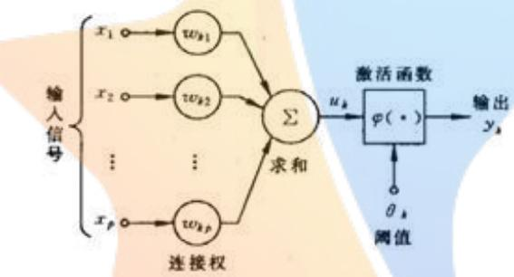  
图5.4-1：人工神经网络基本单元的神经模型

在这里输入信号 $x _ { 1 } , x _ { 2 } , \ldots , x _ { 6 }$ 的含义与前文相同。我们可以通过这六个数据来确定一种催化剂的组合和温度，输出值 $y _ { 1 } , y _ { 2 } , y _ { 3 }$ 分别表示乙醇转化率，C4烯烃选择性和C4烯烃收率。对于该种人工神经元模型有三个基本要素：

(1)一组连接，连接强度由连接上的权值表示，权值正表示激活，负表示抑制。

(2) 一个求和单元，可用于求取输入信号，即催化剂组合的加权和。

(3) 一个非线性激活函数，起到非线性映射的作用并将输出限制在一定范围。在这里转化率，选择性和收率的范围均为(0,1)。

上面几点可用数学表达式表示为

$$
u _ { k } = \sum _ { j = 1 } ^ { 6 } w _ { k j } x _ { j } , v _ { k } = u _ { k } - \theta _ { k } , y _ { k } = \phi ( v _ { k } ) , k = 1 , 2 , 3\tag{5.4.1}
$$

其中 $w _ { k 1 } , w _ { k 2 } , \dots , w _ { k 6 }$ 为神经元k的权值， ${ \boldsymbol { u } } _ { k }$ 为线性组合的结果， $\theta _ { k }$ 为阈值， $\phi$ 为激活函数。激活函数φ可能会有阶梯函数，分段线性函数和sigmoid函数等。

这里我们使用的BP（Back Propagation）神经网络具有三层或三层以上的多层神经网络，每一层都有如上述所示的若干个神经元组成。一般来说BP网络的

学习算法有四个步骤：

(1) 初始化网络和学习参数。

(2)提供训练模式，训练网络，直到满足学习需求。

(3)前向传播过程：即输入不同的催化剂组合参数，计算输出值 $y _ { 1 } , y _ { 2 } , y _ { 3 }$ 与期望模式比较。如有误差，执行步骤（4），否则返回步骤（2）。

(4)反向传播过程：计算同一层单元的误差，修正权值 $w _ {  k 1 } , w _ { k 2 } , \ldots , w _ { k 6 }$ 和阈值 $\theta _ { k }$ ，返回步骤（2）。

## 5.4.1.2 利用 Matlab 的神经网络工作箱 Neural Net Fitting 训练模型

我们将自变量作为输入，因变量作为目标导入神经网络工作箱，并按照一定的比例将这些样本分为三类进行处理：训练集（70%）、检验集（15%）、测试集(15%)。 A

## (1) 自变量及因变量的选取

其中，自变量我们保留 $C o / S i O _ { 2 }$ 的质量 $M _ { C o / S i O _ { 2 } }$ 、HAP的质量 $M _ { H A P }$ , $c o$ 负载量(Co与 $S t O _ { 2 }$ 的质量比） $\mathcal { P } _ { 2 }$ 、乙醇浓度c及温度T。考虑到在神经网络中已知 $( C o / S i O _ { 2 }$ 的质量 $M _ { C o / S i O _ { z } }$ 与 $H A P$ 的质量 $M _ { H A P }$ 即可推知 $C o / S i O _ { 2 }$ 与 $H A P$ 的装料比（质量比）$\boldsymbol { P } _ { 1 }$ ，故将其删去，共计5个自变量。

对于因变量，由于题中要求我们计算最大的C4烯烃的收率，且已知：C4烯烃的收率 $\omega = Z$ 醇转化率η×C4烯烃选择性z，故只需一个因变量即可。

## (2) 神经元个数及模型训练方法的确定

接下来我们需要选定隐藏神经元的个数以及模型的训练方法来完成对模型的训练。经过大量的尝试，最终我们选用隐藏神经元个数为5，模型训练方法为贝叶斯正则化。

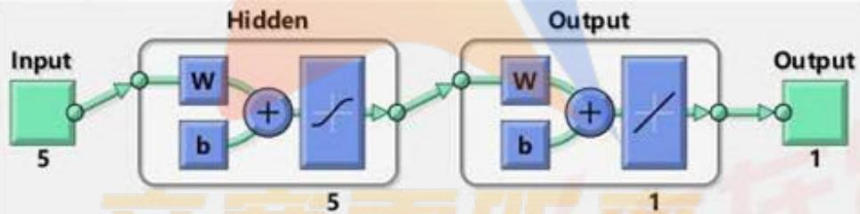  
图5.4-2：针对该问题的5个输入5个神经元的BP神经网络模型

## 5.4.1.3 各参数的检验

完成模型的训练后，我们对其参数进行检验：

## (1) 训练数据结果分析

由下图结果可知，在第493代时达到了最优的训练效果，并以这一代的模型作为训练模型。

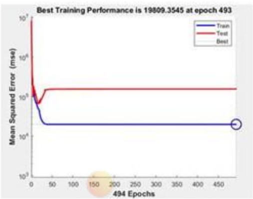  
图 5.4-3：第493代时最优训练效果

## (2) 训练数据梯度与均方误差之间的关系

由下图可知，训练数据的梯度与均方误差都随着代数的增加而渐趋稳定，可以看出训练模型的结果较为稳定。

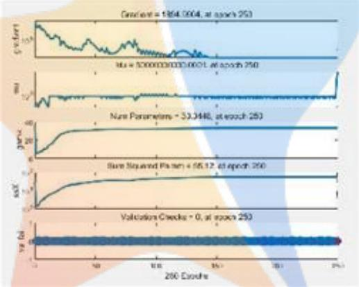  
图 5.4-4：训练数据梯度与均方误差变化图

## (3) 训练数据的历史残差

由下图可知，历史残差大致成正态分布，在高次迭代中可以被接受。

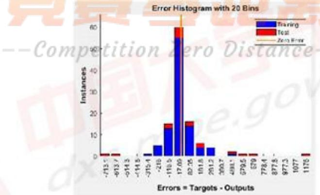  
图5.4-5：训练数据的历史残差图

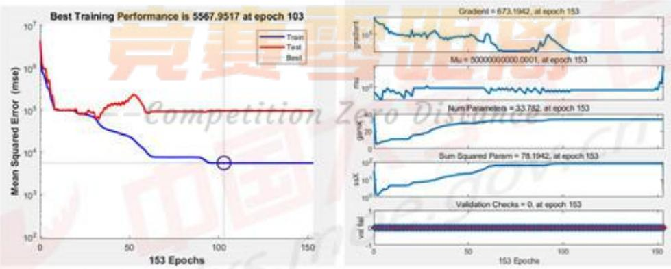

## (4) 训练集、测试集及全部数据的R值

由下图分析可知，三组数据的R值都出于接近1的水平，可以看出该模型的拟合优度很高。

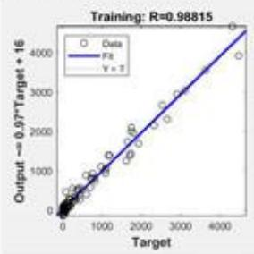

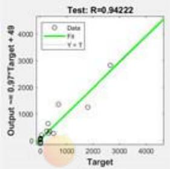  
图5.4-6：训练数据的历史残差图

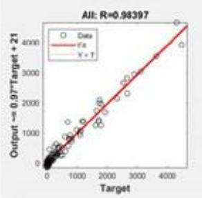

综上（1）-(4)，该模型经BP神经网络训练后的结果可以被接受。

## 5.4.1.4 相同实验条件下最优方案

接下来，我们按照现有的实验条件，对各个自变量的所有取值进行组合，通过训练出的模型遍历所有的组合，记录其中最大的C4烯烃收率，以及当C4烯烃收率取得最大值时的所有自变量取值。结果如下：

最大的C4烯烃收率：51.31%

催化剂组合：200mg 0.5wt%Co/SiO2-200mg HAP-乙醇浓度0.3ml/min

温度：450度

## 5.4.2 温度低于 350 度时最优方案的选取

若使温度低于350度，则只需将上述变量中温度T取值高于350度的数据剔除，对于剩余的变量，按照上述的BP神经网络模型进行分析，计算其最大的C4 烯烃收率。

此时的BP神经网络训练指标如下：

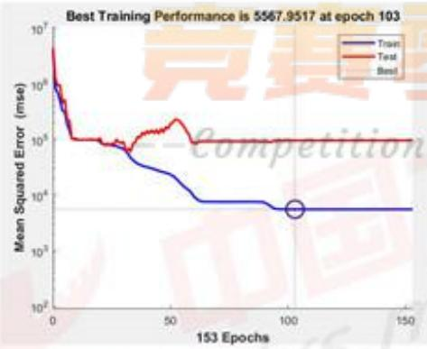

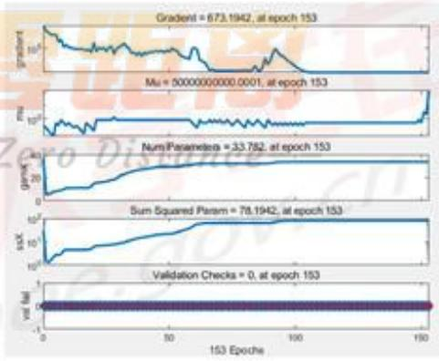

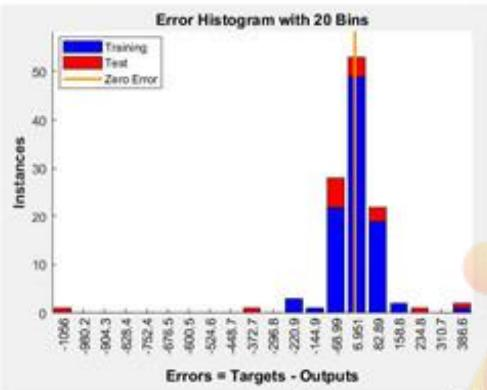

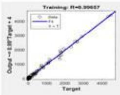

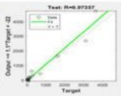

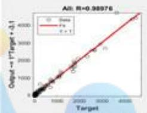  
图5.4-7：温度低于350度时各参数图

经分析可知，该模型经BP神经网络训练后的结果可以被接受。

当温度低于350度时，BP神经网络模型求解出的最大的C4烯烃收率结果如下：

最大的C4烯烃收率：38.47%

催化剂组合：200mg2wt%Co/SiO2-200mg HAP-乙醇浓度2.1ml/min温度：350度

## 5.5 问题四：增加5 次实验的设计方案

为了给出增加5次实验的具体设计方案，这需要结合前三问分析得出的结论与建立的BP神经网络模型，在此基础上进行增加实验的设计。我们从寻找全局最优解和对第三问模型进行检验两个角度出发，设计出2组5次实验：

第1组实验用于寻找C4烯烃收率在全局范围内的最优峰值，根据通过欧式距离建立的广度模型以及在神经网络模型中确定的各个自变量权重，我们可以初步确定C4烯烃的收率在全局范围内存在一个峰值，由于在出现峰值前C4烯烃的收率单调递增，在出现峰值后C4烯烃的收率单调递减，因此我们需在峰值前、峰值处、峰值后各做3次实验，依此确定峰值的合理性。

第2组实验则用于验证问题三中求解出的两组最优值是否符合预测值，我们在问题三中利用神经网络模型对全温度、低于350度的现有实验条件进行了搜索，但找到的只是我们通过模型得到的预测值，因此我们需要对全温度、低于350度的数据各进行一次实验，以此比较实验值与预测值的差距，并进行误差分析。

## 5.5.1 增加实验设计方案模型的建立

## 5.5.1.1 基于欧式距离的权重搜索模型

根据前文模型建立过程可知，我们可通过五个数据来确定一组催化剂和温度的组合，即 $( x _ { 1 } , x _ { 2 } , x _ { 3 } , x _ { 4 } , x _ { 5 } )$ 。记附件1中所有已经进行过的共114组实验组合为矩阵P，其中

$$
P = { \left[ \begin{array} { l l l } { x _ { 1 1 } } & { \cdots } & { x _ { 1 5 } } \\ { \vdots } & { \ddots } & { \vdots } \\ { x _ { 1 1 4 , 1 } } & { \cdots } & { x _ { 1 1 4 , 5 } } \end{array} \right] }\tag{5.5.1}
$$

我们考虑进行一些与已做实验差距较大的实验，故可利用加权的欧式距离来做。因为数量级的差距巨大，首先需要进行标准化处理，这里我们选用Min-Max标准化方法：

先对 $x _ { i }$ 设置一个范围，使得 $x _ { i }$ 的数据选择只能在该范围内，不妨假设 $x _ { i } \in$ [minxi,maxxi]，然后据此我们对所有的数据进行标准化处理，记

$$
{ \widehat { x _ { k } } } _ { i } = { \frac { x _ { k i } - \operatorname* { m i n } x _ { i } } { \operatorname* { m a x } x _ { i } - \operatorname* { m i n } x _ { i } } }\tag{5.5.2}
$$

下面假设我们选取的催化剂和温度组合为 $( x _ { 1 } ^ { * } , x _ { 2 } ^ { * } , x _ { 3 } ^ { * } , x _ { 4 } ^ { * } , x _ { 5 } ^ { * } )$ ，对于每一种变量赋予一个权重 $w _ { i } , i = 1 , 2 , 3 , 4 , 5 ,$ 这是因为在实验过程中，各个变量对于结果的影响并不相同，对于结果影响较大的需要赋予更大的权重。然后将所有的欧式距离加权并加和，可得距离的平方为

$$
d ^ { 2 } = \sum _ { j = 1 } ^ { 1 1 4 } \sum _ { i = 1 } ^ { 5 } w _ { i } \big ( x _ { i } ^ { * } - x _ { j i } \big ) ^ { 2 }\tag{5.5.3}
$$

所以我们的目标函数为

$$
y = \operatorname* { m a x } \sum _ { j = 1 } ^ { 1 1 4 } \sum _ { i = 1 } ^ { 5 } w _ { i } \big ( x _ { i } ^ { * } - x _ { j i } \big ) ^ { 2 }\tag{5.5.4}
$$

相应的约束为 $( x _ { 1 } ^ { * } , x _ { 2 } ^ { * } , x _ { 3 } ^ { * } , x _ { 4 } ^ { * } , x _ { 5 } ^ { * } )$ 的取值上下界。

## 5.5.2 增加实验设计方案模型的求解

## 5.5.2.1前3次实验：寻找C4烯烃收率在全局范围内的最优峰值

由于模型中的变量有5个，因此无法直观地看出这五维的欧式距离。这里我们可以在第三问中由神经网络模型得到5个变量的权重为：

$$
W e i g t h = ~ [ 2 2 . 8 3 , 3 5 . 9 0 , - 4 . 4 4 , - 1 0 . 9 0 , 6 9 . 9 9 ]
$$

基于此我们可以在全局搜索，发现若不局限于附件一中21组实验的实验条件，C4烯烃收率在全局范围内仍然存在一个要高于第三间中局部最优值的全局最优值。

经模型搜索，该全局最优值为一个峰值，即C4烯烃的收率在达到这个最优值前单调增加，在达到这个最优值后单调减少（该单调性可能不严格，即存在偶然性数据，但总体趋势呈现为单调)。

该全局的最优值约在 $X = [ 5 0 0 , 5 0 0 , 0 . 0 1 , 0 . 9 , 4 5 0 ]$ 附近，即催化剂组合500mg1wt%Co/SiO2-500mgHAP-乙醇浓度 0.9ml/min，温度450度。又由变量权重Weigth可知，Co负载量(Co与 $s i o _ { 2 }$ 的质量比) $\scriptstyle P _ { 2 } ,$ 乙醇浓度c所占权值较小，因此在设计实验时我们可将这两项固定在1wt%，0.9ml/min，不断改进 ${ C o } / { S i O _ { 2 } }$ 的质量 $M _ { C o / S i O _ { 2 } }$ 、HAP的质量 $M _ { H A P }$ 以及温度T来确定峰值的具体位置。

据此，我们可设计三组实验来寻找峰值：

(1) 催化剂组合：400mg 1wt%Co/SiO2-400mg HAP-乙醇浓度 0.9ml/min温度：400度

(2) 催化剂组合：500mg 1wt%Co/SiO2-500mg HAP-乙醇浓度 0.9ml/min温度：450度

(3) 催化剂组合：600mg 1wt%Co/SiO2-600mg HAP-乙醇浓度 0.9ml/min温度：500度

## 5.5.2.2后2次实验：验证问题三中求解出的两组最优值是否符合预测值

在问题三中，我们分别在全部温度、温度低于350度的条件下，按照现有的实验条件找到了使C4烯烃收率尽可能高的催化剂组合及温度。但是，在问题三中我们仅仅使根据神经网络模型搜索出的一个预测值，因此在这里我们设计两组实验来验证我们的预测结果，并将实际的实验值与预测值进行比较，实现进一步的误差分析。 A 4

据此，我们可设计两组实验来寻找峰值：

(1) 催化剂组合：200mg 0.5wt%Co/SiO2-200mg HAP-乙醇浓度 0.3ml/min温度：450度

(2) 催化剂组合：200mg 2wt%Co/SiO2-200mg HAP-乙醇浓度 2.1ml/min温度：350度

## 5.5.3 增加 5 次实验的具体设计方案

综上，我们共设计如下5组实验：

(1) 催化剂组合：400mg 1wt%Co/SiO2-400mg HAP-乙醇浓度0.9ml/min温度：400度

(2) 催化剂组合：500mg 1wt%Co/SiO2-500mg HAP-乙醇浓度0.9ml/min温度：450度

(3) 催化剂组合：600mg1wt%Co/SiO2-600mg HAP-乙醇浓度 0.9ml/min温度：500度

(4) 催化剂组合：200mg 0.5wt%Co/SiO2-200mg HAP-乙醇浓度 0.3ml/min温度：450度

(5) 催化剂组合：200mg2wt%Co/SiO2-200mg HAP-乙醇浓度 2.1ml/min温度：350度

## --Con六、结果检验和误差分析

## 6.1 问题三结果检验

第二问回归分析得到了两个回归方程，分别对应乙醇转化率和C4烯烃选择性。他们调整过后的R²分别是0.934994和0.802786，是符合>0.8的标准的。而我们在第三问中利用神经网络来预测时，C4烯烃收率的神经网络R²高达0.98。这说明利用神经网络学习的结果很好，具有可靠性。又因为C4烯烃收率为乙醇转化率乘C4烯烃选择性，如果我们使用两个回归方程相乘得到的关于C4烯烃收率的R²显然小于0.98。所以在第三问中选择用神经网络预测而非回归分析，这样可以大大减少误差。

## 6.2 误差分析

(1)第一问的前半部分我们找到了不同的函数对数据中的点进行拟合，拟合效果较好。但可能存在更优的函数。

(2)第二问中，虽然我们得到的 $R ^ { 2 }$ 都达到了0.8的水平，但是仍然有提高的空间。

(3)第三问中，如果选取不同的神经元个数可能会获得不同的结果。如果在选取相同神经元个数的情况下，重复训练也可能得到不同结果，每一次运行结果都有误差，并不稳定。

(4)在第四问中，对不同变量选取了不同的权重。权重的不确定性可能会导致误差的出现。

## 七、模型评价

## 7.1 模型优点

(1)模型在一定程度上准确且巧妙的描述了问题，并做出了一些简化，易于理解和解答。

(2)第一问对于函数的拟合效果较好，每个函数拟合出的 $R ^ { 2 }$ 都很接近1。

(3）第二问中我们根据第一问拟合的函数，对数据进行了优化，如取对数，增加二次项，归一化处理等。这样能很好反应哪些因素的影响更大。

(4)第三问中的R²的很接近1，说明拟合的效果很好。

(5)第四问通过设计实验，能够很好地验证前三问模型的合理性。

(6)程序运行时间较少，空间占用很小。

## 7.2 模型缺点

(1)回归分析的R²有待进行更多的提升。

(2)BP神经网络存在缺点，如收敛速度慢，网络易陷于局部极小，学习过程常常会发生震荡。

## 7.3 模型改进

(1)我们现有的解题方法是利用Matlab的神经网络工作箱进行机器学习。进一步地改进可以利用精度、效率更高的机器学习方式。

(2)回归分析中可以对数据进行进一步处理，增加非线性的回归项，以提高R²的值。 Competition Lero Vistance

## 八、参考文献

[1]吕绍沛.乙醇偶合制备丁醇及C\_4 烯烃[D].大连理工大学,2018.

[2]姜启源谢金星叶俊.数学模型[M].第五版.高等教育出版社,2018.

[3]司守奎孙兆亮.数学建模算法与应用[M].第2版.国防工业出版社,2019.

附录

## 参考文献

<table><tr><td rowspan=1 colspan=1></td></tr><tr><td rowspan=1 colspan=1>1、第一问 A1-B7 关系图 docx</td></tr><tr><td rowspan=1 colspan=1>2、A1.opju-A14.opju</td></tr><tr><td rowspan=1 colspan=1>3、A_group1-7.opju</td></tr><tr><td rowspan=1 colspan=1>4、B1.opju-b7.opju</td></tr><tr><td rowspan=1 colspan=1>5、B_group1-7.opju</td></tr><tr><td rowspan=1 colspan=1>6、乙醇转化率.opju</td></tr><tr><td rowspan=1 colspan=1>7、sandian.m</td></tr><tr><td rowspan=1 colspan=1>8、tuxiang1.m</td></tr><tr><td rowspan=1 colspan=1>9、tuxiang2.m</td></tr><tr><td rowspan=1 colspan=1>10、tuxiang3.m</td></tr><tr><td rowspan=1 colspan=1>11、tuxiang4.m</td></tr><tr><td rowspan=1 colspan=1>12、A12B1.m</td></tr></table>

1、第一问 A1-B7 关系图 docx  
A1:200mg 1wt%Co/SiO2-200mg HAP-乙醇浓度1.68ml/min

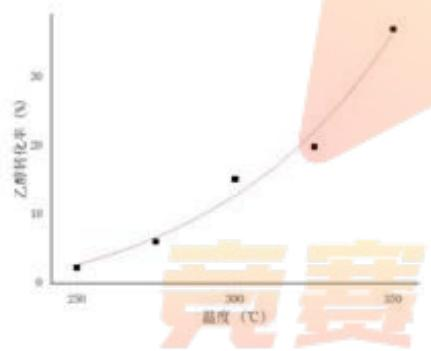

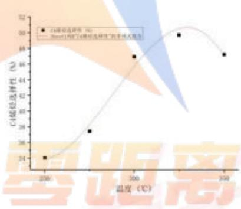  
A2:200mg2wt%Co/SiO2-200mg HAP-乙醇浓度1.68ml/min

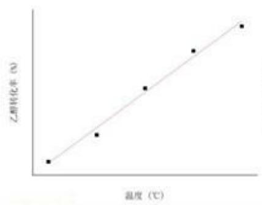

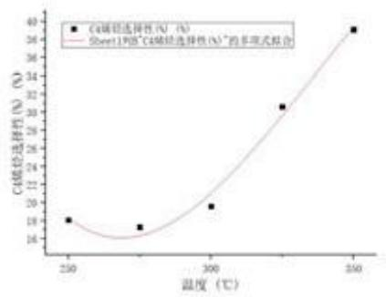

A3:200mg1wt%Co/SiO2-200mg HAP-乙醇浓度 0.9ml/min  
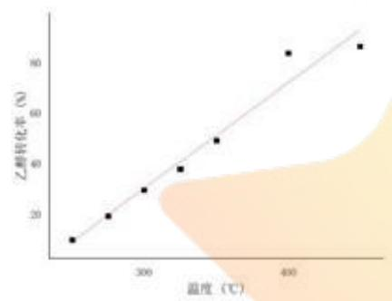

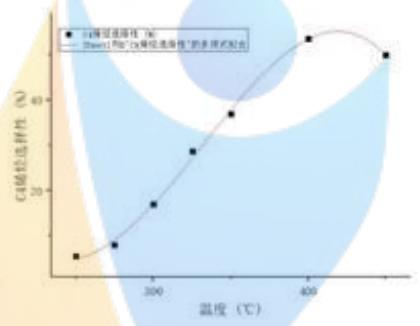

A4:200mg 0.5wt%Co/SiO2-200mg HAP-乙醇浓度1.68ml/min  
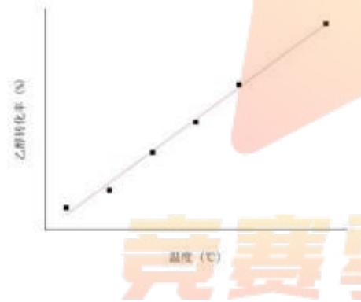

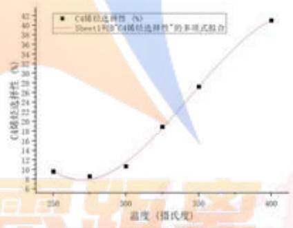  
A5:200mg 2wt%Co/SiO2-200mg HAP-乙醇浓度 0.3ml/min

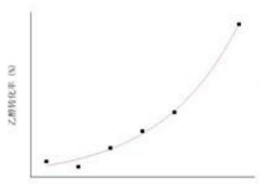  
温度（C)


A6:200mg 5wt%Co/SiO2-200mg HAP-乙醇浓度 1.68ml/min  


A7:50mg 1wt%Co/SiO2-50mg HAP-乙醇浓度0.3ml/min  


A8:50mg 1wt%Co/SiO2-50mg HAP-乙醇浓度 0.9ml/min  


  
A9:50mg 1wt%Co/SiO2-50mg HAP-乙醇浓度2.1ml/min


A10: 50mg 5wt%Co/SiO2- 50mg HAP-乙醇浓度 2.1ml/min  


  
A11:50mg1wt%Co/SiO2+ 90mg石英砂-乙醇浓度 1.68ml/min，无 HAP


A12:50mg 1wt%Co/SiO2-50mg HAP-乙醇浓度1.68ml/min  


  
A13:67mg1wt%Co/SiO2-33mg HAP-乙醇浓度1.68ml/min


A14:33mg 1wt%Co/SiO2-67mgHAP-乙醇浓度 1.68ml/min  


B1：50mg 1wt%Co/SiO2- 50mg HAP-乙醇浓度 1.68ml/min  


B2:100mg1wt%Co/SiO2-100mg HAP-乙醇浓度 1.68ml/min  


  
B3:10mg 1wt%Co/SiO2-10mg HAP-乙醇浓度1.68ml/min

  
温度（C）


B4:25mg 1wt%Co/SiO2-25mg HAP-乙醇浓度1.68ml/min  
  
温度(℃)


B5:50mg 1wt%Co/SiO2- 50mg HAP-乙醇浓度2.1ml/min  


B6:75mg 1wt%Co/SiO2-75mg HAP-乙醇浓度 1.68ml/min  


## B7:100mg 1wt%Co/SiO2-100mg HAP-乙醇浓度 0.9ml/min


2、A1.opju-A14.opju

3、A\_group1-7.opju

4、B1.opju-b7.opju

5、B\_group1-7.opju

6、乙醇转化率.opju

(以上无代码，详见支撑材料)

7、sandian.m

<table><tr><td colspan="1" rowspan="1">clc,clear</td></tr><tr><td colspan="1" rowspan="1">x1=[250 275 300 350 400];</td></tr><tr><td colspan="1" rowspan="1">y1=[2.8 4.4 6.2 16.2 45.1];</td></tr><tr><td colspan="1" rowspan="1">figure(1)</td></tr><tr><td colspan="1" rowspan="1">scatter(x1,y1,'r')</td></tr><tr><td colspan="1" rowspan="1">xlabel('温度');% 添加 x轴信息</td></tr><tr><td colspan="1" rowspan="1">ylabel('乙醇转化率') %添加y轴信息</td></tr><tr><td colspan="1" rowspan="1">title('编号 B2 乙醇转化率-温度（指数型）')；%添加标题</td></tr><tr><td colspan="1" rowspan="1">x2=[250 275 300 325 350];</td></tr><tr><td colspan="1" rowspan="1">y2=[4.60 17.20 38.92 56.38 67.88];</td></tr><tr><td colspan="1" rowspan="1">figure(2)</td></tr><tr><td colspan="1" rowspan="1">scatter(x2,y2,'r')</td></tr><tr><td colspan="1" rowspan="1">xlabel('温度')；%添加x轴信息</td></tr><tr><td colspan="1" rowspan="1">ylabel('乙醇转化率') % 添加 y 轴信息</td></tr><tr><td colspan="1" rowspan="1">title(编号A2乙醇转化率-温度((线性型));%添加标题ce</td></tr><tr><td colspan="1" rowspan="1">x3=[250 275 300 325 350];</td></tr><tr><td colspan="1" rowspan="1">y3=[34.05 37.43 46.94 49.7 47.21];</td></tr><tr><td colspan="1" rowspan="1">figure(3)</td></tr><tr><td colspan="1" rowspan="1">scatter(x3,y3,'r')</td></tr><tr><td colspan="1" rowspan="1">xlabel('温度');% 添加 x轴信息</td></tr><tr><td colspan="1" rowspan="1">ylabel(C4 烯烃选择性') % 添加 y 轴信息</td></tr><tr><td colspan="1" rowspan="1">title('编号 A1 温度-C4 烯烃选择性(存在峰值）');% 添加标题</td></tr><tr><td colspan="1" rowspan="1">x4=[250 275 300 350 400];</td></tr><tr><td colspan="1" rowspan="1">y4=[5.4 9.68 16.1 31.04 42.04];</td></tr><tr><td colspan="1" rowspan="1">figure(4)</td></tr><tr><td colspan="1" rowspan="1">scatter(x4,y4,'r')</td></tr><tr><td colspan="1" rowspan="1">xlabel('温度');% 添加 x轴信息</td></tr><tr><td colspan="1" rowspan="1">ylabel('C4 烯烃选择性') % 添加 y 轴信息</td></tr><tr><td colspan="1" rowspan="1">title('编号 A9 温度-C4 烯烃选择性(不存在峰值）');% 添加标题</td></tr></table>

## 8、tuxiang1.m

<table><tr><td rowspan=1 colspan=1>clc,clear</td></tr><tr><td rowspan=1 colspan=1>x1=[250 275 300 350 400];</td></tr><tr><td rowspan=1 colspan=1>y1=[1.4 3.4 6.7 19.3 43.6];</td></tr><tr><td rowspan=1 colspan=1>t=250:0.1:400;</td></tr><tr><td rowspan=1 colspan=1>s1=0.27947*t-73.14253;</td></tr><tr><td rowspan=1 colspan=1>s2=0.15982*exp(t/70.07161)-4.52592;</td></tr><tr><td rowspan=1 colspan=1>figure(1)</td></tr><tr><td rowspan=1 colspan=1>scatter(x1,y1,&#x27;r&#x27;)</td></tr><tr><td rowspan=1 colspan=1>hold on</td></tr><tr><td rowspan=1 colspan=1>plot(t,s1)</td></tr><tr><td rowspan=1 colspan=1>plot(t,s2,&#x27;-&#x27;)</td></tr><tr><td rowspan=1 colspan=1>xlabel(&#x27;温度&#x27;); % 添加 x轴信息</td></tr><tr><td rowspan=1 colspan=1>ylabel(&#x27;乙醇转化率&#x27;)%添加 y轴信息</td></tr><tr><td rowspan=1 colspan=1>title(&#x27;编号 B1 乙醇转化率-温度&#x27;); % 添加标题</td></tr><tr><td rowspan=1 colspan=1>legend(&#x27;数据点&#x27;,&#x27;线性型&#x27;&#x27;指数型&#x27;)</td></tr><tr><td rowspan=1 colspan=1>text(260,40,&#x27;$R_1^2=0.90075 R_2^2=0.99959$&#x27;,&#x27;interpreter&#x27;,&#x27;latex&#x27;,&#x27;FontSize&#x27;,15)</td></tr><tr><td rowspan=1 colspan=1>text(260,35,&#x27;$y_1=0.28x-73.14$&#x27;,&#x27;interpreter&#x27;,&#x27;latex&#x27;,&#x27;FontSize&#x27;,15)</td></tr><tr><td rowspan=1 colspan=1>text(260,30,&#x27;$y_2=0.16e^{\frac{x}{70.07}-4.52592$&#x27;,&#x27;interpreter&#x27;,&#x27;latex&#x27;,&#x27;FontSize&#x27;,15)</td></tr></table>

## 9、tuxiang2.m

```matlab
clc,clear
x1=[250275300350400]petition Zero Distance-
y1=[2.19 1.65 2.17 3.3 10.29];
x=250:0.1:400;
s1=4.75158*10^(-6)*x.^3-0.00392*x.^2+1.0725*x-95.05633;
s2=1.1616*10^(-7)*x.^4-1.44728*10^(-4)*x.^3+0.06747*x.^2-13.92532*x+1074.37;
scatter(x1,y1,'r')
hold on
plot(x,s1)
plot(x,s2,'--')
```

<table><tr><td rowspan=1 colspan=1>xlabel(&#x27;温度&#x27;); % 添加 × 轴信息</td></tr><tr><td rowspan=1 colspan=1>ylabel(&#x27;C4 烯烃选择性&#x27;) % 添加 y 轴信息</td></tr><tr><td rowspan=1 colspan=1>title(&#x27;编号 A10 C4 烯烃选择性-温度&#x27;); % 添加标题</td></tr><tr><td rowspan=1 colspan=1>legend(&#x27;数据点&#x27;,&#x27;三次型&#x27;，&#x27;四次型&#x27;)</td></tr><tr><td rowspan=1 colspan=1>text(260,6,&#x27;$R_1^2=0.98291$&#x27;,&#x27;interpreter&#x27;,&#x27;latex&#x27;,&#x27;FontSize&#x27;,10)</td></tr><tr><td rowspan=1 colspan=1>text(260,7,&#x27;$R_2^2=1$&#x27;,&#x27;interpreter&#x27;,&#x27;latex&#x27;,&#x27;FontSize&#x27;,10)</td></tr><tr><td rowspan=1 colspan=1>text(260,8,&#x27;$y_1=4.75158          \times          10^(-6)x^3-0.00392x^2+1.0725x-95.05633$&#x27;,&#x27;interpreter&#x27;,&#x27;latex&#x27;,&#x27;FontSize&#x27;,10)</td></tr><tr><td rowspan=1 colspan=1>text(260,10,&#x27;$y_2=1.1616    \times     10^(-7)x^4-1.44728     \times    10^(-4)x^3$&#x27;,&#x27;interpreter&#x27;,&#x27;latex&#x27;,&#x27;FontSize&#x27;,10)</td></tr><tr><td rowspan=1 colspan=1>text(260,9,&#x27;$+0.06747x^2-13.92532x+1074.37$&#x27;,&#x27;interpreter&#x27;,&#x27;latex&#x27;,&#x27;FontSize&#x27;,10)</td></tr></table>

## 10、tuxiang3.m

<table><tr><td rowspan=1 colspan=1>clc,clear</td></tr><tr><td rowspan=1 colspan=1>x1=[20 70 110 163 197 240 273];</td></tr><tr><td rowspan=1 colspan=1>y1=[43.5 37.8 36.6 32.7 31.7 29.9 29.9];</td></tr><tr><td rowspan=1 colspan=1>x=20:0.1:300;</td></tr><tr><td rowspan=1 colspan=1>s1=19.23038*exp(-x/146.35902)+26.61316;</td></tr><tr><td rowspan=1 colspan=1>scatter(x1,y1,&#x27;r&#x27;)</td></tr><tr><td rowspan=1 colspan=1>hold on</td></tr><tr><td rowspan=1 colspan=1>plot(x,s1)</td></tr><tr><td rowspan=1 colspan=1>xlabel(&#x27;时间&#x27;); % 添加 x 轴信息</td></tr><tr><td rowspan=1 colspan=1>ylabel(&#x27;乙醇转化率&#x27;) %添加y轴信息</td></tr><tr><td rowspan=1 colspan=1>title(&#x27;乙醇转化率-时间&#x27;);% 添加标题</td></tr><tr><td rowspan=1 colspan=1>legend(&#x27;数据点&#x27;,&#x27;拟合曲线&#x27;)</td></tr><tr><td rowspan=1 colspan=1>text(100,40,&#x27;$y=19.23e^{-\frac{x}146.36}}+26.61$&#x27;,&#x27;interpreter&#x27;,&#x27;latex&#x27;,&#x27;FontSize&#x27;,17)</td></tr><tr><td rowspan=1 colspan=1>text(150,38,&#x27;$R^2=0.98272$&#x27;,&#x27;interpreter&#x27;,&#x27;latex&#x27;,&#x27;FontSize&#x27;,17)</td></tr></table>

## 11、tuxiang4.m

```csv
clc,clear
x1=[2070110163197240273];tion Zero Distance
y1=[17.37540804 14.56733047 13.42349545 12.93495022 12.3542537912.03722565
11.67530575];
x=20:0.1:300;
s1=7.25775*exp(-x/81.88998)+11.62988;
scatter(x1,y1,'r')
hold on
plot(x,s1)
xlabel('时间'); % 添加 ×轴信息
```

<table><tr><td rowspan=1 colspan=1>ylabel(C4 烯烃收率&#x27;) % 添加 y 轴信息</td></tr><tr><td rowspan=1 colspan=1>title(&#x27;C4 烯烃收率-时间&#x27;); % 添加标题</td></tr><tr><td rowspan=1 colspan=1>legend(&#x27;数据点&#x27;,&#x27;拟合曲线&#x27;)</td></tr><tr><td rowspan=1 colspan=1>text(100,16,&#x27;$y=7.26e^{-\frac{x{81.89}+11.63$&#x27;,&#x27;interpreter&#x27;,&#x27;latex&#x27;,&#x27;FontSize&#x27;,17)</td></tr><tr><td rowspan=1 colspan=1>text(100,15,&#x27;$R^2=0.98806$&#x27;,&#x27;interpreter&#x27;,&#x27;latex&#x27;,&#x27;FontSize&#x27;,17)</td></tr></table>

12、A12B1.m

<table><tr><td rowspan=1 colspan=1>clc,clear all</td></tr><tr><td rowspan=1 colspan=1>T=[250 275 300 350 400];</td></tr><tr><td rowspan=1 colspan=1>A12=[0.089 0.28198 0.82567 5.01462 17.90901];</td></tr><tr><td rowspan=1 colspan=1>B1=[0.08895 0.28171 0.77579 4.43248 16.16619];</td></tr><tr><td rowspan=1 colspan=1>A121=[1.4 3.5 6.9 19.9 44.5];</td></tr><tr><td rowspan=1 colspan=1>A122=[6.17 8.11 11.22 22.26 36.3];</td></tr><tr><td rowspan=1 colspan=1>B11=[1.4 3.4 6.7 19.3 43.6];</td></tr><tr><td rowspan=1 colspan=1>B12=[6.32 8.25 12.28 25.97 41.08];</td></tr><tr><td rowspan=1 colspan=1>figure(1)</td></tr><tr><td rowspan=1 colspan=1>scatter(T,A12,&#x27;*b&#x27;);hold on;</td></tr><tr><td rowspan=1 colspan=1>scatter(T,B1,&#x27;or&#x27;);hold on;</td></tr><tr><td rowspan=1 colspan=1>plot(T,A12,&#x27;-b&#x27;);hold on;</td></tr><tr><td rowspan=1 colspan=1>plot(T,B1,&#x27;--r&#x27;);</td></tr><tr><td rowspan=1 colspan=1>title(&#x27;C4烯烃收率-温度对比图&#x27;)</td></tr><tr><td rowspan=1 colspan=1>xlabel(&#x27;温度&#x27;)</td></tr><tr><td rowspan=1 colspan=1>ylabel(&#x27;C4 烯烃收率&#x27;)</td></tr><tr><td rowspan=1 colspan=1>legend(&#x27;A12&#x27;,&#x27;B1&#x27;)</td></tr><tr><td rowspan=1 colspan=1>figure(2)</td></tr><tr><td rowspan=1 colspan=1>scatter(T,A121,&#x27;*b&#x27;);hold on;</td></tr><tr><td rowspan=1 colspan=1>scatter(T,B11,&#x27;or&#x27;);hold on;</td></tr><tr><td rowspan=1 colspan=1>plot(T,A121,&#x27;-b&#x27;);hold on;            黑区</td></tr><tr><td rowspan=1 colspan=1>plot(T,B11,&#x27;--r&#x27;);                                  HERG</td></tr><tr><td rowspan=1 colspan=1>title(&#x27;乙醇转化率-温度对比图&#x27;)</td></tr><tr><td rowspan=1 colspan=1>xlabel(&#x27;温度&#x27;)    Competition Zero Distance</td></tr><tr><td rowspan=1 colspan=1>ylabel(&#x27;乙醇转化率&#x27;)</td></tr><tr><td rowspan=1 colspan=1>legend(&#x27;A12&#x27;,&#x27;B1&#x27;)</td></tr><tr><td rowspan=1 colspan=1>figure(3)</td></tr><tr><td rowspan=1 colspan=1>scatter(T,A122,&#x27;*b&#x27;);hold on;</td></tr><tr><td rowspan=1 colspan=1>scatter(T,B12,&#x27;or&#x27;);hold on;</td></tr><tr><td rowspan=1 colspan=1>plot(T,A122,&#x27;-b&#x27;);hold on;</td></tr><tr><td rowspan=1 colspan=1>plot(T,B12,&#x27;--r&#x27;);</td></tr></table>

1、 re\_main.m O  
3、reglm.m

```javascript
title('C4烯烃选择性-温度对比图')
xlabel('温度')
ylabel('C4 烯烃选择性')
legend('A12','B1')
```

问题二：

支撑材料清单：

1、main.m

```matlab
clear all
clc
data_1 = xlsread('附件 1.xlsx');
A_num = 14; B num = 7;
A_1 = data_1(1:5,:);A_2 = data_1(6:10,:);A_3 = data_1(11:17,:);A_4 = data_1(18:23,:);
A_5 = data_1(24:29,:);A_6 = data_1(30:34,:);A_7 = data_1(35:39,:);A_8 =
data_1(40:44,:);
A_9 = data_1(45:49,:);A_10 = data_1(50:54,:);A_11 = data_1(55:59,:);
A_12 = data_1(60:64,:);A_13 = data_1(65:69,:);A_14 = data_1(70:74,:);
B_1=data_1(75:79,:);B_2 = data_1(80:84,:);B_3 = data_1(85:90,:);B_4 =
data_1(91:96,:);
B_5 = data_1(97:102,:);B_6 = data_1(103:108,:);B_7 = data_1(109:114,:);
data_return = zeros(114,8);
fori=1:5
data_return(i,1) = 200;data_return(i,2) = 200;
data_return(i,3) = 1;data_return(i,4) = 0.01;data_return(i,5) = 1.68;
data_return(i,6)= A_1(i,1);data_return(i,7) = A_1(i,2);data_return(i,8) = A_1(i,4);
end
Competition Zero Distance
fori=6:10
data_return(i,1) = 200;data_return(i,2) = 200;
data_return(i,3) = 1;data_return(i,4) = 0.02;data_return(i,5) = 1.68;
data_return(i,6) = A_2(i-5,1);data_return(i,7) = A_2(i-5,2);data_return(i,8) =
A_2(i-5,4);
end
fori =11:17
data_return(i,1) = 200;data_return(i,2) = 200;
```

<table><tr><td colspan="1" rowspan="1">data_return(i,3) = 1;data_return(i,4) = 0.01;data_return(i,5) = 0.9;</td></tr><tr><td colspan="1" rowspan="1">data_return(i,6) = A_3(i-10,1);data_return(i,7) = A_3(i-10,2);data_return(i,8) =A_3(i-10,4);</td></tr><tr><td colspan="1" rowspan="1">end</td></tr><tr><td colspan="1" rowspan="1">fori = 18: 23</td></tr><tr><td colspan="1" rowspan="1">data_return(i,1) = 200;data_return(i,2) = 200;</td></tr><tr><td colspan="1" rowspan="1">data_return(i,3) = 1;data_return(i,4) = 0.005;data_return(i,5) = 1.68;</td></tr><tr><td colspan="1" rowspan="1">data_return(i,6) = A_4(i-17,1);data_return(i,7) = A_4(i-17,2);data_return(i,8) =A_4(i-17,4);</td></tr><tr><td colspan="1" rowspan="1">end</td></tr><tr><td colspan="1" rowspan="1">fori=24: 29</td></tr><tr><td colspan="1" rowspan="1">data_return(i,1) = 200;data_return(i,2) = 200;</td></tr><tr><td colspan="1" rowspan="1">data_return(i,3) = 1;data return(i,4) =0.01;data return(i,5) = 0.3;</td></tr><tr><td colspan="1" rowspan="1">data_return(i,6) = A_5(i-23,1);data_return(i,7) = A_5(i-23,2);data_return(i,8) =A_5(i-23,4);</td></tr><tr><td colspan="1" rowspan="1">end</td></tr><tr><td colspan="1" rowspan="1">fori= 30:34</td></tr><tr><td colspan="1" rowspan="1">data return(i,1) = 200;data return(i,2) =200;</td></tr><tr><td colspan="1" rowspan="1">data return(i,3) = 1;data return(i,4) = 0.05;data return(i,5) = 1.68;</td></tr><tr><td colspan="1" rowspan="1">data_return(i,6) = A_6(i-29,1);data_return(i,7) = A_6(i-29,2);data_return(i,8) =A_6(i-29,4);</td></tr><tr><td colspan="1" rowspan="1">end</td></tr><tr><td colspan="1" rowspan="1">fori = 35: 39</td></tr><tr><td colspan="1" rowspan="1">data_return(i,1) = 50;data_return(i,2) = 50;</td></tr><tr><td colspan="1" rowspan="1">data_return(i,3) = 1;data_return(i,4) = 0.01;data_return(i,5) = 0.3;</td></tr><tr><td colspan="1" rowspan="1">data_return(i,6) = A_7(i-34,1);data_return(i,7) = A_7(i-34,2);data_return(i,8) =A_7(i-34,4);</td></tr><tr><td colspan="1" rowspan="1">end</td></tr><tr><td colspan="1" rowspan="1">fori=40:44</td></tr><tr><td colspan="1" rowspan="1">data_return(i,1) = 50;data_return(i,2) = 50;</td></tr><tr><td colspan="1" rowspan="1">data_return(i,3)= 1;data_return(i,4) = 0.01;data_return(i,5) = 0.9;</td></tr><tr><td colspan="1" rowspan="1">data_return(i,6) = A_8(i-39,1);data_return(i,7) = A_8(i-39,2);data_return(i,8) =A_8(i-39,4);</td></tr><tr><td colspan="1" rowspan="1">end</td></tr><tr><td colspan="1" rowspan="1">fori = 45:49</td></tr><tr><td colspan="1" rowspan="1">data_return(i,1) = 50;data_return(i,2) = 50;</td></tr><tr><td colspan="1" rowspan="1">data_return(i,3) = 1;data_return(i,4) = 0.01;data_return(i,5) = 2.1;</td></tr><tr><td colspan="1" rowspan="1">data_return(i,6) = A_9(i-44,1);data_return(i,7) = A_9(i-44,2);data_return(i,8) =A_9(i-44,4);</td></tr><tr><td colspan="1" rowspan="1">end</td></tr><tr><td colspan="1" rowspan="1">fori=50:54</td></tr><tr><td colspan="1" rowspan="1">data_return(i,1) = 50;data_return(i,2) = 50;</td></tr><tr><td colspan="1" rowspan="1">data return(i,3) = 1;data return(i,4) = 0.05;data return(i,5) = 2.1;</td></tr><tr><td colspan="1" rowspan="1">data_return(i,6) = A_10(i-49,1);data_return(i,7) = A_10(i-49,2);data_return(i,8) =A_10(i-49,4);</td></tr><tr><td colspan="1" rowspan="1">end</td></tr><tr><td colspan="1" rowspan="1">fori=55:59</td></tr><tr><td colspan="1" rowspan="1">data_return(i,1) = 50;data_return(i,2) = 0;</td></tr><tr><td colspan="1" rowspan="1">data_return(i,3) = 0;data_return(i,4) = 0.01;data_return(i,5) = 1.68;</td></tr><tr><td colspan="1" rowspan="1">data_return(i,6) = A_11(i-54,1);data_return(i,7) = A_11(i-54,2);data_return(i,8) =A_11(i-54,4);</td></tr><tr><td colspan="1" rowspan="1">end</td></tr><tr><td colspan="1" rowspan="1">fori=60:64</td></tr><tr><td colspan="1" rowspan="1">data_return(i,1) = 50;data_return(i,2) = 50;</td></tr><tr><td colspan="1" rowspan="1">data_return(i,3) = 1;data_return(i,4) = 0.01;data_return(i,5) = 1.68;</td></tr><tr><td colspan="1" rowspan="1">data_return(i,6) = A_12(i-59,1);data_return(i,7) = A_12(i-59,2);data_return(i,8) =A_12(i-59,4);</td></tr><tr><td colspan="1" rowspan="1">end</td></tr><tr><td colspan="1" rowspan="1">fori = 65:69</td></tr><tr><td colspan="1" rowspan="1">data_return(i,1) = 67;data_return(i,2) = 33;</td></tr><tr><td colspan="1" rowspan="1">data return(i,3) = 0.5;data return(i,4) = 0.01;data return(i,5) = 1.68;</td></tr><tr><td colspan="1" rowspan="1">data_return(i,6) = A_13(i-64,1);data_return(i,7) = A_13(i-64,2);data_return(i,8) =A_13(i-64,4);</td></tr><tr><td colspan="1" rowspan="1">end</td></tr><tr><td colspan="1" rowspan="1">fori=70:74</td></tr><tr><td colspan="1" rowspan="1">data_return(i,1) = 33;data_return(i,2) = 67;</td></tr><tr><td colspan="1" rowspan="1">data_return(i,3) = 2;data_return(i,4) = 0.01;data_return(i,5) = 1.68;</td></tr><tr><td colspan="1" rowspan="1">data_return(i,6) = A_14(i-69,1);data_return(i,7) =A_14(i-69,2);data_return(i,8) =A_14(i-69,4);</td></tr><tr><td colspan="1" rowspan="1">end           -Competition Zero Distance-</td></tr><tr><td colspan="1" rowspan="1">fori= 75:79</td></tr><tr><td colspan="1" rowspan="1">data_return(i,1) = 50;data_return(i,2) = 50;</td></tr><tr><td colspan="1" rowspan="1">data_return(i,3) = 1;data_return(i,4) = 0.01;data_return(i,5) = 1.68;</td></tr><tr><td colspan="1" rowspan="1">data_return(i,6) = B_1(i-74,1);data_return(i,7) = B_1(i-74,2);data_return(i,8)=B_1(i-74,4);</td></tr><tr><td colspan="1" rowspan="1">end</td></tr><tr><td colspan="1" rowspan="1">fori= 80:84</td></tr><tr><td colspan="1" rowspan="1">data_return(i,1) = 100;data_return(i,2) = 100;</td></tr><tr><td colspan="1" rowspan="1">data_return(i,3) = 1;data_return(i,4) = 0.01;data_return(i,5) = 1.68;</td></tr><tr><td colspan="1" rowspan="1">data_return(i,6) = B_2(i-79,1);data_return(i,7) = B_2(i-79,2);data_return(i,8) =B_2(i-79,4);</td></tr><tr><td colspan="1" rowspan="1">end</td></tr><tr><td colspan="1" rowspan="1">fori = 85:90</td></tr><tr><td colspan="1" rowspan="1">data_return(i,1) = 10;data_return(i,2) = 10;</td></tr><tr><td colspan="1" rowspan="1">data_return(i,3) = 1;data_return(i,4) = 0.01;data_return(i,5) = 1.68;</td></tr><tr><td colspan="1" rowspan="1">data_return(i,6) = B_3(i-84,1);data_return(i,7) = B_3(i-84,2);data_return(i,8) =B_3(i-84,4);</td></tr><tr><td colspan="1" rowspan="1">end</td></tr><tr><td colspan="1" rowspan="1">fori = 91:96</td></tr><tr><td colspan="1" rowspan="1">data_return(i,1) = 25;data_return(i,2) = 25;</td></tr><tr><td colspan="1" rowspan="1">data_return(i,3) = 1;data_return(i,4) =0.01;data_return(i,5) = 1.68;</td></tr><tr><td colspan="1" rowspan="1">data_return(i,6) = B_4(i-90,1);data_return(i,7) = B_4(i-90,2);data_return(i,8) =B_4(i-90,4);</td></tr><tr><td colspan="1" rowspan="1">end</td></tr><tr><td colspan="1" rowspan="1">for i = 97: 102</td></tr><tr><td colspan="1" rowspan="1">data_return(i,1) = 50;data_return(i,2) = 50;</td></tr><tr><td colspan="1" rowspan="1">data return(i,3) = 1;data return(i,4) = 0.01;data return(i,5) = 2.1;</td></tr><tr><td colspan="1" rowspan="1">data_return(i,6) = B_5(i-96,1);data_return(i,7) = B_5(i-96,2);data_return(i,8) =B_5(i-96,4);</td></tr><tr><td colspan="1" rowspan="1">end</td></tr><tr><td colspan="1" rowspan="1">fori = 103:108</td></tr><tr><td colspan="1" rowspan="1">data_return(i,1) = 75;data_return(i,2) = 75;</td></tr><tr><td colspan="1" rowspan="1">data_return(i,3) = 1;data_return(i,4) = 0.01;data_return(i,5) = 1.68;</td></tr><tr><td colspan="1" rowspan="1">data_return(i,6) = B_6(i-102,1);data_return(i,7) = B_6(i-102,2);data_return(i,8) =B_6(i-102,4);</td></tr><tr><td colspan="1" rowspan="1">end</td></tr><tr><td colspan="1" rowspan="1">fori = 109:114</td></tr><tr><td colspan="1" rowspan="1">data_return(i,1) = 100;data_return(i,2) = 100;</td></tr><tr><td colspan="1" rowspan="1">data_return(i,3)= 1;data_return(i,4) =0.01;data_return(i,5) =0.9;</td></tr><tr><td colspan="1" rowspan="1">data_return(i,6) = B_7(i-108,1);data_return(i,7) = B_7(i-108,2);data_return(i,8) =B_7(i-108,4);</td></tr><tr><td colspan="1" rowspan="1">end</td></tr><tr><td colspan="1" rowspan="1"></td></tr><tr><td colspan="1" rowspan="1">data_return     =    [data_return,     data_return(:,3).^2,    data_return(:,4).^2,data_return(:,5).^2, data_return(:,6).^2, data_return(:,7), data_return(:,8)];</td></tr><tr><td colspan="1" rowspan="1">data_return(:,7:8) = [data_return(:,1).^2, data_return(:,2).^2];</td></tr><tr><td colspan="1" rowspan="1">data return=[data return,data return(:,1).*data return(:,4),datareturn(:,1).*datareturn(:,5),data_return(:,1).*data_return(:,6)];</td></tr><tr><td colspan="1" rowspan="1">data_return=[data_return,data_return(:,2).*data_return(:,3),data_return(:,2).*datareturn(:,4),data_return(:,2).*data_return(:,5),data_return(:,2).*data_return(:,6)];</td></tr><tr><td colspan="1" rowspan="1">data_return=[data_return,data_return(:,3).*data_return(:,4),data_return(:,3).*datareturn(:,5),data_return(:,3).*data_return(:,6)];</td></tr><tr><td colspan="1" rowspan="1">data_return=[data_return,data_return(:,4).*data_return(:,5),data_return(:,4).*datareturn(:,6),data_return(:,5).*data_return(:,6),data_return(:,13),data_return(:,14)];</td></tr><tr><td colspan="1" rowspan="1">data_return(:,13:14)                                                                          =[data_return(:,1).*data_return(:,2),data_return(:,1).*data_return(:,3)];</td></tr><tr><td colspan="1" rowspan="1"></td></tr><tr><td colspan="1" rowspan="1">fori=1:114</td></tr><tr><td colspan="1" rowspan="1">data_return(i,28) = log(data_return(i,28));</td></tr><tr><td colspan="1" rowspan="1">end</td></tr><tr><td colspan="1" rowspan="1"></td></tr><tr><td colspan="1" rowspan="1">data_return = [data_return,data_return(:,29)]</td></tr><tr><td colspan="1" rowspan="1">data_return(:,29) = data_return(:,28);</td></tr><tr><td colspan="1" rowspan="1">data_ return(:,28) = data_return(:,6).^3;</td></tr><tr><td colspan="1" rowspan="1"></td></tr><tr><td colspan="1" rowspan="1">fori=1:30</td></tr><tr><td colspan="1" rowspan="1">mean_data = mean(data_return(:,i));</td></tr><tr><td colspan="1" rowspan="1">std data = std(data return(:,i));</td></tr><tr><td colspan="1" rowspan="1">for j = 1:114</td></tr><tr><td colspan="1" rowspan="1">data_return(j,i)= (data_return(j,i)-mean_data)/std_data;</td></tr><tr><td colspan="1" rowspan="1">end</td></tr><tr><td colspan="1" rowspan="1">end</td></tr><tr><td colspan="1" rowspan="1"></td></tr><tr><td colspan="1" rowspan="1">x=data_return(:,1:28);%读取自变量数据矩阵</td></tr><tr><td colspan="1" rowspan="1">y1=data_return(:,29);%读取因变量数据矩阵</td></tr><tr><td colspan="1" rowspan="1">reglm(y1,x)</td></tr><tr><td colspan="1" rowspan="1">%逐步回归--Competition Zero Distance</td></tr><tr><td colspan="1" rowspan="1">inmodel=1:28;      %进入模型的变量为前7个</td></tr><tr><td colspan="1" rowspan="1">stepwise(x,y1,inmodel)%逐步回归</td></tr><tr><td colspan="1" rowspan="1">b=lasso(x,y1) %lasso 回归 也可以用岭回归</td></tr><tr><td colspan="1" rowspan="1">cr=corr(x) %查看自变量数据矩阵的相关系数矩阵</td></tr><tr><td colspan="1" rowspan="1">y2=data_return(:,30);</td></tr><tr><td colspan="1" rowspan="1">reglm(y2,x)</td></tr><tr><td colspan="1" rowspan="1">inmodel=1:28;</td></tr><tr><td colspan="1" rowspan="1">stepwise(x,y2,inmodel)</td></tr><tr><td colspan="1" rowspan="1"></td></tr><tr><td colspan="1" rowspan="1">b=lasso(x,y2) %lasso 回归</td></tr><tr><td colspan="1" rowspan="1"></td></tr><tr><td colspan="1" rowspan="1">%%%%主成分回归</td></tr><tr><td colspan="1" rowspan="1">xz=zscore(x);%数据标准化</td></tr><tr><td colspan="1" rowspan="1">[coeff,score,latent,tsquare,explained]=pca(xz)%由观测数据矩阵作分析</td></tr><tr><td colspan="1" rowspan="1">z1=score(:,[1:28]);</td></tr><tr><td colspan="1" rowspan="1">reglm(y1,z1)%发现第二个主成分得分量对因变量影响不显著（p&gt;0.05),因而删除它!</td></tr><tr><td colspan="1" rowspan="1">z1=score(:,[1:28]);</td></tr><tr><td colspan="1" rowspan="1">reglm(y1,z1)</td></tr><tr><td colspan="1" rowspan="1"></td></tr><tr><td colspan="1" rowspan="1">%若只考虑前三个主成分，则拟合优度大大降低</td></tr><tr><td colspan="1" rowspan="1">z1=score(:,[1:3]);</td></tr><tr><td colspan="1" rowspan="1">reglm(y1,z1)</td></tr><tr><td colspan="1" rowspan="1">%计算因变量对原始自变量的回归方程系数</td></tr><tr><td colspan="1" rowspan="1">xn=zscore(x);</td></tr><tr><td colspan="1" rowspan="1">yn=zscore(y1);</td></tr><tr><td colspan="1" rowspan="1">d=xn*coeff;</td></tr><tr><td colspan="1" rowspan="1">st=coeff(:,[1:28])*(d(:,[1:28])\yn);</td></tr><tr><td colspan="1" rowspan="1">st2=[mean(y1)-std(y1)*mean(x)./std(x)*st,std(y1)*st'./std(x)],</td></tr><tr><td colspan="1" rowspan="1"></td></tr><tr><td colspan="1" rowspan="1">%直接考虑前三个主成分时的回归方程式</td></tr><tr><td colspan="1" rowspan="1">st=coeff(:,[1:3])*(d(:,[1:3])\yn);</td></tr><tr><td colspan="1" rowspan="1">st3=[mean(y1)-std(y1)*mean(x)./std(x)*st,std(y1)*st'./std(x)],</td></tr><tr><td colspan="1" rowspan="1">%偏最小二乘回归</td></tr><tr><td colspan="1" rowspan="1">%只考虑一个因变量时</td></tr><tr><td colspan="1" rowspan="1">mu=mean(data_return(:,1:29));sig=std(data_return(:,1:29));%求均值和标准差</td></tr><tr><td colspan="1" rowspan="1">ab=zscore(data_return(:,1:29));%数据标准化</td></tr><tr><td colspan="1" rowspan="1">a=ab(:,[1:28]);b1=ab(:,29);</td></tr><tr><td colspan="1" rowspan="1">[XL,YL,XS,YS,BETA,PCTVAR,MSE,stats]=plsregress(a,b1)%观测整体所有成分对的情况</td></tr><tr><td colspan="1" rowspan="1">ncomp=3;%根据整体情况，选择成分的对数</td></tr><tr><td colspan="1" rowspan="1">[XL,YL,XS,YS,BETA,PCTVAR,MSE,stats]=plsregress(a,b1,ncomp)</td></tr><tr><td colspan="1" rowspan="1">contr=cumsum(PCTVAR,2) %求累积贡献率</td></tr><tr><td colspan="1" rowspan="1">n=size(a,2);m=size(b1,2);%n 是自变量的个数,m 是因变量的个数</td></tr><tr><td colspan="1" rowspan="1">BETA2(1,:)=mu(n+1:end)-mu(1:n)./sig(1:n)*BETA([2:end],:).*sig(n+1:end); %原始数据回归方程的常数项</td></tr><tr><td colspan="1" rowspan="1">BETA2([2:n+1],:)=(1./sig(1:n))'*sig(n+1:end).*BETA([2:end],:) %计算原始自变量</td></tr><tr><td colspan="1" rowspan="1">x1,.,xn的系数，每一列是一个回归方程</td></tr><tr><td colspan="1" rowspan="1"></td></tr><tr><td colspan="1" rowspan="1">%考虑所有因变量时</td></tr><tr><td colspan="1" rowspan="1">mu=mean(data_return);sig=std(data_return);%求均值和标准差</td></tr><tr><td colspan="1" rowspan="1">ab=zscore(data_return);%数据标准化</td></tr><tr><td colspan="1" rowspan="1">a=ab(:,[1:28]);b=ab(:,29:30);</td></tr><tr><td colspan="1" rowspan="1">[XL,YL,XS,YS,BETA,PCTVAR,MSE,stats]=pIsregress(a,b)%观测整体所有成分对的情况</td></tr><tr><td colspan="1" rowspan="1">contr=cumsum(PCTVAR,2)</td></tr><tr><td colspan="1" rowspan="1">ncomp=3;%根据整体情况，选择成分的对数</td></tr><tr><td colspan="1" rowspan="1">[XL,YL,XS,YS,BETA,PCTVAR,MSE,stats]=plsregress(a,b,ncomp)</td></tr><tr><td colspan="1" rowspan="1">contr=cumsum(PCTVAR,2)%求累积贡献率</td></tr><tr><td colspan="1" rowspan="1">n=size(a,2);m=size(b,2);%n 是自变量的个数,m 是因变量的个数</td></tr><tr><td colspan="1" rowspan="1">BETA3(1,:)=mu(n+1:end)-mu(1:n)./sig(1:n)*BETA([2:end],:).*sig(n+1:end); %原始数据回归方程的常数项</td></tr><tr><td colspan="1" rowspan="1">BETA3([2:n+1],:)=(1./sig(1:n))'*sig(n+1:end).*BETA([2:end],:) %计算原始自变量x1,.….,xn的系数，每一列是一个回归方程</td></tr></table>

## 2、pre\_main.m

<table><tr><td colspan="1" rowspan="1">clear all</td></tr><tr><td colspan="1" rowspan="1">clc</td></tr><tr><td colspan="1" rowspan="1">data_1 = xlsread('附件1.xlsx');                        </td></tr><tr><td colspan="1" rowspan="1">A_num = 14; B_num = 7;</td></tr><tr><td colspan="1" rowspan="1">A_1 = data_1(1:5,:);A_2 = data_1(6:10,:);A_3 = data_1(11:17,:);A_4 = data_1(18:23,:);</td></tr><tr><td colspan="1" rowspan="1">A_5 = data_1(24:29,:);A_6 =data_1(30:34,:);A_7  I data_1(35:39,:);A_8=data_1(40:44,:);</td></tr><tr><td colspan="1" rowspan="1">A_9 = data_1(45:49,:);A_10 = data_1(50:54,:);A_11 = data_1(55:59,:);</td></tr><tr><td colspan="1" rowspan="1">A_12 = data_1(60:64,:);A_13 = data_1(65:69,:);A_14 = data_1(70:74,:);</td></tr><tr><td colspan="1" rowspan="1">B_1 = data_1(75:79,:);B_2 = data_1(80:84,:);B_3 = data_1(85:90,:);B_4 =data_1(91:96,:);</td></tr><tr><td colspan="1" rowspan="1">B_5 = data_1(97:102,:);B_6 = data_1(103:108,:);B_7 = data_1(109:114,:);</td></tr><tr><td colspan="1" rowspan="1">data_return = zeros(114,8);</td></tr><tr><td colspan="1" rowspan="1">fori=1:5</td></tr><tr><td colspan="1" rowspan="1">data_return(i,1) = 200;data_return(i,2) = 200;</td></tr><tr><td colspan="1" rowspan="1">data_return(i,3) = 1;data_return(i,4) = 0.01;data_return(i,5) = 1.68;</td></tr><tr><td colspan="1" rowspan="1">data_return(i,6) = A_1(i,1);data_return(i,7) = A_1(i,2);data_return(i,8) = A_1(i,4);</td></tr><tr><td colspan="1" rowspan="1">end</td></tr><tr><td colspan="1" rowspan="1">fori =6:10</td></tr><tr><td colspan="1" rowspan="1">data_return(i,1) = 200;data_return(i,2) = 200;</td></tr><tr><td colspan="1" rowspan="1">data_return(i,3) = 1;data_return(i,4) = 0.02;data_return(i,5) = 1.68;</td></tr><tr><td colspan="1" rowspan="1">data_return(i,6) = A_2(i-5,1);data_return(i,7) = A_2(i-5,2);data_return(i,8) =A_2(i-5,4);</td></tr><tr><td colspan="1" rowspan="1">end</td></tr><tr><td colspan="1" rowspan="1">for i = 11 : 17</td></tr><tr><td colspan="1" rowspan="1">data_return(i,1) = 200;data_return(i,2) = 200;</td></tr><tr><td colspan="1" rowspan="1">data_return(i,3) = 1;data_return(i,4) = 0.01;data_return(i,5) = 0.9;</td></tr><tr><td colspan="1" rowspan="1">data_return(i,6) = A_3(i-10,1);data_return(i,7) = A_3(i-10,2);data_return(i,8) =A_3(i-10,4);</td></tr><tr><td colspan="1" rowspan="1">end</td></tr><tr><td colspan="1" rowspan="1">for i = 18: 23</td></tr><tr><td colspan="1" rowspan="1">data_return(i,1) = 200;data_return(i,2) = 200;</td></tr><tr><td colspan="1" rowspan="1">data_return(i,3) = 1;data_return(i,4) =0.005;data_return(i,5) = 1.68;</td></tr><tr><td colspan="1" rowspan="1">data_return(i,6) = A_4(i-17,1);data_return(i,7) = A_4(i-17,2);data_return(i,8) =A_4(i-17,4);</td></tr><tr><td colspan="1" rowspan="1">end</td></tr><tr><td colspan="1" rowspan="1">for i = 24: 29</td></tr><tr><td colspan="1" rowspan="1">data_return(i,1) = 200;data_return(i,2) =200;</td></tr><tr><td colspan="1" rowspan="1">data_return(i,3) = 1;data_return(i,4) = 0.01;data_return(i,5) = 0.3;</td></tr><tr><td colspan="1" rowspan="1">data_return(i,6) = A_5(i-23,1);data_return(i,7) = A_5(i-23,2);data_return(i,8) =A_5(i-23,4);</td></tr><tr><td colspan="1" rowspan="1">end</td></tr><tr><td colspan="1" rowspan="1">for i = 30: 34</td></tr><tr><td colspan="1" rowspan="1">data return(i,1) = 200;data return(i,2) = 200;</td></tr><tr><td colspan="1" rowspan="1">data return(i,3) = 1;data return(i,4) = 0.05;data return(i,5) = 1.68;</td></tr><tr><td colspan="1" rowspan="1">data_return(i,6) = A_6(i-29,1);data_return(i,7) = A_6(i-29,2);data_return(i,8) =A_6(i-29,4);</td></tr><tr><td colspan="1" rowspan="1">end</td></tr><tr><td colspan="1" rowspan="1">fori=35:39</td></tr><tr><td colspan="1" rowspan="1">data_return(i,1) = 50;data_return(i,2) = 50;</td></tr><tr><td colspan="1" rowspan="1">data_return(i,3)= 1;data_return(i,4) = 0.01;data_return(i,5)=0.3;</td></tr><tr><td colspan="1" rowspan="1">data_return(i,6) = A_7(i-34,1);data_return(i,7) = A_7(i-34,2);data_return(i,8) =A_7(i-34,4);</td></tr><tr><td colspan="1" rowspan="1">end</td></tr><tr><td colspan="1" rowspan="1">fori = 40: 44</td></tr><tr><td colspan="1" rowspan="1">data_return(i,1) = 50;data_return(i,2) = 50;</td></tr><tr><td colspan="1" rowspan="1">data_return(i,3) = 1;data_return(i,4) = 0.01;data_return(i,5) = 0.9;</td></tr><tr><td colspan="1" rowspan="1">data_return(i,6) = A_8(i-39,1);data_return(i,7) = A_8(i-39,2);data_return(i,8) =A_8(i-39,4);</td></tr><tr><td colspan="1" rowspan="1">end</td></tr><tr><td colspan="1" rowspan="1">for i = 45:49</td></tr><tr><td colspan="1" rowspan="1">data_return(i,1) = 50;data_return(i,2) = 50;</td></tr><tr><td colspan="1" rowspan="1">data_return(i,3) = 1;data_return(i,4) = 0.01;data_return(i,5) = 2.1;</td></tr><tr><td colspan="1" rowspan="1">data_return(i,6) = A_9(i-44,1);data_return(i,7) = A_9(i-44,2);data_return(i,8) =A_9(i-44,4);</td></tr><tr><td colspan="1" rowspan="1">end</td></tr><tr><td colspan="1" rowspan="1">for i = 50: 54</td></tr><tr><td colspan="1" rowspan="1">data_return(i,1) = 50;data_return(i,2) = 50;</td></tr><tr><td colspan="1" rowspan="1">data_return(i,3) = 1;data_return(i,4) = 0.05;data_return(i,5) = 2.1;</td></tr><tr><td colspan="1" rowspan="1">data_return(i,6) = A_10(i-49,1);data_return(i,7) = A_10(i-49,2);data_return(i,8) =A_10(i-49,4);</td></tr><tr><td colspan="1" rowspan="1">end</td></tr><tr><td colspan="1" rowspan="1">fori = 55:59</td></tr><tr><td colspan="1" rowspan="1">data_return(i,1) = 50;data_return(i,2) = 0;</td></tr><tr><td colspan="1" rowspan="1">data_return(i,3) = 0;data_return(i,4) = 0.01;data_return(i,5) = 1.68;</td></tr><tr><td colspan="1" rowspan="1">data_return(i,6) = A_11(i-54,1);data_return(i,7) = A_11(i-54,2);data_return(i,8) =A_11(i-54,4);</td></tr><tr><td colspan="1" rowspan="1">end</td></tr><tr><td colspan="1" rowspan="1">fori = 60:64</td></tr><tr><td colspan="1" rowspan="1">data_return(i,1) = 50;data_return(i,2) = 50;</td></tr><tr><td colspan="1" rowspan="1">data return(i,3) = 1;data return(i,4) = 0.01;data return(i,5) = 1.68;</td></tr><tr><td colspan="1" rowspan="1">data_return(i,6) = A_12(i-59,1);data_return(i,7) = A_12(i-59,2);data_return(i,8) =A_12(i-59,4);</td></tr><tr><td colspan="1" rowspan="1">end</td></tr><tr><td colspan="1" rowspan="1">fori=65:69</td></tr><tr><td colspan="1" rowspan="1">data_return(i,1) = 67;data_return(i,2) = 33;</td></tr><tr><td colspan="1" rowspan="1">data_return(i,3) = 0.5;data_return(i,4) = 0.01;data_return(i,5) = 1.68;</td></tr><tr><td colspan="1" rowspan="1">data_return(i,6) = A_13(i-64,1);data_return(i,7) = A_13(i-64,2);data_return(i,8) =A_13(i-64,4);</td></tr><tr><td colspan="1" rowspan="1">end          --Competition Zero Distance-</td></tr><tr><td colspan="1" rowspan="1">fori=70:74</td></tr><tr><td colspan="1" rowspan="1">data_return(i,1) = 33;data_return(i,2) = 67;</td></tr><tr><td colspan="1" rowspan="1">data_return(i,3) = 2;data_return(i,4) = 0.01;data_return(i,5) =1.68;</td></tr><tr><td colspan="1" rowspan="1">data_return(i,6) = A_14(i-69,1);data_return(i,7) = A_14(i-69,2);data_return(i,8) =A_14(i-69,4);</td></tr><tr><td colspan="1" rowspan="1">end</td></tr><tr><td colspan="1" rowspan="1">for i = 75:79</td></tr><tr><td colspan="1" rowspan="1">data_return(i,1) = 50;data_return(i,2) = 50;</td></tr><tr><td colspan="1" rowspan="1">data_return(i,3) = 1;data_return(i,4) = 0.01;data_return(i,5) = 1.68;</td></tr><tr><td colspan="1" rowspan="1">data_return(i,6) = B_1(i-74,1);data_return(i,7) = B_1(i-74,2);data_return(i,8) =B_1(i-74,4);</td></tr><tr><td colspan="1" rowspan="1">end</td></tr><tr><td colspan="1" rowspan="1">for i = 80:84</td></tr><tr><td colspan="1" rowspan="1">data_return(i,1) = 100;data_return(i,2) = 100;</td></tr><tr><td colspan="1" rowspan="1">data return(i,3) = 1;data return(i,4) = 0.01;data return(i,5) = 1.68;</td></tr><tr><td colspan="1" rowspan="1">data_return(i,6) = B_2(i-79,1);data_return(i,7) = B_2(i-79,2);data_return(i,8) =B_2(i-79,4);</td></tr><tr><td colspan="1" rowspan="1">end</td></tr><tr><td colspan="1" rowspan="1">fori=85:90</td></tr><tr><td colspan="1" rowspan="1">data_return(i,1) = 10;data_return(i,2) = 10;</td></tr><tr><td colspan="1" rowspan="1">data return(i,3) = 1;data return(i,4) =0.01;data return(i,5) = 1.68;</td></tr><tr><td colspan="1" rowspan="1">data_return(i,6) = B_3(i-84,1);data_return(i,7) = B_3(i-84,2);data_return(i,8) =B_3(i-84,4);</td></tr><tr><td colspan="1" rowspan="1">end</td></tr><tr><td colspan="1" rowspan="1">for i = 91: 96</td></tr><tr><td colspan="1" rowspan="1">data_return(i,1) = 25;data_return(i,2) = 25;</td></tr><tr><td colspan="1" rowspan="1">data_return(i,3) = 1;data_return(i,4) = 0.01;data_return(i,5) = 1.68;</td></tr><tr><td colspan="1" rowspan="1">data_return(i,6) = B_4(i-90,1);data_return(i,7) = B_4(i-90,2);data_return(i,8) =B_4(i-90,4);</td></tr><tr><td colspan="1" rowspan="1">end</td></tr><tr><td colspan="1" rowspan="1">for i = 97: 102</td></tr><tr><td colspan="1" rowspan="1">data_return(i,1) = 50;data_return(i,2) = 50;</td></tr><tr><td colspan="1" rowspan="1">data_return(i,3) = 1;data_return(i,4) = 0.01;data_return(i,5) = 2.1;</td></tr><tr><td colspan="1" rowspan="1">data_return(i,6) = B_5(i-96,1);data_return(i,7) = B_5(i-96,2);data_return(i,8) =B_5(i-96,4);</td></tr><tr><td colspan="1" rowspan="1">end</td></tr><tr><td colspan="1" rowspan="1">for i = 103: 108</td></tr><tr><td colspan="1" rowspan="1">data_return(i,1) = 75;data_return(i,2) = 75;</td></tr><tr><td colspan="1" rowspan="1">data_return(i,3)= 1;data_return(i,4) = 0.01;data_return(i,5) =1.68;</td></tr><tr><td colspan="1" rowspan="1">data_return(i,6) = B_6(i-102,1);data_return(i,7) = B_6(i-102,2);data_return(i,8) =B_6(i-102,4);</td></tr><tr><td colspan="1" rowspan="1">end</td></tr><tr><td colspan="1" rowspan="1">for i = 109: 114</td></tr><tr><td colspan="1" rowspan="1">data_return(i,1) = 100;data_return(i,2) = 100;</td></tr><tr><td colspan="1" rowspan="1">data_return(i,3) = 1;data_return(i,4) = 0.01;data_return(i,5) = 0.9;</td></tr><tr><td colspan="1" rowspan="1">data_return(i,6) = B_7(i-108,1);data_return(i,7) = B_7(i-108,2);data_return(i,8) =B_7(i-108,4);</td></tr><tr><td colspan="1" rowspan="1">end</td></tr><tr><td colspan="1" rowspan="1">data_return = [data_return,data_return(:,8)];</td></tr><tr><td colspan="1" rowspan="1">fori=1:114</td></tr><tr><td colspan="1" rowspan="1">data_return(i,8) = log(data return(i,7))</td></tr><tr><td colspan="1" rowspan="1">end</td></tr><tr><td colspan="1" rowspan="1">data_return(:,7) = data_return(:,6).^3;</td></tr><tr><td colspan="1" rowspan="1"></td></tr><tr><td colspan="1" rowspan="1">x=data_return(:,1:7);%读取自变量数据矩阵</td></tr><tr><td colspan="1" rowspan="1">y1=data_return(:,8);%读取因变量数据矩阵</td></tr><tr><td colspan="1" rowspan="1">reglm(y1,x)</td></tr><tr><td colspan="1" rowspan="1"></td></tr><tr><td colspan="1" rowspan="1"></td></tr><tr><td colspan="1" rowspan="1">%逐步回归</td></tr><tr><td colspan="1" rowspan="1">inmodel=1:7;      %进入模型的变量为前7个</td></tr><tr><td colspan="1" rowspan="1">stepwise(x,y1,inmodel) %逐步回归</td></tr><tr><td colspan="1" rowspan="1"></td></tr><tr><td colspan="1" rowspan="1">b=lasso(x,y1)%lasso 回归 也可以用岭回归</td></tr><tr><td colspan="1" rowspan="1"></td></tr><tr><td colspan="1" rowspan="1">cr=corr(x) %查看自变量数据矩阵的相关系数矩阵</td></tr><tr><td colspan="1" rowspan="1"></td></tr><tr><td colspan="1" rowspan="1">y2=data_return(:,9);                                    </td></tr><tr><td colspan="1" rowspan="1">reglm(y2,x)</td></tr><tr><td colspan="1" rowspan="1">inmodel=1:7;</td></tr><tr><td colspan="1" rowspan="1">stepwise(x,y2,inmodel)</td></tr><tr><td colspan="1" rowspan="1"></td></tr><tr><td colspan="1" rowspan="1">b=lasso(x,y2) %lasso 回归</td></tr><tr><td colspan="1" rowspan="1"></td></tr><tr><td colspan="1" rowspan="1">%%%%主成分回归</td></tr><tr><td colspan="1" rowspan="1">xz=zscore(x);%数据标准化</td></tr><tr><td colspan="1" rowspan="1">[coeff,score,latent,tsquare,explained]=pca(xz)%由观测数据矩阵作分析</td></tr><tr><td colspan="1" rowspan="1">z1=score(:,[1:8]);</td></tr><tr><td colspan="1" rowspan="1">reglm(y1,z1)%发现第二个主成分得分量对因变量影响不显著(p&gt;0.05）,因而删除它！</td></tr><tr><td colspan="1" rowspan="1">z1=score(:,[1:8]);</td></tr><tr><td colspan="1" rowspan="1">reglm(y1,z1)</td></tr><tr><td colspan="1" rowspan="1"></td></tr><tr><td colspan="1" rowspan="1">%若只考虑前三个主成分，则拟合优度大大降低</td></tr><tr><td colspan="1" rowspan="1">z1=score(:,[1:3]);</td></tr><tr><td colspan="1" rowspan="1">reglm(y1,z1)</td></tr><tr><td colspan="1" rowspan="1">%计算因变量对原始自变量的回归方程系数</td></tr><tr><td colspan="1" rowspan="1"> $X n = 2 5 0 ( 0 1 \times 1 ) ,$ </td></tr><tr><td colspan="1" rowspan="1">yn=zscore(y1);</td></tr><tr><td colspan="1" rowspan="1"> $d = \times n ^ { \ast } \mathsf { c o e f f } ;$ </td></tr><tr><td colspan="1" rowspan="1">st=coeff(:,[1:8])*(d(:,[1:8])\yn);</td></tr><tr><td colspan="1" rowspan="1"> $\mathsf { s t 2 } = [ \mathsf { m e a n } ( \gamma 1 ) - \mathsf { s t d } ( \gamma 1 ) ^ { \ast } \mathsf { m e a n } ( \mathsf { x } ) . / \mathsf { s t d } ( \mathsf { x } ) ^ { \ast } \mathsf { s t } , \mathsf { s t d } ( \gamma 1 ) ^ { \ast } \mathsf { s t } ^ { \ast } . / \mathsf { s t d } ( \mathsf { x } ) ] ,$ </td></tr><tr><td colspan="1" rowspan="1"></td></tr><tr><td colspan="1" rowspan="1">%直接考虑前三个主成分时的回归方程式</td></tr><tr><td colspan="1" rowspan="1">st=coeff(:,[1:3])*(d(:,[1:3])\yn);</td></tr><tr><td colspan="1" rowspan="1">st3=[mean(y1)-std(y1)*mean(x)./std(x)*st,std(y1)*st'./std(x)],</td></tr><tr><td colspan="1" rowspan="1">%偏最小二乘回归</td></tr><tr><td colspan="1" rowspan="1">%只考虑一个因变量时</td></tr><tr><td colspan="1" rowspan="1">mu=mean(data_return(:,1:8));sig=std(data_return(:,1:8));%求均值和标准差</td></tr><tr><td colspan="1" rowspan="1">ab=zscore(data_return(:,1:8));%数据标准化</td></tr><tr><td colspan="1" rowspan="1"> $\mathsf { a } = \mathsf { a b } ( : , [ 1 : 7 ] ) ; \mathsf { b } 1 = \mathsf { a b } ( : , 8 ) ;$ </td></tr><tr><td colspan="1" rowspan="1">[XL,YL,XS,YS,BETA,PCTVAR,MSE,stats]=plsregress(a,b1)%观测整体所有成分对的情况</td></tr><tr><td colspan="1" rowspan="1">ncomp=3;%根据整体情况，选择成分的对数</td></tr><tr><td colspan="1" rowspan="1">[XL,YL,XS,YS,BETA,PCTVAR,MSE,stats]=plsregress(a,b1,ncomp)</td></tr><tr><td colspan="1" rowspan="1">contr=cumsum(PCTVAR,2) %求累积贡献率</td></tr><tr><td colspan="1" rowspan="1">n=size(a,2); m=size(b1,2);%n 是自变量的个数,m 是因变量的个数</td></tr><tr><td colspan="1" rowspan="1">BETA2(1,:)=mu(n+1:end)-mu(1:n)./sig(1:n)*BETA([2:end],:).*sig(n+1:end); %原始数据回归方程的常数项</td></tr><tr><td colspan="1" rowspan="1">BETA2([2:n+1],:)=(1./sig(1:n))'*sig(n+1:end).*BETA([2:end],:)%计算原始自变量x1,..,xn的系数，每一列是一个回归方程</td></tr><tr><td colspan="1" rowspan="1">%考虑所有因变量时</td></tr><tr><td colspan="1" rowspan="1">mu=mean(data_return);sig=std(data_return);%求均值和标准差</td></tr><tr><td colspan="1" rowspan="1">ab=zscore(data_return);%数据标准化</td></tr><tr><td colspan="1" rowspan="1">a=ab(:,[1:7]);b=ab(:,8:9);</td></tr><tr><td colspan="1" rowspan="1">[XL,YL,XS,YS,BETA,PCTVAR,MSE,stats]=plsregress(a,b)%观测整体所有成分对的情况</td></tr><tr><td colspan="1" rowspan="1">contr=cumsum(PcrVAR,2)petition Zero Distance</td></tr><tr><td colspan="1" rowspan="1">ncomp=3;%根据整体情况，选择成分的对数</td></tr><tr><td colspan="1" rowspan="1">[XL,YL,XS,YS,BETA,PCTVAR,MSE,stats]=plsregress(a,b,ncomp)</td></tr><tr><td colspan="1" rowspan="1">contr=cumsum(PCTVAR,2)%求累积贡献率</td></tr><tr><td colspan="1" rowspan="1">n=size(a,2);m=size(b,2);%n 是自变量的个数,m 是因变量的个数</td></tr><tr><td colspan="1" rowspan="1">BETA3(1,:)=mu(n+1:end)-mu(1:n)./sig(1:n)*BETA([2:end],:).*sig(n+1:end); %原始数据回归方程的常数项</td></tr><tr><td colspan="1" rowspan="1">BETA3([2:n+1],:)=(1./sig(1:n))'*sig(n+1:end).*BETA([2:end],:)%计算原始自变量x1,.,xn的系数，每一列是一个回归方程</td></tr></table>

3、reglm.m

<table><tr><td colspan="1" rowspan="1">function stats = reglm(y,X,model,varnames)</td></tr><tr><td colspan="1" rowspan="1">%多重线性回归分析或广义线性回归分析</td></tr><tr><td colspan="1" rowspan="1">%</td></tr><tr><td colspan="1" rowspan="1">%reglm(y,X)，产生线性回归分析的方差分析表和参数估计结果，并以表格形式显示在屏幕上.参</td></tr><tr><td colspan="1" rowspan="1">%数X是自变量观测值矩阵，它是 n行 p列的矩阵.y是因变量观测值向量它是 n 行1列的列向量.</td></tr><tr><td colspan="1" rowspan="1">%</td></tr><tr><td colspan="1" rowspan="1">% stats = reglm(y,X)，还返回一个包括了回归分析的所有诊断统计量的结构体变量 stats.</td></tr><tr><td colspan="1" rowspan="1">%</td></tr><tr><td colspan="1" rowspan="1">% stats=reglm(y,X,model)，用可选的 model 参数来控制回归模型的类型.model是一个字符串，</td></tr><tr><td colspan="1" rowspan="1"></td></tr><tr><td colspan="1" rowspan="1">if nargin &lt; 2</td></tr><tr><td colspan="1" rowspan="1">error('至少需要两个输入参数');</td></tr><tr><td colspan="1" rowspan="1">end</td></tr><tr><td colspan="1" rowspan="1">p = size(X,2);    %X的列数，即变量个数</td></tr><tr><td colspan="1" rowspan="1">if nargin &lt; 3 || isempty(model)</td></tr><tr><td colspan="1" rowspan="1">model = 'linear';% model 参数的默认值</td></tr><tr><td colspan="1" rowspan="1">end</td></tr><tr><td colspan="1" rowspan="1"></td></tr><tr><td colspan="1" rowspan="1">%生成变量标签 varnames</td></tr><tr><td colspan="1" rowspan="1">if nargin &lt; 4|| isempty(varnames)</td></tr><tr><td colspan="1" rowspan="1">varname1 = strcat({'X'},num2str([1:p]'));</td></tr><tr><td colspan="1" rowspan="1">varnames=makevarnames(varname1,model);% 默认的变量标签</td></tr><tr><td colspan="1" rowspan="1">else</td></tr><tr><td colspan="1" rowspan="1">if ischar(varnames)</td></tr><tr><td colspan="1" rowspan="1">varname1=cellstr(varnames);Zoro Distance</td></tr><tr><td colspan="1" rowspan="1">elseif iscell(varnames)</td></tr><tr><td colspan="1" rowspan="1">varname1 = varnames(:);</td></tr><tr><td colspan="1" rowspan="1">else</td></tr><tr><td colspan="1" rowspan="1">error('varnames 必须是字符矩阵或字符串元胞数组');</td></tr><tr><td colspan="1" rowspan="1">end</td></tr><tr><td colspan="1" rowspan="1">if size(varname1,1) ~= p</td></tr><tr><td colspan="1" rowspan="1">error('变量标签数与X的列数不一致');</td></tr><tr><td colspan="1" rowspan="1">else</td></tr><tr><td colspan="1" rowspan="1">varnames = makevarnames(varname1,model);    %指定的变量标签</td></tr><tr><td colspan="1" rowspan="1">end</td></tr><tr><td colspan="1" rowspan="1">end</td></tr><tr><td colspan="1" rowspan="1"></td></tr><tr><td colspan="1" rowspan="1">ST =regstats(y,X,model);    % 调用 regstats 函数进行线性回归分析，返回结构体变量 ST</td></tr><tr><td colspan="1" rowspan="1">f = ST.fstat;    %F 检验相关结果</td></tr><tr><td colspan="1" rowspan="1">t = ST.tstat;    %t检验相关结果</td></tr><tr><td colspan="1" rowspan="1"></td></tr><tr><td colspan="1" rowspan="1">%显示方差分析表</td></tr><tr><td colspan="1" rowspan="1">fprintf("\n');</td></tr><tr><td colspan="1" rowspan="1">fprintf("-                             --方差分析表                            -);</td></tr><tr><td colspan="1" rowspan="1">fprintf("\n');</td></tr><tr><td colspan="1" rowspan="1">fprintf('%s%7s%15s%15s%15s%12s',方差来源'，'自由度'，'平方和','均方','F值'，'p值');</td></tr><tr><td colspan="1" rowspan="1">fprintf("\n');</td></tr><tr><td colspan="1" rowspan="1">fmt = '%s%13.4f%17.4f%17.4f%16.4f%12.4f;</td></tr><tr><td colspan="1" rowspan="1">fprintf(fmt,'回归',f.dfr,f.ssr,f.ssr/f.dfr,f.f,f.pval);</td></tr><tr><td colspan="1" rowspan="1">fprintf("\n'");</td></tr><tr><td colspan="1" rowspan="1">fmt = '%s%13.4f%17.4f%17.4f';</td></tr><tr><td colspan="1" rowspan="1">fprintf(fmt,'残差',f.dfe,f.sse,f.sse/f.dfe);</td></tr><tr><td colspan="1" rowspan="1">fprintf("\n');</td></tr><tr><td colspan="1" rowspan="1">fmt = '%s%13.4f%17.4f';</td></tr><tr><td colspan="1" rowspan="1">fprintf(fmt,'总计',f.dfe+f.dfr,f.sse+f.ssr);</td></tr><tr><td colspan="1" rowspan="1">fprintf("\n');</td></tr><tr><td colspan="1" rowspan="1">fprintf("\n');</td></tr><tr><td colspan="1" rowspan="1"></td></tr><tr><td colspan="1" rowspan="1">% 显示判定系数等统计量</td></tr><tr><td colspan="1" rowspan="1">fmt = '%22s%15.4f%25s%10.4f;</td></tr><tr><td colspan="1" rowspan="1">fprintf(fmt,'均方根误差(Root MSE)',sqrt(ST.mse),'判定系数(R-Square)',ST.rsquare);</td></tr><tr><td colspan="1" rowspan="1">fprintf("\n');</td></tr><tr><td colspan="1" rowspan="1">fprintf(fmt,'因变量均值(Dependent Mean)',mean(y),'调整的判定系数(AdjR-Sq)',ST.adjrsquare);</td></tr><tr><td colspan="1" rowspan="1">fprintf(\n');</td></tr><tr><td colspan="1" rowspan="1">fprintf("\n');</td></tr><tr><td colspan="1" rowspan="1"></td></tr><tr><td colspan="1" rowspan="1">% 显示参数估计及t检验相关结果</td></tr><tr><td colspan="1" rowspan="1">fprintf("-                            -参数估计-                          ---');</td></tr><tr><td colspan="1" rowspan="1">fprintf("\n');</td></tr><tr><td colspan="1" rowspan="1">fprintf('%8s%18s%15s%15s%12s','变量'，'估计值','标准误'，'t值','p值');</td></tr><tr><td colspan="1" rowspan="1">fprintf("\n');</td></tr><tr><td colspan="1" rowspan="1">fori = 1:size(t.beta,1)</td></tr><tr><td colspan="1" rowspan="1">if i==1</td></tr><tr><td colspan="1" rowspan="1">fmt = '%8s%20.4f%17.4f%17.4f%12.4f\n';</td></tr><tr><td colspan="1" rowspan="1">fprintf(fmt,'常数项',t.beta(i),t.se(i),t.t(i),t.pval(i));</td></tr><tr><td colspan="1" rowspan="1">else</td></tr><tr><td colspan="1" rowspan="1">fmt = '%10s%20.4f%17.4f%17.4f%12.4f\n';</td></tr><tr><td colspan="1" rowspan="1">fprintf(fmt,varnames{i-1},t.beta(i),t.se(i),t.t(i),t.pval(i));</td></tr><tr><td colspan="1" rowspan="1">end</td></tr><tr><td colspan="1" rowspan="1">end</td></tr><tr><td colspan="1" rowspan="1"></td></tr><tr><td colspan="1" rowspan="1">if nargout == 1</td></tr><tr><td colspan="1" rowspan="1">stats = ST;    %返回一个包括了回归分析的所有诊断统计量的结构体变量</td></tr><tr><td colspan="1" rowspan="1">end</td></tr><tr><td colspan="1" rowspan="1"></td></tr><tr><td colspan="1" rowspan="1">%--            -子函数</td></tr><tr><td colspan="1" rowspan="1">function varnames = makevarnames(varname1,model)</td></tr><tr><td colspan="1" rowspan="1">%生成指定模型的变量标签</td></tr><tr><td colspan="1" rowspan="1">p = size(varname1,1);</td></tr><tr><td colspan="1" rowspan="1">varname2 = [];</td></tr><tr><td colspan="1" rowspan="1">for i = 1:p-1</td></tr><tr><td colspan="1" rowspan="1">varname2 = [varname2;strcat(varname1(i),'*',varname1(i+1:end))];</td></tr><tr><td colspan="1" rowspan="1">end</td></tr><tr><td colspan="1" rowspan="1">varname3 = strcat(varname1,'*',varname1);</td></tr><tr><td colspan="1" rowspan="1">switch model</td></tr><tr><td colspan="1" rowspan="1">case 'linear'</td></tr><tr><td colspan="1" rowspan="1">varnames = varname1;</td></tr><tr><td colspan="1" rowspan="1">case 'interaction'</td></tr><tr><td colspan="1" rowspan="1">varnames = [varname1;varname2];</td></tr><tr><td colspan="1" rowspan="1">case 'quadratic'</td></tr><tr><td colspan="1" rowspan="1">varnames = [varname1;varname2;varname3];</td></tr><tr><td colspan="1" rowspan="1">case 'purequadratic'</td></tr><tr><td colspan="1" rowspan="1">varnames = [varname1;varname3];</td></tr><tr><td colspan="1" rowspan="1">end</td></tr></table>

问题三：

支撑材料清单：

<table><tr><td rowspan=1 colspan=1>1、ml.csv</td></tr><tr><td rowspan=1 colspan=1>2、ml_x.mat</td></tr><tr><td rowspan=1 colspan=1>3、ml_xx.mat</td></tr><tr><td rowspan=1 colspan=1>4、ml_y.mat</td></tr><tr><td rowspan=1 colspan=1>5、myNeuralNetworkFunction.m</td></tr><tr><td rowspan=1 colspan=1>6、real_sim.m</td></tr></table>

1、ml.csv

2、ml\_x.mat

3、ml\_xx.mat

4、ml\_y.mat

(以上无代码，详见支撑材料)

5、myNeuralNetworkFunction.m

<table><tr><td colspan="1" rowspan="1">function [y1] = myNeuralNetworkFunction(x1)</td></tr><tr><td colspan="1" rowspan="1">%MYNEURALNETWORKFUNCTION neural network simulation function.</td></tr><tr><td colspan="1" rowspan="1">%</td></tr><tr><td colspan="1" rowspan="1">% Auto-generated by MATLAB, 12-Sep-2021 12:47:58.</td></tr><tr><td colspan="1" rowspan="1">%</td></tr><tr><td colspan="1" rowspan="1">% [y1] = myNeuralNetworkFunction(x1) takes these arguments:</td></tr><tr><td colspan="1" rowspan="1">% x = Qx5 matrix, input #1</td></tr><tr><td colspan="1" rowspan="1">% and returns:</td></tr><tr><td colspan="1" rowspan="1">% y = Qx1 matrix, output #1</td></tr><tr><td colspan="1" rowspan="1">% where Q is the number of samples.</td></tr><tr><td colspan="1" rowspan="1"></td></tr><tr><td colspan="1" rowspan="1">%#0k&lt;*RPMT0&gt;</td></tr><tr><td colspan="1" rowspan="1"></td></tr><tr><td colspan="1" rowspan="1">% ==== NEURAL NETWORK CONSTANTS =====</td></tr><tr><td colspan="1" rowspan="1"></td></tr><tr><td colspan="1" rowspan="1">% Input 1        Competition Zero Distance</td></tr><tr><td colspan="1" rowspan="1">x1_step1.xoffset = [10;0;0.005;0.3;250];</td></tr><tr><td colspan="1" rowspan="1">x1_step1.gain                                                                                 =[0.0105263157894737;0.01;44.4444444444444;1.11111111111111;0.01];</td></tr><tr><td colspan="1" rowspan="1">x1_step1.ymin = -1;</td></tr><tr><td colspan="1" rowspan="1"></td></tr><tr><td colspan="1" rowspan="1">% Layer 1</td></tr><tr><td colspan="1" rowspan="1">b1              =              [0.2069225685469777698;0.14502692987513710055;-0.095270236561843940626;-1.7155229121641566437;-1.1857678492289629446];</td></tr><tr><td colspan="1" rowspan="1">IW1_1                  [1.3647462160459806757        -0.999552467932191102130.67463648738953896355                                   -0.149068406990658042231.3932332199769423831;4.1158753436346948718       -1.66090174337973595090.8569910674840687248                                      0.211971792101636358210.77943312016490229333;0.74984642628885411764    -1.72282718078386287712.0129710714353512557                                      0.118419328664586584471.4388616762290578066;1.0690108661258592715      -0.338356644679080775790.28328034613229541305                                   -0.016317199193281659023.573381888970430964;2.3644275297476782249         2.14716923544416360412.4329897993508695642 1.3950282837356411392-1.1674740457850456554];</td></tr><tr><td colspan="1" rowspan="1"></td></tr><tr><td colspan="1" rowspan="1">% Layer 2</td></tr><tr><td colspan="1" rowspan="1">b2 =-0.33668180263772973237;</td></tr><tr><td colspan="1" rowspan="1">LW2 1     =     [1.0529577529950779891     -0.982235064460143636470.93787778289359602368 0.68361275398784626667 0.85517635671000280517];</td></tr><tr><td colspan="1" rowspan="1"></td></tr><tr><td colspan="1" rowspan="1">% Output 1</td></tr><tr><td colspan="1" rowspan="1">y1_step1.ymin = -1;</td></tr><tr><td colspan="1" rowspan="1">y1_step1.gain = 0.000447148879499883;</td></tr><tr><td colspan="1" rowspan="1">y1_step1.xoffset = 0.0227691554;</td></tr><tr><td colspan="1" rowspan="1"></td></tr><tr><td colspan="1" rowspan="1">%=====SIMULATION========</td></tr><tr><td colspan="1" rowspan="1"></td></tr><tr><td colspan="1" rowspan="1">% Dimensions</td></tr><tr><td colspan="1" rowspan="1">Q = size(x1,1); % samples</td></tr><tr><td colspan="1" rowspan="1"></td></tr><tr><td colspan="1" rowspan="1">% Input 1</td></tr><tr><td colspan="1" rowspan="1">x1 = x1';</td></tr><tr><td colspan="1" rowspan="1">xp1 = mapminmax_apply(x1,x1_step1);</td></tr><tr><td colspan="1" rowspan="1"></td></tr><tr><td colspan="1" rowspan="1">% Layer 1</td></tr><tr><td colspan="1" rowspan="1">a1 = tansig_apply(repmat(b1,1,Q) + IW1_1*xp1);Distance</td></tr><tr><td colspan="1" rowspan="1"></td></tr><tr><td colspan="1" rowspan="1">% Layer 2</td></tr><tr><td colspan="1" rowspan="1">a2 =repmat(b2,1,Q) + LW2_1*a1;</td></tr><tr><td colspan="1" rowspan="1"></td></tr><tr><td colspan="1" rowspan="1">% Output 1</td></tr><tr><td colspan="1" rowspan="1">y1 = mapminmax_reverse(a2,y1_step1);</td></tr><tr><td colspan="1" rowspan="1">y1 = y1';</td></tr><tr><td colspan="1" rowspan="1">end</td></tr><tr><td colspan="1" rowspan="1"></td></tr><tr><td colspan="1" rowspan="1">%===== MODULE FUNCTIONS ========</td></tr><tr><td colspan="1" rowspan="1"></td></tr><tr><td colspan="1" rowspan="1">% Map Minimum and Maximum Input Processing Function</td></tr><tr><td colspan="1" rowspan="1">function y = mapminmax_apply(x,settings)</td></tr><tr><td colspan="1" rowspan="1">y = bsxfun(@minus,x,settings.xoffset);</td></tr><tr><td colspan="1" rowspan="1">y = bsxfun(@times,y,settings.gain);</td></tr><tr><td colspan="1" rowspan="1">y = bsxfun(@plus,y,settings.ymin);</td></tr><tr><td colspan="1" rowspan="1">end</td></tr><tr><td colspan="1" rowspan="1"></td></tr><tr><td colspan="1" rowspan="1">% Sigmoid Symmetric Transfer Function</td></tr><tr><td colspan="1" rowspan="1">function a = tansig_apply(n,~)</td></tr><tr><td colspan="1" rowspan="1">a = 2./(1 + exp(-2*n))- 1;</td></tr><tr><td colspan="1" rowspan="1">end</td></tr><tr><td colspan="1" rowspan="1"></td></tr><tr><td colspan="1" rowspan="1">% Map Minimum and Maximum Output Reverse-Processing Function</td></tr><tr><td colspan="1" rowspan="1">function x = mapminmax_reverse(y,settings)</td></tr><tr><td colspan="1" rowspan="1">x = bsxfun(@minus,y,settings.ymin);</td></tr><tr><td colspan="1" rowspan="1">x = bsxfun(@rdivide,x,settings.gain);</td></tr><tr><td colspan="1" rowspan="1">x = bsxfun(@plus,x,settings.xoffset);</td></tr><tr><td colspan="1" rowspan="1">end</td></tr></table>

6、real\_sim.m

<table><tr><td colspan="1" rowspan="1">clc</td></tr><tr><td colspan="1" rowspan="1">% x1 = [200,50,67,33,100,10,25,75];</td></tr><tr><td colspan="1" rowspan="1">% x2 = [200,50,0,67,33,100,10,25,75];</td></tr><tr><td colspan="1" rowspan="1">% x3 = [0.01,0.02,0.05,0.005];                      YH区</td></tr><tr><td colspan="1" rowspan="1">% x4 = [1.68,0.9,0.3,2.1];</td></tr><tr><td colspan="1" rowspan="1">% x5 = [250,275,300,325,350];</td></tr><tr><td colspan="1" rowspan="1">x1 = [200,50,67,33];</td></tr><tr><td colspan="1" rowspan="1">x2 = [200,50,0,67,33];</td></tr><tr><td colspan="1" rowspan="1">x3 = [0.01,0.02,0.05,0.005];</td></tr><tr><td colspan="1" rowspan="1">x4 = [1.68,0.9,0.3,2.1];</td></tr><tr><td colspan="1" rowspan="1">x5 = [250,275,300,325,350,400,450];</td></tr><tr><td colspan="1" rowspan="1">count = 1;</td></tr><tr><td colspan="1" rowspan="1">z=[];loc=[];</td></tr><tr><td colspan="1" rowspan="1">for i1 = 1 : length(x1)</td></tr><tr><td colspan="1" rowspan="1">for i2 = 1 : length(x2)</td></tr><tr><td colspan="1" rowspan="1">for i3 = 1 : length(x3)</td></tr><tr><td colspan="1" rowspan="1">for i4 = 1 : length(x4)</td></tr><tr><td colspan="1" rowspan="1">for i5 = 1 : length(x5)</td></tr><tr><td colspan="1" rowspan="1">z(count,1) = sim(net,[x1(i1),x2(i2),x3(i3),x4(i4),x5(i5)]');</td></tr><tr><td colspan="1" rowspan="1">loc(count,1:5) = [i1,i2,i3,i4,i5];</td></tr><tr><td colspan="1" rowspan="1">count = count + 1;</td></tr><tr><td colspan="1" rowspan="1">end</td></tr><tr><td colspan="1" rowspan="1">end</td></tr><tr><td colspan="1" rowspan="1">end</td></tr><tr><td colspan="1" rowspan="1">end</td></tr><tr><td colspan="1" rowspan="1">end</td></tr></table>

问题四：

支撑材料清单：

1、regress.m

1、regress.m

<table><tr><td colspan="1" rowspan="1">clear all</td></tr><tr><td colspan="1" rowspan="1">clc                                                        1</td></tr><tr><td colspan="1" rowspan="1">data_1 = xlsread('附件 1.xlsx');</td></tr><tr><td colspan="1" rowspan="1">A_num = 14; B_num = 7;</td></tr><tr><td colspan="1" rowspan="1">A_1 = data_1(1:5,:);A_2 =data_1(6:10,:);A_3 = data_1(11:17,:);A_4 = data_1(18:23,:);</td></tr><tr><td colspan="1" rowspan="1">A_5 = data_1(24:29,:);A_6 = data_1(30:34,:);A_7 = data_1(35:39,:);A_8 =data_1(40:44,:);</td></tr><tr><td colspan="1" rowspan="1">A_9 = data_1(45:49,:);A_10 = data_1(50:54,:);A_11 = data_1(55:59,:);</td></tr><tr><td colspan="1" rowspan="1">A_12 = data_1(60:64,:);A_13 = data_1(65:69,:);A_14 = data_1(70:74,:);</td></tr><tr><td colspan="1" rowspan="1">B_1 = data_1(75:79,:);B_2 = data_1(80:84,:);B_3 = data_1(85:90,:);B_4 =data_1(91:96,:);</td></tr><tr><td colspan="1" rowspan="1">B_5 = data_1(97:102,:);B_6 = data_1(103:108,:);B_7 = data_1(109:114,:);</td></tr><tr><td colspan="1" rowspan="1">data_return = zeros(114,8);</td></tr><tr><td colspan="1" rowspan="1">fori=1:5</td></tr><tr><td colspan="1" rowspan="1">data_return(i,1) = 200;data_return(i,2) = 200;</td></tr><tr><td colspan="1" rowspan="1">data_return(i,3) = 1;data_return(i,4) = 0.01;data_return(i,5) = 1.68;</td></tr><tr><td colspan="1" rowspan="1">data_return(i,6) = A_1(i,1);data_return(i,7) = A_1(i,2);data_return(i,8) = A_1(i,4);</td></tr><tr><td colspan="1" rowspan="1">end</td></tr><tr><td colspan="1" rowspan="1">fori=6:10</td></tr><tr><td colspan="1" rowspan="1">data_return(i,1) = 200;data_return(i,2) = 200;</td></tr><tr><td colspan="1" rowspan="1">data_return(i,3) = 1;data_return(i,4) = 0.02;data_return(i,5) = 1.68;</td></tr><tr><td colspan="1" rowspan="1">data_return(i,6) = A_2(i-5,1);data_return(i,7) = A_2(i-5,2);data_return(i,8)=A_2(i-5,4);</td></tr><tr><td colspan="1" rowspan="1">end</td></tr><tr><td colspan="1" rowspan="1">fori=11:17</td></tr><tr><td colspan="1" rowspan="1">data_return(i,1) = 200;data_return(i,2) = 200;</td></tr><tr><td colspan="1" rowspan="1">data_return(i,3) = 1;data_return(i,4) = 0.01;data_return(i,5) = 0.9;</td></tr><tr><td colspan="1" rowspan="1">data_return(i,6) = A_3(i-10,1);data_return(i,7) = A_3(i-10,2);data_return(i,8) =A_3(i-10,4);</td></tr><tr><td colspan="1" rowspan="1">end</td></tr><tr><td colspan="1" rowspan="1">fori=18:23</td></tr><tr><td colspan="1" rowspan="1">data_return(i,1) = 200;data_return(i,2) = 200;</td></tr><tr><td colspan="1" rowspan="1">data_return(i,3) = 1;data_return(i,4) = 0.005;data_return(i,5) = 1.68;</td></tr><tr><td colspan="1" rowspan="1">data_return(i,6) = A_4(i-17,1);data_return(i,7) = A_4(i-17,2);data_return(i,8) =A_4(i-17,4);</td></tr><tr><td colspan="1" rowspan="1">end</td></tr><tr><td colspan="1" rowspan="1">fori = 24:29</td></tr><tr><td colspan="1" rowspan="1">data_return(i,1) = 200;data_return(i,2) = 200;</td></tr><tr><td colspan="1" rowspan="1">data_return(i,3) = 1;data_return(i,4) = 0.01;data_return(i,5) = 0.3;</td></tr><tr><td colspan="1" rowspan="1">data_return(i,6) = A_5(i-23,1);data_return(i,7) = A_5(i-23,2);data_return(i,8) =A_5(i-23,4);</td></tr><tr><td colspan="1" rowspan="1">end</td></tr><tr><td colspan="1" rowspan="1">fori=30:34</td></tr><tr><td colspan="1" rowspan="1">data_return(i,1) = 200;data_return(i,2) = 200;</td></tr><tr><td colspan="1" rowspan="1">data return(i,3) = 1;data return(i,4) = 0.05;data return(i,5) = 1.68;</td></tr><tr><td colspan="1" rowspan="1">data_return(i,6) = A_6(i-29,1);data_return(i,7) = A_6(i-29,2);data_return(i,8) =A_6(i-29,4);</td></tr><tr><td colspan="1" rowspan="1">end</td></tr><tr><td colspan="1" rowspan="1">for i = 35: 39</td></tr><tr><td colspan="1" rowspan="1">data_return(i,1)=50;data_return(i,2)=50;0Distance</td></tr><tr><td colspan="1" rowspan="1">data_return(i,3) = 1;data_return(i,4) = 0.01;data_return(i,5) = 0.3;</td></tr><tr><td colspan="1" rowspan="1">data_return(i,6) = A_7(i-34,1);data_return(i,7) = A_7(i-34,2);data_return(i,8) =A_7(i-34,4);</td></tr><tr><td colspan="1" rowspan="1">end</td></tr><tr><td colspan="1" rowspan="1">fori= 40:44</td></tr><tr><td colspan="1" rowspan="1">data_return(i,1) = 50;data_return(i,2) = 50;</td></tr><tr><td colspan="1" rowspan="1">data_return(i,3) = 1;data_return(i,4) = 0.01;data_return(i,5) = 0.9;</td></tr><tr><td colspan="1" rowspan="1">data_return(i,6) = A_8(i-39,1);data_return(i,7) = A_8(i-39,2);data_return(i,8) =</td></tr><tr><td colspan="1" rowspan="1">A_8(i-39,4);</td></tr><tr><td colspan="1" rowspan="1">end</td></tr><tr><td colspan="1" rowspan="1">fori=45:49</td></tr><tr><td colspan="1" rowspan="1">data_return(i,1) = 50;data_return(i,2) = 50;</td></tr><tr><td colspan="1" rowspan="1">data_return(i,3) = 1;data_return(i,4) = 0.01;data_return(i,5) = 2.1;</td></tr><tr><td colspan="1" rowspan="1">data_return(i,6) = A_9(i-44,1);data_return(i,7) = A_9(i-44,2);data_return(i,8) =A_9(i-44,4);</td></tr><tr><td colspan="1" rowspan="1">end</td></tr><tr><td colspan="1" rowspan="1">fori= 50:54</td></tr><tr><td colspan="1" rowspan="1">data_return(i,1) = 50;data_return(i,2) = 50;</td></tr><tr><td colspan="1" rowspan="1">data_return(i,3) = 1;data_return(i,4) = 0.05;data return(i,5) = 2.1;</td></tr><tr><td colspan="1" rowspan="1">data_return(i,6) = A_10(i-49,1);data_return(i,7) = A_10(i-49,2);data_return(i,8) =A_10(i-49,4);</td></tr><tr><td colspan="1" rowspan="1">end</td></tr><tr><td colspan="1" rowspan="1">for i = 55:59</td></tr><tr><td colspan="1" rowspan="1">data_return(i,1)= 50;data_return(i,2) = 0;</td></tr><tr><td colspan="1" rowspan="1">data_return(i,3) = 0;data_return(i,4) = 0.01;data_return(i,5) = 1.68;</td></tr><tr><td colspan="1" rowspan="1">data_return(i,6) = A_11(i-54,1);data_return(i,7) = A_11(i-54,2);data_return(i,8) =A_11(i-54,4);</td></tr><tr><td colspan="1" rowspan="1">end</td></tr><tr><td colspan="1" rowspan="1">fori= 60:64</td></tr><tr><td colspan="1" rowspan="1">data_return(i,1) = 50;data_return(i,2) = 50;</td></tr><tr><td colspan="1" rowspan="1">data_return(i,3) = 1;data_return(i,4) = 0.01;data_return(i,5) = 1.68;</td></tr><tr><td colspan="1" rowspan="1">data_return(i,6) = A_12(i-59,1);data_return(i,7) = A_12(i-59,2);data_return(i,8) =A_12(i-59,4);</td></tr><tr><td colspan="1" rowspan="1">end</td></tr><tr><td colspan="1" rowspan="1">fori = 65:69</td></tr><tr><td colspan="1" rowspan="1">data return(i,1) = 67;data return(i,2) = 33;</td></tr><tr><td colspan="1" rowspan="1">data_return(i,3) = 0.5;data_return(i,4) = 0.01;data_return(i,5) = 1.68;</td></tr><tr><td colspan="1" rowspan="1">data_return(i,6) = A_13(i-64,1);data_return(i,7) = A_13(i-64,2);data_return(i,8) =A_13(i-64,4);--Competition Zero Distance</td></tr><tr><td colspan="1" rowspan="1">end</td></tr><tr><td colspan="1" rowspan="1">fori=70:74</td></tr><tr><td colspan="1" rowspan="1">data_return(i,1) = 33;data_return(i,2) = 67;</td></tr><tr><td colspan="1" rowspan="1">data_return(i,3) = 2;data_return(i,4) = 0.01;data_return(i,5) = 1.68;</td></tr><tr><td colspan="1" rowspan="1">data_return(i,6) = A_14(i-69,1);data_return(i,7) = A_14(i-69,2);data_return(i,8) =A_14(i-69,4);</td></tr><tr><td colspan="1" rowspan="1">end</td></tr><tr><td colspan="1" rowspan="1">fori=75:79</td></tr><tr><td colspan="1" rowspan="1">data_return(i,1) = 50;data_return(i,2) = 50;</td></tr><tr><td colspan="1" rowspan="1">data_return(i,3) = 1;data_return(i,4) = 0.01;data_return(i,5) = 1.68;</td></tr><tr><td colspan="1" rowspan="1">data_return(i,6) = B_1(i-74,1);data_return(i,7) = B_1(i-74,2);data_return(i,8) =B_1(i-74,4);</td></tr><tr><td colspan="1" rowspan="1">end</td></tr><tr><td colspan="1" rowspan="1">fori=80:84</td></tr><tr><td colspan="1" rowspan="1">data_return(i,1) = 100;data_return(i,2) = 100;</td></tr><tr><td colspan="1" rowspan="1">data_return(i,3) = 1;data_return(i,4) = 0.01;data_return(i,5) = 1.68;</td></tr><tr><td colspan="1" rowspan="1">data_return(i,6) = B_2(i-79,1);data_return(i,7) = B_2(i-79,2);data_return(i,8) =B_2(i-79,4);</td></tr><tr><td colspan="1" rowspan="1">end</td></tr><tr><td colspan="1" rowspan="1">fori=85:90</td></tr><tr><td colspan="1" rowspan="1">data_return(i,1) = 10;data_return(i,2)= 10;</td></tr><tr><td colspan="1" rowspan="1">data_return(i,3) = 1;data_return(i,4) = 0.01;data_return(i,5) = 1.68;</td></tr><tr><td colspan="1" rowspan="1">data_return(i,6) = B_3(i-84,1);data_return(i,7) = B_3(i-84,2);data_return(i,8) =B_3(i-84,4);</td></tr><tr><td colspan="1" rowspan="1">end</td></tr><tr><td colspan="1" rowspan="1">fori= 91:96</td></tr><tr><td colspan="1" rowspan="1">data_return(i,1) = 25;data_return(i,2) = 25;</td></tr><tr><td colspan="1" rowspan="1">data_return(i,3) = 1;data_return(i,4) = 0.01;data_return(i,5) = 1.68;</td></tr><tr><td colspan="1" rowspan="1">data_return(i,6) = B_4(i-90,1);data_return(i,7) = B_4(i-90,2);data_return(i,8) =B_4(i-90,4);</td></tr><tr><td colspan="1" rowspan="1">end</td></tr><tr><td colspan="1" rowspan="1">fori = 97:102</td></tr><tr><td colspan="1" rowspan="1">data return(i,1) = 50;data return(i,2) = 50;</td></tr><tr><td colspan="1" rowspan="1">data return(i,3) = 1;data return(i,4) = 0.01;data return(i,5) = 2.1;</td></tr><tr><td colspan="1" rowspan="1">data_return(i,6) = B_5(i-96,1);data_return(i,7) = B_5(i-96,2);data_return(i,8) =B_5(i-96,4);</td></tr><tr><td colspan="1" rowspan="1">end</td></tr><tr><td colspan="1" rowspan="1">for i = 103: 108</td></tr><tr><td colspan="1" rowspan="1">data_return(i,1)=75;data_return(i,2)=75;0Distance</td></tr><tr><td colspan="1" rowspan="1">data_return(i,3) = 1;data_return(i,4) = 0.01;data_return(i,5) = 1.68;</td></tr><tr><td colspan="1" rowspan="1">data_return(i,6) = B_6(i-102,1);data_return(i,7) = B_6(i-102,2);data_return(i,8) =B_6(i-102,4);</td></tr><tr><td colspan="1" rowspan="1">end</td></tr><tr><td colspan="1" rowspan="1">for i = 109: 114</td></tr><tr><td colspan="1" rowspan="1">data_return(i,1) = 100;data_return(i,2) = 100;</td></tr><tr><td colspan="1" rowspan="1">data_return(i,3) = 1;data_return(i,4) = 0.01;data_return(i,5) = 0.9;</td></tr><tr><td colspan="1" rowspan="1">data_return(i,6) = B_7(i-108,1);data_return(i,7) = B_7(i-108,2);data_return(i,8) =</td></tr><tr><td colspan="1" rowspan="1">B_7(i-108,4);</td></tr><tr><td colspan="1" rowspan="1">end</td></tr><tr><td colspan="1" rowspan="1"></td></tr><tr><td colspan="1" rowspan="1"></td></tr><tr><td colspan="1" rowspan="1"></td></tr><tr><td colspan="1" rowspan="1">fori=1:8</td></tr><tr><td colspan="1" rowspan="1">data_return(i,8)= log(data_return(i,8));</td></tr><tr><td colspan="1" rowspan="1">end</td></tr><tr><td colspan="1" rowspan="1"></td></tr><tr><td colspan="1" rowspan="1"></td></tr><tr><td colspan="1" rowspan="1">fori=1:8</td></tr><tr><td colspan="1" rowspan="1">mean_data = mean(data_return(:,i));</td></tr><tr><td colspan="1" rowspan="1">std_data = std(data_return(:,i));</td></tr><tr><td colspan="1" rowspan="1">forj = 1:114</td></tr><tr><td colspan="1" rowspan="1">data_return(j,i) =(data_return(j,i)-mean_data)/std_data;</td></tr><tr><td colspan="1" rowspan="1">end</td></tr><tr><td colspan="1" rowspan="1">end</td></tr><tr><td colspan="1" rowspan="1"></td></tr><tr><td colspan="1" rowspan="1">x=data_return(:,1:6);%读取自变量数据矩阵</td></tr><tr><td colspan="1" rowspan="1">y1=data_return(:,7).*data_return(:,8);%读取因变量数据矩阵</td></tr><tr><td colspan="1" rowspan="1">reglm(y1,x)</td></tr><tr><td colspan="1" rowspan="1"></td></tr><tr><td colspan="1" rowspan="1"></td></tr><tr><td colspan="1" rowspan="1">%逐步回归</td></tr><tr><td colspan="1" rowspan="1">inmodel=1:6;      %进入模型的变量为前7个</td></tr><tr><td colspan="1" rowspan="1">stepwise(x,y1,inmodel)%逐步回归</td></tr><tr><td colspan="1" rowspan="1"></td></tr><tr><td colspan="1" rowspan="1">b=lasso(x,y1) %lasso 回归也可以用岭回归4F</td></tr><tr><td colspan="1" rowspan="1"></td></tr><tr><td colspan="1" rowspan="1">cr=corr(x) %查看自变量数据矩阵的相关系数矩阵</td></tr></table>