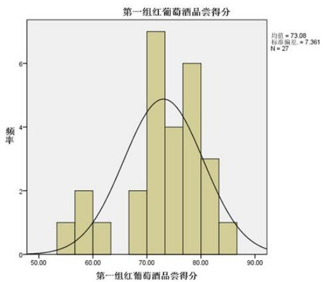
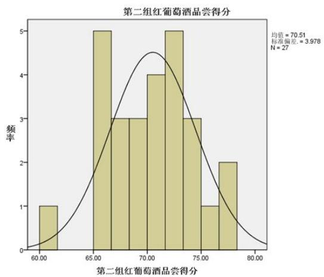
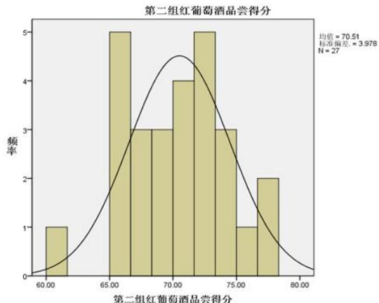
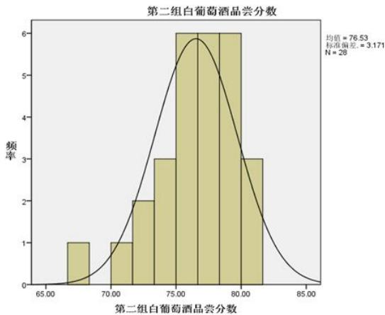
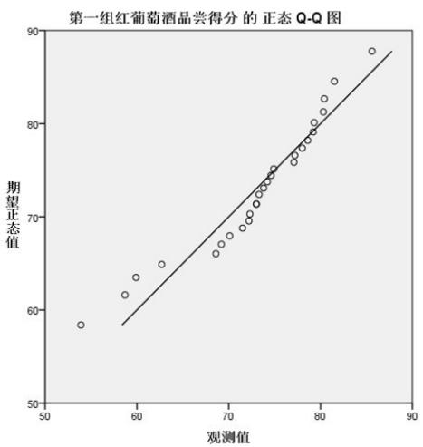
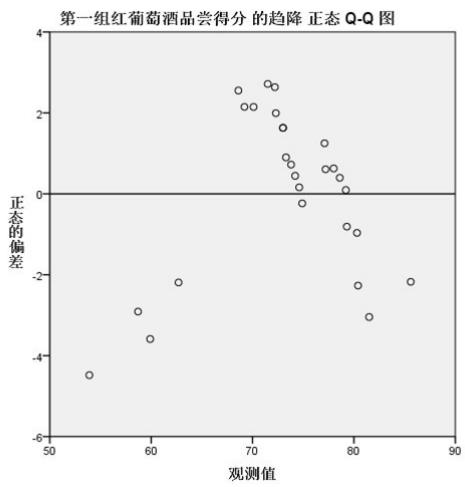
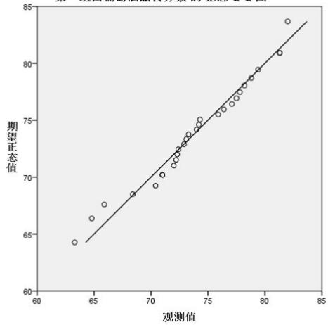
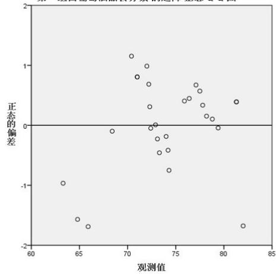

# 葡萄酒的评价

## 摘 要

现行的葡萄酒质量的评价体系是建立在人的感官感受上进行的，如何通过一些量化的理化指标来评价葡萄酒质量是一个值得研究的方向。

针对问题一，我们利用多元统计分析的相关知识，先对原始评分数据的分布进行了检验，进而通过差异性检验得出两组评论结果具有显著性差异、第二组评价结果更为可信的结论。接着对产生显著性差异的原因进行探讨，在对原始评价数据进行标准化处理后，得到两组评价结果无显著性差异的结论，确定了之前的显著性差异是来自品酒员个人因素的影响。

针对问题二，我们综合考虑了葡萄酒质量和葡萄理化指标与葡萄质量的相关性，以品酒员的感官评价为主、葡萄的理化指标为辅，采用逐步回归分析、聚类分析、判别分析的数学方法，建立了葡萄分级模型。利用此模型对酿酒红、白葡萄进行分类的结果显示，该模型与品酒员感官评价体系相似率分别为88.9%和85.7%。

针对问题三，由于葡萄的理化指标众多，我们先使用了相关系数矩阵确定了葡萄酒与葡萄理化指标中具有较大相关性的指标，从而实现了对葡萄理化指标的第一步筛选。接着利用逐步回归的方法拟合了葡萄酒理化指标与葡萄理化指标间一对多的函数关系，通过分析得到葡萄酒理化指标与葡萄理化指标之间具有较强相关性的结论。

针对问题四，首先要求分析葡萄和葡萄酒理化指标对葡萄酒质量的影响，我们通过分析葡萄酒理化指标与葡萄酒质量的函数关系，并利用第三问的结论，说明了葡萄与葡萄酒的理化指标只在一定程度上对葡萄酒质量有影响。问题第二部分要求我们论证能否用理化指标来评价葡萄酒，我们得出的结论为：不能仅仅通过葡萄与葡萄酒的理化指标对葡萄酒质量进行评价。此外，我们充分利用附件三中提供的芳香物质数据，使用多元统计分析的数学方法，通过提取对香气与口感评分相关度较大的芳香物质、建立芳香物质与葡萄酒质量的函数关系，论证了使用芳香物质作为评价葡萄酒质量的参考是可行的。

关键字：葡萄酒评价数据处理 多元统计分析 相关系数分析

## 1 问题重述

确定葡萄酒质量时一般是通过聘请一批有资质的评酒员进行品评。每个评酒员在对葡萄酒进行品尝后对其分类指标打分，然后求和得到其总分，从而确定葡萄酒的质量。酿酒葡萄的好坏与所酿葡萄酒的质量有直接的关系，葡萄酒和酿酒葡萄检测的理化指标会在一定程度上反映葡萄酒和葡萄的质量。附件1给出了某一年份一些葡萄酒的评价结果，附件2和附件3分别给出了该年份这些葡萄酒的和酿酒葡萄的成分数据。请尝试建立数学模型讨论下列问题：

1.分析附件1中两组评酒员的评价结果有无显著性差异，哪一组结果更可信？

2.根据酿酒葡萄的理化指标和葡萄酒的质量对这些酿酒葡萄进行分级。

3.分析酿酒葡萄与葡萄酒的理化指标之间的联系。

4. 分析酿酒葡萄和葡萄酒的理化指标对葡萄酒质量的影响，并论证能否用葡萄和葡萄酒的理化指标来评价葡萄酒的质量？

## 2 问题分析

这是一个关于大型数据处理与分析的问题。

问题一要求我们分析两组评酒员评价结果有无显著差异。在进行差异性检验之前必须先对数据服从的分布进行检验，从而选定合适的检验方法进行检验。

问题二要求根据酿酒葡萄的理化指标和葡萄酒的质量对酿酒葡萄进行分级。由题意可知除了葡萄酒的质量对葡萄的分级有比较大的影响外，酿酒葡萄的理化指标在一定程度上也会影响葡萄的质量。问题意在让我们建立一个综合葡萄酒质量与酿酒葡萄理化指标综合影响葡萄分级的模型。

问题三要求分析酿酒葡萄与葡萄酒理化指标之间的联系。由于酿酒葡萄理化指标众多，在分析两者的联系之前需要对葡萄的理化指标进行筛选。

问题四要求分析酿酒葡萄和葡萄酒的理化指标对葡萄酒质量的影响，并论证能否用葡萄和葡萄酒的理化指标来评价葡萄酒的质量。难点在于对附件三葡萄酒和葡萄芳香物质数据的使用。

## 3 假设与符号

## 3.1 问题假设

1).假设品酒员给出的葡萄酒评价能够准确反映葡萄酒的质量：

2).假设附件三中芳香物质数据的单位不一定相同；

3).假设现有的评价体系能够准确反映葡萄酒的质量：

## 3.2 符号说明

$P _ { i , j }$ ...第j号品酒员对第i号酒样的评分   
...葡萄酒各个理化指标(一级)   
x. ....酿酒葡萄各个理化指标(一级)   
• S.. ..品酒员对葡萄或者葡萄酒的综合评分   
• d..... ..度量酿酒葡萄与分级标准的“距离”   
W... ...葡萄或葡萄酒的芳香物质

## 4 问题一的解答

## 4.1 问题一的分析

通过对附件一的数据进行观察，可知葡萄酒样品的评价项目满分为100，葡萄酒外观、香气、口感以及平衡/整体评价在其中各占一定的比例。由本题题意和附件数据分析得知，有两组品酒员，分别对27种红葡萄酒和28种白葡萄酒进行了品尝和评分。对同样的27类红葡萄酒样品，两组品酒员的打分不同，白葡萄酒亦然。为了判别两组评酒员的评价结果有无显著性差异，首先需要对每种酒的最终得分进行数据分布检验，进而选择合理的检验方式对差异进行检验。为判别两组评酒员的评价结果可信程度，选用离差平方和

## 4.2 数据预处理

在对附件一数据进行观察分析时，发现了某些错误的数据。例如：

(a)第一组白葡萄酒7号品酒员对3号酒的持久性评价数据为“77”，为超出其上限；

(b)第一组白葡萄酒9号品酒员对1号酒的持久度评价数据为“16”，超出其上限；

(c)第一组红葡萄酒4号品酒员对20号酒的色调评价分数为空缺。

为了减少异常数据对分析结果的影响，对异常数据做如下处理：取这一样酒评价结果中其他评酒员针对该酒该项目评分的均值，替代异常数据。

## 4.3 模型的建立与求解

## 4.3.1 问题一的第一部分：显著性差异的检验

绘制两组频数分布图以进行分布初步分析

由以上数据初步得到葡萄酒质量评价数值后，对葡萄酒质量及其对应的酒样品数目分布进行分析。通过软件绘制出红、白葡萄酒在两组评酒员评价结果下的评分分布直方图：

得到第一组红酒与白酒的评数分布图

  
得到第二组红酒与白酒的评数分布图



第二组红葡萄酒晶尝得分  




结论：通过对图像观察分析，可以大致预测葡萄酒样品质量及其对应的数量分布呈正态分布。接下来进行数据分布的正态性检验。

## 正态分布检验

为了对这一预测进行更精确的验证，下面分别使用统计软件spss中提供的Q-Q图检测对数据进行正态性分布检验。

QQ图检验：





第一组白葡萄酒品尝分数的正态Q-Q图  


第一组白葡萄酒品尝分数的趋降正态Q-Q图  


由图所示，QQ图中，a图中离散情况较为一般，并不严格离散在分布线上；b图中大量数据集中在0.5-1.0之间，虽无任何数据超过1.0，但集中在0.5之内的数据同样不足。于是得出结论，葡萄酒样感官分析评价不符合正态分布，所以接下来使用非参数检验来确定其是否有显著性差异。

## 非参数检验：

参数检验是在总体分布形式已知的情况下，对总体分布的参数如均值、方差等进行推断的方法。但是，在数据分析过程中，无法对总体分布形态作简单假定，此时参数检验的方法就不再适用了。非参数检验正是一类基于这种考虑，利用样本数据对总体分布形态等进行推断的方法。

秩和检验：对配对比较的资料应采用符合秩和检验，其基本思想是：若检验假设成立，则差值的总体分布应是对称的，故正负秩和相差不应悬殊。

检验的基本步骤为：

(1)建立假设;

$H _ { 0 }$ ：差值的总体中位数为0;

$H _ { 1 }$ ：差值的总体中位数不为0；检验水准为0.05。

(2)算出各对值的代数差；

(3)根据差值的绝对值大小编秩；

(4)将秩次冠以正负号，计算正、负秩和；

(5)用不为“0”的对子数n及T（任取T+或T-）查检验界值表得到P值作出判断。

白葡萄酒秩和检验结果：

假设检验汇总
<table><tr><td></td><td>原假设</td><td>测试</td><td>Sig.</td><td>决策者</td></tr><tr><td>1</td><td>第一组白葡萄酒品尝分数与第二组 白葡萄酒品尝分数之间差异的中位 数等于0。</td><td>相关样本 Wilcoxon 符号 秩检验</td><td>.016</td><td>拒绝原 假设。</td></tr></table>

显示渐进显著性。显著性水平是.05。

红葡萄酒秩和检验结果：

假设检验汇总
<table><tr><td></td><td>原假设</td><td>测试</td><td>Sig.</td><td>决策者</td></tr><tr><td>1</td><td>第一组红葡萄酒品尝得分 与第二组 红葡萄酒品尝得分之间差异的中位 数等于0。</td><td>相关样本 Wilcoxon 符号 秩检验</td><td>.011</td><td>拒绝原 假设。</td></tr></table>

显示渐进显著性。显著性水平是.05。

由上秩和检验结果可知，红葡萄酒、白葡萄酒的两组评价结果具有显著性差异。

## 模型改进:使用标准化数据进行分析

## 数据预处理：

对附件一中数据再分析，很明显看到对葡萄酒的质量评定为品酒员的感官评定，这种评价为典型的人为评定，所以将会不可避免的产生误差。

因此我们需将数据进行标准化处理.

设 $P _ { i j }$ 为第i号酒样被第j品酒员评价的分数 ${ \cal P } _ { i j } ^ { \prime }$ 为标准化后的评价分数， ${ \overline { { P _ { j } } } }$ 为第j号品酒员的平均打分， $\sigma _ { j }$ 为第j号品酒员打分的方差。

标准化公式：

$$
P _ { i j } ^ { \prime } = \frac { P _ { i j } - \overline { { P _ { j } } } } { \sigma _ { j } }
$$

标准化后各项打分详见附件。

显著性检验标准化后，评分数据满足均值为0正态分布，于是接下来采用参数检验其是否显著性差异，使用SPSS进行f检验，我们得到以下检验结果

表1 显著性检验
<table><tr><td></td><td>平方和</td><td>df</td><td>均方</td><td>F</td><td>显著性</td></tr><tr><td>组间</td><td>0.000</td><td>1</td><td>0.000</td><td>0.000</td><td>1.000</td></tr><tr><td>组内</td><td>28.144</td><td>52</td><td>0.541</td><td></td><td></td></tr><tr><td>总数</td><td>28.144</td><td>53</td><td></td><td></td><td></td></tr></table>

上述结果显示，两组数据无显著性差异。

由上文分析可知，对原始评分数据进行标准化处理后，原来具有显著性差异的两组评价结果变得没有显著性差异，原因分析如下：即使是专业的评酒员在对葡萄酒质量进行评价时，难免掺杂个人的主观因素在其中。由于个人评分习惯在评分起始点、评分区间等方面会有些许差别，我们分析正是由于评酒员的这些个人因素导致了两组评价结果的显著性差异。在对数据进行过标准化处理过后，相当于消除了评酒员个人主观因素的影响。

因此处理后的两组评价结果没有显著性的差异。

## 4.3.2 问题一的第二部分：评价结果可靠性判断

由上文可知，当两组数据未经标准化处理的情况下，两组数据在非参数检验中显示出差异性显著。在此基础上判断两组数据的可信性。

对两组数据的可靠性进行分析，在葡萄酒的感官评价中，品酒员的评价尺度等方面的差异，导致不同品酒员对同一酒样的评价差异很大，从而不能真实的反应酒样的差异。

于是，我们假设 $P _ { i j }$ 为第j号评酒员对第i号酒样的评价分数，每一酒样的评价误差程度为：

$$
\varepsilon _ { 1 i } = \frac { 1 } { 1 0 } \sum _ { j = 1 } ^ { 1 0 } ( P _ { i j } - \overline { { P _ { i } } } ) ^ { 2 } \quad i = 1 , 2 . . . 2 7
$$

此处的 $\varepsilon _ { 1 i }$ 为10名品酒员对第i号酒样品评价离散程度的衡量指标。

$$
\varepsilon _ { 2 j } = \frac { 1 } { 2 7 } \sum _ { i = 1 } ^ { 2 7 } ( P _ { i j } - \overline { { { P _ { j } } } } ) ^ { 2 } \quad j = 1 , 2 . . . 1 0
$$

此处的 $\varepsilon _ { 2 j }$ 为第名品酒员对第1-10号酒样品评价离散程度的衡量指标。

我们有理由认为，当不同专家对同一样品酒的评分差距小时，说明该评分是能被大多数人所接受的。当一名专家对不同品质的样本酒给出的评价差异较明显时，我们更能接受该专家的评分。

综上所述，我们建立我们的可靠性评价指标：

1.同一样品酒的得分离散度 $\varepsilon _ { 1 }$ 应越小越好.

2.同一品酒员对不同品质的酒的评分离散度 $\varepsilon _ { 2 }$ 应越大越好。

可以得到：

$$
\varepsilon _ { 1 } = \frac { 1 } { 2 7 } \sum _ { i = 1 } ^ { 2 7 } \varepsilon _ { 1 i }
$$

表2
<table><tr><td> $\varepsilon _ { 1 }$ </td><td>红葡萄酒</td><td>白葡萄酒</td></tr><tr><td>第一组</td><td>52.4063</td><td>106.1114</td></tr><tr><td>第二组</td><td>30.41148</td><td>50.4175</td></tr></table>

结论：第二组的样品酒的离散程度更小，第二组对样品酒一致性更高。

$$
\varepsilon _ { 2 } = \frac { 1 } { 1 0 } \sum _ { j = 1 } ^ { 1 0 } \varepsilon _ { 2 j }
$$

表3
<table><tr><td> $\varepsilon _ { 2 }$ </td><td>第一组</td><td>第二组</td></tr><tr><td>红葡萄酒</td><td>52.17654</td><td>15.2383</td></tr><tr><td>白葡萄酒</td><td>22.4449</td><td>9.695753</td></tr></table>

结论：第一组的品酒员分数离散度更大，第一组品酒员更具备区分好对各酒样品的能力。

综上所述，两组在可靠性评价指标上各具有一定优势。

一方面，由于世界上红酒品种共计上百种，而附件中酒样本品种仅有28组，所以存在酒样本过少导致的品酒员对不同酒样品的区分明显。另一方面，正如前面已知，若将附件一中数据标准化，两组数据没有显著差别。由此可见，对每种酒的质量而言，专家的打分离散程度更重要，更具有参考意义。最终，由于第二组的样品酒的离散程度更小，第二组对样品酒一致性更高，第二组分数更加可信。

模型改进：可靠性评价指标

通过建立新的可靠性评价指标，品酒员评分离差指标。

$$
\sigma ( P ) = \frac { 1 } { 2 7 } \sum _ { i = 1 } ^ { 2 7 } ( P _ { i j } - \overline { { P _ { i } } } ) ^ { 2 }
$$

其现实意义为，每位品酒员将其评价分数减去同组成员对该品种酒的均值，得到其每次打分的偏度，最后将其偏离程度统一想加后求均值，得到每组品酒员的打分能力以及其对每组酒的平均分数的贡献程度，在一定程度上概括了信度评价的两重标准。

表4可信指标
<table><tr><td></td><td> $\sigma ( P _ { 1 } )$ </td><td> $\sigma ( P _ { 2 } )$ </td><td> $\sigma ( P _ { 3 } )$ </td><td> $\sigma ( P _ { 4 } )$ </td><td> $\sigma ( P _ { 5 } )$ </td><td></td></tr><tr><td>第一组 第二组</td><td>43.70111</td><td>39.36037</td><td>69.96037</td><td>64.81222</td><td>83.79</td><td></td></tr><tr><td rowspan="3">第一组</td><td>13.17501</td><td>17.51279</td><td>58.98923</td><td>50.84849</td><td>57.37945</td><td></td></tr><tr><td>σ(P6)</td><td>σ(P7)</td><td>σ(P8)</td><td>σ(P9)</td><td> $\sigma ( P _ { 1 } 0 )$ </td><td>均值</td></tr><tr><td>53.76778</td><td>23.18259</td><td>34.58259</td><td>64.23444</td><td>46.67148</td><td>52.4063</td></tr><tr><td>第二组</td><td>15.49975</td><td>21.07486</td><td>30.07901</td><td>17.81204</td><td>11.86597</td><td>29.42366</td></tr></table>

由新可信指标分析得出，第二组数据更可信。

## 5 问题二的解答

## 5.1 问题分析

问题二要求我们根据酿酒葡萄的理化指标和葡萄酒的质量对酿酒葡萄进行分级。

由常识可以知道，葡萄酒的质量很大程度上取决于酿酒葡萄的质量，优质的葡萄酒对应优质的酿酒葡萄，劣质的葡萄酒对应的酿酒葡萄质量也相应较差，因此我们考虑利用附件一中所给的葡萄酒质量评分作为参考标准对葡萄进行分级。

同时，葡萄酒的质量也并不是完全取决于酿酒葡萄。根据题意我们知道，葡萄酒和酿酒葡萄的理化指标会在一定程度上反映葡萄和葡萄酒的质量，因此我们对酿酒葡萄进行分级的同时加入酿酒葡萄的理化指标作为参考。

## 5.2 数据处理

附件二中提供的酿酒葡萄的理化指标一共有30种(一级指标)，经过初步观察我们得知，固酸比指标值=可溶性固形物指标/可滴定酸指标，可以认为固酸比指标能够反映后两者的综合影响，因此我们选择剔除可溶性固形物与可滴定酸指标。

特别地，我们发现附件二中存在某些异常的数据值，例如酿酒葡萄理化指标中白葡萄百粒质量的第三次检测值为2226.1g，而前两次检测值分别为225.8g和 $2 2 4 . 6 \mathrm { g }$ ，为了避免异常数据对数据分析产生的影响，我们利用前两次的检测值均值代替异常数据。

由于不同的理化指标数值大小不同、数据波动范围不同，为了消除这些因素的影响，

我们先对理化指标数据进行标准化处理。公式如下：

$$
x _ { i } ^ { \prime } = \frac { x _ { i } - \overline { { x } } } { \sigma _ { x } }
$$

x为某种理化指标原始数据， $\sigma _ { x }$ 为该理化指标标准差。

## 5.3 模型的建立与求解

## 模型思想

利用第一问中得出的标准化处理后的葡萄酒评分，我们建立葡萄的理化指标与葡萄酒评分之间的函数关系，通过该函数关系得出某一酿酒葡萄酿出的葡萄酒的预期评分；接着利用葡萄酒得分对葡萄酒进行聚类分析，划分出所给葡萄酒样品的等级，进而通过分析酿酒葡萄所酿葡萄酒预期得分与葡萄酒样品各等级之间的“距离”来对酿酒葡萄进行分级。从而既考虑到了所酿葡萄酒评分对葡萄分级的影响，又考虑到了酿酒葡萄的理化指标对葡萄分级的影响。

## 模型建立与求解

由于酿酒葡萄的理化指标(一级)多达30种，全部给予考虑将使计算十分繁琐，也不能较清晰地判断出主要影响酿酒葡萄质量的理化指标，因此我们对酿酒葡萄的理化指标进行筛选。

利用多元统计分析中逐步回归的思想，把葡萄酒评分作为因变量，对应的酿酒葡萄理化指标作为自变量，将酿酒葡萄的理化指标逐个加入到函数中进行拟合，若相应的统计量是检验显著的则保留该变量，检验不显著则剔除该变量。

该方法能够筛选出对葡萄酒评分有显著影响的酿酒葡萄理化指标，同时能够有效地减少酿酒葡萄理化指标之间的多重共线性。

令y为标准化处理后的葡萄酒评分， $x _ { 1 } , x _ { 2 } , . . . , x _ { 3 0 }$ 分别对应酿酒葡萄的30种理化指标(一级)，建立如下形式的函数：

$$
y = B _ { 0 } + B _ { 1 } x _ { 1 } + B _ { 2 } x _ { 2 } + . . . + B _ { p } x _ { p } + \varepsilon
$$

其中 $B _ { 0 } , B _ { 1 } , B _ { 2 }$ 和 $B _ { p }$ 为待估参数，ε为残差。

由x对y进行逐步回归，得到结果如下：

$$
{ \begin{array} { r l } & { \leq [ { \frac { \gamma + 1 } { \sharp } } ] ^ { \frac { \gamma + 1 } { \sharp } } \rangle \Vert { \frac { \gamma } { \operatorname { d } } } \colon R - s q u a r e d = 0 . 9 6 } \\ & { y = - 0 . 0 9 7 x _ { 2 } + 0 . 0 5 4 x _ { 3 } + 0 . 1 5 3 x _ { 4 } - 0 . 3 0 2 x _ { 6 } - 0 . 2 3 6 x _ { 8 } + 0 . 3 1 9 x _ { 1 0 } + 0 . 2 1 2 x _ { 1 3 } } \\ & { - 0 . 1 5 0 x _ { 1 4 } + 0 . 2 6 6 x _ { 1 7 } + 0 . 2 8 7 x _ { 2 1 } 0 . 1 4 8 x _ { 2 2 } - 0 . 0 9 1 x _ { 2 4 } - 0 . 1 3 7 x _ { 2 6 } + 0 . 1 6 1 x _ { 2 7 } - 0 . 1 4 4 x _ { 2 9 } } \end{array} }
$$

白葡萄酒：R − squared = 0.87

$$
\begin{array} { r l } & { y = 0 . 1 3 1 x _ { 1 } - 0 . 2 9 6 x _ { 2 } + 0 . 1 9 2 x _ { 7 } + 0 . 4 3 9 x _ { 9 } + 0 . 1 6 4 x _ { 1 0 } + 0 . 9 1 4 x _ { 1 1 } + 0 . 1 5 6 x _ { 1 2 } - 0 . 9 2 2 x _ { 1 3 } } \\ & { + 0 . 1 1 7 x _ { 1 4 } - 0 . 4 0 6 x _ { 1 5 } - 0 . 6 4 1 x _ { 1 7 } - 0 . 2 4 0 x _ { 2 1 } + 0 . 7 3 2 x _ { 2 2 } - 0 . 1 8 4 x _ { 2 3 } + 0 . 3 7 3 x _ { 2 4 } + 0 . 1 7 7 x _ { 2 9 } } \end{array}
$$

通过R-squared可知拟合程度较好，说明所选理化指标能够解释大部分葡萄酒评分的变化。

因此将以下酿酒葡萄理化指标作为影响葡萄酒评分的主要指标：

红葡萄：

蛋白质、VC、花色苷、苹果酸、多酚氧化酶活力、DPPH自由基、酒总黄酮、白藜芦醇、还原糖、固酸比、干物质含量、百粒质量、出汁率、果皮质量、色泽(a);

白葡萄：

氨基酸总量、蛋白质、柠檬酸、褐变度、DPPH自由基、总酚、单宁、酒总黄酮、白藜芦醇、黄酮醇、还原糖、固酸比、干物质含量、果穗质量、百粒质量、色泽(a)。

利用上述函数关系，可以获得各个酿酒葡萄样本所酿葡萄酒的预期评分。

接下来对各葡萄酒的得分进行聚类分析。这里我们采用对样本进行聚类的Q型聚类，利用软件SPSS进行聚类，再根据各类平均得分高低进行分级，结果如下表：

表 5 红葡萄酒样本分级
<table><tr><td rowspan=1 colspan=1>葡萄酒样本</td><td rowspan=1 colspan=1>1</td><td rowspan=1 colspan=1>2</td><td rowspan=1 colspan=1>3</td><td rowspan=1 colspan=1>4</td><td rowspan=1 colspan=1>5</td><td rowspan=1 colspan=1>6</td><td rowspan=1 colspan=1>7</td><td rowspan=1 colspan=1>8</td><td rowspan=1 colspan=1>9</td><td rowspan=1 colspan=1>10</td><td rowspan=1 colspan=1>11</td><td rowspan=1 colspan=1>12</td><td rowspan=1 colspan=1>13</td><td rowspan=1 colspan=1>14</td></tr><tr><td rowspan=1 colspan=1>分级</td><td rowspan=1 colspan=1>3</td><td rowspan=1 colspan=1>2</td><td rowspan=1 colspan=1>2</td><td rowspan=1 colspan=1>2</td><td rowspan=1 colspan=1>2</td><td rowspan=1 colspan=1>3</td><td rowspan=1 colspan=1>3</td><td rowspan=1 colspan=1>3</td><td rowspan=1 colspan=1>1</td><td rowspan=1 colspan=1>3</td><td rowspan=1 colspan=1>4</td><td rowspan=1 colspan=1>3</td><td rowspan=1 colspan=1>3</td><td rowspan=1 colspan=1>2</td></tr><tr><td rowspan=1 colspan=1>葡萄酒样本</td><td rowspan=1 colspan=1>15</td><td rowspan=1 colspan=1>16</td><td rowspan=1 colspan=1>17</td><td rowspan=1 colspan=1>18</td><td rowspan=1 colspan=1>19</td><td rowspan=1 colspan=1>20</td><td rowspan=1 colspan=1>21</td><td rowspan=1 colspan=1>22</td><td rowspan=1 colspan=1>23</td><td rowspan=1 colspan=1>24</td><td rowspan=1 colspan=1>25</td><td rowspan=1 colspan=1>26</td><td rowspan=1 colspan=1>27</td><td rowspan=1 colspan=1></td></tr><tr><td rowspan=1 colspan=1>分级</td><td rowspan=1 colspan=1>3</td><td rowspan=1 colspan=1>3</td><td rowspan=1 colspan=1>2</td><td rowspan=1 colspan=1>3</td><td rowspan=1 colspan=1>2</td><td rowspan=1 colspan=1>1</td><td rowspan=1 colspan=1>2</td><td rowspan=1 colspan=1>2</td><td rowspan=1 colspan=1>1</td><td rowspan=1 colspan=1>2</td><td rowspan=1 colspan=1>3</td><td rowspan=1 colspan=1>2</td><td rowspan=1 colspan=1>2</td><td rowspan=1 colspan=1></td></tr></table>

表6 白葡萄酒样本分级
<table><tr><td rowspan=1 colspan=1>葡萄酒样本</td><td rowspan=1 colspan=1>1</td><td rowspan=1 colspan=1>2</td><td rowspan=1 colspan=1>3</td><td rowspan=1 colspan=1>4</td><td rowspan=1 colspan=1>5</td><td rowspan=1 colspan=1>6</td><td rowspan=1 colspan=1>7</td><td rowspan=1 colspan=1>8</td><td rowspan=1 colspan=1>9</td><td rowspan=1 colspan=1>10</td><td rowspan=1 colspan=1>11</td><td rowspan=1 colspan=1>12</td><td rowspan=1 colspan=1>13</td><td rowspan=1 colspan=1>14</td></tr><tr><td rowspan=1 colspan=1>分级</td><td rowspan=1 colspan=1>1</td><td rowspan=1 colspan=1>2</td><td rowspan=1 colspan=1>2</td><td rowspan=1 colspan=1>2</td><td rowspan=1 colspan=1>1</td><td rowspan=1 colspan=1>2</td><td rowspan=1 colspan=1>2</td><td rowspan=1 colspan=1>3</td><td rowspan=1 colspan=1>1</td><td rowspan=1 colspan=1>1</td><td rowspan=1 colspan=1>3</td><td rowspan=1 colspan=1>3</td><td rowspan=1 colspan=1>3</td><td rowspan=1 colspan=1>2</td></tr><tr><td rowspan=1 colspan=1>葡萄酒样本</td><td rowspan=1 colspan=1>15</td><td rowspan=1 colspan=1>16</td><td rowspan=1 colspan=1>17</td><td rowspan=1 colspan=1>18</td><td rowspan=1 colspan=1>19</td><td rowspan=1 colspan=1>20</td><td rowspan=1 colspan=1>21</td><td rowspan=1 colspan=1>22</td><td rowspan=1 colspan=1>23</td><td rowspan=1 colspan=1>24</td><td rowspan=1 colspan=1>25</td><td rowspan=1 colspan=1>26</td><td rowspan=1 colspan=1>27</td><td rowspan=1 colspan=1>28</td></tr><tr><td rowspan=1 colspan=1>分级</td><td rowspan=1 colspan=1>1</td><td rowspan=1 colspan=1>4</td><td rowspan=1 colspan=1>1</td><td rowspan=1 colspan=1>2</td><td rowspan=1 colspan=1>2</td><td rowspan=1 colspan=1>2</td><td rowspan=1 colspan=1>1</td><td rowspan=1 colspan=1>1</td><td rowspan=1 colspan=1>2</td><td rowspan=1 colspan=1>2</td><td rowspan=1 colspan=1>1</td><td rowspan=1 colspan=1>2</td><td rowspan=1 colspan=1>2</td><td rowspan=1 colspan=1>1</td></tr></table>

考虑分级的合理性，我们将红白两种葡萄酒各分为四级(一级最优、四级最劣)，在各级别内，对各葡萄酒样品的评分求均值得到该评级葡萄酒的基准分。结果如下：

表7 葡萄酒分类标准
<table><tr><td rowspan=1 colspan=1>评级基准分葡萄酒</td><td rowspan=1 colspan=1>一级</td><td rowspan=1 colspan=1>二级</td><td rowspan=1 colspan=1>三级</td><td rowspan=1 colspan=1>四级</td></tr><tr><td rowspan=1 colspan=1>红葡萄酒</td><td rowspan=1 colspan=1>1.139</td><td rowspan=1 colspan=1>0.338</td><td rowspan=1 colspan=1>-0.538</td><td rowspan=1 colspan=1>-1.559</td></tr><tr><td rowspan=1 colspan=1>白葡萄酒</td><td rowspan=1 colspan=1>0.533</td><td rowspan=1 colspan=1>-0.08</td><td rowspan=1 colspan=1>-0.652</td><td rowspan=1 colspan=1>-1.646</td></tr></table>

通过上文建立的酿酒葡萄理化指标与葡萄酒评分的函数关系，得到各个葡萄样本所酿葡萄酒的预期评分，我们参考几何学中欧氏空间距离的概念，利用预期评分与葡萄酒

各评级基准分之间的“距离”来判断酿酒葡萄与各个等级的“远近关系”，进而实现对酿酒葡萄的分级。“距离”的计算公式如下：

$$
d _ { i , j } = \sqrt { [ y ( i ) - y ( j ) ] ^ { 2 } }
$$

其中 $d _ { i , j }$ 为第i个葡萄样本所酿葡萄酒预期评分与第级葡萄酒基准分之间的“距离”，$y _ { i }$ 为第i个葡萄样本所酿葡萄酒预期评分， $y _ { j }$ 为第j级葡萄酒基准分。 $d _ { i , j }$ 越小，代表该葡萄样本越接近此评级，选择“距离”最小的评级，即为该样本酿酒葡萄所对应的评级。

经判别，各葡萄样本分级结果如下：

表8 红葡萄样本分级
<table><tr><td rowspan=1 colspan=1>葡萄样本</td><td rowspan=1 colspan=1>1</td><td rowspan=1 colspan=1>2</td><td rowspan=1 colspan=1>3</td><td rowspan=1 colspan=1>4</td><td rowspan=1 colspan=1>5</td><td rowspan=1 colspan=1>6</td><td rowspan=1 colspan=1>7</td><td rowspan=1 colspan=1>8</td><td rowspan=1 colspan=1>9</td><td rowspan=1 colspan=1>10</td><td rowspan=1 colspan=1>11</td><td rowspan=1 colspan=1>12</td><td rowspan=1 colspan=1>13</td><td rowspan=1 colspan=1>14</td></tr><tr><td rowspan=1 colspan=1>分级</td><td rowspan=1 colspan=1>3</td><td rowspan=1 colspan=1>1</td><td rowspan=1 colspan=1>1</td><td rowspan=1 colspan=1>2</td><td rowspan=1 colspan=1>2</td><td rowspan=1 colspan=1>3</td><td rowspan=1 colspan=1>3</td><td rowspan=1 colspan=1>3</td><td rowspan=1 colspan=1>1</td><td rowspan=1 colspan=1>3</td><td rowspan=1 colspan=1>4</td><td rowspan=1 colspan=1>3</td><td rowspan=1 colspan=1>3</td><td rowspan=1 colspan=1>2</td></tr><tr><td rowspan=1 colspan=1>葡萄样本</td><td rowspan=1 colspan=1>15</td><td rowspan=1 colspan=1>16</td><td rowspan=1 colspan=1>17</td><td rowspan=1 colspan=1>18</td><td rowspan=1 colspan=1>19</td><td rowspan=1 colspan=1>20</td><td rowspan=1 colspan=1>21</td><td rowspan=1 colspan=1>22</td><td rowspan=1 colspan=1>23</td><td rowspan=1 colspan=1>24</td><td rowspan=1 colspan=1>25</td><td rowspan=1 colspan=1>26</td><td rowspan=1 colspan=1>27</td><td rowspan=1 colspan=1></td></tr><tr><td rowspan=1 colspan=1>分级</td><td rowspan=1 colspan=1>3</td><td rowspan=1 colspan=1>3</td><td rowspan=1 colspan=1>2</td><td rowspan=1 colspan=1>3</td><td rowspan=1 colspan=1>2</td><td rowspan=1 colspan=1>1</td><td rowspan=1 colspan=1>2</td><td rowspan=1 colspan=1>2</td><td rowspan=1 colspan=1>1</td><td rowspan=1 colspan=1>2</td><td rowspan=1 colspan=1>3</td><td rowspan=1 colspan=1>2</td><td rowspan=1 colspan=1>3</td><td rowspan=1 colspan=1></td></tr></table>

表9白葡萄样本分级
<table><tr><td rowspan=1 colspan=1>葡萄样本</td><td rowspan=1 colspan=1>1</td><td rowspan=1 colspan=1>2</td><td rowspan=1 colspan=1>3</td><td rowspan=1 colspan=1>4</td><td rowspan=1 colspan=1>5</td><td rowspan=1 colspan=1>6</td><td rowspan=1 colspan=1>7</td><td rowspan=1 colspan=1>8</td><td rowspan=1 colspan=1>9</td><td rowspan=1 colspan=1>10</td><td rowspan=1 colspan=1>11</td><td rowspan=1 colspan=1>12</td><td rowspan=1 colspan=1>13</td><td rowspan=1 colspan=1>14</td></tr><tr><td rowspan=1 colspan=1>分级</td><td rowspan=1 colspan=1>2</td><td rowspan=1 colspan=1>2</td><td rowspan=1 colspan=1>2</td><td rowspan=1 colspan=1>1</td><td rowspan=1 colspan=1>1</td><td rowspan=1 colspan=1>3</td><td rowspan=1 colspan=1>2</td><td rowspan=1 colspan=1>3</td><td rowspan=1 colspan=1>1</td><td rowspan=1 colspan=1>1</td><td rowspan=1 colspan=1>3</td><td rowspan=1 colspan=1>3</td><td rowspan=1 colspan=1>2</td><td rowspan=1 colspan=1>2</td></tr><tr><td rowspan=1 colspan=1>葡萄样本</td><td rowspan=1 colspan=1>15</td><td rowspan=1 colspan=1>16</td><td rowspan=1 colspan=1>17</td><td rowspan=1 colspan=1>18</td><td rowspan=1 colspan=1>19</td><td rowspan=1 colspan=1>20</td><td rowspan=1 colspan=1>21</td><td rowspan=1 colspan=1>22</td><td rowspan=1 colspan=1>23</td><td rowspan=1 colspan=1>24</td><td rowspan=1 colspan=1>25</td><td rowspan=1 colspan=1>26</td><td rowspan=1 colspan=1>27</td><td rowspan=1 colspan=1>28</td></tr><tr><td rowspan=1 colspan=1>分级</td><td rowspan=1 colspan=1>1</td><td rowspan=1 colspan=1>4</td><td rowspan=1 colspan=1>1</td><td rowspan=1 colspan=1>2</td><td rowspan=1 colspan=1>2</td><td rowspan=1 colspan=1>2</td><td rowspan=1 colspan=1>1</td><td rowspan=1 colspan=1>1</td><td rowspan=1 colspan=1>2</td><td rowspan=1 colspan=1>2</td><td rowspan=1 colspan=1>1</td><td rowspan=1 colspan=1>2</td><td rowspan=1 colspan=1>2</td><td rowspan=1 colspan=1>1</td></tr></table>

## 5.4 模型的检验

经过分析，该分级模型的误差可能来自以下几个方面：

(1).利用逐步回归建立函数关系时产生的误差：回归分析的目的是提高拟合程度，因此为了提高拟合程度有可能将过多的理化指标变量选入函数中进行拟合。虽然显示的拟合程度很高，但由于样本量个数不大，引入过多的变量将对模型效果产生影响；

(2).对葡萄酒聚类和分级时产生的误差：附件中提供的葡萄酒样品质量并没有覆盖所有可能的范围，在此基础上直接对葡萄酒进行分级难免欠缺妥当：并且红葡萄酒样本与白葡萄酒样本质量未必处于同一个档次，两种葡萄酒样本都分成四级可能会产生误差。

检验思路：评价酿酒葡萄好坏的最主要因素是所酿葡萄酒的质量好坏，因此在大样本的基础上，酿酒葡萄的分级与葡萄酒的分级不应该有显著性的差异，据此可以检验该分级模型的有效性。

可知红葡萄酒与红葡萄有24个样本即88.9%的样本评级相同，白葡萄酒与白葡萄有24个样本即85.7%的样本评级相同，可知该评价模型效果较好。

## 5.5 模型的评价与改进

该分级模型从葡萄酒与酿酒葡萄质量的直接关系和酿酒葡萄理化指标对酿酒葡萄质量两方面因素进行了考虑，首先通过建立函数关系确立了酿酒葡萄理化指标对葡萄酒质量的影响，接着利用聚类分析对葡萄酒进行分级，进而通过判别分析对酿酒葡萄的等级进行划分，经检验结果较好。

该分级模型也有需要进行改进的地方。如在对葡萄酒进行聚类分析时分级标准的确定略显主观，没有考虑到红葡萄酒与白葡萄酒之间质量的差异；同时在影响葡萄酒质量的主要理化指标的筛选上也有改进的空间，可以通过各理化指标之间的相关关系与理化指标和葡萄酒质量之间的相关关系进一步筛选理化指标。

## 6 问题三的解答

## 6.1 问题分析

问题三要求我们分析酿酒葡萄与葡萄酒的理化指标之间的联系，由于葡萄酒与酿酒葡萄有多个理化指标，因此简单的两指标间相关分析不再适用。分析可知酿酒葡萄的理化指标影响了葡萄酒的理化指标，它们之间并不是互相影响而是一种因果关系，因此考虑建立模型，描述一个葡萄酒理化指标与酿酒葡萄的多个理化指标之间的联系，通过这种联系分析酿酒葡萄理化指标对葡萄酒理化指标的影响。

根据附件二可知酿酒葡萄理化指标数量较多，而样本量较小，取过多的酿酒葡萄指标进行分析难免产生较大的误差，因此必须先对酿酒葡萄的理化指标进行筛选。

## 6.2 模型的建立与求解

## 数据预处理

考虑到各个理化指标的指标值之间绝对值大小程度、离散程度等的不同，为了避免这些因素对分析的结果产生影响，先对各个理化指标数据进行标准化处理。

## 酿酒葡萄理化指标的筛选

由问题分析可知，由于样本量较小，将过多的酿酒葡萄理化指标纳入考虑范围可能产生较大的误差，因此必须对酿酒葡萄的理化指标进行筛选。

以红葡萄酒及红葡萄样本为例进行说明。

记红葡萄酒经过标准化处理后各个理化指标为：y1,y2,y3,……,y9，红葡萄样本各个理 化指标为 $x _ { 1 } , x _ { 2 } , x _ { 3 } , . . . , x _ { 3 0 }$ o

为了建立单个葡萄酒理化指标与多个酿酒葡萄理化指标之间的函数关系，利用这多个酿酒葡萄理化指标与某个葡萄酒理化指标之间的相关程度对酿酒葡萄理化指标进行筛选：相关程度大代表两个理化指标之间有比较密切的联系，反之则代表联系不够紧密，可以考虑将其排除在考虑范围。

利用Matlab软件计算每个葡萄酒的理化指标与每个酿酒葡萄理化指标之间的相关系数，生成相关矩阵：

考虑将相关系数绝对值大于均值的理化指标纳入考虑范围，进而可以得到针对葡萄酒的每一个理化指标，与其有比较大相关性的酿酒葡萄的理化指标。

筛选后结果如下，其中X代表两变量间相关度不大。

表10葡萄与葡萄酒理化指标相关矩阵
<table><tr><td></td><td>花色苷</td><td>单宁</td><td>总酚</td><td>酒总黄酮</td><td>白藜芦醇</td><td>DPPH</td><td>L</td><td>a</td><td>b</td></tr><tr><td>氨基酸总量</td><td>X</td><td>0.21</td><td>0.05</td><td>X</td><td>0.05</td><td>0.11</td><td>X</td><td>X</td><td>0.07</td></tr><tr><td>蛋白质</td><td>0.01</td><td>0.19</td><td>0.15</td><td>0.15</td><td>X</td><td>0.10</td><td>0.20</td><td>X</td><td>X</td></tr><tr><td>VC</td><td>X</td><td>X</td><td>X</td><td>X</td><td>X</td><td>X</td><td>X</td><td>X</td><td>0.08</td></tr><tr><td>花色苷</td><td>0.64</td><td>0.43</td><td>0.49</td><td>0.42</td><td>X</td><td>0.38</td><td>0.55</td><td>0.06</td><td>X</td></tr><tr><td>酒石酸</td><td>X</td><td>X</td><td>X</td><td>X</td><td>X</td><td>X</td><td>X</td><td>X</td><td>0.18</td></tr><tr><td>苹果酸</td><td>0.41</td><td>0.01</td><td>0.07</td><td>X</td><td>X</td><td>X</td><td>0.06</td><td>0.27</td><td>0.02</td></tr><tr><td>柠檬酸</td><td>0.09</td><td>X</td><td>X</td><td>X</td><td>X</td><td>X</td><td>X</td><td>X</td><td>X</td></tr><tr><td>多酚氧化酶活力</td><td>0.19</td><td>X</td><td>X</td><td>X</td><td>X</td><td>X</td><td>0.12</td><td>X</td><td>X</td></tr><tr><td>褐变度</td><td>0.48</td><td>0.16</td><td>0.17</td><td>0.16</td><td>X</td><td>0.09</td><td>0.28</td><td>0.05</td><td>X</td></tr><tr><td>DPPH自由基</td><td>0.27</td><td>0.46</td><td>0.52</td><td>0.47</td><td>0.13</td><td>0.49</td><td>0.42</td><td>X</td><td>X</td></tr><tr><td>总酚</td><td>0.33</td><td>0.53</td><td>0.59</td><td>0.60</td><td>0.17</td><td>0.59</td><td>0.47</td><td>X</td><td>X</td></tr><tr><td>单宁</td><td>0.37</td><td>0.43</td><td>0.46</td><td>0.41</td><td>0.03</td><td>0.41</td><td>0.39</td><td>X</td><td>X</td></tr><tr><td>总黄酮</td><td>0.15</td><td>0.40</td><td>0.53</td><td>0.54</td><td>0.28</td><td>0.53</td><td>0.32</td><td>X</td><td>X</td></tr><tr><td>白藜芦醇</td><td>X</td><td>X</td><td>X</td><td>X</td><td>X</td><td>X</td><td>X</td><td>0.16</td><td>X</td></tr><tr><td>黄酮醇</td><td>0.12</td><td>0.29</td><td>0.12</td><td>0.01</td><td>X</td><td>0.14</td><td>0.24</td><td>X</td><td>X</td></tr><tr><td>总糖</td><td>X</td><td>0.03</td><td>X</td><td>X</td><td>X</td><td>X</td><td>X</td><td>X</td><td>0.09</td></tr><tr><td>还原糖</td><td>X</td><td>X</td><td>X</td><td>X</td><td>X</td><td>X</td><td>X</td><td>X</td><td>0.28</td></tr><tr><td>可溶性固形物</td><td>X</td><td>0.12</td><td>X</td><td>X</td><td>X</td><td>0.03</td><td>X</td><td>X</td><td>X</td></tr><tr><td>PH</td><td>X</td><td>X</td><td>X</td><td>X</td><td>X</td><td>X</td><td>X</td><td>X</td><td>X</td></tr><tr><td>可滴定酸</td><td>X</td><td>X</td><td>X</td><td>X</td><td>X</td><td>X</td><td>X</td><td>X</td><td>X</td></tr><tr><td>固酸比</td><td>0.03</td><td>X</td><td>X</td><td>0.04</td><td>X</td><td>X</td><td>X</td><td>0.15</td><td>X</td></tr><tr><td>干物质含量</td><td>X</td><td>0.13</td><td>0.01</td><td>X</td><td>X</td><td>0.04</td><td>X</td><td>X</td><td>0.11</td></tr><tr><td>果穗质量</td><td>X</td><td>X</td><td>X</td><td>X</td><td>X</td><td>X</td><td>X</td><td>X</td><td>X</td></tr><tr><td>百粒质量</td><td>X</td><td>0.04</td><td>X</td><td>X</td><td>X</td><td>X</td><td>0.02</td><td>X</td><td>X</td></tr><tr><td>果梗比</td><td>0.21</td><td>0.19</td><td>0.12</td><td>0.01</td><td>X</td><td>0.05</td><td>0.19</td><td>X</td><td>X</td></tr><tr><td>出汁率</td><td>0.04</td><td>0.07</td><td>0.11</td><td>0.20</td><td>X</td><td>0.14</td><td>0.15</td><td>X</td><td>X</td></tr><tr><td>果皮质量</td><td>X</td><td>X</td><td>X</td><td>X</td><td>X</td><td>X</td><td>X</td><td>0.05</td><td>X</td></tr><tr><td>L</td><td>0.08</td><td>0.18</td><td>0.16</td><td>0.06</td><td>X</td><td>0.11</td><td>0.21</td><td>X</td><td>X</td></tr><tr><td>a</td><td>0.08</td><td>0.01</td><td>0.00</td><td>X</td><td>X</td><td>0.01</td><td>0.31</td><td>0.26</td><td>X</td></tr><tr><td>b</td><td>X</td><td>X</td><td>X</td><td>X</td><td>X</td><td>X</td><td>0.06</td><td>0.34</td><td>X</td></tr></table>

针对酿酒葡萄的这些理化指标，利用逐步回归法建立其与葡萄酒各理化指标之间的函数关系。

利用软件Eviews进行逐步回归，结果如下：

红葡萄酒：

$$
\begin{array} { r l } & { y _ { 1 } = 0 . 4 4 1 x _ { 4 } - 0 . 0 8 5 x _ { 2 6 } - 0 . 0 8 5 x _ { 2 9 } + 0 . 2 0 9 x _ { 1 2 } + 0 . 4 6 1 x _ { 6 } + 0 . 2 0 1 x _ { 2 8 } + 0 . 1 2 2 x _ { 1 5 } } \\ & { \qquad + 0 . 0 5 7 x _ { 7 } + 0 . 3 0 6 x _ { 1 0 } - 0 . 1 9 9 x _ { 1 3 } - 0 . 1 0 4 x _ { 2 5 } } \\ & { \qquad R - s q u a r e d = 0 . 9 6 5 } \end{array}
$$

$$
\begin{array} { r l } & { y _ { 2 } = 0 . 3 4 7 x _ { 9 } + 0 . 3 6 0 x _ { 1 } + 0 . 3 9 6 x _ { 1 8 } + 0 . 3 6 0 x _ { 1 0 } - 0 . 2 5 0 x _ { 1 6 } + 0 . 1 3 8 x _ { 2 2 } - 0 . 0 8 1 x _ { 2 5 } } \\ & { \qquad + 0 . 0 5 9 x _ { 2 4 } } \\ & { \qquad R - s q u a r e d = 0 . 9 3 2 } \end{array}
$$

$$
\begin{array} { r l } & { y _ { 3 } = 0 . 3 8 6 x _ { 1 3 } + 0 . 2 1 5 x _ { 4 } + 0 . 3 5 8 x _ { 1 } - 0 . 1 8 3 x _ { 2 6 } + 0 . 7 8 9 x _ { 1 0 } - 0 . 1 8 9 x _ { 2 } + 0 . 1 1 1 x _ { 2 2 } } \\ & { \qquad + 0 . 3 3 5 x _ { 9 } - 0 . 1 5 6 x _ { 2 5 } - 0 . 1 9 5 x _ { 1 5 } - 0 . 2 6 2 x _ { 1 1 } + 0 . 0 7 2 x _ { 1 2 } } \\ & { \qquad R - s q u a r e d = 0 . 9 5 5 } \end{array}
$$

$$
\begin{array} { c } { y _ { 4 } = 0 . 6 7 1 x _ { 1 1 } + 0 . 1 6 0 x _ { 9 } - 0 . 1 5 5 x _ { 2 5 } + 0 . 1 3 6 x _ { 2 8 } + 0 . 1 9 4 x _ { 1 3 } + 0 . 1 4 4 x _ { 4 } } \\ { \nonumber } \\ { R - s q u a r e d = 0 . 8 3 2 } \end{array}
$$

$$
\begin{array} { r l } & { y _ { 5 } = 0 . 9 5 1 x _ { 1 3 } + 0 . 3 3 4 x _ { 1 } - 0 . 4 7 9 x _ { 1 1 } } \\ & { \qquad R - s q u a r e d = 0 . 4 3 1 } \\ & { y _ { 6 } = - 0 . 3 0 3 x _ { 2 } + 0 . 4 1 3 x _ { 1 } + 0 . 3 7 5 x _ { 9 } + 0 . 2 4 9 x _ { 1 3 } - 0 . 3 1 6 x _ { 2 5 } + 0 . 8 1 7 x _ { 1 0 } + 0 . 0 7 7 x _ { 1 8 } } \\ & { \qquad + 0 . 0 8 6 x _ { 2 8 } - 0 . 0 5 5 x _ { 2 9 } } \\ & { R - s q u a r e d = 0 . 9 2 7 } \end{array}
$$

$$
\begin{array} { r l } & { y _ { 7 } = - 0 . 2 8 0 x _ { 4 } + 1 . 1 0 0 x _ { 2 9 } - 0 . 2 2 1 x _ { 1 5 } - 0 . 6 3 8 x _ { 1 0 } - 0 . 6 6 6 x _ { 3 0 } + 0 . 2 7 4 x _ { 2 4 } - 0 . 2 1 6 x _ { 2 8 } } \\ & { \qquad + 0 . 2 0 6 x _ { 1 3 } + 0 . 4 1 5 x _ { 2 5 } + 0 . 1 0 2 x _ { 2 } } \\ & { \qquad R - s q u a r e d = 0 . 9 5 5 } \end{array}
$$

$$
\begin{array} { c } { y _ { 9 } = 0 . 5 4 0 x _ { 1 7 } - 0 . 3 8 3 x _ { 6 } + 0 . 3 2 4 x _ { 5 } - 0 . 1 3 7 x _ { 3 } } \\ { \qquad } \\ { R - s q u a r e d = 0 . 6 2 6 } \end{array}
$$

白葡萄酒：

$$
\begin{array} { r l } & { \begin{array} { r l } { \eta _ { 1 } + \eta _ { 2 } \eta _ { 3 } \eta _ { 4 } } & { \mathrm { ~ i . e . } \mathcal { Z } _ { 2 , 1 } + 2 \eta _ { 5 } \eta _ { 6 } } \\ { \eta _ { 5 } + \eta _ { 6 } \eta _ { 7 } } \\ { \eta _ { 7 } + \eta _ { 8 } \eta _ { 7 } } \\ { \eta _ { 8 } + \eta _ { 8 } \eta _ { 7 } } \\ { \eta _ { 7 } + \eta _ { 8 } \eta _ { 8 } } \end{array} } & { \begin{array} { r l } { \eta _ { 1 } + \eta _ { 1 } } & { \mathrm { ~ i . e . } } \\ { \eta _ { 8 } + \eta _ { 8 } } \\ { \eta _ { 8 } + \eta _ { 7 } } \end{array} } & { \begin{array} { r l } { \eta _ { 1 } + \eta _ { 1 } } & { \mathrm { ~ i . e . } } \\ { \eta _ { 1 } + \eta _ { 8 } } \\ { \eta _ { 8 } + \eta _ { 8 } } \end{array} } & { \begin{array} { r l } { \eta _ { 1 } + \eta _ { 1 } } & { \mathrm { ~ i . e . } } \\ { \eta _ { 1 } + \eta _ { 8 } } \end{array} } & { \begin{array} { r l } { \eta _ { 1 } } & { \mathrm { ~ i . e . } } \\ { \eta _ { 1 } } & { \mathrm { ~ i . e . } } \end{array} } \\ { \eta _ { 1 } } & { \begin{array} { r l } { \eta _ { 2 } + \eta _ { 8 } } \\ { \eta _ { 8 } + \eta _ { 7 } } \end{array} } & { \begin{array} { r l } { \eta _ { 1 } + \eta _ { 1 } } & { \mathrm { ~ i . e . } } \\ { \eta _ { 1 } + \eta _ { 8 } } \end{array} } \end{array}  \\ & { \begin{array} { r l } { \eta _ { 1 } + \eta _ { 1 } } & { \mathrm { ~ i . e . } } \\ { \eta _ { 1 } + \eta _ { 8 } } \end{array} } &  \begin{array} { r l } { \eta _ { 1 } } & { \mathrm { ~ i . e . } }  \end{array}
$$

由以上结果可知红葡萄酒理化指标中的白藜芦醇与酿酒葡萄理化指标的相关程度较弱，仅与蛋白质、总酚和总黄酮理化指标拟合有43.1%的拟合度；色泽(b)理化指标与酿酒葡萄理化指标的相关程度一般，仅与VC含量、苹果酸和柠檬酸有62.6%的拟合程度；白葡萄酒理化指标中的白藜芦醇与酿酒葡萄理化指标的相关程度弱，仅与溜石酸、苹果酸和总糖有些许相关关系。而葡萄酒的其他理化指标，大多数能够与酿酒葡萄的某几种理化指标之间建立起函数关系，且拟合程度不错。

## 6.3 模型的评价与改进

## 模型的评价

本问中我们首先利用葡萄酒理化指标与酿酒葡萄理化指标之间相关矩阵，筛选出对葡萄酒某一理化指标相关程度较大的酿酒葡萄理化指标，接着通过逐步回归的方法建立了葡萄酒理化指标与酿酒葡萄理化指标之间的函数关系。可以看到，理化指标之间的大部分函数关系拟合效果都不错，能够反映理化指标之间的变化关系。

## 模型的改进

针对不同的理化指标之间，函数关系的形式可能不同，由于理化指标众多、时间有限等因素，我们没有进一步探讨理化指标之间可能的函数关系形势。可以通过对理化指标之间两两做散点图，大致判断两者的函数关系形势，进而再代入模型中进行拟合，也许会得到更好的解释效果。

## 7 问题四的解答

## 7.1 问题四的分析

问题四首先要我们分析酿酒葡萄和葡萄酒的理化指标对葡萄酒质量的影响，并要求我们论证能否用葡萄和葡萄酒的理化指标来评价葡萄酒的质量。

经过第三问的分析与求解，我们得出的结论是：葡萄酒理化指标与酿酒葡萄的理化指标之间具有比较高度的相关性，从各回归方程的可决系数(R-squared)可以看出。并且，分析可知葡萄酒的理化指标对葡萄酒质量的影响更为直接，而酿酒葡萄的理化指标必须通过葡萄酒的理化指标来间接影响葡萄酒的质量，因此我们考虑分析葡萄酒的理化指标对葡萄酒质量的影响，进而利用葡萄理化指标与葡萄酒理化指标之间高度的相关性来分析葡萄的理化指标对葡萄酒质量的影响。

通过查阅文献与网络资料，我们得知葡萄中的芳香物质对所酿出的葡萄酒的气味、口感等方面有比较大的影响，初步分析可以通过葡萄酒或葡萄中的芳香物质来评价葡萄酒的质量。

同时，由于附件三中的芳香物质种类众多，必须对芳香物质进行筛选。葡萄酒的香气与口感占评分体系的比重较大，且通过文献资料可知芳香物质对香气与口感确实有比较大的影响，因此考虑利用芳香物质对香气分析、口感分析评分的相关程度作为筛选的标准。

## 7.2 模型的建立与求解

## 分析葡萄酒理化指标对葡萄酒质量的影响

以红葡萄酒为例，建立葡萄酒质量与葡萄酒理化指标之间的函数关系，分析葡萄酒理化指标对葡萄酒质量的影响程度。

随机抽取若于个葡萄酒理化指标，画出其对葡萄酒质量的散点图，可以看出大致上成线性关系，因此我们采用线性函数来描述葡萄酒理化指标对葡萄酒质量的影响。

使用软件Eviews拟合以下方程：

$$
s = a _ { 1 } y _ { 1 } + a _ { 2 } y _ { 2 } + a _ { 3 } y _ { 3 } + . . . + a _ { 9 } y _ { 9 }
$$

结果如下：

$$
{ \begin{array} { r l } & { s = - 0 . 8 2 0 y _ { 1 } + 0 . 4 1 7 y _ { 2 } - 0 . 2 6 9 y _ { 3 } + 0 . 3 0 2 y _ { 4 } + 0 . 2 3 1 y _ { 5 } - 0 . 1 8 8 y _ { 6 } - 0 . 7 6 7 y _ { 7 } - 0 . 1 4 4 y _ { 8 } } \\ & { \qquad - 0 . 1 5 7 y _ { 9 } + 2 . 4 7 E - 1 6 } \\ & { \qquad R - s q u a r e d = 0 . 5 8 8 } \end{array} }
$$

表11 红葡萄酒回归参数
<table><tr><td rowspan=1 colspan=1>自变量</td><td rowspan=1 colspan=1>y1</td><td rowspan=1 colspan=1>Y2</td><td rowspan=1 colspan=1>Y3</td><td rowspan=1 colspan=1>y4</td><td rowspan=1 colspan=1>Y5</td><td rowspan=1 colspan=1>Y6</td><td rowspan=1 colspan=1>Y7</td><td rowspan=1 colspan=1>Y8</td><td rowspan=1 colspan=1>y9</td><td rowspan=1 colspan=1>C</td></tr><tr><td rowspan=1 colspan=1>Std.Error</td><td rowspan=1 colspan=1>0.396</td><td rowspan=1 colspan=1>0.351</td><td rowspan=1 colspan=1>0.512</td><td rowspan=1 colspan=1>0.329</td><td rowspan=1 colspan=1>0.183</td><td rowspan=1 colspan=1>0.527</td><td rowspan=1 colspan=1>0.429</td><td rowspan=1 colspan=1>0206</td><td rowspan=1 colspan=1>0.169</td><td rowspan=1 colspan=1>0.105</td></tr><tr><td rowspan=1 colspan=1>t-Statistic</td><td rowspan=1 colspan=1>-2.073</td><td rowspan=1 colspan=1>1.188</td><td rowspan=1 colspan=1>-0.525</td><td rowspan=1 colspan=1>0.917</td><td rowspan=1 colspan=1>1.258</td><td rowspan=1 colspan=1>-0.357</td><td rowspan=1 colspan=1>-1.787</td><td rowspan=1 colspan=1>-0.697</td><td rowspan=1 colspan=1>-0.927</td><td rowspan=1 colspan=1>2.36E-15</td></tr><tr><td rowspan=1 colspan=1>Prob.</td><td rowspan=1 colspan=1>0.054</td><td rowspan=1 colspan=1>0.251</td><td rowspan=1 colspan=1>0.606</td><td rowspan=1 colspan=1>0.372</td><td rowspan=1 colspan=1>0.226</td><td rowspan=1 colspan=1>0.726</td><td rowspan=1 colspan=1>0.092</td><td rowspan=1 colspan=1>0.495</td><td rowspan=1 colspan=1>0.367</td><td rowspan=1 colspan=1>1</td></tr></table>

由回归结果可知，虽然回归可决系数接近了0.6，但由于大部分自变量系数在统计上不显著，可以说明，红葡萄酒理化指标在一定程度上影响了红葡萄酒的质量，但影响有限，不能仅仅通过葡萄酒的理化指标来评价葡萄酒的质量。

同理，可得到白葡萄酒理化指标与白葡萄酒质量之间函数关系为：

$$
\begin{array} { l } { { s = 0 . 0 3 8 y _ { 1 } - 0 . 0 1 1 y _ { 2 } - 0 . 1 4 2 y _ { 3 } - 0 . 0 7 5 y _ { 4 } + 0 . 1 2 4 y _ { 5 } - 0 . 1 7 0 y _ { 6 } - 0 . 0 7 6 y _ { 7 } - 0 . 1 4 1 y _ { 8 } + 7 . 1 4 E - 1 1 } } \\ { { \nonumber } } \\ { { R - s q u a r e d = 0 . 1 4 9 } } \end{array}
$$

表 12 白葡萄酒回归参数
<table><tr><td rowspan=1 colspan=1>自变量</td><td rowspan=1 colspan=1>y1</td><td rowspan=1 colspan=1>y2</td><td rowspan=1 colspan=1>y3</td><td rowspan=1 colspan=1>y4</td><td rowspan=1 colspan=1>Y5</td><td rowspan=1 colspan=1>Y6</td><td rowspan=1 colspan=1>Y7</td><td rowspan=1 colspan=1>y8</td><td rowspan=1 colspan=1>C</td></tr><tr><td rowspan=1 colspan=1>Std.Error</td><td rowspan=1 colspan=1>0.257</td><td rowspan=1 colspan=1>0.282</td><td rowspan=1 colspan=1>0.151</td><td rowspan=1 colspan=1>0.127</td><td rowspan=1 colspan=1>0.175</td><td rowspan=1 colspan=1>0.464</td><td rowspan=1 colspan=1>0.280</td><td rowspan=1 colspan=1>0.588</td><td rowspan=1 colspan=1>0.112</td></tr><tr><td rowspan=1 colspan=1>t-Statistic</td><td rowspan=1 colspan=1>0.146</td><td rowspan=1 colspan=1>-0.037</td><td rowspan=1 colspan=1>-0.936</td><td rowspan=1 colspan=1>-0.588</td><td rowspan=1 colspan=1>0.708</td><td rowspan=1 colspan=1>-0.366</td><td rowspan=1 colspan=1>-0.271</td><td rowspan=1 colspan=1>-0.239</td><td rowspan=1 colspan=1>6.35E-10</td></tr><tr><td rowspan=1 colspan=1>Prob.</td><td rowspan=1 colspan=1>0.885</td><td rowspan=1 colspan=1>0.971</td><td rowspan=1 colspan=1>0.361</td><td rowspan=1 colspan=1>0.564</td><td rowspan=1 colspan=1>0.488</td><td rowspan=1 colspan=1>0.718</td><td rowspan=1 colspan=1>0.789</td><td rowspan=1 colspan=1>0.814</td><td rowspan=1 colspan=1>1</td></tr></table>

可知对白葡萄酒来说，葡萄酒理化指标对葡萄酒质量的拟合程度很低，大多数自变量系数统计不显著。

综上可知，葡萄酒理化指标对葡萄酒质量有一定的影响，但是不能仅仅依靠葡萄酒的理化指标对葡萄酒的质量作出评价。由于葡萄的理化指标与葡萄酒的理化指标之间高度的相关性，可以推断葡萄的理化指标对葡萄酒质量的影响程度与葡萄酒的理化指标基本一致。

## 建立葡萄酒芳香物质对葡萄酒质量影响的函数关系

由前文的分析与论证可知，单纯使用葡萄的理化指标或者葡萄酒的理化指标对葡萄酒质量进行评定是不够合理的。

通过查阅文献与网络资料，我们得知葡萄与葡萄酒中的芳香物质对葡萄酒的香气、口感等方面有一定的影响，因此考虑利用附件三中提供的葡萄酒的芳香物质数据来建立芳香物质对葡萄酒质量的函数关系。

在分析葡萄酒芳香物质对葡萄酒质量的影响时，根据附件一的资料，我们将葡萄酒评价指标细分为外观分析、香气分析、口感分析与平衡/整体评价，根据相关文献资料的研究，芳香物质主要影响葡萄酒的香气和口感，且根据附件一的评价体系，香气分析和口感分析的比重占到74%，可以比较全面地反映葡萄酒的大体质量。

下面以红葡萄酒为例进行说明评价体系的构建。

1).对附件一中的评分数据分别按照外观分析、香气分析、口感分析和平衡/整体评价做数据的标准化处理，对芳香物质同样进行标准化处理。分别计算四方面评分与葡萄酒各芳香物质数据的相关系数，得到相关系数矩阵(见附录)，矩阵中第i行第j列元素表示芳香物质i对i方面评分的相关系数。

2).相关系数矩阵数据处理：对所有相关系数求均值，每个相关系数减去均值，得到处理后的相关系数矩阵。接着对每一种芳香物质进行检验，若该种芳香物质对香气分析评分与口感分析评分的相关系数都大于0，则将该芳香物质纳入考虑范围，剔除其他不满足条件的芳香物质。

最终筛选出来的芳香物质为：乙酸乙酯、乙酸正丙酯、丁酸乙酯、柠檬烯、正十三烷、乙酸庚酯、乙酸辛酯、2-乙基-1-己醇、辛酸丙酯、3,7-二甲基-1,6-辛二烯-3-醇、5-甲基糠醛、二甘醇单乙醚、辛酸3-甲基丁酯、2-甲基己酸、丁二酸二乙酯、反式-4-癸烯酸乙酯、3-甲硫基-1-丙醇、辛酸、7-甲氧基-2,2,4,8-四甲基-三环[5.3.1.0(4,11)]十一碳烷、2,3-二氢苯并呋喃。

3).以经过筛选的葡萄酒芳香物质为自变量，葡萄酒总评分为因变量建立线性函数关系，得到函数：

$$
{ \begin{array} { r l } & { s = - 0 . 2 0 5 w _ { 6 0 } + 0 . 3 8 0 w _ { 2 9 } + 0 . 6 8 0 w _ { 5 } - 0 . 2 6 0 w _ { 3 6 } + 0 . 5 3 2 w _ { 4 1 } - 0 . 4 3 3 w _ { 5 3 } - 0 . 9 3 5 w _ { 4 3 } + 0 . 3 9 0 w _ { 3 8 } } \\ & { \qquad - 0 . 6 7 8 w _ { 3 4 } - 0 . 1 2 7 w _ { 2 8 } + 0 . 5 5 7 w _ { 4 5 } + 0 . 5 0 1 w _ { 7 } - 0 . 7 3 6 w _ { 2 } - 0 . 2 9 0 w _ { 4 2 } - 0 . 2 4 2 w _ { 1 2 } + 0 . 1 1 2 w _ { 3 1 } } \\ & { \qquad R - s q u a r e d = 0 . 9 1 7 \qquad } \end{array} }
$$

表 13 红葡萄酒回归参数
<table><tr><td rowspan=1 colspan=1>自变量</td><td rowspan=1 colspan=1> $w _ { 6 0 }$ </td><td rowspan=1 colspan=1> $w _ { 2 9 }$ </td><td rowspan=1 colspan=1> $w _ { 5 }$ </td><td rowspan=1 colspan=1> $w _ { 3 6 }$ </td><td rowspan=1 colspan=1> $w _ { 4 1 }$ </td><td rowspan=1 colspan=1> $w _ { 5 3 }$ </td><td rowspan=1 colspan=1> $w _ { 4 3 }$ </td><td rowspan=1 colspan=1> $w _ { 3 8 }$ </td></tr><tr><td rowspan=1 colspan=1>Prob</td><td rowspan=1 colspan=1>0.082</td><td rowspan=1 colspan=1>0.011</td><td rowspan=1 colspan=1>0.001</td><td rowspan=1 colspan=1>0.063</td><td rowspan=1 colspan=1>0.013</td><td rowspan=1 colspan=1>0.004</td><td rowspan=1 colspan=1>0.002</td><td rowspan=1 colspan=1>0.116</td></tr><tr><td rowspan=1 colspan=1>自变量</td><td rowspan=1 colspan=1>W34</td><td rowspan=1 colspan=1>W28</td><td rowspan=1 colspan=1>W45</td><td rowspan=1 colspan=1>W7</td><td rowspan=1 colspan=1>W2</td><td rowspan=1 colspan=1>W42</td><td rowspan=1 colspan=1>W12</td><td rowspan=1 colspan=1>W31</td></tr><tr><td rowspan=1 colspan=1>Prob</td><td rowspan=1 colspan=1>0.005</td><td rowspan=1 colspan=1>0.286</td><td rowspan=1 colspan=1>0.005</td><td rowspan=1 colspan=1>0.008</td><td rowspan=1 colspan=1>0.005</td><td rowspan=1 colspan=1>0.060</td><td rowspan=1 colspan=1>0.079</td><td rowspan=1 colspan=1>0.318</td></tr></table>

可知芳香物质对总评分的拟合程度相当高，因此葡萄酒芳香物质可以作为评价葡萄酒质量的参考因素。

同理，对白葡萄酒做同样的数据处理与分析，经过筛选后的芳香物质为：乙醇、丁酸乙酯、3-甲基-1-丁醇-乙酸酯、乙酸庚酯、辛酸乙酯、香叶基乙醚、辛酸丙酯、3,7-二甲基1,6-辛二烯-3-醇、二甘醇单乙醚、辛酸3-甲基丁酯、丁二酸二乙酯、2-苯乙基乙酸酯、7-甲氧基-2,2,4,8-四甲基-三环[5.3.1.0(4,11)]十一碳烷、4-乙烯基-2-甲氧基-苯酚。

得到的回归方程为：

$$
{ \begin{array} { r l } & { s = 1 . 7 7 4 w _ { 4 0 } + 2 . 6 8 3 w _ { 2 9 } + 7 . 4 9 7 w _ { 3 7 } + 6 . 7 7 2 w _ { 4 8 } + 0 . 9 6 0 w _ { 3 5 } - 0 . 3 1 8 w _ { 8 } + 2 . 3 0 9 w _ { 6 } - 0 . 3 5 6 w _ { 2 1 } } \\ & { \qquad + 3 4 . 4 5 5 w _ { 1 9 } + 0 . 1 7 7 w _ { 3 } - 2 2 . 5 7 4 w _ { 2 6 } } \\ & { \qquad R - s q u a r e d = 0 . 7 4 1 } \end{array} }
$$

表14 白葡萄酒回归参数
<table><tr><td rowspan=1 colspan=1>自变量Prob</td><td rowspan=1 colspan=1> $w _ { 4 0 }$ 0.098</td><td rowspan=1 colspan=1>W290.002</td><td rowspan=1 colspan=1>W370.027</td><td rowspan=1 colspan=1> $w _ { 4 8 }$ 0.028</td><td rowspan=1 colspan=1> $w _ { 3 5 }$ 0.280</td><td rowspan=1 colspan=1>W80.093</td></tr><tr><td rowspan=1 colspan=1>自变量</td><td rowspan=1 colspan=1>W6</td><td rowspan=1 colspan=1>W21</td><td rowspan=1 colspan=1>W19</td><td rowspan=1 colspan=1>W3</td><td rowspan=1 colspan=1>W26</td><td rowspan=1 colspan=1></td></tr><tr><td rowspan=1 colspan=1>Prob</td><td rowspan=1 colspan=1>0.059</td><td rowspan=1 colspan=1>0.051</td><td rowspan=1 colspan=1>0.007</td><td rowspan=1 colspan=1>0.142</td><td rowspan=1 colspan=1>0.257</td><td rowspan=1 colspan=1></td></tr></table>

分析可知白葡萄酒的芳香物质对白葡萄酒的质量也具有显著性的影响，因此可以用葡萄酒的芳香物质来作为评价葡萄酒质量的参考。

## 7.3 模型的评价与改进

## 模型的评价

优点：本模型在处理芳香物质这一大数据的方法上，通过相关矩阵分析和处理，提取评价项目中对质量影响最大一一一一香气、口感评价对指标进行了筛选，既在理论上符合了芳香物质在葡萄酒中的化学作用，又能在数学上有效避免了在芳香物质与质量关系的逐步回归中由于指标过多而导致结论不准确的情况。

其次，本模型最后逐步回归的结果中，数据相关性程度高，R²在70%以上。在采用本模型的数据处理方法前，我们尝试了聚类分析对数据进行筛选，筛选后的数据回归模型拟合程度很低，均在50%一下。可见，本模型的筛选指标方法是比较可行且有专业依据的。

缺点：在芳香物质与葡萄酒质量的逐步回归中数据的相关程度虽然较高，但其中一些芳香物质指标的显著性较低，在5%的置信度中没法通过检验（由解答中的eviews回归结果可直观看出)，最后归回模型的可信度有待提高。

## 模型的改进

1本题在模型的建立中，由于默认了第三问的结论，认为酿酒葡萄与葡萄酒理化指标有比较强的相关性，因此在第四问中只采用数据量较少的葡萄酒理化指标与质量进行回归分析，可以再对酿酒葡萄的理化指标与质量进行回归分析，得出结论，与已有结论相互验证。由于筛选酿酒葡萄理化指标较多，若想采用逐步回归分析的方法，首先可以参照第三问中相关矩阵筛选法对理化指标进行筛选，具体过程不再赘述。以红葡萄为例得到回归结果如下：

$$
s = 0 . 8 9 9 y _ { 7 } - 0 . 2 6 0 y _ { 3 } + 0 . 3 7 0 y _ { 1 2 } + 0 . 2 2 5 y _ { 1 1 } - 0 . 5 9 1 y _ { 5 } + 0 . 2 1 0 y _ { 9 } - 0 . 1 6 9 y _ { 1 }
$$

$y _ { 1 } \sim y _ { 7 }$ 分别为红葡萄理化指标中的蛋白质、苹果酸、总酚、总黄酮、PH、固酸比、果梗比。

检验统计显著数据如下：

表 15 检验
<table><tr><td>自变量</td><td>y7</td><td>y3</td><td>y12</td><td>y11</td><td>y5</td><td>y9</td><td>yl</td></tr><tr><td>Prob</td><td>0.0016</td><td>0.0859</td><td>0.0038</td><td>0.0856</td><td>0.0856</td><td>0.1639</td><td>0.246</td></tr><tr><td>R-aquard</td><td>0.70921</td><td></td><td></td><td></td><td></td><td></td><td></td></tr><tr><td>Adjusted R-squared</td><td>0.6219</td><td></td><td></td><td></td><td></td><td></td><td></td></tr></table>

可见酿酒葡萄理化指标对葡萄酒质量统计显著性也很差，进一步说明纯粹用理化指标不能评价葡萄酒质量。

②本模型在得出“葡萄酒理化指标对葡萄酒质量有一定的影响，但是不能仅仅依靠葡萄酒的理化指标对葡萄酒的质量作出评价。”的结论后，可以采用联合回归检验的方法，进一步论证理化指标与芳香物质在统一回归中对葡萄酒质量影响程度的大小。具体方法是将理化指标和芳香物质都作为自变量进行筛选，对葡萄酒质量进行逐步回归。观察回归结果中所引用的自变量分属于芳香物质和理化指标的多少来检验这两种指标的重要性。

## 参考文献

[1]杨小平，统计分析方法与SPSS应用教程[M]，北京：清华大学出版社，2008年。

[2]李运，李记明，姜忠军，统计分析在葡萄酒质量评价中的应用[J]，酿酒科技，第4期：2009年。

[3]朱建平，应用多元统计分析[M]，北京，科学出版社，2006年。

## 附录

## 1.程序1

```matlab
%本程序用于分解附件一中每种酒的四种评价项目，并计算其该项目的得分
clear
clc
tic
Y=[]; %该矩阵中填入excel处理后的10种酒得分矩阵，红葡萄酒为（270，10），白葡萄酒为（280，10：
[m,n]=size(Y);
for i=0:m/10-1
for j=1:n
A(i+1,j) =Y(i*10+1,j) +Y(i*10+2,j);
B(i+1, j) =Y(i*10+3, j) +Y(i*10+4, j) +Y(i*10+5,j);
C(i+1,j) =Y(i*10+6,j) +Y(i*10+7,j) +Y(i*10+8,j) +Y(i*10+9, j);
D(i+1,j)=Y(i*10+10,j);
end
end
A
B
C
D
toc
```

## 2. 程序2

%本程序用于计算第三问、第四问中使用到的相关矩阵%输出相关矩阵以及中解题方法所需要的处理后的矩阵，%Y中有a项指标，X中有m项指标，输出一个[m,a]的矩阵%每列对应的是X的各项指标对于Y中一项指标的相关性

```matlab
clear
clc
tic
Y=[];
x=[];
[a,b]=size(Y);
[m,n]=size(X);
for i=1:a
for j=1:m
A= corrcoef(Y(i,:),X(j,:));
C(i,j) =A(1,2);
```

```matlab
end
end
S=abs (C);
SUM=sum(sum(S));
[h,v]=size(C);
MEAN=SUM/(h*v);
for i=1:h
for j=1:v
B(i, j) =S(i, j) −MEAN;
end
end
C=C′ %相关矩阵
S=S′ %相关矩阵取绝对值
B=B′ %均对值相关矩阵减去均值后
toc
3. 程序3
%本程序用于矩阵行向量的归一化处理
clear
clc
tic
load x.txt % 导入需要处理的矩阵
[m,n]=size(x);
for i=1:m
A(i,1)=max(x(i,:));
A(i,2) =min(x(i,:));
end
for i=1:m
for j=1:n
x (i, j) = (x (i, j) −A (i, 2) ) / (A (i, 1) −A (i, 2) ) ;
end
end
toc
4.程序4
%本程序用于矩阵列向量的归一化处理
clear
clc
```

```matlab
tic
load x.txt % 导入需要处理的矩阵
[m,n]=size(x);
for i=1:n
A(1,i) =max(x(:,i));
A(2,i) =min(x(:,i));
end
for j=1:n
for i=1:m
x (i, j) = (x(i, j) −A (2, j)) / (A (1, j) −A (2, j) );
end
end
toc
```

5.对葡萄酒评分的标准化处理(以第一组红葡萄酒为例)

<table><tr><td colspan="12">平均分μ</td></tr><tr><td>红酒1 -2.32</td><td>-0.82</td><td>-1.77</td><td>-1.71</td><td>0.17</td><td>-1.12</td><td>0.02</td><td>-1.22</td><td>-0.79</td><td>-2.64</td><td>-1.22</td></tr><tr><td>红酒2 0.24</td><td>0.53</td><td>0.91</td><td>1.11</td><td>1.26</td><td>0.61 1.46</td><td>0.65</td><td>0.89</td><td>-0.43</td><td>0.72</td><td></td></tr><tr><td>红酒3 1.39</td><td>0.89</td><td>1.13</td><td>1.39</td><td>-0.45</td><td>1.42</td><td>0.15 1.07</td><td>0.74</td><td>0.17</td><td>0.79</td><td></td></tr><tr><td>红酒4 -2.20</td><td>-1.00</td><td>-0.61</td><td>-0.02</td><td>-1.30</td><td>0.79</td><td>0.54</td><td>-1.01</td><td>0.58</td><td>0.37</td><td>-0.38</td></tr><tr><td>红酒5 0.62</td><td>-0.10</td><td>-0.10</td><td>-0.58</td><td>0.71</td><td>-0.93</td><td>-0.50</td><td>1.17</td><td>0.28</td><td>-0.83</td><td>-0.03</td></tr><tr><td>红酒6 0.37</td><td>-0.55</td><td>-0.17</td><td>-0.72</td><td></td><td></td><td></td><td></td><td>0.28</td><td>1.78</td><td>-0.01</td></tr><tr><td>红酒7 -0.79</td><td>-0.46</td><td></td><td></td><td>0.56</td><td>-0.39</td><td>-0.37</td><td>-0.91</td><td></td><td></td><td>-0.05</td></tr><tr><td>红酒8 3-0.66</td><td>0.08</td><td>0.19</td><td>-0.30</td><td>-1.22</td><td>0.97</td><td>0.02</td><td>-1.43</td><td>0.74</td><td>1.78</td><td>-0.09</td></tr><tr><td>红酒9 1.01</td><td>0.26</td><td>-0.61 0.19</td><td>-0.16 2.24 </td><td>0.09 0.79 </td><td>-0.12 1.52</td><td>-0.37 </td><td>1.27</td><td>-0.64 0.77</td><td>0.17</td><td></td></tr><tr><td>红酒10 -0.28 0.62</td><td colspan="4"></td><td>0.54</td><td>2.00 -0.49</td><td>0.12</td><td></td><td>0.94</td><td></td></tr><tr><td>红酒11 0.49</td><td>-1.36</td><td>0.69 -0.10</td><td>0.27</td><td>0.02</td><td>-0.03 </td><td>0.41</td><td></td><td>-0.49 -0.03</td><td>0.07</td><td></td></tr><tr><td>红酒12 -1.94</td><td></td><td>-2.42</td><td>-0.44 -1.57</td><td>-0.91</td><td>-0.21</td><td>-0.24</td><td>-0.70</td><td>1.66</td><td>-0.43</td><td>-0.22</td></tr><tr><td>红酒13 -0.02</td><td>-2.99 0.80</td><td></td><td></td><td>-1.69</td><td>-1.21</td><td>-3.25</td><td>-1.22</td><td>-3.25</td><td>-1.23</td><td>-2.0</td></tr><tr><td>红酒14 0.11</td><td></td><td>0.41</td><td>-1.00</td><td>-0.14</td><td>0.34</td><td>0.67</td><td>0.34</td><td>-0.64 0.37</td><td>0.11</td><td></td></tr><tr><td>红酒15 -0.02</td><td>0.17</td><td>-0.25</td><td>0.55</td><td>0.40</td><td>-1.30</td><td>0.54</td><td>0.34</td><td>-0.49 0.17</td><td>0.03</td><td></td></tr><tr><td>红酒16 0.37</td><td>-2.27</td><td>-1.70</td><td></td><td>-1.14 </td><td>-1.84 -2.11</td><td>-2.07</td><td>-1.32</td><td>-1.87</td><td>0.17</td><td>-1.42</td></tr><tr><td>红酒17</td><td>0.44</td><td>0.48</td><td>0.69</td><td>-0.45</td><td>-0.21 </td><td>1.06</td><td>0.13 -0.18</td><td>-0.23</td><td>0.21</td><td></td></tr><tr><td>0.11 红酒18</td><td>0.35</td><td>1.27</td><td>0.27</td><td>1.72</td><td>0.79</td><td>-0.37 0.75</td><td>0.28</td><td>0.17</td><td>0.53</td><td></td></tr><tr><td>-0.79</td><td>-0.91</td><td>-1.77</td><td>-1.57</td><td>-1.77</td><td>-1.48</td><td>-1.29</td><td>-1.53</td><td>-1.41</td><td>-1.44</td><td>-1.3</td></tr><tr><td>红酒19</td><td>0.88 0.80</td><td>0.77</td><td>-0.02</td><td>-0.53</td><td>1.24 </td><td>1.06</td><td>0.55 0.43</td><td>1.18</td><td>0.64</td><td></td></tr><tr><td>红酒20 红酒21</td><td>1.13 0.80</td><td>0.19</td><td>1.11</td><td>0.56</td><td>0.52</td><td>0.54 0.34</td><td>1.04</td><td>1.18</td><td>0.74</td><td></td></tr><tr><td>红酒22 0.49</td><td>0.49</td><td>1.34 0.71</td><td>1.64 0.69 -0.10</td><td>-0.45 0.27 1.41</td><td>-1.21 -0.12</td><td>0.93 0.41</td><td>0.03 0.44</td><td>1.04 -0.23 -0.03</td><td>0.43 0.97 0.45</td><td></td></tr><tr><td>红酒23 31.77</td><td></td><td>0.89</td><td>0.91</td><td>1.96</td><td>1.57</td><td>1.79</td><td>1.19 1.90</td><td>0.74</td><td>0.57</td><td>1.33</td></tr><tr><td>红酒24</td><td>0.11</td><td>0.89</td><td>1.20</td><td>0.27</td><td>1.18</td><td>0.97</td><td>-0.24 0.23</td><td>-0.18</td><td>-1.03</td><td>0.34</td></tr><tr><td>红酒25</td><td>-1.17</td><td>0.26</td><td>0.55</td><td>-0.58</td><td>-0.37</td><td>-0.57 </td><td>-1.03</td><td>3-1.12 </td><td>0.28 -1.64</td><td>-0.54</td></tr><tr><td>红酒26</td><td>0.49</td><td>0.44</td><td>-0.17</td><td>-0.72</td><td>0.25</td><td>-0.21</td><td>0.02</td><td>0.34 -0.03</td><td>0.37</td><td>0.08</td></tr><tr><td>红酒27</td><td>0.11</td><td>0.17</td><td>-0.75</td><td>-0.30</td><td>0.40</td><td>0.25</td><td>0.15</td><td>-0.60 0.89</td><td>-0.03</td><td>0.03</td></tr></table>

6. 红葡萄酒指标对葡萄指标的相关系数矩阵(其他相关系数矩阵的处理形式以此为例)

花色苷单宁总酚酒总黄酮白藜芦醇DPPH半抑制体积L a b

<table><tr><td></td></tr><tr><td></td></tr><tr><td></td></tr><tr><td></td></tr><tr><td></td></tr><tr><td></td></tr><tr><td></td></tr><tr><td></td></tr><tr><td></td></tr><tr><td></td></tr><tr><td></td></tr><tr><td></td></tr><tr><td>总黄酮0.44 0.68 0.82 0.82 0.57 0.81 -0.61 -0.07 0.05 13.00</td></tr><tr><td>白藜芦醇-0.03 3 0.05 0.08 0.05 0.01 0.07 0.16 -0.45 -0.11 14.00</td></tr><tr><td>黄酮醇0.41 0.58 0.41 0 0.30 0.07 7 0.42 2-0.52 -0.05 0.22 15.00</td></tr><tr><td>0.32 0.19 总糖0.05 0.19 0.15 0.27 7-0.06 6-0.19 0.38 16.00 </td></tr><tr><td>还原糖-0.07 0.09 9 -0.01 -0.02 0.00 0.08 0.02 2 -0.20 0.57 17.00 </td></tr><tr><td>可溶性固形物0.19 0.41 0.24 0.25 0.01 0.31 -0.15 -0.18 0.25 18.00</td></tr><tr><td>PH -0.02 0.23 0.14 0.28 0.18 0.23 -0.13 -0.09 0.02 19.00</td></tr><tr><td>可滴定酸-0.22 2-0.07 -0.12 -0.18 0.11 -0.06 0.20 0.26 0.07 20.00</td></tr><tr><td>固酸比0.32 0.24 0.24 4 0.32 -0.09 0.22 2-0.25 -0.44 0.07 21.00</td></tr><tr><td>干物质含量0.23 0.42 0.30 0.25 0.08 8 0.33 -0.20 -0.25 0.39 22.00</td></tr><tr><td>果穗质量-0.10 -0.27 -0.18 -0.24 0.08 -0.20 0.02 0.22 -0.04 23.00</td></tr><tr><td>百粒质量-0.26 -0.33 -0.25 -0.25 -0.04 -0.23 0.31 0.15 -0.18 24.00</td></tr><tr><td>果梗比0.50 0.47 0.40 0.30 0.19 0.33 -0.47 -0.06 -0.09 25.00</td></tr><tr><td>出汁率0.33 0.36 0.40 0.48 0.26 0.42 -0.44 -0.01 -0.10 26.00</td></tr><tr><td>果皮质量-0.03 -0.08 3 -0.11 -0.11 -0.02 -0.04 -0.03 0.34 0.05 27.00</td></tr><tr><td>L -0.37 -0.46 -0.44 -0.34 -0.03 -0.39 0.49 0.05 -0.19 28.00</td></tr><tr><td>-0.37 -0.30 -0.29 -0.28 -0.28 -0.30 0.59 -0.54 -0.06 29.00 a b -0.13 -0.12 -0.08 -0.18 -0.25 -0.13 0.35 -0.63 0.03 30.00</td></tr></table>