# 基于接触式轮廓仪测量数据的工件形状自动标注方法

## 摘要

接触式轮廓仪在测量工件或产品的轮廓时，由于存在探针沾污、扫描位置不准等问题，会对工件形状的准确标注带来影响，本文基于接触式轮廓仪的测量数据，研究工件形状的自动标志方法。 一线

针对问题一，本文首先采用一种基于一阶二阶导数的模式识别方法，以此作为理论基础区分水平线、斜线和圆。针对测试数据中的噪声问题，采用一种基于滑动平均的去噪方法。并比较了有重叠滑动窗口和无重叠滑动窗口的去噪效果。通过以上方法可以确定不同曲线段的形状，然后采用一种基于直线和圆的方程的拟合方法，对不同曲线段数据进行拟合，求得各个分段函数方程。最后计算得出直线夹角、半径等参数。与原始数据图形对比，基本吻合。

针对问题二，本文采用一种基于直线旋转量的图形校正方法。水平平移不改变直线的斜率，工件的倾斜旋转的角度就是直线夹角的旋转量。首先采用问题一的方法识别出直线的图形区域，再计算倾斜后的直线旋转量，并基于此进行图形校正。校正后的数据与问题一原始数据对比误差较小。 中国

针对问题三，本文采用一种基于多组测量数据复原完整轮廓的方法。首先采用问题一方法识别出每组数据不同曲线段的形状。然后基于问题二水平直线的旋转量对各组数据进行校正，最后综合各组数据的公共部分和左右两侧的最大冗余数据进行拼接，复原完整轮廓。

针对问题四，本文采用一种基于多组局部数据修正全局图像的方法。首先采用问题一方法识别出每组局部数据不同曲线段的形状。然后通过拟合计算不同曲线段形状的方程和参数，最后等效替代全局图形中对应部分的方程和参数，实现基于局部数据对全局图形的修正。 中国

模型的评价。以上工件自动标注方法，可以较好的替代人工计算，很大程度的解决了接触式轮廓仪工作中存在的问题，标注误差较小。

关键词：数据处理拟合分析去噪线性回归最小二乘法

## 1 问题重述

## 1.1问题背景：

接触式轮廓仪的工作原理是，探针接触到被测工件表面并匀速滑行，传感器感受到被测表面的几何变化，在X和Z方向分别采样，并转换成电信号。

在理想状况下，轮廓曲线是光滑的，但由于接触式轮廓仪存在探针玷污、探针缺陷、扫描位置不准等问题，检测到的轮廓曲线呈现出粗糙不平的情况。

## 1.2 具体问题：

假设被测工件的轮廓线是由直线和圆弧构成的平面曲线，建立数学模型，根据附件所提供的轮廓仪测量数据，研究下列问题：

## 1.2.1 问题一：

根据工件1在水平状态下的测量数据，标注出轮廓线的槽口宽度（如 $| x _ { 1 } , x _ { 3 }$ 等）、圆弧半径（如 $| R _ { 1 } , R _ { 2 }$ 等）、圆心之间的距离（如 $\displaystyle { \lvert c _ { 1 } , c _ { 2 } }$ 等）、圆弧的长度、水平线段的长度（如 $ { \vert { x } _ { 2 } , { x } _ { 4 } }$ 等）、斜线线段的长度、斜线与水平线之间的夹角（如$1 , \angle 2$ 等）和人字形线的高度 $( z _ { 1 } )$

## 1.2.2问题二：

计算工件1在测量时的倾斜角度，并作水平校正，比较理想下的水平测量与倾斜测量状态数据之间的差异。

## 1.2.2问题三：

根据工件2的10次测量数据完成：(1)每次测量工件2的倾斜角度；(2)标注出工件2轮廓线的各项参数值；（3）画出工件2的完整轮廓线。

## 1.2.2问题四：

利用工件2关于圆和角的 $^ 9$ 次局部测量数据，修正问题3的结论，并对工件A

## 2 问题分析

针对问题一，根据水平放置的工件1的测量数据，计算工件自身轮廓线的参数，已知轮廓线是由直线和圆构成，那么问题的关键是我们用什么指标和区分圆和直线，注意到直线的二阶导数为零，而圆的二阶导数不为零，用二阶导数区分圆和直线，而斜线和水平线可以用一阶导数来区分。利用区分好的数据进行圆和直线的拟合从而得到圆和直线的函数表示，再得到整个轮廓线的分段函数表达，进而可以得到各种参数。

针对问题二，已知倾斜放置工件1的测量数据和水平放置工件1的测量数据，计算倾斜角度和水平平移量。首先利用前面第一问的方法区分出来直线和圆，把水平测量和倾斜测量的多个圆的位置做对比，得到多个圆的平移量，取平均得到整体轮廓线的平移量；注意到工件1的水平测量数据中有很多的水平线，倾斜之后变成斜线，计算多条斜线的倾斜角取平均得到工件1的倾斜角度；最后利用倾斜角度和平移量通过矩阵相乘把倾斜放置的工件2的测量数据计算得到水平放置的测量数据，然后利用问题1的计算参数方法计算得到工件1水平校正后轮廓线的参数，最后和工件1真实水平测量的标注参数进行对比。

针对问题三，题目中给出对工件2的10次不同的测量数据，首先计算每次测量工件2的倾斜角度，我们假设工件2中本身有很多的水平线，仍然使用问题一的方法区分出直线和圆，那么斜率差不多相等的直线段比较多，然后倾斜角的X平均，就为此次测量的倾斜角度；其次，因为多次测量位置不同，每次测量的整个工件2的部分，所以我们把每次的测量数据乘以旋转矩阵水平校正后，通过对比，得到整体工件2水平校正后的数据，然后利用问题1的方法标注参数；最后，通过水平校正后的数据画出工件2的完整的轮廓线。

针对问题四，附件中给出了9次角和圆的9次局部测量数据，修正工件2的参数，并给出修正后的完整轮廓线。

## 3 模型假设

1）假设被测工件的轮廓线是由直线和圆弧构成的平面曲线；

2）假设接触式轮廓仪检测准确没有误差；

3）假设工件检测的轮廓线无外界干扰。

## 4 符号说明

<table><tr><td>符号</td><td>说明</td></tr><tr><td> $x _ { i }$ </td><td>第i 个测量点在 x轴上的坐标</td></tr><tr><td> $z _ { i }$  生在线</td><td>第i个测量点距离水平线的高度 中国大学生在线</td></tr><tr><td> $k _ { i }$ </td><td>第i条直线的斜率</td></tr><tr><td> $k _ { i } ^ { \prime }$ </td><td>旋转后的第i条直线的斜率 国大学</td></tr><tr><td>b</td><td>直线在z轴上的截距</td></tr><tr><td>R</td><td>圆弧的半径</td></tr><tr><td>f{(x)</td><td>工件1轮廓线函数</td></tr><tr><td>f2(x) 必</td><td>工件2轮廓线函数</td></tr></table>

## 5 模型建立与求解

## 5.1 问题一模型建立和求解

根据问题限定条件，工件只包含水平直线、斜线、圆三种图形。我们要识别这三种模式，需要讨论三种图形数学上的本质区别是什么，为此本文首先提出以下模型：

## 5.1.1 基于一阶二阶导数的模式识别方法：

建立x,z直角坐标系，设x轴的方向为水平方向，z轴的方向为垂直方向。设测量水平样本数据为 $( x _ { i } , z _ { i } ) , i = 1 \cdots n , n$ 为数据个数，设工件1轮廓线的函数为$f _ { 1 } ( x )$ ，其中 $f _ { 1 } ( x _ { i } ) = z _ { i }$ i 国大学 国

若轮廓线为水平直线，则满足下列条件：

$$
f _ { 1 } ^ { \prime } ( x _ { i } ) { = } 0\tag{1-1}
$$

若轮廓线为斜线：则满足以下条件：

$$
f _ { 1 } ^ { \prime } ( x _ { i } ) { = } C\tag{1-2}
$$

若轮廓线为圆，则满足以下条件

$$
f _ { 1 } ^ { " } ( x _ { i } ) \neq 0\tag{1-3}
$$

其中， $f _ { 1 } ^ { \prime } \big ( x _ { i } \big ) = \frac { z _ { i + 1 } - z _ { i } } { x _ { i + 1 } - x _ { i } } \ : \ : \ : , \ : \ : \ : \ : f _ { 1 } ^ { \prime \prime } ( x _ { i } ) = \frac { f ^ { \prime } ( x _ { i + 1 } ) - f ^ { \prime } ( x _ { i } ) } { x _ { i + 1 } - x _ { i } }$

综合以上分析，本文提出可以基于一阶导数和二阶导数是否为0来综合判断该曲线的图形模式。如下图所示，为问题一数据的一阶导数和二阶导数图形：

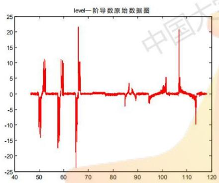  
图1 level 一阶导数原始数据图

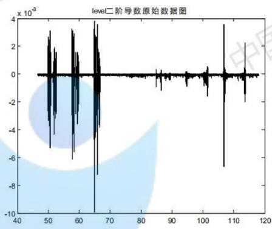  
图2 二阶导数原始数据图

X从以上图形可以看出，原图形直线部分对应的一阶导数并不为0，这是因为测量数据中包含了很多噪声。实际应用上理论方法还需要解决去噪问题。为此本文提出以下模型： 中国

## 5.1.2 基于滑动平均的去噪方法

针对离散数据的一阶导数为

$$
f _ { 1 } ^ { \prime } ( x _ { i } ) = \frac { z _ { i + 1 } - z _ { i } } { x _ { i + 1 } - x _ { i } }\tag{1-4}
$$

离散数据的噪声会导致以上公式的一阶导数剧烈波动，为消除噪声影响，本文提出基于滑动窗口内求平均的去噪方法，根据滑动窗口之间是否重叠，本文对比研究了有重叠区域的滑动窗口法和无重叠区域的滑动窗口法。

## (1)有重叠区域的滑动窗口法

选择滑动窗口长度为N，起始横坐标 $x _ { i }$ 终止横坐标为 $x _ { i + N }$

有重叠区域的滑动窗口法，第一个窗口覆盖 $x _ { 1 }$ 到 $x _ { N }$ ，第二个窗口覆盖 $x _ { 2 }$ 到$x _ { N + 1 }$ ，窗口内求平均，以此类推，则滑动窗口内的平均一阶导数记为 $\overline { { f _ { 1 } ^ { \prime } ( x _ { i } ) } }$

$$
\overline { { f _ { 1 } ^ { \ \prime } ( x _ { i } ) } } { = } \frac { 1 } { N } \sum _ { i } ^ { i + N } f _ { 1 } ^ { \ \prime } ( x _ { i } )\tag{1-6}
$$

同理，滑动窗口内的平均二阶导数记为 $\overline { { f _ { 1 } " ( x _ { i } ) } }$

$$
\overline { { f _ { 1 } " ( x _ { i } ) } } = \frac { 1 } { N } \sum _ { i } ^ { i + N } f _ { 1 } " ( x _ { i } )\tag{1-7}
$$

## (2) 无重叠区域的滑动窗口法

无重叠区域的滑动窗口法，第一个窗口覆盖 $x _ { 1 }$ 到 $x _ { N }$ ，第二个窗口覆盖 $x _ { N + 1 }$ 到国$x _ { 2 N }$ ，窗口内求平均，以此类推，则滑动窗口内的平均一阶导数记为 $\overline { { f _ { 1 } ^ { \prime } ( x _ { i } ) } }$

$$
\overline { { f _ { 1 } ^ { \prime } ( x _ { i } ) } } { = } \frac { 1 } { N } \sum _ { ( i - 1 ) N + 1 } ^ { i N } f _ { 1 } ^ { \prime } ( x _ { i } )\tag{1-6}
$$

同理，滑动窗口内的平均二阶导数记为 $f _ { 1 } ^ { " } ( x _ { i } )$

$$
\overline { { f _ { 1 } " ( x _ { i } ) } } = \frac { 1 } { N } \sum _ { ( i - 1 ) N + 1 } ^ { i N } f _ { 1 } " ( x _ { i } )\tag{1-7}
$$

考虑到滑窗法并不能将实际误差完全降低到0，选择阈值 $\lambda$ 和 $\lambda _ { 2 }$ 分别表示一阶导数阈值和二阶导数阈值，并即滑窗内区域的图形模式为Y，平行直线、斜线圆分别使用1、2、3表示。则Y满足以下条件：

$$
{ \mathrm { Y } } = \left\{ \begin{array} { l l l l l } { { 1 } } & { { \mathrm { i f } } } & { { ( \overline { { f _ { 1 } ^ { \ \ \prime } ( x _ { i } ) } } } } & { { \leq } } & { { \lambda _ { 1 } ) } } \\ { { 2 } } & { { \mathrm { i f } } } & { { ( \overline { { f _ { 1 } ^ { \ \prime } ( x _ { i } ) } } } } & { { > } } & { { \lambda _ { 1 } \mathrm { H } \overline { { f _ { 1 } ^ { \ \prime } ( x _ { i } ) } } } } & { { \leq } } & { { \lambda _ { 2 } ) } } \\ { { 3 } } & { { \mathrm { i f } } } & { { ( \overline { { f _ { 1 } ^ { \ \prime } ( x _ { i } ) } } } } & { { > } } & { { \lambda _ { 2 } ) } } \end{array} \right.\tag{1-8}
$$

应用以上模式可以求得图形中哪些数据属于水平线，哪些属于斜线，哪些属于圆。接下来由于分段的带噪声的数据分别求直线、斜线、圆的方程还需要进行拟合，即以下模型：

## 5.1.3 基于圆和直线方程的拟合方法1】

## (1)圆的拟合：

设拟合曲线为 $( x - A ) ^ { 2 } + ( z - B ) ^ { 2 } = R ^ { 2 }$ A,B,R是拟合参数变形可得到圆的拟合曲线的另外形式

$$
5 5 . ( 5 ) . 5 ^ { 2 } + 3 ^ { 2 } + a x + b z + c = 0
$$

设截取的关于圆的测量数据为 $( x _ { i } , z _ { i } ) , i = 1 \cdots N$

达到 $\operatorname* { m i n } ( { x _ { i } } ^ { 2 } + { z _ { i } } ^ { 2 } + a x _ { i } + b z _ { i } + c ) ^ { 2 }$ 求得到 $^ { a , b , c }$ 得到圆心 $\scriptstyle \ . A = { \frac { a } { - 2 } } , B = { \frac { a } { - 2 } }$ ，半径 $R = { \frac { 1 } { 2 } } { \sqrt { a ^ { 2 } + b ^ { 2 } - 4 c } }$

## (2) 直线的拟合：

设拟合曲线为 $\stackrel { \wedge } { z } = k x + b$ 其中k,b是拟合的参数

优化目标： $\operatorname* { m i n } ( k x _ { i } + b - z _ { i } ) ^ { 2 }$

$$
\mathcal { \tilde { H } } \not \equiv \frac { n \displaystyle \sum _ { i = 1 } ^ { n } x _ { i } z _ { i } - \sum _ { i = 1 } ^ { n } x _ { i } \sum _ { i = 1 } ^ { n } z _ { i } } { n \displaystyle \sum _ { i = 1 } ^ { n } x _ { i } ^ { 2 } - \sum _ { i = 1 } ^ { n } x _ { i } \sum _ { i = 1 } ^ { n } x _ { i } }
$$

$$
b = { \frac { n \displaystyle \sum _ { i = 1 } ^ { n } { x _ { i } } ^ { 2 } \sum _ { i = 1 } ^ { n } z _ { i } - \sum _ { i = 1 } ^ { n } x _ { i } z _ { i } \sum _ { i = 1 } ^ { n } x _ { i } } { n \displaystyle \sum _ { i = 1 } ^ { n } { x _ { i } } ^ { 2 } - \sum _ { i = 1 } ^ { n } x _ { i } \sum _ { i = 1 } ^ { n } x _ { i } } }
$$

根据该模型，带入实测数据，可以求得各个分段图像的方程表达式，进而求得夹角等参数。

## 5.1.4 问题一模型的求解：

(1)去噪：

分别使用有重叠滑窗和无重叠滑窗方法对一阶导数和二阶导数进行去噪，如下图所示。

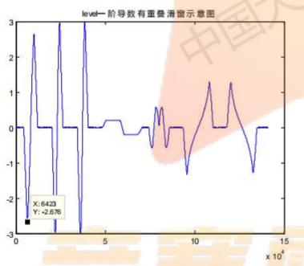

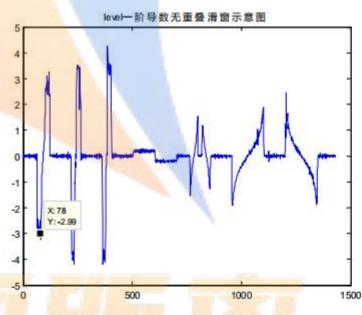  
图3 有重叠滑窗一阶导数图4 无重叠滑窗一阶导数

通过上图对比，原始工件的第2个图形竖直向下斜线部分，在有重叠滑窗条件下，几乎不能识别出来。而图4中无重叠滑窗部分存在一阶导数基本不变的短暂区域，可以大体识别出来。因此下文主要采用无滑窗的去燥方法。 中国

原始数据第一个曲线交点为下图标注点，查原始数据该点为第6052个数据。

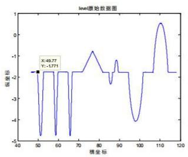

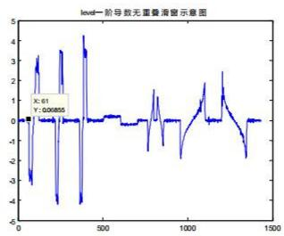

如上图是采用滑动平均后的去燥一阶导数数据 $,$ 该图的第一个拐点为61，考虑到滑窗长度设置为了100，该点对应第6100个数据。以上对比表明，该方法可以识别出不同曲线段的转折点。下图左是抓取的水平测量数据递减直线的位置，下图右是抓取的倾斜位置测量数据递减直线的位置，效果很好。（其中，一个点表示1000个数据）

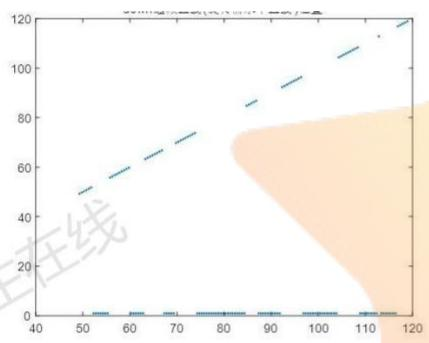

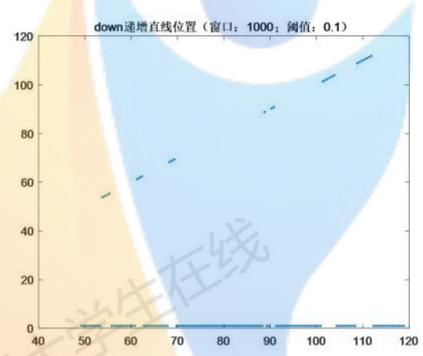

(2)拟合结果：

下面是水平放置的轮廓线的第一条和第四条和第一个圆的拟合情况，其他的见附录。

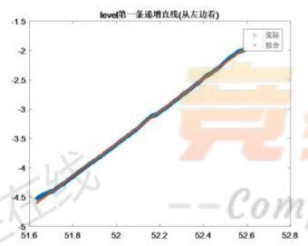

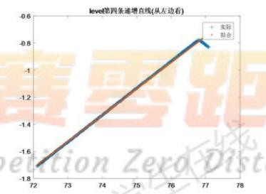

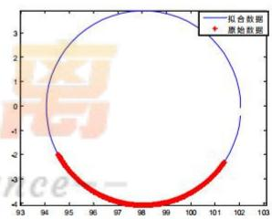

(3)工件1的参数标注：轮廓线的函数表达：

$$
\begin{array} { r l } & { | \frac { 1 } { 2 } ( 2 4 8 8 + 4 3 8 ) \times \{ 1 2 5 \} ( 6 4 8 + 2 9 8 2 5 ) \times 1 2 4 4  } \\ &  ( \frac { 1 } { 2 } - 6 4 4 8 4 + 1 0 8 8 ) \times 1 2 0 8 8 + 1 2 4 4 8 8 + 1 0 8 8 8 4 5 \times 1 0 8 8 4 5 \times 1 0 8 8 4 5 \times 1 0 8 8 4 5 \times 1 0 8 8 4 5 \times 1 0 8 8 4 5 \times 1 0 8 8 4 5 \times 1 0 8 8 4 5 \times 1 0 8 8 4 5 \times 1 0 8 8 4 5 \times 1 0 8 8 6 \times 1 0 8 8 6 \times 1 0 8 \times 1 0 8 \times 1 0 8 \times 1 0 8 \times 1 0 8 \times 1 0 8 \times 1 0 8 \times 1 0 8 \times 1 0 8 \times 1 0 8 \times 1 0 8 \times 1 0 8 \times 1 0 8 \times 1 0 8 \times 1 0 8 \times 1 0 8 \times 1 0 8 \times 1 0 8 \times 1 0 8 \times 1 0 8 \times 1 0 8 \times 1 0 8 \times 1 0 8 \times 1 0 8 \times 1 0 \times 1 0 8 \times 1 0 8 \times 1 0 8 \times 1 0 \times 1 0 8 \times 1 0 8 \times 1 0 8 \times 1 0 \times 1 0 8 \times 1 0 8 \times 1 0 \times 1 0 8 \times 1 0 8 \times 1 0 \times 1 0 8 \times 1 0 8 \times 1 0 \times 1 0 8 \times 1 0 8 \times 1 0 \times 1 0 8 \times 1 0 \times 1 0 8 \times 1 0 \times 1 0 8 \times 1 0 8 \times 1 0 \times 1 0 8 \times 1 0 \times 1 0 8 \times 1 0 \times 1 0 8 \times 1 0 \times 1 0 8 \times 1 0 \times 1 0 8 \times 1 0 \times 1 0 8 \times 1 0 \times 1 0 8 \times 1 0 \times 1 0 8 \times 1 0 \times 1 0 8 \times 1 0 \times 1 0 8 \times 1 0 \times 1 0 8 \times 1 0 \times 1 0 8 \times 1 0 \times 1 0 8 \times 1 0 \times 1 0 8 \times 1 0 \times 1 0 8 \times 1 0 \times 1 0 \times 1 0 8 \times 1 0 \times 1 0 \times 1 0 8 \times 1 0 \times 1 0 8 \times 1 0 \times 1 0 \times 1 0 8 \times 1 0 \times 1 0 \times 1 0 \times \end{array}
$$

把拟合得到的函数与x轴得到相交求交点，即对函数求零点得到所有槽口宽玉度 $x _ { 2 } , x _ { 4 }$ ，水平线段的长度 $x _ { 1 } , x _ { 3 }$ 通过圆心的参数得到圆心之间的距离 $c _ { 1 } , c _ { 3 }$ 最后两条斜线的交点求得人字形的高度 $z _ { 1 }$ o

表1轮廓线的槽口宽度及圆弧的长度、水平线段的长度
<table><tr><td> $x _ { 1 }$ </td><td> $x _ { 2 }$ </td><td> $x _ { 3 }$ </td><td> $x _ { 4 }$ </td><td> $x _ { 5 }$ </td><td> $x _ { 6 }$ </td></tr><tr><td>2.8914075 13568545</td><td>4.9982367 01987779</td><td>2.0873795 4.9800147 02859584 21154198</td><td>2.0468106 48264795</td><td>4.9940161 36801619</td><td>9.9916311 60546746</td></tr><tr><td> $x _ { 8 }$ </td><td> $x _ { 9 }$ </td><td> $x _ { 1 0 }$ </td><td> $x _ { 1 2 }$ </td><td> $x _ { 1 3 }$ </td><td></td></tr><tr><td>2.6672212</td><td>0.9356328</td><td> $x _ { 1 1 }$  1.1740463 12.268778</td><td>4.6218374</td><td>10.153688</td><td>中国大学</td></tr><tr><td>42061245</td><td>84535536</td><td>57141904</td><td>447088195 51824376</td><td>233493440</td><td></td></tr></table>

表2 轮廓线的斜线与水平线之间的夹角
<table><tr><td>∠1</td><td>∠2</td><td>∠3</td><td>∠4</td></tr><tr><td>110.1594348872009</td><td>109.9539638548886</td><td>105.0276884989337</td><td>108.5467473758782</td></tr><tr><td>∠5</td><td>∠6</td><td>∠7</td><td>∠8</td></tr><tr><td>105.0324768433333</td><td>105.8951506831928</td><td>168.9787730174710</td><td>168.6490737801013</td></tr></table>

表3轮廓线的圆弧半径
<table><tr><td> $R _ { 1 }$ </td><td> $R _ { 2 }$ </td><td> $R _ { 3 }$ </td><td> $R _ { 4 }$ </td><td> $R _ { 5 }$ </td><td> $R _ { 6 }$ </td><td> $R _ { 7 }$ </td></tr><tr><td>0.4917</td><td>0.5259</td><td>0.3802</td><td>0.9112</td><td>0.5299</td><td>3.9923</td><td>1.1702</td></tr></table>

表4轮廓线的圆心之间的距离
<table><tr><td> $c _ { 1 }$  在线</td><td> $c _ { 2 }$ </td><td> $c _ { 3 }$ </td><td> $c _ { 4 }$  线</td><td> $c _ { 5 }$ </td><td> $c _ { 6 }$ </td></tr><tr><td>7.44739</td><td>7.10274</td><td>20.17928</td><td>2.94711</td><td>9.73397</td><td>12.67828</td></tr></table>

表 5 轮廓线的斜线线段的长度
<table><tr><td rowspan="2"> $l _ { 1 }$ </td><td colspan="4"> $l _ { 4 }$ </td><td rowspan="2"> $l _ { 7 }$ </td><td rowspan="2"> $l _ { 8 }$ </td></tr><tr><td> $l _ { 2 }$ </td><td> $l _ { 3 }$ </td><td> $l _ { \mathfrak { s } }$ </td><td> $l _ { 6 }$ </td></tr><tr><td>2.852009</td><td>2.905920</td><td>3.485828</td><td>2.841833</td><td></td><td>2.851870 2.866131 4.828060</td><td>4.641530</td></tr></table>

## 5.3问题二的模型建立与求解

## 5.3.1 直线旋转量的图形校正方法[3]

首先利用前面第一问的二阶导数是否为零识别圆和直线，把所有的直线数据提取出来，分别通过拟合计算其斜率，斜率相等的直线所在的直线的斜率即是工件2的倾斜斜率，并基于此进行图形校正。

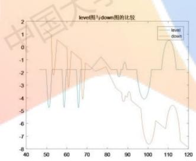

## 1. 旋转角的确定：

设 $k _ { i } , i = 1 \cdots l$ 为第i条直线的斜率， $k _ { i } ^ { \prime } , i = 1 \cdots m$ 其中差不多相等那些直线中的第i条，所以所在直线斜率tion ZexoDistance--

$$
k = \frac { 1 } { m } \sum k _ { i } { } ^ { \prime } = - 0 . 1 3 1
$$

所以倾斜角为

$$
\pmb { \theta } = \mathbf { a r c t a n } k
$$

利用前面的直线拟合算法，用matlab求解得到 $\pmb { \theta = - 0 . 1 3 = - 7 . 4 ^ { o } }$

## 2. 水平校正：

水平校正分两步：

## (1）倾斜测量数据的旋转

把倾斜的数据旋转：

$$
{ \left( \begin{array} { l } { { \pmb x } _ { i } ^ { 0 } } \\ { { \pmb z } _ { i } ^ { 0 } } \end{array} \right) } = { \left( \begin{array} { l l } { \cos \theta } & { \sin \theta } \\ { - \sin \theta } & { \cos \theta } \end{array} \right) } { \left( \begin{array} { l } { x _ { i } ^ { \prime } } \\ { z _ { i } ^ { \prime } } \end{array} \right) } , i = 1 \cdots n
$$

其中 ${ \binom { { \pmb x } _ { i } ^ { ~ 0 } } { z _ { i } ^ { ~ 0 } } } , i = 1 { \cdots } n$ 为工件1倾斜的数据水平旋转之后得到的数据，学生在线  
${ \binom { x _ { i } ^ { \prime } } { z _ { i } ^ { \prime } } } , i = 1 \cdots n$ 为倾斜放置的工件1测量的原始数据。国

## (2) 比较平移量

计算每一个点的平移量： ${ \pmb x } _ { i } ^ { 0 } - x _ { i } , i = 1 \cdots n$

取平均得到整个轮廓的水平平移量 ${ \pmb a } = \frac { 1 } { \pmb { \operatorname { n } } } \sum _ { i = 1 } ^ { n } ( { \pmb x } _ { i } ^ { 0 } - { \pmb x } _ { i } )$

通过几个特别的点，比如圆心验证。

(3)检验：

根据上面求得旋转角度为θ，水平偏移量为a，

$$
{ \binom { m x _ { i } } { m z _ { i } } } = { \left( \begin{array} { l l l } { \cos \theta } & { - \sin \theta } & { a } \\ { \sin \theta } & { \cos \theta } & { 0 } \\ { 0 } & { 0 } & { 1 } \end{array} \right) } { \left( \begin{array} { l } { x _ { i } } \\ { z _ { i } } \\ { 1 } \end{array} \right) } , i = 1 \cdots n
$$

${ \binom { x _ { i } } { z _ { i } } } , i = 1 \cdots n$ 为水平放置的工件1测量的原始数据，

${ \binom { m x _ { i } } { m z _ { i } } } , \ i = 1 \cdots n$ 为水平放置的旋转角度得到的数据。mpetition ZeroDistanc

通过误差平方和的平均检验上面得到的倾斜角度和水平偏移量的准确性，即

$$
{ \frac { 1 } { n } } \sum _ { i = 1 } ^ { n } ( x _ { i } ^ { \prime } – m x _ { i } ) ^ { 2 } + ( z _ { i } ^ { \prime } – m z _ { i } ) ^ { 2 }
$$

从旋转后的和水平放置的原始数据对比图看出效果很好：

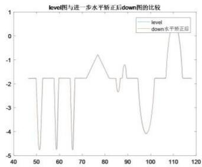

## 3. 对校正后的数据进行标注参数：

利用问题一模型里的三步：第一，识别圆和直线，第二，拟合直线和圆，第

## 三，得到路廓线函数表达，计算参数。

$$
\begin{array}{c} \begin{array} { r l } & { \begin{array} { r l } & { [ - 2 \sqrt { 6 } \Lambda ( 4 ) + 1 2 2 \mathcal { L } \Lambda ^ { 2 }  } \\ & {  - 3 \sqrt { 6 } \Lambda ( 4 ) + 6 \Lambda ^ { 2 } ] \Lambda ^ { 2 } + 4 2 7 8 4 \Lambda ^ { 3 } } \end{array} } \\ & { \begin{array} { r l } & { - 3 6 0 6 \Lambda ^ { 4 } - 1 2 4 7 2 4 \Lambda ^ { 2 } } \\ & { [ - 3 6 4 \Lambda ^ { 2 } + 5 6 \Lambda ^ { 2 } ] \Lambda ^ { 2 } + 1 2 4 7 8 4 \Lambda ^ { 3 } } \end{array} } \\ & { \begin{array} { r l } & { - 3 6 0 6 \Lambda ^ { 4 } + 1 2 5 2 \Lambda ^ { 2 } } \\ & { [ - 3 6 4 \Lambda ^ { 2 } + 1 2 5 2 \Lambda ^ { 2 }  } \\ & { [ - 3 6 4 \Lambda ^ { 2 } + 1 2 5 2 \Lambda ^ { 2 }  } \\ & { [ - 1 2 4 5 2 \Lambda ^ { 2 } + 1 2 5 2 \Lambda ^ { 2 }  } \end{array} } \\ & {   - 3 6 4 \Lambda ^ { 2 }  } \end{array}  \\ & { \begin{array} { r l } & { - 3 6 0 6 \Lambda ^ { 4 } + 1 2 5 2 \Lambda ^ { 2 } } \\ & { [ - 5 6 4 \Lambda ^ { 2 } + 2 4 7 2 \Lambda ^ { 2 }  } \\ & { [ - 1 2 4 5 2 \Lambda ^ { 2 }  } \end{array} } \\ & {   - 3 6 4 \Lambda ^ { 2 }  } \end{array} \end{array} ] \Lambda ^ { 2 } + 4 2 5 2 1 \Lambda ^ { 2 }  \\ &  \begin{array} { r l } & { 0 . } \\ & { [ - 1 2 5 6 \Lambda ^ { 4 } - 1 4 4 5 4 \Lambda ^ { 2 }  } \\ & { [ - 1 2 1 6 5 8 4 \Lambda ^ { 2 } - 1 5 2 4 2 \Lambda ^ { 2 }  } \\ & { [ - 1 2 1 6 5 8 4 \Lambda ^ { 2 } - 1 2 5 4 2 \Lambda ^ { 2 }  } \\ &   [ - 1 2 1 6 5 
$$

## 5.4问题三的模型建立和求解：

本问题考虑的是在对工件作多次检测过程中，工件每次放置的角度、测量的起点和终点都会有偏差，此时如何根据已测得的多组数据复原工件完整轮廓的问CompetitionZeroDistance--题。

## 5.4.1基于多组测量数据复原完整轮廓的方法

## 1. 每次测量的倾斜角度：

我们假设工件2中水平放置时本身有很多的水平线，仍然使用问题一的方法区分出直线和圆，那么斜率差不多相等的直线段比较多，那么这倾斜角的平均为此次测量的倾斜角度，所以类似问题二中求解倾斜角的模型得到每次测量的倾斜角。

## 2.对比得到工件2轮廓的全部水平测量数据

(1)先把每一次的数据通过进行旋转

$$
{ \binom { x _ { i } ^ { \mathrm { ~ j ~ } } } { z _ { i } ^ { \mathrm { ~ j ~ } } } } = { \binom { \cos \theta } { \sin \theta } } \quad - \sin \theta \left( { x _ { i } ^ { \mathrm { ~ j ~ } } } \right) , i = 1 \cdots n , j = 1 , 2 \cdots 1 0
$$

设为第j次的测量数据 $( { x _ { i } } ^ { j } , { \ z _ { i } } ^ { j } ) , i = 1 \cdots n , \ j = 1 , 2 \cdots 1 0$ 在线第j次旋转后的测量数据 $( x _ { i } ^ { \mathrm { ~ j 0 } } , z _ { i } ^ { \mathrm { ~ j 0 } } ) , i = 1 \cdots n , j = 1 , 2 \cdots 1 0$

## (2)整合为一组数据

因为多次测量位置不同，每次测量的整个工件2的部分，对比第j次旋转后的测量数据 $( x _ { i } ^ { \mathrm { ~ j 0 } } , z _ { i } ^ { \mathrm { ~ j 0 } } ) , i = 1 \cdots n , j = 1 , 2 \cdots 1 0$ .得到工件2的水平校正后的整体数据 $( { x _ { i } } ^ { 0 } , { z _ { i } } ^ { 0 } ) , i = 1 \cdots n .$

## 5.4.2 基于多组测量数据复原完整轮廓的方法具体求解步骤

步骤1：基于在问题1中建立起来的基于一阶二阶导数的模式识别方法和基于滑动平均的去噪方法对附件2中给出的10组测量数据进行直线或圆的图形类型的识别，并抓取每个图形所在的位置信息。

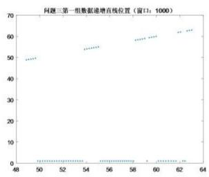

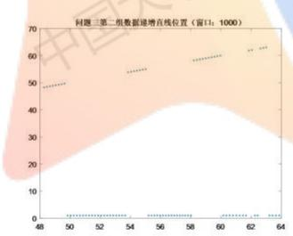

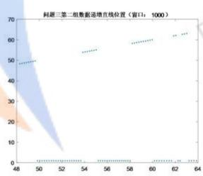

步骤2：基于步骤1获得的图形类型及其位置信息，挖掘每组数据的图形结构信息。具体地，首先确定每组中的直线有几条，圆有几个；其次，根据位置信息将这些直线和圆的前后位置关系搞清楚，从而对所测工件的结构有了框架性的认识。 大学 A

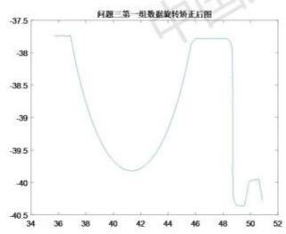

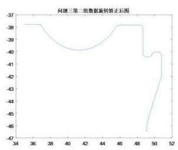  
步骤3：基于每条直线的位置信息，抓取附件2中直线的原始数据。然后通过拟

合的方法，得到每条直线的方程。

步骤4：根据直线的斜率相等与否，对每组数据中的直线进行分类。把每组中直线数量最多的类作为目标类。将目标类中直线的斜率作为本组数据的旋转角度θ。

步骤 $5 :$ 基于问题2中建立的直线旋转量的的图像校正方法，以旋转角度 $\pmb \theta$ 对每组数据进行图像矫正。 学生在纹

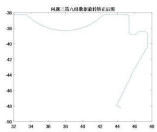

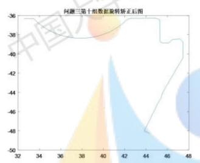

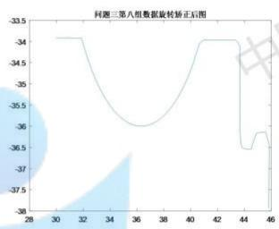

步骤6：对每组数据矫正后的图像进行比较，选用每组数据中从左边起第一个圆的位置作为基准，对每组数据进行水平方法的平移矫正。

步骤7:对步骤6得到的矫正后的数据以横坐标范围的大小对数据进行同一整合，复原工件的轮廓。

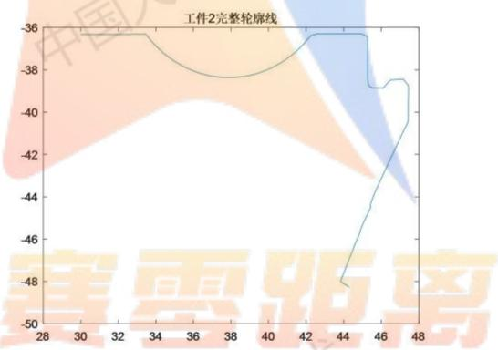

依据问题1建立的方法，对复原之后的工件2进行测量，数据如下：

圆的圆心坐标：（37.8866，-32.5784）半径：5.7886

水平直线（从左边看起）的长度：

第一条：3.8256；第二条：3.3156；第三条：0.8752；第四条：1.1463

垂直直线（从上边看起）的长度：

第一条：2.7381；第二条：1.9542

斜线（从上边看起）的长度：

第一条：9.0421；第二条：0.3862

## 5.5问题四的模型建立和求解

该问提供了多组局部的测试数据，包含了圆和角的多次测量。局部的测试数据相比第三问的全局测试数据更加精细，目的是为了解决全局测试时个别局部区域标注偏差较大的问题。基于此，本文采用一种基于多组局部数据修正全局图像的方法。 七在线

## 5.5.1基于多组局部数据修正全局图像的方法

该方法分为以下几步：

步骤一：使用问题一的方法识别出每组局部数据的图形模式，即它是圆的一部分还是直线。

步骤二：使用问题二的方法，对该组局部数据进行校正。

步骤三：使用校正后的局部数据与第三问全局数据进行等效匹配，从而确认校正后的局部数据是全局数据中的某一区域的放大。

步骤四：根据校正后的数据计算各个参数，并修正全局图形

步骤五：对其他各组局部数据重复以上步骤，得到修改后的完整工件图形。

按照以上步骤，以第一组圆形数据为例进行处理，其余数据的处理结果见附录。

如下图所示，是第一组圆的原始局部数据图形：

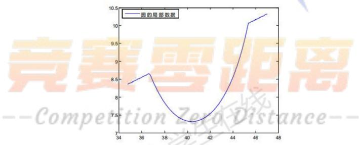

然后使用问题一和问题二中的算法进行校正，得到下图：

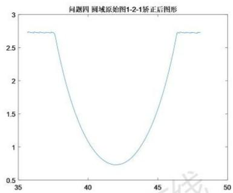

与问题三中得到的全局图形的各个参数进行匹配，得到以上局部数据为全局图形中第一处圆弧的数据。 国大 国

对以上数据进行拟合计算，求得圆的各个参数，如下表

本问第一组局部数据圆弧参数
<table><tr><td>横坐标 纵坐标</td><td>半径</td></tr><tr><td>0.4937 0.5229</td><td>0.9172</td></tr></table>

如下表是第三问全局数据的第一处圆弧参数

第三问全局数据第一处圆弧参数

<table><tr><td>横坐标</td><td>纵坐标 半径</td></tr><tr><td>0.4917</td><td>0.5259 0.9112</td></tr></table>

从以上数据可以看出，圆的局部数据与全局数据第一处圆弧的参数相差不大。可以使用该出局部数据的参数对全局数据的图形进行修正。

对第一处局部角度数据作相同处理，如下是第一处角的原始数据：

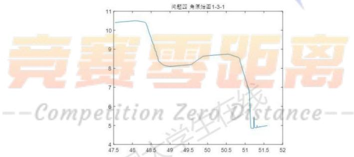

校正的图形如下：

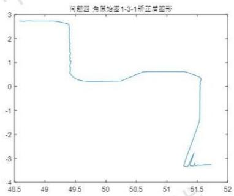

得到如下修正后的工件轮廓图：

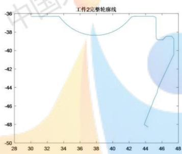

## 6 模型的评价

1.整个问题的求解中，我们建立的基于一阶二阶导数的提取圆和直线的识别模型进行去噪处理可以重复使用，效果很好，可以很快的识别数据是圆还是直线。

2.基于旋转量的图像矫正方法做了逆旋转进行比较检验效果好。

3.所有模型的求解过程无需人工参与，实现的自动标注。

4.如果想做到自动标注，需要做一个算法，实现如果是圆那么我们得到圆的参数$R _ { 1 } , R _ { 2 }$ ，如果是直线得到直线的倾斜角，所有的轮廓部分都识别拟合完成后对函数求零点得到所有槽口宽度 $x _ { 2 } , x _ { 4 }$ ，水平线段的长度 $x _ { 1 } , x _ { 3 }$ 通过圆心的参数得CompetitionZeroDistance到圆心之间的距离 $c _ { 1 } , c _ { 3 }$ ，最后只需要最后求人字形的高度 $z _ { 1 }$ A

## 7 参考文献

[1]最小二乘法圆拟合https://wenku.baidu.com/

[2]接触式三坐标测量自由曲面轮廓的数据处理模型[]]，仇谷烽：余景池：黄启泰;

[3]李顺，巩岩.长程轮廓仪用于筒状超光滑表面测量的误差分析及校正[J].

光学学报，2011(11):125-131.

## 附录：

```matlab
clc,clear;
close all;
%导入数据 大学生
gj1=xlsread(’附件1 工件1的测量数据');
x_gj1=gj1(:,1);z_gj1=gj1(:,2);
plot(x_gj1,z_gj1)
```

```matlab
%设置窗口大小及存放一阶导数、二阶导数、均值、方差等的数组
size_chuangkou=1000;
m=ones(p, 1);
n=ones(p,1);
x_new=ones(p,1);
z_new=ones(p, 1);
零距离
zhixnew=ones(p, 1);
-Competition ZexoDistance-
```

```matlab
%求一阶导数k1、二阶导数k2以及根据窗口去噪的方法求窗口均值和方差
for d=1:p 中 中
v=(d-1)*size_chuangkou;
k1=ones(size_chuangkou);
for i=1:size_chuangkou
k1(i)=(z_gj1(i+v+1)-z_gj1(i+v))/(x_gj1(i+v+1)-x_gj1(i+v));
```

```matlab
k2=ones(size chuangkou);
fori=1:size_chuangkou
k2(i)=(k1(i+1)-k1(i))/(x_gj1(i+v+1)-x_gj1(i+v));
end线
n(d)=var(k2(1:size_chuangkou));
x_new(d)=x_gjl(d*size_chuangkou+1);
z_new(d)=z_gjl(d*size_chuangkou+1);
zhi_m(d)=mean(k1(1:size_chuangkou));
zhi n(d)=var(k1(1:size chuangkou));
zhi_x_new(d)=x_gjl(d*size_chuangkou+1);
end
%plot(zhi_x_new(1:p),zhi_m(1:p),'.')
%hold on
%设置二阶导数的窗口均值的阈值，抓取圆域所在的位置
x_circle=ones(p,1);
for i=1:p 竞赛零距离
if m(i) >3.
主在线
end
end
%plot(x_new(1:p),x_circle(1:p),'.')
%hold on
```

%通过抓取到的圆域的位置，抓取圆域的原始数据以备拟合圆的方程之用

```matlab
j=0;
x_nihe=ones(20000,1);
z_nihe=ones(20000,1);
fori=1:p
if x_circle(i)>2
在线
x_nihe(j+k)=x_gjl(i*size_chuangkou+k);
z_nihe(j+k)=z_gj1(i*size_chuangkou+k);
end
j=j+size_chuangkou;
end
end
```

```matlab
%圆的拟合计算圆心，半径
%xx=xlsread('新建 Microsoft Excel 工作表');
x=x_gj1(10001:13000);y=z_gj1(10001:13000);
N=1ength(x);
C=N*sum(x.^2)-sum(x)*sum(x);
D=N*sum(x.*y)-sum(x)*sum(y);
E=N*sum(x.^3)+N*sum(x. *y.^2)-sum(x.^2+y. ^2)*sum(x);
G=N*sum(y.^2)-sum(y)*sum(y);
H=N*sum(x. ^2. *y)+N*sum(y. ^3)-sum(x.^2+y. ^2)*sum(y)
a=(H*D-E*G)/(C*G-D2);petitionZexoDistance
b=(H*C-E*D)/(D^2-G*C);
c=-(sum(x.^2+y.^2)+a*sum(x)+b*sum(y))/N;
A=a/(-2);
B=b/(-2);
R=1/2*sqrt(a^2+b^2-4*c);
%设置一阶导数窗口均值的阈值，抓取直线所在的位置
```

```matlab
x zhi=ones(p);
for i=1:p
if zhi_m(i)>0.15
x_zhi(i)=zhi_x_new(i);
end
中国大学生在线
x_zhi(i)=1;
end
end
plot(zhi x new(1:p),x zhi(1:p),'.')
hold on
title('level水平直线位置（窗口：1000；）’)
%通过抓取到的直线的位置，抓取直线的原始数据以备拟合直线的方
s=0;
z_nihe_zhi=ones(20000,1);
for i=1:p
if x_zhi(i)>2
for k=1siz huangkou熏距离
x_nihe_zhi(s+k)=x_gj1(i*size_chuangkou+k)
主在线 z_nihe_zhi(s+k)=z_gjl(i*size_chuangkou+k);
end
end
end
%直线的拟合求出斜率和截距
x=x_gjl(22301:23500)';y=z_gjl(22301:23500)';
```

```matlab
%x=x_nihe_zhi(17101:19700)';y=z_nihe_zhi(17101:19700)';
a = x*x';
b = sum(x);
c = x*y';
d = sum(y);
N=1ength(x);
%求解斜率 k
中 中国
% 求解截距 t
t = (a.*d-c.*b)/(a*N-b.*b);
plot(x, y,'+')
hold on
plot(x,k*x+t,'.')
title('1evel第二条递减直线(从左边看)’
legend('实际’，’拟合’) 国大学生在线
中国
%图形的旋转矫正和水平偏移矫正
xuanZhuanJiao=0.130361871364958;
x_jiaoZheng=cos(xuanZhuanJiao)*x_gjl_down-sin(xuanZhuanJiao)*z_gjl_c
wn;
z_jiaoZheng=sin(xuanZhuanJiao)*x_gjl_down+cos(xuanZhuanJiao)*z_gjl_c
TG
wn; 线
z_weitiao=mean(z_jiaoZheng)-mean(zgjllevel);ance —
x_weitiao=mean(x_jiaoZheng)-mean(x_gjl_level);
x_pianyi=x_weitiao+0.33; 中国
z_jiaoZheng_chuizhi=z_jiaoZheng-z_weitiao;
x_jiaoZheng_shuiping=x_jiaoZheng-x_pianyi;
plot(x_gjl_level,z_gjl_level)
hold on
```

```matlab
y0=mean(z_gj1(14690:21690)); 在线
kd1=-2.723867741639066;bd1=133.8002234310488;
kd2=-3.724845609376202;bd2=213.0069757236736;
kd3=-3.723602901285295; bd3=239.2514907860618;
kd4=-0.200744158613707;bd4=14.645116449010247;
kd5=-0.565025739534814; bd5=45.935780974909875;
kd6=-1.123311555044076;bd6=98.725881910432650;
kd7=-0.343117911107307;bd7=29.331114981311476;
kd8=-0.425604356360074; bd8=47.817846154298124;
```

plot(x\_jiaoZheng\_shuiping,z\_jiaoZheng\_chuizhi)title('level 图与进一步水平矫正后 down 图的比较')legend('level','down 水平矫正后')

%问题中参数的计算

```javascript
ku1=2.754359108225884; bu1=-146.8171658730294;
```

```javascript
ku2=2.980598439534949; bu2=-179.8507093519987;
```

```javascript
ku3=3.511651703755757; bu3=-236.2555247229892;
```

```javascript
ku4=0.194764774178566; bu4=-15.745625965295059;
```

```javascript
ku5=1.312714609538673; bu5=-115.4903009149167;
```

```javascript
ku6=1.119240436916190;bu6=-99.776517012025040;
```

```javascript
ku7=1.472580398274092; bu7=-151.5742987893202;
```

```javascript
ku8=1.001404926554808;pbu8=-108.2696306825218;anc e
```

```javascript
k2u1=1.873469412912976;b2u1=-102.8003499165892;
```

k2u2=2.441766357967081;b2u2=-152.1327739769671;

k2u3=2.414152499053679;b2u3=-168.2737582070639;

k2d1=-0.129926436840446;b2d1=7.740846276449202;

```javascript
k2d4=-0.131105391993604;b2d4=7.811663609602934;
```

```javascript
k2d2=-0.130937034696584;b2d2=7.799039243107876;
```

k2d3=-0.131141148034880; b2d3=7.813060406404597;

%下降曲线的折现点横坐标

$$
\operatorname { t d 1 } = \left( { \mathrm { y 0 - b d 1 } } \right) / { \mathrm { k d 1 } } ;
$$

$$
\scriptstyle \mathrm { t d 2 = ( y 0 - b d 2 ) / k d 2 } ;
$$

$$
\scriptstyle { \mathrm { t d } } 3 = \left( { \mathrm { y } } 0 - { \mathrm { b d } } 3 \right) / { \mathrm { k d } } 3 ;
$$

$$
\scriptstyle \mathrm { t d } 4 = \left( \mathrm { y } 0 \mathrm { - b d } 4 \right) / \mathrm { k d } 4 ;
$$

$$
\scriptstyle \mathrm { t d } 5 = \left( \mathrm { y } 0 - \mathrm { b d } 5 \right) / \mathrm { k d } 5 ;
$$

$$
\scriptstyle \mathrm { t d 6 = ( y 0 - b d 6 ) / k d 6 } ;
$$

$$
\scriptstyle \mathrm { t d 7 = ( y 0 - b d 7 ) / k d 7 } ;
$$

$$
\scriptstyle \mathrm { t d } 8 = \left( \mathrm { y } 0 - \mathrm { b d } 8 \right) / \mathrm { k d } 8 ;
$$

%上升曲线的折现点横坐标

$$
\scriptstyle { \mathrm { t u 1 } } = ( { \mathrm { y 0 - b u 1 } } ) / { \mathrm { k u 1 } } ;
$$

$$
\scriptstyle \mathrm { t u 2 = ( y 0 - b u 2 ) / k u 2 } ;
$$

$$
\scriptstyle { \mathrm { t u 3 } } = \left( { \mathrm { y 0 - b u 3 } } \right) / { \mathrm { k u 3 } } ;
$$

$$
\scriptstyle \mathrm { t u 4 = ( y 0 - b u 4 ) / k u 4 } ;
$$

$$
\scriptstyle \mathrm { t u } 5 = \left( \mathrm { y } 0 - \mathrm { b u } 5 \right) / \mathrm { k u } 5 ;
$$

$$
\scriptstyle \mathrm { t u 6 = ( y 0 - b u 6 ) / k u 6 } ;
$$

$$
\scriptstyle { \mathrm { t u 7 } } = ( { \mathrm { y 0 - b u 7 } } ) / { \mathrm { k u 7 } } ;
$$

tu8=(y0-bu8)/ku8;CompetitionZexoDistance--

$$
\scriptstyle \mathrm { x } 1 = \mathrm { t u } 1 - \mathrm { t d } 1 ;
$$

$$
\mathrm { x 2 \mathrm { = } t d 2 \mathrm { - } t u 1 } ;
$$

$$
\scriptstyle \mathrm { x 3 = t u 2 - t d 2 } ;
$$

$$
\scriptstyle \mathtt { x 4 } = \mathtt { t d 3 } - \mathtt { t u 2 } ;
$$

$$
\scriptstyle \mathtt { X } 5 = \mathtt { t u 3 \mathrm { - t d 3 } } ;
$$

```javascript
xuanzhuanjiaol=atan(kul)*180/3.141592-atan(k2ul)*180/3.141592;
```

```javascript
xuanzhuanjiao2=atan(ku2)*180/3.141592-atan(k2u2)*180/3.141592;
```

```javascript
y_jian=bu4+ku4*(bd4-bu4)/(ku4-kd4)-y0;
```

$$
_ { \mathrm { X 6 = t u 4 - t u 3 } } ;
$$

$$
_ \mathrm { x 7 = t d 4 - t u 4 ; }
$$

$$
\scriptstyle \mathrm { x } 8 = \mathrm { t d } 5 - \mathrm { t d } 4 ;
$$

$$
_ { \mathrm { X } } 9 { = } _ { \mathrm { t u } } 6 { - } \mathrm { t u } 5 ;
$$

$$
\mathrm { x 1 0 { = } t d 7 { - } t d 6 ; }
$$

$$
\mathrm { \ x l 1 { = } t u 7 { - } t d 6 } ;
$$

$$
\scriptstyle \mathrm { { x 1 2 = t u 8 - t u 7 } } ;
$$

$$
\mathrm { x 1 3 { = } t d 8 { \ - } t u 8 { \ ; } }
$$

```matlab
j1=atan(kd1)*180/3.141592+180;
j2=180-atan(ku1)*180/3.141592;
j3=atan(kd2)*180/3.141592+180;
j4=180-atan(ku2)*180/3.141592;
j5=atan(kd3)*180/3.141592+180;
j6=180-atan(ku3)*180/3.141592;
j7=180-atan(ku4)*180/3.141592;
j8=atan(kd4)*180/3.141592+180;
```

```javascript
xuanzhuanjiao3=atan(ku3)*180/3.141592-atan(k2u3)*180/3.141592;
```

```lisp
x_jian=(bd4-bu4)/(ku4-kd4);
```

支撑材料的文件列表：

1.down 矫正之后的数据\_new.xlsx

2.程序整理.txt

3.第二问相关图片.docx

4.第三问轮廓重构后数据.x1sx

5.第四问相关图片圆.docx

6. 问题三的结果.docx

