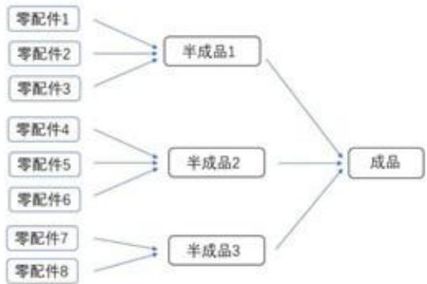
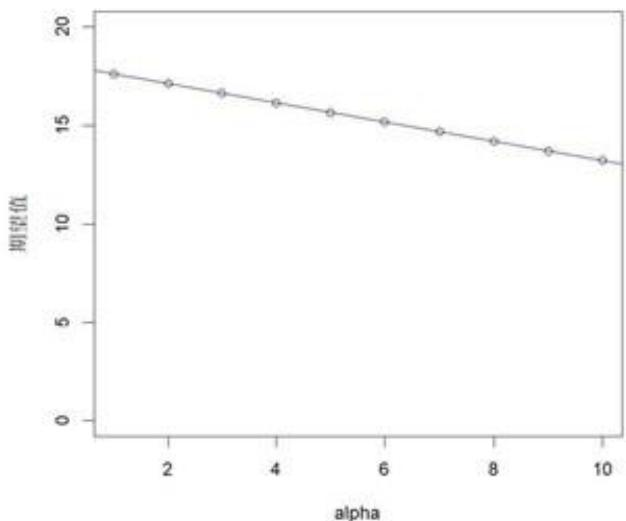
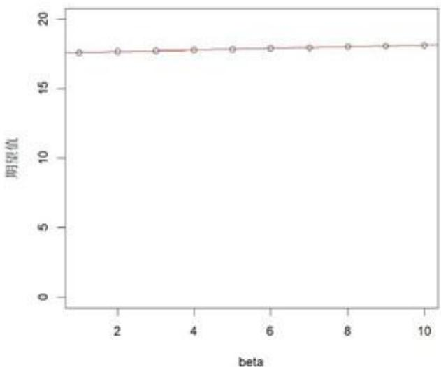

# 生产过程中的决策优化设计

## 摘要

本文针对某企业在生产电子产品过程中所面临的次品率、检测及拆解等一系列决策问题展开研究。通过优化生产过程中的抽样、检测和拆解策略，最大化企业利润和生产效率。本文的研究旨在为企业提供一套基于数学建模的决策方案，帮助其在面对不同生产条件时合理选择抽样、检测和拆解策略，提升资源利用率和经济效益。

针对问题一，为通过抽样检测判断次品率是否超过标称值，本文分别针对(1)(2)情形建立了假设检验问题，进而得到了是否接收零配件的条件。为确定合适的抽样样本量，本文利用检测花销与假设检验效果(运用假设检验功效函数衡量)之间相互制约的关系，建立决策函数，得到了最优样本量。

针对问题二，为针对六种不同情况做出决策，本研究运用二项分布和几何分布的性质，在不同决策方案下，用各零件检测成本、次品率、调换成本等值表示出每生产一个合格成品的利润期望值。再依次将六种情况的具体数值带入到表达式之中，将利润期望最大化作为决策标准，得到六种情况下的最优决策。

针对问题三，为解决多工序制造系统中的零件、半成品与成品的次品检测和拆解决策问题，求解目标在于合理设计检测与回收策略及最大化系统的期望利润。首先构建状态-决策模型，定义零件、半成品和成品的状态变量与决策变量，将问题转化为多阶段决策问题。模型通过动态规划算法有效求解最优决策路径，计算各个阶段的成本和收益，并利用记忆化存储提高求解效率。最终求解结果显示，按照最优检测与拆解策略，系统的最优期望利润为56.7元。

针对问题四，为描述次品率的不确定性，本问运用贝叶斯估计，选用共轭先验分布beta分布，推导出次品率服从的后验分布。完成问题二，计算出在次品率服从的分布下利润的期望，重新进行决策。完成问题三，修改固定的次品率为分布密度后，重新运行程序获得最优决策路径和相应最优利润期望为54.2元。经过灵敏度检验，先验分布超参数的选取对利润期望的影响较小。

关键词：假设检验 状态-决策模型 动态规划算法 贝叶斯估计 共轭先验分布

## 一. 问题重述

## 1.1 问题背景

某企业进行电子产品的装配生产，从零配件供应商处购买所需零配件，但零配件会有一定的次品，次品率会影响该企业成品的合格率；企业装配零配件形成半成品、装配半成品形成成品的过程也并不能达到完全正确，进而也会影响成品合格率。次品会使企业收益降低，但零配件、半成品、成品的检测及拆解也需要企业承担相应成本，因此企业需考虑生产过程中的各步检测及拆解策略，以期达到利润最大化。

## 1.2 问题重述

企业购买多种零配件进行装配，在生产过程中任一零配件不合格均会导致成品的不合格，此外，在零配件全部合格的情况下会出现装配过程导致的半成品及成品的不合格。企业可以选择对零配件、半成品、成品进行检测，对于不合格的零配件，直接丢弃；对于不合格的半成品及成品，企业可以选择将其进行拆解，拆解过程不会导致零配件的损耗，拆解出的零配件可以重新进行装配使用。企业的生产成本除了包含零配件购买及装配成本外，检测及拆解费用均需企业自行承担，如果出现顾客购买到不合格品的情况，企业给予无条件退换并承担调换损失。

现需根据问题给定的条件对企业购买零配件进行抽样检测的过程以及企业的生产过程进行决策。

问题一为了检验供应商供应的零配件次品率是否超过供应商给出的标称值，进而决定是否接收这批零配件，企业需要使用抽样检测方法进行验证并自行承担检测费用。现需设计标称值为10%条件下的抽样检测方案，以期平衡检测结果可靠性尽可能高及检测次数尽可能少两方面，并针对(1)、(2)两种具体情况给出具体结果。

问题二在仅考虑两种零配件直接装配成为成品的生产流程条件下，企业购买的零配件次品率及成品装配次品率均已知，现需自行确立决策依据和决策指标，进一步建立决策模型来帮助企业判断在生产过程中是否需要检测零配件、成品质量以及对于不合格的成品是否需要拆解，并针对题目给出的零配件次品率、购买成本及检测成本；成品次品率、装配成本、检测成本及市场售价；不合格成品的调换损失及拆解成本均有确定取值的6种具体情况给出生产过程决策方案及决策指标值。

问题三在考虑8个零配件装配成3个半成品，再由半成品装配成为成品的条件下，建立决策模型来帮助企业判断在生产过程中是否需要检测零配件、半成品、成品质量以及对于不合格的半成品、成品是否需要拆解，并针对题目给出的零配件次品率、购买成本及检测成本；半成品次品率、装配成本、检测成本及拆解费用：成品次品率、装配成本、检测成本及市场售价：成品的调换损失及拆解成本均有确定取值的1种具体情况给出生产过程决策方案及决策指标值。

  
图1 问题三生产流程示意图

问题四在问题二、问题三的决策模型基础上，将零配件、半成品、成品的次品率给定取值变化为通过抽样检测方法得到的相应取值，进一步优化决策模型，并给出问题二、问题三具体情况中其余给定取值不变时的决策方案及决策指标值。

## 二、问题分析

问题一 企业通过抽样检测的方式判断一批零件的次品率是否小于标称值相当于统计学中的假设检验问题。可使用简单随机抽样抽取检测样本，由于企业需要做检测成本与检测效果之间的权衡，需找寻最佳样本量。可利用检测单价与检测样本量的乘积表现检测成本，利用假设检验的功效函数表现假设检验的效果，将二者线性组合为决策函数，寻找使得决策函数取极值的检测样本量作为最佳样本量。

问题二 企业需要解决下述四个决策问题：(1)零配件1是否检测：(2)零配件2是否检测：(3)成品是否检测；(4)不合格成品是否拆解。故共存在16种决策方案。定义最佳方案为利润期望最大的方案，利用二项分布和几何分布的性质，分别严格求出16种决策方案每生产出一个合格单品利润的期望。再将六种情型的具体数值代入利润期望公式，得出每种情形的最佳决策方案及决策指标值。

问题三 企业需要解决下述五类决策问题：(1)零配件1-8是否检测；(2)半成品是否检测：(3)不合格半成品是否拆解：(4)成品是否进行检测：(5)不合格成品是否拆解。基于题目给出的8个零配件和3个半成品，问题二使用的对每种决策方案求利润期望的方法对应的决策方案数量过多，且无法推广至m道工序、n个零配件的生产情况，故考虑将该问题转化为一个多阶段决策问题，建立状态-决策模型，并通过动态规划算法来求解最优策略及决策指标值。

问题四为衡量次品率取值可能存在的“误差”，可利用贝叶斯估计，选用共轭先验分布Beta分布，得到参数的后验分布。重新解决问题二，可将第二问中求出的利润期望公式视作次品率的函数，在本问的假定下，次品率服从某一分布，可进一步计算在次品率的后验分布下利润的期望。比较16种决策方案的利润期望得到最佳决策方案。重新解决问题三，分析可得唯一的不同在于，在问题三中未检测的零件、半成品(组成零件均合格)、成品(半成品均合格)是否为次品均服从次品率固定的伯努利分布，问题四引入了Beta分布来描述次品率的不确定性。通过推导，得出新的次品概率分布，并在此基础上进行最优决策。

## 三、模型假设

假设一：所有决策为确定性决策，适用于生产线上所有相应节点。

说明：假设生产过程中不涉及概率性问题，每一项决策(如是否检测、是否拆解等)都是确定的。这意味着在任何时候，检测、拆解等操作要么执行，要么不执行，并且这一决策适用于所有相关节点。这样处理降低了流水线决策成本，符合实际生产中工厂流水线的情况。

假设二：退回成品拆解后，若无法确定相应零件或半成品是否为次品，则必须进行检测。说明：假设在拆解后的零件和半成品存在质量不确定性时(即之前未对该半成品或零件进行检测)，必须进行检测。此假设考虑到企业质量控制的需要，确保每个生产阶段的次品得以及时识别和处理，更重要的是显著提升效率，防止次品在流水线上无限循环，合理地简化了模型。

四、符号说明
<table><tr><td>符号</td><td>说明</td></tr><tr><td>n</td><td>抽样检测样本量</td></tr><tr><td>V</td><td>售卖成品的单位利润</td></tr><tr><td>P</td><td>成品市场售价</td></tr><tr><td>C</td><td>合格成品的单位成本</td></tr><tr><td> $S _ { \xi }$ </td><td>t时刻零件1-8、半成品1-3及成品的状态变量</td></tr><tr><td> $a _ { t }$ </td><td>t时刻零件1-8、半成品1-3及成品的决策变量</td></tr><tr><td>R</td><td>成品收益，包括销售收益和相应拆解后半成品或零件的回收收益</td></tr><tr><td>α,β</td><td>先验分布中的超参数</td></tr></table>

## 五、问题一模型建立及求解

在频率学派假设检验的理论体系下，原假设和备择假设的地位存在差异，本问题中企业对于拒收与接收的态度也存在差异，故可以利用假设检验的思想处理该问题]。而(1)和(2)两个情形下，不仅仅只有显著性水平的差别，原假设与备择假设互相相反，故在下文中分开对两个情景进行讨论。

## 5.1 (1)情形

使用简单随机抽样检验次品率，假定共抽取n个样本且每一个样本是否为次品独立同分布，则该问题可运用如下数学语言进行表达：

$$
\begin{array} { r l } & { X _ { 1 } , X _ { 2 } , . . . . . , X _ { n } i . i . d . \sim B ( 1 , p ) } \\ & { ~ X _ { i } = \left\{ \begin{array} { l l } { 1 , \widehat { \ast } i ^ { \ast } \Gamma \gamma \ast \ast \ast \intercal \varrho \frac { \partial } { \partial \varrho } \gamma _ { 3 } \ast \chi \varrho \times \widehat { \varrho } _ { \mathrm { e } } } \\ { 0 , \widehat { \ast } i ^ { \ast } \Gamma \gamma \ast \widehat { \ast } \varrho \widehat { \varrho } \widehat { \varrho } \widehat { \ast } \ast \widehat { \varrho } _ { \mathrm { e } } } \end{array} \right. } \end{array}
$$

其中i.i.d.表示独立同分布， $B ( 1 , p )$ 表示二项分布，p为零件的次品率。

根据10%的标称值与方案要求“在95%的信度下认定零配件次品率超过标称值，则拒

收这批零件”，可得到假设检验问题：

$$
\begin{array} { r } { H _ { 0 } ; p \le 0 . 1 } \\ { H _ { 1 } ; p > 0 . 1 } \end{array}
$$

该假设检验问题的显著性水平 ${ \bf \sigma } \alpha = { \bf 0 . 0 5 }$ 。根据假设检验的思想，次品率不超过10%的标称值但是拒绝了原假设的概率(即犯第一类错误的概率)必须控制在 $\pmb { \alpha = 0 . 0 5 }$ 之下，满足以上要求的前提下，尽量控制次品率超过10%的标称值但是接受原假设的概率(即犯第二类错误的概率)。

如果检测的次数较大，则企业的花费较大；如果检验的次数较小，则虽然节省了花费，但是导致犯第二类错误的概率较大。可见，选择合适的检验次数实际上是在检测花销与犯第二类错误的概率之间的权衡。

由于n的取值较大，可根据如下方式构造检验统计量并利用其渐进正态性质：

$$
Z = \frac { \vec { X } - p } { \sqrt { \frac { p ( 1 - p ) } { n } } }  N ( 0 , 1 )
$$

其中：

$$
{ \bar { X } } = { \frac { 1 } { n } } \sum _ { i = 1 } ^ { n } X _ { i }
$$

为样本均值。

原假设成立的边界条件为 $p = 0 . 1$ ，在此条件下：

$$
Z = { \frac { X - 0 . 1 } { \sqrt { \frac { 0 . 0 9 } { n } } } } = { \frac { \sqrt { n } ( X - 0 . 1 ) } { 0 . 3 } }  N ( 0 , 1 )
$$

故 $\alpha = 0 . 0 5$ 下的拒绝域为：

$$
\{ { \bar { X } } | { \frac { { \sqrt { n } } ( X - 0 . 1 ) } { 0 . 3 } } > u _ { 0 . 9 5 } \}
$$

即：

$$
\Big \{ X \vert X > \frac { 0 . 3 u _ { 0 . 9 5 } } { \sqrt { n } } + 0 . 1 \Big \}
$$

其中 $u _ { 0 . 9 5 }$ 表示标准正态分布的上0.05分位数

此式为判定方法，若根据样本计算出的X落入上述集合中，则拒绝原假设，拒收这批零件；反之，若X落入上述集合的补集中，则接受原假设，接收这批零件。

为衡量假设检验的好坏，下计算该假设检验的功效函数 $K ( n , p )$

$$
\begin{array} { c l c r } { { } } & { { } } & { { K ( n , p ) = P ( \vec { X } > \frac { 0 . 3 u _ { 0 } , g _ { 5 } } { \sqrt { n } } + 0 . 1 | p ) } } \\ { { } } & { { } } & { { = P ( \frac { \vec { X } - p } { \sqrt { \frac { p ( 1 - p ) } { n } } } > \frac { \frac { 0 . 3 u _ { 0 } , g _ { 5 } } { \sqrt { n } } + 0 . 1 - p } { \sqrt { \frac { p ( 1 - p ) } { n } } } | p ) } } \end{array}
$$

$$
= 1 - \Phi \left( \frac { \frac { 0 . 3 u _ { 0 9 5 } } { \sqrt { n } } + 0 . 1 - p } { \sqrt { \frac { p ( 1 - p ) } { n } } } \right)
$$

其中Φ(·)表示标准正态分布的分布函数。

## 5.2(2)情形

(2)情形下，方案要求为“在90%的信度下认为零配件次品率不超过标称值，则接收这批零配件”，可见，与(1)情形的原假设和备择假设互相顺倒，如下：

$$
\begin{array} { r } { H _ { 0 } ; p > 0 . 1 } \\ { H _ { 1 } ; p \le 0 . 1 } \end{array}
$$

由于信度为90%，故显著性水平 $\alpha = 0 . 1$ ，在原假设成立的边界条件 $p = 0 . 1$ 下， $z =$ $\frac { X - 0 . 1 } { \sqrt { \frac { 0 . 0 9 } { n } } } = \frac { \sqrt { n } ( X - 0 . 1 ) } { 0 . 3 }  N ( 0 , 1 )$ 仍然成立。与(1)情形不同的在于拒绝域的构造，如下：

$$
\{ \widetilde { X } | \frac { \sqrt { n } ( \widetilde { X } - 0 . 1 ) } { 0 . 3 } < u _ { 0 . 1 } \}
$$

即：

$$
\left\{ \bar { \chi } | \bar { \chi } < \frac { 0 . 3 u _ { 0 . 1 } } { \sqrt { n } } + 0 . 1 \right\}
$$

其中 $u _ { 0 , 1 }$ 表示标准正态分布的下0.1分位数。

若根据样本计算出的X落入上述集合中，则拒绝原假设，拒收这批零件；反之，若X落入上述集合的补集中，则接受原假设，接收这批零件。

下面推导(2)情形下的功效函数K(n,p):

$$
\begin{array} { r l } & { K ( n , p ) = P ( \mathcal { X } < \frac { 0 . 3 \overline { { n } } _ { 0 } } { \sqrt { n } } + 0 . 1 | p ) } \\ & { \qquad = P ( \underbrace { \frac { \overline { { X } } - p } { \sqrt { n ( 1 - p ) } } } _ { n } < \overbrace { \frac { \sqrt { n ( 1 - p ) } } { n } } ^ { \frac { 0 . 3 \overline { { n } } _ { 0 } } { \sqrt { n } } + 0 . 1 - p } | p ) } \\ & { \qquad = \Theta \left( \underbrace { \frac { 0 . 3 \overline { { n } } _ { 0 } } { \sqrt { n } } + 0 . 1 - p } _ { \sqrt { n ( 1 - p ) } } \right) } \end{array}
$$

## 5.3(1)(2)情形下样本量n的选取

上文提到，n的选取实际上就是检测花销与假设检验效果之间的权衡，为衡量假设检验的效果，要用到上文计算过的功效函数 $\kappa ( n , p )$ 。显然，对于给定的p，n越大则 $K ( n , p )$ 越大，$K ( n , p )$ 越大则犯第二类错误的概率越低，假设检验的效果越好。下面计算 $\kappa ( n , p )$ 的期望 $q ( n )$

作为样本量为n时假设检验效果的衡量因素：

$$
q ( n ) = E ( K ( n , p ) | n ) = \int _ { p \epsilon \theta _ { 1 } } f ( p ) K ( n , p ) d p
$$

其中， $\theta _ { 1 }$ 表示备择假设的参数空间，f(p)为p的先验分布密度函数，在本文中可假定p的先验分布为均匀分布U(0,1)。

另一方面，n越大则花销越大。假定花销正比于样本量n，可列出如下函数 $\mathbf { \boldsymbol { g } } ( \boldsymbol { n } )$ 作为抉择n取值的决策函数：

$$
\begin{array} { l } { { g ( n ) = w _ { 1 } c n - w _ { 2 } q ( n ) } } \\ { { \displaystyle \ } } \\ { { \displaystyle = w _ { 1 } c n - w _ { 2 } \int _ { p \epsilon \theta _ { 1 } } f ( p ) K ( n , p ) d p } } \end{array}
$$

其中 $w _ { 1 } , w _ { 2 }$ 为给定的权重，满足 $w _ { 1 } + w _ { 2 } = 1 , w _ { 1 } > 0 , w _ { 2 } > 0$ ，由企业认为的检测花销和检测效果的重要性所决定，c为每检测一件样本的花销，。如果企业认为检测效果为上，则 $w _ { 2 }$ 应当较大；如果企业认为减少检测花销为上，则 $w _ { 1 }$ 应当较大。

如：若假定 $w _ { 1 } = 0 . 0 0 1 , w _ { 2 } = 0 . 9 9 9$ ，则通过R语言计算，得到n的最优取值为43。

## 5.4(1)(2)结果总结

综合上述内容，(1)(2)的具体结果总结如下：

表1 问题一结果总结表
<table><tr><td rowspan=1 colspan=1></td><td rowspan=1 colspan=1>(1)</td><td rowspan=1 colspan=1>(2)</td></tr><tr><td rowspan=1 colspan=1>假定</td><td rowspan=1 colspan=2>样本 $X _ { 1 } , X _ { 2 } , . . . . . , X _ { n } i . i . d . \sim B ( 1 , p )$ </td></tr><tr><td rowspan=1 colspan=1>原假设</td><td rowspan=1 colspan=1> $H _ { 0 } { : } p \leq 0 . 1$ </td><td rowspan=1 colspan=1> $H _ { 0 } ; p > 0 . 1$ </td></tr><tr><td rowspan=1 colspan=1>备择假设</td><td rowspan=1 colspan=1> $H _ { 1 } ; p > 0 . 1$ </td><td rowspan=1 colspan=1> $H _ { 1 } ; p \le 0 . 1$ </td></tr><tr><td rowspan=1 colspan=1>显著性水平</td><td rowspan=1 colspan=1>0.05</td><td rowspan=1 colspan=1>0.1</td></tr><tr><td rowspan=1 colspan=1>检验统计量</td><td rowspan=1 colspan=2>X</td></tr><tr><td rowspan=1 colspan=1>拒绝域</td><td rowspan=1 colspan=1> $\left\{ \bar { X } | \bar { X } > \frac { 0 . 3 u _ { 0 . 9 5 } } { \sqrt { n } } + 0 . 1 \right\}$ </td><td rowspan=1 colspan=1> $\left\{ \bar { x } | \bar { x } < \frac { 0 . 3 u _ { 0 , 1 } } { \sqrt { n } } + 0 . 1 \right\}$ </td></tr><tr><td rowspan=1 colspan=1>功效函数 $K ( n , p )$ </td><td rowspan=1 colspan=1> $1 - \Phi \left( \frac { \frac { 0 . 3 u _ { 0 } . 9 5 } { \sqrt { n } } + 0 . 1 - p } { \sqrt { \frac { p ( 1 - p ) } { n } } } \right)$ </td><td rowspan=1 colspan=1> $\Phi \left( \begin{array} { c } { { \frac { 0 . 3 u _ { 0 . 1 } } { \sqrt { n } } + 0 . 1 - p } } \\ { { \sqrt { \frac { p ( 1 - p ) } { n } } } } \end{array} \right)$ </td></tr><tr><td rowspan=1 colspan=1>n的确定</td><td rowspan=1 colspan=2>最大化决策函数g(n)</td></tr><tr><td rowspan=1 colspan=1>决策函数 $g ( n )$ </td><td rowspan=1 colspan=1> $w _ { 1 } c n - w _ { 2 } \int _ { 0 . 1 } ^ { 1 } f ( p ) K ( n , p ) d p$ </td><td rowspan=1 colspan=1> $\overline { { w _ { 1 } c n - w _ { 2 } } } \int _ { 0 } ^ { 0 , 1 } f ( p ) K ( n , p ) d p$ </td></tr></table>

## 六、问题二模型建立及求解

决策的本质为最大化收益的期望。实际情况下，生产厂家往往会有某个预期产量n，企业需要最大化生产每个合格成品收益的期望，由于销售价格的恒定，上述问题等价于最小化生产每个合格成品花销的期望。 以中国

可供企业考虑的决策共下述16种情况：

表2 16种决策方案及对应编号表
<table><tr><td rowspan=1 colspan=1>不合格成品是否拆解</td><td rowspan=1 colspan=1>是否检测零配件1</td><td rowspan=1 colspan=1>是否检测零配件2</td><td rowspan=1 colspan=1>是否检测成品</td><td rowspan=1 colspan=1>编号</td></tr><tr><td rowspan=8 colspan=1>是</td><td rowspan=4 colspan=1>是</td><td rowspan=2 colspan=1>是</td><td rowspan=1 colspan=1>是</td><td rowspan=1 colspan=1>001</td></tr><tr><td rowspan=1 colspan=1>否</td><td rowspan=1 colspan=1>002</td></tr><tr><td rowspan=2 colspan=1>否</td><td rowspan=1 colspan=1>是</td><td rowspan=1 colspan=1>003</td></tr><tr><td rowspan=1 colspan=1>否</td><td rowspan=1 colspan=1>004</td></tr><tr><td rowspan=4 colspan=1>否</td><td rowspan=2 colspan=1>是</td><td rowspan=1 colspan=1>是</td><td rowspan=1 colspan=1>005</td></tr><tr><td rowspan=1 colspan=1>否</td><td rowspan=1 colspan=1>006</td></tr><tr><td rowspan=2 colspan=1>否</td><td rowspan=1 colspan=1>是</td><td rowspan=1 colspan=1>007</td></tr><tr><td rowspan=1 colspan=1>否</td><td rowspan=1 colspan=1>008</td></tr><tr><td rowspan=8 colspan=1>否</td><td rowspan=4 colspan=1>是</td><td rowspan=2 colspan=1>是</td><td rowspan=1 colspan=1>是</td><td rowspan=1 colspan=1>009</td></tr><tr><td rowspan=1 colspan=1>否</td><td rowspan=1 colspan=1>010</td></tr><tr><td rowspan=2 colspan=1>否</td><td rowspan=1 colspan=1>是</td><td rowspan=1 colspan=1>011</td></tr><tr><td rowspan=1 colspan=1>否</td><td rowspan=1 colspan=1>012</td></tr><tr><td rowspan=4 colspan=1>否</td><td rowspan=2 colspan=1>是</td><td rowspan=1 colspan=1>是</td><td rowspan=1 colspan=1>013</td></tr><tr><td rowspan=1 colspan=1>否</td><td rowspan=1 colspan=1>014</td></tr><tr><td rowspan=2 colspan=1>否</td><td rowspan=1 colspan=1>是</td><td rowspan=1 colspan=1>015</td></tr><tr><td rowspan=1 colspan=1>否</td><td rowspan=1 colspan=1>016</td></tr></table>

由于当对不合格的成品进行拆解时，如果始终未对零配件1和零配件2进行检测，则零配件的次品会永远处于流水线中永远不会被丢弃，故做出如下假设：当企业的决策为对不合格的成品进行拆解时，若开始进行(1)时未对零配件1或零配件2进行检测，则拆解后重复(1)时必然对其进行检测。

下文将计算16种不同决策下生产每个合格成品花销的期望与各产品次品率、购买单价、检测成本、装配成本以及调换损失、拆解费用的关系。由于上述假设的存在，是否对不合格的成品拆解会对表达式的求解产生较大影响，丢弃不合格成品的8种决策情况可以给出统一的表达式，拆解不合格成品的8种决策情况较为复杂，由于篇幅原因，只详细说明编号为008的表达式推导过程，其余编号直接给出表达式。

## 6.1 丢弃不合格的成品下表达式的求解

在丢弃不合格的成品的前提条件下，根据是否检测零配件1、是否检测零配件2、是否检测成品建立三个示性变量 $I _ { 1 } , I _ { 2 } , I _ { 3 } ,$ 其定义如下：

$$
\begin{array} { r } { I _ { 1 } = \{ \begin{array} { l l } { 1 , \mathrm { ~ } \forall x \dag \Delta \phi \dag \Delta \phi \dag \Delta \phi = \mathrm { { E C } } \{ \dag + 1  } \\ {  \qquad \quad  } \\ { 0 , \mathrm { ~ } \hbar \hbar \Omega \dag \Delta \phi \dag \Delta \mathrm { ~  ~ } } \\ {   \qquad } \end{array}  } \\  I _ { 2 } = \{ \begin{array} { l l } { 1 , \mathrm { ~ } \forall x \dag \Delta \phi \dag \Delta \phi \dag \Delta \mathrm { ~  ~ } \forall x \dag \dag \Delta 2 } \\ {  \qquad \quad  } \\ { 0 , \mathrm { ~ } \hbar \hbar  \langle \Delta \psi \dag \Delta \mathrm { ~  ~ } \ast \Delta \mathrm { ~  ~ } } \end{array} \end{array}
$$

$$
I _ { 3 } = \left\{ \begin{array} { l l } { 1 , \mathcal { K } \Upsilon \Upsilon \Upsilon } & { \Upsilon } \\ { 0 , \hfill \circledast \arg \ b \chi _ { \perp \sf R } ^ { \mathrm { p } } } \end{array} \right.
$$

根据是否检验零配件分为如下两种情况①②：

①若对零配件i进行检验，则生产出能够进入下一流程的零配件(对于检验零配件而言，需要保证零配件合格才能进入下一流程)所需要的生产次数ξ服从如下分布：

$$
\xi _ { i } \sim G ( 1 - p _ { i } ) ( i = 1 , 2 )
$$

其中G表示几何分布， $p _ { i }$ 为零配件i的次品率。故：

$$
E ( \xi _ { i } ) = \frac { 1 } { 1 - p _ { i } }
$$

②若不对零配件进行检验，则生产出能够进入下一流程的零配件所需的生产次数 $\xi _ { i } \equiv 1$ 综合①②，可得出：

$$
E ( \xi _ { i } ) = \frac { 1 } { 1 - ( 1 - I _ { i } ) p _ { i } }
$$

考虑成品合格的概率，不难发现：

$$
\begin{array} { r l } & { P \big ( \ J _ { \mathcal { X } , \mathcal { R } ; \mathcal { R } } ^ { \oplus } \triangle \psi _ { \mathcal { X } } ^ { * } \big ) = P \big ( \mathfrak { R } _ { \mathcal { X } , \mathcal { R } } ^ { * } / \dag + 1 \ \widehat { \mathfrak { e } } / \xi \big ) P \big ( \mathfrak { X } _ { \mathcal { X } , \mathcal { R } } ^ { * } / \dag + 2 \ \widehat { \mathfrak { e } } / \xi \big ) P ( \ j \overrightarrow { \mathfrak { e } } , \Pi \big | \widehat { \mathfrak { e } } / \xi \big | \dag ) } \\ & { \qquad = ( 1 - I _ { 1 } p _ { 1 } ) ( 1 - I _ { 1 } p _ { 2 } ) ( 1 - p _ { 3 } ) } \end{array}
$$

其中 $p _ { 1 } , p _ { 2 }$ 分别表示零配件1和零配件2的次品率， $p _ { 3 }$ 为成品的次品率。

显然，成品出现第一件合格品时制造出的成品的个数λ服从几何分布：

$$
\lambda \sim G ( ( 1 - I _ { 1 } p _ { 1 } ) ( 1 - I _ { 1 } p _ { 2 } ) ( 1 - p _ { 3 } ) )
$$

每制造出一件成品所需要的花费 $C _ { 0 }$ 的均值E(C)为：

$$
\begin{array} { r l r } & { } & { E ( C _ { 0 } ) = ( a _ { 1 } + ( 1 - I _ { 1 } ) b _ { 1 } ) E ( \xi _ { 1 } ) + ( a _ { 2 } + ( 1 - I _ { 2 } ) b _ { 2 } ) E ( \xi _ { 2 } ) + v } \\ & { } & { \mathrm { ~ } = \cfrac { a _ { 1 } + ( 1 - I _ { 1 } ) b _ { 1 } } { 1 - ( 1 - I _ { 1 } ) p _ { 1 } } + \cfrac { a _ { 2 } + ( 1 - I _ { 2 } ) b _ { 2 } } { 1 - ( 1 - I _ { 2 } ) p _ { 2 } } + v + ( 1 - I _ { 3 } ) b _ { 3 } } \end{array}
$$

其中， $\alpha _ { 1 } , \alpha _ { 2 }$ 分别表示零配件1和零配件2的购买单价， $b _ { 1 } , b _ { 2 } , b _ { 3 }$ 分别表示零配件1、零配件2和成品的检测成本，v表示成品的装配成本。

故制造出一件合格成品所需花费C的均值E(C)表达式如下：

$$
\begin{array} { c } { E ( C ) = E ( C _ { 0 } ) E ( \lambda ) + e I _ { 3 } ( E ( \lambda ) - 1 ) } \\ { = \displaystyle \frac { \frac { a _ { 1 } + ( 1 - I _ { 1 } ) b _ { 1 } } { 1 - ( 1 - I _ { 1 } ) p _ { 1 } } + \frac { a _ { 2 } + ( 1 - I _ { 2 } ) b _ { 2 } } { 1 - ( 1 - I _ { 2 } ) p _ { 2 } } + v + ( 1 - I _ { 3 } ) b _ { 3 } } { ( 1 - I _ { 1 } p _ { 1 } ) ( 1 - I _ { 1 } p _ { 2 } ) ( 1 - p _ { 3 } ) } + } \\ { e I _ { 3 } \left( \frac { 1 } { ( 1 - I _ { 1 } p _ { 1 } ) ( 1 - I _ { 1 } p _ { 2 } ) ( 1 - p _ { 3 } ) } - 1 \right) } \end{array}
$$

其中e表示调换损失。

## 6.2 拆解不合格成品下表达式的求解一—以决策编号008为例

基于步骤(1)中不检测零配件1和零配件2的质量直接投入成品装配使用，且不对成品进行检测，顾客收到的成品有可能为合格品，也有可能为次品。对于顾客反映为次品的成品进行退回拆解，并检测零配件1和零配件2。假设对被检测为次品的零配件进行更换时，新更换的零配件必须经过检测合格后方能再次投入成品装配步骤使用。以下分五类考虑顾客收到的成品情况，分别为：顾客收到合格成品、零配件1和零配件2均为合格品但装配不合格致使顾客收到次品、零配件1合格但零配件2不合格致使顾客收到次品、零配件2合格但零配件1不合格致使顾客收到次品、零配件1和零配件2均不合格致使顾客收到次品。计算五类情况出现的概率并分析在相应检测结果条件下更换零配件、装配、调换至顾客收到合格成品需要的总花费。

## (1)顾客收到合格成品

此类事件发生的条件为零配件1合格、零配件2合格、成品第一次装配正确，三个分事件互不相关，故顾客收到合格成品的概率 $P _ { 1 }$ 为：

$$
\begin{array} { r l } &  P _ { 1 } = P \big ( \ddagger { \mathrm { E G } } \ll { \mathrm { I } } \ll { \mathrm { I } } \ll { \mathrm { I } } \ll { \mathrm { I } } \ll { \mathrm { I } } \ll { \mathrm { I } } \ll { \mathrm { I } } \ll { \mathrm { I } } \ll { \mathrm { I } } \ll { \mathrm { I } } \ll { \mathrm { I } } \ll { \mathrm { I } } \ll { \mathrm { I } } \ll { \mathrm { I } } \ll { \mathrm { I } } \ll { \mathrm { I } } \ll { \mathrm { I } } \ll { \mathrm { I } } \ll { \mathrm { I } } \ll { \mathrm { I } } \ll { \mathrm { I } } \ll { \mathrm { I } } \ll { \mathrm { I } } \ll { \mathrm { I } } \ll { \mathrm { I } } \ll { \mathrm { I } } \ll { \mathrm { I } } \ll { \mathrm { I } } \ll { \mathrm { I } } \ll { \mathrm { I } } \ll { \mathrm { I } } \ll { \mathrm { I } } \ll { \mathrm { I } } \ll { \mathrm { I } } \ll { \mathrm { I } } \ll { \mathrm { I } } \ll { \mathrm { I } } \ll { \mathrm { I } } \ll { \mathrm { I } } \ll { \mathrm { I } } \ll { \mathrm { I } } \ll { \mathrm { I } } \ll { \mathrm { I } } \ll { \mathrm { I } } \ll { \mathrm { I } } \ll { \mathrm { I } } \ll { \mathrm { I } } \ll { \mathrm { I } } \ll { \mathrm { I } } \ll { \mathrm { I } } \ll { \mathrm { I } } \ll { \mathrm { I } } \ll { \mathrm { I } } \ll { \mathrm { I } } \ll { \mathrm { I } } \ll { \mathrm { I } } \ll { \mathrm { I } } \ll { \mathrm { I } } \ll { \mathrm { I } } \ll { \mathrm { I } } \ll { \mathrm { I } } \ll { \mathrm { I } } \ll { \mathrm { I } } \ll { \mathrm { I } } \ll { \mathrm { I } } \ll { \mathrm { I } } \ll { \mathrm { I } } \ll { \mathrm { I } } \ll { \mathrm { I } } \ll { \mathrm { I } } \ll { \mathrm { I } } \ll { \mathrm { I } } \ll { \mathrm { I } } \ll  \ \end{array}
$$

顾客收到合格成品的总花费 $C _ { 1 }$ 为：

$$
C _ { 1 } = a _ { 1 } + a _ { 2 } + v
$$

## (2)零配件1和零配件2均为合格品但装配不合格致使顾客收到次品

此类事件发生的条件为零配件1合格、零配件2合格、成品第一次装配不正确，三个分事件互不相关，故此类事件发生的概率 $P _ { 2 }$ 为：

$$
\begin{array} { r l } & { P _ { 2 } = P \big ( \mathcal { Z } \& \Upsilon \dag + 1  \Upsilon \dag \frac { 1 } { \pi } \big ) P \big ( \ddag { \mathbb { E } } \mathrm { E } \ll \Upsilon \dag + 2 \mod \textnormal { P } \big ) P \big ( \ J \& \Upsilon \dag \frac { 1 } { \pi } \big ) \widehat { \mathcal { H } } \longrightarrow \mathcal { N } \ast \widehat { \mathcal { H } } \ast \widehat { \Pi } \cdot \mathrm { I } \widehat { \mathrm { E } } \widehat { \mathrm { H } } \big ) } \\ & { \quad = ( 1 - p _ { 1 } ) ( 1 - p _ { 2 } ) p _ { 3 } } \end{array}
$$

在此类事件发生的条件下顾客最终得到1个合格品只需检测零配件1和零配件2各1次。

与6.1同理，在零配件均为合格品的条件下，成品出现第一件合格品时制造出的成品的个数λ服从几何分布：

$$
\lambda \sim G ( 1 - p _ { 3 } )
$$

又因成品不经检测即出售，故在检测零配件之后顾客收到第一件合格品时企业经历了$( E ( \lambda ) - 1 )$ 次产品调换和拆解，加上零配件检测前的1次产品调换和拆解，共需E(λ)次产品调换和拆解。故此类情况的条件下，顾客最终得到1个合格成品的企业总花费 $C _ { 2 }$ 为：

$$
\begin{array}{c} \begin{array} { l } { { C _ { 2 } = a _ { 1 } + a _ { 2 } + v + b _ { 1 } + b _ { 2 } + ( v + e + s ) E ( \lambda ) } } \\ { { \ } } \\ { { \ } } \\ { { \ } } \end{array} \qquad = a _ { 1 } + a _ { 2 } + v + b _ { 1 } + b _ { 2 } + \frac { v + e + s } { 1 - p _ { 3 } }  \end{array}
$$

其中，e表示调换损失，s表示拆解费用。

## (3)零配件1合格但零配件2不合格致使顾客收到次品

此类事件发生的条件为零配件1合格、零配件2不合格，两个分事件互不相关，故此类事件发生的概率 $P _ { 3 }$ 为：

$$
\begin{array} { r l } & { P _ { 3 } = P \big ( \mathbb { Z } \mathbb { E } \{ | \ddagger 1 \widehat { = } | \mathbb { E } \rangle \} P \big ( \mathbb { Z } \mathbb { E } \{ | \ddagger 2 \} \mathbb { \widehat { \times } } \mathbb { A } \xi \big ) } \\ & { \quad = ( 1 - p _ { 1 } ) p _ { 2 } } \end{array}
$$

在此类事件发生的条件下顾客最终得到1个合格品只需检测1次零配件1，且在零配件1为合格品的条件下得到一个合格成品还需1个经检测为正品的零配件和正确的装配过程。

与2.1同理，生 $j ^ { e e }$ 出一个合格零配件2所需要的生产次数 $\scriptstyle { \mu }$ 满足如下分布：

$$
\mu \sim G ( 1 - p _ { 2 } )
$$

<table><tr><td>编号</td><td>生产1个合格成品总花销的期望表达式</td></tr><tr><td>001</td><td>a1 + b1 a2+ b2 v+b3 E(C) = sp3 1-p1 十 1-p2 + 1-p3 + 1−p3</td></tr></table>

故更换一个合格的零配件2共需进行 $E ( \mu )$ 次零配件2生产与检测。

与(2)同理，顾客最终收到一个合格成品时企业共需进行E()次产品调换和拆解。故此类情况的条件下，顾客最终得到1个合格成品的企业总花费 $C _ { 3 }$ 为：

$$
\begin{array} { c } { { C _ { 3 } = a _ { 1 } + a _ { 2 } + v + b _ { 1 } + b _ { 2 } + ( a _ { 2 } + b _ { 2 } ) E ( \mu ) + ( v + e + s ) E ( \lambda ) } } \\ { { { } } } \\ { { = a _ { 1 } + a _ { 2 } + v + b _ { 1 } + b _ { 2 } + { \displaystyle \frac { a _ { 2 } + b _ { 2 } } { 1 - p _ { 2 } } } + { \displaystyle \frac { v + e + s } { 1 - p _ { 3 } } } } } \end{array}
$$

## (4)零配件2合格但零配件1不合格致使顾客收到次品

此类情况与(3)同理，故此类事件发生的概率 $P _ { 4 }$ 与在此类情况的条件下顾客最终得到1件合格成品的企业总花费 $C _ { 4 }$ 为：

$$
\begin{array} { c } { P _ { 4 } = P \big ( \mathfrak { F E } \backslash \{ \mp 1 \mathcal { K } \hat {  } / \xi \} P \big ( \mathfrak { P E } \backslash \{ \mp 2 \array { \hat {  } \ast } / \xi \} } \\ { = p _ { 1 } ( 1 - p _ { 2 } ) } \\ { C _ { 4 } = a _ { 1 } + a _ { 2 } + \nu + b _ { 1 } + b _ { 2 } + ( a _ { 1 } + b _ { 1 } ) E ( \xi ) + ( v + e + s ) E ( \lambda ) } \\ { = a _ { 1 } + a _ { 2 } + v + b _ { 1 } + b _ { 2 } + \displaystyle \frac { a _ { 1 } + b _ { 1 } } { 1 - p _ { 1 } } + \displaystyle \frac { v + e + s } { 1 - p _ { 3 } } } \end{array}
$$

## (5)零配件1和零配件2均不合格致使顾客收到次品

此类事件发生的条件为零配件1不合格、零配件2不合格，两个分事件互不相关，故此类事件发生的概率 $P _ { 5 }$ 为：

$$
\begin{array} { r } { P _ { 5 } = P \big ( \mathcal { Z } _ { \sf R } \xi _ { \sf R } \xi _ { \sf R } + 1 \mathcal { X } _ { \sf R } \big ) P \big ( \mathcal { Z } _ { \sf R } \xi _ { \sf R } \xi _ { \sf R } \big ) } \\ { = p _ { 1 } p _ { 2 } \qquad } \end{array}
$$

此类情况的条件下顾客最终得到1个合格成品的企业总花费 $c _ { 5 }$ 为(3)与(4)的结合，故有：

$$
\begin{array} { l } { { C _ { 5 } = a _ { 1 } + a _ { 2 } + v + b _ { 1 } + b _ { 2 } + ( a _ { 1 } + b _ { 1 } ) E ( \zeta ) + ( a _ { 2 } + b _ { 2 } ) E ( \mu ) + ( v + e + s ) E ( \lambda ) } } \\ { { \ } } \\ { { \displaystyle \quad = a _ { 1 } + a _ { 2 } + v + b _ { 1 } + b _ { 2 } + \frac { a _ { 1 } + b _ { 1 } } { 1 - p _ { 1 } } + \frac { a _ { 2 } + b _ { 2 } } { 1 - p _ { 2 } } + \frac { v + e + s } { 1 - p _ { 3 } } } } \end{array}
$$

由期望计算公式可知在决策编号008的条件下成品第一次合格时生产所需总花费E(C)为：

$$
\begin{array} { c } { E ( C ) = C _ { 1 } P _ { 1 } + C _ { 2 } P _ { 2 } + C _ { 3 } P _ { 3 } + C _ { 4 } P _ { 4 } + C _ { 5 } P _ { 5 } } \\ { = a _ { 1 } + a _ { 2 } + v + \displaystyle \left( b _ { 1 } + b _ { 2 } + \frac { v + e + s } { 1 - p _ { 3 } } \right) [ 1 - ( 1 - p _ { 1 } ) ( 1 - p _ { 2 } ) ( 1 - p _ { 3 } ) ] } \\ { + \displaystyle \frac { a _ { 1 } + b _ { 1 } } { 1 - p _ { 1 } } p _ { 1 } + \frac { a _ { 2 } + b _ { 2 } } { 1 - p _ { 2 } } p _ { 2 } } \end{array}
$$

## 6.3 决策编号 001-016生产每个合格成品花销的期望表达式求解结果

对于编号001-008对应的拆解不合格成品分析及分类思路与2.2同理；对于编号009-016对应的情况，我们在2.1中已求解出表达通式，故决策编号001-016生产每个合格成品花销的期望表达式求解结果可表示如下表：

## 表3 16种决策方案生成单件合格成品总花销期望表达式

$$
\begin{array} { r l } { \frac { \Delta x } { \Delta x } } & { { } < \frac { \Delta x } { \Delta x } \left[ \frac { \sin \theta } { \sin \theta } + \frac { \sin \theta } { \sin \theta } \right] , } \\ { \frac { \Delta x } { \Delta x } } & { { } < \frac { \sin \theta } { \sin \theta } + \frac { \sin \theta } { \sin \theta } - \frac { \sin \theta } { \sin \theta } - \frac { \sin \theta } { \sin \theta } - \frac { \sin \theta } { \sin \theta } } \\ { \frac { \sin \theta } { \sin \theta } + \frac { \sin \theta } { \sin \theta } - \frac { \sin \theta } { \sin \theta } - \frac { \sin \theta } { \sin \theta } - \frac { \sin \theta } { \sin \theta } } \\ { \frac { \sin \theta } { \sin \theta } + \frac { \sin \theta } { \sin \theta } - \frac { \sin \theta } { \sin \theta } - \frac { \sin \theta } { \sin \theta } - \frac { \sin \theta } { \sin \theta } } \\ { \frac { \sin \theta } { \sin \theta } + \frac { \sin \theta } { \sin \theta } - \frac { \sin \theta } { \sin \theta } - \frac { \sin \theta } { \sin \theta } - \frac { \sin \theta } { \sin \theta } } \\ { \frac { \sin \theta } { \sin \theta } + \frac { \sin \theta } { \sin \theta } - \frac { \sin \theta } { \sin \theta } - \frac { \sin \theta } { \sin \theta } - \frac { \sin \theta } { \sin \theta } } \\ { \frac { \sin \theta } { \sin \theta } + \frac { \sin \theta } { \sin \theta } - \frac { \sin \theta } { \sin \theta } - \frac { \sin \theta } { \sin \theta } - \frac { \sin \theta } { \sin \theta } } \\ { \frac { \sin \theta } { \cos \theta } + \frac { \sin \theta } { \sin \theta } - \frac { \sin \theta } { \sin \theta } - \frac { \sin \theta } { \sin \theta } - \frac { \sin \theta } { \sin \theta } } \\  \frac { \sin \theta } { \cos \theta } + \frac { \sin \theta } { \sin \theta } - \frac { \sin \theta } { \sin \theta } - \frac { \sin \theta }  \end{array}
$$

## 6.4 具体情况对应决策方案的求解

在成品市场售价P为定值的情况下，以利润V最大化作为决策依据，又有利润=售价-成本，故有：

$$
m a x E ( V ) = m a x E ( P - C ) = m a x ( P - E ( C ) )
$$

由于P及 $E ( C )$ 中各次品率、购买单价、装配成本、检测成本、调换损失、拆解费用在6种情况下的取值均已知，所以可在R软件中分别对6种情况遍历16种决策方案对应的E(V)表达式，筛选出16种决策方案对应结果中的最大值，以每种情况下E(V)最大值相应决策方

案作为该情况的最终决策方案。E(V)遍历结果如下表：

表4 6种情况16种决策方案对应的利润期望值表
<table><tr><td rowspan=1 colspan=1>决策编号</td><td rowspan=1 colspan=1>情况1</td><td rowspan=1 colspan=1>情况2</td><td rowspan=1 colspan=1>情况3</td><td rowspan=1 colspan=1>情况4</td><td rowspan=1 colspan=1>情况5</td><td rowspan=1 colspan=1>情况6</td></tr><tr><td rowspan=1 colspan=1>001</td><td rowspan=1 colspan=1>15.44</td><td rowspan=1 colspan=1>9.75</td><td rowspan=1 colspan=1>15.44</td><td rowspan=1 colspan=1>14.75</td><td rowspan=1 colspan=1>9.47</td><td rowspan=1 colspan=1>16.00</td></tr><tr><td rowspan=1 colspan=1>002</td><td rowspan=1 colspan=1>18.11</td><td rowspan=1 colspan=1>12.00</td><td rowspan=1 colspan=1>15.44</td><td rowspan=1 colspan=1>9.75</td><td rowspan=1 colspan=1>10.58</td><td rowspan=1 colspan=1>18.63</td></tr><tr><td rowspan=1 colspan=1>003</td><td rowspan=1 colspan=1>16.47</td><td rowspan=1 colspan=1>8.87</td><td rowspan=1 colspan=1>16.47</td><td rowspan=1 colspan=1>12.79</td><td rowspan=1 colspan=1>7.59</td><td rowspan=1 colspan=1>16.26</td></tr><tr><td rowspan=1 colspan=1>004</td><td rowspan=1 colspan=1>18.84</td><td rowspan=1 colspan=1>10.52</td><td rowspan=1 colspan=1>13.77</td><td rowspan=1 colspan=1>2.19</td><td rowspan=1 colspan=1>7.10</td><td rowspan=1 colspan=1>18.54</td></tr><tr><td rowspan=1 colspan=1>005</td><td rowspan=1 colspan=1>15.66</td><td rowspan=1 colspan=1>8.23</td><td rowspan=1 colspan=1>15.66</td><td rowspan=1 colspan=1>12.79</td><td rowspan=1 colspan=1>14.65</td><td rowspan=1 colspan=1>15.36</td></tr><tr><td rowspan=1 colspan=1>006</td><td rowspan=1 colspan=1>18.03</td><td rowspan=1 colspan=1>9.88</td><td rowspan=1 colspan=1>12.96</td><td rowspan=1 colspan=1>2.19</td><td rowspan=1 colspan=1>14.96</td><td rowspan=1 colspan=1>17.64</td></tr><tr><td rowspan=1 colspan=1>007</td><td rowspan=1 colspan=1>16.43</td><td rowspan=1 colspan=1>7.27</td><td rowspan=1 colspan=1>16.43</td><td rowspan=1 colspan=1>11.09</td><td rowspan=1 colspan=1>11.66</td><td rowspan=1 colspan=1>15.51</td></tr><tr><td rowspan=1 colspan=1>008</td><td rowspan=1 colspan=1>18.53</td><td rowspan=1 colspan=1>8.44</td><td rowspan=1 colspan=1>11.30</td><td rowspan=1 colspan=1>-3.99</td><td rowspan=1 colspan=1>10.54</td><td rowspan=1 colspan=1>17.46</td></tr><tr><td rowspan=1 colspan=1>009</td><td rowspan=1 colspan=1>12.67</td><td rowspan=1 colspan=1>2.56</td><td rowspan=1 colspan=1>12.67</td><td rowspan=1 colspan=1>8.50</td><td rowspan=1 colspan=1>5.91</td><td rowspan=1 colspan=1>16.61</td></tr><tr><td rowspan=1 colspan=1>010</td><td rowspan=1 colspan=1>15.33</td><td rowspan=1 colspan=1>4.81</td><td rowspan=1 colspan=1>12.67</td><td rowspan=1 colspan=1>3.50</td><td rowspan=1 colspan=1>7.02</td><td rowspan=1 colspan=1>19.24</td></tr><tr><td rowspan=1 colspan=1>011</td><td rowspan=1 colspan=1>14.44</td><td rowspan=1 colspan=1>2.09</td><td rowspan=1 colspan=1>14.44</td><td rowspan=1 colspan=1>5.61</td><td rowspan=1 colspan=1>1.37</td><td rowspan=1 colspan=1>19.09</td></tr><tr><td rowspan=1 colspan=1>012</td><td rowspan=1 colspan=1>16.73</td><td rowspan=1 colspan=1>3.40</td><td rowspan=1 colspan=1>11.10</td><td rowspan=1 colspan=1>-8.14</td><td rowspan=1 colspan=1>0.26</td><td rowspan=1 colspan=1>21.33</td></tr><tr><td rowspan=1 colspan=1>013</td><td rowspan=1 colspan=1>11.14</td><td rowspan=1 colspan=1>-5.33</td><td rowspan=1 colspan=1>11.14</td><td rowspan=1 colspan=1>0.14</td><td rowspan=1 colspan=1>11.86</td><td rowspan=1 colspan=1>17.10</td></tr><tr><td rowspan=1 colspan=1>014</td><td rowspan=1 colspan=1>13.44</td><td rowspan=1 colspan=1>-4.02</td><td rowspan=1 colspan=1>7.81</td><td rowspan=1 colspan=1>-13.61</td><td rowspan=1 colspan=1>11.99</td><td rowspan=1 colspan=1>19.35</td></tr><tr><td rowspan=1 colspan=1>015</td><td rowspan=1 colspan=1>13.48</td><td rowspan=1 colspan=1>-4.55</td><td rowspan=1 colspan=1>13.48</td><td rowspan=1 colspan=1>-2.60</td><td rowspan=1 colspan=1>9.70</td><td rowspan=1 colspan=1>19.84</td></tr><tr><td rowspan=1 colspan=1>016</td><td rowspan=1 colspan=1>15.36</td><td rowspan=1 colspan=1>-4.41</td><td rowspan=1 colspan=1>6.44</td><td rowspan=1 colspan=1>-27.28</td><td rowspan=1 colspan=1>7.36</td><td rowspan=1 colspan=1>21.68</td></tr></table>

表中标黄部分表示每种情况下单件合格成品利润期望的最大值，其对应的决策编号即为该情况下的最终决策方案。

以单件合格成品利润期望最大化为决策依据，单件合格成品利润期望值为决策指标.可整理每种情况最终决策方案如下表：

表5 6种情况最终决策方案及决策指标值表
<table><tr><td rowspan=1 colspan=1>情况</td><td rowspan=1 colspan=1>方案</td><td rowspan=1 colspan=1>决策指标终值</td></tr><tr><td rowspan=1 colspan=1>1</td><td rowspan=1 colspan=1>检测零配件1，不检测零配件2，不检测成品，拆解不合格成品</td><td rowspan=1 colspan=1>18.84</td></tr><tr><td rowspan=1 colspan=1>2</td><td rowspan=1 colspan=1>检测零配件1，检测零配件2，不检测成品，拆解不合格成品</td><td rowspan=1 colspan=1>12.00</td></tr><tr><td rowspan=1 colspan=1>3</td><td rowspan=1 colspan=1>检测零配件1，不检测零配件2，检测成品，拆解不合格成品</td><td rowspan=1 colspan=1>16.47</td></tr><tr><td rowspan=1 colspan=1>4</td><td rowspan=1 colspan=1>检测零配件1，检测零配件2，检测成品，拆解不合格成品</td><td rowspan=1 colspan=1>14.75</td></tr><tr><td rowspan=1 colspan=1>5</td><td rowspan=1 colspan=1>不检测零配件1，检测零配件2.不检测成品，拆解不合格成品</td><td rowspan=1 colspan=1>14.96</td></tr><tr><td rowspan=1 colspan=1>6</td><td rowspan=1 colspan=1>不检测零配件1，不检测零配件2，不检测成品，不拆解不合格成品</td><td rowspan=1 colspan=1>21.68</td></tr></table>

表中决策指标终值列对应的数据单位均为元/件。

## 七、问题三模型建立及求解

本问题涉及的多工序制造系统包括零件采购与检测、半成品装配与检测、成品装配与检测以及成品及半成品的拆解决策四个主要阶段。问题目标是通过合理设计检测与回收策略，最大化系统的期望利润。期望利润的需要考虑成品销售收益、零件回收收益，以及系统在检测、装配、拆解中的相关成本。为此，我们将问题转化为一个多阶段决策问题，建立状态决策模型，并通过动态规划算法来求解最优策略。

## 7.1 模型建立

## 7.1.1 状态变量与决策变量定义

为了构建状态-决策模型，首先需要明确该问题背景下不同阶段的状态变量与决策变量定义。

## (1)状态变量定义

系统的状态S描述了当前零件、半成品和成品的质量状况及其检测结果。具体面言，状态变量包括：

## ①零件状态

对于每个零件i，其状态由以下两个维度构成

●检测状态 $\scriptstyle d _ { i } :$ 零件i是否已检测，

$$
d _ { i } = \left\{ \begin{array} { l l } { 0 , } & { \hbar \mathrm { ~ \# ~ \mathbb { A } \# ~ \mathbb { B } \# ~ } } \\ { 1 , } & { \hbar \mathrm { ~ \# ~ \mathbb { B } \# ~ } } \end{array} \right.
$$

●质量状态 $q _ { i } \colon$ 零件i是否为次品，0表示合格，1表示次品。未检测时，零件状态通过次品率 $p _ { i } = 0 . 1$ 进行描述，检测后其状态变为确定的质量状态。

$$
q _ { i } = \left\{ { 0 , \atop { \ 1 , \ \mathcal { U } \mathcal { Q } } } \right.
$$

最终有零件状态变量 $\cdot S _ { p a r _ { i } } { = } ( d _ { i } , q _ { i } )$

## ②半成品和成品状态

半成品和成品的状态同样由检测状态和质量状态构成。与零件类似，未检测的半成品或成品状态由其次品率表示，检测后状态转变为确定值。

半成品状态 ${ { \left. { { S } _ { s e m i _ { j } } } \right. } = { { \left( { { d } _ { s e m i _ { j } } } , { { q } _ { s e m i _ { j } } } , { { r } _ { s e m i _ { j } } } \right) } } }$ ：对于每个半成品j，若 $d _ { s e m i _ { i } } = 0$ ，且组成零件均合格，次品率为 $p _ { s e m i } = 0 . 1 ;$ 若 $d _ { s e m i } = 1$ ，次品状态 $q _ { s e m i _ { \mathrm { : } } }$ 确定为 0(合格)或 1(次品 $) ; r _ { s e m _ { j } } \in$ {0,1}，其中，1表示拆解操作，0表示未拆解。

成品状态： $S _ { f i n a l } = \left( d _ { f i n a l } , q _ { f i n a l } , r _ { f i n a l } \right)$ ：对于每个成品，若 $d _ { f i n a l } = \mathbf { 0 }$ ，且组成半成品均合格，次品率为 $\gamma _ { f i n a l } = 0 . 1 ;$ 若 $d _ { f i n a l } = 1$ ，次品状态 $q _ { f i n a l }$ 确定为0(合格)或1(次品): $r _ { f i n a l } \in$ {0,1}，其中，1表示拆解操作，0表示未拆解。

③状态变量总结

$$
S = \left( S _ { p a r t _ { 1 } } , . . . , S _ { p a r t _ { 9 } } , S _ { s e m i _ { 1 } } , S _ { s e m i _ { 2 } } , S _ { s e m i _ { 3 } } , S _ { f i n a l } \right)
$$

## (2)决策变量定义

决策变量用于描述企业在每个阶段的操作选择，包括是否检测零件、半成品和成品，以及是否拆解不合格的半成品或成品。 1

## ①检测决策变量

●零件检测决策变量 $x _ { i }$ 是否对零件i进行检测，

$$
x _ { i } = \left\{ \begin{array} { l l } { 0 , } & { \chi \Rag \ll 1 \Psi \ll \mathrm { i } \Re \langle \ R \rangle \ll \mathrm { i } \Re \ll \Re } \\ { \quad 1 , } & { \mathrm { i } \# \Im \mathrm { f } \ll \mathrm { i } \Im \Psi } \end{array} \right.
$$

检测后更新状态 $( d _ { \mathrm { i } } , q _ { \mathrm { i } } )$

●半成品检测决策变量 $x _ { s e m / _ { j } } { : }$

$$
x _ { s e m i _ { j } } = \left\{ \begin{array} { c c } { 0 , } & { \mathrm { ~ } \mathrm { ~ } \mathrm { ~ } \mathrm { ~ } \mathrm { ~ } \mathrm { ~ } \mathrm { ~ } \mathrm { ~ } \mathrm { ~ } \mathrm { ~ } } \\ { } & { 1 , } & { \mathrm { ~ } \mathrm { ~ } \mathrm { ~ } \mathrm { ~ } \mathrm { ~ } \mathrm { ~ } \mathrm { ~ } \mathrm { ~ } \mathrm { ~ } \mathrm { ~ } } \end{array} \right.
$$

●成品检测变量 $x _ { f i n a l } { : }$

$$
x _ { f i n a l } = \left\{ \begin{array} { c c } { 0 , } & { \mathbb { X } \mathrm { ~ d } \hat { \pi } , \mathbb { Q } \mathbb { S } \mathrm { ~ d } \hat { \pi } \hat { \mathcal { H } } } \\ { 1 , } & { \mathbb { H } \hat { \pi } \hat { \pi } \hat { \mathcal { H } } \hat { \mathcal { H } } } \end{array} \right.
$$

## ②拆解决策变量

对于不合格的半成品和成品，企业可以选择拆解。值得注意的是，当成品拆解时，如果其中的半成品合格，合格的半成品将不再被拆解，因为合格的半成品比其组成零件的回收收益更高(相较于对应零件增加半成品检测成本和装配成本)。

●半成品拆解决策变量 $y _ { s e m i } .$ 1表示拆解次品半成品，0表示不拆解。

$$
y _ { s e m i _ { j } } = \left\{ \begin{array} { l l } { 0 , } & { \bar { \lambda } _ { 1 } , } \\ { \quad } &  \bar { \lambda } _ { 2 } \end{array} \right.
$$

●成品拆解决策变量 $y _ { f i n a l } { \mathrm { : } }$ 1表示拆解次品成品，0表示不拆解。

$$
y _ { f i n a l } = \left\{ \begin{array} { c c } { 0 , } & { \bar { x } { \mathrm { , ~ } } } \\ { \bar { y } { \mathrm { , ~ } } } & { \bar { y } { \mathrm { , ~ } } } \\ { \bar { y } { \mathrm { , ~ } } } & { \bar { y } { \mathrm { , ~ } } } \end{array} \right.
$$

## 7.2 成本函数

成本函数 $\textstyle C ( a _ { t } )$ 包括零件采购成本、检测成本、装配成本和拆解成本。分别定义如下：

## 7.2.1 采购成本 $\cdot  { c _ { p u r c h a s e } }$

假设零件i的采购成本为 $p _ { i } ,$ 则总采购成本为：

$$
C _ { p u r c h a s e } = \sum _ { i = 1 } ^ { 8 } n _ { i } \times p _ { i }
$$

其中 $n _ { i }$ 表示采购零件i的数量。

## 7.2.2 检测成本 $c _ { i n s p e c t }$

零件、半成品和成品的检测成本分别为：

$$
\begin{array} { l } { { \displaystyle C _ { i n s p e c t } = \sum _ { i = 1 } ^ { 8 } n _ { i } \times c _ { i n s p e c t , p a r t , i } \times x _ { i } + \sum _ { j = 1 } ^ { 3 } n _ { s e m i _ { j } } \times c _ { i n s p e c t , s e m i _ { j } } \times x _ { s e m i _ { j } } } } \\ { { \displaystyle ~ + n _ { f i n a l } \times c _ { i n s p e c t , f i n a l } \times x _ { f i n a l } } } \end{array}
$$

其中， $c _ { i n s p e c t \ : p a r t i } , c _ { i n s p e c t \ : p a r t , j } , c _ { i n s p e c t \ : f i n a l }$ 分别指代零件i、半成品j和成品的单独检测成本； $n _ { i } , ~ n _ { s e m i _ { i } } , ~ n _ { f i n a l }$ 分别表示零件i、半成品j和成品的数量： $x _ { i } , x _ { s e m i _ { j } } , x _ { f i n a l }$ 分别表示零件i、半成品j和成品是否检测的决策变量。

## 7.2.3 装配成本Cassemble

零件装配为半成品、半成品装配为成品的成本分别为：

$$
C _ { a s s e m b l e , s e m t } = \sum _ { j = 1 } ^ { 3 } n _ { s e m i _ { j } } \times c _ { a , j }
$$

$$
C _ { a s s e m b l e , f i n a l } = n _ { f t n a l } \times c _ { a , f i n a l }
$$

其中， $c _ { a J } , c _ { a J i n a l }$ 分别表示零件装配为半成品j、半成品装配为成品的单个装配成本。

## 7.2.4 拆解成本Cdisassemble

拆解半成品和成品的成本为：

$$
C _ { d i s a s s e m b l e , s e m i } = n _ { s e m i _ { j } } \times c _ { d j } \times r _ { s e m i _ { j } }
$$

$$
C _ { d i s a s s e m b l e \_ f i n a l } = n _ { f i n a l } \times c _ { d \_ f i n a l } \times r _ { f i n a l }
$$

其中， $c _ { d \mathcal { S } } , c _ { d \mathcal { f } i n a l }$ 分别表示半成品j和成品的单个拆解成本。

## 7.2.5 成本函数总结

总成本C(a)的表达式为：

$$
C ( a _ { t } ) = C _ { p u r c h a s e } + C _ { i n s p e c t } + C _ { a s s e m b l e , s e m i } + C _ { a s s e m b l e , f i n a l } + C _ { d i s a s s e m b l e , s e m i } + C _ { d i s a s e m b l e , f i n a l }
$$

## 7.3 收益函数

收益函数 $R ( S _ { t } , a _ { t } )$ 包括成品销售收益和回收收益。

## 7.3.1 成品销售收入 $R _ { f i n a l }$

$$
R _ { f i n a l } = n _ { f i n a l } \times P \times q _ { f i n a l }
$$

其中，P表示成品售价， $q _ { f i n a l } = 1$ 表示仅合格成品能带来销售收益。

## 7.3.2 回收收益 $R _ { r e c y c l e }$

拆解回收零件和半成品的收益为：

$$
R _ { r e c y c l e , p a r t } = \sum _ { i = 1 } ^ { 8 } { n _ { i } \times ( p _ { i } + c _ { i n s p e c t , p a r t , i } ) \times x _ { i } \times ( 1 - q _ { i } ) }
$$

$$
R _ { r e c y c l , s e m i } = \sum _ { j = 1 } ^ { 3 } n _ { s e m i _ { j } } \times ( \sum _ { i \in s e m i , j } p _ { i } + c _ { i n s p e c t , s e m i , j } + c _ { a , j } ) \times x _ { s e m i _ { j } } \times ( 1 - q _ { s e m i _ { j } } )
$$

## 7.3.3 收益函数总结

$$
R ( S _ { t } , a _ { t } ) = R _ { f i n a l } + R _ { r e c y c l e , p a r t } + R _ { r e c y c l s e m b }
$$

## 7.4 模型总结

综上所述，系统的目标是找到使得总收益最大化的决策路径 $\scriptstyle a _ { t } ,$ 即，我们希望最大化如

下目标函数，即：

$$
m a x \ V ( S _ { t } , a _ { t } ) = m a x \ \big [ R ( S _ { t } , a _ { t } ) - C ( a _ { t } ) + E [ V ( S _ { t + 1 } , a _ { t + 1 } ) ] \big ]
$$

其中：

$V ( S _ { v } , a _ { \mathrm { 0 } } )$ 为状态 $s _ { \tau }$ 的最优利润： $V ( S _ { t } , a _ { t } ) ~ = ~ R ( S _ { t } , a _ { t } ) - C ( a _ { t } )$

$R ( S _ { t } , a _ { t } )$ 为当前决策 $a _ { t } \mathrm { , } ^ { \ s }$ 生的收益；

$C ( \boldsymbol { a } _ { t } )$ 为当前决策的成本；

$E [ V ( S _ { t + T } ) ]$ 为未来状态 $s _ { t * i }$ 的期望利润。

## 7.5 算法求解

## 7.5.1 算法介绍

动态规划是一种常用于解决多阶段决策问题的优化算法。其核 ${ \dot { \mathbf { \psi } } } _ { c }$ 思想是将原问题分解为一系列更小的子问题，并计算这些子问题的最优解，然后根据子问题的最优解构建整个问题的解。动态规划特别适合具有重叠子问题和最优子结构性质的问题。

在本问题中，动态规划算法的任务是通过求解每个状态下的最优决策和最大期望收益。在每个状态下，系统可以做出若干决策，每个决策会导致状态的变化，并产生相应的收益与成本。算法通过计算各个状态的最优值，并利用记忆化技术储存中间结果，以提高求解效率。

## 7.5.2 状态转移与决策

每个决策 $\alpha _ { \ell }$ 会引起状态的转移，即系统从当前状态 $S _ { t }$ 转移到下一状态 $s _ { t + t }$ 。状态转移过程遵循以下规则：

(1)零件检测：检测零件i后，系统更新零件的状态，则是否为次品确定：若不对零件进行检测，即

$$
d _ { i } = 1 , q _ { i } = B ( 1 , p )
$$

其中， $p { = } 0 . 1$

此时，系统转移到新的状态 $S _ { \nu + \tau } ,$ 该状态反映零件的检测结果。

(2)半成品检测：检测半成品j后，如果所有零件均为合格品，则半成品有10%的次品概率：$q _ { s e m i _ { i } } \sim B ( 1 , p )$ ,当组成零件确定均合格；如果任何零件为次品，则半成品直接被判定为次品，系统状态随之转移。

(3)成品检测：成品由三个半成品组成，即使所有半成品合格，成品仍有10%的次品概率：$q _ { s e m i _ { i } } \sim B ( 1 , p )$ ，当组成半成品确定均合格.该决策会更新成品的状态，决定成品是否可以销售。

(4)拆解决策：如果检测出次品，系统可以选择对不合格品进行拆解，回收合格半成品或者零件，拆解后，系统转移到新的状态 $S _ { t + l }$ 记录拆解操作的收益和成本。

●通过状态转移函数 $T ( S _ { t } , a _ { t } )$ 系统能够根据当前的决策 $\alpha _ { \ell }$ 更新状态，并进入下一个决策周期。

## 7.5.3 求解步骤

可以通过以下步骤求解每个状态下的最优决策路径与最大期望收益：

## (1)初始化状态

初始化系统的状态 $S _ { 0 } ,$ ，此时所有零件、半成品和成品均未检测，且初始收益为 ${ \mathfrak { o } } _ { \mathfrak { c } }$

## (2)递归求解

从初始状态 $S _ { 0 }$ 开始，递归地计算每个状态下的最大期望收益。具体步骤如下：

①遍历每个可能的决策a：针对当前状态，系统可以选择检测某个零件、检测半成品、检测 $\mathbf { \alpha } _ { a _ { t } } \mathbf { : }$ 成品，或者拆解次品。

②状态转移：根据当前的决策 $a _ { \iota }$ 通过状态转移函数 $S _ { t + 1 } = T ( S _ { t } , a _ { t } )$ 进入下一个状态 $S _ { \{ * \} }$

③计算收益与成本：在状态 $S _ { t }$ 下，根据决策 $a _ { t } \mathrm { j } ^ { \alpha }$ 生的收益 $R ( S _ { t } , a _ { t } )$ 和成本 $C ( \boldsymbol { a } _ { t } )$ 。

④调用递归函数：计算在新状态 $s _ { v + i }$ 下的最优期望收益 $E [ V ( S _ { \ell + i } ) ]$

⑤求最大收益：通过遍历所有可能的决策 $a _ { t }$ ,选择使得 $V ( S _ { \ell } ) = m a x _ { a _ { \ell } } [ R ( S _ { \ell } , a _ { \ell } ) - C ( a _ { \ell } ) +$ $E [ V ( S _ { \mathrm { t } + \bot } ) ] ]$ 最大的决策，并保存该决策路径。

## (3)递归终止条件

系统达到最终状态，即所有零件、半成品和成品均已检测，或达到预设的递归深度，在终止条件下，返回计算结果。

## 7.5.4 求解结果

修改未检测的零件、半成品(组成零件均合格)、成品(半成品均合格)是否为次品的概率分布后，再次运行第三问中的求解程序，最终求解得到高稳定性最优决策如下表及文字所示：

表6 最终决策方案表
<table><tr><td rowspan=1 colspan=1>零配件1</td><td rowspan=1 colspan=1>零配件2</td><td rowspan=1 colspan=1>零配件3</td><td rowspan=1 colspan=1>零配件4</td><td rowspan=1 colspan=1>零配件5</td><td rowspan=1 colspan=1>零配件6</td></tr><tr><td rowspan=1 colspan=1>检测</td><td rowspan=1 colspan=1>检测</td><td rowspan=1 colspan=1>检测</td><td rowspan=1 colspan=1>检测</td><td rowspan=1 colspan=1>检测</td><td rowspan=1 colspan=1>检测</td></tr><tr><td rowspan=1 colspan=1>零配件7</td><td rowspan=1 colspan=1>零配件8</td><td rowspan=1 colspan=1>半成品1</td><td rowspan=1 colspan=1>半成品2</td><td rowspan=1 colspan=1>半成品3</td><td rowspan=1 colspan=1>成品</td></tr><tr><td rowspan=1 colspan=1>检测</td><td rowspan=1 colspan=1>检测</td><td rowspan=1 colspan=1>检测</td><td rowspan=1 colspan=1>检测</td><td rowspan=1 colspan=1>检测</td><td rowspan=1 colspan=1>检测</td></tr></table>

针对成品的拆解决策和半成品拆解决策，对于检测后不合格成品，选择拆解成为半成品。对于检测后的半成品，若合格，则不再进行拆解；若为次品，则进一步拆解成为零件。

在此最优决策下，所得的利润期望为56.7元。

## 八、问题四模型建立及求解

## 8.1 基于贝叶斯统计的估计

在问题四的假设下，为衡量次品率真值的不确定性，本文运用贝叶斯统计[3]的思想，估计出次品率服从的后验分布，再计算出各策略下生产一件合格成品花费的均值，为企业计算出最佳策略。

假定通过简单随机抽样抽取的n个样本均独立同分布于 $B ( 1 , p )$ ，p的先验分布π(p)的选取利用共轭先验分布策略，选为二项分布的共轭先验分布Beta分布 $B e t a ( \alpha , \beta )$ ，本文中选定均匀分布作为先验分布，即 $\alpha = \beta = 1 , p$ 的后验分布π(p|x)满足：

$$
\pi ( p | x ) \propto { \frac { \Gamma ( \alpha + \beta ) } { \Gamma ( \alpha ) \Gamma ( \beta ) } } p ^ { \alpha - 1 } p ^ { \beta - 1 } { \binom { n } { k } } p ^ { k } ( 1 - p ) ^ { n - k } \propto p ^ { \alpha + k - 1 } ( 1 - p ) ^ { \beta + n - k - 1 }
$$

可见，p的后验分布服从 $\mathit { B e t a } ( \alpha + k , \beta + n - k ) \circ \alpha = \beta = 1$ 时，为 $\boldsymbol { B e t a } ( 1 + \boldsymbol { k } , 1 + \boldsymbol { n } - \boldsymbol { k } )$

假定问题二和问题三中的次品率通过贝叶斯估计中的最大后验估计得到，即有：

$$
{ \hat { p } } = { \frac { \alpha + k - 1 } { \alpha + \beta + n - 2 } } = { \frac { k } { n } }
$$

故p的后验分布为 $B e t a ( 1 + n \hat { p } , 1 + n - n \hat { p } )$

## 8.2 求解问题二

回忆第二问中每生产一件合格单品利润期望的表达式，不难发现在给定策略之下，利润的期望仅与零配件1、零配件2、成品的次品率 $p _ { 1 } , p _ { 2 } , p _ { 3 }$ 有关，故可将策略i的利润期望写成$p _ { 1 } , p _ { 2 } , p _ { 3 }$ 的函数 $h _ { i } ( p _ { 1 } , p _ { 2 } , p _ { 3 } )$ 。假定 $p _ { 1 } , p _ { 2 } , p _ { 3 }$ 的密度函数分别为 $\varphi _ { 1 } ( p _ { 1 } ) , \varphi _ { 2 } ( p _ { 2 } ) , \varphi _ { 3 } ( p _ { 3 } )$ 则在上述条件之下利润期望 $E ( h _ { i } ( p _ { 1 } , p _ { 2 } , p _ { 3 } ) )$ 满足：

$$
E \big ( h _ { i } ( p _ { 1 } , p _ { 2 } , p _ { 3 } ) \big ) = \int _ { 0 } ^ { 1 } \int _ { 0 } ^ { 1 } \int _ { 0 } ^ { 1 } h _ { i } ( p _ { 1 } , p _ { 2 } , p _ { 3 } ) \varphi _ { 1 } ( p _ { 1 } ) \varphi _ { 2 } ( p _ { 2 } ) \varphi _ { 3 } ( p _ { 3 } ) d p _ { 1 } d p _ { 2 } d p _ { 3 }
$$

由于不同零件检测单价的不同，不同零件的检测样本量n并不完全相同。在第一问中，得到了样本量n的决策函数 $g ( n )$ ，即：

$$
n _ { i } = a r g m i n g ( n _ { i } ) = \operatorname * { a r g m i n } _ { n } \left( w _ { 1 } c _ { i } n _ { i } - w _ { 2 } \int _ { 0 . 1 } ^ { 1 } \pi ( p ) K ( n _ { i } , p ) d p \right) ( i = 1 , 2 , 3 )
$$

其中 $n _ { 1 } , n _ { 2 } , n _ { 3 }$ 分别表示零配件1、零配件2、成品的检验样本量，决定 $p _ { 1 } , p _ { 2 } , p _ { 3 }$ 的后验分布；$c _ { 1 } , c _ { 2 } , c _ { 3 }$ 分别表示零配件1、零配件2、成品的检测成本； $w _ { 1 } , w _ { 2 }$ 为实现给定的权重，衡量企业对于检测费用和检测效果的看重程度； $\kappa ( n _ { i } , p )$ 为问题一中假设检验的功效函数， $\pi ( p )$ 为p的先验分布，已假定为均匀分布。

综合上述信息，得到 $E \big ( h _ { i } ( p _ { 1 } , p _ { 2 } , p _ { 3 } ) \big )$ 的计算公式如下：

$$
\left\{ \begin{array} { c } { { E \displaystyle \big ( h _ { i } ( p _ { 1 } , p _ { 2 } , p _ { 3 } ) \big ) = \int _ { 0 } ^ { 1 } \int _ { 0 } ^ { 1 } \int _ { 0 } ^ { 1 } h _ { i } ( p _ { 1 } , p _ { 2 } , p _ { 3 } ) \varphi _ { 1 } ( p _ { 1 } ) \varphi _ { 2 } ( p _ { 2 } ) \varphi _ { 3 } ( p _ { 3 } ) d p _ { 1 } d p _ { 2 } d p _ { 3 } } } \\ { { \displaystyle \varphi _ { i } ( p _ { i } ) = \frac { \Gamma ( 2 + n _ { i } ) } { \Gamma ( 1 + n _ { i } \hat { p } _ { i } ) \Gamma ( 1 + n _ { i } - n _ { i } \hat { p } _ { i } ) } p _ { i } ^ { n _ { i } \hat { p } _ { i } } ( 1 - p _ { i } ) ^ { n _ { i } - n _ { i } \hat { p } _ { i } } } } \\ { { n _ { i } = \arg \operatorname* { m i n } { ( w _ { 1 } c _ { i } n _ { i } - w _ { 2 } \int _ { 0 , 1 } ^ { 1 } \pi ( p ) K ( n _ { i } , p ) d p ) ( i = 1 , 2 , 3 ) } } } \end{array} \right.
$$

运用R语言计算积分，得到在问题四假设下，各种决策策略生成一个合格成品的平均利润如下表所示：

表7 问题二6种情况16种决策方案对应的利润期望值表
<table><tr><td colspan="1" rowspan="1">决策编号</td><td colspan="1" rowspan="1">情况1</td><td colspan="1" rowspan="1">情况2</td><td colspan="1" rowspan="1">情况3</td><td colspan="1" rowspan="1">情况4</td><td colspan="1" rowspan="1">情况5</td><td colspan="1" rowspan="1">情况6</td></tr><tr><td colspan="1" rowspan="1">001</td><td colspan="1" rowspan="1">14.99</td><td colspan="1" rowspan="1">9.24</td><td colspan="1" rowspan="1">14.99</td><td colspan="1" rowspan="1">14.29</td><td colspan="1" rowspan="1">8.96</td><td colspan="1" rowspan="1">15.20</td></tr><tr><td colspan="1" rowspan="1">002</td><td colspan="1" rowspan="1">17.62</td><td colspan="1" rowspan="1">11.45</td><td colspan="1" rowspan="1">14.69</td><td colspan="1" rowspan="1">8.94</td><td colspan="1" rowspan="1">9.98</td><td colspan="1" rowspan="1">17.76</td></tr><tr><td colspan="1" rowspan="1">003</td><td colspan="1" rowspan="1">15.87</td><td colspan="1" rowspan="1">8.25</td><td colspan="1" rowspan="1">15.87</td><td colspan="1" rowspan="1">12.24</td><td colspan="1" rowspan="1">6.99</td><td colspan="1" rowspan="1">14.98</td></tr><tr><td colspan="1" rowspan="1">004</td><td colspan="1" rowspan="1">18.18</td><td colspan="1" rowspan="1">9.84</td><td colspan="1" rowspan="1">12.65</td><td colspan="1" rowspan="1">1.13</td><td colspan="1" rowspan="1">6.36</td><td colspan="1" rowspan="1">17.12</td></tr><tr><td colspan="1" rowspan="1">005</td><td colspan="1" rowspan="1">15.07</td><td colspan="1" rowspan="1">7.62</td><td colspan="1" rowspan="1">15.07</td><td colspan="1" rowspan="1">12.24</td><td colspan="1" rowspan="1">13.92</td><td colspan="1" rowspan="1">14.09</td></tr><tr><td colspan="1" rowspan="1">006</td><td colspan="1" rowspan="1">17.38</td><td colspan="1" rowspan="1">9.21</td><td colspan="1" rowspan="1">11.86</td><td colspan="1" rowspan="1">1.13</td><td colspan="1" rowspan="1">14.08</td><td colspan="1" rowspan="1">16.24</td></tr><tr><td colspan="1" rowspan="1">007</td><td colspan="1" rowspan="1">15.68</td><td colspan="1" rowspan="1">6.57</td><td colspan="1" rowspan="1">15.68</td><td colspan="1" rowspan="1">10.49</td><td colspan="1" rowspan="1">10.86</td><td colspan="1" rowspan="1">13.77</td></tr><tr><td colspan="1" rowspan="1">008</td><td colspan="1" rowspan="1">17.70</td><td colspan="1" rowspan="1">7.67</td><td colspan="1" rowspan="1">9.87</td><td colspan="1" rowspan="1">-5.21</td><td colspan="1" rowspan="1">9.55</td><td colspan="1" rowspan="1">15.53</td></tr><tr><td colspan="1" rowspan="1">009</td><td colspan="1" rowspan="1">11.90</td><td colspan="1" rowspan="1">1.60</td><td colspan="1" rowspan="1">11.90</td><td colspan="1" rowspan="1">7.65</td><td colspan="1" rowspan="1">4.99</td><td colspan="1" rowspan="1">15.91</td></tr><tr><td colspan="1" rowspan="1">010</td><td colspan="1" rowspan="1">14.53</td><td colspan="1" rowspan="1">3.81</td><td colspan="1" rowspan="1">11.60</td><td colspan="1" rowspan="1">2.30</td><td colspan="1" rowspan="1">6.01</td><td colspan="1" rowspan="1">18.47</td></tr><tr><td colspan="1" rowspan="1">011</td><td colspan="1" rowspan="1">13.52</td><td colspan="1" rowspan="1">0.89</td><td colspan="1" rowspan="1">13.52</td><td colspan="1" rowspan="1">4.50</td><td colspan="1" rowspan="1">0.08</td><td colspan="1" rowspan="1">18.27</td></tr><tr><td colspan="1" rowspan="1">012</td><td colspan="1" rowspan="1">15.74</td><td colspan="1" rowspan="1">2.11</td><td colspan="1" rowspan="1">9.51</td><td colspan="1" rowspan="1">-10.13</td><td colspan="1" rowspan="1">-1.25</td><td colspan="1" rowspan="1">20.36</td></tr><tr><td colspan="1" rowspan="1">013</td><td colspan="1" rowspan="1">9.95</td><td colspan="1" rowspan="1">-6.98</td><td colspan="1" rowspan="1">9.95</td><td colspan="1" rowspan="1">-1.36</td><td colspan="1" rowspan="1">10.68</td><td colspan="1" rowspan="1">16.07</td></tr><tr><td colspan="1" rowspan="1">014</td><td colspan="1" rowspan="1">12.17</td><td colspan="1" rowspan="1">-5.76</td><td colspan="1" rowspan="1">5.95</td><td colspan="1" rowspan="1">-15.99</td><td colspan="1" rowspan="1">10.60</td><td colspan="1" rowspan="1">18.16</td></tr><tr><td colspan="1" rowspan="1">015</td><td colspan="1" rowspan="1">12.19</td><td colspan="1" rowspan="1">-6.38</td><td colspan="1" rowspan="1">12.19</td><td colspan="1" rowspan="1">-4.37</td><td colspan="1" rowspan="1">8.30</td><td colspan="1" rowspan="1">18.75</td></tr><tr><td colspan="1" rowspan="1">016</td><td colspan="1" rowspan="1">13.95</td><td colspan="1" rowspan="1">-6.42</td><td colspan="1" rowspan="1">4.03</td><td colspan="1" rowspan="1">-30.71</td><td colspan="1" rowspan="1">5.58</td><td colspan="1" rowspan="1">20.34</td></tr></table>

表中涂色部分表示每种情况的平均利润最大值，黄色表示平均利润最大值出现的决策与第二问中一致，绿色表示平均利润最大值出现的决策与第二问中不一致。

对应最佳决策方案如下表所示：

表8 问题二6种情况最终决策方案及决策指标值表
<table><tr><td rowspan=1 colspan=1>情况</td><td rowspan=1 colspan=1>方案</td><td rowspan=1 colspan=1>决策指标终值</td></tr><tr><td rowspan=1 colspan=1>1</td><td rowspan=1 colspan=1>检测零配件1，不检测零配件2，不检测成品，拆解不合格成品</td><td rowspan=1 colspan=1>18.18</td></tr><tr><td rowspan=1 colspan=1>2</td><td rowspan=1 colspan=1>检测零配件1，检测零配件2，不检测成品，拆解不合格成品</td><td rowspan=1 colspan=1>11.45</td></tr><tr><td rowspan=1 colspan=1>3</td><td rowspan=1 colspan=1>检测零配件1，不检测零配件2，检测成品，拆解不合格成品</td><td rowspan=1 colspan=1>15.87</td></tr><tr><td rowspan=1 colspan=1>4</td><td rowspan=1 colspan=1>检测零配件1，检测零配件2，检测成品，拆解不合格成品</td><td rowspan=1 colspan=1>14.29</td></tr><tr><td rowspan=1 colspan=1>5</td><td rowspan=1 colspan=1>不检测零配件1，检测零配件2，不检测成品，拆解不合格成品</td><td rowspan=1 colspan=1>14.08</td></tr><tr><td rowspan=1 colspan=1>6</td><td rowspan=1 colspan=1>检测零配件1，不检测零配件2，不检测成品，不拆解不合格成品</td><td rowspan=1 colspan=1>20.36</td></tr></table>

表中决策指标终值列对应的数据单位均为元/件。

可知，第四问中采用贝叶斯估计求出次品率的后验分布得到的利润均值与第二问中通过点估计次品率得到的利润均值差距不大，对几乎最佳决策几乎没有影响，仅在情况6出现了决策的不同，且问题二中的最佳决策016在本问中的表现与本问中的最佳决策差距较小。

## 8.3 求解问题三

在生产流程中，零件、半成品和成品的次品率具有不确定性，问题三中，条件给定为未检测的零件、半成品(组成零件均合格)、成品(半成品均合格)的次品率均为定值。然而，在问题四的背景下次品率不再是定值，而是服从Beta分布， $p { \sim } B e t a ( 1 + n \hat { p } , 1 + n - n \hat { p } )$ 。记未检测的零件、半成品(组成零件均合格)、成品(半成品均合格)是否为次品服从随机变量X，由于p是不确定的，不能直接使用单一的伯努利分布来描述X的分布，只能通过对p的不确定性(即Beta分布)进行积分来获得X的分布。

进一步推导如下，

已知，

$$
\left\{ \begin{array} { c } { X \mid p \sim B ( 1 , p ) } \\ { \sim B e t a ( 1 + n \hat { p } , 1 + n - n \hat { p } ) } \end{array} \right.
$$

由于p是随机变量，零件X的分布需要将p的不确定性(Beta分布)整合进来。因此，X的分布是通过对p的所有可能取值进行积分得到的： 市国八

$$
P ( X = 1 ) = \int _ { 0 } ^ { 1 } P \left( X = 1 | p \right) \cdot { \frac { p ^ { \left( 1 + n { \widehat { p } } \right) - 1 } ( l - p ) ^ { \left( 1 + n - n { \widehat { p } } \right) - 1 } \Gamma ( 2 + n ) } { r \left( 1 + n { \widehat { p } } \right) r \left( 1 + n - n { \widehat { p } } \right) } } d p
$$

其中， $P ( X = 1 | p )$ 就是伯努利分布的概率p，

因此有：

$$
P ( X = 1 ) = \int _ { 0 } ^ { 1 } p \cdot \frac { p ^ { n \hat { p } } ( 1 - p ) ^ { n - n \hat { p } } ( 2 + n ) } { \Gamma ( 1 + n \hat { p } ) \Gamma ( 1 + n - n \hat { p } ) } d p \triangleq p _ { 0 }
$$

同理，对于X=0的情况：

$$
P ( X = 0 ) = \int _ { 0 } ^ { 1 } ( 1 - p ) \cdot \frac { p ^ { n \hat { p } } ( 1 - p ) ^ { n - n \hat { p } } ( 2 + n ) } { \Gamma ( 1 + n \hat { p } ) \Gamma ( 1 + n - n \hat { p } ) } d p = 1 - p _ { 0 }
$$

综上可得，

$$
X \sim \mathrm { \mathbf { B } } ( 1 , p _ { 0 } )
$$

其中，n的选择同8.2， $\begin{array} { r } { \hat { p } = \frac { k } { n } , } \end{array}$ 在本问题下， $\scriptstyle { \hat { p } } = 0 . 1$

修改未检测的零件、半成品(组成零件均合格)、成品(半成品均合格)是否为次品的概率分布后，再次运行第三问中的求解程序，最终求解得到高稳定性最优决策如下表及文字所示。

表9 问题三最终决策方案表
<table><tr><td rowspan=1 colspan=1>零配件1</td><td rowspan=1 colspan=1>零配件2</td><td rowspan=1 colspan=1>零配件3</td><td rowspan=1 colspan=1>零配件4</td><td rowspan=1 colspan=1>零配件5</td><td rowspan=1 colspan=1>零配件6</td></tr><tr><td rowspan=1 colspan=1>检测</td><td rowspan=1 colspan=1>检测</td><td rowspan=1 colspan=1>检测</td><td rowspan=1 colspan=1>检测</td><td rowspan=1 colspan=1>检测</td><td rowspan=1 colspan=1>检测</td></tr><tr><td rowspan=1 colspan=1>零配件7</td><td rowspan=1 colspan=1>零配件8</td><td rowspan=1 colspan=1>半成品1</td><td rowspan=1 colspan=1>半成品2</td><td rowspan=1 colspan=1>半成品3</td><td rowspan=1 colspan=1>成品</td></tr><tr><td rowspan=1 colspan=1>检测</td><td rowspan=1 colspan=1>检测</td><td rowspan=1 colspan=1>检测</td><td rowspan=1 colspan=1>检测</td><td rowspan=1 colspan=1>检测</td><td rowspan=1 colspan=1>检测</td></tr></table>

针对成品的拆解决策和半成品拆解决策，对于检测后不合格成品，选择拆解成为半成品。对于检测后的半成品，若合格，则不再进行拆解；若为次品，则进一步拆解成为零件。

在此最优决策下，所得的利润期望为54.2元。

## 九、模型灵敏度分析

第四问运用了贝叶斯估计的方法，贝叶斯估计中的先验分布存在一定的主观成分。第四问假定先验分布beta分布 $B e t a ( \alpha , \beta )$ 中的超参数α和β均等于1，即使得beta分布退化为了均匀分布。应让α和β在一定范围内变动，观察超参数的改变对期望值的影响。

## 9.1 α变动对收益期望的影响

以第二问情况1中的最优决策为例，令 $\cdot \beta \equiv 1 , \alpha = 1 , 2 , . . . . . , 1 0$ 考察期望的变动，如下图所示：

  
图 2 α变动对期望影响表

## 9.2 β变动对收益期望的影响

以第二问情况1中的最优决策为例，令 $\alpha \equiv 1 , \beta = 1 , 2 , . . . . . . , 1 0 ,$ 考察期望的变动，如下图所示：

  
图3 β变动对期望影响表

综合上文，不难从图像中看出，超参数的选取对收益期望的影响不大，故虽使用贝叶斯估计，但受主观因素影响较小。

## 十、模型评价

## 问题一模型评价

优点：综合考虑了假设检验效果与检测花费，得到的最佳样本量较为合理。

缺点：最佳样本量受到决策函数的参数的影响较大，具有一定的主观性。

## 问题二模型评价

优点：精准计算利润期望表达式，不含有任何估计与不确定性成分，计算结果准确率高。

缺点：如果将此方法迁移到较为复杂的加工流程，则精准计算的难度增加较大。且流程的细微变化也会使得模型产生较大变化，模型不易推广。

## 问题三模型评价

优点：状态-决策模型结构合理，决策路径清晰。通过多阶段划分（如零件采购、半成品装配、成品检测及拆解决策），动态规划算法求解最优策略，提高了资源利用效率，确保了模型的逻辑性和适用性。

缺点：尽管动态规划提高了求解效率，但随着系统规模增大，状态空间的指数增长可能导致计算负担加重，尤其在大规模生产中，计算复杂性凸显。如何对现有算法进行改进是未来方向之一。

## 十一、参考文献

[1]陈希孺.倪国熙.数理统计学教程[M].中国科学技术大学出版社.2009.

[2]陈荣军.刘永财,黄河.等.单机供应链排序问题动态规划算法[/OL].运筹学学报(中英 文),1-9[2024-09-08].http://kns.cnki.net/kcms/detail/31.1732.01.20240702.1235.004.html.

[3] 茆诗松.汤银才.贝叶斯统计[M].中国统计出版社:201209.330.

## 附录

表1 支撑文件目录
<table><tr><td>支撑文件名称</td><td>文件内容</td></tr><tr><td>问题一代码.R</td><td>问题一求解代码</td></tr><tr><td>问题二代码.R</td><td>问题二求解代码</td></tr><tr><td>问题三代码.py</td><td>问题三求解代码</td></tr><tr><td>问题四求解问题二代码.R</td><td>问题四求解问题二代码</td></tr><tr><td>问题四求解问题三代码.py</td><td>问题四求解问题三代码</td></tr><tr><td>灵敏度检验代码.R</td><td>灵敏度检验代码</td></tr></table>

表2 附录目录
<table><tr><td>附录</td><td>名称</td></tr><tr><td>附录1</td><td>问题一求解代码</td></tr><tr><td>附录2</td><td>问题二求解代码</td></tr><tr><td>附录3</td><td>问题三求解代码</td></tr><tr><td>附录4</td><td>问题四求解问题二代码</td></tr><tr><td>附录5</td><td>问题四求解问题三代码</td></tr><tr><td>附录6</td><td>灵敏度检验代码</td></tr></table>

附录1 问题一求解代码   
1#定义 calculate\_\_expression 函数   
2- calculate\_expression <- function(n, p) {   
3456789 u\_0.95 <- qnorm(0.95)   
terml <- 0.3  u\_0.95 / sqrt(n)   
term2 <- 0.1 - p   
term3 <- sqrt(p \* (1 - p) / n)   
z\_value <- (terml + term2) / term3   
result <- 1 - pnorm(z\_value)   
10   
11 return(result)   
12-}   
13   
14 #初始化结果向量   
15 x <- numeric(1000)   
16   
17 #循环计算积分   
18- for(n in 1:1000) {   
19 #定义被积函数。将n固定到当前循环的值   
20 integrand <- function(p) {   
21 return(calculate\_expression(n, p))   
22   
23   
24252627 #计算从0.1到1对p 的积分   
result <- integrate(integrand, lower = 0.1, upper = 1)   
#计算设终结果并存储   
28 x[n] <- -resultSvalue  0.999 + 0.001 = n   
29   
30 min\_value <- min(x)   
31 32 min\_position <- which.min(x)   
33 cat(“最小值："，min\_value,"\n")   
34 cat(”最小值出现的位置：”，min\_position，"\n")   
附录2 问题二求解代码   
1 #第一组数据   
2 a=0.1   
3 b=4   
4 c=2   
5 d=0.1   
6 e=18   
7 f=3   
8 g=0.1   
9 h=6   
10 1=3   
11 j=56   
12 k=6   
13 1=5   
14 jjjc=j-(b+c)/(1-a)-(e-f)/(1-d)-(h+i)/(1-g)-1°g/(1-g)   
15 jjbc=j-(b+c)/(1-a)-(e+f)/(1-d)-h/(1-g)-(k+1)°g/(1-g)   
16 jjjb-j-((b+c)/(1-a)+(e+f)/(1-d)+h+i)/(1-g)   
17 jjbb-j-((b+c)/(1-a)+(e+f)/(1-d)+h)/(1-g)-kg/(1-g)   
18 jbjb=j-((b+c)/(1-a)+e+h+i)/(1-(d+(1-d)°g))   
19 jbbb=j-((b+c)/(1-a)+e+h)/(1-(d+(1-d)°g))-k=(d+(1-d)°g)/(1-(d+(1-d)g))   
20 bjjb=j-(b+(e+f)/(1-d)+h+i)/(1-(a+(1-a)°g))   
21 bjbb=j-(b+(e+f)/(1-d)+h)/(1-(a+(1-a)\*g))-k°(a+(1-a)°g)/(1-(a+(1-a)°g))   
22 bbjb-j-(b+e+h+i)/(1-a)/(1-d)/(1-g)   
23 bbbb=j-(b+e+h)/(1-a)/(1-d)/(1-g)-k°(1/(1-a)/(1-d)/(1-g)-1)   
24 bjjc=j-(b+(e+f)/(1-d)+h+i+(a+g-a°g)=(c+(h+i+1)/(1-g))+a°(b+c)/(1-a))   
25 jbjc=j-(e+(b+c)/(1-a)+h+i+(d+g-d°g)°(f+(h+i+1)/(1-g))+d°(e+f)/(1-d))   
26 bbjc=j-((b+e+h+i)+((c+f)+(h+i+1)/(1-g))°(1-(1-a)\*(1-d)\*(1-g))+(e+f)\*d/(1-d)+(b+c)°a/(1-a))   
27 bjbc=j-(b+(e+f)/(1-d)+h+(c+(h+k+1)/(1-g))°(a+g-a°g)+(b+c)=a/(1-a))   
28 jbbc=j-(e+(b+c)/(1-a)+h+(f+(h+k+1)/(1-g))°(d+g-d°g)+(e+f)=d/(1-d))   
29 bbbc=j-((b+e+h)+((c+f)+(h+k+1)/(1-g))=(1-(1-a)°(1-d)\*(1-g))+(e+f)°d/(1-d)+(b+c)a/(1-a))   
30 jjjc   
31 jjbc   
32 jjjb   
33 jjbb   
34 jbjb   
35 jbbb   
36 bjjb   
37 bjbb   
38 bbjb   
39 bbbb   
40 41 bjjc jbjc 中国大   
42 bbic

43 bjbc   
44 jbbc   
45 bbbc   
46   
47 ##第二组数据   
48 a=0.2   
49 b=4   
50 c=2   
51 d=0.2   
52 e=18   
53 f=3   
54 a=0.2   
55 h=6   
56 1=3   
57 j=56   
58 k=6   
59 1-5   
60 jjjc=j-(b+c)/(1-a)-(e+f)/(1-d)-(h+i)/(1-g)-1°g/(1-g)   
61 jjbc=j-(b+c)/(1-a)-(e+f)/(1-d)-h/(1-g)-(k+1)g/(1-g)   
62 jjjb=j-((b+c)/(1-a)+(e+f)/(1-d)+h+i)/(1-g)   
63 jjbb=j-((b+c)/(1-a)+(e+f)/(1-d)+h)/(1-g)-kg/(1-g)   
64 jbjb=j-((b+c)/(1-a)-e+h+i)/(1-(d+(1-d)°g))   
65 jbbb=j-((b+c)/(1-a)+e+h)/(1-(d+(1-d)°g))-k\*(d-(1-d)°g)/(1-(d+(1-d)°g))   
66 bjjb=j-(b+(e+f)/(1-d)+h+i)/(1-(a+(1-a)=g))   
67 bjbb=j-(b+(e+f)/(1-d)+h)/(1-(a+(1-a)\*g))-k\*(a+(1-a)g)/(1-(a+(1-a)g))   
68 bbjb=j-(b+e+h+i)/(1-a)/(1-d)/(1-g)   
69 bbbb=j-(b+e+h)/(1-a)/(1-d)/(1-g)-k°(1/(1-a)/(1-d)/(1-g)-1)   
70 bjjc=j-(b+(e+f)/(1-d)+h+i+(a+g-a°g)°(c+(h+i+1)/(1-g))+a\*(b+c)/(1-a))   
71 jbjc=j-(e+(b+c)/(1-a)+h+i+(d+g-d°g)°(f+(h+i+1)/(1-g))+d°(e+f)/(1-d))   
72 bbjc=j-((b+e+h+i)+((c+f)+(h+i+1)/(1-g))°(1-(1-a)=(1-d)°(1-g))+(e+f)d/(1-d)+(b+c)a/(1-a))   
73 bjbc=j-(b+(e+f)/(1-d)+h+(c+(h+k+1)/(1-g))°(a+g-a°g)+(b+c)°a/(1-a))   
74 jbbc=j-(e+(b+c)/(1-a)+h+(f+(h+k+1)/(1-g))°(d+g-d°g)+(e+f)=d/(1-d))   
75 bbbc=j-((b+e+h)+((c+f)+(h+k+1)/(1-g))=(1-(1-a)°(1-d)°(1-g))+(e+f)°d/(1-d)+(b+c)°a/(1-a))   
76 jijc   
77 jjbc   
78 jjjb   
79 jjbb   
80 jbjb   
81 jbbb   
82 bjjb   
83 bjbb   
84 bbib   
85 bbbb   
86 bjjc   
87 jbjc   
88 bbjc   
89 bjbc   
90 jbbc   
bbbc   
93 ##第三组数据   
94 a=0.1   
95 b=4   
96 c=2   
97 d=0.1   
98 e=18   
99 f=3   
100 g=0.1   
101 h-6   
102 1=3   
103 j=56   
104 k=30   
105 1=5   
106 jjjc=j-(b+c)/(1-a)-(e+f)/(1-d)-(h+i)/(1-g)-1°g/(1-g)   
107 jjbc=j-(b+c)/(1-a)-(e+f)/(1-d)-h/(1-g)-(k+1)°g/(1-g)   
108 jjjb=j-((b+c)/(1-a)+(e+f)/(1-d)+h+i)/(1-g)   
109 jjbb=j-((b+c)/(1-a)+(e+f)/(1-d)+h)/(1-g)-k°g/(1-g)   
110 jbjb=j-((b+c)/(1-a)+e+h+i)/(1-(d+(1-d)g))   
111 jbbb=j-((b+c)/(1-a)+e+h)/(1-(d+(1-d)°g))-k\*(d+(1-d)\*g)/(1-(d+(1-d)\*g))   
112 bjjb=j-(b+(e+f)/(1-d)+h+i)/(1-(a+(1-a)g))   
113 bjbb=j-(b+(e+f)/(1-d)+h)/(1-(a+(1-a)°g))-k°(a+(1-a)g)/(1-(a+(1-a)°g))   
114 bbjb=j-(b+e+h+i)/(1-a)/(1-d)/(1-g)   
115 bbbb-j-(b+e+h)/(1-a)/(1-d)/(1-g)-k°(1/(1-a)/(1-d)/(1-g)-1)   
116 bjjc=j-(b+(e+f)/(1-d)+h+i+(a+g-a°g)°(c+(h+i+1)/(1-g))+a°(b+c)/(1-a))   
117 jbjc=j-(e+(b+c)/(1-a)+h+i+(d+g-d°g)°(f+(h+i+1)/(1-g))+d°(e+f)/(1-d))   
118 bbjc=j-((b+e+h+i)+((c+f)+(h+i+1)/(1-g))°(1-(1-a)°(1-d)°(1-g))+(e+f)°d/(1-d)+(b+c)=a/(1-a))   
119 bjbc=j-(b+(e+f)/(1-d)+h+(c+(h+k+1)/(1-g))°(a+g-a°g)+(b+c)°a/(1-a))   
120 jbbc=j-(e+(b+c)/(1-a)+h+(f+(h+k+1)/(1-g))°(d+g-d°g)+(e+f)=d/(1-d))   
121 bbbc=j-((b+e+h)+((c+f)+(h+k+1)/(1-g))°(1-(1-a)(1-d)°(1-g))+(e+f)°d/(1-d)+(b+c)°a/(1-a))   
122 jjjc   
123 jjbc   
124 125 jjjb jjbb 市国大   
126 jbjb

127 jbbb   
128 bjjb   
129 bjbb   
130 bbjb   
131 bbbb   
132 bjjc   
133 jbjc   
134 bbjc   
135 bjbc   
136 jbbc   
137 bbbc   
138   
139 ##第四组数据   
140 a=0.2   
141 b=4   
142 c-1   
143 d=0.2   
144 e-18   
145 f=1   
146 9-0.2   
147 h=6   
148 i=2   
149 j=56   
150 k-30   
151 1=5   
152 jjjc=j-(b+c)/(1-a)-(e+f)/(1-d)-(h+i)/(1-g)-1°g/(1-g)   
153 jjbc=j-(b+c)/(1-a)-(e+f)/(1-d)-h/(1-g)-(k+1)°g/(1-g)   
154 jjjb=j-((b+c)/(1-a)+(e+f)/(1-d)+h+i)/(1-g)   
155 jjbb=j-((b+c)/(1-a)+(e+f)/(1-d)+h)/(1-g)-k°g/(1-g)   
156 jbjb=j-((b+c)/(1-a)+e+h-i)/(1-(d-(1-d)g))   
157 jbbb=j-((b-c)/(1-a)+e+h)/(1-(d+(1-d)°g))-k°(d+(1-d)°g)/(1-(d+(1-d)°g))   
158 bjjb=j-(b+(e+f)/(1-d)+h+i)/(1-(a+(1-a)\*g))   
159 bjbb=j-(b+(e+f)/(1-d)+h)/(1-(a+(1-a)°g))-k\*(a+(1-a)°g)/(1-(a+(1-a)°g))   
160 bbjb=j-(b+e+h+i)/(1-a)/(1-d)/(1-g)   
161 bbbb=j-(b+e+h)/(1-a)/(1-d)/(1-g)-k°(1/(1-a)/(1-d)/(1-g)-1)   
162 bjjc=j-(b+(e+f)/(1-d)+h+i+(a+g-a°g)°(c+(h+i+1)/(1-g))+a°(b+c)/(1-a))   
163 jbjc=j-(e+(b+c)/(1-a)+h+i+(d+g-d°g)°(f+(h+i+1)/(1-g))+d°(e+f)/(1-d))   
164 $\mathrm { i s b j } \tilde { \mathbf { c } } = \tilde { \mathbf { j } } - ( ( \mathbf { b } + \mathbf { e } + \mathbf { h } + \mathbf { i } ) ) + ( ( \mathbf { c } + \mathbf { f } ) + ( \mathbf { h } + \mathbf { i } + \mathbf { l } ) ) / ( \mathbf { l } - \tilde { \mathbf { q } } ) ) ^ { \lambda } ( \mathbf { 1 } - ( \mathbf { 1 } - \mathbf { a } ) ^ { \lambda } ( \tilde { \mathbf { l } } - \mathbf { d } ) ^ { \kappa } ( \tilde { \mathbf { l } } - \mathbf { q } ) ) + ( \mathbf { e } + \mathbf { f } ) ^ { - \kappa } \mathbf { d } / ( \mathbf { 1 } - \mathbf { d } ) + ( \mathbf { b } + \mathbf { c } ) ^ { \kappa } \mathbf { a } / ( \mathbf { 1 } - \mathbf { a } ) )$   
165 bjbc=j-(b+(e+f)/(1-d)+h+(c+(h+k+1)/(1-g))\*(a+g-ag)+(b+c)=a/(1-a))   
166 jbbc=j-(e+(b+c)/(1-a)+h+(f+(h+k+1)/(1-g))°(d+g-d°g)+(e+f)°d/(1-d))   
167 bbbc=j-((b+e+h)-((c+f)+(h+k+1)/(1-g))°(1-(1-a)°(1-d)°(1-g))+(e+f)°d/(1-d)+(b+c)°a/(1-a))   
168 jjjc   
169 jjbc   
170 jjjb   
171 jjbb   
172 jbjb   
173 jbbb   
174 bjjb   
175 bjbb   
176 bbjb   
177 bbbb   
178 bjjc   
179 jbjc   
180 bbjc   
181 bjbc   
182 jbbc   
183 bbbc   
184   
185 ##第五组数据   
186 a=0.1   
187 b=4   
188 c=8   
189 d-0.2   
190 e=18   
191 f=1   
192 g=0.1   
193 h=6   
194 1=2   
195 j=56   
196 k-10   
197 1=5   
198 $j \mathrm { j } \mathrm { j } \mathrm { j } \mathrm { c } - \mathrm { j } - ( \mathrm { b } \mathrm { + } \mathrm { c } ) / ( 1 \mathrm { - } \mathrm { a } ) \mathrm { - } ( \mathrm { e } \mathrm { + } \mathrm { f } ) / ( 1 \mathrm { - } \mathrm { d } ) - ( \mathrm { h } \mathrm { + } \mathrm { i } ) / ( 1 \mathrm { - } \mathrm { g } ) \cdot 1 ^ { \mathrm { + } } \mathrm { g } / ( 1 \mathrm { - } \mathrm { g } )$   
199 ${ \bf j } { \bf j } { \bf b } c - { \bf j } - ( { \bf b } + { \bf c } ) / ( { \bf 1 } - { \bf a } ) \cdot ( { \bf e } + { \bf f } ) / ( { \bf 1 } - { \bf d } ) - { \bf h } / ( { \bf 1 } - { \bf g } ) - ( { \bf k } + { \bf l } ) ^ { * } { \bf g } / ( { \bf 1 } - { \bf g } )$   
200 jjjb=j-((b+c)/(1-a)+(e+f)/(1-d)+h+i)/(1-g)   
201 jjbb=j-((b+c)/(1-a)+(e+f)/(1-d)+h)/(1-g)-k°g/(1-g)   
202 jbjb=j-((b+c)/(1-a)+e+h+i)/(1-(d+(1-d)g))   
$2 0 3 , \quad \mathrm { j b b b - j - ( ( b + c ) / ( 1 - a ) + e + h ) } / ( 1 - ( d + ( 1 - d ) ^ { \circ } \mathfrak { g } ) ) ^ { - 1 }  { \boldsymbol { k } } ^ { \circ } ( d + ( 1 - d ) ^ { \circ } \mathfrak { g } ) / ( 1 - ( d + ( 1 - d ) ^ { \circ } \mathfrak { g } ) )$   
204 bjjb=j-(b+(e+f)/(1-d)+h+i)/(1-(a+(1-a)°g))   
205 bjbb=j-(b+(e+f)/(1-d)+h)/(1-(a+(1-a)°g))-k°(a+(1-a)°g)/(1-(a+(1-a)°g))   
206 bbjb=j-(b+e+h+i)/(1-a)/(1-d)/(1-g)   
$2 0 7 6 b { \bar { b } } b { \bar { b } } - { \bar { \bf j } } - ( b + { \bar { e } } + { \bar { h } } ) / ( 1 - { \bf a } ) / ( 1 - { \bf d } ) / ( 1 - { \bf q } ) - { \bar { \bf k } } ^ { s } ( 1 / ( 1 - { \bf a } ) / ( 1 - { \bf d } ) / ( 1 - { \bf q } ) - 1 )$   
208 bjic=j-(b+(e+f)/(1-d)+h+i+(a+q-a°q)°(c-(h+i+1)/(1-q))+a°(b+c)/(1-a))   
209 ${ \bf j } { \bf b } { \bf j } { \bf c } - { \bf j } - ( { \bf e } + ( { \bf b } + { \bf c } ) / ( 1 - { \bf a } ) + { \bf h } + { \bf i } + ( { \bf d } + { \bf g } - { \bf d } ^ { \circ } { \bf g } ) ^ { * } ( { \bf f } + ( { \bf h } + { \bf i } + { \bf l } ) / ( 1 - { \bf g } ) ) + { \bf d } ^ { \circ } ( { \bf e } + { \bf f } ) / ( 1 - { \bf d } ) )$   
210 bbjc=j-((b+e+h+i)+((c+f)+(h+i+1)/(1-g))\*(1-(1-a)°(1-d)=(1-g))+(e+f)=d/(1-d)+(b+c)a/(1-a))

211 bjbc=j-(b+(e+f)/(1-d)+h+(c+(h+k+1)/(1-g))°(a+g-ag)+(b+c)°a/(1-a))   
212 jbbc=j-(e+(b+c)/(1-a)+h+(f+(h+k+1)/(1-g))°(d+g-d°g)+(e+f)°d/(1-d))   
213 bbbc=j-((b+e+h)+((c+f)+(h+k+1)/(1-g))\*(1-(1-a)\*(1-d)(1-g))+(e+f)d/(1-d)+(b+c)°a/(1-a))   
214 jjjc   
215 jjbc   
216 jjjb   
217 jjbb   
218 jbjb   
219 jbbb   
220 bjjb   
221 bjbb   
222 bbjb   
223 bbbb   
224 bjjc   
225 jbjc   
226 bbjc   
227 bjbc   
228 jbbc   
229 bbbc   
230   
231 ##第六组数据   
232 a=0.05   
233 b=4   
234 c=2   
235 d-0.05   
236 e=18   
237 f=3   
238 g-0.05   
239 h=6   
240 i=3   
241 j=56   
242 k=10   
243 1=40   
244 jjjc=j-(b+c)/(1-a)-(e+f)/(1-d)-(h+i)/(1-g)-1°g/(1-g)   
245 jjbc=j-(b+c)/(1-a)-(e+f)/(1-d)-h/(1-g)-(k+1)°g/(1-g)   
246 jjjb=j-((b+c)/(1-a)+(e+f)/(1-d)+h+i)/(1-g)   
247 jjbb=j-((b+c)/(1-a)+(e+f)/(1-d)+h)/(1-g)-kg/(1-g)   
248 jbjb=j-((b+c)/(1-a)+e+h+i)/(1-(d+(1-d)g))   
249 jbbb=j-((b+c)/(1-a)+e+h)/(1-(d+(1-d)\*g))-k°(d+(1-d)\*g)/(1-(d+(1-d)\*g))   
250 bjjb=j-(b+(e+f)/(1-d)+h+i)/(1-(a+(1-a)g))   
251 bjbb=j-(b+(e+f)/(1-d)+h)/(1-(a+(1-a)°g))-k°(a+(1-a)°g)/(1-(a+(1-a)°g))   
252 bbjb=j-(b+e+h+i)/(1-a)/(1-d)/(1-g)   
253 bbbb=j-(b+e+h)/(1-a)/(1-d)/(1-g)-k\*(1/(1-a)/(1-d)/(1-g)-1)   
254 bjjc=j-(b+(e+f)/(1-d)+h+i+(a+g-ag)°(c+(h+i+1)/(1-g))+a\*(b+c)/(1-a))   
255 jbjc=j-(e+(b+c)/(1-a)+h+i+(d+g-d°g)°(f+(h+i+1)/(1-g))+d°(e+f)/(1-d))   
256 bbjc=j-((b+e+h+i)+((c+f)+(h+i+1)/(1-g))\*(1-(1-a)°(1-d)°(1-g))+(e+f)\*d/(1-d)+(b+c)°a/(1-a))   
257 bjbc=j-(b+(e+f)/(1-d)+h+(c+(h+k+1)/(1-g))°(a+g-a°g)+(b+c)°a/(1-a))   
258 jbbc=j-(e+(b+c)/(1-a)+h+(f+(h+k+1)/(1-g))(d+g-d°g)+(e+f)=d/(1-d))   
259 bbbc=j-((b+e+h)+((c+f)+(h+k+1)/(1-g))°(1-(1-a)°(1-d)°(1-g))+(e+f)°d/(1-d)+(b+c)°a/(1-a))   
260 jjjc   
261 jjbc   
262 jjjb   
263 jjbb   
264 jbjb   
265 jbbb   
266 bjjb   
267 bjbb   
268 bbjb   
269 bbbb   
270 bjjc   
271 jbjc   
272 bbjc   
273 bjbc   
274 jbbc   
275 bbbc  
附录3 问题三求解代码

```jsonl
parts = 1
'name': part3',defect_rate": 0.1, purchase_price': 12, 'inspection_cost': 2. "assenly cost': 8, disassenbly_cost": 6
('name': "partá, "defect_rate": 8.1. "purchase_price": 2, "inspection_cost': 1, assesbly_cost': 0, "disassesbly_cost': $}.
('name':"part5, "defect_rate': 0.1,"purchase_price": 8, inspection_cost': 1,asseebty_cust': 0, disassembly_cost': 0}.
{'nane': "parts, "defect_rate": 0.1. "purchese_pricm: 12, 'inspestien_cost: 2, "assenbly_cost': 8, disassently_cost: 6},
('name: part7, defect_rate': 0.1. purchase_price: 0. "inapection_cost': 1, assesbly_cost: 0, "disassesbly_cost: 0).
15 ('name': 'parta, "defect_rate": 8.1, purchase_price": 12, 'inspection_cost': 2, "assembly_cost': 8, 'disassenly_cost': 6}
111
```

```python
12 定义币场供价与调换损究
23 product_price = 208
24 replacement_loss = 48
15
10 使用缓存提存已计算的状态
27 meno = {}
18 decision_trace = {}
19
20 状态转补项数
21 def state_transition(state, decision, parts):
22 new_state = state.copy()
if decision == 'inspect_part':
for part in parts:
part['detected'] = True
26 part['1s_defective'] = (part['defect_rate'] >= 0.1)
27 new_state['all_parts_inspected'] = True
28 elif decision == 'assemble_to_semi':
29 new_state['semi_product_pass'] = all(not part['is_defective'] for part in parts)
R口 elif decision sassemble_to_final':
new_state['final_product_pass']= new_state.get('semi_product_pass', False)
72 elif decision == 'disassemble_final':
35 new_state['recycled'] = True
34 elif decision == 'disassemble_semi':
if not new_state.get('semi_product_pass', False):
new_state['recycled']= True
37 return new_state
35
39 # 计算价售利测
40 def calculate_sales_profit(state):
41 return product_price if state.get('final_product_pass', False) else 0
42
45 计算用收收益
44 def calculate_recycle_profit(state. parts):
45 recycle_profit = 8
46 if state.get('recycled', False):
47 for part in parts:
45 1f part['detected'] and not part['is_defective']:
49 recycle_profit = part['purchase_price'] + part['inspection_cost']
50 if state.get('semi_product_pass', False):
01 recycle_profit = sum([part['purchase_price'] + part['inspection_cost'] for part in parts])
52 return recycle_profit
53
54 #计显总成本
55 def calculate_cost(decision, parts):
56 if decision == "inspect_part':
07 return sum([part['inspection_cost'] for part in parts])
58 elif decision == 'assemble_to_semi':
59 return sum([part['assembly_cost'] for part in parts])
elif decision ss 'disassemble_final' or decision ss 'disassemble_semi':
01 return sum([part['disassembly_cost'] for part in parts])
62 return 8
63
64 #动态规划函数
65 def dynamic_programming(state, parts, depth=0):
66 1fdepth>20：#提时述行尿度。防止无限述归
67 return 8
68
69 #使用元组表示积态作为缓存键
70 state_key = tuple(sorted(state.items()))
71
72 如果状态已经计账过，我接返研
75 if state_key in memo: 中国大学生
76 return memo[state_key] gov
```

73   
if state.get('final\_product\_pass'. False) or state.get('recycled', False):   
sales\_profit = calculate\_sales\_profit(state)   
recycle\_profit = calculate\_recycle\_profit(state, parts)   
total\_profit = sales\_profit - recycle\_profit   
nemo[state\_key]= total\_profit   
return total\_profit   
#初助化及大利间   
max\_profit = -float('inf')   
best\_decision = None   
for decision in ['inspect\_part', "assenble\_to\_seni', "assenble\_to\_final', 'disassenble\_semi', 'disassenble\_final']   
自日，是些无就法策良法理过   
if decision ss assesble\_to\_final and not state.get('seni\_product\_pass'. False):   
continue   
if decision se disassenble\_semi and state.get('seni\_product\_pass', True):   
continue   
15   
next\_state = stete\_transition(state, decision, parts)   
cost = calculate\_cost(decision, parts)   
future\_profit = dynamic\_programming(next\_state, parts, depth - 1)   
99 total\_profit = future\_profit - cost   
100   
101   
103 print(f"决策:(decision)},利:(total\_profit)。成本: (cost),《: {state}")   
103   
104   
101 if total\_profit > max\_profit:   
100 max\_profit = total\_profit   
107 best\_decision = decision   
109 保存当研批态游着优越积决美   
110 memo[state\_key] = max\_profit   
111 if best\_decision is not None:   
112 decision\_trace[state\_key]= best\_decision   
111 return max\_profit   
114   
115   
115 #编出滑优决果培社   
157 def get\_best\_decision\_path(state, parts):   
111 state\_key = tuple(sorted(state.items()))   
119 decision\_path = []   
122   
122 while state\_key in decision\_trace:   
122 decision = decision\_trace[state\_key]   
122 decision\_path.append(decision)   
124 state = state\_transition(state, decision, parts)   
125 state\_key = tuple(sorted(state.itens()))   
125   
127 return decision\_path   
120   
129 best\_path = get\_best\_decision\_path(initial\_state, parts)   
113 print(f"最大用资利问:(max\_profit}")   
332 print(“超优流策高："，best\_path)   
附录4 问题四求解问题二代码   
123   
4. beta\_density <- function(x, alpha, beta) {   
5 return(dbeta(x, shapel = alpha, shape2= beta))   
6 }   
70 #定义目标函数   
9 jjjc <- function(p, param) {   
j <- paramSj: b <- paramSb; c <- paramSc; e <- paramSe; f <- paramSf;   
h <- paramsh; i <- paramši; 1 <- params1   
p1 <-p[1]   
p2 <-p[2]   
p3 <- p[3]   
16 return(j - (b + c) / (1 - p1) - (e + f) / (1 - p2) - (h + i) / (1 - p3) - 1°p3 /(1- p3)) 中国大学   
17-}

```r
19- jjbc <- function(p, param) {
20 j <- paramSj; b <- paramSb; c <- paramSc; e <- paramSe; f <- paramSf;
21 h <- paramSh; k <- paramSk; 1 <- param$]
2223 p1 <- p[1]
p2 <-p[2]
24 p3 <- p[3]
25 return(j - (b + c) / (1 - p1) - (e + f) / (1 - p2) - h / (1 - p3) -
26 (k + 1) ° p3 / (1 -p3))
27-}
28
29- jjjb <- function(p, param) {
30 j <- paramSj: b <- paramSb; c <- paramSc; e <- paramSe; f <- param$f;
31 h <- paramSh; i <- paramSi
13233435 p1 <- p[1]
p2 <- p[2]
p3 <- p[3]
return(j - ((b + c) / (1 - p1) + (e + f) / (1 - p2) + h + i) / (1 - p3))
36-
37
38- jjbb <- function(p, param) {
39 j <- param$j; b <- paramSb; c <- paramSc; e <- paramSe; f <- paramSf;
40 h <- paramšh; k <- paramSk
41 p1 <- p[1]
42 p2 <- p[2]
43 p3 <- p[3]
44 return(j - ((b + c) / (1 - p1) + (e + f) / (1 - p2) + h) / (1 - p3) -
45 k  p3 / (1 - p3))
46-}
47
48- jbjb <- function(p, param) {
49 j <- paramSj; b <- paramSb; c <- paramSc; e <- paramSe; h <- paramSh;
i <- paramSi
p1 <-p[1]
p2 <-p[2]
p3 <- p[3]
54 return(j- ((b + c) / (1 - p1) + e + h + i) / (1 - (p2 + (1 - p2) ° p3)))
55-}
57- jbbb <- function(p, param) {
58 j <- param$j; b <- paramSb; c <- paramSc; e <- paramSe; h <- paramSh;
59 k <- param5k
60 p1 <- p[1]
61 p2 <- p[2]
62 p3 <- p[3]
63 return(j - ((b + c) / (1 - p1) + e + h) / (1 - (p2 + (1 - p2) * p3)) -
64 k ° (p2 + (1 - p2) ° p3) / (1 - (p2 + (1 - p2) ° p3)))
65-}
66
67- bjjb <- function(p, param) {
68 j <- paramSj; b <- paramSb; e <- paramSe; f <- paramSf; h <- paramSh;
69 i <- paramsi
p1 <- p[1]
p2 <- p[2]
p3 <- p[3]
73 return(j - (b + (e + f) / (1 - p2) + h + i) / (1 - (p1 + (1 - p1) ° p3)))
74-}
75
76- bjbb <- function(p, param) {
77 j <- paramSj; b <- paramSb; e <- paramSe; f <- paramSf; h <- paramSh;
k <- paramšk
p1 <- p[1]
81 p2 <- p[2]
p3 <- p[3]
82 return(j - (b + (e + f) / (1 - p2) + h) / (1 - (p1 + (1 - p1)  p3)) -
83 k  (p1 + (1 - p1) ° p3) / (1 - (p1 + (1 - p1) ° p3)))
84-}
85
86- bbjb <- function(p, param) {
87 j <- paramSj; b <- paramSb; e <- paramSe; h <- paramSh; i <- paramSí
88 p1 <- p[1]
89 p2 <- p[2]
90 p3 <- p[3]
92. return(j - (b + e + h + i) / (1 - p1) / (1 - p2) / (1 - p3)) 中国
```

```r
94- bbbb <- function(p, param) {
95 j <- param$j; b <- paramSb; e <- paramSe; h <- paramSh; k <- paramSk
96 p1 <- p[1]
97 p2 <- p[2]
98 p3 <- p[3]
99 return(j - (b + e + h) / (1 - p1) / (1 - p2) / (1 - p3) -
100 k° (1 / (1 - p1) / (1 - p2) / (1 - p3) - 1))
101-}
102
103-bjjc <- function(p, param) {
104 j <- paramSj; b <- paramSb; c <- param$c; e <- paramSe; f <- paramSf;
105 h <- paramSh; i <- paramSi; 1 <- param$1
106 p1 <- p[1]
107 p2 <- p[2]
108 p3 <- p[3]
109 return(j - (b + (e + f) / (1 - p2) + h + i + (p1 + p3 - p1  p3)
110 (c + (h + i + 1) / (1 - p3)) + p1 ° (b + c) / (1 - p1)))
111-}
112
113- jbjc <- function(p, param) {
114 j <- paramSj; b <- paramSb; c <- param$c; e <- paramSe; f <- paramSf;
115 h <- paramšh; i <- paramši; 1 <- param$1
116 p1 <-p[1]
117 p2 <- p[2]
118 p3 <-p[3]
119 return(j - (e + (b + c) / (1 - p1) + h + i + (p2 + p3 - p2 ° p3)
120 (f + (h + i + 1) / (1 - p3)) + p2 * (e + f) / (1 - p2)))
121-}
122
123- bbjc <- function(p, param) {
124 j <- param$j; b <- paramSb; c <- param$c; e <- paramSe; f <- paramSf;
125 h <- param$h; i <- paramSi; 1 <- param$]
126 p1 <- p[1]
127 p2 <- p[2]
128 p3 <- p[3]
129 return(j - ((b + e + h + i) + ((c + f) + (h + i + 1) / (1 - p3))
130 (1- (1 - p1)  (1 - p2) ° (1 - p3)) + (e + f)  p2 / (1 - p2) +
131 (b + c) ° p1 / (1 - p1)))
132-}
134- bjbc <- function(p, param) {
135 j <- param$j: b <- param$b; c <- param$c; e <- paramSe; f <- paramSf;
136 h <- paramSh; i <- paramSi; k <- paramSk; 1 <- param$]
137 p1 <- p[1]
138 p2 <- p[2]
139 p3 <- p[3]
140 return(j - (b + (e + f) / (1 - p2) + h + (c + (h + k + 1) / (1 - p3))
141 (p1 + p3 - p1 ° p3) + (b + c)  p1 / (1 - p1)))
142-}
143
144-jbbc <- function(p, param) {
145 j <- param$j; b <- paramšb; c <- paramSc; e <- paramSe; f <- paramSf;
146 h <- paramSh; i <- param$i; k <- paramSk; 1 <- param5]
147 p1 <- p[1]
148 p2 <- p[2]
149 p3 <- p[3]
150 return(j − (e + (b + c) / (1 - p1) + h + (f + (h + k + 1) / (1 - p3)) *
151 (p2 + p3 - p2 °p3) + (e + f) ° p2 / (1 - p2)))
152-}
153
154- bbbc <- function(p, param) {
155 j <- paramSj; b <- paramSb; c <- paramSc; e <- paramSe; f <- param$f;
156 h <- paramSh; i <- paramSi; k <- paramSk; 1 <- param$1
157 p1 <- p[1]
158 p2 <- p[2]
159 p3 <- p[3]
160 return(j - ((b + e + h) + ((c + f) + (h + k + 1) / (1 - p3)) * |
161 (1 - (1 - p1)  (1 - p2) * (1 - p3)) + (e + f) ² p2 / (1 - p2)
162 (b + c) ° p1 / (1 -p1)))
163-}
```

```r
165#定义联合密度函数
166-joint_density<- function(p. alphal,betal, alpha2, beta2, alpha3,beta3){
167 p1 <-p[1]
168 p2 <- p[2]
169 p3 <- p[3]
170
171 return(beta_density(pl, alphal, betal)*
172 beta_density(p2, alpha2, beta2)
173 beta_density(p3, alpha3, beta3))
174- 1
175
176 #定义被积函数，考虑联合密度
177.integrand <- function(p, func, alphal, betal, alpha2, beta2, alpha3, beta3, param) {
178 return(func(p, param)*joint_density(p, alphal, betal, alpha2, beta2, alpha3, beta3))
179-}
180
181 #设置积分范围：每个变量的范围是[0，1]
182 lower_limit <- c(0, 0, 0)
183 upper_limit <- c(1, 1, 1)
184
185 #定义参数组
186 params_list <- list(
187 list(n = 100, a = 0.1, b = 4, c = 2, d = 0.1, e - 18, f – 3, g =0.1, h = 6,
188 i = 3, j = 56, k = 6, 1 = 5),
189 list(n = 100, a = 0.2, b = 4, c = 2, d = 0.2, e = 18, f = 3, g = 0.2, h = 6,
190 i = 3, j = 56, k = 6, 1 = 5),
191 list(n = 100, a = 0.1, b = 4, c = 2, d = 0.1, e = 18, f = 3, g = 0.1, h = 6,
192 i = 3, j = 56, k = 30, 1 = 5),
193 list(n = 100, a = 0.2, b = 4, c = 1, d = 0.2, e = 18, f = 1, g = 0.2, h = 6,
194 i = 2, j - 56, k = 30, 1 = 5),
195 list(n = 100, a = 0.1, b = 4, c = 8, d = 0.2, e = 18, f = 1, g = 0.1, h = 6,
196 i = 2, j = 56, k = 10, 1 = 5),
197 list(n = 100, a = 0.05, b = 4, c = 2, d = 0.05, e = 18, f = 3, g = 0.05, h = 6,
198 i – 3. j – 56, k – 10, 1 = 40)
199
201 #函数列表
202 functions <- list(jjjc, jjbc, jjjb, jjbb, jbjb, jbbb, bjjb, bjbb, bbjb, bbbb,
203 bjjc, jbjc, bbjc, bjbc. jbbc, bbbc)
204
205 #初始化结果矩阵
206 results_matrix <- matrix(0, nrow = 16, ncol = 6)
207 #计算每组参数下的积分
208- for (col in 1:6) {
209 params <- params_list[[co]]]
210
211 #计算Beta分布参数
212 alphal <- 1 + paramsSn° paramsSa
213 betal <- 1 + paramsSn - params$n * paramsSa
214 alpha2 <- 1 + paramsSn* params$d
215 beta2 <- 1 + params$n - params$n ° paramsSd
216 alpha3 <- 1 + paramsSn  paramsSg
217 beta3 <- 1 + paramsSn - paramsSn  paramsSg
218 #计算每个函数的积分
219- for (row in 1:16) {
220 func <- functions[[row]]
221 result <- adaptIntegrate(function(p) integrand(p, func, alphal, betal,
222 alpha2, beta2, alpha3, beta3, params),
223 lowerLimit = lower_limit, upperLimit = upper_limit)
224 results_matrix[row, col]<-resultSintegral
225- }
226- 1
227 #输出结果矩阵
228 print(results_matrix)
229 #安装并加载 necessary packages
230 library(openx1sx)
231 #定义Excel 文件路径
232 file_path <- "results_matrix.xlsx"
233 #创建一个工作簿
234 wb <-createworkbook()
235 #添加一个工作表
236 addworksheet(wb, "Results")
237 #写入矩阵到工作表 中国大学
238 writeData(wb, "Results", results_matrix)
```

## 附录5问题四求解问题三代码

import numpy as np   
2 from scipy.stats import beta   
#模拟基于Beta分右的次品率盛率的应数   
5 def defect\_probability(n, p):   
6 #Beta分态参数：np1（成功次数），n-np1（失教次数)   
a = 1 + n \* p   
U b = 1 + n - n \* p   
9 return beta(a, b)   
10   
11 #计算零件、手成品和成品的次品分布的函数   
12 def simulate\_defect(n, p. trials=10000):   
13   
14 beta\_distribution = defect\_probability(n, p)   
15 defect\_rate\_samples = beta\_distribution.rvs(size=trials)   
16   
17 part\_defects = np.random.binomial(1, defect\_rate\_samples, size=trials)   
1 semi\_product\_defects = np.random.binomial(1, defect\_rate\_samples, size=trials)   
19 final\_product\_defects = np.random.binomial(1, defect\_rate\_samples, size=trials)   
20   
21 return part\_defects, semi\_product\_defects, final\_product\_defects   
22   
23 n = 108   
26 p = 0.1   
25 trials = 10000   
26   
27 #运行模拟   
28 part\_defects, semi\_product\_defects, final\_product\_defects = simulate\_defect(n, p, trials)   
29   
30 #计序次品率   
31 part\_defect\_prob = np.mean(part\_defects)   
32 semi\_product\_defect\_prob = np.mean(semi\_product\_defects)   
33 final\_product\_defect\_prob = np.mean(final\_product\_defects)   
附录6 灵敏度检验代码   
1 library(cubature)   
2 #定义常数参数   
3 n <- 100   
4 a <- 0.1   
5 d <- 0.1   
67 9 <- 0.1   
8 b <- 4   
9 c <- 2   
10 e <- 18   
11 f <- 3   
12 h <- 6   
13 i 3   
14 1 <- 5   
15 beta0 <- 1   
17 章定义Beta分参的密度函数   
18- beta\_density <- function(x, alpha, beta) {   
19 return(dbeta(x, shapel = alpha, shape2 = beta))   
20-}   
21   
22 #定义目标函数h\_func(pl，p2，p3)   
23- h\_func <- function(p) {   
24 p1 <- p[1]   
256772829 p2 <- p[2]   
p3 <- p[3]   
result <- j - (b + c) / (1 - p1) - (e + f) / (1 - p2) - h / (1 - p3) -   
(k + 1) \* p3 / (1 - p3) 中国大学   
30 return(result)   
31-}

```r
33 #定义联合密度函数
34- joint_density <- function(p, alphal, betal, alpha2, beta2, alpha3, beta3) {
35 p1 <- p[1]
36 p2 <- p[2]
37 p3 <- p[3]
38 39 40 return(beta_density(p1, alphal, betal)*
beta_density(p2, alpha2, beta2)
41 beta_density(p3, alpha3, beta3))
42-}
43
44 #定义被积函数，考虑联合密度
45- integrand <- function(p, alphal, betal, alpha2, beta2, alpha3, beta3) {
46 return(h_func(p)°joint_density(p, alphal, betal, alpha2, beta2, alpha3, beta3)
47-)
48
49 #设置积分范围：每个变量的范围是[0，1]
5028857 lower_limit <- c(0, 0, 0)
upper_limit <- c(1, 1. 1)
#初始化结果向量和 alpha0向量
results <- numeric(10)
alpha0_values <- 1:10
#计算每个 a1pha0 对应的期望值
58- for (alpha0 in alpha0_values) {
59 alphal <- alpha0 + n  a
betal <- beta0 + n - n  a
28666989九72 alpha2 <- alpha0 + n °d
beta2 <- beta0 + n - n° d
alpha3 <- alpha0 + n °g
beta3 <- beta0 + n - n 9
result <- adaptIntegrate(function(p) integrand(p, alphal, betal, alpha2, beta2,
alpha3, beta3),
lowerLimit = lower_limit, upperLimit = upper_limit)
results[alpha0]<- resultSintegra]
73-}
75 #输出结果
767 cat(“用望值向量，”，results,"\n")
78 #将结果绘制成散点图
79 plot(alpha0_values, results,
80 type = "p",
81 xlab = "alpha".
82 ylab =“期望值“。
83 ylím = c(0, 20))
84
85 进行线性拟合
8687 fit <- 1m(results - alpha0_values)
88 #添加线性拟合线
89 abline(fit, col= blue
90
91 #输出线性拟合结渠
92 cat("线性拟合结果：\n")
93 print(summary(fit))
94
95 n <- 100
96 a <- 0.1
97 d <- 0.1
98 g <- 0.1
99 j <- 56
100 b <- 4
101 c <- 2
102 e <- 18
103 f <- 3
104 h <- 6
105 i <- 3
106 1 <- 5
107 alpha0 <- 1 # aTpha0 不变
108
109 #定义 Beta 分布的密度函数
110- beta_density <- function(x, alpha, beta) {
112-} 111 return(dbeta(x, shapel =alpha, shape2 = beta)) 中国
```

```r
114#定义目标函数h_func(p1，p2，p3)
115-h_func <- function(p) {
116 p1 <- p[1]
117 p2 <- p[2]
118 p3 <- p[3]
119
120 result <- j - (b + c) / (1 - p1) - (e + f) / (1 - p2) - h / (1 - p3) -
121 (k + 1)  p3 / (1 - p3)
122 return(result)
123-}
124
125 #定义联合密度函数
126- joint_density <- function(p, alphal, betal, alpha2, beta2, alpha3, beta3) {
127 p1 <- p[1]
128 p2 <- p[2]
129 p3 <- p[3]
130
131 return(beta_density(pl, alphal, betal)*
132 beta_density(p2, alpha2, beta2)*
133 beta_density(p3, alpha3, beta3))
134-}
135
136 #定义被积函数，考虑联合密度
137- integrand <- function(p, alphal, betal, alpha2, beta2, alpha3, beta3) {
138 return(h_func(p)joint_density(p, alphal, betal, alpha2, beta2, alpha3, beta3))
139-}
140
141 #设置积分范围：每个变量的范围是[0，1]
142 lower_limit <- c(0, 0, 0)
143 upper_limit <- c(1, 1, 1)
144
145 #初始化结果向量和beta0 向量
146 results <- numeric(10)
147 beta0_values <- 1:10
149 #计算每个beta0对应的期望值
150- for (beta0 in beta0_values) {
151 alphal <- alpha0 + n * a
152 betal <- beta0 + n - n ° a
153
154 alpha2 <- alpha0 + n * d
155 beta2 <- beta0 + n - n ° d
156
157 alpha3 <- alpha0 + n  g
158 beta3 <- beta0 + n - n  g
159
160 result <- adaptIntegrate(function(p) integrand(p. alphal, betal, alpha2, beta2
161 alpha3, beta3),
162 TowerLimit = lower_limit, upperLimit = upper_limit)
163
164 results[beta0]<- resultSintegra]
165-}
166
167 #输出结果
168 cat(“期望值向量：”，results，"\n")
169
170 #将结果绘制成散点图
171 plot(beta0_values, results,
172 type = "p",
173 xlab = "beta",
174 ylab = “期望值”.
175 ylim = c(0, 20))
176
177 #进行线性拟合
178 fit <- 1m(results - beta0_values)
179
180 #添加线性拟合线
181 abline(fit, col = red
182
183 #输出线性拟合结果
184 cat(“线性拟合结果：\n")
185 print(summary(fit))
```