# 基于单目标优化模型和图像重建算法的 CT系统研究

## 摘要

本文针对CT系统参数标定和未知介质信息的确定问题，基于黄金分割法、单目标优化模型、搜索算法、图像重建算法，求出了CT系统的旋转中心、探测器单元距离和射线的180个方向。根据标定的系统参数，求出了与接收数据对应的未知介质的位置、几何形状和吸收率。最后设计了新模板，对系统参数的精度和稳定性进行了改进。

对于探测器单元距离的求解问题，根据几何关系可以求出介质厚度的理论值，基于此建立单目标优化模型，目标函数为相邻接受信息理论比值与实际比值的最小误差平方和，遍历射线到介质边缘的距离，决策变量为探测器单元距离。通过黄金分割算法，逐渐缩小探测器单元距离范围直到满足精度要求，求得探测器单元距离为0.2768𝑚𝑚。

对于CT系统旋转中心位置的确定问题，首先建立以椭圆中心为原点的直角坐标系，以短轴向右建立𝑥轴，长轴向上建立𝑦轴。建立单目标优化模型，目标函数为相邻接受信息理论比值与实际比值的最小误差平方和，决策变量为穿透介质的第一条射线到介质边缘的距离。通过遍历搜索算法，找到最优距离。然后根据射线之间的间距建立中心线方程组。分别研究射线平行𝑥，𝑦轴入射时的情况，得到旋转中心的坐标为(−9.3040,6.2149)。

对于射线的180个方向的确定问题，首先通过最小二乘法原理求得接收数据与厚度之间的比例系数为1.7725。对于一个方向的射线，通过Radon变换求得512个介质厚度值，通过比例系数得到接收数据的理论值，建立单目标优化模型，目标函数为接收数据的理论值与实际值的最小误差平方和，决策变量为射线与𝑥轴正方向的夹角，通过遍历搜索算法，求得误差最小的方向夹角。通过迭代法解得180个方向与𝑥轴正方向的夹角。

对于未知介质的位置、几何形状和吸收率的求解问题，基于中心切片定理，设计了滤波反投影求解算法。首先根据反投影算法重建图像，然后进行滤波和降噪两步操作，得到具有理想效果的滤波反投影图像重建算法，带入附件3和附件5 的接收数据，重建出未知介质图像。对于给定的 10 个位置，附件 3 的吸收率为 0.0000，1.0004，0.0000，1.1846，1.0488，1.4817，1.2965，0.0000，0.0000，0.0000，附件 5 的吸收率为 0.0000，2.8091，7.0353，0.0000，0.0101，3.2351，6.1054，0.0000，8.1176，0.0000。

我们对CT系统标定的参数分别进行了精度和稳定性分析，设计了由正方形和圆形均匀固体介质组成的新模板，建立了相应的标定模型，并阐述了新模板的优点。

关键词 黄金分割法 单目标优化模型 遍历搜索算法 滤波反投影重建

## 一、问题重述

CT可以在不破坏样品的情况下，利用样品对射线能量的吸收特性对生物组织和工程材料的样品进行断层成像，由此获取样品内部的结构信息。一种典型的二维CT系统中，平行入射的 X 射线垂直于探测器平面，每个探测器单元看成一个接收点，且等距排列。X射线的发射器和探测器相对位置固定不变，整个发射-接收系统绕某固定的旋转中心逆时针旋转 180 次。对每一个 X 射线方向，在具有 512 个等距单元的探测器上测量经位置固定不动的二维待检测介质吸收衰减后的射线能量，并经过增益等处理后得到180组接收信息。

CT系统安装时往往存在误差，从而影响成像质量，因此需要对安装好的CT系统进行参数标定，即借助于模板标定CT系统的参数，并据此对未知结构的样品进行成像。

建立相应的数学模型和算法，解决以下问题：

(1)正方形托盘上放置两个模板，已知每一点的吸收率。根据这一模板及其接收信息，确定CT系统旋转中心在正方形托盘中的位置、探测器单元之间的距离以及该CT系统使用的X射线的180个方向。

(2)利用(1)中得到的标定参数，根据附件3和附件5 所给未知介质的接收信息，分别确定未知介质在正方形托盘中的位置、几何形状和吸收率等信息。另外，具体求出给定的 10个位置处的吸收率。

(3) 分析(1)中参数标定的精度和稳定性。在此基础上自行设计新模板、建立对应的标定模型，以改进标定精度和稳定性，并说明理由。

## 二、问题分析

CT系统是医学中常用的利用成像检测疾病的技术，系统安装存在误差则会影响成像质量进而影响检查效果。要获得良好的效果，难点是如何对系统进行参数标定，使之误差尽可能小。系统参数、检测物体、接收信息之间是对应关系，可以根据提供的检测模板和接收信息建立系统参数的求解模型。根据求解的系统参数以及接收信息，可以得到检测物体的相关信息。

## 2.1 接收信息的数据分析

CT系统的接收信息是由射线能量经介质吸收衰减和增益处理后得到的数据。根据朗伯贝尔吸收定律<sup>[1]</sup>， $\begin{array} { r } { I = I _ { 0 } e x p \left[ \int _ { h } \mu ( x , y ) d h \right] } \end{array}$ ，衰减后的能量与介质厚度之间为积分关系， $\mu ( x , y )$ 为介质吸收率。将上式经过变换， $\begin{array} { r } { l n { \frac { I _ { 0 } } { I } } = \int _ { h } \mu ( x , y ) d h } \end{array}$ 然后经过增益，得到附件2的接收数据𝑀，设增益为𝑘，则有 $\begin{array} { r } { M = k l n \frac { I _ { 0 } } { I } = } \end{array}$ $k \textstyle \int _ { h } \mu ( x , y ) d h$ 。通常情况下介质的吸收率 $\mathbf { \boldsymbol { \mu } } _ { \mathbf { \boldsymbol { \cdot } } } \mu ( x , y )$ 是与介质部位有关的变量，但附件1中，有介质的地方吸收率全为 1，因此可以将积分式化简，得 $M = k h$ 。所以附件2中接收数据𝑀与射线穿透介质厚度ℎ成正比。

## 2.2 确定探测器单元间距的分析

根据模板和接收信息，确定探测器单元间距。模板有椭圆和圆形，方向可以是任意的，接收数据有很多组，如何合理地选择研究对象十分重要。平行于椭圆长轴的射线会通过椭圆长轴，具有最大的接收数据，因此便于寻找该方向对应的接收数据；该方向椭圆和圆形模板完全没有重合部分，便于区分，进而利用圆形的规则尺寸进行求解。

穿过圆形模板的射线条数始终位于28到29之间，由此确定探测器单元间距的范围。在该范围内利用黄金分割法逐渐缩小其范围，直到满足小数点后四位的精度。缩小范围过程中需要更新上下界，一次更新中究竟是上界变化还是下界变化可以建立优化模型进行比对。

首先是目标函数的建立，如果知道最边上射线到圆形轮廓的距离，利用勾股定理就可以得到通过圆形的射线穿过的厚度，相邻射线穿过厚度求比值，使与实际厚度比值差值的平方和最小为目标函数。利用黄金分割法缩小范围，直到上下界差值小于10−5，保证了间距的值精确到了小数点后四位。

## 2.3 确定CT系统旋转中心位置的分析

CT系统旋转的效果是X射线旋转扫描,我们了解到大多数CT机旋转中心位于CT系统几何中心<sup>[2]</sup>，即512组射线的中心线上。在正方形托盘中，分别求出射线平行椭圆长轴和短轴入射时，中心线的位置，两条中心线交点即为旋转中心位置。在512条射线中，中心线为256.5条的位置，如果已知第一条穿过圆形模板射线的位置，根据探测器单元间距就能求得256.5条射线的位置。第一条穿过圆形模板射线的位置的求解，可以转换为优化问题。

关于目标函数的确定，如2.1，对于纵向入射的射线，以相邻圆形厚度比值与实际比值误差的平方和最小为目标函数，遍历第一条穿过圆形的射线到外轮廓的距离，求得使目标函数最小的该距离，进而可由该距离算出中心线横坐标。对于横向入射的射线，以计算所得的相邻椭圆厚度比值与实际比值误差平方和最小为目标函数，同理可求中心线纵坐标。根据横纵坐标确定旋转中心位置。

## 2.4 确定射线的180个方向的分析

附件2中给了180列数据，每列数据对应一个射线方向，现在的目标就是求出每列数据对应的射线方向。射线变化一个方向，就会有对应方向下射线穿透的512个厚度，根据接收数据与厚度成正比，可以得到改变方向时，接收数据的计算值，计算值与附件2中的理论值存在误差。每调整一次射线方向，就有一组接收数据的计算值。难点是如何确定方向调整到什么程度时，此时的射线方向就是实际的方向。

可以将该判断问题转化为优化问题，对于一个方向，有512个接收数据的计算值，以该计算值与附件2中实际值的误差平方和最小为目标函数，决策变量为射线与横轴夹角。对于某组确定的实际接收数据，遍历夹角，求得使目标函数最小的夹角，此时的夹角就是实际射线的夹角，根据夹角确定射线方向。

## 2.5 确定未知介质的位置、几何形状和吸收率的分析

根据介质信息和接收信息可以确定CT系统的参数，那么，根据CT系统参数和接收信息也可以确定介质信息，该过程是一个图像重建的过程。问题的难点在于如何设计图像重建算法。

根据中心切片定理<sup>[3]</sup>，不同方向的接收数据经过一维傅氏变换和逆二维傅氏变换可以得到该点密度函数，密度函数与吸收率成一定比例关系。根据密度函数可以重建介质图像，自主设计图像重建算法，先通过反投影算法粗略重建图像，然后考虑滤波<sup>[4]</sup>和降噪不断完善算法，得到最终算法，由此重建介质图像。根据算法和已有接收数据，可以求出密度函数与吸收率间的比例系数，进而得出未知介质的吸收率。

## 2.6 参数标定的精度和稳定性分析

求解的参数有旋转中心位置、探测单元间距和射线方向，利用参数的误差范围表示其精度，计算误差范围的着手点是分析误差来源。对于旋转中心，误差来源是接收数据列数的选取；对于探测单元间距，可直接根据射线穿过图形的条数确定误差范围；对于射线方向，误差来源是初始基准的选取。

对于稳定性，设备的老化会导致接收数据的不灵敏，给接收数据增加一个噪声，计算旋转中心、间距和射线方向的夹角，观察其波动情况判断稳定性。

对于模板的改进，根据计算过程可以总结出来，椭圆模板不规则，其弦长求解十分麻烦，圆形模板已经存在，可以考虑用规则的方形代替椭圆。

## 三、基本假设

1.假设探测器足够灵敏，探测到的数据足够准确。

2.假设能量只在介质中衰减，介质周围近似为真空。

## 四、符号说明

<table><tr><td rowspan=1 colspan=3></td></tr><tr><td rowspan=1 colspan=1>符号     T</td><td rowspan=1 colspan=1>民货意义</td><td rowspan=1 colspan=1>GCrH      单位</td></tr><tr><td rowspan=1 colspan=1> $d$ </td><td rowspan=1 colspan=1>00          探测器单元间距</td><td rowspan=1 colspan=1>mm</td></tr><tr><td rowspan=1 colspan=1> $L _ { 0 }$ </td><td rowspan=1 colspan=1>介质边缘到内部第一条射线的距离</td><td rowspan=1 colspan=1>mm</td></tr><tr><td rowspan=1 colspan=1> $h _ { i }$ </td><td rowspan=1 colspan=1>射线穿过介质的厚度</td><td rowspan=1 colspan=1>mm</td></tr><tr><td rowspan=1 colspan=1>M</td><td rowspan=1 colspan=1>模板的接收数据</td><td rowspan=1 colspan=1>/</td></tr><tr><td rowspan=1 colspan=1>μ</td><td rowspan=1 colspan=1>介质吸收率</td><td rowspan=1 colspan=1>1</td></tr><tr><td rowspan=1 colspan=1>n</td><td rowspan=1 colspan=1>射线条数编号</td><td rowspan=1 colspan=1>1</td></tr><tr><td rowspan=1 colspan=1>φ</td><td rowspan=1 colspan=1>射线与横轴夹角</td><td rowspan=1 colspan=1>o</td></tr><tr><td rowspan=1 colspan=1>r</td><td rowspan=1 colspan=1>旋转中心到射线的垂直距离</td><td rowspan=1 colspan=1>mm</td></tr></table>

## 五、模型的建立与求解

## 5.1 探测器单元间距求解模型

探测器单元之间的距离为等距的，可以根据模板中的圆形模板对应的接收信息进行求解。通过圆形模板尺寸和接收信息的数量确定探测器单元间距的范围，然后在该范围内利用黄金分割法逐渐缩小间距范围，当间距范围的差值小于 $1 0 ^ { - 5 }$ 时，即可确定探测器单元间距，保证结果精确到前四位小数。

## 5.1.1 探测器单元间距范围的确定

附件 2 为模板对应的接收数据，数据量为 $1 8 0 \times 5 1 2$ ，表示每一列为一个射线方向下512个探测器单元接收的数据，共有180个方向。没有射到模板的区域，接收数据为 0，射到模板的区域，接收数据不为 0。为了区分椭圆模板的接收数据和圆形模板的接收数据，选取具有两段非零数据的数据列进行研究，即这样的数据列中，两段非零数据段之间，有数值为0的数据段隔开。椭圆的短轴为30𝑚𝑚，圆的直径为8𝑚𝑚，所以每一列接收数据中，圆的数据段比椭圆的数据段要短，由此区分哪是椭圆的接收数据，哪是圆的接收数据。

观察圆形模板的数据量，180 列数据中，圆形模板的数据量均为28\~29个，表明无论从哪个方向照射，通过圆形模板的射线条数为28\~29条。由于探测器单元是等间距的，根据圆形模板直径8𝑚𝑚确定单元间距d的范围为：

$$
d \in ( \frac { 8 } { 2 9 } , \frac { 8 } { 2 8 } ) m m\tag{1}
$$

## 5.1.2 基于黄金分割法的间距逼近求解模型

$d _ { 1 } = 8 / 2 9 , d _ { 2 } = 8 / 2 8$ 作为黄金分割法的初始上下界点， $A _ { 1 } = d _ { 2 } -$ $0 . 6 1 8 ( d _ { 2 } - d _ { 1 } )$ 作为初始左探测点， $A _ { 2 } = d _ { 1 } + 0 . 6 1 8 ( d _ { 2 } - d _ { 1 } )$ 作为初始右探测点，如图 1所示。

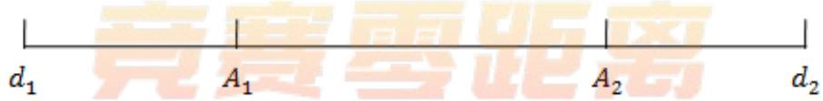  
图 $1$ 黄金分割法上下界点、左右探测点图示

间距逼近模型的目标就是利用黄金分割法，不断缩小上下界。新的上下界用左右探测点代替，每次只能代替一侧，到底是上界保留还是下届保留，通过建立目标函数，根据目标函数值大小确定。

前面分析可知，接收数据的数值大小与射线穿透的模板厚度成正比，由于不知道量纲，可以将相邻的接收数据求比值来利用，探测器接收数据比值等于模板厚度比值，实际圆形模板的接收数据比值为：

$$
{ \frac { M _ { 1 } } { M _ { 2 } } } , { \frac { M _ { 2 } } { M _ { 3 } } } \dots { \frac { M _ { 2 7 } } { M _ { 2 8 } } } , { \frac { M _ { 2 8 } } { M _ { 2 9 } } }\tag{2}
$$

对于圆形模板，其厚度是可以计算的，如图 2 圆形厚度求解示意图所示。

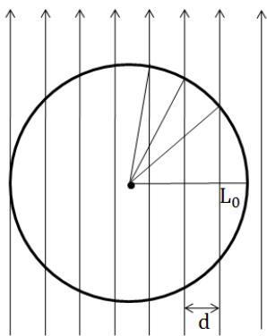  
图 2 圆形厚度求解示意图

最左边的射线与圆形左轮廓的距离 $L _ { 0 }$ 的范围为 $L _ { 0 } \in ( 0 , 8 - 2 8 d )$ ,第𝑖条射线穿透圆形模板的厚度 $h _ { i }$ 计算公式如式(3)

$$
\left\{ \begin{array} { l l } { h _ { i } = 2 \sqrt { 4 ^ { 2 } - ( 4 - L _ { i } ) ^ { 2 } } = 2 \sqrt { 8 L _ { i } - { L _ { i } } ^ { 2 } } } \\ { L _ { i } = L _ { 0 } + ( i - 1 ) d } \end{array} \right.\tag{3}
$$

以计算所得厚度比值跟实际接收数据比值之间误差平方和最小为目标函数，即

$$
\operatorname* { m i n } \sum _ { i = 1 } ^ { 2 8 } ( \frac { h _ { i } } { h _ { i + 1 } } - \frac { M _ { i } } { M _ { i + 1 } } ) ^ { 2 }
$$

## 5.1.3 算法与模型求解

## 算法的核心思想

黄金分割法逐步迭代，逐渐逼近待求间距的上下界，当上下界差值小于 $1 0 ^ { - 5 }$ 时停止迭代。

## 算法步骤

𝑆𝑇𝐸𝑃1：令待求间距等于下界 $d _ { 1 }$ ，以步长 $1 0 ^ { - 6 }$ 遍历第一条射线到圆形模板边缘的距离，求得目标函数最小值𝑓 。

𝑆𝑇𝐸𝑃2：令待求间距等于上界 $d _ { 2 } ,$ ，以步长 $1 0 ^ { - 6 }$ 遍历第一条射线到圆形模板边缘的距离，求得目标函数最小值 $f _ { 2 }$

𝑆𝑇𝐸𝑃3：比较两个最小值𝑓1和 $f _ { 2 } ,$ 如果 $f _ { 1 } ^ { \prime } < f _ { 2 } ^ { \prime } :$ ，则新的下界不变，新的上界为原右黄金分割点；如果 $f _ { 1 } > f _ { 2 }$ ，则新的上界不变，新的下界为原左黄金分割点。

𝑆𝑇𝐸𝑃4：判断上界与下界差值是否小于 $1 0 ^ { - 5 }$ ，是，停止运行；否，继续 $S T E P 5$

𝑆𝑇𝐸𝑃5：求得新的上界和下界，以及左右黄金分割点，重复进行 $S T E P 1 { \sim } 4$ C求解结果

通过不断迭代，缩小探测器单元间距的范围，当范围差小于 $1 0 ^ { - 5 }$ 时迭代完成，得到探测器单元间距为 $d = 0 . 2 7 6 8 m m$ 0

## 5.2 CT系统旋转中心位置求解模型

CT系统是绕中心旋转的，无论CT怎样旋转，探测器平面的中垂线必定过中心。选取椭圆长轴方向的射线，求得 512个探测单元中最中间的单元格对应的横

坐标即为旋转中心横坐标。选取椭圆短轴方向的射线，求得512个探测单元中最中间的单元格对应的纵坐标即为旋转中心的纵坐标。

## 5.2.1 坐标系的建立及数据提取

在模板平面中，以椭圆中心为圆心，短轴方向建立𝑥轴，长轴方向建立𝑦轴，如图 3所示。根据图中标注尺寸可得圆形模板中心坐标为(45,0)。

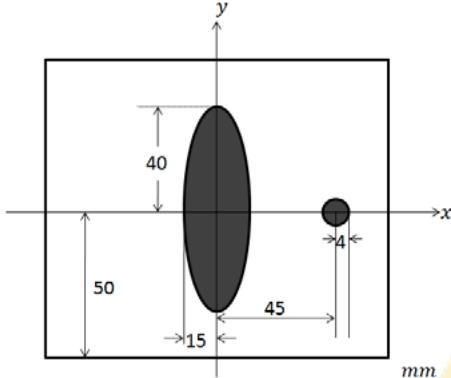  
图 3 坐标系的建立

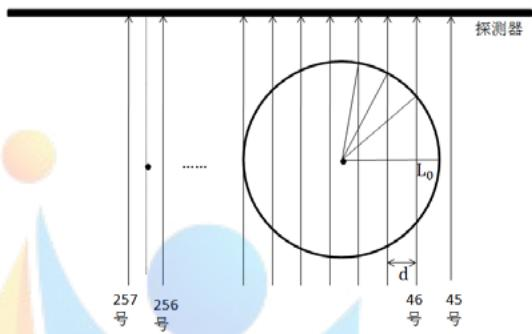  
图 4 射线竖直透射示意图

求旋转中心横坐标时，选取的射线与椭圆长轴平行。由于模板中椭圆长轴的厚度最大，因此平行长轴的射线在附件2中所对应的512个接收数据中应含有所有数据中的最大数据，据此筛选出求解横坐标所需的数据为第151列数据，该列数据中最大值为 141.7794，为长轴对应的数据。该列中，第 45 行数值为 0，第46 行开始不为0，说明第46条射线为第一条穿过圆形的射线，如图 4所示。

求旋转中心纵坐标时，选取的射线与椭圆短轴平行。射线平行椭圆长轴时，最大接收数据为长轴对应数据，射线平行短轴时，一列中最大的接收数据为短轴加上圆形直径对应的数据。长轴80𝑚𝑚，对应的接收数据为141.7794，根据探测

器接收数据与模板厚度成正比的关系，短轴30𝑚𝑚加圆形直径8𝑚 对应的数据为 $3 8 \times ( 1 4 1 . 7 7 9 4 \div 8 0 ) = 6 7 . 3 4 5 2$ ,寻找哪一列的最大数据最接近 67.3452，筛选出第 61 列数据符合条件，该列数据中的最大值为 67.3529。因此求解旋转中心纵坐标所需的数据为第 61列。该列中，第89行数值为0，第90行开始不为0，说明第 90条射线为第一条穿过椭圆的射线，如图 5所示。

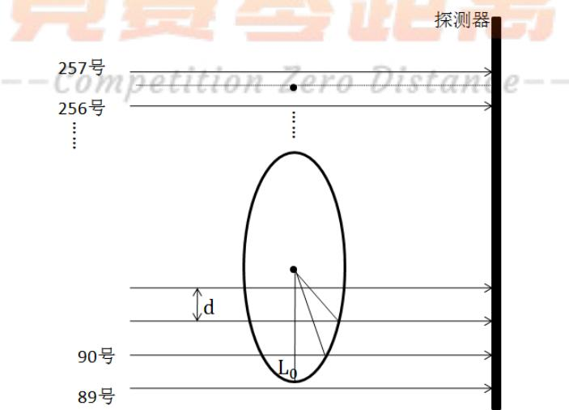  
图 5 射线横向透射示意图

## 5.2.2 旋转中心位置寻找模型

## 中心横坐标求解模型

第 151 列数据中，圆形模板对应的数据共有 29 个，相邻数据求比值，得到28组比值 $\cdot \frac { M _ { 1 } } { M _ { 2 } } , \frac { M _ { 2 } } { M _ { 3 } } \ldots \frac { M _ { 2 7 } } { M _ { 2 8 } } , \frac { M _ { 2 8 } } { M _ { 2 9 } }$ 。如果知道第一条射线距圆形模板右边缘的距离 $L _ { 0 }$ ，则可以计算得到29个射线穿透的厚度值，第𝑖个厚度 $h _ { i }$ 为：

$$
\left\{ \begin{array} { l l } { h _ { i } = 2 \sqrt { 4 ^ { 2 } - ( 4 - L _ { i } ) ^ { 2 } } = 2 \sqrt { 8 L _ { i } - { L _ { i } } ^ { 2 } } } \\ { L _ { i } = L _ { 0 } + ( i - 1 ) d } \end{array} \right.\tag{4}
$$

其中， $d = 0 . 2 7 6 8 m m$ ，为 5.1 所求。

将相邻厚度求比值得到28组比值 $\cdot \frac { h _ { 1 } } { h _ { 2 } } , \frac { h _ { 2 } } { h _ { 3 } } \dots \frac { h _ { 2 7 } } { h _ { 2 8 } } , \frac { h _ { 2 8 } } { h _ { 2 9 } }$ ，遍历 $L _ { 0 }$ ，以误差的平方和最小为目标函数，建立优化模型。综上，优化模型为

$$
\begin{array} { c } { \displaystyle \operatorname* { m i n } \sum _ { i = 1 } ^ { 2 8 } ( \frac { h _ { i } } { h _ { i + 1 } } - \frac { M _ { i } } { M _ { i + 1 } } ) ^ { 2 } } \\ { \displaystyle } \\ {  \ s . t . [ h _ { i } = 2 \sqrt { 4 ^ { 2 } - ( 4 - L _ { i } ) ^ { 2 } } = 2 \sqrt { 8 L _ { i } - { L _ { i } } ^ { 2 } }  } \\ { \displaystyle  s . t . \{ \begin{array} { l l } { { L _ { i } = L _ { 0 } + ( i - 1 ) d } } \\ { { 0 < L _ { 0 } < 8 - 2 8 d } } \\ { { d = 0 . 2 7 6 8 m m } } \end{array}   } \end{array}
$$

决策变量为 $L _ { 0 }$ ，求得使目标函数最小的 $L _ { 0 }$ 值，记为𝐿。圆形模型的圆心横坐标为45，第46号数据的横坐标为49−𝐿,旋转中心横坐标为第256.5号数据对应的横坐标，为

$$
x _ { 0 } = 4 9 - L - ( 2 5 6 . 5 - 4 6 ) d\tag{5}
$$

## 中心纵坐标求解模型

当射线沿椭圆短轴横向扫描时，对应附件 2 接收数据的第 61 列，从第 90行数据开始不为0，向上选取41 个数据，此时未触碰到椭圆和圆形的重叠区域。相邻数据求比值，得到 40 组比值 $\cdot \frac { M _ { 9 0 } } { M _ { 9 1 } } , \frac { M _ { 9 1 } } { M _ { 9 2 } } \dots \frac { M _ { 1 2 8 } } { M _ { 1 2 9 } } , \frac { M _ { 1 2 9 } } { M _ { 1 3 0 } } \ 。$ 。如果知道第一条射线距椭圆模板下边缘的距离 $L _ { 0 }$ ，则可以计算得到 41 个射线穿透的厚度值，椭圆方程为$\begin{array} { r } { \frac { y ^ { 2 } } { 4 0 ^ { 2 } } + \frac { x ^ { 2 } } { 1 5 ^ { 2 } } = 1 } \end{array}$ ,第𝑖条射线穿透椭圆模型的厚度 $h _ { i }$ 为

$$
\left\{ \begin{array} { l } { \displaystyle h _ { i } = 2 \times 1 5 \sqrt { 1 - \frac { ( 4 0 - L _ { i } ) ^ { 2 } } { 4 0 ^ { 2 } } } = 3 0 \sqrt { 1 - \frac { ( 4 0 - L _ { i } ) ^ { 2 } } { 4 0 ^ { 2 } } } } \\ { L _ { i } = L _ { 0 } + ( i - 1 ) d } \end{array} \right.\tag{6}
$$

将相邻厚度求比值得到40组比值 $\frac { h _ { 1 } } { h _ { 2 } } , \frac { h _ { 2 } } { h _ { 3 } } \dots \frac { h _ { 3 9 } } { h _ { 4 0 } } , \frac { h _ { 4 0 } } { h _ { 4 1 } }$ ，遍历 $L _ { 0 }$ ，以误差的平方和

最小为目标函数，建立优化模型。综上，建立的模型为

$$
\operatorname* { m i n } \sum _ { i = 1 } ^ { 4 0 } ( \frac { h _ { i } } { h _ { i + 1 } } - \frac { M _ { i } } { M _ { i + 1 } } ) ^ { 2 }
$$

$$
s . t . \left\{ \begin{array} { l } { \displaystyle h _ { i } = 3 0 \sqrt { 1 - \frac { ( 4 0 - L _ { i } ) ^ { 2 } } { 4 0 ^ { 2 } } } } \\ { \displaystyle L _ { i } = L _ { 0 } + ( i - 1 ) d } \\ { 0 < L _ { 0 } < d } \\ { d = 0 . 2 7 6 8 m m } \end{array} \right.
$$

决策变量为 $L _ { 0 }$ ，求得使目标函数最小的 $L _ { 0 }$ 值，记为𝐿。椭圆模型的圆心纵坐标为0，第 90号数据的纵坐标为40−𝐿,旋转中心纵坐标为第256.5号数据对应的纵坐标，为

$$
y _ { 0 } = 4 0 - L + ( 2 5 6 . 5 - 9 0 ) d\tag{7}
$$

## 5.2.3 算法及模型求解

旋转中心横纵坐标的算法一样，只是射线穿透模板的厚度的计算公式不一样。算法核心思想

通过遍历第一条穿透射线到模板轮廓的距离 $L _ { 0 }$ ，搜索求得使目标函数最小的$L _ { 0 }$ ，用于计算中心坐标。

## 算法步骤

𝑆𝑇𝐸𝑃1：设定 $L _ { 0 }$ 的初值为 0，计算目标函数值 1，存储初始 $\mathrm { { : } } L _ { 0 }$ 。

𝑆𝑇𝐸𝑃2： $\mathrm { L } _ { 0 }$ 的值增加步长 $1 0 ^ { - 6 }$ ，计算目标函数值2。如果目标函数值2小于目标函数值 1，则存储值替换为新的 $L _ { 0 }$ ，否则不变。

𝑆𝑇𝐸𝑃3：继续𝑆𝑇𝐸𝑃2，直到 $L _ { 0 }$ 值达到约束上限，结束算法。

## 求解结果

对于横坐标的求解，计算所得最终的 $L _ { 0 }$ 为0.0473𝑚𝑚，带入公式(5)求得横坐标 $x _ { 0 } = - 9 . 3 0 4 0$ ；对于纵坐标的求解，计算所得最终的 $L _ { 0 }$ 为0.1353𝑚𝑚，带入公式(7)求得纵坐标 $y _ { 0 } = 6 . 2 1 4 9$

综上，以椭圆短、长轴建立横、纵坐标，𝐶𝑇系统旋转中心的坐标为(−9.3040,6.2149)。

## 5.3 射线的 180 个方向

已知射线竖直照射时，射线方向与横轴夹角为 90 度，匹配的接收数据为第151列数据，以此方向为基准一列一列的求出其他列数据对应的射线方向。求解时，遍历射线与横轴的夹角，当接收数据的计算值最接近真实值是，该夹角即为射线的实际方向。

## 5.3.1 Radon变换求解介质厚度

## 直线簇的表示

经过前面问题分析，接收数据 $M .$ 与介质厚度ℎ成正比， $M = k h$ 。常规厚度的求解与坐标有关，但一个射线方向具有512个厚度，为便于求解，需选用一种统一的直线簇表示方法。这里进行Radon变换，将厚度 $h ( x , y )$ 变换为 $h ( r , \varphi )$ 。此时有

$$
M ( r , \varphi ) = k h ( r , \varphi )\tag{8}
$$

其中， $r$ 为坐标原点到直线簇中各条直线的距离， $\varphi$ 为直线簇与𝑥轴的夹角，如图6所示。

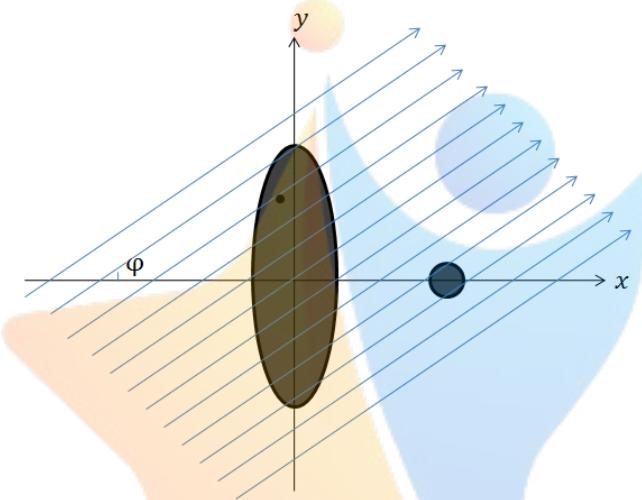  
图 6 坐标轴中直线簇的示意图

直线簇的方程为

$$
y = t a n \varphi \cdot x - \frac { r } { c o s \varphi }\tag{9}
$$

该直线簇方程中的𝑟是未知，每一条射线对应于一个不同的 $r$ ，现在需要找到𝑟关于射线条数𝑛的统一表达式。由于直线簇是平行的射线，相邻直线簇间的𝑟相差一个射线单元间距𝑑，𝑑在前面已经求得。假设过旋转中心有一条射线，如果坐标原点到该射线的距离 $r _ { 0 }$ 已知，则直线簇中所有的𝑟均可表示出来。

旋转中心所在直线方程为

$$
t a n \varphi \cdot x - y - t a n x _ { 0 } + y _ { 0 } = 0\tag{10}
$$

其中， $( x _ { 0 } , y _ { 0 } )$ 为旋转中心坐标，坐标原点到该射线的距离 $r _ { 0 }$ 为

$$
r _ { 0 } = \frac { | t a n \varphi \cdot x _ { 0 } + y _ { 0 } | } { \sqrt { t a n \varphi ^ { 2 } + 1 } }\tag{11}
$$

因此将直线簇方程写成 $y = a x + b$ 的形式为

$$
y = t a n \varphi \cdot x - \frac { r _ { 0 } - ( 0 . 5 + n ) d } { c o s \varphi }\tag{12}
$$

其中，从第1列到第512列，𝑛依次取值-256到 255。

椭圆厚度(弦长)求法

首先判断射线与椭圆是否相交，满足式(13)之一的均相交。

$$
\left\{ \begin{array} { l l } { \displaystyle \lvert d _ { 1 } \cdot d _ { 2 } \rvert < 1 5 } \\ { \displaystyle - 3 7 . 0 8 < \frac { r _ { 0 } - ( 0 . 5 + n ) d } { c o s \varphi } < 3 7 . 0 8 } \end{array} \right.\tag{13}
$$

其中， $d _ { 1 } , d _ { 2 }$ 为椭圆交点到直线的距离，15 为椭圆短半轴长，37.08 为椭圆半焦距。

相交时，椭圆弦长计算公式如式(14)。

$$
\left\{ \begin{array} { l l } { h = | x _ { 1 } - x _ { 2 } | \cdot \sqrt { 1 + a ^ { 2 } } } \\ { \qquad \quad } \\ { | x _ { 1 } - x _ { 2 } | = \sqrt { \frac { \left( \frac { a b } { 8 0 0 } \right) ^ { 2 } - 4 \left( \frac { a ^ { 2 } } { 1 6 0 0 } + \frac { 1 } { 2 2 5 } \right) ( \frac { b ^ { 2 } } { 1 6 0 0 } - 1 ) } { ( \frac { a ^ { 2 } } { 1 6 0 0 } + \frac { 1 } { 2 2 5 } ) ^ { 2 } } } } \\ { \qquad \quad } \\ { a = t a n \varphi } \\ { b = - \frac { r _ { 0 } - ( 0 . 5 + n ) d } { c o s \varphi } } \end{array} \right.\tag{14}
$$

综上，椭圆厚度 $h _ { t }$ 为

$$
h _ { t } = \left\{ \begin{array} { l l } { 0 , \frac { \dot { \xi } \dot { \alpha } \dot { \xi } } { \sqrt { \pi } } \frac { \mathrm { E q } \dot { \big | } \dot { \big | } \dot { \big | } \overline { { \mathcal { A } } } \dot { \big | } \dot { \mathcal { A } } \ddot { \mathcal { X } } \ddot { \mathcal { X } } } { \sqrt { 1 + a ^ { 2 } } } } \\ { \big | x _ { 1 } - x _ { 2 } \big | \cdot \sqrt { 1 + a ^ { 2 } } , \frac { \dot { \xi } \dot { \alpha } \dot { \xi } } { \sqrt { \pi } } \frac { \dot { \xi } + \xi \dot { \alpha } } { \sqrt { \pi } } \frac { \dot { \xi } \dot { \alpha } } { \sqrt { \pi } } \big | \dot { \mathcal { H } } \ddot { \mathcal { X } } \ddot { \mathcal { X } } } \end{array} \right.\tag{15}
$$

圆厚度(弦长)求法

首先判断射线与圆是否相交，圆心到直线的距离小于半径则相交，表达式为

$$
\frac { | 4 5 a + b | } { \sqrt { a ^ { 2 } } + 1 } < 4\tag{16}
$$

相交时弦长计算公式为

$$
\left\{ \begin{array} { l l } { \displaystyle h = 2 \sqrt { 1 6 - \frac { ( 4 5 a + b ) ^ { 2 } } { a ^ { 2 } + 1 } } } \\ { \displaystyle a = t a n \varphi } \\ { \displaystyle b _ { \ell } \overline { { { \overline { { \ell } } } } } { \ell } { \overline { { i } } } \overline { { o } } \overline { { n } } \overline { { { \ell } } } \overline { { o } } \overline { { s } } \overline { { { \varphi } } } \overline { { { \ell } } } \overline { { i } } \overline { { s } } t } \end{array} \right.\tag{17}
$$

综上，圆形厚度 $h _ { o }$ 为

$$
h _ { o } = \left\{ \begin{array} { l l } { 0 , \frac { \sharp \star \mathcal { Z } \notin \widehat { \mathcal { X } } } { \mathcal { Z } } \frac { \mathsf { E } } { \mathsf { E } } \big | \widecheck { \mathcal { X } } \big | \widecheck { \mathcal { X } } \big | \widecheck { \mathcal { X } } \big | } & { } \\ { 2 \sqrt { 1 6 - \frac { ( 4 5 a + b ) ^ { 2 } } { a ^ { 2 } + 1 } } , } & { \sharp \sharp \sharp \frac { \mathsf { E } } { \mathcal { Z } } \big | \widecheck { \mathcal { Y } } \big | \big | \star \sharp \overrightarrow { \mathcal { X } } } & { } \end{array} \right.\tag{18}
$$

介质厚度ℎ为

$$
h = h _ { t } + h _ { o }\tag{19}
$$

## 5.3.2 确定接收数据与厚度的比例系数

接收数据与厚度成正比，现求解比例系数𝑘。以圆形模板为研究对象，对于某确定方向的射线，根据式(17)可以求得弦长值，即厚度，在附件2中选择对应的接收数据，接收数据与厚度之比即为比例系数𝑘的值。选取第一列接收数据中穿过圆形模板的数据进行运算， $\varphi \mathrm { , }$ 共有 29 个圆形模板的接收数据 $M _ { 1 } \cdots M _ { 2 9 }$ ，计算出 29 个厚度 $h _ { 1 } \cdots h _ { 2 9 }$ ，由此可得 29 个不同比例系数，将比例系数求均值作为最终比例系数。

$$
\left\{ \begin{array} { l l } { \displaystyle k = \frac { 1 } { 2 9 } \sum _ { i = 1 } ^ { 2 9 } \frac { M _ { i } } { h _ { i } } } \\ { \displaystyle h = 2 \sqrt { 1 6 - \frac { ( 4 5 a + b ) ^ { 2 } } { a ^ { 2 } + 1 } } } \end{array} \right.\tag{20}
$$

代入 $M _ { 1 } \cdots M _ { 2 9 }$ ，求得 $k = 1 . 7 7 2 4 5 1 5$ ，取五位小数 $k = 1 . 7 7 2 4 5$

## 5.3.3 模型建立

第151列数据，射线与𝑥轴夹角为 90度，从151列数据逆时针旋转，对于第152列数据，建立求解模型。

以接收数据的计算值与实际值的误差平方和最小为目标函数，目标函数为：

$$
\operatorname* { m i n } \sum _ { i = 1 } ^ { 5 1 2 } ( k h _ { i } - M _ { i } ) ^ { 2 }
$$

约束条件：决策变量为夹角 $\varphi _ { 1 5 2 }$ ，对于第 152 列数据， $9 0 < \varphi < 9 2$

综上，第 152 列数据的方向求解模型为

$$
\operatorname* { m i n } \sum _ { i = 1 } ^ { 5 1 2 } ( k h _ { i } - M _ { i } ) ^ { 2 }
$$

$$
s . t . \left\{ \begin{array} { l l } { h = h _ { t } + h _ { o } } \\ { 9 0 < \varphi < 9 2 } \\ { k = 1 . 7 7 2 4 5 } \end{array} \right.
$$

遍历求得第152列数据对应的射线夹角为 $\varphi _ { 1 5 2 }$ 。

第153列数据对应的射线夹角求解模型与之相同，只是夹角的遍历范围变为$( \varphi _ { 1 5 2 } , \varphi _ { 1 5 2 } + 2 ^ { \circ } )$ 。以此类推，第𝑖列数据对应的射线夹角范围为 $( \varphi _ { i - 1 } , \varphi _ { i - 1 } + 2 ^ { \circ } )$ 求得152到180列接收数据对应的射线夹角。

从第 151 列数据顺时针往前推，第 150 列数据对应的射线夹角范围为$( 8 8 ^ { \circ } , 9 0 ^ { \circ } )$ ，第𝑖列数据对应的射线夹角范围为 $( \varphi _ { i + 1 } - 2 ^ { \circ } , \varphi _ { i + 1 } )$ ，求得 150 到 1 列接收数据对应的射线夹角。

## 5.3.4 算法及求解

## 算法的核心思想

在约束夹角范围内遍历，求得使目标函数值最小的夹角，确定方向。根据所

求夹角约束新夹角范围，求出180个方向的夹角。

## 算法步骤

𝑆𝑇𝐸𝑃1：设定夹角的初值 $\varphi _ { 0 }$ ，计算目标函数值1，存储初始 $\varphi _ { 0 }$ 。

𝑆𝑇𝐸𝑃2： $\varphi$ 的值增加步长 $1 0 ^ { - 4 }$ ，计算目标函数值 2。如果目标函数值 2 小于目标函数值1，则存储值替换为新的 $\varphi$ ，否则不变。

𝑆𝑇𝐸𝑃3：继续𝑆𝑇𝐸𝑃2，直到 $\mid \varphi ^ { . }$ 值达到约束上限，结束算法。此时存储的 $\varphi _ { i }$ 即 为射线方向与横轴夹角。

𝑆𝑇𝐸𝑃4：判断，如果 $1 5 1 < i < 1 8 0$ ，则新的角度遍历范围为 $( \varphi _ { i - 1 } , \varphi _ { i - 1 } + 2 ^ { \circ } )$ 继续 $S T E P 1 { \sim } S T E P 3$ ；如果 $1 5 1 > i > 0$ ，则新的角度遍历范围为 $( \varphi _ { i + 1 } - 2 ^ { \circ } , \varphi _ { i + 1 } )$ 继续 $S T E P 1 { \sim } S T E P 3$ 0

## 求解结果

数据太多，选取部分进行展示，从第1列接收数据对应的方向角度开始，每隔十个数据取一个角度进行展示，射线斜向上角度为正值，斜向下角度为负值，如表 1所示。

表 1 射线方向角度部分结果
<table><tr><td rowspan=1 colspan=1>数据列</td><td rowspan=1 colspan=1>角度</td><td rowspan=1 colspan=1>数据列</td><td rowspan=1 colspan=1>角度</td><td rowspan=1 colspan=1>数据列</td><td rowspan=1 colspan=1>角度</td></tr><tr><td rowspan=1 colspan=1>A</td><td rowspan=1 colspan=1>-60.2961</td><td rowspan=1 colspan=1>BI</td><td rowspan=1 colspan=1>-0.2733</td><td rowspan=1 colspan=1>DQ</td><td rowspan=1 colspan=1>59.6462</td></tr><tr><td rowspan=1 colspan=1>K</td><td rowspan=1 colspan=1>-50.2793</td><td rowspan=1 colspan=1>BS</td><td rowspan=1 colspan=1>9.7173</td><td rowspan=1 colspan=1>EA</td><td rowspan=1 colspan=1>69.6575</td></tr><tr><td rowspan=1 colspan=1>U</td><td rowspan=1 colspan=1>-40.2614</td><td rowspan=1 colspan=1>CC</td><td rowspan=1 colspan=1>19.7044</td><td rowspan=1 colspan=1>EK</td><td rowspan=1 colspan=1>79.6708</td></tr><tr><td rowspan=1 colspan=1>AF</td><td rowspan=1 colspan=1>-30.2596</td><td rowspan=1 colspan=1>CM</td><td rowspan=1 colspan=1>29.6642</td><td rowspan=1 colspan=1>EU</td><td rowspan=1 colspan=1>89.9989</td></tr><tr><td rowspan=1 colspan=1>AO</td><td rowspan=1 colspan=1>-20.2801</td><td rowspan=1 colspan=1>CW</td><td rowspan=1 colspan=1>39.6773</td><td rowspan=1 colspan=1>FE</td><td rowspan=1 colspan=1>99.7305</td></tr><tr><td rowspan=1 colspan=1>AY</td><td rowspan=1 colspan=1>-10.2823</td><td rowspan=1 colspan=1>DG</td><td rowspan=1 colspan=1>49.6573</td><td rowspan=1 colspan=1>FO</td><td rowspan=1 colspan=1>109.7303</td></tr></table>

180 个射线方向与横轴夹角的完整数据请见支撑材料中的 phi.xls 文件。

## 5.4 基于中心切片定理的滤波反投影重建算法

𝐶𝑇系统参数、介质参数、接收信息，三者之间是对应的，根据系统参数和介质参数可以检测接收信息；根据系统参数和接收信息，可以重建介质参数。自己创新图像重建算法，利用提供的接收数据重建介质图像，得到各位置的吸收率。

## 5.4.1 算法原理

已知介质经过射线后的接收数据，目标是求介质的形状和吸收率。根据中心切片定理[5]，180个射线方向，每个射线方向下得到的接收数据𝑞经过一维傅氏变换，针对某个点，将所有射线方向下通过傅氏变换得到的数据累加可以转换为变换数据𝐵�。该变换数据𝐵�与介质图像中的像素点具有一定的关系，像素点的密度函数经过二维傅氏变换后可以得到该变换数据，因此，将得到的变换数据进行逆二维傅氏变换，就能得到图像像素点处的密度值，根据所有像素点密度值可以仿真出介质图像。像素点吸收率与密度值存在一定比例，根据比例得到每个点的吸收率。

综上，算法原理思路为，已知各个射线方向的接收数据，进行一维傅氏变换，累加得到每个像素点的中间变换数据，将中间变换数据进行逆二维傅氏变换，得到每个像素点的密度函数，根据所有像素点密度重建图像，根据比例关系，由像素点密度值求解各点吸收率。

## 5.4.2 反投影重建算法

首先坐标轴选取以旋转中心为原点，平行于椭圆短轴方向为𝑥轴，平行于椭圆长轴为𝑦轴。针对一个像素点，180 个方向的射线，有的射线会穿过该点，有些不会穿过该点，每条射线在该点的接收数据为 $\vert q ( x _ { r } , \varphi _ { i } )$ 。射线方向是任意的，但是绕旋转中心旋转的， $x _ { r }$ 为旋转坐标系中的横坐标， $\varphi _ { i }$ 表示射线方向，𝑖表示附件中接收数据的列数，与射线方向对应，如图 7所示。

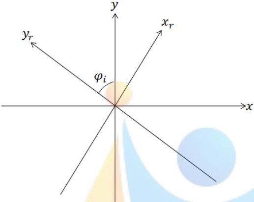  
图 7 旋转作标示意图

需要将旋转后的坐标转化为标准坐标系中的坐标，转化关系为

$$
x _ { r } = x \cdot c o s \varphi _ { i } + y s i n \varphi _ { i }\tag{21}
$$

连续情况下，各点的密度函数 $\widehat { b } ( x , y )$ 为

$$
\hat { b } ( x , y ) = \int _ { 0 } ^ { \pi } q ( x _ { r } , \varphi _ { i } ) d \varphi\tag{22}
$$

射线的方向是离散的180个方向，因此对于离散情况，各点的密度函数为各个方向下接收数据的累加。

$$
\hat { b } ( x , y ) = \sum _ { i = 1 } ^ { 1 8 0 } q ( x _ { r } , \varphi _ { i } ) \cdot \Delta \varphi _ { i }\tag{23}
$$

综上，各点密度函数的求解算法为

$$
\left\{ \begin{array} { l l } { \displaystyle { \hat { b } } ( x , y ) = \sum _ { i = 1 } ^ { 1 8 0 } q ( x _ { r } , \varphi _ { i } ) \cdot \Delta \varphi _ { i } } \\ { \displaystyle x _ { r } \stackrel { . . . } { = } \dot { x } ^ { i } \cdot c o s \varphi _ { i } + y s i \widehat { n \varphi _ { i } } \cdot \stackrel { . . . } { \ell } c } \\ { \Delta \varphi _ { i } = \varphi _ { i + 1 } - \varphi _ { i } } \end{array} \right.\tag{24}
$$

根据所有点的密度函数重建附件3中介质图像，得到图像如图8所示。该图像未克服边缘失锐伪像，需要对重建算法进行改进。

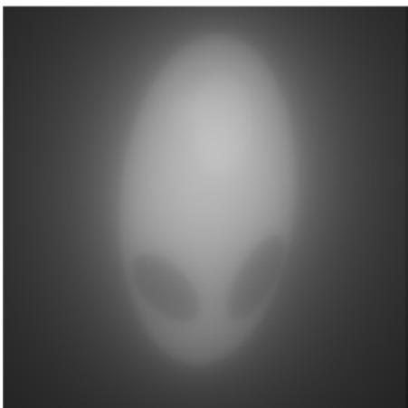  
图 8 附件3重建图像

  
图 9 滤波后的重建图像

## 5.4.3 滤波后的改进投影重建算法

考虑将投影重建算法一进行改进，为克服边缘失锐伪像<sup>[3]</sup>，改进方向为在各个射线方向的接收数据累加之前，进行一步滤波操作，选取R−L滤波器，滤波方法为

$$
f ( x _ { r } , \varphi _ { i } ) = h ( x _ { r } ) * q ( x _ { r } , \varphi _ { i } )\tag{25}
$$

其中， $f ( x _ { r } , \varphi _ { i } )$ 为滤波后的数据， $h ( x _ { r } )$ 为 $\vert x _ { r }$ 处的单位冲激响应，∗表示卷积运算。滤波后的数据进行累加得到各点密度函数，改进后的重建算法为

$$
\left\{ \begin{array} { l l } { \displaystyle \hat { b } ( x , y ) = \sum _ { i = 1 } ^ { 1 8 0 } f ( x _ { r } , \varphi _ { i } ) \cdot \Delta \varphi _ { i } } \\ { f ( x _ { r } , \varphi _ { i } ) = h ( x _ { r } ) * q ( x _ { r } , \varphi _ { i } ) } \\ { \displaystyle h ( x _ { r } ) = 0 . 0 6 2 5 ( \frac { s i n c ( d ) } { 2 } - \frac { s i n c ^ { 2 } ( d / 2 ) } { 4 } ) } \\ { x _ { r } = x \cdot c o s \varphi _ { i } + y s i n \varphi _ { i } } \\ { \Delta \varphi _ { i } = \varphi _ { i + 1 } - \varphi _ { i } } \end{array} \right.\tag{26}
$$

根据所有点的密度函数重建介质图像，得到图像如图 9所示。

滤波后的图像克服边缘失锐伪像后清晰许多。现考虑噪声影响，以模板平面为底面，各点的密度函数值为高度，建立三维图像，如图 10 所示。由图像分析可知，在重建图形周边，吸收率为 0的区域出现了密度值，为重建图像噪声，需要对重建算法进一步改进以消除噪声。

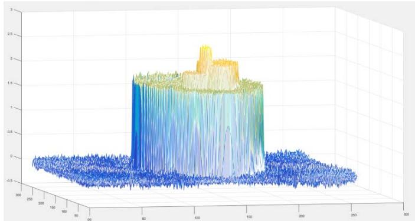  
图 10 降噪前介质平面各点的密度函数值分布图

## 5.4.4 消噪后的改进投影重建算法

噪声区域有的密度函数值为正值，有的为负值，重建图像区域的密度函数值也为正值，因此负值的密度函数值是噪声的最佳区分标准。遍历平面区域，搜索最小的密度函数值,以其绝对值作为噪声阈值，令小于该阈值的密度函数值均为0，达到去噪的目的。

搜索函数：

$$
\widehat { b } _ { 0 } = \operatorname* { m i n } \widehat { b } ( x , y )
$$

平面内全范围搜索，找到最小的吸收率记为 $\widehat { b } _ { 0 }$ 。对于所有的吸收率，进行如下处理：

$$
\widehat { b } ( x , y ) = \left\{ \begin{array} { l l } { \widehat { b } ( x , y ) , \widehat { b } ( x , y ) > \left| \widehat { b } _ { 0 } \right| } \\ { 0 , \widehat { b } ( x , y ) < \left| \widehat { b } _ { 0 } \right| } \end{array} \right.\tag{27}
$$

降噪后的介质平面各点的密度函数值分布如图 11所示。

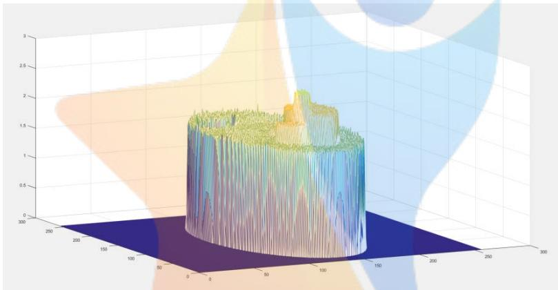  
图 11 降噪后的介质平面各点的密度函数值分布图

经过滤波、降噪后重建的图像具有很高的精确性，可以用改进后的算法进行未知介质的图像重建。最终的算法模型为

$$
\left\{ \begin{array} { l l } { \displaystyle \hat { b } ( x , y ) = \sum _ { i = 1 } ^ { 1 8 0 } f ( x _ { r } , \varphi _ { i } ) \cdot \Delta \varphi _ { i } } \\ { f ( x _ { r } , \varphi _ { i } ) = h ( x _ { r } ) * q ( x _ { r } , \varphi _ { i } ) } \\ { \displaystyle h ( x _ { r } ) \varphi _ { 0 } . 0 6 2 5 ( \frac { s i n c ( d ) } { 2 } - \frac { s i n c ^ { 2 } ( d / 2 ) } { ( \mathscr { L } ^ { \prime \prime } ) ^ { 2 } } ) } \\ { x _ { r } = x \cdot c o s \varphi _ { i } + y s i n \varphi _ { i } } \\ { \Delta \varphi _ { i } = \varphi _ { i + 1 } - \varphi _ { i } } \end{array} \right.\tag{28}
$$

$$
\begin{array} { c } { \widehat { b } _ { 0 } = \operatorname* { m i n } \widehat { b } ( x , y ) } \\ { \widehat { b } ( x , y ) = \left\{ \begin{array} { l l } { \widehat { b } ( x , y ) , \widehat { b } ( x , y ) > \left| \widehat { b } _ { 0 } \right| } \\ { 0 , \widehat { b } ( x , y ) < \left| \widehat { b } _ { 0 } \right| } \end{array} \right. } \end{array}
$$

## 5.4.5 吸收率与密度函数的比例系数求解

根据自己设计的最终算法，带入附件中的接收数据和已求得180个射线方向角，可以求得未知介质各个像素点的密度函数值，由各点密度函数值重建出的图像包含了未知介质在托盘中的位置和几何形状。其吸收率尚不能确定，但吸收率与密度函数之间存在一定比例关系。

$$
\mu ( x , y ) = m { \widehat { b } } ( x , y )\tag{29}
$$

求解该比例系数𝑚，就能得到各点吸收率。

在 $: m \in ( 0 . 5 , 2 )$ 的范围内运用黄金分割法求解比例系数𝑚，𝑚的求解样本为附件 2的接收数据和对应附件1的吸收率。将附件 2的接收数据带入图像重建算法模型，能够得到 $1 8 0 \times 5 1 2$ 个密度函数，此时分别以上下界作为比例系数𝑚的实际数值，根据 $\mu ( x , y ) = m { \widehat { b } } ( x , y )$ 得到 $1 8 0 \times 5 1 2$ 个吸收率的计算值 $\dot { \boldsymbol { \mu } } ^ { \prime }$ ，以吸收率的计算值 $\dot { \boldsymbol { \mu } } ^ { \prime }$ 与实际值µ的误差平方和最小为目标函数，确定新的上下界。

$$
\begin{array} { r l } {  { \operatorname* { m i n } \sum _ { i = 1 } ^ { 1 8 0 \times 5 1 2 } ( { \mu ^ { \prime } } _ { i } - \mu _ { i } ) ^ { 2 } } \quad } & { { } } \\ { s . t . \Big \{ { \mu ^ { \prime } } _ { i } = m \hat { b } } \\ { \quad } & { { } } \end{array}
$$

利用目标函数值最小不断确定新的上下界，当上下界的差值小于 $1 0 ^ { - 5 }$ 时完成求解，求得精确到四位小数的比例系数。

最终得到比例系数 $m = 0 . 5 6 7 0$ 。

## 5.4.6 重建未知介质图像的结果显示

根据改进后的图像重建算法，将接收数据带入算法，得到重建后的图像，图像灰度经过处理以使得结果更加清晰，颜色越深代表密度越小，即吸收率越小。根据计算式 $\mu ( x , y ) = 0 . 5 6 7 0 \hat { b } ( x , y )$ 得到每个点的吸收率。

## 附件 3 未知介质的相关信息

重建的图像边框即是正方形托盘边框，未知介质的几何形状及在边框中的位置如图 13 所示。

  
图 12 附件3介质最终重建图像

具体10个位置处的吸收率如表 2所示。

表 2 附件3中10个位置吸收率
<table><tr><td rowspan=1 colspan=1>坐标</td><td rowspan=1 colspan=1>吸收率</td><td rowspan=1 colspan=1>坐标</td><td rowspan=1 colspan=1>吸收率</td></tr><tr><td rowspan=1 colspan=1>(10.0000,18.0000)</td><td rowspan=1 colspan=1>0.0000</td><td rowspan=1 colspan=1>(50.0000,75.5000)</td><td rowspan=1 colspan=1>1.4817</td></tr><tr><td rowspan=1 colspan=1>(34.5000,25.0000)</td><td rowspan=1 colspan=1>1.0004</td><td rowspan=1 colspan=1>(56.0000,76.5000)</td><td rowspan=1 colspan=1>1.2965</td></tr><tr><td rowspan=1 colspan=1>(43.5000,33.0000)</td><td rowspan=1 colspan=1>0.0000</td><td rowspan=1 colspan=1>(65.5000,37.0000)</td><td rowspan=1 colspan=1>0.0000</td></tr><tr><td rowspan=1 colspan=1>(45.0000,75.5000)</td><td rowspan=1 colspan=1>1.1846</td><td rowspan=1 colspan=1>(79.5000,18.0000)</td><td rowspan=1 colspan=1>0.0000</td></tr><tr><td rowspan=1 colspan=1>(48.5000,55.5000)</td><td rowspan=1 colspan=1>1.0488</td><td rowspan=1 colspan=1>(98.5000,43.5000)</td><td rowspan=1 colspan=1>0.0000</td></tr></table>

与未知介质 1 中180×512个接收数据对应的吸收率见支撑材料中的problem2.xls 文件。

## 附件5未知介质的相关信息

重建的图像边框即是正方形托盘边框，未知介质的几何形状及在边框中的位置如图 15所示。

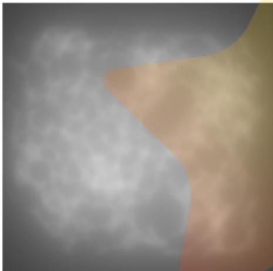  
图 13 附件 5介质未滤波重建图像

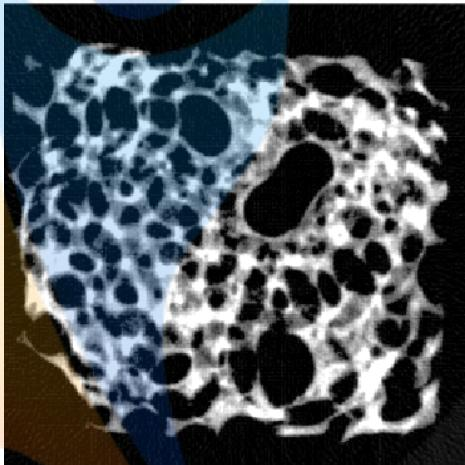  
图 14 附件5介质最终重建图像

具体10个位置处的吸收率如表 3所示。  
表 3 附件 5中10个位置吸收率
<table><tr><td rowspan=1 colspan=1>坐标</td><td rowspan=1 colspan=1>吸收率</td><td rowspan=1 colspan=1>坐标</td><td rowspan=1 colspan=1>吸收率</td></tr><tr><td rowspan=1 colspan=1>(10.0000,18.0000)</td><td rowspan=1 colspan=1>0.0000</td><td rowspan=1 colspan=1>(50.0000,75.5000)</td><td rowspan=1 colspan=1>3.2351</td></tr><tr><td rowspan=1 colspan=1>(34.5000,25.0000)</td><td rowspan=1 colspan=1>2.8091</td><td rowspan=1 colspan=1>(56.0000,76.5000)</td><td rowspan=1 colspan=1>6.1054</td></tr><tr><td rowspan=1 colspan=1>(43.5000,33.0000)</td><td rowspan=1 colspan=1>com7.0353ion</td><td rowspan=1 colspan=1>(65.5000,37.0000)</td><td rowspan=1 colspan=1>0.0000</td></tr><tr><td rowspan=1 colspan=1>(45.0000,75.5000)</td><td rowspan=1 colspan=1>0.0000</td><td rowspan=1 colspan=1>(79.5000,18.0000)</td><td rowspan=1 colspan=1>8.1176</td></tr><tr><td rowspan=1 colspan=1>(48.5000,55.5000)</td><td rowspan=1 colspan=1>0.0101</td><td rowspan=1 colspan=1>(98.5000,43.5000)</td><td rowspan=1 colspan=1>0.0000</td></tr></table>

与未知介质 2 中180×512个接收数据对应的吸收率见支撑材料中的problem3.xls 文件。

## 5.5 参数标定的精度和稳定性分析

## 5.5.1 精度分析

## 旋转中心精度

在问题一求解旋转中心时，根据表格中的数据观察到，第151列数据为射线垂直于 x轴时的接受信息。现在分别以第150列和第152列数据作为射线方向与x轴垂直时的接受信息，利用问题一中模型求解，以此确定旋转中心的x坐标的误差范围。同理，分别将第60列和第62列数据作为射线方向与y轴垂直时的接受信息，以此确定旋转中心y坐标的误差范围。最终求得旋转中心的横坐标范围为(−9.3994, −9.1821),纵坐标范围为(6.0426,6.3748)。即横坐标最大误差为0.2173𝑚𝑚，纵坐标最大误差为0.3322𝑚𝑚。

## 探测器单元间距精度

在表格中，每个方向穿过圆的射线有 28 条或者 29 条，因此间距在(8/29,8/28)之间，最大误差为0.0099𝑚𝑚。

## X 射线方向精度

由于观察到第 151 列数据为射线垂直𝑥轴的接受信息，而其真实方向角在89°\~91°之间，因此通过迭代求解后，每个方向的最大误差都为1°。

## 5.5.2 稳定性分析

由于探测器会存在仪器误差，所以测量到的数据会有所偏差。我们人为的在数据中加入均值为0，方差为0.01的正态随机噪声，如图 15 所示，利用问题一模 型 求 解 五 次 ， 求 得 的 间 距 分 别 为 0.2767𝑚𝑚,0.2768𝑚𝑚,0.2768𝑚𝑚,0.2768𝑚𝑚,0.2767𝑚𝑚。可见求解间距模型的稳定性较好，具有鲁棒性。

由精度分析中可以看出来，旋转中心位置的最大波动区域仅为0.0722𝑚𝑚2,方向变化在1°左右，因此稳定性较好。

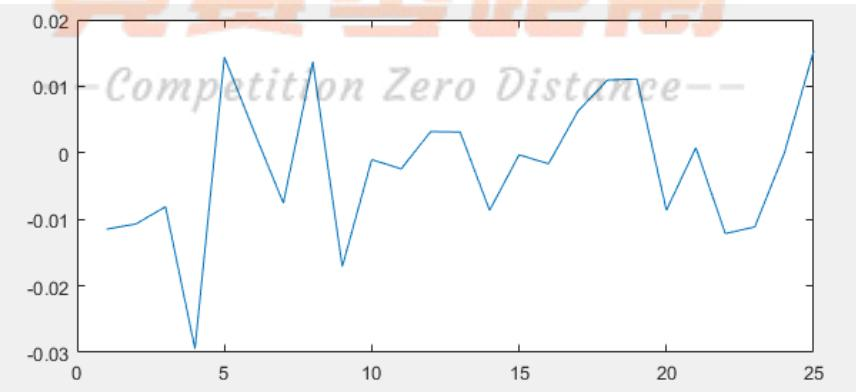  
图 15 随机噪声示意图

## 5.6 新模板的设计

题目中的模板求解标定参数时所建立的优化模型非常复杂，在同方向的不同射线穿过椭圆时，投影数据也会变化，并且，精度和稳定性没有达到工业 CT 的标准，优化模型必定存在者误差。我们设计出一种根据几何结构和探测元接受信息就能直接求解出标定参数的一种模板，并根据新模板建立了标定模型，阐述了新模板的优点。模板示意图如图 14所示。

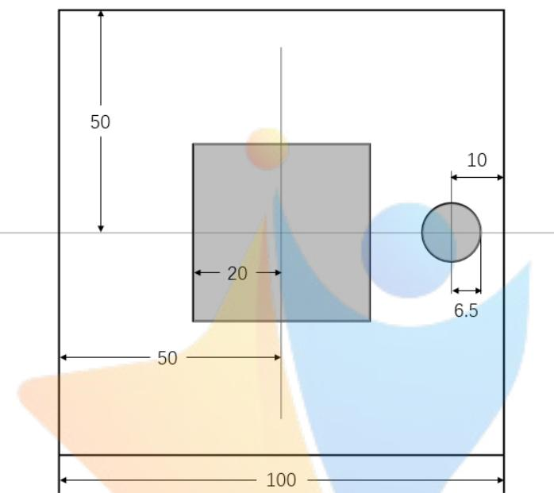  
图 16 新模板示意图

正方形托盘边长为100𝑚𝑚，正方形边长𝐿为40𝑚𝑚，圆形圆心距正方形中心距离40𝑚𝑚，半径𝑅为6.5𝑚𝑚，正方形和圆形的吸收率都为1.0000，其余地方吸收率为0.0000。

## 5.6.1 间距的求解

仍采用问题一中的黄金分割法确定间距模型，但在新模板中求解出的间距的精度和稳定性大大提高。这是由于圆形直径的增加，即𝑛的增加，使间距的误差范围∆𝑑缩小，如式(30)所示。

$$
\Delta d \equiv \frac { 8 + n d } { 2 8 + n } - \frac { 8 + n d } { 2 9 + n }\tag{30}
$$

## 5.6.2 方向的求解

问题一中使用的是迭代优化模型求解方向，而在新模板中，由于正方形的几何特征，可以直接求解180次方向。如图 15所示，同一方向上，如果两条平行射线穿过正方形的一组平行边，并且与圆形无交点，假设探测元测得的数据是精确的，那么他们的投影数据（接受信息）是相等的，因此在接受信息的表格中会出现若干行相同的数据 $\cdot I _ { i } ,$ ,那么可以用已经解出的间距𝑑，求得此时的射线方向 $\varphi _ { i }$ ，如式(31)所示。

$$
\varphi _ { i } = \pi - a r c s i n { ( \frac { L k \mu } { I _ { i } } ) }\tag{31}
$$

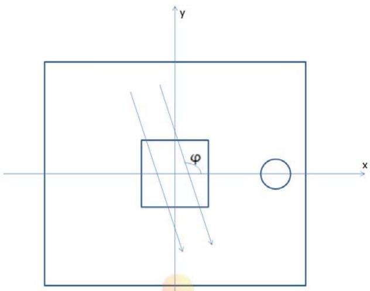  
图 17 新模板射线方向求解示意图

其中𝐿为正方形边长，𝑘为接受信息与投影数据的比例常数，𝜇为吸收率。  
用上述方法即可求出180次方向，并且结果与真实值几乎无差异。

## 5.6.3 旋转中心位置的求解

同样用几何法来求解旋转中心的位置。假设旋转中心与原点的距离为𝑟。如图 16所示，两条平行射线都未经过圆形，第𝑘条射线经过了正方形，而第𝑘 +1条未经过，因此 $I _ { k + 1 } = 0 , I _ { k } = 0$ 在接受信息的表格中可以比较容易的提取出 $I _ { k }$ 和𝑘的数值。

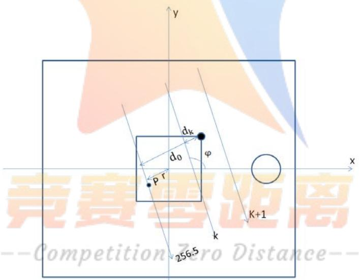  
图 18 新模板旋转中心坐标求解示意图

通过接受信息，可以得到第𝑘条射线经过正方形的长度ℎ，因此可以求出顶点到第𝑘射线的距离 $d _ { k }$ ，如式(32)所示。

$$
d _ { k } = - h c o s \varphi s i n \varphi\tag{32}
$$

其中， $\varphi$ 为钝角。

通过直线簇方程式(12)，可以写出过旋转中心𝑃，方向角为𝜑的射线方程为

$$
y = x t a n \varphi + { \frac { r } { c o s \varphi } }\tag{33}
$$

通过点与直线距离公式可求出右上顶点到过旋转中心射线的距离

$$
d _ { 0 } = \frac { \left| x _ { 0 } t a n \varphi - y _ { 0 } + \frac { r } { c o s \varphi } \right| } { \sqrt { t a n ^ { 2 } \varphi + 1 } }\tag{34}
$$

根据几何关系可以求得如式(35)的关系

$$
d _ { 0 } = d _ { k } + ( k - 2 5 6 . 5 ) d\tag{35}
$$

式(35)只有一个未知数𝑟，可以解得𝑟，并写出此方向的线簇中过旋转中心的直线方程。同样的以上述方法，改变方向角 $\varphi$ ，可以求得另一方向上过旋转中心的射线方程，两射线的交点即为旋转中心。

## 5.6.4 新模板的优点

通过新模板模型求解的探测元间距，误差范围理论上在±1.05%内,而通过旧模板求解的间距的误差范围理论上在±1.79%内。

已知间距后，可以通过几何关系直接求解出 180 个方向和旋转中心的位置，不需要再通过迭代优化求解，过程大大简化，并且若仪器误差可忽略，那么求解结果即为真实结果。

## 六、模型的优缺点

## 6.1 模型优点

1．探测器单元间距及射线的180个方向均采用搜索求解，结果准确度高。

2．CT 图像重建的算法完全是自己的创新思想，且算法具有很高的精确性。

3．设计的新模板计算简洁，且具有很高的精度和稳定性。

## 6.2 模型缺点

1．求解接收信息与射线穿过介质厚度之间的比例系数时，选取了29组样本求平均值，如果样本数量更多，则比例系数将更精确。

2．CT图像重建过程中，对于噪声的消除，噪声阈值选择的是最小的吸收率的绝对值，有些噪声的吸收率大于该阈值，因此噪声去除不是很彻底。

## 七、参考文献

[1]郭立倩，CT 系统标定与有限角度 CT 重建方法的研究[D]，大连理工大学,2016。

[2]孟凡勇,李忠传,杨民,李静海，基于投影原始数据的 CT 旋转中心的精确确定方法[J]，第十三届中国体视学与图像分析学术会议,18(04):336-341，2013。

[3]毛小渊，二维CT图像重建算法研究[D]，南昌航空大学,2016。

[4]杨志清，CT-C3000 数据采集系统和检测器的工作原理及故障分析[J]，中国医学装备, (12):53-55，2007。

[5] Wikipedia，Projection-slice theorem，https://en.wikipedia.org/wiki/Projection-slice\_theorem，2017 年 9 月 17 日。

## 八、附录

## 附录清单

附录一 求解探测器单元间距  
附录二 求解CT系统的几何中心  
附录三 求解CT系统使用X射线的180个方向  
附录四 对附件3、附件5数据进行反投影重建  
附录五 求解重建值与真实值的比例关系  
附录六 分析探测器单元间距的精度  
附录七 分析CT系统旋转中心的精度  
附录八 分析新模板标定模型中探测器单元间距的精度

## 附录一 求解探测器单元间距

```matlab
clear
radiation=xlsread('question1_1.xlsx','A1:A29');
radia_ratio=zeros(28,1);
for i=1:28
radia_ratio(i)=radiation(i)/radiation(i+1);
end
t=golden_section1_1(8/29,8/28,radia_ratio);
function t=golden_section1_1(low,high,radia_ratio)
range=high-low;
lowm=high-0.618*range;
highm=low+0.618*range;
[Initlm,Rlm]=initial1_1(lowm,radia_ratio);
while (high-low>1e-5) <sub>if</sub> <sub>Rlm>Rhm</sub>
range=high-low;
lowm=high-0.618*range;
highm=low+0.618*range;
Initlm=Inithm;Rlm=Rhm;
[Inithm,Rhm]=initial1_1(highm,radia_ratio);
else
high=highm;
range=high-low;
lowm=high-0.618*range;
highm=low+0.618*range;
Inithm=Initlm;Rhm=Rlm;
```

```matlab
[Initlm,Rlm]=initial1_1(lowm,radia_ratio);
end
end
t=(high+low)/2;
end
function [Init,Rl=initial1 1(t,radia ratio)
real_ratio=zeros(28,1);
R=inf;
for init=0:0.000001:8-28*t
for i=0:27
real_ratio(i+1)=sqrt(8*(init+i*t)-(init+i*t)^2)/sqrt(8*(i
nit+(i+1)*t)-(init+(i+1)*t)^2);
end
r=sum((radia_ratio-real_ratio).^2);
if r<R
R=r;
Init=init;
end
end
附录二 求解CT系统的几何中心
radiation=xlsread('question1_1.xlsx','sheet2','A1:A29');
radia_ratio=zeros(28,1);
for i=1:28
radia_ratio(i)=radiation(i)/radiation(i+1);
end
right=1+Init+(256.5-46)*t;<sub>left=100-right;</sub>
radiation=xlsread('question1_1.xlsx','sheet3','A1:A40');
radia_ratio=zeros(39,1);
for i=1:39
radia_ratio(i)=radiation(i)/radiation(i+1);
end
[Init,R]=initial1_3(t,radia_ratio);
bottom=10+Init+(256.5-90)*t;
top=100-bottom;
```

## 附录三 求解CT系统使用X射线的180个方向

```matlab
radiation=xlsread('A题附件.xls','附件2');
real_phi=zeros(180,0);
for i=1:180
Dev=inf;
for phi=i-61.9:0.0001:i-60.1
a=tand(phi);
r=abs(-a*(left-50)+(bottom-50))/sqrt(a^2+1);
dev=deviation1_5(phi,a,r,t,M,left,bottom,radiation(:,i));
if dev<Dev
Dev=dev;
Phi=phi;
end
end
real_phi(i)=Phi;
end
function
dev=deviation1_5(phi,a,r,t,M,left,bottom,radiation)
real_num=zeros(512,1);
if phi>0
for k=-256:255
if phi<atand((left-50)/(bottom-50))+180
b=(r+(0.5+k)*t)/cosd(phi);
else
b=-(r+(0.5+k)*t)/cosd(phi);
end
if abs(b^2-1375)/(a^2+1)<225||b^2-1375<0
real_num(k+257)=sqrt((a*b/800)^2-4*(a^2/1600+1/225)*(b^2/
1600-1))/(a^2/1600+1/225)*sqrt(1+a^2);
end
if abs(45*a+b)/sqrt(a^2+1)<4
real_num(k+257)=real_num(k+257)+2*sqrt(16-(45*a+b)^2/(a^2
+1));
end
end
else
for k=-256:255
if phi>atand((left-50)/(bottom-50))
```

```matlab
b=(r+(0.5+k)*t)/cosd(phi);
else
b=-(r-(0.5+k)*t)/cosd(phi);
end
if abs(b^2-1375)/(a^2+1)<225||b^2-1375<0
real_num(k+257)=sqrt((a*b/800)^2-4*(a^2/1600+1/225)*(b^2/
1600-1))/(a^2/1600+1/225)*sqrt(1+a^2);
end
if abs(45*a+b)/sqrt(a^2+1)<4
real_num(k+257)=real_num(k+257)+2*sqrt(16-(45*a+b)^2/(a^2
+1));
end
end
end
real_num=M*real_num;
dev=sum((radiation-real_num).^2);
end
function M=answer_m(Init,t,radiation)
real_ratia=zeros(29,1);
for i=0:28
real_ratia(i+1)=2*sqrt(8*(Init+i*t)-(Init+i*t)^2);
end
m=zeros(29,1);
for i=1:29
m(i)=radiation(i)/real_ratia(i);
end
M=mean(m);
附录四 对附件 3、附件 5 数据进行反投影重建
```

```matlab
radiation=xlsread('A题附件.xls','附件2');
real_phi=xlsread('phi.xlsx');
d=linspace(-256,255,512);
filt=0.0625*(sinc(d)/2-sinc(d/2).^2/4);
shade_temp = zeros(1536,180);
shade_temp(513:1024,:) = radiation;
for n = 1:180;
shade1_temp(:,n) = conv(shade_temp(:,n),filt');
```

```matlab
end
shade1 = shade1_temp(769:1280,:);
shade1=radiation;
phi=270+real_phi;
d_phi=zeros(180,1);
for i=1:179
d_phi(i)=phi(i+1)-phi(i);
end
d_phi(180)=1;
re = zeros(256,256);
for view=1:180
for x = 1:256
x_real=-(40.6960-100/512-(x-1)*100/256);
for y = 1:256
y_real=43.7851-100/512-100/256*(y-1);
xr
x_real*cosd(phi(view))+y_real*sind(phi(view));
n=256.5-xr/t;
if (n>1)&&(n<512)
num = floor(n);
inter = n-num;
re(y,x) =
re(y,x)+((1-inter)*shade1(num,view)+inter*shade1(num+1,vi
ew))*d_phi(view);
end
end
end
end
%re(abs(re)<abs(min(min(re))-1e-4))=0;
imshow(0.3*re);
```

## 附录五 求解重建值与真实值的比例关系

```matlab
function y=golden_section2_3(re)
r_img=xlsread('A题附件.xls','附件1');
high=1;low=0.5;
range=high-low;
lowm=high-0.618*range;
highm=low+0.618*range;
Rlm=sum(sum((r_img-lowm*re).^2));
```

```matlab
Rhm=sum(sum((r_img-highm*re).^2));
while (high-low>1e-8)
if Rlm>Rhm
low=lowm;
range=high-low;
lowm=high-0.618*range;
highm=low+0.618*range;
Rlm=Rhm;
Rhm=sum(sum((r_img-highm*re).^2));
else
high=highm;
range=high-low;
lowm=high-0.618*range;
highm=low+0.618*range;
Rhm=Rlm;
Rlm=sum(sum((r_img-lowm*re).^2));
end
end
y=(high+low)/2;
end
```

## 附录六 分析探测器单元间距的精度

```matlab
clear
radiation=xlsread('question1_1.xlsx','A1:A29');
for i=1:29
radiation(i)=radiation(i)+normrnd(0,0.01);
end
radia_ratio=zeros(28,1);
for i=1:28
radia_ratio(i)=radiation(i)/radiation(i+1);
end
t=golden_section1_1(8/29,8/28,radia_ratio);
```

## 附录七 分析CT系统旋转中心的精度

```matlab
function [left_l,left_r,bottom_b,bottom_t]=precision4_2(t)
radiation=xlsread('question1_1.xlsx','sheet2','B1:B29');
radia_ratio=zeros(28,1);
for i=1:28
radia_ratio(i)=radiation(i)/radiation(i+1);
end
[Init,~]=initial1_1(t,radia_ratio);
right_l=1+Init+(256.5-46)*t;
```

```matlab
left_l=100-right_l;
radiation=xlsread('question1_1.xlsx','sheet2','C1:C29');
radia_ratio=zeros(28,1);
for i=1:28
radia_ratio(i)=radiation(i)/radiation(i+1);
end
[Init,~]=initial1_1(t,radia_ratio);
right_r=1+Init+(256.5-47)*t;
left_r=100-right_r;
radiation=xlsread('question1_1.xlsx','sheet3','B1:B40');
radia_ratio=zeros(39,1);
for i=1:39
radia_ratio(i)=radiation(i)/radiation(i+1);
end
[Init,~]=initial1_3(t,radia_ratio);
bottom_b=10+Init+(256.5-91)*t;
radiation=xlsread('question1_1.xlsx','sheet3','C1:C40');
radia_ratio=zeros(39,1);
for i=1:39
radia_ratio(i)=radiation(i)/radiation(i+1);
end
[Init,~]=initial1_3(t,radia_ratio);
bottom_t=10+Init+(256.5-89)*t;
end
```

附录八 分析新模板标定模型中探测器单元间距的精度

```matlab
function y=cir_d(n,t)
y=(8+n*t)/((28+n)*(29+n));
end
```