# 基于聚类分析的双目标优化定价模型

## 摘要

“拍照赚钱”APP 是基于移动互联网的自助式劳务众包平台，使得企业可利用大众力量，低成本、高效率地完成各种商品检查与信息搜集的任务。本文通过建立数学模型，就APP 中的任务定价问题进行分析，给出最优的任务定价方案。

针对问题一，对项目的任务定价规律进行定性与定量研究。利用 Matlab 的cftool 工具箱绘制出任务的经纬度坐标与定价数据的三维拟合图，观察到任务分布密集的地区任务定价较低。对任务的位置数据进行空间离散化处理和K-Means分析，将任务分布的区域等划分为若干网格区域，定义影响任务定价的四个因子，即网格内任务数量、会员人数、会员平均完成能力、任务与中心点的距离。运用灰色关联矩阵定量分析四个影响因子与定价的相关度，分别为0.9710,0.9671,0.9633,0.9390。得出所定义的指标对定价相关性很高，能较好描述定价规律。最后通过比较未完成任务与已完成任务的相关度矩阵得出距离对任务的完成的影响是最显著的。

针对问题二，设计新的任务定价方案实际上是一个优化问题，以总成本最小化，完成率最大化作为两个优化目标。通过问题一中任务未完成的原因分析引入吸引度矩阵，计算吸引力阈值。考虑到每个会员有各自的信誉值，预定开始时间与预定配额，设定最大吸引准则、竞争准则、信誉优先分配准则、时间列准则，约束条件即为会员在预定任务时必须遵循以上准则，建立双目标定价优化模型。利用 Matlab的深度多重搜索算法对决策变量进行遍历，用matlab得到最优定价方案。此定价方案的完成率为84.55%，与原方案比较，总成本节约了5.58%，任务完成率提高了32.25%。

针对问题三，在位置较为集中的任务被联合打包发布的情况下修改双目标定价优化模型。首先，根据任务的位置信息，利用聚类分析将任务分为 150类，提取出包含的任务数量大于 15 个的任务类别，进行二次嵌套聚类分析，由此得到的任务打包方案满足每一个任务包中的任务位置集中且任务数量不超过 15个。然后，修改吸引力矩阵，重新计算得到每个任务的阈值，基于任务打包结果，在满足双目标优化模型的约束条件的情况下，利用 Matlab的深度多重搜索算法对决策变量进行遍历，得到最优定价方案，在此定价方案下，任务完成率为0.9091%，与问题二中的方案相比，总成本节约了5.7%，任务完成度提高了7.52%。

针对问题四，新项目的任务定价方案设计应当基于之前建立的双目标优化定价模型。首先，根据任务的位置信息进行聚类分析，得到新任务的打包方案。将模型三中的相关任务数据以及最优定价方案作为 BP神经网络的训练样本，建立BP 神经网络预测模型，新任务的定价依旧满足问题二中的约束条件，通过预测得到新任务定价方案以及相应完成情况，最终定价总额为 54603.58 元，150包中完成141包，任务完成率为94%。都优于问题二和问题三的最优定价方案。

最后，给出每个模型的优缺点及评价。

关键词：K-Means聚类分析 双目标优化模型 多重搜索算法 BP 神经网络

## 一、问题重述

## 1.1 问题背景

在互联网技术发展迅猛的当下，高昂的技术、人才、设备等成本在一定程度上限制了一批企业的生产和扩大，这也促使企业重新寻找突破点。2015年9月，国务院印发的《关于加速构建大众创业万众创新支撑平台的指导意见》中提出，积极发展众包，即汇众力增就业，借助互联网等手段，将传统由特定企业和机构完成的任务向自愿参与的所有企业和个人进行分工，最大限度利用大众力量，以更高的效率、更低的成本满足生产及生活服务需求。

“拍照赚钱”是移动互联网下的一种自助式服务模式。用户下载APP，注册成为 APP 的会员，然后从 APP 上领取需要拍照的任务，赚取 APP 对任务所标定的酬金。这种基于移动互联网的自助式劳务众包平台，为企业提供各种商业检查和信息搜集，相比传统的市场调查方式节省了调查成本，保证了调查数据真实性，缩短了调查的周期。因此APP成为该平台运行的核心，同时，APP中的任务定价是其核心要素。如果定价不合理，该项商品调查任务就会无人领取，从而失败。

## 1.2 问题提出

根据以上背景，以及给出的三个附件，需要解决以下问题：

1.研究附件一中项目的任务定价规律，分析任务未完成的原因。

2.为附件一中的项目设计新的任务定价方案，并和原方案进行比较。

3.实际情况中，用户可能会争相选择位置比较集中的多个任务，因此，考虑将这些任务联合在一起打包发布。基于这种考虑，修改前面的定价模型，并分析对最终的任务完成情况的影响。

4.对附件三中的新项目给出任务定价方案，并评价该方案的实施效果。

其中，附件一给出了已结束项目任务数据，包含每个任务的位置、定价和完成情况；附件二给出了会员信息数据，包含会员的位置、信誉值以及对应的任务开始预订时间和预定限额；附件三给出了新项目任务数据，仅包含任务的位置信息。

## 二、问题分析

##

## 2.1问题一的分析

问题一首先要求我们根据一项已完成项目的任务数据中的每个任务的位置、定价和完成情况来分析任务定价规律。在经济学中，一个竞争性市场上的商品价格规律受到供求关系影响而上下波动，因此，要分析定价规律，便需要找到影响定价的因素，对于每一个任务而言，它的定价与完成情况会受到其它任务与会员的影响，我们将从这两大方面考虑任务定价的影响因子，定义影响任务定价的四大影响因子。

首先，我们将利用任务数据的经纬度与定价信息来进行图像分析，观察出定价的定性规律，在此基础上，将标定任务位置的空间数据进行离散化处理，并根据任务的位置分布进行K-Means聚类分析，结合附件一给出的数据将影响因子量化。最后，利用灰色关联度矩阵计算各影响影响因子与定价之间的相关度，定量分析任务的定价规律。通过比较未完成任务与已完成任务的相关度矩阵之间的差异找出任务未完成的原因。

## 2.2问题二的分析

问题二的新的定价方案设计问题实际上是一个优化问题。由于附件一中任务定价存在某种不合理性导致了任务完成率低下，从企业定价的角度考虑，一个较优的定价方案应当让企业花费尽可能少的成本去得到更多的市场调查信息。因此，我们将设计新的定价方案看做一个双目标优化问题，即在各种约束条件下设计出一个可以使得成本最小化、任务完成率最大化的定价方案。

在考虑最优定价方案时，不能完全从发布任务的企业角度来考虑，应当考虑到现实中任务被会员预定的过程中存在的规则。当企业发布任务数据后，不是任务挑选会员，而是会员挑选任务。该问题的难点便在于同时从企业和会员的两个角度进行考虑，将复杂的任务预定规则一一转化为约束条件。由于每个会员都有对应的信誉值以及任务开始预定时间和预定限额，并且信誉值越高，越优先挑选任务。我们按照时间顺序，依次对任务预定的时间点进行分析。建立每个任务对每位会员的吸引度矩阵，设立每个任务的吸引度阈值，设定约束条件，求解双目标优化模型。

## 2.3问题三的分析

问题三考虑到将位置比较集中的任务联合打包分布，因此，首先应当基于任务的经纬度信息，给出一个合理的打包方案，即如何判断哪些任务应当被打包发布。我们利用聚类分析法的思想，依据任务的地理坐标对任务进行分类，确定一个合理的打包方案。

依据打包方案将任务进行联合打包后，问题三实质上就可以转化为大致等同于问题二的双目标优化定价模型，要想对前面的定价模型进行修改，首先要明确将任务打包处理后会对哪些因素产生影响从而影响到定价。经分析可知打包处理后的任务与之前的任务相比，任务与会员之间的距离矩阵、任务对会员的吸引度矩阵、任务吸引度阈值均会发生改变，从而影响到优化定价模型的约束条件，最终将影响目标函数的求解，即定价方案。我们基于双重聚类分析给出的打包方案求解出新的距离矩阵、吸引度矩阵以及阈值，对前面的定价方案进行修改，给出任务联合打包发布情况下的优化定价方案。

## 2.4 问题四的分析

问题四要求给出附件三中的新项目的任务定价方案，任务数据只有位置信息。考虑任务定价方案基于模型三的定价模型。模型三的结果与决策变量之间存在潜在机制，找到模型三影响定价与完成情况的因子之后，把影响因子的数值与定价、完成情况作为 BP 神经网络的训练样本，从而建立 BP 神经网络预测模型，仿照模型一和模型三，对新任务分别进行聚类分析，得到影响因素的值，并作为神经网络预测样本。然后通过预测就能够得到新任务打包下的定价以及相应完成情况。

## 三、基本假设

1.假设会员在预定任务时，优先预定对其吸引度最大的任务；

2.假设当多个会员同时想预定同一任务时，信誉值最高的会员优先获得该任务；

## 四、符号说明

3. 假设题目给出的数据真实可靠。

<table><tr><td>符号</td><td>说明</td><td>单位</td></tr><tr><td> $c p _ { k }$ </td><td>会员k的任务完成能力</td><td></td></tr><tr><td> $c p _ { i }$ </td><td>任务i所在的单位网格内的会员平均完成能力</td><td></td></tr><tr><td> $p _ { i }$ </td><td>第i个任务的定价</td><td> $\scriptstyle { \overline { { \mathcal { T } } } } \mathbf { \overline { { C } } }$ </td></tr><tr><td> $C _ { i }$ </td><td>判断任务i是否被完成的0-1 变量</td><td></td></tr><tr><td> $W _ { i j }$ </td><td>任务对会员的吸引度矩阵</td><td></td></tr><tr><td> $w _ { i j }$ </td><td>任务i对会员j的吸引度</td><td></td></tr><tr><td> $l _ { i j }$ </td><td>任务i与会员j之间的距离</td><td>公里</td></tr><tr><td> $w _ { i }$ </td><td>任务i的吸引度阈值</td><td></td></tr><tr><td>choice(j)</td><td>会员j在预定任务时的选择</td><td></td></tr><tr><td>belong(k)</td><td>用于表示任务k被哪位会员成功预订</td><td></td></tr><tr><td>G(j)</td><td>-Competit会员j的信誉值 Distance-</td><td></td></tr></table>

注：未列出符号及重复的符号以出现处为准

## 五、问题一的模型建立与求解

## 5.1 问题的分析

问题一首先要求我们根据一项已完成项目的任务数据中的每个任务的位置、定价和完成情况来分析任务定价规律，首先，为了清晰直观地观察每个任务的位置与定价信息，将每个任务的经纬度信息导入百度地图，做出每个任务的经纬度与定价的三维拟合图，通过观察得到直观的定性规律。

每个任务的定价受到其周围任务的数量、会员的人数分布及其信誉属性的影响，为了定量分析这种影响，首先将每个任务的位置信息，即空间数据，进行离散化处理。找出任务所在的经纬度范围作为总区域，将总区域划分为若干单位网格，以便统计每个网格内的任务数据与会员数据。由于任务分布范围较广，定价规律可能存在分布区域间的差异，因此，根据任务的经纬度坐标对这些散布的位置点进行 K-Means聚类分析，得到位置分布相近的任务簇与中心点。接着，确定对任务定价产生影响的四大因子，根据空间数据离散化处理与 K-Means分析的结果将影响因子量化。得到影响因子的数值后，结合任务的定价数据，利用灰色关联度矩阵来分析每个影响因子与任务定价之间的相关度，得到任务定价规律的量化结果。

最后，由于未完成任务与已完成任务的相关度矩阵之间一定存在某种差异，通过比较它们之间的差异找出任务未完成的原因。

具体的思路流程图如下：

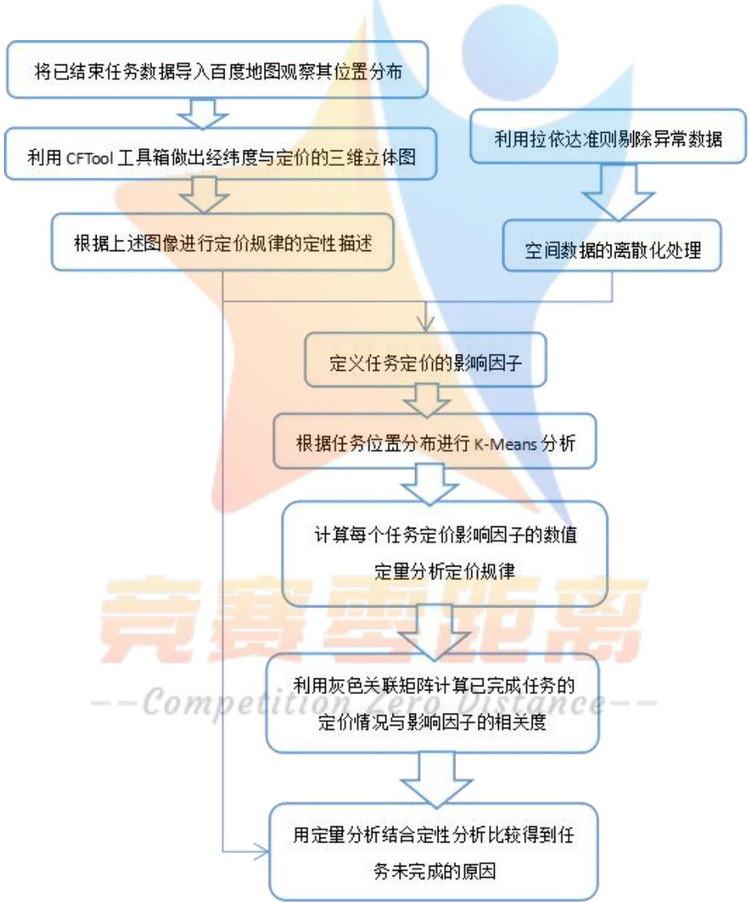  
图 1 问题一的思路流程图

## 5.2 模型的建立

## 5.2.1 基于地图拟合的定性分析

首先，将附件一中提供的已结束的每个任务的经纬度数据导入EXCEL表格中，并进行相应的数据处理，检验并排除掉异常数据之后，将得到的任务经纬度数据通过“地图无忧”网页建立图层，并导入百度地图中，任务的经纬度数据和地图拟合图如图1所示：

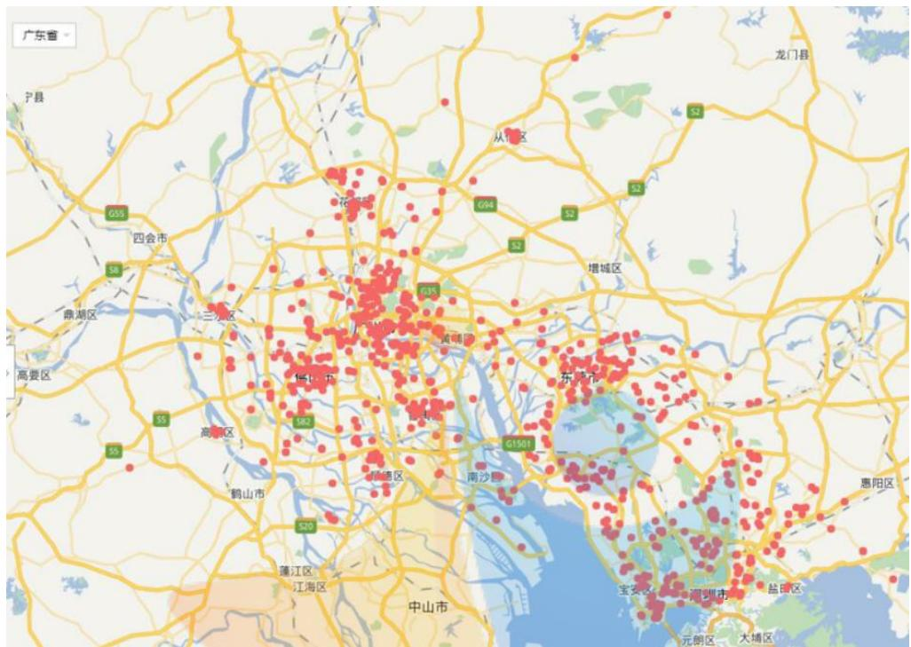  
图 2 已结束任务在地图上的位置分布示意图

根据该项目各个任务在地图上的分布状况，我们可以清晰直观地观察到各个任务的位置信息，直观的结果显示在城市中心任务数据拟合点密集程度高，因此为了进一步观察每项任务的地理位置与其定价的信息，利用 Matlab 的曲线拟合工具箱CFTOOL 做出每项任务的经度、纬度以及定价状况的三维曲线拟合图，如图3所示：

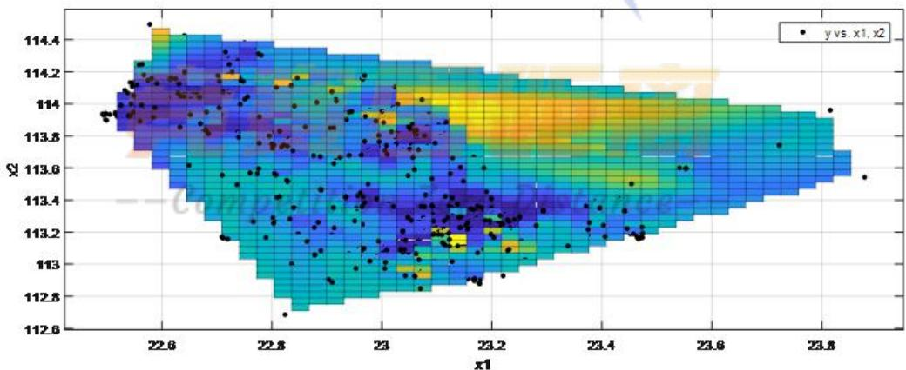

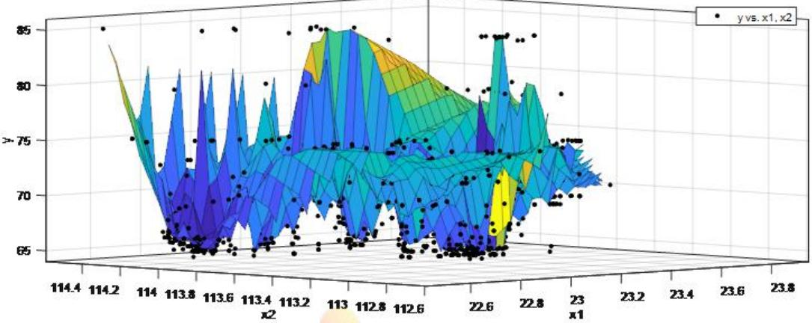  
图 3 任务的经纬度及定价的三维曲线图

根据该项目的每个任务在地图上的分布状况以及其经纬度与定价的三维曲线拟合图，可以观察到的信息有：

（ⅰ）任务大多集中分布在广东省的广州市、深圳市、东莞市以及佛山市等城市的繁华地带，在这些区域人流量较大，交通便利，会员分布也较为密集。

（ⅱ）任务的分布越密集、周围的任务数量越多，该区域的颜色较深，代表任务定价越低。

（ⅲ）较少的任务分布在远离市区的郊区，在这些区域，任务分布稀疏，人口密度与人流量较小，交通不便，会员数量也较少。

（ⅳ）任务的分布越稀疏、周围的任务数量越少， 该区域的颜色较浅，代表任务定价越高。

（ⅴ）将任务的发布看做需要被完成的任务需求方，会员的人数看做完成任务的供给方。在交通便利的市区，会员人数大于任务的数量，供大于求，任务定价较低。同样，当供小于求时，任务定价较高。通过图像观察到的定价规律符合经济学的供求定理。

## 5.2.2 定量分析

## 5.2.2.1 数据处理

## （1）异常数据处理

论文附件是大量数据的集合，为了提高数据挖掘的质量，因此采用拉以达准则算法进行异常数据的剔除。

以定置信概率为 99.7%为标准，以三倍测量列标准偏差极限为依据，凡超过此界限的误差，就认为它不属于随机误差的范畴，而是粗大误差，即需要被剔除的异常数据。

## （2）空间数据的离散化

附件一给出了已结束项目的每个任务的位置信息，即每个任务所在地的经度与纬度。为了便于分析每个任务周围的任务数量以及会员数量对其定价的影响。首先，找出附件一中给出的总区域的经纬度的范围，纬度范围为22.49308313—23.87839806；经度范围为 112.6832583—114.4936096。该范围是一个矩形区域，

取矩形区域的三个顶点分别为A、B、C。这三个顶点的地理坐标分别是：

$$
A \left( \mathrm { x } _ { 1 } , \mathrm { y } _ { 1 } \right) \setminus \ B \left( \mathrm { x } _ { 1 } , \mathrm { y } _ { 2 } \right) \setminus \ C \left( x _ { 2 } , y _ { 1 } \right)
$$

其中， $x _ { 1 } = 2 2 . 4 9 3 0 8 3 1 3$ $x _ { 2 } = 2 3 . 8 7 8 3 9 8 0 6$ $y _ { 1 } = 1 1 2 . 6 8 3 2 5 8 3$ $y _ { 2 } = 1 1 4 . 4 9 3 6 0 9 6$

为了计算出总区域的面积，以地心为坐标原点O,以赤道平面为XOY平面，以0 度经线圈所在的平面为XOZ平面建立三维直角坐标系。则A、B、C三点的直角坐标分别为：

$$
\begin{array} { c } { A ( R \cos x _ { 1 } \cos y _ { 1 } , R \sin x _ { 1 } \cos y _ { 1 } , R \sin y _ { 1 } ) } \\ { B ( R \cos x _ { 1 } \cos y _ { 2 } , R \sin x _ { 1 } \cos y _ { 2 } , R \sin y _ { 2 } ) } \\ { C ( R \cos x _ { 2 } \cos y _ { 1 } , R \sin x _ { 2 } \cos y _ { 1 } , R \sin y _ { 1 } ) } \end{array}
$$

其中，R为地球半径且 $R { = } 6 3 7 0 k m$

A、B两点的实际距离公式为：

$$
d _ { 1 } = R \operatorname { a r c c o s } \left( \frac { \overrightarrow { O A } \cdot \overrightarrow { O B } } { \overrightarrow { \left| O A \right| } \cdot \overrightarrow { O B } } \right)\tag{5.1}
$$

利用 Matlab计算得到A、B两点的实际距离 $d _ { \scriptscriptstyle 1 } = 1 8 6 . 1 9 5 2 k m$ ，同理A、C两点的实际距离 $d _ { 2 } { = } 1 5 4 . 2 1 2 6 k m$ ，则该区域的总面积为 $S = d _ { 1 } \times d _ { 2 } = 2 . 8 7 1 4 \times 1 0 ^ { 4 } k m ^ { 2 }$ C

在空间上，将总区域划分为 $5 0 \times 5 0$ 的网格区域，记纬度区间为 $\left[ B _ { \mathrm { m i n } } , B _ { \mathrm { m a x } } \right]$ ，经度区间为 $\left[ L _ { \mathrm { m i n } } , L _ { \mathrm { m a x } } \right]$ 。

每个单位网格的经纬度差分别为：

$$
\Delta L = \frac { L _ { \mathrm { m a x } } - L _ { \mathrm { m i n } } } { 5 0 } \setminus \Delta B = \frac { B _ { \mathrm { m a x } } - B _ { \mathrm { m i n } } } { 5 0 }\tag{5.2}
$$

对于给定的经纬度坐标(L,B)，其所在网格的行列数为

$$
i = \frac { L - L _ { \mathrm { m i n } } } { \Delta L } , j = \frac { B - B _ { \mathrm { m i n } } } { \Delta B }\tag{5.3}
$$

## 5.2.2.2 确立影响因子

一项任务所处位置的周围环境包括其他任务的定价、数量，会员的分布与数量以及这些会员对应的信誉值。在已知会员的相关信息的前提下，假设所有任务的定价被同时发布，因此，每个任务定价不受其周围的任务价格的影响。但是，一项任务周围的任务数量、会员数量与会员的信誉情况将会影响到该任务的定价。我们将从其周围任务与会员的分布状况与特定属性来考虑影响任务定价的因素。

综合考虑每项任务的位置与周围环境，我们初步定义影响任务定价的三个因子：

## （1）每项任务所在的单位网格内的任务数量 $q _ { i } ( \uparrow )$

通过空间数据的离散化处理<sup>[1]</sup>，将总区域分为 $5 0 \times 5 0 { = } 2 5 0 0$ 个单位网格，每个任务都处在一个网格内，将这个网格区域内存在的任务总数记为$q _ { i }$ 个， $, ( i = 1 , 2 \cdots 8 3 5 )$

## （2）每项任务所在的单位网格内的会员数量 $Q _ { i } ( { \boldsymbol { \curlywedge } } )$

通过空间数据的离散化处理，将总区域分为5050=2500个单位网格，每个任务都处在一个网格内 ，将这个网格区域内分布的会员总数记为Qi人,(i = 1,2 · .835)

（3）每项任务所在的单位网格内的会员平均完成能力 $c p _ { i }$

由于每一位会员都有相应的信誉值，以及参考其信誉值给出的任务开始预定时间和预定限额。而会员的开始预定时间越早，预定限额越多，其对应的完成任务的能力就越高。为了衡量每位会员的信誉值这个特定属性，我们定义会员完成能力 $c p _ { k } , ( k = 1 , 2 \cdots 1 8 7 5 )$ 这项指标。

## Step 1：熵权法确定会员完成能力

1）在经过处理后的数据中一共有1875 位会员，将每位会员的预定限额作为第1个指标x 。任务可以开始预定的最早时间为6:30，每位会员的开始预定时 $x _ { k 1 }$ 间与 6:30 相差 $m _ { k } ^ { ' }$ 分钟， $\scriptstyle { m _ { k } ^ { \prime } = ( 0 , 3 , 6 \cdot \cdot \cdot 9 0 ) }$ 。当 $m _ { k } ^ { ' } \neq 0$ 时，取 $x _ { k 2 } = { \frac { 1 } { m _ { k } ^ { ' } } }$ ；当 $m _ { k } ^ { ' = 0 }$ 时，$x _ { k 2 } = \frac { 1 } { 2 }$

$x _ { k j }$ 表示第k 个对象的第j 个指标的数值（k=1,21875，j=1,2）；

## 2）指标的归一化处理

我们所选取的两项指标均为正向指标，即指标数值越大，对应的会员任务完成能力越强。在计算综合指标之前，先对正向指标进行标准化处理，具体方法如下：

$$
x _ { k j } ^ { ' } = \frac { x _ { k j } - \operatorname* { m i n } \left\{ x _ { 1 , j } , \cdots , x _ { 1 8 7 5 , j } \right\} } { \operatorname* { m a x } \left\{ x _ { 1 , j } , \cdots , x _ { 1 8 7 5 , j } \right\} - \operatorname* { m i n } \left\{ x _ { 1 , j } , \cdots , x _ { 1 8 7 5 , j } \right\} }\tag{5.4}
$$

则 $x _ { k j } ^ { \dot { \ } }$ 为第k个对象的第j个指标的数值（k=1,21875，j=1,2）。

3）计算第j项指标下第k个会员占该指标的比重：

$$
p _ { k j } = \frac { \dot { x _ { k j } } } { 1 8 7 5 } , ~ ( \mathrm { k = 1 } , \cdots 1 8 7 5 , ~ \mathrm { j = 1 } , 2 )
$$

4）计算第j项指标的熵值：

$$
e _ { j } = - K \sum _ { k = 1 } ^ { 1 8 7 5 } p _ { k j } \ln ( p _ { k j } )
$$

其中， K  1/ ln（1875）。

5）计算信息熵冗余度：

$$
= - \mathscr { C o m p e t i t i o n } d _ { j } = 1 \mathscr { L } e _ { j }
$$

6）计算各项指标的权值：

$$
\lambda _ { j } = \frac { d _ { j } } { \displaystyle \sum _ { j = 1 } ^ { 2 } d _ { j } }
$$

7）计算各会员的任务完成能力值：

$$
c p _ { k } = \lambda _ { 1 } x _ { k 1 } + \lambda _ { 2 } x _ { k 2 }\tag{5.5}
$$

利用 Matlab计算可得， $\lambda _ { 1 } { = } 0 . 6 5 0 7 , \lambda _ { 2 } { = } 0 . 3 4 9 3$

## Step 2：计算单位网格内会员平均完成能力

考虑到在不同的单位网格内会员分布情况不同，因此每一个单位网格内会员

的平均完成能力也存在差异，这种差异将影响到该网格区域内任务的定价，对于每一个任务所处的单位网格，我们计算其会员的平均完成能力 $c p _ { i }$ ，具体方式如下：

$$
\scriptstyle { \overline { { c p _ { i } } } = \sum _ { k = 1 } ^ { Q _ { i } } c p _ { k } }\tag{5.6}
$$

## 5.2.3 根据任务位置分布进行K-Means聚类分析

根据在百度中标出的任务的位置分布可以看出任务大致分布在广东省的南部，呈现出部分集中，相对分散的特点。位置的地理位置分布在很大程度上会影响其定价，在城市中心地带，交通便利，人口密集，商业繁华，因而分布着大量的任务，并且任务定价相对较低。据此可以推断，任务的位置距离其所处区域的密集分布中心点的距离会影响其定价。

通过观察地图可知任务的分布大概有四个分布群以及对应的四个中心点。根据任务的经纬度坐标，利用 K-Means聚类分析法将任务分为四类，分类图如图4所示：

任务位置分类及四个分类中心点  
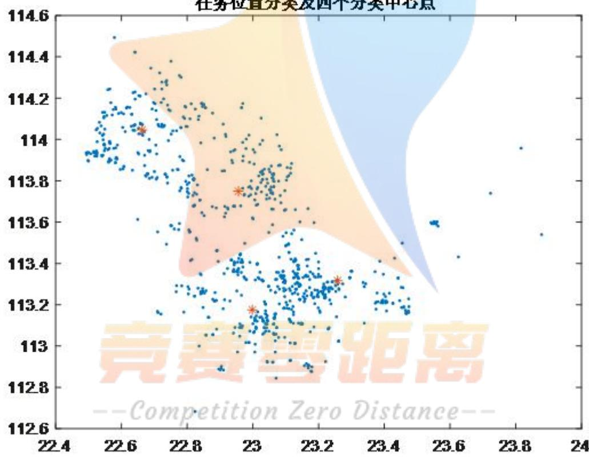  
图 4 根据任务地理坐标进行 K-Means分析的图像

根据K-Means分析结果，得到了四个中心点的经纬度坐标，每个任务都属于这四个分区之一，由此，我们得到影响任务定价的第四个影响因子 $R _ { i }$ ，表示任务i与其所属区域中心点的距离，根据图像可以得出距离越远，定价越高的定性规律。

## 5.2.4 基于离散化与K-Means分析的定价规律影响模型

至此，通过对附件一中已完成项目进行空间离散化处理与K-Means聚类分析，得到影响任务定价规律的四大因子，建立起定价规律影响模型：

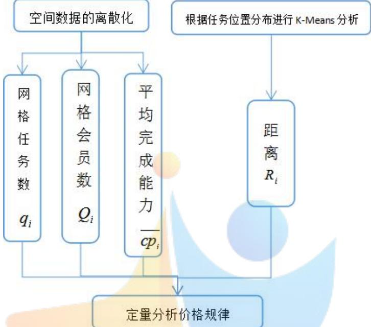  
图 5 定价规律影响模型

## 5.2.5 灰色关联分析求解模型相关性

在定价规律影响模型中，被解释变量即任务的定价的数值由附件一给定，通过离散化处理和K-Means分析可以将影响因子量化，计算出其数值。由于数据过于庞大，计算结果不在论文中出现，将在附录中展示。

## 5.3 模型的求解

## 5.3.1 数据预处理

采用拉以达准则进行异常数据的剔除，通过 matlab 算法对算数平均值和标准偏差的计算从而对数据进行筛选。

筛选结果表示：

表 1
<table><tr><td rowspan=1 colspan=1>会员编号</td><td rowspan=1 colspan=1>会员位置(GPS)纬度</td><td rowspan=1 colspan=1>会员位置(GPS)经度</td><td rowspan=1 colspan=1>预订任务限额</td><td rowspan=1 colspan=1>预订任务开始时间</td><td rowspan=1 colspan=1>信誉值</td></tr><tr><td rowspan=1 colspan=1>B0005</td><td rowspan=1 colspan=1>33.65205</td><td rowspan=1 colspan=1>etl116.97047</td><td rowspan=1 colspan=1>er66</td><td rowspan=1 colspan=1>6:30:00</td><td rowspan=1 colspan=1>20919.0667</td></tr><tr><td rowspan=1 colspan=1>B1175</td><td rowspan=1 colspan=1>113.131483</td><td rowspan=1 colspan=1>23.031824</td><td rowspan=1 colspan=1>1</td><td rowspan=1 colspan=1>6:36:00</td><td rowspan=1 colspan=1>19.9231</td></tr></table>

结果显示附件一数据无异常，附件二中5号和1175 号数据异常，5号会员位置相对较为偏远，因此在问题中的影响较小可以直接忽略，而 1175号会员位置经纬度数据明显有误，因此将剔除附件二中异常的两个数据。

## 5.3.2 搜索算法确定影响因子

当指标体系建立之后，还需科学地对任务定价模型影响因子进行确定。考虑到各个影响因子数值的合理性求解，采用搜索算法对模型建立的各种因子进行求解。确定影响因子数值之后，为了研究附件一中部分任务未完成的原因，因此考虑通过灰色相关度矩阵，对每个任务定价与各影响因子的相关度，并从任务完成或者未完成两方面分析，得到两种情况下任务定价与影响因子的相关度，通过相关度的比较，进而确定对任务定价影响较大的因子，即确定任务未完成的原因。

## Step1：空间数据化

为方便影响因子的确定，首先对空间数据进行离散化处理，将每个任务所在的经纬度坐标系进行网格化处理，分为50×50 网格，每个网格对应实际面积为：

$$
S _ { 0 } = ( d _ { 1 } \times d _ { 2 } ) / 2 5 0 0 = 1 1 . 4 8 5 6 k m ^ { 2 }
$$

## Step2：影响因子确定

基于离散化处理下的网格，分别确定每个任务所在网格内的任务数量、每个任务所在网格内的会员数量、每个任务所在网格内会员的平均能力。通过matlab对任务和会员进行遍历从而确定相应数值。考虑到影响因子相似定义和求解思路，统一算法思想如下：对每个任务进行遍历，确定一个任务下相对应的网格区域，进而对所有任务或者会员进行遍历搜索，得到该网格内相应任务或会员数量以及会员能力。

得到三个影响因子部分数值如下（完整表格请见附录）：

表 2
<table><tr><td>任务编号</td><td>网格任务数</td><td>网格会员数</td><td>会员能力</td><td>平均会员能力</td></tr><tr><td>A0001</td><td>6</td><td>7</td><td>40.150766</td><td>7.07479569</td></tr><tr><td>A0002</td><td>3</td><td>12</td><td>57.26871783</td><td>1.261914171</td></tr><tr><td>A0003</td><td>3</td><td>6</td><td>48.88441489</td><td>10.83174605</td></tr><tr><td>A0004</td><td>2</td><td>0</td><td>34.5612307</td><td>0</td></tr><tr><td>A0005</td><td>6</td><td>7</td><td>25.47823585</td><td>7.07479569</td></tr><tr><td></td><td>...</td><td>...</td><td>···</td><td>...</td></tr></table>

## Step3：灰色关联度确定

为了得到任务定价与各个影响因子之间的具体相关度，根据灰色相关度的定义，通过算法对定义的关联系数和关联度进行计算。

分别考虑完成情况时，得到灰色关联度矩阵：

表 3
<table><tr><td></td><td>X1</td><td>X2</td><td>X3</td><td>X4</td></tr><tr><td>为0时</td><td>0.9363</td><td>0.9077</td><td>0.9089</td><td>0.8687</td></tr><tr><td>为1时</td><td>etitio 0.9710</td><td>0.9671</td><td>Dist 0.9633</td><td>0.9390</td></tr><tr><td>差值</td><td>0.0347</td><td>0.0593</td><td>0.0544</td><td>0.0703</td></tr></table>

根据灰色关联分析结果，可以得到如下结论：

## （1）影响因子的对定价的影响

四大影响因子均对任务定价产生很显著的影响，证明影响因子的选取是合理的，其中，对任务定价影响最大的是任务距离其所在区域中心点的位置，任务所处的位置距离中心点越远，任务定价越低。

## （2）任务未完成原因：

通过相关系数矩阵得到相关系数差距最大的因子为“距离”，表明任务未完成很大程度上是因为由于任务位置偏远，交通不便造成的。当任务所处位置远离

中心点时，只有当任务定价足够高时才会有人来完成，所以最终原因是由于任务定价偏低造成的，因为任务的定价低于会员能接受的最低价格，所以该定价不合理，导致这个任务无人问津。

## 六、问题二的模型建立与求解

## 6.1 问题的分析

问题二要求我们为附件一中的项目设计新的定价方案，首先新的定价方案应当满足两个优化目标，即成本最小化，任务完成率最大化。从而将这个问题转化为双目标优化问题。

考虑到任务发布与被预定和完成的现实过程有着较为复杂的约束条件，我们以会员开始预定任务的时间点作为划分，附件二中会员开始预定任务的时间区间为[6:30，8:00]，时间间隔为 3 分钟，因此会员开始预定任务一共有31个时间点。下面，我们将根据题目所给条件模拟每个时间点任务被预定的情况进行全面而充分的分类讨论。

为了使得问题的分析适当简化以及保证模型的合理性，模型的建立基于以下规则：

ⅰ).每项任务对于每一位会员都有特定的吸引力值，任务的定价越高、与会员的距离越近，其对会员的吸引力就越大。

ⅱ).当会员在某时间点开始预定任务时，假设一次只能预定一个任务，不能同时预定多个任务，并且每次预定时都选择对自己吸引力最大的任务。

ⅲ).当多个会员在同一时间点选取同一任务时，信誉最高者优先获得该任务。

ⅳ).如果会员的预定次数多于一次，在一次任务预订成功后，可以继续预定任务。

ⅴ).根据附件一中已完成项目的任务数据，可以求出任务吸引度的阈值，只有一项任务对会员的吸引度不小于阈值时，会员才愿意预定任务并完成。

具体思路流程图如下：

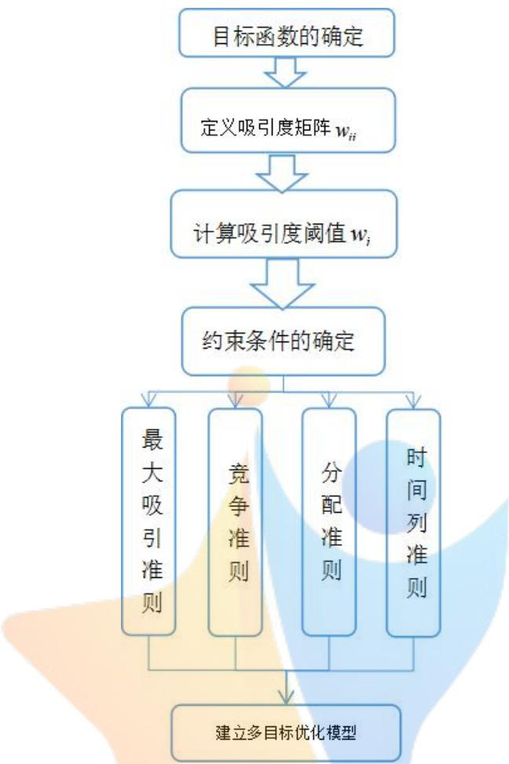  
图 6 问题二的思路流程图

## 6.2 双目标优化模型的建立

## 6.2.1 目标函数的确定

附件一中新的任务定价方案与旧的定价方案相比，应当满足两个优化条件，即成本更少，任务完成率更高。对于企业而言，成本与任务的完成率应当是设计定价方案时最重要的两个考虑因素，因此，我们将新的定价方案设计问题转化为双目标优化问题，双目标函数表述如下：


式中， $p _ { i }$ ——第i个任务的定价；

$C _ { i } = \left\{ { 1 , } \atop { 0 , } \right.$ i任务 被完成 i任务 未被完成

## 6.2.2 约束条件

## 6.2.2.1 吸引度矩阵的建立

## Step1：吸引度的定义公式

在问题一未完成原因的分析中，可以得到距离这个影响因子的影响作用最为显著。因此，会员在选择是否预定并完成某一单时，会重点考虑这一任务与自己的距离，同时，任务的定价直接影响到会员的收益，也会作为重要的考虑因素。为了综合考虑这两个因素对于任务完成情况的影响，我们引入吸引度矩阵 $W _ { i j }$ ，矩 阵 中 每 个 元 素 $w _ { i j }$ 表 示 第 i 个 任 务 对 第 j 个 会 员 的 吸 引 度 ，（i=1,2875，j=1,21875）。当任务距离会员越远，任务定价越低时，任务对会员的吸引度越低。具体定义如下：

$$
w _ { i j } = \sqrt { \frac { a } { l _ { i j } ^ { 2 } } + b p _ { i } ^ { 2 } } , \quad ( \mathrm { i = 1 } , 2 \cdots 8 7 5 , \mathrm { j = 1 } , 2 \cdots 1 8 7 5 )\tag{6.1}
$$

式中， $l _ { i j }$ ——任务i 与会员j之间的距离；

$p _ { i }$ ——任务i的定价；

我们假设吸引度w 的取值范围为[0,1]。当吸引度的值接近零时，说明这个任 $w _ { i j }$ 务对用户毫无吸引力；当吸引度的值接近于1时，说明这个任务非常具有吸引力。

## Step 2：参数 a，b 的求解

在问题一中我们曾对任务的位置分布做聚类分析，依据任务的位置信息将其分为四类，每一类都有一个中心点。中心点的任务占据着绝对的地理优势，它对与之距离最近的会员应当具有绝对大的吸引度，我们假设这个吸引度值为 0.99。在四个位于中心点的任务里选取两个任务，并找到与之最近的一个会员，计算两者之间的距离，得到如下两组数据：

表 4
<table><tr><td></td><td>衣生</td></tr><tr><td>任务号码</td><td>A0716 A0396</td></tr><tr><td>会员编号</td><td>B0509 B0972</td></tr><tr><td> $l _ { i j }$ </td><td>0.4514 0.2061</td></tr><tr><td> $p _ { i }$ </td><td>75 65.5</td></tr></table>

将这两组数据代入表达式中，可以求得 $a = 0 . 0 1 1 7 5 , \therefore b = 0 . 0 0 0 1 6 4$

## 6.2.2.2 任务吸引度的阈值确定

在得到任务吸引度矩阵后，我们需要将每个任务对每个会员的吸引度 $w _ { i j }$ 与这个任务的吸引度阈值 $w _ { i }$ 作比较，用以判断这个任务是否具备足够的吸引度被完成。当吸引度大于等于阈值时，该任务具备足够的吸引度被会员领取并完成，即：

$$
C _ { i } = \left\{ { \begin{array} { l l } { 1 , } & { \mathrm { w } _ { i j } > w _ { i } } \\ { 0 , } & { \mathrm { w } _ { i j } \leq w _ { i } } \end{array} } \right.
$$

利用吸引度 $w _ { i j }$ 的计算公式与附件一中的任务数据计算出吸引度矩阵，当第i个任务被完成时，其阈值至少低于其对一个会员的吸引度；当第i个任务未被完成时，其阈值不低于任何其对一个会员的吸引度。

阈值是作为一个判别指标与吸引度的值作比较，它的绝对值的大小并无实际意义，重要的是其相对大小，因此，阈值的确定具有一定的主观性。在这里，我们依据附件一中的任务数据，做出如下假设：

$$
w _ { i } = \left\{ \begin{array} { l l } { { \operatorname* { m i n } \{ w _ { i j } \} , C _ { i } = 1 } } \\ { { \operatorname* { m a x } \{ w _ { i j } \} , C _ { i } = 0 } } \end{array} \right.
$$

## 6.2.2.3 约束条件的确定

在确定约束条件之前，我们结合题目中的条件给出如下准则：

（1）最大吸引准则： $\operatorname* { m a x } \{ w _ { i j } \}$

（2）竞争准则： $\operatorname* { m a x } \{ w _ { i j } \}$

（3）分配准则： $b e l o n g ( i ) = j \frac { \lvert \operatorname* { m a x } \left\{ w _ { i j } \right\} } { \lvert \operatorname* { m a x } \left\{ G ( n _ { m } ) \right\} }$ ，表示任务i分配给会员j

（4）时间列准则：

以第一个时间点6:30为例：

$$
c h o i c e 1 ( j ) = i \left| \begin{array} { l } { \operatorname* { m a x } \left\{ w _ { i j } \right\} } \\ { i = 1 , 2 \cdots 8 3 5 } \\ { j = 1 , 2 \cdots , 7 , 1 4 , \cdots , 1 2 5 3 } \\ { b e l o n g ( i ) } \end{array} \right.
$$

$$
5 0 \leq { p } _ { i } \leq 1 0 0\tag{①}
$$

$$
C _ { i } = \left\{ \begin{array} { l l } { 1 , ~ \mathrm { \mathrm { ~ w ~ } } _ { i j } > w _ { i } } \\ { 0 , ~ \mathrm { \mathrm { ~ w ~ } } _ { i j } \le w _ { i } } \end{array} \right.\tag{②}
$$

$$
w _ { i j } = \sqrt { \frac { 0 . 0 1 1 7 5 } { l _ { i j } ^ { 2 } } + 0 . 0 0 0 1 6 4 p _ { i } ^ { 2 } }\tag{③}
$$

$$
w _ { i } = \left\{ \begin{array} { l l } { { \operatorname* { m i n } \{ w _ { i j } \} , C _ { i } = 1 } } \\ { { \operatorname* { m a x } \{ w _ { i j } \} , C _ { i } = 0 } } \end{array} \right.\tag{④}
$$

$$
c h o i c e ( j ) = k \left| \begin{array} { l l } { w _ { k j } = \operatorname* { m a x } \left\{ w _ { i j } \right\} } \\ { i = 1 , 2 \cdots 8 3 5 , j = 1 , 2 \cdots 1 8 7 5 } \end{array} \right.\tag{⑤}
$$


$$
b e l o n g ( k ) = n _ { j } | w _ { k n _ { m } } = \operatorname* { m a x } \{ w _ { i n _ { m } } \} , ( m = 1 , 2 \cdots n )\tag{⑥}
$$

关于约束条件的说明如下：

①是关于任务定价的限定范围，这个价格范围是参照附件一中的任务定价区间大致给出的。

②表明当任务i 对会员 j 的吸引度大于任务i 的阈值时，任务i会被完成；当任务i 对会员 j 的吸引度不大于任务i 的阈值时，任务i不会被完成。

③是上文计算出的吸引度矩阵中元素的计算公式。

④是每个任务的吸引度阈值的确定。

⑤是为了说明当会员j选择预定任务k时，k对该会员的吸引度在所有的待选任务中是最大的，即会员会选择预约对自己吸引度最大的任务。

⑥是为了表明不同的会员在选择同一个任务时，信誉值最大的会员具有最大优先度。如果有n个会员同时预定任务k，任务k最后被这n个会员中信誉值最大的人成功预约。G(j)表示会员j的信誉值。

至此，建立起新的定价设计问题的双目标优化模型：

目标函数： $\left\{ \begin{array} { l } { \displaystyle \operatorname* { m i n } \sum _ { i = 1 } ^ { 8 3 5 } p _ { i } } \\ { \displaystyle \operatorname* { m a x } \sum _ { i = 1 } ^ { 8 3 5 } C _ { i } } \end{array} \right.$

$$
\begin{array} { r l } & { \mathbb { E } \equiv \alpha _ { 2 } \leq \alpha _ { 3 } \leq \alpha _ { 4 } , } \\ & { \varepsilon = \int _ { 0 } ^ { \infty } \left( \left( \frac { 1 } { 2 } - \frac { 2 \alpha _ { 3 } } { 2 } \right) ^ { 2 } \right) ^ { \alpha _ { 3 } } } \\ & { \varepsilon = \int _ { 0 } ^ { \infty } \left( \frac { 1 } { 2 } - \frac { 2 \alpha _ { 3 } } { 2 } \right) ^ { 2 } \left( \varepsilon - \varepsilon \right) ^ { 2 } } \\ & { \varepsilon = \left( \frac { 1 } { 2 } - \frac { 2 \alpha _ { 3 } ( 1 + \beta _ { 3 } ) } { 2 } - \alpha _ { 3 } ( 3 + \beta _ { 3 } ) \right) } \\ & { \varepsilon = \left( \frac { 1 } { 2 } - \frac { \beta _ { 3 } ( 1 + \beta _ { 3 } ) } { 2 } \right) ^ { 2 } } \\ & { \varepsilon = \left( \frac { 1 } { 2 } - \frac { \beta _ { 3 } ( 1 + \beta _ { 3 } ) } { 2 } \right) ^ { 2 } \varepsilon = \left( \beta _ { 3 } - \frac { \beta _ { 3 } } { 2 } \right) ^ { 2 } } \\ & { \varepsilon = \left( \alpha _ { 2 } \leq \alpha _ { 3 } \leq \beta _ { 3 } \right) ^ { 2 } \varepsilon = \left( \beta _ { 3 } \right) ^ { 2 } } \\ & { \varepsilon = \left( \beta _ { 3 } - \frac { \beta _ { 3 } } { 2 } \right) ^ { 2 } \varepsilon = \left( \beta _ { 3 } \right) ^ { 2 } \varepsilon = \left( \beta _ { 3 } \right) ^ { 2 } } \\ & { \varepsilon = \left( \beta _ { 3 } - \frac { \beta _ { 3 } } { 2 } \right) ^ { 2 } \varepsilon = \left( \beta _ { 3 } \right) ^ { 2 } \varepsilon = \left( \beta _ { 3 } \right) ^ { 2 } } \\ & { \varepsilon = \left( \beta _ { 3 } - \frac { \beta _ { 3 } } { 2 } \right) ^ { 2 } \varepsilon = \left( \beta _ { 3 } \right) ^ { 2 } \varepsilon = \left( \beta _ { 3 } \right) ^ { 2 } } \\ &  \ \end{array}
$$

## 6.3 双目标优化模型的求解

## 6.3.1 模型求解分析

新的任务定价方案模型是在全面考虑约束条件下，建立的大型双目标优化模型。模型的的解即长度为835的一维定价矩阵，是通过竞争、分配、时间列准则等个各个约束的限定，得到的满足目标函数的全局最优解。

但是模型的最优解的长度较长，约束条件复杂，如吸引度阈值、吸引度等各个约束变量都是维度较大的矩阵，一方面即使在约束条件下对两个目标分别求解是比较困难的，很大程度的原因在于模型中变量太多，尤其是模型的约束条件中包含了时间列的动态变化准则，这种限制使得模型的变成非线性而且不易求解的复杂数学模型；另一方面，从算法角度考虑， 为了得到最优的任务定价方案，需要对任务的定价在一定范围内进行遍历并作为最外层循环，同时在内部也有吸引度、阈值等大型数据矩阵以及内层循环遍历，进而使得算法的复杂度程指数上升，这对算法运行时所需要的时间资源和内存资源存在很大要求。

因此综合考虑算法复杂度以及程序的运行实现，采用分布逐级优化的策略，在算法中对模型中的约束进行一定简化，并做出适当假设，在存在一定误差之下，得到全局最优解的近似解作为模型最优解，即任务定价方案。

## 6.3.2 模型求解步骤

## Step1：预先设置任务定价

将任务的定价直接进行设定，并进行分组对比，通过得到的任务成本和任务完成率两项指标，从而确定一种局部最优解，作为最终近似解。

## Step2：吸引度矩阵确定

通过计算会员与每个任务之间的距离，根据模型二和问题一，由吸引度计算公式得到每个任务对于每个会员的吸引度矩阵。

## Step3：时间刻准则

满足不同时刻不同情况的约束条件，通过建立for 循环，将6：30时刻转换为编号1，依次递推，至8：00 编号 31，通过循环遍历，满足不同时间可选择预定人数不同的约束。

## Step4：目标任务确定

从时刻编号 1开始，通过对释放能够预定任务的会员，相应的在该时刻能够预定的任务中，通过遍历吸引度矩阵，找到最大吸引的任务，并记录位置。

## Step5：冲突判断

判断位置记录矩阵中，是否存在数值相等的情况，即判断是否存在冲突。若发生冲突，则对会员的信誉值进行比较，从而确定一个优先选择，即信誉高的会员得到此次任务预定权。

## Step5：方案及完成度结果

通过对时间和任务预定数的遍历，得到最终任务完成度矩阵，并输出任务完成度数值，同时输出预先设定的任务定价矩阵。考虑到对复杂度和运行时间降低，不采用对定价进行遍历的方式，而通过对任务定价矩阵的不同设置得到几组不同结果，从而对比分析得到近似最优解。

## 6.4 模型求解结果

在对模型求解时，设定几组不同的价格调整比例，得到835个任务的定价以及任务完成度，由于结果数据庞大，此处只展示部分结果：

<table><tr><td></td><td></td><td>表5</td><td></td><td></td></tr><tr><td></td><td>每单定价</td><td>67.32</td><td>66.81 62.225</td><td>76.5</td></tr><tr><td>a=1.02 b=0.95</td><td>完成与否</td><td>1</td><td>0</td><td>1</td></tr><tr><td></td><td>成本 完成率</td><td>56310 0.8455</td><td></td><td></td></tr><tr><td></td><td>每单定价</td><td>72.6</td><td>72.05 65.5</td><td>82.5</td></tr><tr><td>a=1.1</td><td>完成与否</td><td></td><td></td><td>1</td></tr><tr><td>b=0.95</td><td>成本</td><td>58011</td><td></td><td></td></tr><tr><td></td><td>完成率mp0.9701onZeroDistance 每单定价</td><td>67.32</td><td></td><td></td><td></td></tr><tr><td>a=1.02</td><td>完成与否</td><td>1</td><td>66.81 0</td><td>58.95 1</td><td>76.5 1</td></tr><tr><td>b=0.9</td><td>成本</td><td>54488</td><td></td><td></td><td></td></tr><tr><td></td><td>完成率</td><td>0.8455</td><td></td><td></td><td></td></tr><tr><td></td><td></td><td></td><td></td><td></td><td></td></tr><tr><td></td><td>每单定价</td><td>72.6</td><td>72.05</td><td>58.95</td><td>82.5</td></tr><tr><td>a=1.15</td><td>完成与否</td><td></td><td></td><td></td><td></td></tr><tr><td></td><td></td><td>1</td><td>1</td><td>1</td><td>1</td></tr><tr><td>b=0.9</td><td>成本</td><td>62189</td><td></td><td></td><td></td></tr></table>

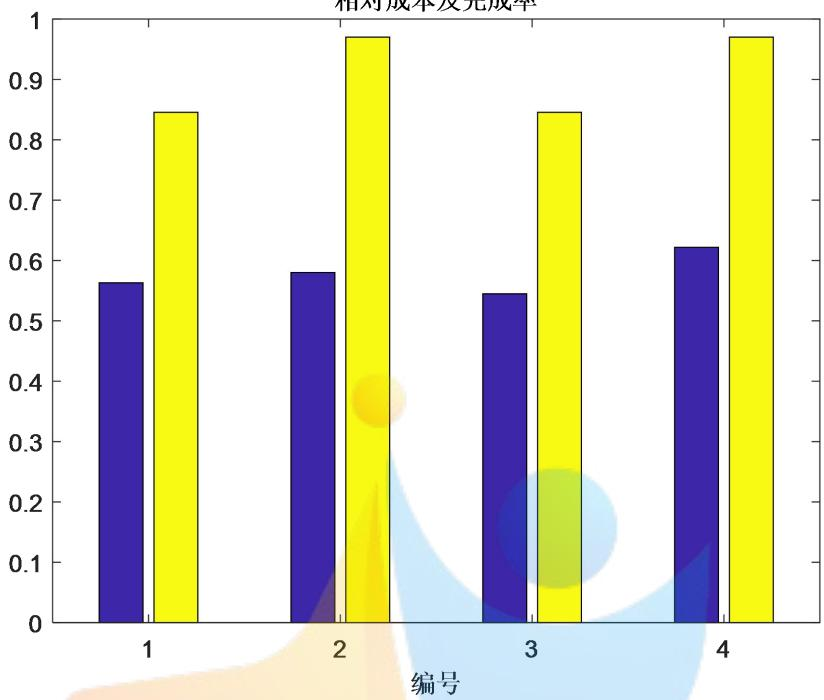  
图 7 成本与完成度结果分析图

在模型二给出的定价方案下，四组的成本及完成率情况如柱状图所示，其中蓝色的值表示成本的万分之一，黄色的值表示任务完成率。综合考虑目标函数的优化结果，选择第3组的任务定价方案作为最优定价方案。

此时总成本为54488 元，任务完成率为0.8455，与原定价方案相比，成本节省了 5.58%，任务完成度提高了35.25%。

## 七、问题三的模型建立与求解

## 7.1 聚类分析确定打包方案

问题三考虑到将位置较为集中的任务联合打包发布，从而提高了任务完成的效率。因此，我们首先需要根据任务的位置信息判断哪些任务的位置分布较为集中，从而确定打包方案。附件一给出的任务位置信息即为经纬度数据，首先，将经纬度的数据作为地理位置的定量分析数据，利用聚类分析的方法，从位置分布上对任务进行准确、细致的分类。此时，位置分布比较集中的任务会被自动归为一类。我们将分析聚类结果的合理性，对于合理的分类，直接将此类中的任务联合打包。对于不合理的分类，我们将对分类结果进一步调整后再打包。

## Step1:第一层聚类分析

首先，我们对聚类分析的分类数进行大致估算，由于任务总数为845 个，将任务按照位置信息分为 150 类时，平均每一类大约有5—6 个任务，这个数值比较合理。因此，初次聚类时，将任务的位置分布分为 150 类，利用 Matlab 的K-Means命令得到的聚类分析图：

任务位置分类及150个分类中心点  
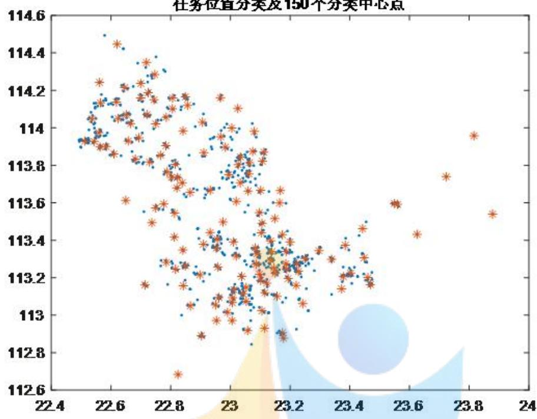  
图 8 K-Means 聚类分析图

任务打包方案应当考虑两方面的问题：一是联合打包的任务应该在位置分布上较为集中；二是一个任务包内的任务数量应当合理。我们假设一个任务包内的任务数量取值范围为[2,15]。该聚类结果保证了一类中的任务在位置分布上较为集中，下面来分析每个任务包中的任务数量是否符合假设。下图为每一类中任务数量的统计图：

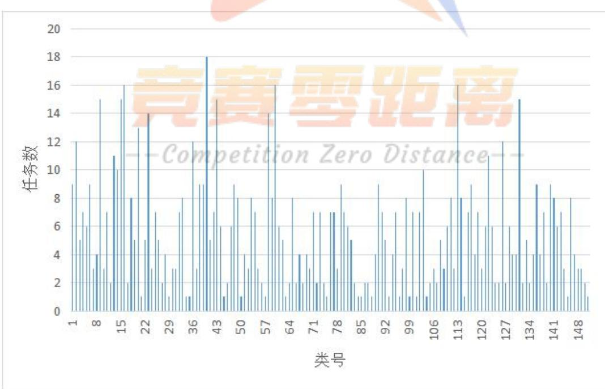  
图 9 每一类中任务数量的统计图

我们依据任务的位置信息将任务按照分布的集中度分成150类，最多的类别中有 18 个任务。最少的类别中只有 1 个任务。对于一类中只有 1 个的任务，由于其位置分布偏散，我们不对其做打包处理。但对于任务个数大于15个的类别，我们将这些任务位置信息提取出来，进行二次聚类分析。

## Step2:第二层聚类分析

我们假设当一类中任务数量不超过 15 个时，这个打包方案才是合理的，在上述聚类分析中，有四个类别中的任务数量超过了 15个，第16 类的任务数量为16，第 40类的任务数量为 18，第60 类的任务数量为 16，第113类的任务数量为 16。

对于这四个不合理的分类，我们在第一次分类结果的基础上，进行嵌套的聚类分析，将它们分成两类。将这四个分类中的任务位置信息提取出来，再一次根据其经纬度数据，利用Matlab的K-Means命令进行第二层聚类分析。

分别得到如下的分类图：

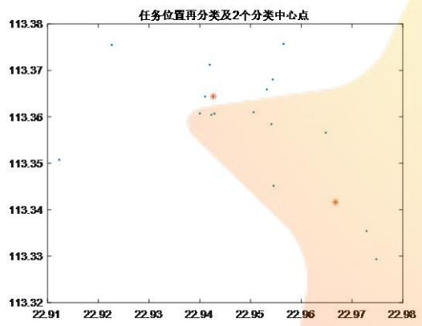  
第 16 类二次聚类图

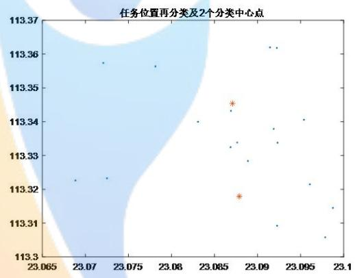  
第 40 类二次聚类图

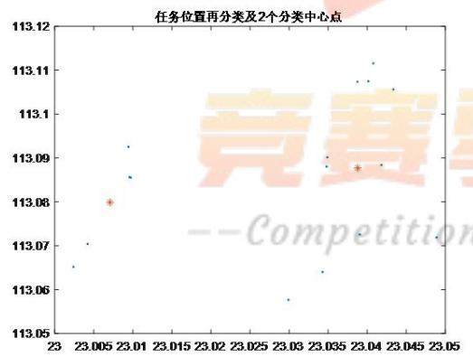  
第 60 类二次聚类图

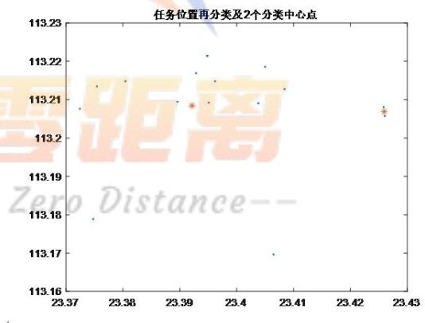  
第 113 类二次聚类图  
图 10 二重嵌套聚类分析图

对这四个类别进行嵌套聚类分析后，每一类别都由两个小类组成，每一小类包含的任务数量由下面的统计表格给出：

表 6
<table><tr><td>类别</td><td>再分类</td><td>计数</td></tr><tr><td rowspan="2">16</td><td>1</td><td>12</td></tr><tr><td>2</td><td>4</td></tr><tr><td rowspan="2">40</td><td>1</td><td>12</td></tr><tr><td>2</td><td>6</td></tr><tr><td rowspan="2">60</td><td>1</td><td>7</td></tr><tr><td>2</td><td>9</td></tr><tr><td rowspan="2">113</td><td>1</td><td>10</td></tr><tr><td>2</td><td>6</td></tr></table>

嵌套聚类分析后，每一类别的任务数量符合要求，此时得到的分类方案合理。Step3:确定任务打包方案

根据上述两次基于任务位置分布的聚类分析结果，我们将位置分布较为集中的任务联合打包，同时保证每一个任务包内的任务数量不多于 15 个，得到了一个合理、准确的任务打包方案。

将一个任务包里的多个任务看做一个整体，与其它未被打包的任务同为一个任务，经过联合打包处理过后的任务数量由835个变为154个。

## 7.2 吸引度矩阵与阈值调整

利用聚类分析我们可以得到任务的打包方案，将位置分布较为集中的多个任务进行联合打包，并将其看做一个整体，即为一个任务包，不论是没有打包的单个任务还是一个任务包，我们在进行分析时都将其看做是一个任务。在问题二给出的双目标优化定价模型中我们定义了一个吸引度矩阵，给出了矩阵中每一个元素的计算公式，即：

$$
w _ { i j } = \sqrt { \frac { 0 . 0 1 1 7 5 } { l _ { i j } ^ { 2 } } + 0 . 0 0 0 1 6 4 p _ { i } ^ { 2 } } , ~ ( \mathrm { i } = 1 , 2 \cdots 8 3 5 , ~ \mathrm { j } = 1 , 2 \cdots 1 8 7 5 )
$$

在对位置分布较为集中的多个任务进行打包处理后，任务总数会改变，需要重新计算每个任务距离每位会员的距离，调整任务定价，从而吸引度矩阵的值会发生相应变化。

经过聚类分析组合成的每个任务包都有一个中心点，我们将每个任务包的中心点的经纬度坐标看作是这个任务的位置信息，计算每个任务包中心点与每位会员之间距离。而对于那些位置分布较为松散，没有被打包处理的单个任务而言，它们距离每位会员的距离不会发生改变。至此，我们得到打包处理后的距离矩阵$L _ { _ { i j } } ^ { ^ { \dag } }$ ，其中每个元素 $l _ { _ { i j } } ^ { ^ { \dag } }$ 表示任务i或者任务包i与会员j之间的距离。

经调整后的任务吸引度矩阵 $W _ { _ { s } } ^ { ' }$ 中每个元素的表达式为：

$$
w _ { i j } ^ { ' } = \sqrt { \frac { 0 . 0 1 1 7 5 } { { l _ { i j } ^ { ' } } ^ { 2 } } + 0 . 0 0 0 1 6 4 p _ { i } ^ { 2 } } , ~ ( \mathrm { i } \mathrm { = 1 } , 2 \cdots 1 5 4 , ~ \mathrm { j } \mathrm { = 1 } , 2 \cdots 1 8 7 5 )\tag{7.1}
$$

由于每个任务吸引度阈值的确定是基于吸引度矩阵与附件一中已完成项目的任务数据的，类似于问题二中确定任务阈值的方法，我们调整经打包处理后的每个任务的阈值 $w _ { i } ^ { \dot { } }$ ：

$$
w _ { i } ^ { ' } = \left\{ \begin{array} { l l } { { \operatorname* { m i n } \{ w _ { _ { i j } } ^ { ' } \} , C _ { i } = 1 } } \\ { { } } \\ { { \operatorname* { m a x } \{ w _ { _ { i j } } ^ { ' } \} , C _ { i } = 0 } } \end{array} \right.
$$

## 7.3 经调整后的双目标优化定价模型的建立

务打包联合发布条件下新的定价方案设计问题转化为双目标优化问题，双目标函数表述如下：

$$
\left\{ \begin{array} { l l } { \displaystyle \operatorname* { m i n } \sum _ { i = 1 } ^ { 1 5 4 } p _ { i } } \\ { \displaystyle \operatorname* { m a x } \sum _ { i = 1 } ^ { 1 5 4 } C _ { i } } \end{array} \right.
$$

式中， $p _ { i }$ ——第i个任务的定价；

1 i ，任务 被完成C=0，任务未被完成

## 7.3.2 约束条件的设定

在利用双层嵌套聚类分析给出合理的打包方案后，任务总数变为154，这154个任务预定过程依旧遵循问题二中的 问题三是在对任务进行联合打包操作后，对问题二的定价优化函数模型进行修改，在将多个位置比较集中的任务联合打包发布的前提下，给出最优定价方案。因此，问题三实质上依旧是一个优化问题，并且目标函数与问题二中模型的一致，通过改变约束条件来改变目标函数的求解结果，从而修改前面的定价模型。得到在问题三的约束下的最优定价模型。

## 7.3.1 目标函数的确立

我们将任

规则，只是吸引度矩阵、任务吸引度阈值有所不同。经修改后的双目标优化模型约束条件如下：

$$
\begin{array} { r l } & { \mathbb { E } \equiv \mathcal { L } _ { \gamma } \int _ { \Omega } \boldsymbol { \Phi } \boldsymbol { 2 } \boldsymbol { \Phi } } \\ & { \left( \begin{array} { l } { \mathrm { S } \cup \mathcal { L } _ { \gamma } \mathrm { S } } \\ { C _ { \gamma } = \left| \mathrm { L } _ { \gamma } \mathrm { S } _ { \gamma } ^ { \prime } \mathrm { S } _ { \gamma } ^ { \prime } \mathrm { S } _ { \gamma } ^ { \prime } \right| } \\ { C _ { \gamma } = \left| \mathrm { 0 } , \mathrm { ~ } \kappa _ { \gamma } ^ { \prime } \mathrm { S } _ { \gamma } ^ { \prime } \mathrm { S } _ { \gamma } ^ { \prime } \right| } \\ { \nu _ { \mathrm { S } } ^ { \prime } = \left| \frac { \sqrt { \mathrm { S } _ { \gamma } \mathrm { S } _ { \gamma } ^ { \prime } \mathrm { S } _ { \gamma } ^ { \prime } } } { \sqrt { \mathrm { S } _ { \gamma } ^ { \prime } \mathrm { S } _ { \gamma } ^ { \prime } } } \mathrm { O } \lambda \mathrm { O O M } \mathrm { I } \delta _ { \gamma } ^ { \prime } \right| } \\ { \nu _ { \mathrm { S } } ^ { \prime } = \left| \frac { \sqrt { \mathrm { S } _ { \gamma } \mathrm { S } _ { \gamma } ^ { \prime } \mathrm { S } _ { \gamma } ^ { \prime } } } { \sqrt { \mathrm { S } _ { \gamma } ^ { \prime } \mathrm { S } _ { \gamma } ^ { \prime } } } - \mathrm { I } \right| ^ { 2 } } \end{array} \right) } \\ & { \mathbb { E } \equiv \mathcal { L } _ { \gamma } \left( \overline { { \mathrm { \Delta } } } \right) \boldsymbol { \Phi } \boldsymbol { \Phi } \boldsymbol { 2 } \left( \mathrm { B } \right) \boldsymbol { \Phi } \boldsymbol { \Phi } \boldsymbol { \Bigg \{ } } \left( \begin{array} { l } { \mathrm { S } \cup \mathcal { L } _ { \gamma } \mathrm { S } _ { \gamma } } \\ { \mathrm { I } ^ { \prime } \mathrm { S } _ { \gamma } } \\ { \mathrm { I } ^ { \prime } \mathrm { S } _ { \gamma } } \end{array} \right) ,  \end{array}
$$

关于约束条件的说明与问题 1相同。

至此，在修改后的优化模型中，发布的任务数量、距离矩阵、吸引度矩阵与阈值均发生改变，建立起如下修改后的双目标定价优化模型：

目标函数： $\left\{ \begin{array} { l l } { \displaystyle \operatorname* { m i n } \sum _ { i = 1 } ^ { 1 5 4 } p _ { i } } \\ { \displaystyle \operatorname* { m a x } \sum _ { i = 1 } ^ { 1 5 4 } C _ { i } } \end{array} \right.$

$$
\begin{array} { r l } & { | \begin{array} { l } { \Phi _ { 2 , 0 } ( x ) , \Phi _ { 1 , 0 } ( x ) } \\ { \bullet \bullet \underbrace { \mathrm { I } _ { \mathbf { x } \in \mathcal { N } _ { 1 , 1 } } ( x ) } _ { \mathrm { C _ { 1 } \in \mathcal { N } _ { 1 , 1 } } ( \mathbf { X } ) } } \\ { \bullet \underbrace { \mathrm { I } _ { \mathbf { x } \in \mathcal { N } _ { 2 , 1 } } ( x ) } _ { \mathrm { C _ { 1 } \in \mathcal { N } _ { 1 , 1 } } ( \mathbf { X } ) } } \end{array} | _ { \mathbf { x } \in \mathcal { N } _ { 1 , 1 } } ^ { \infty } } \\ & { \qquad \times ( \begin{array} { l } { \mathbf { \bar { N } } _ { 1 } \times \mathbf { \bar { N } } _ { 2 } \times \mathbf { x } } \\ { \bullet \mathbf { \bar { N } } _ { 2 } \times \mathbf { \bar { N } } _ { 3 } \times \cdots \cdots } \\ { \bullet \mathbf { \bar { N } } _ { 3 } \times \cdots \cdots } \\ { \cdots \cdot ( \mathbf { \bar { N } } _ { 4 } \times \mathbf { \bar { N } } _ { 4 } ) } \end{array} ) } \\ & { \qquad \times ( \begin{array} { l } { \mathbf { \bar { N } } _ { 2 } \times \mathbf { x } } \\ { \cdots \cdot ( \mathbf { \bar { N } } _ { 3 } \times \mathbf { \bar { N } } _ { 4 } ) } \\ { \cdots \cdot ( \mathbf { \bar { N } } _ { 4 } \times \mathbf { \bar { N } } _ { 4 } ) } \end{array} ) } \\ & { \qquad \times ( \begin{array} { l } { \mathbf { \bar { N } } _ { 1 } \times \mathbf { \bar { N } } _ { 2 } \times \cdots } \\ { \cdots \cdot ( \mathbf { \bar { N } } _ { 4 } \times \mathbf { \bar { N } } _ { 4 } ) } \\ { \cdots \cdot ( \mathbf { \bar { N } } _ { 4 } \times \mathbf { \bar { N } } _ { 4 } ) } \end{array} ) } \\ &  \qquad \times ( \begin{array} { l }  \mathbf  \bar  N  \end{array} \end{array}
$$

## 7.4 模型的求解

## 7.4.1 模型求解分析

问题三的模型建立在问题二的模型之上，仍然考虑对模型中的约束进行一定简化，并做出适当假设，得到全局最优解的近似解作为模型最优解。问题三模型任务安排采用打包分配模式，首先通过聚类把类似的任务聚成一类，从而降低了任务的维度。新的任务数即打包数量影响着任务阈值、吸引度矩阵等变量，通过聚类打包求得新的任务情况，从而套用问题二的算法，对部分变量和维度进行修改，经过遍历得到更优结果。

## 7.4.2 模型求解步骤

## Step1：聚类打包

通过聚类算法，对任务进行分类，相似度较高的任务归为一类成为一个任务包。部分个体未归入聚类类别的单独视为一个任务包。

## Step2：预先设置任务定价

采用与问题二不同的定价模式。根据聚类，分别得到每个打包任务中单个任务的最高、平均、最低价格，从而分为三种情况，分别将每个包中最高、平均、最低作为打包任务的整体平均值。

## Step3：吸引度矩阵更新

更新得到计算会员与每个打包之间的距离，并根据模型二，由吸引度计算公式对每个任务对于每个会员的吸引度矩阵重新进行计算。

## Step4：冲突判断

判断位置记录矩阵中，是否存在数值相等的情况，即判断是否存在冲突。若发生冲突，则对会员的信誉值进行比较，从而确定一个优先选择，即信誉高的会员得到此次任务预定权。


Step5：方案及完成度结果

通过对时间和任务预定数的遍历，得到最终任务完成度矩阵，并输出任务完成度数值，同时输出预先设定的任务定价矩阵。考虑到对复杂度和运行时间降低，不采用对定价进行遍历的方式，而通过对任务定价矩阵的不同设置得到几组不同结果，从而对比分析得到近似最优解。

## 7.5 模型求解结果

在对模型求解时，设定几组不同的价格调整比例，得到835个任务的定价以及任务完成度，由于结果数据庞大，此处只展示部分结果：

表 8
<table><tr><td rowspan="6">mean</td><td>定价</td><td>155.1926164</td><td>477.3163832443.8033516</td></tr><tr><td>完成情况</td><td>1</td><td>1</td></tr><tr><td>成本</td><td>51382</td><td></td></tr><tr><td>完成率</td><td>0.9091</td><td></td></tr><tr><td>定价</td><td>154.5034137</td><td>318.3575655490.5436124</td></tr><tr><td>完成情况</td><td>1</td><td>1 0</td></tr><tr><td rowspan="4">min</td><td>成本</td><td>47096</td><td></td></tr><tr><td>完成率</td><td>0.7922</td><td></td></tr><tr><td>定价</td><td>304.2165353</td><td></td></tr><tr><td></td><td></td><td>534.3744243466.9678395</td></tr><tr><td rowspan="4">max</td><td>完成情况</td><td>1</td><td>1</td><td>1</td></tr><tr><td>成本</td><td>73565</td><td></td><td></td></tr><tr><td>完成率</td><td></td><td></td><td></td></tr><tr><td></td><td>0.9675</td><td></td><td></td></tr></table>

下图为模型三的最优定价方案和模型二的最优定价方案的对比图，其中，0代表模型二，1代表模型三。

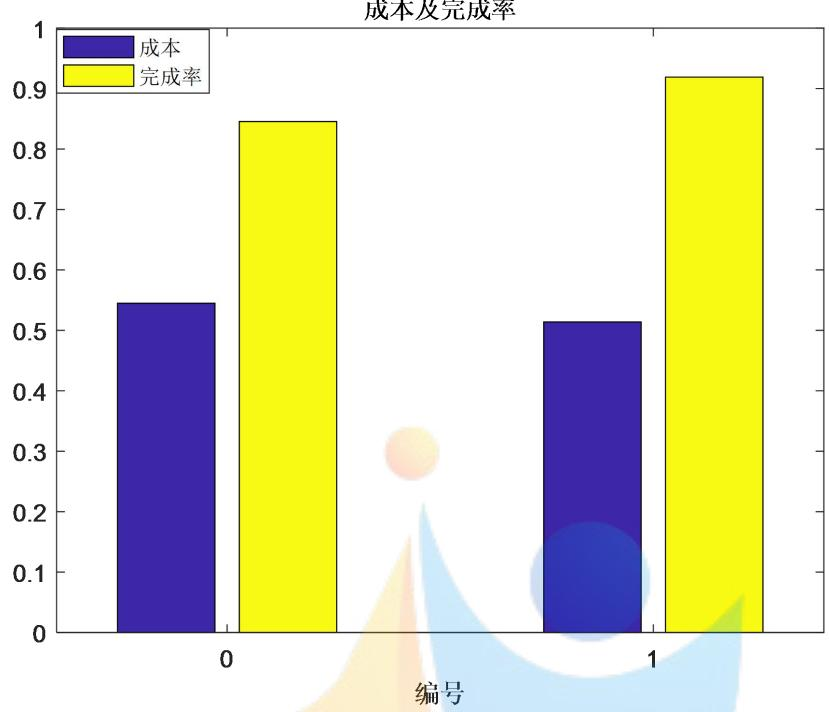  
图 11 模型三的最优定价方案和模型二的最优定价方案的对比图

根据对比图所显示的结果，将位置集中的任务打包后的最优定价方案明显优于模型二中求得的最优定价方案，在问题三的最优定价方案下，总成本为51382，任务完成度为0.9091。

与原方案比较，总成本降低了10.96%，任务完成度提高了45.42%。

与问题二中的定价方案相比，总成本降低了5.7%，任务完成度提高了7.52%。

## 八、问题四的模型建立与求解

## 8.1 问题四的分析

问题四要求给出附件三中的新项目的任务定价方案，任务数据只有位置信息。首先考虑，新项目的任务定价方案基于之前建立的定价模型。根据模型三的得到的结果，是在同时满足打包和多目标优化情况下的结果，因此客观反映了定价及完成情况与决策变量的规律，所以考虑基于模型三的结果，建立神经网络预测模型四的结果。

在问题二的双目标优化定价模型中，任务的位置信息决定了任务与会员之间的距离矩阵，从而影响到任务对会员的吸引度矩阵及其阈值，对应着一个最优定价模型。在问题三中，通过将位置较为集中的任务打包，产生了许多任务包，每个任务包对应着一个中心点，将中心点的地理坐标看做是这个任务包的位置信息，从而改变了任务的原有位置信息，通过修改距离矩阵、任务对会员的吸引度矩阵以及任务的阈值，可以进一步优化双目标定价优化模型。

通过分析问题二与问题三中定价方案的决定因素可知，在前面建立的双目标优化定价模型中，只需要利用任务的位置信息与会员的位置与信誉值信息，就可以得到最优定价方案。因此，在给出附件三中新项目的定价方案时，可以利用与问题三类似的定价机制与打包方案，但附件三中新项目的部分任务经纬度坐标与附件一中的差别较大，为了消除这种地理坐标差异的影响，将任务的位置信息在地理坐标上的绝对差异转化为不受其影响的相对量。

在问题一中，曾依据附件一中的任务经纬度坐标将其分为四类，同样地，根据新任务的经纬度坐标，对其进行聚类分析，将新任务分为四类。然后，利用问题三中设计打包方案的聚类分析法对新任务也进行联合打包发布。新任务中每一项任务都位于四类区域之一，计算每一项任务到其所属区域中心点的距离。

## 8.2 基于多层聚类的神经网络模型建立

仿照模型一确定任务的四类基本聚类中心，然后参照模型三对所有任务进行聚类，即把任务进行打包。根据模型三，知道结果满足与决策变量的可观规律，因此取任务的经纬度和到基本聚类中心的距离最小值作为决策变量。把模型三中的决策变量和被解释变量作为训练数据，根据附录三聚类打包得到的新任务集合，得到神经网络的预测自变量，从而根据已经训练好的神经网络，预测出最终定价方案和任务完成情况。

## 8.2.1 根据任务位置分布进行 K-Means 聚类分析

根据在百度中标出的任务的位置分布可以看出任务大致分布在广东省的南部，呈现出部分集中，相对分散的特点。位置的地理位置分布在很大程度上会影响其定价，在城市中心地带，交通便利，人口密集，商业繁华，因而分布着大量的任务，并且任务定价相对较低。据此可以推断，任务的位置距离其所处区域的密集分布中心点的距离会影响其定价。

仿照模型一确定任务的四类基本聚类中心，然后参照模型三对所有任务进行聚类，即把任务进行打包。

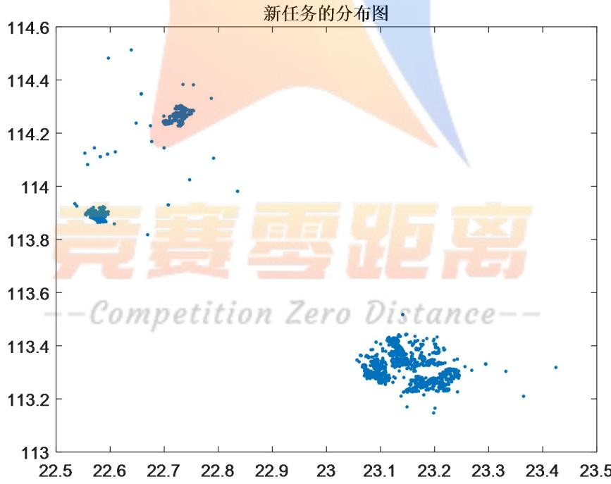  
图 12 聚类分析图

## 8.2.2 神经网络预测模型

BP（Back Propagation）网络是 1986 年由 Rumelhart 和 McCelland 为首的科学家小组提出，是一种按误差逆传播算法训练的多层前馈网络，是目前应用最广泛的神经网络模型之一。BP网络能学习和存贮大量的输入-输出模式映射关系，而无需事前揭示描述这种映射关系的数学方程。它的学习规则是使用最速下降法，通过反向传播来不断调整网络的权值和阈值，使网络的误差平方和最小。BP神经网络模型拓扑结构包括输入层（input）、隐层(hidelayer)和输出层(output layer)（如图所示）。

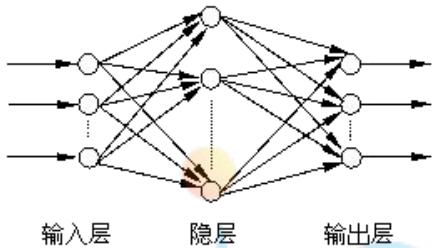

利用问题三中设计打包方案的聚类分析法对新任务也进行联合打包发布。新任务中每一项任务都位于四类区域之一，计算每一项任务到其所属区域中心点的距离 $r _ { i j }$ 。

本问题以位置坐标经纬度和r 为输入层，以每包对应的价格和任务完成情况 $r _ { i j }$ 为输出层，以问题三中定价方案中各个包的位置坐标经纬度和 $r _ { i j }$ 以及每包对应的价格和任务完成情况为学习样本，建立如下的三输入俩输出BP神经网络模型：

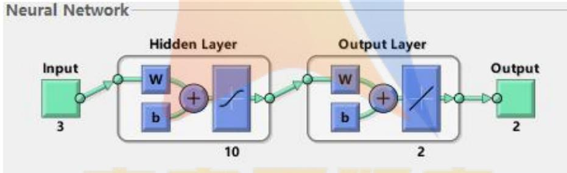

## 8.3 模型求解

## 8.3.1 根据任务位置分布进行 K-Means 聚类分析

首先将新任务通过K-Means聚类方法聚成 4 类，即找到四个基本聚类中心，聚类算法与模型三一致，聚类如图所示：

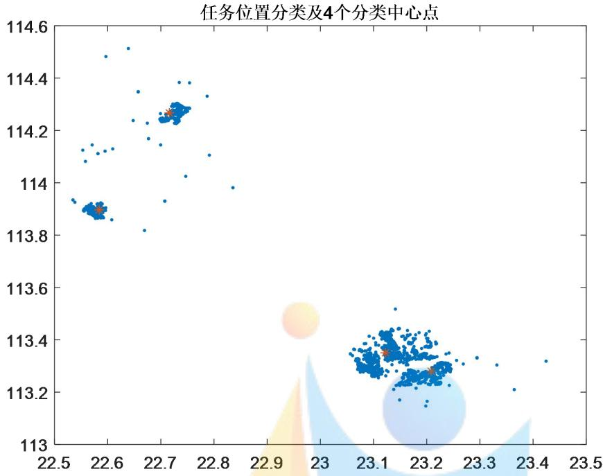  
图 13 聚类分析图

然后将新任务通过K-Means聚类方法聚成150类，使得每一类中的任务数量与模型三同数量级，聚类算法与模型三一致，聚类如图所示：

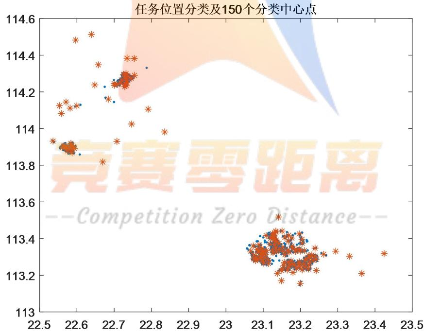  
图 14 聚类分析图

## 8.3.2 根据 BP神经网络预测

根据 BP 神经网络算法，由matlab求解可得：

本问题每一包的价格和每一包的完成情况，共有 150包，其中141包完成，及可以得到完成率94%。价格总价 54603.58元。

可以看出在基于问题三的打包方案和多目标优化情况下，结果完成率都比问题二和问题三的模型最优化下完成率高。而价格总价及成本较低。

## 九、模型的评价

## 9.1 模型一

## 优点：

1.从定性与定量的两个角度分析任务的定价规律，通过图像直观清晰地观察定价的定性规律，再定量给出影响因子对定价规律的影响程度。

2.利用空间数据离散化的思想，将任务分布的经纬度区间划分为等面积的网格区域，便于统计每一个网格区间内的任务与会员的相关数据，计算影响因子的数值。3.对任务的位置信息进行K-Means分析，将其划分为四类，得到每一个任务到相应中心点的距离，相当准确、细致地定量分析了任务与中心点之间的距离这个影响因子对定价规律的影响。

4.灰色关联分析很好地避免了多元回归分析中拟合度较低的问题，系统地定量分析了四大影响因子对任务定价规律的影响。

## 缺点：

1.各影响因子之间不可避免地存在相关性，未能充分考虑到影响因子之间的交互作用。

2.考虑每个网格区域内的任务与会员数据时，对于分布在网格区域边界周围的任务而言，会影响定价影响模型的精度。

## 9.2 模型二

## 优点：

5.建立任务对用户的吸引度矩阵，通过计算与比较得到每一个任务的吸引度阈值，提供了每一个任务能否被完成的判断准则。

6.在设立模型约束条件时，不仅从企业的目标优化角度考虑，同时考虑到每位会员不同的信誉值以及与之对应的预定开始时间和预定限额，模型的建立十分符合任务被预定的实际情形。

7.以 6:30 作为开始时间点，以 3分钟作为间隔，以时间为顺序考虑每个时间点的情形，思考深入而全面。

缺点：

3.考虑的情况太过庞杂，需要获取的数据量十分巨大，给模型的求解与算法的实现带来了相当大的困难。

4.吸引度矩阵中元素的计算公式以及吸引度阈值的确定存在一定的主观性。

## 9.3 模型三

## 优点：

8.在考虑任务的位置分布时，利用位置的经纬度坐标进行聚类分析，使任务的打包方案设计准确又全面。

9.对于第一次聚类分析打包的任务过多的情况，将这一类里的任务提取出来做二次聚类分析。运用二重嵌套聚类分析的方法，想法大胆又合理，保证打包方案的

全面性与可行性。

10.将设计的打包方案与问题二中的优化定价模型相结合来求解问题三，使得每一问之间环环相扣、层层递进。

## 缺点：

5.在任务分布稀疏的地区，聚类分析得到的一类任务包中的任务位置并非那么集中，对定价方案的设计存在一定影响。

## 9.4 模型四

## 优点：

1.问题四中新项目的定价利用问题二、三中的定价模型与打包机制，利用问题三中的定价方案数据，通过 BP 神经网络预测法给出新项目的定价方案，想法新颖大胆，又具有合理性。

2.新项目的任务定价方案确定是基于问题一、二、三的分析与结论的，很好地检验了前面模型的合理性与正确性。

## 缺点：

1.利用 BP 神经网络预测出新的任务定价时，会忽略其他一些因素对定价的影响。

## 十、参考文献

[1]杜剑平，韩中庚，“互联网+”时代的出租车资源配置模型[J]，数学建模及其应用，2015,4(04):40-49+85. [2017-09-17].

[2]姜启源，谢金星，叶俊，数学模型（第四版），北京：高等教育出版社，2011.1

[3]卓金武，李必文，魏永生，秦健.MATLAB 在数学建模中的应用，北京：北京航空航天大学出版社，2014.9

## 附录

## 10.1问题一代码

## 10.1.1

```matlab
%每一个任务所在网格内任务总数求解
function [Num ] = wangge( )
data=xlsread('D:\附件\附件一：已结束项目任务数据.xls');
x1=data(1:length(data(:,2)),1); %取任务的经度
y1=data(1:length(data(:,2)),2); %取任务的纬度
scatter(x1,y1,'.')
max1=max(x1);
min1=min(x1);
max2=max(y1);
min2=min(y1);
d1=(max1-min1)/50;
d2=(max2-min2)/50;
grid on
hold on
[x,y]=meshgrid(min1:d1:max1,min2:d2:max2);
plot(x,y,'k',x',y','k'); %将地区按照 50×50 网格化
axis tight
Num=[];
number=0;
for m=1:length(x1) %对每一个任务遍历
for i=0:50
for j=0:50
%找到每一个任务，对应的网格区域
if (x1(m)>=(min1+i*d1)) && (x1(m)<(min1+(i+1)*d1)) && (y1(m)>=(min2+j*d2))
&& (y1(m)<(min2+(j+1)*d2))
%在满足某一个任务所在区域内，遍历寻找该任务所在的网格内的任
务总数
for t=1:length(x1)
if (x1(t)>=(min1+i*d1)) && (x1(t)<(min1+(i+1)*d1)) &&
(y1(t)>=(min2+j*d2)) && (y1(t)<(min2+(j+1)*d2))
number=number+1;
end
end
Num=[Num,number]; %记录每一个任务所在的网格内的任务总数
number=0;
end
end
end
```

```matlab
end
end
10.1.2
function [ r] = huiserelation(x )
n1=size(x,1);
for i=1:n1
x(i,:)=x(i,:)/x(i,1);
end
data=x;
consult=data(5:n1,:);
m1=size(consult,1);
compare=data(1:4,:);
m2=size(compare,1);
for i=1:m1
for J=1:m2
t(J,:)=compare(J,:)-consult(i,:);
end
min_min=min(min(abs(t')));
max_max=max(max(abs(t')));
resolution=0.5;
coefficient=(min_min+resolution*max_max)./(abs(t)+resolution*max_max);
corr_degree=sum(coefficient')/size(coefficient,2);
r(i,:)=corr_degree;
end
end
```

## 10.2问题二代码

```matlab
function [Pce,WW,SS,P] = quedingdingjia( )
data=xlsread('C:\Users\apple\Desktop\问题二要用的附件\附件一：已结束项目任务数据.xls');
data2=xlsread('C:\Users\apple\Desktop\问题二要用的附件\附件二：更新.xlsx');
data3=xlsread('D:\附件\会员能力值.xlsx');
L=xlsread('C:\Users\apple\Desktop\问题二要用的附件\任务地点和会员位置间距离.xlsx');
Wy=xlsread('C:\Users\apple\Desktop\问题二要用的附件\任务的阈值.xlsx');
data7=xlsread('C:\Users\apple\Desktop\问题二要用的附件\时间排列序号.xlsx');
x1=data(1:length(data(:,2)),1); %取任务的纬度
y1=data(1:length(data(:,2)),2); %取任务的经度
%x2=data2(1:length(data2(:,2)),1); %取会员的纬度
%y2=data2(1:length(data2(:,2)),2); %取会员的经度
%x3=data3(1:length(data3(:,1)),1); %取会员能力
y3=data2(1:length(data2(:,1)),4); %取会员信誉值
```

```matlab
%x4=data4(1:length(data4(:,1)),1); %获取任务地点和会员位置间距离
%scatter(x1,y1,'.')
max1=max(x1);
min1=min(x1);
max2=max(y1);
min2=min(y1);
d1=(max1-min1)/50;
d2=(max2-min2)/50;
grid on
hold on
%[x,y]=meshgrid(min1:d1:max1,min2:d2:max2);
%plot(x,y,'k',x',y','k'); %将地区按照 50×50 网格化
axis tight
Num=[];
HH=[];
hehe=0;dd=[];tt=[];
Aver=[];
pingjun=0;
a=1.02;%a
number=0;
HT=[];
QQ=[];
Cc=0;SS=0;
r=0;
ght=0.98;%b
pce=0;t0=1.03;miny=0;
LL=[];tmpt=0;
c=a-0.01;
temp=[];
<sup>LLL=0;</sup>Pce=[];
ht=0;
lo=[];
WW=[];
er=0;
s=0.9;
WW(1,1:835)=1;
```

```matlab
%考虑到数据庞大和处理难度系数，定义一种定价变化规律
pandn=data(1:length(data(:,2)),3:4);
for i=1:length(pandn(:,1))
if pandn(i,2)==0
ee=pandn(i,1);
etest1=ee*a;
```

```matlab
pce=etest1;lo=pandn(:,1);
miny=min(lo);
ert=miny*c;if pce< ert
WW(i)=0end
elseif pandn(i,2)==1
ff=pandn(i,1);
ftest1=ff*ght;
pce=ftest1;lo=pandn(:,1);miny=max(lo);
ert=miny*(ght-1);if pce> ert
WW(i)=0;end
end
Pce=[Pce,pce];
end
%产生
for i=1:1875
for j=1:835
W(j,i)=sqrt(0.32./(L(j,i).*L(j,i))+0.27*Pce(j).*Pce(j));
end
end
%现在对时间进行遍历
%当不同的时间
Txuhao=data7(1:length(data7(:,1)),1);
%for cai=1:31 %第一个时刻
cai=1;
for T=1:1:length(Txuhao)
if Txuhao(T)==cai
temp=[temp,T]; %temp 存放的是属于第几个时刻的：第几个
end
end
%temp 中存放了，一个时刻时开放的会员的编号矩阵,6:30 为第一个时刻
for mt=1:length(temp)
jj=temp(mt);
ht=max(W(:,jj));%求得吸引力的最大值
for l=1:length(W(:,1))
if W(l,jj)==ht
LLL=l;
end
end
W(LLL,jj)=0;
HT=[HT,ht];
LL=[LL,LLL];%记录的是第几个最大
```

```matlab
for i=1:length(temp)
for j=2:length(temp)
if LL(i)==LL(j) %找中有没有相同的，即有没有冲突
if y3(temp(i))>=y3(temp(j)) %发生冲突的时候，根据信誉值进行判断
tmpt=i;
else
tmpt=j;
end
else
tmpt=i;
end
QQ=[QQ,tmpt];
end
```

```matlab
if HT(tmpt)>Wy(LL(QQ(i)))
Cc=0;
else
Cc=1;
end
WW(LL(tmpt))=Cc;
end
SS=sum(Pce);
P=sum(WW(:)==0);
P=1-P/length(WW);
```

## end

## 10.3问题三代码

function [Pce,WW,SS,P] = dabao( )

data=xlsread('C:\Users\apple\Desktop\问题二要用的附件\附件一：已结束项目任务数据.xls');  
data2=xlsread('C:\Users\apple\Desktop\问题二要用的附件\附件二：更新.xlsx');

data3=xlsread('D:\附件\会员能力值.xlsx');

L=xlsread('C:\Users\apple\Desktop\问题二要用的附件\任务地点和会员位置间距离.xlsx');

Wy=xlsread('C:\Users\apple\Desktop\问题二要用的附件\任务的阈值.xlsx');

data7=xlsread('C:\Users\apple\Desktop\问题二要用的附件\时间排列序号.xlsx');

x1=data(1:length(data(:,2)),1); %取任务的纬度

y1=data(1:length(data(:,2)),2); %取任务的经度

%x2=data2(1:length(data2(:,2)),1); %取会员的纬度

%y2=data2(1:length(data2(:,2)),2); %取会员的经度 dd=[155.192616411676,154.503413653433,304.216535343282;477.316383218284,318.357565 477569,534.374424256355;

```matlab
%x3=data3(1:length(data3(:,1)),1); %取会员能力
y3=data2(1:length(data2(:,1)),4); %取会员信誉值
%x4=data4(1:length(data4(:,1)),1); %获取任务地点和会员位置间距离
%scatter(x1,y1,'.')
max1=max(x1);
min1=min(x1);
max2=max(y1);
min2=min(y1);
d1=(max1-min1)/50;
d2=(max2-min2)/50;
grid on
hold on
%[x,y]=meshgrid(min1:d1:max1,min2:d2:max2);
%plot(x,y,'k',x',y','k'); %将地区按照 50×50 网格化
axis tight
Num=[];
HH=[];
hehe=0;dd=[];tt=[];
Aver=[];
pingjun=0;
gt=30;
number=0;
HT=[];
QQ=[];
bg=65;
Cc=0;
SS=0;
r=0;
pce=0;
t0=1.03;<sub>miny=0;</sub>
LL=[];
tmpt=0;
nb=154;
temp=[];
LLL=0;
Pce=[];
IT=[];
ht=0;
lo=[];
sd=[];
WW=[];
er=0;
WW(1,1:nb)=1;
```

443.803351592000,490.543612418931,466.967839537211;403.573282213692,299.9897957467   
68,700.649727118602;   
509.448913076078,396.542422832021,191.471270937264;497.771812364019,487.0205641712   
54,781.126078225461;   
536.316066935624,516.829652226610,654.029098029452;279.748027319369,536.6202277218   
64,241.718505121022;   
490.116632920990,210.136029772023,789.527261131223;419.468314181287,240.0347728756   
79,289.674100622310;   
336.190812142428,521.958767014572,598.971000619037;162.027146868062,387.6725804302   
74,550.171142593681;   
535.691276375410,348.193476094460,261.204441252670;305.543609307063,396.2490286764   
82,142.290678708276;   
446.090271776732,487.365208824257,723.557226698546;515.452105741153,360.5631237463   
80,718.473755197803;   
184.502885826220,215.115117577858,457.591638442668;196.501957487157,326.1670183651   
10,181.121204358987;   
415.760855647903,314.708715640695,582.581969382779;382.319292464179,552.0292625788   
92,270.183830525430;   
593.047353175908,399.444278872862,691.015491369829;545.459344982697,432.6669687958   
40,543.526906905241;   
511.857363521904,443.592593899929,330.075794403322;156.692580778433,278.9807789168   
38,834.046071948759;   
167.900355531468,353.992775451662,713.469648054001;176.034279030855,371.5023327173   
37,811.256325761062;   
545.142449339255,195.014391629294,190.217811867721;620.364232576765,373.8667160927   
43,277.297900405631;   
485.532097652346,432.408250496829,697.438144831221;198.683136971053,314.0668912482   
15,666.806573161139;   
505.816760621518,494.795255518255,727.737615430876;187.383809934021,448.5416961774   
12,518.944695137692;   
191.096283118953,284.773689559825,460.952092453994;463.173319942281,326.3076559873   
49,601.928982257695;   
300.983391673537,296.397945279148,787.530865543558;469.982251749802,468.0195972324   
86,647.135005715989;   
519.548360813830,449.813557607499,535.406361935771;433.256580356536,315.7525296777   
03,364.800896271230;   
514.816810553644,431.944885193056,672.312530696257;252.109995668910,542.8391478412   
91,427.642654875562;   
512.177921681947,471.846575820198,568.872913331328;634.711233045040,437.1571894358   
01,811.886465081222;   
580.803751710996,174.216399630236,777.798510347424;174.841955529018,297.9594198060   
10,820.188103876632;   
320.547040485983,386.588986108753,850.703346407935;321.983378251609,328.5866011531   
49,756.915283357509;   
486.214805784037,148.199934151879,139.030592048598;440.929650399622,226.8512245529   
17,140.345839446116;   
540.469250693791,493.877375926093,204.388831585932;321.179517587696,132.8993094791   
68,335.892059564079;   
237.134486942701,506.896491489637,155.304191016468;175.066604645677,160.4284523873   
04,459.880377473663;   
531.405636891536,421.047782225966,396.868311402105;236.950751161675,346.5931940079   
66,548.887635380548;   
331.901248144857,222.135265248818,840.962333680552;416.924836617758,378.0825349032   
03,364.561080317963;   
249.055691052012,179.885415557228,394.606358533123;463.809122607577,421.9843087479   
96,790.345401369953;

381.929793647054,390.417226722161,396.423037870963;208.959673060459,150.6854854080

16,242.833385915016;

536.604622625761,150.847271177620,523.419407112626;182.315287628459,193.2527809180   
89,788.202265960793;   
282.914493554487,134.652890443623,429.694035972904;253.433970246901,317.9124156523   
56,666.029413463036;   
406.053573654523,493.009670599723,614.579270943027;177.579340296494,398.2690656112   
51,479.844609153111;   
340.764018337908,355.377072152037,497.476018053053;184.520048500193,506.9658863137   
22,858.827122309181;   
188.387660321134,169.084781909196,201.374649398102;537.902503186835,526.4510216053   
65,350.390150280161;   
281.616565311604,173.635362114311,477.278547785041;443.837388150461,353.9955703207   
53,583.966589372443;   
631.499786952269,189.131805738857,804.124311056622;354.892196864588,372.6824224297   
25,494.047294853826;   
491.271141201329,128.019614160770,470.000623057606;524.211623150516,464.1067613920   
76,704.354369440908;   
354.974009596492,500.280768868103,493.144043548079;470.858980697839,530.3181801818   
99,791.367959452927;   
187.072626375987,561.253009179593,492.082617397549;615.555121160373,348.7636978932   
81,516.061305726136;   
227.479619339277,245.696936368124,507.959866701323;268.412996231972,170.4309757572   
65,312.166800033745;   
544.871735310031,349.961334395826,202.934144398474;383.553963225640,384.2536244345   
28,189.143935029160;   
529.858297310612,462.433209296637,812.288719516675;335.923507513295,162.5865282577   
50,314.974273423272;   
271.928172944319,417.763921149477,791.951181828135;149.362009716571,353.9877454854   
40,678.206935593011;   
480.113355336500,201.432175728722,800.465061719526;353.373518810964,539.9040181703   
43,849.943523252000;   
364.904402150463,386.403081119874,244.024162417553;447.125728030912,320.3198942155   
31,436.970209941912;   
160.889714366304,541.386248267276,882.247187753726;294.221947936210,415.2579947333   
99,627.398665722900;   
531.815508048726,325.308057783830,818.375022605536;492.145154283169,496.3065625373   
74,504.012877726530;   
195.172734176774,360.886964591187,148.696644068469;197.678754202500,370.2641960139   
52,610.766181426010;   
178.023216133985,425.908898766762,313.401380601351;134.066552656054,287.9307482449   
59,538.322377747465;   
350.016880285367,231.527157331354,688.268898670144;470.898050967715,381.3052601744   
60,599.028585479006;   
505.919712839853,508.297191110576,584.570132358595;406.228832662868,305.3885512549   
15,466.977043585091;   
186.585327901984,175.663277192046,323.327226171832;458.518514234814,321.7360139965   
88,463.580908517508;   
195.779929971238,258.381320935330,145.724688741029;199.837718243059,303.0116025321   
91,600.095479824669;   
181.268928209719,493.513331482832,865.103167841795;203.854169184603,304.0002402831   
61,210.443911374147;   
217.490675215594,298.067588715598,165.013237605532;232.049439573617,284.9579619801   
15,810.652449496245;   
295.089483077706,187.852613437825,325.428496078640;294.543079556071,240.7174156035   
86,144.766527696283;   
243.132920899867,164.285459481833,756.524486029062;260.541759928183,315.3642256548   
40,244.639072340514;   
594.319650748708,239.461708083508,805.818628175558;495.676076769271,257.2219244106   
43,210.390980642708;   
418.983730214081,313.362559561740,405.593116847717;225.905507233980,178.5704014047   
88,588.406210950706;   
240.256038116807,344.324513396003,582.152863605252;170.220340218592,437.5255873440   
64,644.770459016038;   
605.176213605375,233.415857352299,629.852580327280;497.491913202404,472.2159061328   
97,466.927122109991;   
420.050262712536,158.673503395669,244.076898156336;292.983074767027,299.7025912989   
28,708.714496553089;   
643.726062175298,126.573550796963,788.746912173360;218.624651989579,209.4282349086   
78,202.037187523268;   
264.051970297447,188.835468176048,875.815673740047;336.335645689235,244.2215156134   
09,161.878091089369;   
168.477280180008,203.127400813080,772.072053787648;485.729954820245,187.1441964723   
35,772.306431261683;   
339.241933002004,390.108554172229,175.841843521305;641.074304724855,523.3665364060   
82,552.327632548140;   
339.135672315692,540.266476754949,853.865908298508;452.749412543781,223.5423450691   
33,381.998060031322;   
210.272298849222,338.858076549819,750.108304079140;328.299506311125,291.8209021228   
17,594.461655236882;   
213.789665361668,356.986996301948,737.321933028386;524.218464290258,242.8088137549   
28,744.581441598636;   
582.977783396003,156.145534227636,175.619657073862;312.403907340664,318.4202411687   
25,352.947763085278;   
486.478568548719,202.669189477965,633.973729400793;282.957289559282,137.5132346963   
13,509.648407104310;

405.927238005581,547.013118869478,876.394847891199;562.860160868296,315.8930652580

03,706.103841672605;

440.694899773741,550.047330738716,568.991432651755;304.361891966728,462.2247874453   
20,364.913800064013;   
285.597012133215,129.240759546356,332.387323825935;365.348121616049,425.8970404429   
21,810.901919958364;   
349.775739674641,437.324282623758,477.121854852146;316.995285345563,410.5017948938   
56,757.334325251821;

baokang=[22.6491324700000,114.069312600000,9;23.4662592500000,113.171685400000,12;   
22.9607010300000,113.439405100000,5;23.2968727700000,113.344632900000,7;   
23.0275503700000,113.799843700000,6;22.7391178000000,114.275904900000,9;   
22.8596344000000,113.155084300000,3;22.9915954300000,114.001053100000,4;   
23.2248276600000,113.280083100000,15;23.1748198100000,112.882802400000,3;   
22.8132563600000,113.544506700000,7;22.6520674300000,113.862474900000,2;   
22.8461360000000,114.161335300000,11;23.1289551200000,113.407291400000,10;   
23.0152518700000,113.131044900000,15;23.1484899500000,113.662806500000,2;   
22.8191953900000,113.728405700000,8;22.9673695400000,113.890749300000,5;   
23.5518154800000,113.595800900000,13;23.8161076700000,113.957929400000,1;   
22.9830627400000,113.006214800000,5;22.5279847800000,113.931583400000,14;   
23.0102386800000,113.691741500000,3;23.0720507500000,112.931801200000,7;   
23.2425861000000,113.061180300000,5;22.7471972400000,114.010640000000,2;   
23.0978024000000,113.218556100000,4;23.8783980600000,113.539711400000,1;   
23.0800284700000,113.980600200000,3;22.6577180400000,113.930032600000,3;   
23.0570445200000,113.839759300000,7;22.5367280900000,114.047141900000,8;   
22.8245226800000,112.683258300000,1;22.5787279800000,114.493609600000,1;   
22.8448613900000,113.260098500000,12;22.9395735000000,113.945413600000,3;   
23.0488812200000,113.737720100000,9;23.1103973700000,113.179618000000,9;   
23.0873945800000,113.334698400000,5;23.1120747300000,113.494147800000,7;   
22.5594290600000,113.973951500000,15;22.8663869200000,113.049891700000,6;   
22.9755619200000,113.497229600000,1;23.4420225200000,113.329339100000,2;   
23.0965934500000,113.872454900000,6;23.0651795200000,113.782526500000,9;   
22.8188982200000,113.808702100000,8;23.0250614800000,114.103597300000,1;   
23.1242788600000,113.013788800000,4;22.7841505000000,113.904682000000,3;   
22.7204874700000,114.070891400000,8;23.2236308100000,113.228845300000,7;   
22.7138545300000,113.161580700000,3;22.5619199400000,114.242944200000,2;   
22.6494630400000,113.612984900000,1;22.5823757000000,113.888646700000,14;   
22.9616343100000,113.094216500000,8;23.0288767500000,113.085255200000,6;   
23.1927057500000,113.335018100000,5;22.7506640000000,114.378843000000,1;   
23.1802049200000,113.080803200000,2;22.6149614700000,114.136233200000,8;   
22.7028833300000,114.333837900000,2;22.8914273600000,113.448991800000,4;   
22.6945675200000,113.986387500000,2;23.0377754300000,113.206369600000,4;

<table><tr><td>23.0785911900000.113.711074200000.3:22.7920451300000.113.773708500000.7 23.1647539100000,113.599332300000,2;23.1753282800000,112.908565000000,7;</td></tr><tr><td>22.8411068500000,113.347486700000,2;22.9097662000000,114.074039800000,1;</td></tr><tr><td>23.0272502200000,113.839486100000,7;22.8981805500000,113.215312500000,7;</td></tr><tr><td>23.1636642400000,113.268497200000,3;23.2480925900000,113.307885900000,9;</td></tr><tr><td>22.8068863000000,114.119753100000,7;22.6505213300000,114.215895500000,6;</td></tr><tr><td>23.1775367200000,113.416385300000,5;23.4087193200000,113.418024800000,2;</td></tr><tr><td>23.7231177300000,113.739427000000,1;22.8415806500000,113.983753400000,1;</td></tr><tr><td></td></tr><tr><td>22.9151352500000,113.634489300000,2;22.6414407100000,114.422742100000,2;</td></tr><tr><td>23.6254762800000,113.431395600000,1;22.5769716900000,114.156646000000,4;</td></tr><tr><td>23.1507093700000,113.231512800000,9;23.0721971000000,113.049027400000,7;</td></tr><tr><td>22.9873730500000,113.732121300000,5;23.3388714400000,113.111064900000,1;</td></tr><tr><td>22.6906260400000,113.940675500000,4;22.4984244200000,113.923200200000,7;</td></tr><tr><td>22.7898213300000,113.164103900000,1;23.0997816400000,113.445558200000,3;</td></tr><tr><td>22.7291070300000,113.818017400000,8;23.5634113300000,113.580384800000,1;</td></tr><tr><td>23.0633295600000,113.276018900000,7;23.4545743400000,113.498304400000,1;</td></tr><tr><td>22.9399194100000,113.408307100000,7;23.1309886600000,113.114345200000,10;</td></tr><tr><td>22.9704957400000,113.919336400000,1;22.6079123900000,114.048336200000,2;</td></tr><tr><td>22.9056815900000,114.015499400000,3;23.4602958500000,113.224418600000,2;</td></tr><tr><td>23.0823963000000,113.660377500000,5;23.1947906300000,113.267133500000,3;</td></tr><tr><td>22.9951724100000,113.765967500000,6;22.6833944000000,113.828015800000,8;</td></tr><tr><td>22.8938227500000,113.849984800000,3;23.3963805000000,113.208243100000,8;</td></tr><tr><td>22.9369379200000,113.674164300000,1;23.0057363900000,112.970789900000,7;</td></tr><tr><td>22.7201364200000,114.162837800000,9;23.0677765000000,113.098101400000,4;</td></tr><tr><td>23.2132124300000,113.257996000000,7;22.7662956200000,113.853443100000,3;</td></tr><tr><td>22.7883682800000,113.277053500000,6;23.1158691600000,113.271943200000,11;</td></tr><tr><td>22.5521903700000,114.119028000000,6;22.9997699500000,113.618041500000,2;</td></tr><tr><td>22.9582442200000,113.256553000000,2;23.0518947900000,113.144462300000,12;</td></tr><tr><td>23.3843771900000,113.353955300000,2;22.9648114400000,113.404448700000,6;</td></tr><tr><td>23.3987762800000,113.251072300000,4;23.1077132900000,113.821205500000,4;</td></tr><tr><td>23.1345456500000,113.345856000000,15;22.8826291700000,113.671919500000,2;</td></tr><tr><td>23.2097892900000,113.173354900000,5;23.4541935900000,113.283170200000,2;</td></tr><tr><td>23.1088996500000,113.546444100000,4;23.0132751700000,113.321068600000,9;</td></tr><tr><td>23.2642347300000.113.263382700000.4:22.6552406800000.114.032574500000.7:</td></tr><tr><td>23.0541437800000,113.568569200000,2;23.1379224200000,113.299864700000,9;</td></tr><tr><td>23.1871204900000,113.243763700000,8;22.7804753800000,114.054183600000,6;</td></tr><tr><td>23.1725713700000,113.348570300000,7;23.3392037100000,113.298763600000,3;</td></tr><tr><td>23.0705795100000,112.844540800000,1;22.7515631600000,113.564867300000,8;</td></tr><tr><td>23.0016987000000,113.955521500000,4;22.9638773400000,113.060799600000,3;</td></tr><tr><td></td></tr><tr><td>22.9667172700000,114.160904500000,3;22.8123289000000,113.416633900000,2;</td></tr><tr><td>22.9667496300000,113.341625300000,12;22.9426562600000,113.364395700000,4;</td></tr><tr><td>23.0881968500000,113.322535800000,12;23.0863917500000,113.349901600000,6;</td></tr><tr><td>23.0142280200000,113.074426300000,7;23.0402702100000,113.093677700000,9;</td></tr><tr><td>23.4032499700000,113.209760400000,10;23.3757720700000,113.203691000000,6];</td></tr></table>

```matlab
for i=1:length(baokang(:,1))
if baokang(i,3)==1
IT=[IT,i];
end
end
Pce=dd(1:154,3);
for i=1:length(IT)
It=IT(i);Pce(It)=Pce(It)*0.23;
if Pce(It)<bg
Pce(It)=Pce(It)+gt;
end
end
for i=1:nb
if Pce(i)>dd(155,3)
WW(i)=0;
elseif Pce(i)<80
WW(i)=0;
end
end
%考虑到数据庞大和处理难度系数，定义一种定价变化规律
%具体的系数分别取值
pandn=data(1:length(data(:,2)),3:4);
for i=1:length(pandn(:,1))
if pandn(i,2)==0
ee=pandn(i,1);
etest1=ee*1.02;%emax=pandn(i,0)*1.20;
pce=etest1;
lo=pandn(:,1);
<sup>miny=min(lo);</sup>ert=miny*1.01;
elseif pandn(i,2)==1
ff=pandn(i,1);
ftest1=ff*0.98;%emax=pandn(i,0)*1.20;
pce=ftest1;
lo=pandn(:,1);
miny=max(lo);
ert=miny*0.97;
end
end
%产生
for i=1:1875
```

```matlab
for j=1:nb
W(j,i)=sqrt(0.32./(L(j,i).*L(j,i))+0.27*Pce(j).*Pce(j));
end
end
%现在对时间进行遍历
%当不同的时间
Txuhao=data7(1:length(data7(:,1)),1);
%for cai=1:31 %第一个时刻
cai=1;
for T=1:1:length(Txuhao)
if Txuhao(T)==cai
temp=[temp,T]; %temp 存放的是属于第几个时刻的：第几个
end
end
%temp 中存放了，一个时刻时开放的会员的编号矩阵,6:30 为第一个时刻
```

```matlab
for mt=1:length(temp)
jj=temp(mt);
ht=max(W(:,jj));%求得吸引力的最大值
for l=1:length(W(:,1))
if W(l,jj)==ht
LLL=l;
end
end
W(LLL,jj)=0;
HT=[HT,ht];
LL=[LL,LLL];%记录的是第几个最大
end
```

```matlab
for i=1:length(temp)
for j=2:length(temp)
if LL(i)==LL(j) %找中有没有相同的，即有没有冲突
if y3(temp(i))>=y3(temp(j)) %发生冲突的时候，根据信誉值进行判断
tmpt=i;
else
tmpt=j;
end
else
tmpt=i;
end
QQ=[QQ,tmpt];
end
```

```matlab
end
for i=1:length(QQ)
if HT(tmpt)>Wy(LL(QQ(i)))
Cc=0;
else
Cc=1;
end
WW(LL(tmpt))=Cc;
end
SS=sum(Pce);
P=sum(WW(:)==0);
P=1-P/length(WW);
end
```

## 10.4问题四代码

```matlab
function [ ] = nettwork( )
%BP 神经网络算法
P=[];%输入层三个量的输入
goal=[];%输出层两个量的输入
net=newff(p,goal,{10},{'tansig'},'trainlm');
net.trainParam.show = 10;
net.trainParam.lr = 0.05;
net.trainParam.goal = 1e-10;
net.trainParam.epochs = 50000;
<sup>y0=sim(net,p)</sup><sub>Y1=sim(net,t)</sub> Y1=sim(net,t)
for i=1:150
if abs(Y1(2,i)-0)<abs(Y1(2,i)-1)
Y1(2,i)=0;
else
Y1(2,i)=1;
end
end
Y1=Y1';
```

## %熵值法求权值

```matlab
function [s,w]=shang(x)
[n,m]=size(x);
[X,ps]=mapminmax(x');
ps.ymin=0.002;
ps.ymax=0.996;
ps.yrange=ps.ymax-ps.ymin;
X=X';
for i=1:n
for j=1:m
p(i,j)=X(i,j)/sum(X(:,j));
end
end
k=1/log(n);
for j=1:m
e(j)=-k*sum(p(:,j).*log(p(:,j)));
end
d=ones(1,m)-e; % 计算信息熵冗余度
w=d./sum(d); % 求权值 w
s=w*x'; % 求能力值
%距离矩阵 Lij 的算法
rw=[];%任务数据导入
hy=[];%会员数据导入
%距离矩阵 Lij
L=[];
for i=1:835
for j=1:1875
temp=cos((rw(i,1)-hy(j,1))*pi/180)*cos(rw(i,2)*pi/180)*cos(hy(j,2)*pi/180)+sin(rw(i,2)*pi/180)*si
<sup>n(hy(j,2)*pi/180);</sup>L(i,j)=6370*acos(temp);
end
end
w=[];
%吸引度矩阵 Wij 的算法
r=[];%价格数据导入
I=[];%状态数据导入
for i=1:835
for j=1:1875
w(i,j)=sqrt(0.32/(L(i,j).*L(i,j))+0.27*r(i).*r(i));
end
end
```

##