# 齐心舞动“同心鼓”，齐力牵起“协力绳”—同心鼓运动模型的理论分析与策略研究

## 摘要

“同心协力”是一项团队协作能力拓展项目，有较广泛的普及面。本文对同心鼓的颠球策略进行研究，分析同心鼓与排球的碰撞过程，综合考虑队员牵拉同心鼓的实际操作、边界和初始条件，在队员水平牵拉绳的假设下，建立球鼓碰撞模型和同心鼓运动模型，该模型可用于计算在特定情况下同心鼓的运动参数，并在鼓面发生倾斜时，给出相应调整策略。

对于问题一：通过假设队员的手仅在水平方向上移动，将同心鼓的三维运动模型进行简化。考虑队员施加在绳子上的力大小恒定，建立基于牛顿第二定律的二阶常系数微分方程，确定初边值条件，得到描述同心鼓的高度及速度的方程。基于动量守恒定理与能量守恒定理，考虑到同心鼓及排球碰撞时发生的能量损失，建立起队员拉绳所消耗的功率的数学描述。由于不同参赛队员的用力偏好差异性极大，在给定队员所偏好的用力大小及频率下，可求得相对应的最优方案。在本文中，我们以参赛队员的耗能应尽可能地小为目标给出团队的最佳协作策略。

对于问题二：基于欧拉旋转定理，鼓的运动可描述为沿Z轴方向的平动及绕X轴、Y轴转动。由于同心鼓的转角α、β都为小量，我们讨论并分析了小角度转动与转动顺序无关的条件，将模型三维转动求解转化为两个自由度上的独立求解问题。基于牛顿第二定律及转动定律，得到0.1s时，九种工况下鼓面的倾斜角度分别为：$0 . 2 1 2 4 ^ { \circ } 0 . 3 8 8 5 ^ { \circ } 0 . 1 6 4 9 ^ { \circ } 0 . 2 2 7 0 ^ { \circ } 0 . 4 1 2 3 ^ { \circ } 0 . 1 7 4 9 ^ { \circ } 0 . 2 1 7 5 ^ { \circ } 0 . 1 3 5 9 ^ { \circ } 0 . 3 4 0 1 ^ { \circ }$ 。从理论和结果进行分析，得到转动顺序对结果影响占次要因素，模型可分解为两个自由度的独立转动。

对于问题三：由问题二建立的模型可知，在非理想状态下，发力大小与时机的不精准控制将导致同心鼓发生小角度倾斜，因此我们针对问题一所建立的模型存在一定的不完善性，需要进行相应的调整。我们分别从调整参赛队员的拉绳拉力大小、调整鼓面倾斜状态、调整队员的水平位置三个方面整体地对模型进行优化，分析并讨论了各个方面的调整对最终结果的影响，以给出在现实情形中适应性能更强的团队协作策略。

对于问题四：本文针对给定排球偏斜竖直方向运动的特殊情况，分析调整鼓面倾角与倾向的解决方法，并以此建立多目标规划的最佳策略模型，基于模拟退火算法的相关思想，通过分析约束条件及目标函数，针对团队协作策略的有效性与协调性进行全局优化，并对优化结果进行分析处理，得到了在题设情况下队员的拉绳策略。并以此分析在现实情形中这种调整策略的实施效果。

综上所述，本文综合分析了同心鼓在不同情况下的运动姿态，得到了有效地调整碰撞过程中所产生的偏差的方法，并且该方法给出了一种适应不同情况下团队的协作策略，具有较好的普适性。

关键词：同心鼓，欧拉刚体旋转定理，模拟退火算法，鼓面倾角调整，最优协作策略

## 1 问题重述

“同心协力”（又称“同心鼓”）是一项团队协作能力拓展项目。该项目用一个排球（质量0.27kg）和一只牛皮双面鼓（质量3.6kg，鼓面直径为40cmn）作为道具，并且在同心鼓鼓身（高度为22cm）中部固定有多根长度相同且沿圆周均匀分布的绳子。由不少于8名的参赛队员每人牵拉一根绳子，使鼓面在空间内作以竖直方向运动为主，水平面内的横向运动及水平面外的转动为辅的运动。通过同心鼓的主运动将排球颠至高度40cm以上，否则项目停止。重复上下颠球过程，要求队员最终连续颠球次数最多。

结合现实中的亲身游戏体验以及网上优秀团队的颠球视频，笔者发现该项目的难度主要在于不同参赛队员需要在不同方向对同心鼓同时进行合理有效的控制，进而易出现颠球高度和方向难以把握的问题。这与不同参赛队员的发力大小、方向、时机、手法以及走位等因素相关。现实中物理过程极其复杂，如何简化过并建立起合理的数学模型是笔者研究的重点。

为了在理论上进一步分析同心鼓项目的玩法，并得到合理且可操作性较高的颠球技巧与合作策略，笔者将综合分析参赛队员、同心鼓及排球的运动过程，抓住主要因素，忽略次要因素，进而建立合理的力学简化模型，并利用该模型对以下几个问题进行研究：

· 在每位参赛人员均能精准控制用力方向、时机及力度大小的前提下，通过理论分析并与实际经验相结合的办法，给出最佳团队协作的颠球策略，以及对应的颠球高度。

·结合相关文献，利用图解的方法发现并展示物体在三维空间中旋转的不可交换性问题，确定在小角度的情况下，这种空间旋转交换理论的误差值极小，可满足精度要求。且需提出合理可行的状态量，用于描述空间小角度的倾斜状态。

·在非理想状态下，参赛队员的力度和发力时机均可能发生偏差，基于上述研究成果与物理简化模型，计算九种不同工况下的鼓面倾斜角度。

·在非理想的状态下，对团队颠球策略进行理论上的合理性分析以及现实情况中的可行性分析，并对其进行合理的修正。

·若排球因鼓面倾斜而发生偏移后，给出队员发力大小及时机的合理方案，使得排球重新回到竖直的直线运动。

综合上述问题，查找相关文献及数据简化同心鼓的颠球过程，设计合理的物理模型，分析并得到合理的团队协作策略，得到小角度倾斜情况下用于描述的三个状态量，探究团队协作中作用力大小与发力时机出现偏差对鼓面的倾角与倾向的物理关系，并针对实际情况下出现的排球偏移问题，给出参赛团队应采取的合理应对措施。结合以上分析与研究成果，撰写一篇研究论文。

## 2 模型假设

1. 在分析研究鼓体及排球运动过程中的受力时，忽略排球和鼓的运动以及牵引绳振动中所产生的空气阻力的影响。

2. 假设牵引同心鼓运动的绳子是理想绳，即绳子不可伸长，且绳子为轻质绳，绳所提供的拉力始终沿着绳。

3. 假设队员每次拉绳的力恒定，且在其发力时机时瞬时将拉绳的力变化为新的受力大小，且力是瞬间施加在鼓上的。

4. 假设参与拉绳的队员均匀对称地分布在以同心鼓鼓面中心为圆心的圆周上，鼓的中心始终在过圆心的竖直轴上运动，鼓的水平运动由队员整体的水平运动提供，不考虑鼓相对于队员的水平运动。

5. 假设鼓与排球碰撞时，排球始终保持平动状态，且忽略排球与鼓面非对心碰撞时所产生的瞬时冲量矩。

6. 忽略鼓与球碰撞之后，队员恢复初始拉力时鼓的复杂运动，且假设每次鼓与球碰撞后鼓都能够恢复到初始水平状态。

7. 为保证比赛的稳定且有序的进行，假设队员在调整好颠球的状态之后，更倾向于有规律的周期性颠球，即其每两次发力之间的时间间隔与排球每次被颠起并落下的时间相同，并称该时间为一个运动周期。

## 3 符号约定

<table><tr><td rowspan=1 colspan=1>符号</td><td rowspan=1 colspan=1>说明</td></tr><tr><td rowspan=1 colspan=1>M</td><td rowspan=1 colspan=1>“同心鼓”的质量</td></tr><tr><td rowspan=1 colspan=1>g</td><td rowspan=1 colspan=1>重力加速度，这里取 $g = 9 . 8 m / s ^ { 2 }$ </td></tr><tr><td rowspan=1 colspan=1>n</td><td rowspan=1 colspan=1>每次参与“同心鼓”比赛队员的人数</td></tr><tr><td rowspan=1 colspan=1>L</td><td rowspan=1 colspan=1>牵引“同心鼓””运动的绳子的长度</td></tr><tr><td rowspan=1 colspan=1> $\theta _ { 0 }$ </td><td rowspan=1 colspan=1>初始时刻绳子与水平方向的夹角</td></tr><tr><td rowspan=1 colspan=1>θ</td><td rowspan=1 colspan=1>任意时刻绳子与水平方向的夹角</td></tr><tr><td rowspan=1 colspan=1>x</td><td rowspan=1 colspan=1>同心鼓鼓心相对于拉绳平面的垂直距离</td></tr><tr><td rowspan=1 colspan=1>a</td><td rowspan=1 colspan=1>同心鼓的加速度</td></tr><tr><td rowspan=1 colspan=1>H</td><td rowspan=1 colspan=1>击鼓后排球的反弹高度</td></tr><tr><td rowspan=1 colspan=1> $t _ { c r a s h }$ </td><td rowspan=1 colspan=1>排球与同心鼓碰撞的时刻</td></tr><tr><td rowspan=1 colspan=1> $v _ { c r a s h }$ </td><td rowspan=1 colspan=1>排球与同心鼓碰撞时同心鼓的速度</td></tr><tr><td rowspan=1 colspan=1>e</td><td rowspan=1 colspan=1></td></tr><tr><td rowspan=1 colspan=1>α</td><td rowspan=1 colspan=1>xoy平面绕y轴转动角度（方向满足左手螺旋法则）</td></tr><tr><td rowspan=1 colspan=1> $\beta$ </td><td rowspan=1 colspan=1>xoy平面绕x轴转动角度（方向满足右手螺旋法则）</td></tr><tr><td rowspan=1 colspan=1>γ</td><td rowspan=1 colspan=1>鼓面发生倾斜时与竖直方向夹角大小</td></tr></table>

## 4 团队最佳协作策略之水平拉绳模型

## 4.1 模型分析

题目要求我们在精确控制用力方向、时机和力度的理想状态下，给出颠球的最优协作策略及在该策略下的颠球高度。

本题目的重点是要将球撞击同心鼓并弹起这一过程进行物理模型的简化，该碰撞过程为接近弹性碰撞的非弹性碰撞模型，每次都会将体系中小部分能量通过碰撞的形式耗散，而队员拉鼓为整个体系补充消耗的能量。为了达到最佳的协作策略，队员需在使得连续颠球的次数尽可能多的前提下，减少能量的消耗，获得更佳的舒适度和游戏体验感。

现实中人通过拉动绳子而使同心鼓做上升运动的过程十分复杂，根据主次分析法，笔者将人手的运动轨迹理想化为水平方向的运动，且每位队员手的高度位于同一水平面上。为了更好地利用能量，需假设在鼓速度最大时与排球发生碰撞，且碰撞后小球仅发生速度方向的改变，而速度大小不发生改变。此时，小球弹起的高度与队员所施加的力以及力持续的时间可以建立起物理关系，从而得到最佳的协作策略。

## 4.2 模型的建立与求解

为了更好地控制绳的方向，以便于团队协作，在考虑到现实情况的基础上，笔者假设每位队员的手仅在水平方向上移动，而无竖直方向的运动，且每位队员手的高度位于同一水平面上。此时以队员手所在的平面为基准面，向下方向作为坐标的正方向，建立同心鼓的位置坐标系。假设每次参赛的队员人数为n，每根绳子的长度为L。初始静止状态时，n位队员对绳施加恒力 $F _ { 0 }$ 用以平衡同心鼓的重力$G = M g$ ，则有初始平衡方程：

$$
\begin{array} { r } { n \cdot F _ { 0 } \sin \theta _ { 0 } = M g } \end{array}
$$

其中，初始位置绳与水平方向的夹角满足 $\sin \theta _ { 0 } = \frac { H _ { 0 } } { L }$ ，代入上式可得 $H _ { 0 } = \frac { M g L } { n F _ { 0 } }$ a

到达一定时刻时，队员通过手在同一水平面内的移动，在瞬间对绳增大拉力，此阶段时间可忽略不计。同心鼓在拉力的作用下，离开初始位置向上运动，绳与水平方向的夹角θ随着同心鼓的位置坐标的改变而改变，即有 $\theta = \sin ^ { - 1 } \big ( \frac { x } { L } \big )$ ，则“同心鼓”的运动状态可以由下图所表示：

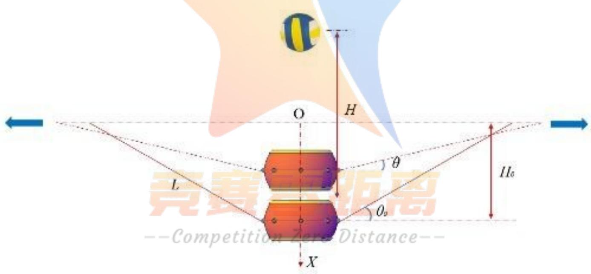  
Figure1: 同心鼓与排球碰撞示意图

为了更合理地简化碰撞模型，假设队员从拉绳到同心鼓与排球发生碰撞前，施加在绳子上的力的大小是恒定的，且不考虑绳子的重力，则由牛顿第二定律 $\Sigma { \vec { F } } = M { \vec { a } }$ 可得：

$$
- n \cdot F _ { 0 } \sin \theta + M g = M a
$$

即

$$
\frac { d ^ { 2 } x } { d t ^ { 2 } } = a = \frac { - n F \sin \theta + M g } { M } = g - \frac { n F \sin \theta } { M }
$$

由此，可以建立同心鼓的坐标x关于时间t的二阶微分方程，易知初始时刻同心鼓的坐标为 $H _ { 0 }$ ，速度

$v _ { 0 } = 0$ ，即

$$
\begin{array} { r } { \left\{ \begin{array} { l l } { \displaystyle \frac { d ^ { 2 } x } { d t ^ { 2 } } = g - \frac { n F } { M L } x , } \\ { x ( 0 ) = H _ { 0 } = \frac { M g L } { n F _ { 0 } } , } \\ { x ^ { \prime } ( 0 ) = v _ { 0 } = 0 . } \end{array} \right. } \end{array}
$$

上述含有的初值的二阶常系数微分方程具有其理论解，可解得同心鼓的位置随时间的关系函数 $x ( t )$ 为

$$
x ( t ) = \frac { M g L } { n F } + \frac { M g L } { n F F _ { 0 } } ( F - F _ { 0 } ) \cdot \cos ( \sqrt { \frac { n F } { M L } } t )\tag{1}
$$

对上式求导，可得同心鼓的运动速度随时间的关系函数v(t)为

$$
v ( t ) = \frac { d x } { d t } = - \frac { g } { F _ { 0 } } \cdot \sqrt { \frac { n F } { M L } } ( F - F _ { 0 } ) \cdot \sin ( \sqrt { \frac { n F } { M L } } t )\tag{2}
$$

其同心鼓运动随时间的关系图可以由下图表示

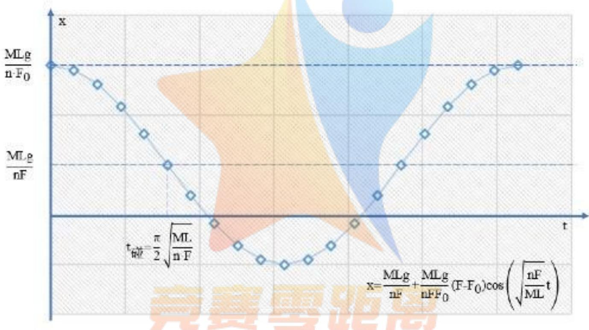  
Figmre 2: 周心鼓坐标与时间关系图

考虑到实际情况，若在同心鼓的速度最大时，同心鼓与排球发生碰撞，队员可在用力最小的情况下使球达到尽可能高的高度。因此，笔者假设在同心鼓的速度最大时，鼓与球发生碰撞，即碰撞时刻为$t _ { c r a s h } = \frac { \pi } { 2 } \sqrt { \frac { n F } { M L } }$ ，此时

$$
v _ { c r a s h } = \sqrt { \frac { n F } { M L } } \cdot \frac { g } { F _ { 0 } } \cdot ( F - F _ { 0 } )
$$

当同心鼓与排球发生碰撞时，考虑到同心鼓与排球碰撞时会发生能量损失，需引入恢复系数的概念，碰撞恢复系数是碰撞前后两物体接触点的法向相对分离速度与法向相对接近速度之比，即

$$
e = \left| { \frac { v _ { 1 } ^ { \prime } - v _ { 2 } ^ { \prime } } { v _ { 1 } - v _ { 2 } } } \right|
$$

根据同 $\therefore \dot { }$ 鼓及排球的材料性质，碰撞十分接近弹性碰撞，可假设 $e = 0 . 9 5$ 。同心鼓的质量为M，碰撞前后的速度分别为 $v _ { 1 }$ 、 $\boldsymbol { v } _ { 1 } ^ { \prime }$ 排球的质量为m，碰撞前后的速度分别为 $v _ { 2 }$ 、 $v _ { 2 } ^ { \prime }$ ，故可联立方程：

$$
\left\{ \begin{array} { l l } { v _ { 1 } ^ { \prime } - v _ { 2 } ^ { \prime } = - e \cdot ( v _ { 1 } - v _ { 2 } ) , } \\ { M v _ { 1 } + m v _ { 2 } = M v _ { 1 } ^ { \prime } + m v _ { 2 } ^ { \prime } . } \end{array} \right.
$$

易得到碰撞后同心鼓和排球的速度 $v _ { 1 } ^ { \prime } \cdot v _ { 2 } ^ { \prime }$ 分别如下

$$
\begin{array} { r } { \left\{ v _ { 1 } ^ { \prime } = \frac { ( m _ { 1 } - e m _ { 2 } ) v _ { 1 } + ( 1 + e ) m _ { 2 } v _ { 2 } } { m _ { 1 } + m _ { 2 } } , \right. } \\ { v _ { 2 } ^ { \prime } = \frac { ( m _ { 2 } - e m _ { 1 } ) v _ { 2 } + ( 1 + e ) m _ { 1 } v _ { 1 } } { m _ { 1 } + m _ { 2 } } . } \end{array}
$$

笔者认为队员对同心鼓施加作用力的过程可简化以下四个阶段：第一阶段 $( O - t _ { 1 } )$ 为使同心鼓加速上升阶段，队员施加的恒力 $F _ { \mathbf { : } }$ 第二阶段 $\left( t _ { 1 } - t _ { 2 } \right)$ 为碰撞完成后队员对鼓施加非线性变化的力；第三阶段 $( t _ { 2 } - t _ { 2 } + \Delta t )$ 为同心鼓到达最低点后，队员为了使同心鼓停止运动的突加力，其作用时间 $\Delta t$ 极短，这一阶段可忽略不计；第四阶段 $( t _ { 2 } - t _ { 3 } )$ 为同心鼓面位于最低处时，为了平衡同心鼓的重力而施加的恒力 $F _ { 0 }$ ，故整个阶段如下图示

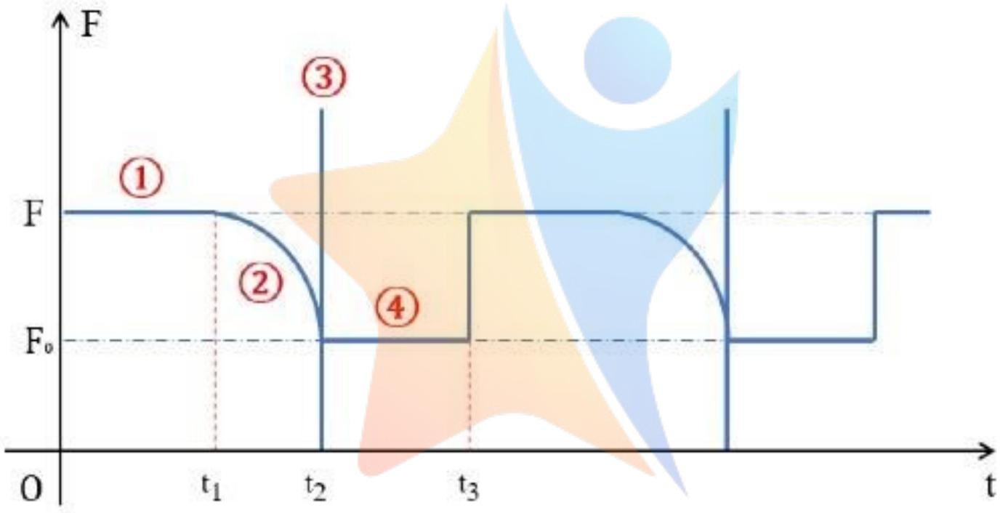  
Figure 3: 各队员拉绳端拉力周期变化示意图

因此，为了达到最佳的协作策略，需保证每个队员在用力较小的情况下，尽可能减小周期运动的频率，使队员达到一个较为舒适的状态。已知排球与同心鼓发生碰撞时， $v _ { 1 } = { \sqrt { 2 g H } } , v _ { 2 } = v _ { c r a s h }$ 。为了得到稳定的颠球高度，需保证碰撞过程仅改变排球的速度方向，而不改变其大小，即 $v _ { 1 } ^ { \prime } = - v _ { 1 }$ 。进而可建立H、 $F _ { 0 }$ 、 $F$ 之间的关系 $H = H ( F _ { 0 } , F )$ ，即

$$
( 1 - \frac { 2 m _ { 1 } } { ( 1 + e ) m _ { 2 } } ) \sqrt { 2 g H } = \sqrt { \frac { M L } { n F } } \cdot \frac { g } { F _ { 0 } } ( F - F _ { 0 } )
$$

接下来我们分析一下该情形下的最优策略，我们希望在每个碰撞周期中所发生的总能量的损失应尽可能地小，参考文献[1]，我们可以令E表示一次碰撞同心鼓与排球体系总能量的损失，则

$$
E = { \frac { 1 } { 2 } } m _ { 1 } v _ { 1 } ^ { \prime 2 } + { \frac { 1 } { 2 } } m _ { 2 } v _ { 2 } ^ { \prime 2 } - { \frac { 1 } { 2 } } m _ { 1 } v _ { 1 } ^ { 2 } - { \frac { 1 } { 2 } } m _ { 2 } v _ { 2 } ^ { 2 } = { \frac { m _ { 1 } m _ { 2 } } { 2 ( m _ { 1 } + m _ { 2 } ) ^ { 2 } } } ( 1 - e ^ { 2 } ) ( v _ { 1 } - v _ { 2 } ) ^ { 2 }
$$

即有

$$
E = \frac { 1 } { 2 } m u ^ { 2 } ( 1 - e ^ { 2 } )
$$

在颠球上下运动的一个周期内，假设参赛队员所提供的能量全部用以同心鼓与排球发生碰撞时所消耗的能量。因此，为了达到最佳的协作策略，需保证每个队员消耗的能量较小，笔者认为将每位队员在一个周期内所用的功率P作为评判指标较为合理可行，即

$$
P = { \frac { E } { n \cdot T } }
$$

由于现实中，不同参赛队员的用力偏好差异性极大，即一些参赛队员可能偏向于每次对同心鼓作用较小的力，但是在此情况下会使用力的频率相应增大；但是另外一些参赛队员可能更偏向于每个作用周期内，用力的频率较小，但是在此情况下每次需要对同心鼓作用较大的力。由此可见，队员的每次对同心鼓作用力的大小及频率为相互制约的关系，但是对于给定的用力的大小（或者用力的频率）的情况，可通过上文所描述的公式求得相对应的用力的频率（或者用力的大小)。题设要求排球每次被颠起的高度应离开鼓面40cm以上，通过逻辑推理易知，在给定的参赛队员所偏好的用力的大小及用力的频率下，颠球高度越低，参赛队员所需的能量越小，即在该策略下，颠球高度40cm为佳。

## 5 鼓面小角度倾斜求解之刚体定点旋转模型

## 5.1模型分析

在现实情形中，队员发力时机和力度都存在一定误差，鼓面可能会出现倾斜而使球的位置发生偏移，题目要求我们不同队员出现失误的情况下，求出鼓面的倾斜角度。

假设同心鼓为刚体，本题目的重点是计算得到不同大小与不同时机的力作用下，同心鼓在空间中的姿态。刚体在空间中的大角度转动不具有交换性，但是空间小角度转动与次序无关，因此本题可将同心鼓的转动分解成多个方向的转动，再进行叠加求和。每位队员用力相等时，同心鼓上下运动而不会发生偏转；当队员在同心鼓上作用较大的力时，则所有的力对转动点的矩不再能够平衡，鼓面将发生转动：当队员作用力提早0.1s施加，则前0.1s内，队员对同心鼓的作用可视作提早施力的队员作用较大的力，而其他队员仍保持用以平衡同心鼓重力的恒力F0，使同心鼓在零时刻后以一个初始偏转角进行运动。因此，在第一问所建立的模型基础上，可通过同心鼓的运动微分方程，得到不同工况下0.1s时同心鼓鼓面的倾斜角度。

## 5.2模型建立与求解--Competition Zero Distance--

根据欧拉提出欧拉旋转定理(Euler'srotationtheorem)：刚体绕定点的任意有限转动可由绕过定点的某根轴的一次有限转动实现，即刚体绕过定点某根轴的一次有限转动可由绕定点的任意有限转动实现。因此，在第一问所建立的模型基础上，假设同心鼓仅有三个自由度，即沿Z轴方向的平动与绕X轴、Y轴转动。笔者将同心鼓两个方向上的转动设想为刚体的两次相继有限转动，即同心鼓从起始位置$( O - x _ { 0 } y _ { 0 } z _ { 0 } )$ 出发，先绕-Y轴转动α角到达 $( O - x _ { 1 } y _ { 1 } z _ { 1 } )$ ，再绕 X 轴转动 $\beta$ 角到达 $( O - x y z )$ 位置，则由三维空间坐标系变换，可得到同心鼓各次转动方向余弦矩阵分别为

$$
\begin{array} { r } { I _ { \alpha } = \left( \begin{array} { c c c } { \cos \alpha } & { 0 } & { \sin \alpha } \\ { 0 } & { 1 } & { 0 } \\ { - \sin \alpha } & { 0 } & { \cos \alpha } \end{array} \right) , \qquad I _ { \beta } = \left( \begin{array} { c c c } { 1 } & { 0 } & { 0 } \\ { 0 } & { \cos \beta } & { \sin \beta } \\ { 0 } & { - \sin \beta } & { \cos \beta } \end{array} \right) } \end{array}
$$

在空间坐标系中，刚体连续作两次有限转动后的方向余弦矩阵可由各次转动方向余弦矩阵的乘法运算确定。

$$
\begin{array} { r } { I _ { \alpha } \cdot I _ { \beta } = \left( \begin{array} { c c c } { \cos \alpha } & { - \sin \alpha \cos \beta } & { - \sin \alpha \cos \beta } \\ { 0 } & { \cos \beta } & { - \sin \beta } \\ { \sin \alpha } & { \sin \beta \cos \alpha } & { \cos \alpha \cos \beta } \end{array} \right) } \end{array}
$$

$$
I _ { \beta } \cdot I _ { \alpha } = \left( \begin{array} { c c c } { { \cos \alpha } } & { { 0 } } & { { - \sin \alpha } } \\ { { - \sin \alpha \sin \beta } } & { { \cos \beta } } & { { - \sin \beta \cos \alpha } } \\ { { \sin \alpha \cos \beta } } & { { \sin \beta } } & { { \cos \alpha \cos \beta } } \end{array} \right)
$$

由于矩阵乘积不满足交换律，因此两次转动后的姿态与转动顺序有关。但是在0.1s内，同 $^ { \ast }$ 鼓的转角 $\alpha \cdot$ e $\beta$ 都为无限小量，无限小转动与顺序无关，具体情形如下图所示

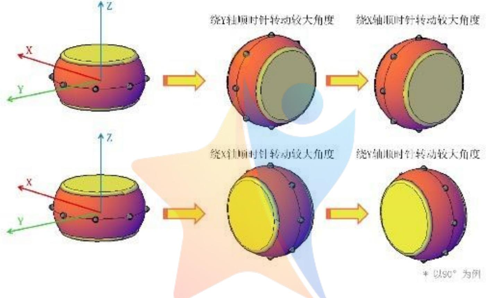

Figure 4: 同心鼓大角度转动情况演示  
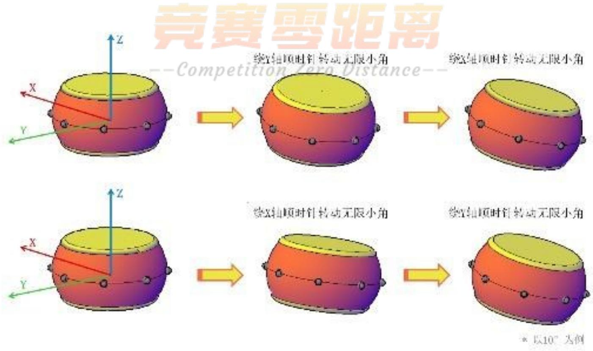  
Figure5: 同心鼓无限小角度转动情况演示

由此，可利用矢量的加法计算两次转动的结果。省略二阶小量，可将同 $\dot { \bar { \mathbf { \psi } } } _ { \mathrm { c } }$ 鼓转动的余弦矩阵 $\left[ A \right]$ 简化为

$$
A = I _ { \beta } \cdot I _ { \alpha } = I _ { \alpha } \cdot I _ { \beta } = \left( \begin{array} { c c c } { { \cos \alpha } } & { { 0 } } & { { - \sin \alpha } } \\ { { 0 } } & { { \cos \beta } } & { { - \sin \beta } } \\ { { \sin \alpha } } & { { \sin \beta } } & { { \cos \alpha \cos \beta } } \end{array} \right)
$$

采用前面所述的水平拉绳团队协作策略，当参赛队员握住绳端并水平拉动时，恒力F会随着同心鼓鼓面上升而愈发趋于水平方向，在该合作策略下，结合上述刚体在微小转动时的空间转动可交换的性能，通过 $\alpha \cdot$ $\beta$ 两个状态量来描述鼓面的法相量的倾角 $\gamma$

由此解得 $\alpha \cdot$ $\beta ,$ 由上述旋转变换公式，可得同心鼓与水平面的夹角 $\gamma$ 为

$$
\gamma = \arcsin ( { \frac { \sqrt { \sin ^ { 2 } \alpha + \sin ^ { 2 } \beta } } { \sqrt { \sin ^ { 2 } \alpha + \sin ^ { 2 } \beta + \cos ^ { 2 } \alpha \cos ^ { 2 } \beta } } } ) \approx \arcsin ( { \sqrt { \sin ^ { 2 } \alpha + \sin ^ { 2 } \beta } } )
$$

对同 $\therefore \dot { \operatorname { \lrcorner } }$ 鼓整体做受力分析，其中同心鼓所受的总弯矩可由 $\overrightarrow { M _ { 0 } } = \sum ( \overrightarrow { r _ { i } } \times \overrightarrow { F _ { i } } )$ 得到因此，同心鼓在X、Y、Z三个自由度方向上的运动可由微分方程表示为

$$
\left\{ \begin{array} { l l } { \displaystyle \frac { d ^ { 2 } x } { d t ^ { 2 } } = g - \frac { \sum \overrightarrow { F _ { i z } } } { M } , } \\ { \displaystyle \frac { d ^ { 2 } \alpha } { d t ^ { 2 } } = - \frac { 1 } { J y } \sum \overrightarrow { M _ { y } ^ { \prime } } , } \\ { \displaystyle \frac { d ^ { 2 } \beta } { d t ^ { 2 } } = \frac { 1 } { J x } \sum \overrightarrow { M _ { x } ^ { \prime } } , } \end{array} \right.
$$

同心鼓的绕x和y轴的转动惯量的算法，由于同心鼓的对称性，则有： $J _ { x } = J _ { y }$ 。将同心鼓的外形抽象成为一个空心的圆柱，且圆柱壁的厚度相对于同心鼓的半径来说相对较小，因此鼓的质量集中在一个圆柱薄壁上，厚度不计。则质量密度为

$$
\sigma = \frac { M } { 2 \pi r H }
$$

则建立如上图示坐标系，则转动惯量 $\begin{array} { r } { J _ { x } = \int \sigma l ^ { 2 } d A , } \end{array}$ l 为对应单位质量点到转轴的距离。即

$$
J _ { x } = \sigma \int _ { - \frac { H } { 2 } ( \zeta \mathcal { O } ) } ^ { \frac { H } { 2 } } d z \int _ { 0 / \mathcal { O } } ^ { 2 \pi } ( r ^ { 2 } \sin ^ { 2 } \theta + z ^ { 2 } ) r d \theta = \frac { 1 } { 2 } M r ^ { 2 } + \frac { 1 } { 1 2 } M H ^ { 2 }
$$

对于所求得的 $J _ { x }$ ，我们可以理解为在x轴方向所产生的力矩对应的过鼓心的转动惯量，即同心鼓被视作在为绕该轴进行的定轴旋转，同理，对于 $J _ { y }$ 和y轴也是如此，我们可以做出如下侧视图与立体图加以理解。

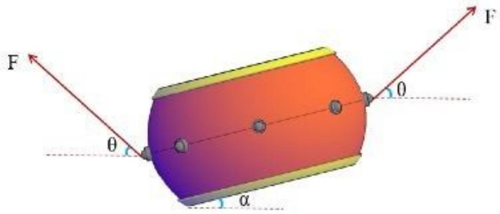  
Figure6:同心鼓视作小角度定轴转动侧视图

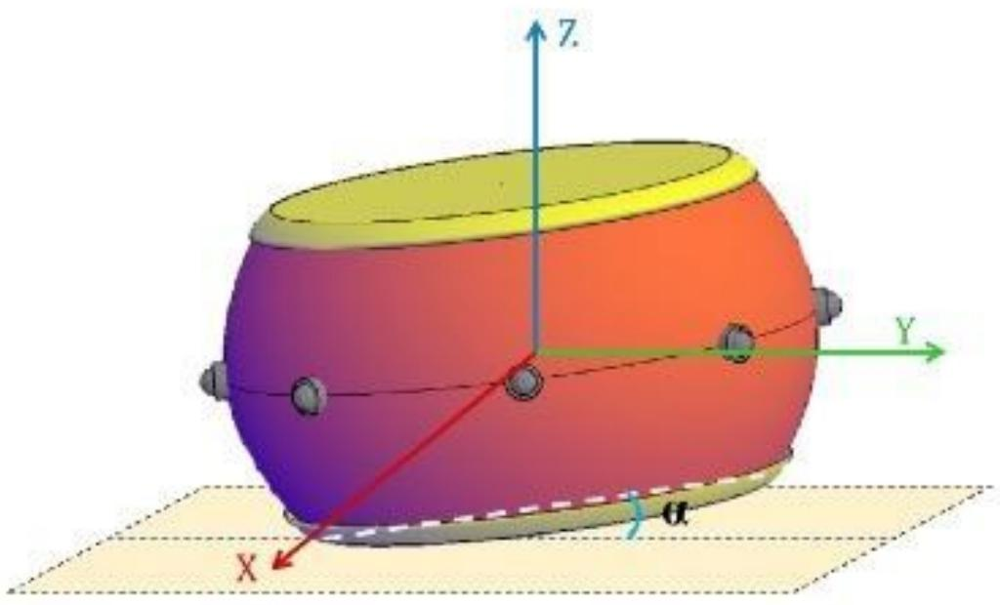  
Figure7: 同心鼓双向小角度定轴转动立体透视图

随后，我们对于已经列出的二次微分方程组，利用MATLAB中ode45 命令对上述微分方程组进行求解，由前面所论述的在小倾角的情况下，我可以将空间的任意转动看成由两个相对独立的转角α和β表示。故上述方程式并不耦合，可以分别求解也可以一起求解。

引入向量的方法，可以不用分析由于九种工况带来的空间几何上分析的复杂度，仅有有向向量完成空间方向的描述，进而大大减少了运算量，简化模型的同时，也让该模型算法可以应对多种发力时机与用力大小的组合情况。将九种情况统一求解后得到以下表格的结果。

Table1:9种不同的情况下，0.1s时鼓面的倾斜角度一览表
<table><tr><td rowspan=1 colspan=1>序号</td><td rowspan=1 colspan=1>用力参数</td><td rowspan=1 colspan=1>1</td><td rowspan=1 colspan=1>2</td><td rowspan=1 colspan=1>3</td><td rowspan=1 colspan=1>4</td><td rowspan=1 colspan=1>5</td><td rowspan=1 colspan=1>6</td><td rowspan=1 colspan=1>7</td><td rowspan=1 colspan=1>8</td><td rowspan=1 colspan=1>鼓面倾角（度）</td></tr><tr><td rowspan=1 colspan=1>1</td><td rowspan=1 colspan=1>发力时机用力大小</td><td rowspan=1 colspan=1>090</td><td rowspan=1 colspan=1>080</td><td rowspan=1 colspan=1>080</td><td rowspan=1 colspan=1>080</td><td rowspan=1 colspan=1>080</td><td rowspan=1 colspan=1>080</td><td rowspan=1 colspan=1>080</td><td rowspan=1 colspan=1>080</td><td rowspan=1 colspan=1>0.2124°</td></tr><tr><td rowspan=2 colspan=1>2</td><td rowspan=2 colspan=1>发力时机用力大小</td><td rowspan=2 colspan=1>090</td><td rowspan=2 colspan=1>090</td><td rowspan=1 colspan=1>0</td><td rowspan=2 colspan=1>080</td><td rowspan=2 colspan=1>080</td><td rowspan=2 colspan=1>80</td><td rowspan=2 colspan=1>080</td><td rowspan=2 colspan=1>080</td><td rowspan=2 colspan=1>0.3855°</td></tr><tr><td rowspan=1 colspan=1>80</td></tr><tr><td rowspan=1 colspan=1>3</td><td rowspan=1 colspan=1>发力时机用力大小</td><td rowspan=1 colspan=1>090</td><td rowspan=1 colspan=1>080</td><td rowspan=1 colspan=1>080</td><td rowspan=1 colspan=1>090</td><td rowspan=1 colspan=1>080</td><td rowspan=1 colspan=1>080</td><td rowspan=1 colspan=1>080</td><td rowspan=1 colspan=1>080</td><td rowspan=1 colspan=1>0.1649°</td></tr><tr><td rowspan=1 colspan=1>4</td><td rowspan=1 colspan=1>发力时机用力大小</td><td rowspan=1 colspan=1>-0.180</td><td rowspan=1 colspan=1>80</td><td rowspan=1 colspan=1>t9ti80</td><td rowspan=1 colspan=1>n0Zeon80</td><td rowspan=1 colspan=1>0i80</td><td rowspan=1 colspan=1>80</td><td rowspan=1 colspan=1>080</td><td rowspan=1 colspan=1>080</td><td rowspan=1 colspan=1>0.2247°</td></tr><tr><td rowspan=1 colspan=1>5</td><td rowspan=1 colspan=1>发力时机用力大小</td><td rowspan=1 colspan=1>-0.180</td><td rowspan=1 colspan=1>-0.180</td><td rowspan=1 colspan=1>080</td><td rowspan=1 colspan=1>080</td><td rowspan=1 colspan=1>080</td><td rowspan=1 colspan=1>080</td><td rowspan=1 colspan=1>080</td><td rowspan=1 colspan=1>080</td><td rowspan=1 colspan=1>0.4094°</td></tr><tr><td rowspan=1 colspan=1>6</td><td rowspan=1 colspan=1>发力时机用力大小</td><td rowspan=1 colspan=1>-0.180</td><td rowspan=1 colspan=1>080</td><td rowspan=1 colspan=1>080</td><td rowspan=1 colspan=1>-0.180</td><td rowspan=1 colspan=1>080</td><td rowspan=1 colspan=1>080</td><td rowspan=1 colspan=1>080</td><td rowspan=1 colspan=1>080</td><td rowspan=1 colspan=1>0.1738°</td></tr><tr><td rowspan=1 colspan=1>7</td><td rowspan=1 colspan=1>发力时机用力大小</td><td rowspan=1 colspan=1>-0.190</td><td rowspan=1 colspan=1>080</td><td rowspan=1 colspan=1>080</td><td rowspan=1 colspan=1>080</td><td rowspan=1 colspan=1>080</td><td rowspan=1 colspan=1>080</td><td rowspan=1 colspan=1>080</td><td rowspan=1 colspan=1>080</td><td rowspan=1 colspan=1>0.2157°</td></tr><tr><td rowspan=1 colspan=1>8</td><td rowspan=1 colspan=1>发力时机用力大小</td><td rowspan=1 colspan=1>090</td><td rowspan=1 colspan=1>-0.180</td><td rowspan=1 colspan=1>080</td><td rowspan=1 colspan=1>090</td><td rowspan=1 colspan=1>-0.180</td><td rowspan=1 colspan=1>080</td><td rowspan=1 colspan=1>080</td><td rowspan=1 colspan=1>080</td><td rowspan=1 colspan=1>0.1354°</td></tr><tr><td rowspan=1 colspan=1>9</td><td rowspan=1 colspan=1>发力时机用力大小</td><td rowspan=1 colspan=1>090</td><td rowspan=1 colspan=1>080</td><td rowspan=1 colspan=1>080</td><td rowspan=1 colspan=1>090</td><td rowspan=1 colspan=1>-0.180</td><td rowspan=1 colspan=1>080</td><td rowspan=1 colspan=1>080</td><td rowspan=1 colspan=1>-0.180</td><td rowspan=1 colspan=1>0.3356°</td></tr></table>

## 5.3 求解结果分析

为了方便论述与理解，我们对8根绳子按逆时针顺序进行标号，以1号绳为平面坐标系的X轴，其具体示意图如下所示：

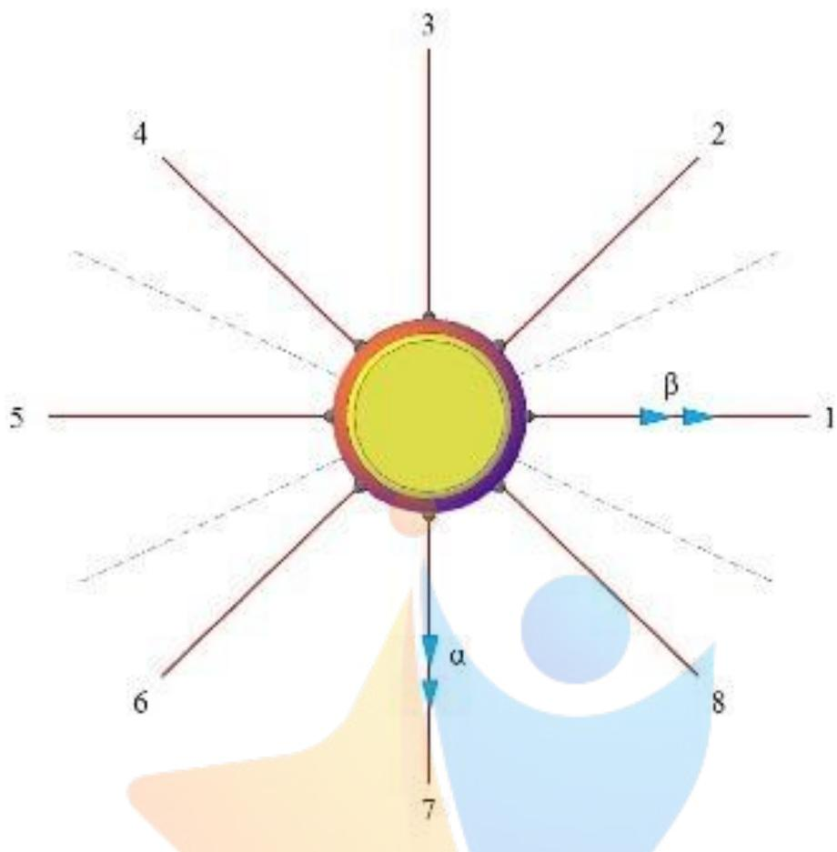  
Figure 8: 同心鼓与绳具体方位示意图

基于上图所规定的各物理量的正方向，利用MATLAB的作图工具，我们可以得到9种情况下同心鼓的各运动参数 $( x , \alpha , \beta )$ 随时间的变化曲线，如下所示：

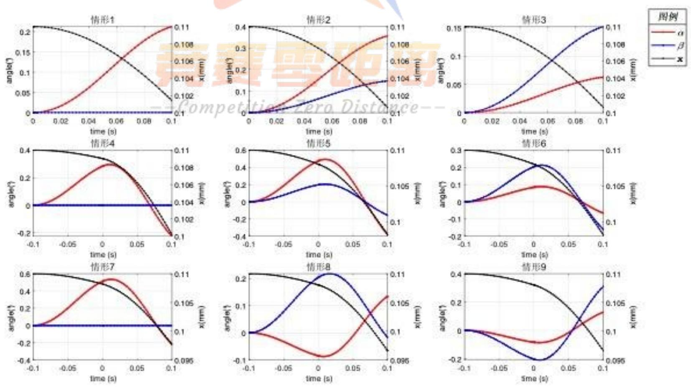  
Figure9:9种情况下的同心鼓各运动参数随时间的变化示意图

对于前文所求得不同工况下的鼓面倾斜角度，结合MATLAB所求各个情况下的同心鼓的各运动参数随时间的变化曲线，可做如下分析：

情形1：所有队员均从零时刻开始用力，但是1号队员用力大小为90N，其余队员用力均为80N。此时，鼓仅发生绕 $_ \alpha$ 方向的转动，而不发生 $\beta$ 方向的转动。α角将周期性变化，在 $0 - 0 . 1 s$ 内，时间较短， $\alpha$ 角将一直增大，而角一直保持为零。结果合理。

情形2：所有队员均从零时刻开始用力，但是1号、2号队员用力大小为90N，其余队员用力均为$8 0 N _ { ☉ }$ 。此时，鼓将在A方向受更大的合力，即，鼓将绕C轴方向发生转动。因此，鼓绕 $_ \alpha$ 方向转动的角度更大，而绕 $\beta$ 方向发生转动的角度较小。α角、 $\beta$ 角都将周期性变化，在0—0.1s内，时间较短，$_ \alpha$ 角、 $\beta$ 角将逐渐增大。结果合理。

情形3：所有队员均从零时刻开始用力，但是1号、4号队员用力大小为90N，其余队员用力均为80N。此时，鼓将在D方向受更大的合力，即，鼓将绕B轴方向发生转动。因此，鼓绕 $\beta$ 方向转动的角度更大，而绕α方向发生转动的角度较小。α角、 $\beta$ 角都将周期性变化，在0-0.1s内，时间较短，α角、 $\beta$ 角将逐渐增大。结果合理。

情形4：所有队员均以恒力80N施加在同心鼓上，但是1号队员用力时间提前0.1s，其余队员均从零时刻开始用力。在-0.1s-0s内，同心鼓在1方向上受到更大的力，即，鼓将绕α轴方向发生转动。在零时刻后，鼓面有一个初始的偏转角，此时除1号以外其余的队员突加更大的力，使同心鼓竖向的加速度变大，且α角也将开始减小，进入周期变化阶段，而 $\beta$ 角一直保持为零。结果合理。

情形5：所有队员均以恒力80N施加在同心鼓上，但是1号、2号队员用力时间提前0.1s，其余队员均从零时刻开始用力。在 $- 0 . 1 s - 0 s$ 内，同心鼓在 $A$ 方向上受到更大的力，即，鼓将绕C轴方向发生转动。因此，鼓绕 $\alpha$ 方向转动的角度更大，而绕 $\beta$ 方向发生转动的角度较小。在零时刻后，鼓面有一个初始的偏转角，此时除1号、2号以外其余的队员突加更大的力，使同心鼓竖向的加速度变大，且α角、β角也将开始减小，进入周期变化阶段。结果合理。

情形 ${ \mathfrak { G } } :$ 所有队员均以恒力80N施加在同心鼓上，但是1号、4号队员用力时间提前0.1s，其余队员均从零时刻开始用力。在-0.1s-0s内，同心鼓在D方向上受到更大的力，即，鼓将绕B轴方向发生转动。因此，鼓绕 $\beta$ 方向转动的角度更大，而绕α方向发生转动的角度较小。在零时刻后，鼓面有一个初始的偏转角，此时除1号、4号以外其余的队员突加更大的力，使同心鼓竖向的加速度变大，且 $_ \alpha$ 角、 $\beta$ 角也将开始减小，进入周期变化阶段。结果合理。 1

情形7：1号队员用力时间提前0.1s在同心鼓上施加恒力 $9 0 N$ ，除1号以外其余的队员均从零时刻开始对同心鼓施加恒力80N。在 $- 0 . 1 s - 0 s$ 内，同心鼓在1方向上受到更大的力，即，鼓将绕 $_ \alpha$ 轴方向发生转动。因此，鼓绕 $\beta$ 方向转动的角度更大，而绕 $\scriptstyle { \alpha }$ 方向发生转动的角度较小。在零时刻后，鼓面有一个初始的偏转角，且该偏转角比情形4的偏转角更大。此时，除1号以外其余的队员突加更大的力，使同心鼓竖向的加速度变大，且α角也将开始减小，进入周期变化阶段，而 $\beta$ 角一直保持为零。结果合理。

情形 $\mathbf { 8 : }$ 在-0.1s-0s内，2号、5号队员提早对同心鼓施加80N的力，其余队员保持 $F _ { 0 }$ 不变。在此阶段，同心鼓在C方向上受到更大的力，即，鼓将绕A轴方向发生转动，由此时的转向可知，α角负向增加， $\beta$ 角正向增加。在零时刻后，1号、4号队员对同 $\dot { \operatorname { \lrcorner } }$ 鼓施加恒力90N，其余队员用力均为80N，同心鼓在D方向上受到更大的力，即，鼓将绕B轴方向发生转动。由于此时同心鼓存在一个负向的α偏转角及正向的 $\beta$ 偏转角， $_ \alpha$ 角将正向增加进入周期变化阶段， $\beta$ 角将反向增加进入周期阶段。结果合理。

情形9：在-0.1s-0s内，5号、8号队员提早对同心鼓施加80N的力，其余队员保持 $F _ { 0 }$ 不变。在此阶段，同心鼓在D方向上受到更大的力，即，鼓将绕B轴方向发生转动，由此时的转向可知，α角、 $\beta$ 角均负向增加。在零时刻后，1号、4号队员对同心鼓施加恒力90N，其余队员用力均为80N，同心鼓在D方向上受到更大的力，即，鼓将绕B轴方向发生转动。由于此时同心鼓存在负向的 $_ \alpha$ 偏转角及 $\beta$ 偏转角，此后 $_ \alpha$ 角、 $\beta$ 角均将正向增加进入周期变化。结果合理。

## 6非理想状态下水平拉绳团队协作策略的调整方法

## 6.1模型分析与求解

根据问题一的分析及简化后的物理模型，由于实际过程中的诸多因素，参赛队员的用力大小及时机无法精准控制，会出现作用力数值及作用时机上的偏差。进而导致简化模型中的物理过程发生变化，即同心鼓在做上升运动的过程中可能会出现倾斜，进而导致排球被颠起后的轨迹发生变化，由原来的竖直上抛运动变为斜上抛运动。与此同时，作用力的大小不同还将对同心鼓的质心产生水平方向的加速度。综合上述两种不确定因素，要求参赛人员不但能够提供竖直方向的位移和速度，以补偿颠球过程中的能量损耗，而且需要使鼓面尽量保持水平，并适当旋转一定角度以调整倾斜排球的运动轨迹。参赛人员需要做出足够迅速的水平移动，使排球能够达到指定颠球高度的游戏规则。

## 6.1.1 调整点1：所有参赛队员需要根据实际倾斜状况改变拉力大小

由于现实情况中，参赛队员无法做到发力时机及大小的一致，必然会导致鼓面发生绕自身形心平面外旋转的现象，使鼓面不再水平，而产生一定大小的夹角。当排球竖直下落发生碰撞时，必为斜上抛运动，从而使得排球的运动不在竖直线上，产生不可控因素，增大了项目终止的风险。除此之外，由于发力大小无法精准控，当参赛团队输入同心鼓与排球体系的能量比碰撞时体系耗散的能量小，颠球的高度势必降低。经过几次颠球周期后，颠球高度便会降低到危险的边界区，因此也增大了该项目的终止风险。

以问题二中的数据为例，当鼓面静止时，离初始绳子水平时下降11cm，即 $H _ { 0 } = 0 . 1 1 m , L = 1 . 7 m$ 带入公式(1) 可知， $F _ { 0 } = 6 8 . 1 5 4 5 N$ ，由碰撞过程解得 $v _ { 2 } = 0 . 2 8 7 2 m / s$ ，而由上升速度公式(2)：解得$v _ { c r a s h } = 0 . 1 6 9 1 m / s$ ，则 $v _ { 2 } < v _ { c r a s h }$ ，那么排球下一次弹起的高度将小于40cm，项目终止。因此所有参赛队员应同时增大施加在绳端的力，以确保同心鼓有足够的加速度。为了降低因鼓面倾斜以及颠球高度降低而引起的不可控因素的风险，参赛队员需要根据鼓面的速度和角度及时调整鼓面状态，所有参赛队员需要根据实际鼓面状况改变各自的发力大小，改正排球的运动轨迹，并保证排球的颠起高度超过最小高度要求。其拉绳改变鼓面倾角的情形可以由下图所表示：吃

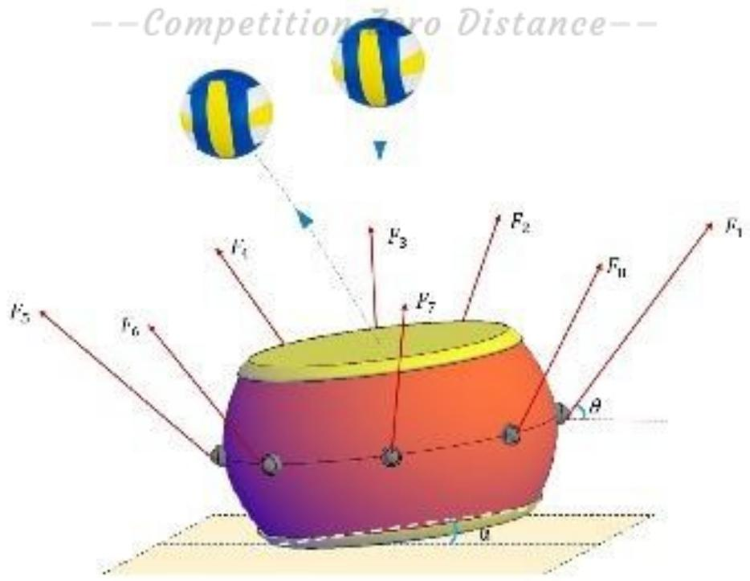  
Figure 10: 同心鼓视作小角度定轴转动侧视图

## 6.1.2 调整点2：所有参赛队员需根据排球的斜抛方向和角度，合理调整鼓面倾斜状态

根据调整点1中所述，当排球产生斜抛运动后，若参赛队员仅将鼓面调整为水平方向，虽然有一定的非弹性碰撞引起的能量损耗，但排球二次碰撞后，必然仍会有水平方向的速度分量，使得排球的颠球高度进一步降低的同时，排球还会沿水平的同一方向继续产生一段位移，给下一次颠球增加了更大的操作难度。当诸多不利因素累积到一定程度后，便会导致项目的终止。

因此，所有参赛队员需根据排球的斜抛方向及角度，合理的调整鼓面的倾斜状态。将排球逐渐从斜抛运动调整为竖直方向的上抛和自由落体运动。假设某次排球从最高点竖直下落，并与上升鼓面发生碰撞，此时鼓面的倾角为α，能量损失较小可忽略不计，且颠球高度基本不变，则 $v _ { 1 } = v _ { 1 } ^ { \prime }$

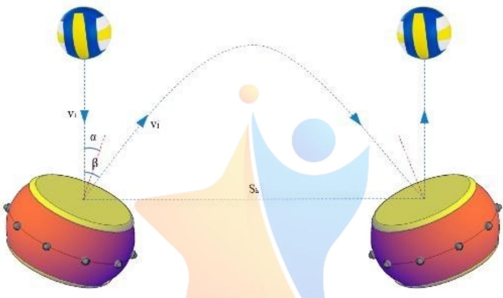  
Figure 11: 鼓面调整排球运动方向示意图

沿同心鼓鼓面建立坐标系 $X - O - Z .$ ，则可列出沿鼓面方向的动量守恒，即：

$$
\begin{array} { r } { \left\{ { m v _ { 1 } \sin ( \alpha ) = m v _ { 1 } ^ { \prime } \sin ( \beta - \alpha ) } , \right. } \\ { \left. { v _ { 1 / } } \right| _ { \ell = \ell _ { 1 } ^ { \prime } : i o n \mathrm { ~ } Z e r o \ D i s t a n c } } \end{array}
$$

由上述公式可解得： $\alpha = \beta - \alpha$ ，即 $\alpha = 0 . 5 \beta$ 随后，排球沿着 $_ 1 ^ { \prime }$ 做斜上抛运动，设此时的水平运动为 $v _ { h }$ ，竖直方向运动速度为 $v _ { v } ,$ 上下运动总运动时间为t，由简单的落体运动规律有以下关系式

$$
\begin{array} { r } { \left\{ { \begin{array} { l } { v _ { h } = v _ { 1 } ^ { \prime } \sin ( \alpha ^ { \prime } ) , } \\ { v _ { v } = v _ { 1 } ^ { \prime } \cos ( \alpha ^ { \prime } ) , } \\ { 2 v _ { v } = g t . } \end{array} } \right. } \end{array}
$$

易求排球的水平运动距离为

$$
s _ { h } = { \frac { 2 v _ { 1 } ^ { \prime } \sin \alpha ^ { \prime } \cos \alpha ^ { \prime } } { g } }
$$

现实情况中，当力控制较为妥当时，鼓的倾角并不会太大，即 $\alpha$ 较小。此时上抛运动在初速度不太大的情况下，近似为一条直线，设球弹起后与相对竖直方向的夹角为 $\beta ,$ 由几何关系易得： $\beta = 2 \alpha ;$ 根据运动的对称性，当排球下一次与鼓面发生碰撞时，相对竖直方向的夹角仍然为 $\beta ,$ 于是，若参赛队员

能够精准控制发力大小及时机，只需将同心鼓的角度反方向倾斜α角度，排球便可在下一次颠球时回到竖直状态。

## 6.1.3 调整点3:所有参赛队员需根据实际状况做出水平方向上的调整

由于现实情况中，参赛队员的发力大小无法完全相同，势必会产生无法预测的水平方向质心加速度，进而使鼓面产生水平移动的趋势。但因为参赛队员的发力时间有限，这种趋势较小。另外，同心鼓受绳子数目及其长度的约束，其水平位移是一个极小量，可以由对边队员增大拉力的方法，将同心鼓的水平位移束缚在可控的范围之内。然而，当发力的时机不能准确把控时，必然会使同心鼓受到冲量矩的作用，使鼓面发生倾斜，进而导致排球的偏转。当鼓面的倾斜角度达到一定量时，排球的水平分量所引起的水平位移会超过鼓面的半径，从而无法实现下一次排球与同心鼓的碰撞，使项目终止。因此，所有参赛队员应根据实际状态中排球的水平运动，对排球的水平运动速度和碰撞点进行预判，在排球尚未落下时，通过团队人员的集体平动，迅速将同心鼓鼓心移动到碰撞点附近，如调整点2中所述，当鼓面倾角为时，若要下一次颠球时，仍让排球击中鼓心，则需要所有参赛队员在对应倾向移动 $s _ { h }$ 距离，进而保证项目的继续进行。 O

## 7 基于模拟退火算法的多目标协作策略模型

## 7.1 模型分析

由前三问的分析与求解，对于每一次颠球过程，我们已经可以得到各队员不同的发力时机与力度对碰撞时鼓面倾斜角度的影响关系，即对于给定的初始条件（）每个队员的初始拉力 $F _ { 0 }$ ，加力拉绳时的发力时机t 与力度F)，我们即可计算出鼓面倾角的一组数值解 $( \alpha , \beta , \gamma ) = a n g l e ( { \cal F } _ { 0 } , { \bf t } , { \bf F } )$ 。由此，鼓的运动状态可以通过队员拉绳的初始条件来得到精确控制。

在该问题的情形中，由于鼓面产生了微小角度的偏移，导致在上一次颠球完成之后球偏离竖直方向弹出。为了将球的运动状态重新调整为竖直，我们则需要改变下一次颠球时鼓面的倾斜角度与方向以消除上一次颠球所造成的影响。根据前文所建立的模型，该问题即转化为由已知的鼓面碰撞时的运动状态反过来调整队员初始拉绳的发力时机与力度等初始条件，由此，队员的发力时机和力度需要调整到恰好使得在下一次颠球时鼓面的速度、位置、倾向与倾角满足要求，我们不妨视这种要求为对初始条件的一种约束，并以此建立以搜寻多人协作最佳拉绳方式为目标的多目标非线性优化问题。

要解决这种在初始条件受到限制的最优解的规划问题。首先要确定目标函数与约束条件。目标函数方面我们首先需要精准控制下一次颠球时鼓面的倾斜方向及大小，在满足这个条件的前提下，我们还希望团队协作的方式是容易操作且稳定的，那么就需要队员们拉绳时需要满足：(1)每位队员用力拉绳前后拉力的变化值应尽可能地小；(2)每位队员拉绳的力应尽可能地相同；(3)每位队员应尽可能地同时拉绳，即每位队员地用力时机应尽可能地一致；分析可知这些目标所蕴含的关系比较复杂，其中的关系不易用线性关系进行表达，因此无法用一般的线性规划方法解决该问题。

考虑约束条件：该问题的约束主要包括：(1)速度约束，鼓与球碰撞时的速度应保证碰撞之后球能够回到初始下落的高度;(2)时间约束，鼓在受拉上升至达到碰撞速度的时，球与鼓应恰好接触并发生碰撞;(3)软约束，某位队员作用在绳上的拉力不应太大或太小，某位队员拉绳的用力时机不宜过早或过晚等。

综上所述，我们希望生成一个合理且可行的团队协作方案，由于该优化问题中目标及约束条件均为复杂的非线性关系，我们决定采用现代优化算法来进行合理地解决。借助模拟退火算法的思想，我们希望产生一个可行的初始方案，并希望在其”邻域”内尝试寻找其他更优的解，其新方案由对原方案作一些合适的”扰动”来获取。我们通过一定的手段避免落入局部最优以及加入收敛判定，由此不断地进行迭代

搜索，并最终找到全局最优的解。

## 7.2 模型建立

## 7.2.1 约束分析与问题简化

前文已经定性地分析了该优化问题中的目标及其约束，接下来则需要定量地将它们一一进行表述，首先考虑鼓和球碰撞时所需要满足的运动状态，由第三问的分析可以发现，对于排球运动方向的1°偏移角，我们需要将鼓面产生一个倾向与排球水平运动方向相反的角度，其倾角 $\gamma = 0 . 5 ^ { \circ }$ ，我们以鼓面中心为中心，以排球运动方向的水平夹角为 $1 2 ^ { \circ }$ 的队员方向为X轴，建立右手系，以此可以得到鼓面法向量的精确坐标，如下图所示

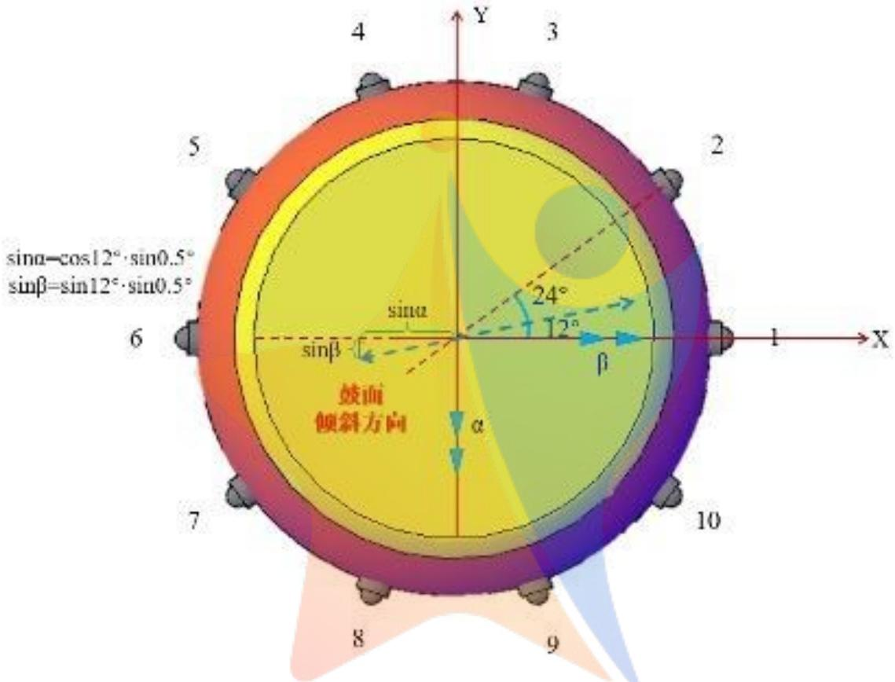  
Figure 12: 鼓面朝向法向量精确坐标求解图

则有倾斜后，鼓面的目标法向量 $\vec { n ^ { \prime } }$ 为

$$
{ \begin{array} { r } { { \overrightarrow { n } } ^ { \prime } = I _ { r o t a t e } \left( { \begin{array} { l } { 0 } \\ { 0 } \\ { 1 } \end{array} } \right) = \left( { \begin{array} { l } { - i \tan \alpha } \\ { - \sin \beta } \\ { \cos \alpha \cos \beta } \end{array} } \right) ^ { O } = \left( { \begin{array} { l } { - i \sin ( 0 . 5 ^ { \circ } ) \cdot \cos ( 1 2 ^ { \circ } ) } \\ { - \sin ( 0 . 5 ^ { \circ } ) \cdot \sin ( 1 2 ^ { \circ } ) } \\ { \cos ( 0 . 5 ^ { \circ } ) } \end{array} } \right) } \end{array} }
$$

由此可得目标转动角度值 $( \alpha _ { * } , \beta _ { * } )$ 为

$$
{ \binom { \alpha _ { * } } { \beta _ { * } } } = { \binom { \arcsin ( \sin ( 0 . 5 ^ { \circ } ) \cdot \cos ( 1 2 ^ { \circ } ) ) } { \arcsin ( \sin ( 0 . 5 ^ { \circ } ) \cdot \sin ( 1 2 ^ { \circ } ) ) } } = { \binom { 0 . 4 8 9 1 ^ { \circ } } { 0 . 1 1 5 7 ^ { \circ } } }
$$

同样地，由第一问所推得的碰撞公式，可得鼓在下一次碰撞时所需要达到的速度 $v _ { * }$ 为

$$
v _ { * } = { \frac { ( e m _ { 1 } - m _ { 2 } ) v _ { 1 } ^ { \prime } + ( 1 + e ) m _ { 2 } v _ { 2 } ^ { \prime } } { e ( m _ { 1 } + m _ { 2 } ) } } , \qquad \Re \in \Psi = v ^ { \prime } = \sqrt { 2 g H }
$$

要知道，我们所得到的模型是对于鼓的运动情况的一种数值解法，其结果与真实情况存在着一定的误差，并且想要通过调整初始参数以达到完全一致的结果，是非常难以完成的，因此我们对于鼓的最终碰撞时的运动形态不可能精确地控制地分毫不差，为了弱化精确控制角度及速度结果所带来的强约束，

我们允许鼓的最终运动形态 $( \alpha , \beta , v _ { c r a s h } ) ^ { T }$ 与 $( \alpha _ { * } , \beta _ { * } , v _ { * } ) ^ { T }$ 之间存在一定的误差，其相对误差 $e r r$ 应控制在 $1 0 ^ { - 3 }$ 以内。

## 7.2.2优化目标

1. 队员的用力拉绳时的用力大小平均值与初始拉力之差应可能小，因此记其差值为拉力突变因子$i n d _ { F }$ ，即

$$
i n d _ { F } = \frac { \overline { { \mathbf { F } } } - F _ { 0 } } { F _ { 0 } }
$$

2. 各队员发力大小之间不能有较大差异，我们用将F标准化后的方差作为发力差异因子 $i n d _ { v F }$ ，即

$$
i n d _ { v F } = v a r ( \frac { \mathbf { F } _ { m a x } - \mathbf { F } _ { i } } { \mathbf { F } _ { m a x } - \mathbf { F } _ { m i n } } )
$$

3. 各位队员发力时机之间不能有较大差异，我们用将t标准化后的方差作为其作用时间差异因子$i n d _ { v t }$ ，即 O

$$
i n d _ { v t } = v a r ( \frac { \mathbf { t } _ { m a x } - \mathbf { t } _ { i } } { \mathbf { t } _ { m a x } - \mathbf { t } _ { m i n } } )
$$

4. 确定多目标规划的最小值。综合比较分析多目标规划各个因子的关系，为了使得上述三个条件均能够得以满足，则可知应使得三个因子的数值整体偏小，由于三个值均为不小于0的参数，因此我们可知其任意加权平均值必以0为下界，因此我们以三个参数的加权平均值ind作为最终的优化目标，其含义为反映各位队员拉绳方案的一种统一性及合理性，其权重 $\omega _ { i }$ 视现实情况下的具体要求而定，由于该问题中并未体现三个目标的优先级，本文以取 $\omega _ { 1 } = \omega _ { 2 } = \omega _ { 3 } = \frac { 1 } { 3 }$ 为例，即

$$
\begin{array} { r l r l r } { \mathbf { m i n } } & { { } } & { i n d = \omega _ { 1 } \times i n d _ { F } + \omega _ { 2 } \times i n d _ { v F } + \omega _ { 3 } i n d _ { v t } , } & { } & { \omega _ { 1 } + \omega _ { 2 } + \omega _ { 3 } = 1 } \end{array}
$$

综上所述，优化的最终目标为最小化第4项的值。

## 7.2.3约束条件

由上述问题分析可知，队员拉动同心鼓运动的结果应尽量精确地控制到目标运动状态，同时考虑到一定的软约束条件，可以得到其约束条件应为 LErtJ

$$
- \mathcal { C } o m p e t i t i o n \ Z e r o \ D i s t a n e e --
$$

• 运动状态约束：

$$
\begin{array} { c } { { ( \alpha , \beta , \gamma ) = a n g l e ( F _ { 0 } , { \bf t } , { \bf F } ) } } \\ { { { } } } \\ { { { \bar { v } } _ { c r a s h } = \displaystyle { \sqrt { \frac { \sum { \bf F } } { M L } } } \cdot \frac { g } { F _ { 0 } } \cdot ( F - F _ { 0 } ) } } \\ { { { } } } \\ { { e r r = \displaystyle { \frac { ( \alpha _ { * } - \alpha ) ^ { 2 } + ( \beta _ { * } - \beta ) ^ { 2 } + ( v _ { * } - v _ { c r a s h } ) ^ { 2 } } { \alpha _ { * } ^ { 2 } + \beta _ { * } ^ { 2 } + v _ { * } ^ { 2 } } } < t o l , ~ t o l = 1 0 ^ { - } 3 } } \end{array}
$$

· 时间约束及速度约束已经在约束分析中提及；

· 符合理想情况的软约束，即某个队员的用力大小及发力时机不能超出正常范围，这个范围视特殊情况而定，这里分别取：

$$
F _ { 0 } < { \bf F } _ { i } < 2 { \bf F } _ { m i n } , \qquad - t _ { c r a s h } < t _ { i } < t _ { c r a s h }
$$

## 7.3 模型求解及结果分析

## 7.3.1 模拟退火算法简介[2]

模拟退火算法(SA)属于一种通用的随机搜索算法。其基本的思想来源于固体的退火过程，是一种基于概率的算法：将固体加温至充分高，再让其徐徐冷却。加温时，固体内部粒子随温升变为无序状，内能增大，而徐徐冷却时粒子渐趋有序。在每个温度都达到平衡态，最后在常温时达到基态，内能减为最小。以优化问题的求解与物理退火过程的相似性为基础，适当的控制温度的下降过程，实现模拟退火从而达到全局优化的目的。本模型的模拟退火算法求解基本过程展示如下：

Algorithm 1 SA 模拟退火算法伪代码   
1: 初始化: Tk, T0, α, Lf, Result, X0 = [F0, F, t]   
2: Xcurrent = X0, Xbest = X0, indcurrent = inf, indbest = inf   
3: while Tk > T0 do   
4: for i = 1 to $L _ { f }$ do   
5: X = 随机扰动 $\left( X _ { \mathrm { c u r r e n t } } \right)$   
6: if 不满足约束 then   
7: continue   
8: end if   
9: ind = optfun(Xcurrent)   
10: if ind < indcurrent then   
11: indcurrent = ind, Xcurrent = X   
12: if ind < indbest then   
13: indbest = ind, Xbest = X   
14: end if   
15: else   
16: if rand< exp $\left( - \frac { i n d - i n d _ { \mathrm { c u r r e m s } } } { T _ { k } } \right)$ then   
17: indcurrent = ind, Choicecurrent = Choice   
18: else 克费零距离   
19: X = Xcurrent   
20: end if --Competition Zero Distance--   
21: end if   
22: end for   
23: $T _ { k } = \alpha T _ { k }$   
24: end while

## 7.3.2 初始可行解

模拟退火算法的关键在于在每一次退火循环时，能够在初始可行解的邻域内产生一个新的可行解并依照相应的规则选择接受或拒绝这个新解。借此思想，我们首先通过人为构造的方式提出一个可行解 $X _ { 0 }$ 作为算法开始搜索的一个初始值。在之后进行算法迭代的时候则每次取之前求解所得的最优解作为初始的可行解。

## 7.3.3新解的产生

新解的产生对于问题的求解至关重要[2]，如何保证解向量所有的分量均等可能地发生随机扰动，决定了算法是否能够避免在求解过程中陷入局部最优的情况，本文在 $1 + 1 0 \times 2 = 2 1$ 的变量域维度下，算法总体求解过程中将对解集产生约 $1 . 2 \times 2 1 \times 1 0 ^ { 5 }$ 次扰动与迭代求解，以保证其全局收敛性。

## 7.3.4 关键函数及参数的确定

由Metropolis接受准则[2]，取定新解与当前解目标函数的差为接受概率，即

$$
\Delta C ^ { \prime } = i n d ( X _ { c u r r e n t } ) - i n d ( X _ { b e s t } )
$$

$$
P _ { a c c e p t } = \left\{ \begin{array} { l l } { 1 , } & { \Delta C ^ { \prime } \leq 0 , } \\ { e ^ { - \frac { \Delta C ^ { \prime } } { T _ { k } } } , } & { \Delta C ^ { \prime } > 0 . } \end{array} \right.
$$

取定参数

$$
T _ { k } = 1 2 0 0 , \quad T _ { 0 } = 1 , \quad \alpha = 0 . 9 , \quad L _ { f } = 1 0 0 0 ,
$$

## 7.3.5 求解结果及分析

代入控制参数与关键参数，将上述优化算法运行10次，取其最好结果，可以得到关于目标函数值$i n d _ { \mathrm { c u r r e n t } }$ 的收敛曲线如下

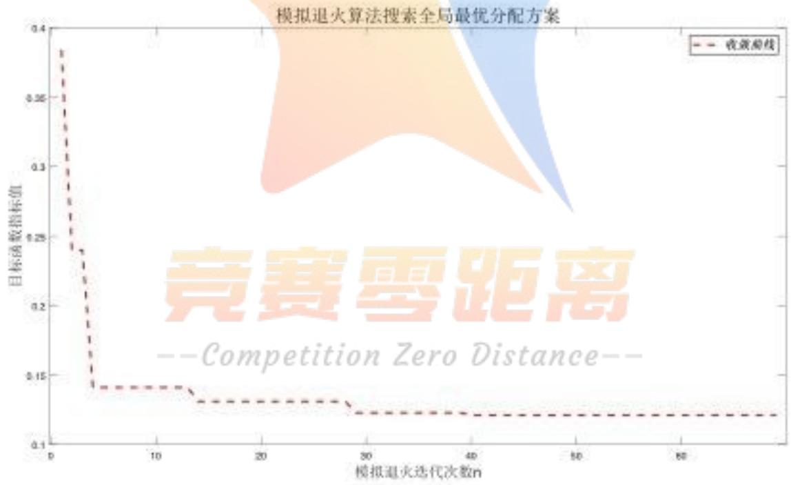  
Figure 13: 整体目标函数收敛曲线

由此，我们可以得到在所求得的最优方案中，所有队员最初拉绳的用力大小为59N，可以控制同心鼓的竖向转角 $\gamma$ 为0.4998°，其中对于每一个队员拉绳的最优调整策略则展示在下表2：

Table2: 最优策略中各位队员发力时机((s) 和用力大小(N)的取值
<table><tr><td>用力参数</td><td>1</td><td>2</td><td>3</td><td>4</td><td>5</td><td>6</td><td>7</td><td>8</td><td>9</td><td>10</td></tr><tr><td>发力时机</td><td>-0.13</td><td>-0.17</td><td>-0.07</td><td>-0.27</td><td>-0.20</td><td>-0.11</td><td>-0.03</td><td>-0.06</td><td>-0.08</td><td>-0.10</td></tr><tr><td>用力大小</td><td>80.85</td><td>91.69</td><td>86.84</td><td>96.73</td><td>70.43</td><td>83.12</td><td>74.72</td><td>96.96</td><td>94.62</td><td>73.66</td></tr></table>

由此结果可以见得，该模型所呈现的总体方案与第二问中的情形略有相似之处，其总体的发力时机与用力大小之间的差异并不相差太大，但对于现实情形而言，这种方案所要求各个队员对于自己用力大小与时机的把控需要高度准确，在使用退火模拟算法进行迭代求解过程中可以发现，任何队员的一个微小的随机误差将会对鼓最终的转动倾向于倾角产生较大的误差，因此这种调整策略在现实情形之中要得以实现仍较有一定的难度，因此“同心鼓”所需要团队每一位成员的高度凝聚力可见一斑。

## 8 模型评价

## 8.1 模型优点

1. 本文在正确、清楚地分析了整个物理过程的基础上，将模型进行合理的简化，为求不同情况下小球的偏转准备了条件；

2. 该模型将同心鼓在空间坐标系中的转动分解成多个方向的独立转动，进而进行叠加求和，操作简单，分析思路清晰，可用来计算多种情况下鼓的倾斜角度；

3. 模型的计算采用较为高级的退火算法，通过大量数据的迭代，得到的结果可信度较高；

4. 原创性很高，文章中的大部分模型都是自行推到建立的。

## 8.2 模型缺点

1. 结合现实情形考虑，该模型未考虑某些队员因心急等原因而进行的竖直方向上的拉绳，在特殊情况下可能会产生一定的误差；

2. 该模型建立在小角度的前提假设下，可在小角度范围内得到十分精确的结果，但是在队员出现较大失误的情况下，该模型可能存在较大的误差；

3. 描述团队最优策略的目标函数建立得较为简单，由于各个目标的优化之间具有较大矛盾，因此最终的策略的优化结果在各个方面进行了均衡；

4. 模拟退火算法初始解的选取不当可能影响收敛结果，较差的初始解可能导致陷入局部最优。

## 参考文献

[1] 杨进，徐猛，高自友.求解连续网络设计问题的模拟退火算法灵敏度分析[J].交通运输系统工程与信息,2009,9(3):64-69

[2]卓金武.MATLAB 在数学建模中的应用 [M]. 北京:北京航空航天大学出版社,2011.83-97

[3] 天工在线.MATLAB 从入门到精通 [M]. 北京:中国水利水电出版社,2018.8

[4] 刘超. 两体对心碰撞能量损失问题初探 [J]. 物理教学探讨,2004(11):51-52.

[5]刘延柱.关于刚体姿态和位置的数学表达[A].第三届全国力学史与方法论学术研讨会论文集，上海交通大学,2007.

[6] 旋转矩阵与欧拉定理 https://blog.csdn.net/lyhbkz/article/details/82321862

  
--Competition Zero Distance--

## 附录

附录一：

问题一程序：

```matlab
程序编号 T1-1 文件名称 speed2 说明 求碰撞前后排球与鼓的速度
function [v10,v20,v1,v2]=speed2(h)
g = 9.8;
e = 0.90; %恢复系数
m1 = 0.27;
m2 = 3.6;
v10 = sqrt(2*g*h);
v1 = -v10;
v20= v10-(2*v10*(m1+m2))/((1+e)*m2);
v2= v10+(2*v10*(e*m1-m2))/(m2*(1+e));
disp([v10,v20,v1,v2]);
%排球前后速度相同时的，排球和同心鼓的前后速度输出
```

问题二程序：

```matlab
程序编号 T2-1 文件名称 x_alpha_beta 说明 封装函数，输出鼓面参数值变化图
function [x_gu_end,alpha, beta,gamma]=x_alpha_beta(t_end,n_question)
tspan=[0 t_end];
[xx0 aa0 bb0 tt0]=tiqian(n_question);
x0=xx0(end);
dx0=(xx0(end)-xx0(end-1))/(tt0(end)-tt0(end-1));
a0=aa0(end);
da0=(aa0(end)-aa0(end-1))/(tt0(end)-tt0(end-1));
x_gu0=[x0 dx0];
--Competition Zero Distance--
alpha0=[a0 da0];
beta0=[b0 db0];
[t, xrad]=ode45(@odefunxab, tspan, [x_gu0alpha0 beta0],[],n_question);
x_gu=[xx0;xrad(:,1)];
x gu end=x gu(end) :
degree alpha=[aa0;xrad(:,3)]*180/pi;
alpha=degree_alpha(end);
degree_beta=[bb0;xrad(:,5)]*180/pi;
beta=degree beta(end):
gamma=asin(sqrt(sin(beta*pi/180)2+sin(alpha*pi/180)^2))*180/pi;
fprintf('同心鼓与水平面的夹角gamma为：%4.4f°，gamma);
fprintf('\n');
tt=[tt0;t];
figure;
```

```javascript
plot(tt,x_gu,'k-s','Linewidth',1.5);
title('鼓的竖直向位移值（做小角度处理）'，18);
grid on;
figure;
plot(tt, degree_alpha,'r-o','Linewidth',1.5);
hold on;grid on;
plot(tt, degree_beta,'b-*','Linewidth',1.5);
legend('\alpha','\beta');
title('鼓的双向转动角度值（做小角度处理）’，18);
```

```matlab
程序编号 T2-2文件名称 MO 说明 求-0.1s~0s同心鼓的冲量矩
function [Mx,My]=M0(theta,alpha, beta,n_question)
r=0.2;
vec_r=zeros(8, 3);
vec_r(1,:)=r*[cos(alpha)0 sin(alpha)]; vec_r(2,:)=r*sqrt(2)/2*[cos(alpha)
cos(beta) sin(alpha)+sin(beta)];
vec_r(3,:)=r*[0 cos(beta)sin(beta)]:vec_r(4,:)=r*sqrt(2)/2*[-cos(alpha)
cos(beta)-sin(alpha)+sin(beta)];
vec_r(5:8,:)=-vec_r(1:4,:);
vec F=zeros(8, 3);
[FF,tt]=member(n_question);
FF(tt==0)=68.1545;
F=FF:
vec_F(1,:)=F(1)*[cos(theta)0 sin(theta)]; vec_F(2,:)=F(2)*[cos(theta)/sqrt(2)
cos(theta)/sqrt(2)sin(theta)]
vec_F(3,:)=F(3)*[0 cos(theta)sin(theta)]; vec_F(4,:)=F(4)*[-cos(theta)/sqrt(2)
cos(theta)/sqrt(2)sin(theta)];
vec_F(5,:)=F(5)*[-cos(theta)0sin(theta)];vec_F(6,:)=F(6)*[-cos(theta)/sqrt(2)
-cos(theta)/sqrt(2)sin(theta)1; 此老
vec_F(7, :)=F(7)*[0 -cos(theta)sin(theta)]:yec F(8,;)=F(8)*[cos(theta)/sqrt(2)
-cos(theta)/sqrt(2)sin(theta)];
M=zeros(1, 3);
for i=1:8
M=M+cross(vec_r(i, :), vec_F(i,:));
end
Mx=-M(2);
My=M(1);
```

<table><tr><td rowspan=1 colspan=1>程序编号</td><td rowspan=1 colspan=1>T2-3</td><td rowspan=1 colspan=1>文件名称</td><td rowspan=1 colspan=1>M</td><td rowspan=1 colspan=1>说明</td><td rowspan=1 colspan=1>求0s后同心鼓的冲量矩</td></tr></table>

```matlab
function [Mx, My]=M(theta, alpha, beta, n_question)
r=0.2;
vec_r=zeros(8, 3);
vec r(1,:)=r*[cos(alpha)0sin(alpha)]: vec r(2,:)=r*sqrt(2)/2*[cos(alpha)
cos(beta) sin(alpha)+sin(beta)];
vec_r(3,:)=r*[0 cos(beta)sin(beta)]: vec_r(4,:)=r*sqrt(2)/2*[-cos(alpha)
cos(beta) -sin(alpha)+sin(beta)];
vec_r(5:8,:)=-vec_r(1:4,:);
vec F=zeros(8, 3);
[F,~]=member(n_question);
vec_F(1,:)=F(1)*[cos(theta)0 sin(theta)]; vec_F(2,:)=F(2)*[cos(theta)/sqrt(2)
cos(theta)/sqrt(2)sin(theta)];
vec_F(3,:)=F(3)*[0cos(theta) sin(theta)]; vec_F(4,:)=F(4)*[-cos(theta)/sqrt(2)
cos(theta)/sqrt(2)sin(theta)];
vec_F(5,:)=F(5)*[-cos(theta) 0 sin(theta)]; vec_F(6,:)=F(6)*[-cos(theta)/sqrt(2)
-cos(theta)/sqrt(2)sin(theta)];
vec_F(7,:)=F(7)*[0-cos(theta) sin(theta)]; vec_F(8,:)=F(8)*[cos(theta)/sqrt(2)
-cos(theta)/sqrt(2)sin(theta)];
M=zeros(1, 3);
for i=1:8
M=M+cross(vec_r(i,:),vec_F(i,:));
end
Mx=-M(2);
My=M(1);
```

程序编号 T2-4 文件名称 member 说明 1\~9工况情况  
function [F,t]=member(n\_question)  
switch e question 竞赛零距离  
F=[90 80 8080 80 80 80 80];  
Competition Zero Distance--  
t=zeros(1,8);  
case 2  
F=[90 90 8080 80 80 80 80];  
t=zeros(1,8);  
case 3  
F=[90 80 8090 80 80 80 80];  
t=zeros(1,8);  
case 4  
F=[80 80 8080 80 80 80 80];  
t=[-0.1 zeros(1,7)];  
case 5  
F=[80 80 8080 80 80 80 80];  
t=[-0.1-0.1 zeros(1,6)];  
case 6  
F=[80 80 8080 80 80 80 80];

```matlab
t=[-0.1 0 0-0.1 zeros(1,4)]:
case 7
F=[90 80 8080 80 80 80 80];
t=[-0.1 zeros(1,7)];
case 8
F=[90 80 80 90 80 80 80 80];
t=[0 -0.1 0 0 -0.1 0 0 0];
case 9
F=[90 80 8090 80 80 80 80];
t=[0 0 0 0 -0.1 0 0 -0.1];
end
end
```

```matlab
程序编号 T2-5 文件名称 x_gu 说明 求同心鼓的坐标
function x=x_gu(t,n_question)
[F,~]=member(n_question);
omega=sqrt((sum(F))/(3.6*1.7));
x0=0.11;
C=9.8/omega^2;
C1=x0-C;
x=C1*cos(omega*t)+C;
```

```matlab
程序编号 T2-6 文件名称 odefun 说明 微分方程句柄
function dx=odefun(t,x)
dx=zeros(2, 1);
dx(1)=x(2);
dx(2)=(780+90)(1.73)1)惠距离
```

--Competition Zero Distance--

程序编号 T2-7文件名称 degree\_alpha 说明 只考虑α转动的情况  
function degree\_alpha(t\_end)  
tspan=[0 t\_end];  
a0=[0 0];  
[t, a]=ode45(@odefuna, tspan, a0);  
degreea=a(:,1)\*180/pi;  
figure;  
plot(t, degreea,'r-o','Linewidth', 1.5);

<table><tr><td rowspan=1 colspan=1>程序编号 T</td><td rowspan=1 colspan=1>2-8文件</td><td rowspan=1 colspan=1>名称 deg</td><td rowspan=1 colspan=1>ree_alpha_beta</td><td rowspan=1 colspan=1>说明 同</td><td rowspan=1 colspan=1>时考虑α、β转动的情况</td></tr></table>

```matlab
function [alpha, beta]=degree alpha_beta(t_end)
tspan=[0 t_end];
a0=0; b0=0;
alpha0=[a0 0];
beta0=[b0 0];
[t, rad]=ode45(@odefunab, tspan, [alpha0 beta0]);
degree_alpha=rad(:,1)*180/pi;
alpha=degree_alpha(end);
degree_beta=rad(:,3)*180/pi;
beta=degree_beta(end);
figure;
plot(t, degree_alpha,'r-o','Linewidth', 1. 5);
hold on
plot(t, degree_beta,'b-*','Linewidth',1.5);
legend('\alpha','\beta');
title('鼓的双向转动角度值（做小角度处理），18);
```

```matlab
程序编号 T2-9 文件名称 odefuna 说明只考虑α转动的微分方程句柄
function da=odefuna(t,a)
Jx=1/2*3.6*0.2^2+1/12*3.6*0.22^2;
da=zeros(2,1);
x=x_gu(t,1);
theta=asin(x/1.7):
da(1)=a(2);
da(2)=0.2/Jx*(-80*sin(theta+a(1))+90*sin(theta-a(1)));
end
```

```matlab
程序编号 T2-10 文件名称odefunab 说明 同时考虑α、β转动的微分方程句柄
function drad=odefunab(t,rad)
petition Zero Distance--
Jx=1/2*3.6*0.2^2+1/12*3.6*0.22~2;
drad=zeros(4, 1) ;
n_question=3;
x=x_gu(t,n_question);
theta=asin(x/1.7);
[Mx,My]=M(theta,rad(1),rad(3));
drad(1)=rad(2);
drad(2)=1/Jx*Mx;
drad(3)=rad(4);
drad(4)=1/Jx*My;
end
```

<table><tr><td rowspan=1 colspan=1>程序编号</td><td rowspan=1 colspan=1>T2-11</td><td rowspan=1 colspan=1>文件名称</td><td rowspan=1 colspan=1>tiqian</td><td rowspan=1 colspan=1>说明</td><td rowspan=1 colspan=1>求提前用力工况下的参数值</td></tr></table>

```matlab
function [x_gu0,alpha0,beta0,tt0]=tiqian(n_question)
[~,t]=member(n_question);
if ~any(t)
x_gu0=[0.11 0.11]'; alpha0=[0 0]'; beta0=[0 0]': tt0=[0 0.001]';
%注：此处参数并无实际意义，仅仅为满足函数运算条件而设置，对结果无影响
else
tspan=[-0.1 0];
[t, xrad0]=ode45(@odefunxab0, tspan, [0.11 0 0 0 0 0],[], n_question);
tt0=t;
x_gu0=xrad0(:,1);
alpha0=xrad0(:,3);
beta0=xrad0(:,5);
end
```

问题四程序：

```matlab
程序编号 T4-1 文件名称 odefungFt 说明 微分方程函数
function dxrad=odefungFt(t,xrad,F0,FF,tt,index)
if nargin==5
n=10; M=3.6; g=9.8;L=2; r=0.2; H=0.22;
else
n=index(1); M=index(2);g=index(3);
L=index(4); r=index(5); H=index(6);
end
Jx=1/2*M*r²2+1/12*M*H^2;
dxrad=zeros(6,1);
F (t t) F0: 竞赛零距离
theta=asin(xrad(1)/L)
--Competition Zero Distance--
Fx=sum(F)*xrad(1)/L;
[Mx, My]=M_jisuan(theta, xrad(3),xrad(5),F, n, r);
dxrad(1)=xrad(2);
dxrad(2)=-Fx/M+g;
dxrad(3)=xrad(4);
dxrad(4)=1/Jx*Mx;
dxrad(5)=xrad(6);
dxrad(6)=1/Jx*My;
end
```

程序编号 T4-2文件名称 gamma\_F\_t 说明 求出 gamma 随 Ft 的变化

```matlab
function [x_gu_end, alpha, beta, gamma]=gamma_F_t (F0, FF, tt, t_end, index)
%注意这里t_end可以计算得到 t_end=pi/2*sqrt(M*L/(sum(FF))):
ifnargin<=3
n=10; M=3.6; g=9.8: L=2: r=0.2; H=0.22;
t end=pi/2*sqrt (M*L/(sum(FF)));index=[n M g L r H];
else
n=index(1): M=index(2);g=index(3): L=index(4);
end
x0=asin(M*g/(n*F0))*L; %根据初始拉力求初始静止坐标
tspan=[min(tt) t_end]; %竖直求解微分方程上下限
[t, xrad]=ode45(@odefungFt, tspan, [x00 0 0 00], [],F0,FF, tt, index);
%求解微分方程组
x_gu=xrad(:,1);
x_gu_ end=x_gu(end): %鼓的坐标
degree_alpha=xrad(:,3)*180/pi;
alpha=degree_alpha(end); %最后时刻alpha（角度制）
degree_beta=xrad(:,5)*180/pi;
beta=degree_beta(end); %最后时刻beta（角度制）
gamma=asin(sqrt(sin(beta*pi/180)^2+sin(alpha*pi/180)^2))*180/pi;
fprintf('f-ĐÅ'A0ëE@E/AæμÄ/D/ÇgammaI" £°%4. 4fā',gamma); %输出gama（角度制）
fprintf('\n');
```

```matlab
程序编号 T4-3 文件名称 M_jisuan 说明 求出给定状态下的冲量矩
function [Mx,My]=M_jisuan(theta,alpha, beta,F,n,r)
if nargin==4
end n=10; r=0.2; 竞赛零距离
angle=0:2*pi/n:2*pi;
--Competition Zero Distance--
angle(end)=[];
I_zhuan=[cos(alpha)0-sin(alpha);0 cos(beta) -sin(beta):sin(alpha) sin(beta)
cos(alpha)*cos (beta)];
vec_r=zeros (n, 3);
for i=1:n
vector=[cos(angle(i))sin(angle(i))0]';
v_zhuan=I_zhuan*vector;
vec_r(i,:)=r*v_zhuan;
end
vec_F=zeros(n, 3) ;
for i=1:n
v_fangxiang=[cos(angle(i))*cos(theta)sin(angle(i))*cos(theta) sin(theta)];
vec_F(i,:)=F(i)*v_fangxiang;
end
```

```matlab
M=zeros(1, 3);
for i=1:n
M=M+cross(vec_r(i,:), vec_F(i,:));
end
Mx=-M(2);
My=M(1);
```

```matlab
程序编号 T4-4 文件名称 disturbtt 说明 生成退火算法中的扰动值
function tt_dis=disturbtt(tt)
for i=1:10
tt(i)=tt(i)+0.02*randn();
end
tt(tt>0)=0;
ind1=0; ind2=0;
while(ind1=ind2)
ind1=ceil(rand.*10);
ind2=ceil(rand.*10);
end
tt_dis(ind1)=tt(ind2);
tt_dis(ind2)=tt(ind1);
end
```

```matlab
程序编号 T4-5 文件名称optfun说明退火算法的目标函数
function aim=optfun(X) 克费零距离
F0=X(1): FF=X(2:11): tt=X(12:21);
tion,ZeroDistance
[~, alpha, beta, gamma]=gamma_F_t(F0, FF, tt);
%计算目标解的alpha beta gamma值的大小
alpha_final=asin(sin(0.5*pi/180)*cos(12*pi/180))*180/pi;
beta_final=asin(sin(0.5*pi/180)*sin(12*pi/180))*180/pi;
gamma_final=asin(sqrt(sin(beta_final*pi/180)2+sin(alpha_final*pi/180)2))*180/p
i;
%计算各个目标
aim1=abs(mean(FF)-F0)/abs(max(FF)-F0);
aim2=range(FF./norm(FF))2; aim3=sum(tt.^2);
aim4=(alpha-alpha_final)^2+(beta-beta_final)2+(gamma-gamma_final)2;
if (aim4>0.3)||(F0>min(FF))||(max(abs(tt))>0.15)
aim=100000;
else
omega=[1/3 1/3 1/3];
aim=omega(1)*aim1 + omega(2)*aim2 + omega(3)*aim3; %omega(4)*aim4;
```

```matlab
程序编号 T4-6 文件名称 find_opt 说明 最终程序，求最佳参数值
function
[alpha best,beta best, gamma_best, F0_best,FF_best, tt best]=find opt (F00, FF0, tt0, T
k, T0, Lf, alpha)
alpha_final=asin(sin(0.5*pi/180)*cos(12*pi/180))*180/pi;
beta_final=asin(sin(0.5*pi/180)*sin(12*pi/180))*180/pi;
gamma final=asin(sqrt(sin(beta_final*pi/180)2+sin(alpha final*pi/180)2))*180/p
i;
if nargin==3
Tk=1000;
T0=1;
Lf=2000;
alpha=0.5;
end
F0_current=F00;
FF_current=FF0;
tt_current=tt0;
F0_best=F00;
FF_best=FF0;
tt_best=tt0;
pur_current=optfun([F00 FF0tt0]);
pur best=optfun([F00 FF0 tt0]);
result=[];
while Tk>T0
for i=1:Lf
FF=disturbFF(FF_current):
tt=disturbtt(tt_current)etition ZeroDistance
fprintf('已执行第%d次扰动\n',i);
X=[F0 FF tt]:
pur=optfun(X);
if pur<pur current
pur_current=pur;
F0_current=F0;
FF_current=FF;
tt_current=tt;
if pur<pur best
pur_best=pur;
F0_best=F0;
FF_best=FF;
tt_best=tt;
end
```

```matlab
else
if rand(1,1)<exp((pur_current-pur)/Tk)
pur_current=pur;
F0_current=F0;
FF_current=FF;
tt_current=tt;
else
end
end
fprintf('扰动之后的目标函数参数为%1.4f \n’,pur);
fprintf(当前最优的目标函数参数为%1.4f \n’,pur_current);
end
Tk=alpha*Tk;
fprintf('完成一次~此时目的函数参数为%1.4f\n’,pur_best);
result=[result,pur_best];
end
[~, alpha_best, beta_best, gamma_best]=gamma_F_t(F0_best, FF_best, tt_best);
fprintf(经过退火算法优化后，同心鼓与水平面的最优夹角gammabest
为：%4.4f°\n',gamma_best);
fprintf('同心鼓与水平面的目标的夹角gamma_final为：%4.4f°\n’，gamma_final);
figure; hold on; grid on;
plot(result,'r—','LineWidth',2);
xlabel('模拟退火迭代次数n’,'Fontsize',18,'Fontname','Times'):
ylabel('目标函数指标值’,'Fontsize',18,'Fontname','Times');
title(模拟退火算法搜索全局最优分配方案’,'Fontsize',20,'Fontname','Times');
end
function FO dis=disturbforo赛零距离
F0_dis=F0+0.5*randn();
end -Competition Zero Distance--
function FF dis=disturbFF(FF)
for i=1:10
FF(i)=FF(i)+0.5*randn();
end
ind1=0; ind2=0;
while(indl=ind2)
ind1=ceil(rand.*10);
ind2=ceil(rand.*10);
end
FF_dis=FF;
FF_dis(ind1)=FF(ind2):
FF_dis(ind2)=FF(ind1);
end
```

```matlab
function tt_dis=disturbtt(tt)
for i=1:10
tt(i)=tt(i)+0.001*randn();
end
tt(tt>0)=0;
ind1=0; ind2=0;
while(indl=ind2)
ind1=ceil(rand.*10);
ind2=ceil(rand.*10);
end
tt_dis=tt;
tt_dis(ind1)=tt(ind2);
tt_dis(ind2)=tt(ind1):
end
```


## 竞赛零距离

--Competition Zero Distance--