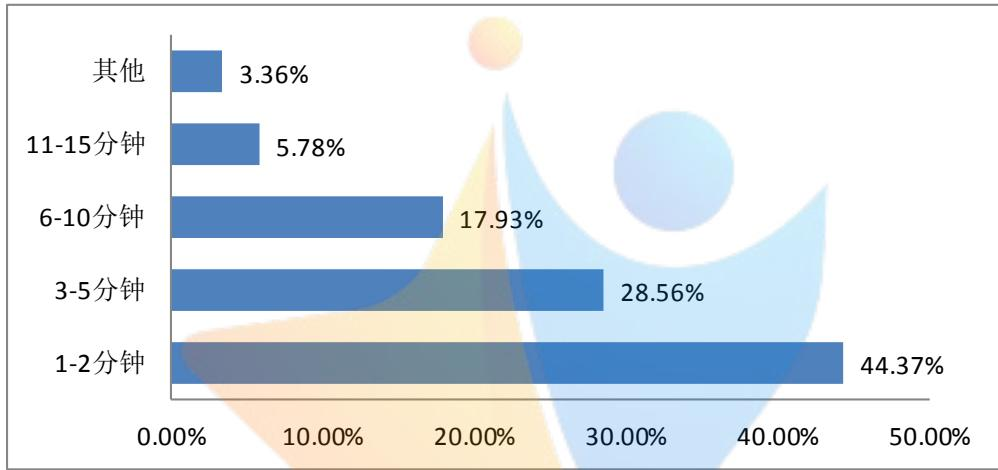
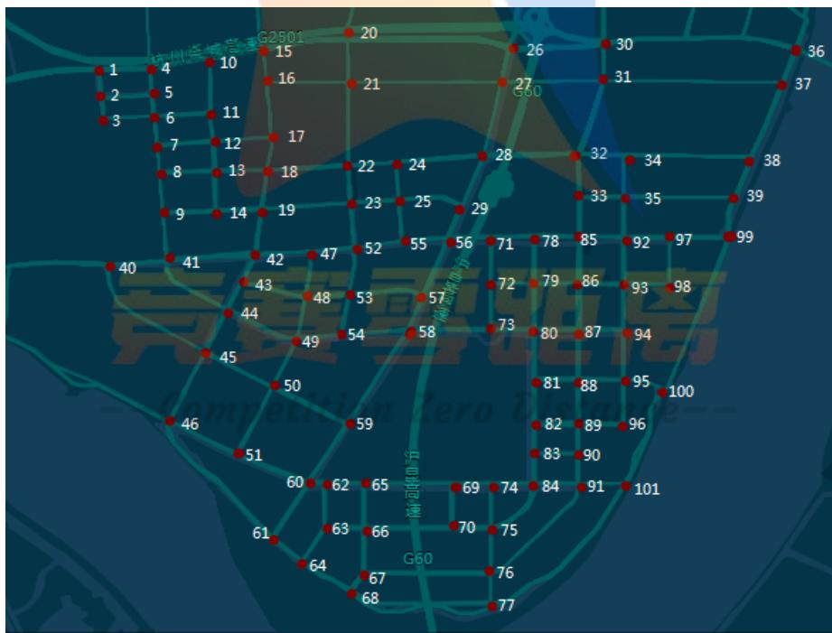
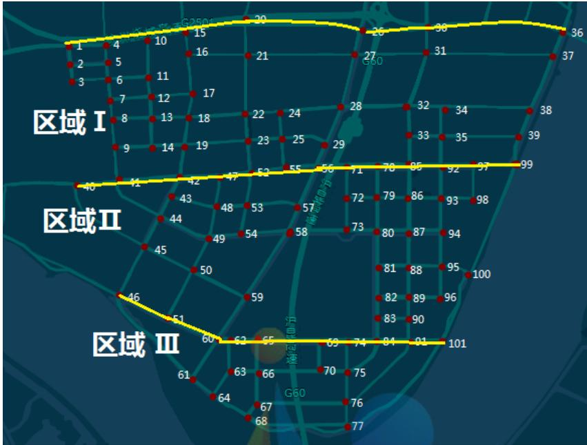
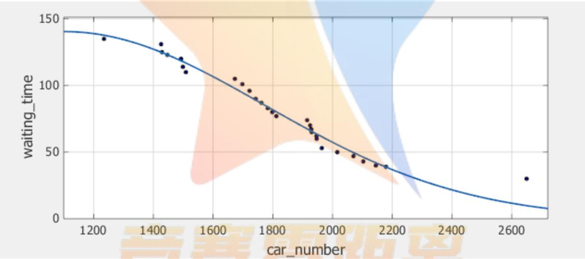

# “互联网+”时代的打车难补贴政策的分析与探讨

## 摘 要

本文主要研究了基于打车软件下的出租车资源配置问题，建立了资源匹配规划模型、等待时长规划模型，利用 MATLAB、SPSS软件，实现了对不同时空下出租车资源的“匹配程度”与不同打车软件的补贴政策对“缓解打车难”的帮助程度的问题的求解。

针对问题一，采用机理分析法，选取每名乘客的平均等待时长与司机的月收入两项指标来衡量出租车资源“供求匹配”程度，两项指标的可量化性使得模型结果可以被直观分析。基于 Floyd算法求解了乘客平均等待时长和分析数据求得不同空驶率下的司机月收入，建立资源匹配规划模型，求解不同时空下的出租车资源“匹配程度”。以某市某经济开发区为例，求得该经济开发区使用打车软件下的乘客平均等待时长为124.67秒，司机月收入为5463.5元，将其与乘客可接受的最长等待时长与该市生活背景下的司机满意的最低收入进行比较，可知在该经济开发区内的出租车资源“匹配程度”良好。

针对问题二，搜集 Uber和滴滴出行两大打车软件的补贴政策，从“打车难”问题的根本（需求大供应少）入手，选取在补贴政策变化下的打车需求量和出租车供应量两项指标的变化对乘客平均等待时长的改变来衡量该政策是否对“缓解打车难”有帮助。建立等待时长规划模型，通过比较补贴政策前后乘客平均等车时长的长短，求得 Uber的“拼车”补贴与“私家车载客”补贴对“缓解打车难”有帮助，滴滴出行的“无差别”补贴对“缓解打车难”没有帮助。

针对问题三，分析Uber和滴滴出行两大打车软件的补贴政策下的不足之处，参考并改善 Uber 补贴政策，新增了对司机和乘客的双向“拼车”补贴、对长途接运拼车的大型出租车的“高峰期”补贴与能约束载客私家车数量的动态补贴的三项政策，从缓解“打车难”、实施可行性、用户满意度三方面论述该补贴政策是合理的。

所建模型具有较好的实用性，适于推广至物流配送、快递员快递收发等运输行业。

关键词： 互联网+ 打车难 供求匹配 补贴政策

## 1、问题重述

## 1.1 问题背景

出租车是市民出行的重要交通工具之一，“打车难”是人们关注的一个社会热点问题。随着“互联网+”时代的到来，有多家公司依托移动互联网建立了打车软件服务平台，实现了乘客与出租车司机之间的信息互通，同时推出了多种出租车的补贴方案。

## 1.2 问题提出

作者搜集了相关数据，建立了数学模型研究了如下问题：

（1）建立合理的指标，并分析不同时空出租车资源的“供求匹配”程度；

（2）分析各公司的出租车补贴方案是否对“缓解打车难”有帮助；

（3）为一个新的打车软件服务平台设计有效“缓解打车难”的补贴方案并论证其合理性。

## 2、模型假设

（1）假设乘客的上下车与司机接单均在各标记处的主要路口；

（2）假设司机收入均来自于出租车的运营，且合理收费，不出现接私活的现象；

（3）忽略天气、节假日等原因使得地区的乘车需求量与出租车供应量发生重大改变的情况；

## 3、符号说明

$d _ { i j }$ ：路口 $\nu _ { i } ( i = 1 , 2 , . . . , n )$ 到路口 $\nu _ { j } ( j = 1 , 2 , . . . , n )$ 的最短距离；

$x _ { i j }$ ：出租车从路口 $\nu _ { i } ( i = 1 , 2 , . . . , n )$ 到路口 $\nu _ { j } ( j = 1 , 2 , . . . , n )$ 接客的趟数；

T：单位时间段所有乘客从下单起到乘上出租车的等待时长之和；

$t _ { 1 } :$ ：一名乘客在单位时间段一次从下单起到被接单的平均等待时长；

$\overline { { K } }$ ：单位时间段内的出租车平均空驶率；

$L _ { i 0 }$ ：单位时间段内，第i辆出租车的总空载里程；

$L _ { \mathrm { i l } }$ ：单位时间段内，第<sub>i</sub>辆出租车的总载客里程；

## 4、模型的建立与求解

## 4.1 问题一的分析与建模

为分析在不同时空出租车资源的“供求匹配”程度，作者选定某市某经济开发区作为采样点，搜集在某经济开发区一段时间内的每一天的各个时间段（包括高峰期、平稳期、低谷期）下的各交通路段的具备打车软件的出租车流量（下称出租车流量）、使用打车软件的客流量（下称客流量）以及客户的去向数据以及交通网络的各交通路段的路程长度。

以某经济开发区所有使用打车软件的客户平均等待时间总和与具备互联网打车功能的出租车的平均空驶率作为指标来衡量出租车资源的“供求匹配”程度。为计算客户的总等待时长，通过分析数据，将某经济开发区分为若干块（包括客流量密集、一般、稀少区），采用随机的方法为各交通路口安排相应的出租车流量，将出租车成功抢单后到达顾客所在点的最短时长作为客户的候车时长，计算出客户的总等待时长（候车时长与接单时长之和）；为计算出租车空驶率，采用IC 数据统计方法，计算在该时间段内的出租车使用率作为第二指标来衡量出租车资源的“供求匹配”程度。

## 4.1.1 基于 Floyd 算法的候车时长计算

在同一时间段，客户等待时长为客户下单后到上车之间总时长，分为两部分：下单后的司机接单时长与接单后去接客的时长。平均司机接单时长可查阅数据得出，为计算接客时长，作者将该问题转化为最短路问题进行求解最短的接客时长。

设图 $G = ( V , E ) \ , \ W _ { i j }$ 表示边 $( \nu _ { i } , \nu _ { j } )$ 上的全（即为道路的长度），若 $\nu _ { i }$ 和 $\nu _ { j }$ 不相邻，则 $w _ { i j } = + \infty$ ，用 $d _ { i j }$ 表示顶点 $\nu _ { i }$ 和顶点 $\nu _ { j }$ 的最短距离<sup>[1]</sup>。使用 Floyd算法来计算$d _ { i j }$ 最短距离矩阵，步骤如下：

Step1 输入图G权矩阵W，对所有的 $i , j$ ，有 $d _ { i j } = w _ { i j }$ ， k 1；

Step2 更新 $d _ { i j }$ ，对所有i j , ，若 $d _ { i k } + d _ { k j } < d _ { i j }$ ，则令 $d _ { i j } = d _ { i k } + d _ { k j }$

Step3 若，则存在一条含有顶点 $\nu _ { i }$ 的负权值回路，算法终止；或者k n 算法终止；否则转 Step2.

假设出租车在该城区的行驶速度固定为<sub>v</sub>（单位：km/h），司机从起始点 $\nu _ { i }$ 到

客户所在地 $\nu _ { j }$ 的时长为 $\frac { d _ { i j } } { \nu }$ 。将从起始点i到客户所在地 $j$ 的车的数量为 $x _ { i j }$ 。则总等待时长为

$$
T = t _ { 1 } \times \sum _ { i = 1 } \sum _ { j = 1 } x _ { i j } + \sum _ { i = 1 } \sum _ { j = 1 } \frac { d _ { i j } x _ { i j } } { \nu }\tag{4.1}
$$

其中， $t _ { 1 }$ 为平均接单时间，T为总等待时长， $\sum _ { i = 1 } \sum _ { j = 1 } x _ { i j }$ 表示在该时间段的总接单数， $\sum _ { i = 1 } \sum _ { j = 1 } \frac { d _ { i j } x _ { i j } } { \nu }$ 为总接客时间。

## 4.1.2 空驶率的计算

出租车空驶率是一项能够直观反映出营运出租车的营运状况和出租车拥有量是否合理的指标，指单位时间内出租车空载行驶里程与总行驶里程之比<sup>[2]</sup>。

为求出单位时间内出租车空载率，作者引入出租车 IC 数据统计方法。IC 卡（Integrated Circuit Card，集成电路卡），也称智能卡，它是将一个微电子芯片嵌入符合 ISO 7816 标准的卡基中，做成卡片。IC 卡的开发、研制与应用是一项系统工程，涉及到计算机、通讯、网络、软件、卡的读写设备、应用机具等多种产品领域的多种技术学科，是当今国际电子信息产业的热点产品之一。

基于 IC 卡的具备打车软件功能的出租车的管理系统，管理者可方便科学的对出租车的各种信息进行管理。出租车 IC 卡管理系统有两个主要的数据表：营运明细表和车辆档案表。从中截取对于计算空驶率的数据，如表1所示。

表 1 出租车 IC卡字段及内容说明
<table><tr><td>dtScrp</td><td>dtScsj</td><td>dtXcsj</td><td>inZksj</td><td>fltJflc</td><td>fltKslc</td></tr><tr><td>上车日期</td><td>上车时间</td><td>下车时间</td><td>载客时间</td><td>载客里程</td><td>空驶里程</td></tr><tr><td>2009年9月29日</td><td>17:23</td><td>17:34</td><td>0:11</td><td>4.00</td><td>24.90</td></tr></table>

查阅一批出租车 IC 卡上的数据，基于计价器 IC 卡运营数据表对出租表对出租车运营状况进行分析，以一个单位时间段的时长为准，计算得出各个时间段的车辆平均空驶率<sup>[3]</sup>为：

$$
\overline { { K } } = \frac { \displaystyle \sum _ { i = 1 } ^ { n } \frac { L _ { i 0 } } { L _ { i 0 } + L _ { i 1 } } } { n }\tag{4.2}
$$

其中， $\overline { { K } }$ 为单位时间段内的出租车平均空驶率， $L _ { i 0 }$ 为第i辆出租车的总空载里程，$L _ { \mathrm { i l } }$ 为第i辆出租车的总载客里程， $\frac { L _ { i 0 } } { L _ { i 0 } + L _ { i 1 } }$ 为第i辆出租车的空驶率。

## 4.1.3 模型的建立

为评价出租车资源“供求匹配”的程度，引入两个指标“乘客可接受的最长等车时长”和“司机满意的最低月收入”。即当某个时空，乘客的平均等待时长小于等于乘客可接受的最长等车时长且司机收入大于等于满意的最低月收入时，供求匹配程度达到最佳，相反两者皆未达标即为匹配程度差，满足其一标准即为匹配程度中等。

西南交通大学的冯晓梅在《供需平衡状态下的出租车发展规模研究》一文的撰写过程中，对 468名市民进行关于乘客可接受的最长等待时长的问卷调查，调查结果如图1所示。

  
图 1 乘客可接受的最长等待时间统计

由图可知，有44.37%的乘客可接受最长的等待时长为 1-2分钟；28.56%的乘客可接受最长的等待时长为 3-5 分钟 ；17.93%的乘客可接受最长的等待时长为6-10分钟；5.78%的乘客可接受最长的等待时长为11-15分钟（“其他时间”所占百分比较小，故舍去），由此计算，乘客可接受的最长等待时长的数学期望为3.99分钟。

由于国内的人群价值观的相似性，可以判断出不同城市的乘客可接受的最长等待时长相近，不会有对模型有实质性的影响。故可以将 3.99 分钟作为模型中的乘客可接受的最长等待时长。

下将司机满意的最低收入进行量化。在不同城市的经济背景下，相同的生活质量有着不同的生活成本，故要根据实际的生活背景确定司机满意的最低收入，为简化模型，现设为I 。

假设司机仅从事出租车事业，仅有此一种收入形式。由生活经验可知，司机的实际收入为开车所赚得的金额减去每天上交给出租车公司的“份子钱”与所行驶公里数所花费的油费（以月收入作为标准）：

$$
G = 3 0 \times \left[ ( o \times L _ { 1 } ) - f - p q ( L _ { 0 } + L _ { 1 } ) \right]\tag{4.3}
$$

其中， $^ o$ 为每公里载客的收入， $L _ { 0 }$ 为一天内的空驶里程数， $L _ { \mathrm { 1 } }$ 为一天内的载客里程数， $f$ 为每天需上交给出租车公司的“份子钱”， $p$ 和 $q$ 分别为每百公里油耗和每升汽油所需油费。

建立如下数学模型：

目标函数： $z = \alpha + \beta$

$$
\begin{array} { r l } { \mathbb { H } \displaystyle \{ \mathfrak { x } + \sum _ { i = 1 } ^ { \infty } ( ( \begin{array} { l l } { 0 } & { t < 3 . 9 9 \times 6 0 } \\ { 1 } & { t \geq 3 . 9 9 \times 6 0 } \\ { 0 = \{ 0  } & { \mathbf { G } < 1 } \\ { 1 } & { \mathbf { G } \geq 1 } \end{array}  } \\ { s t . \{ t = \frac { T } { \displaystyle \sum _ { i = 1 } ^ { T } \sum _ { j = 1 } ^ { X } x _ { i j } } - \frac { t _ { i } \times \sum _ { i = 1 } ^ { T } \sum _ { j = 1 } ^ { X } x _ { i j } + \sum _ { i = 1 } ^ { T } \frac { d _ { j } x _ { i j } } { \nu }  } \\ {  \qquad \quad \sum _ { i = 1 } ^ { T } x _ { i j } } - \frac { \sum _ { j = 1 } ^ { X } x _ { i j } } { \nu - 1 . \rho _ { 1 } } x _ { i j } \} } \end{array}\tag{4.4}
$$

解得模型结果如下：

当得到 $z = 2$ 时，即视为出租车资源的“供求匹配”程度良好；当 $z = 1$ ，即视为出租车资源的“供求匹配”程度一般；当 $z = 0$ ，即视为出租车资源的“供求匹配”程度差。

## 4.1.4 模型的求解

以某市某经济开发区为例，在谷歌某经济开发区卫星地图上将各个主要的交通路段进行标点，如图2所示。

  
图2 某经济开发区交通路口标点图

如图所示，某经济开发区主要交通路口为101处，标记为点1至点 101。根据所绘图形的比例尺（1：74200），计算得各个连通路段的路程（详细见附件点坐标及权矩阵.xls），并使用所建模型中的 Floyd 算法，求得所有两点间的最短路

矩阵 $D _ { 1 0 1 \times 1 0 1 }$ （见附件 Dij.xlsx）。

查阅某经济开发区的日基本行车路径<sup>[4]</sup>，整理成司机从路口 $\nu _ { i }$ 到乘客所在地$\nu _ { j }$ 的行车频率矩阵 $X _ { _ { 1 0 1 \times 1 0 1 } }$ （见附件 Xij.xls），假设在某经济开发区的车辆行驶为40km/h。程序见附录一，求得：

$$
\frac { \displaystyle { \sum _ { i = 1 } ^ { 1 0 1 } \sum _ { j = 1 } ^ { 1 0 1 } \frac { d _ { i j } x _ { i j } } { \nu } } } { \displaystyle { \sum _ { i = 1 } ^ { 1 0 1 } \sum _ { j = 1 } ^ { 1 0 1 } x _ { i j } } } = 1 2 2 . 9 4 s\tag{4.5}
$$

根据所查阅的某经济开发区某天各时间段的供应量，整理成表，如表2所示。

表 2 高峰期、平稳期、低谷期的各点供应量
<table><tr><td>标点</td><td>高峰期</td><td>低谷期</td><td>平稳期</td><td>标点</td><td>高峰期</td><td>低谷期</td><td>平稳期</td></tr><tr><td>1-9</td><td>0</td><td>0</td><td>0</td><td>35</td><td>55</td><td>0</td><td>42</td></tr><tr><td>10</td><td>21</td><td>35</td><td>0</td><td>36</td><td>19</td><td>47</td><td>47</td></tr><tr><td>11</td><td>21</td><td>35</td><td>0</td><td>37</td><td>109</td><td>69</td><td>47</td></tr><tr><td>12</td><td>21</td><td>35</td><td>48</td><td>38</td><td>90</td><td>22</td><td>20</td></tr><tr><td>13</td><td>29</td><td>0</td><td>48</td><td>39</td><td>0</td><td>0</td><td>20</td></tr><tr><td>14</td><td>29</td><td>0</td><td>0</td><td>40</td><td>0</td><td>0</td><td>0</td></tr><tr><td>15</td><td>21</td><td>35</td><td>32</td><td>41</td><td>0</td><td>0</td><td>0</td></tr><tr><td>16</td><td>46</td><td>73</td><td>32</td><td>42</td><td>0</td><td>17</td><td>0</td></tr><tr><td>17</td><td>46</td><td>73</td><td>48</td><td>43</td><td>0</td><td>0</td><td>0</td></tr><tr><td>18</td><td>81</td><td>38</td><td>48</td><td>44</td><td>0</td><td>0</td><td>0</td></tr><tr><td>19</td><td>56</td><td>17</td><td>0</td><td>45</td><td>0</td><td>0</td><td>0</td></tr><tr><td>20</td><td>107</td><td>112</td><td>32</td><td>46</td><td>0</td><td>0</td><td>0</td></tr><tr><td>21</td><td>226</td><td>150</td><td>176</td><td>47</td><td>0</td><td>17</td><td>0</td></tr><tr><td>22</td><td>226</td><td>38</td><td>144</td><td>48</td><td>0</td><td>0</td><td>0</td></tr><tr><td>23</td><td>27</td><td></td><td></td><td>49</td><td></td><td>0</td><td>0</td></tr><tr><td>24</td><td>175</td><td></td><td></td><td>50</td><td></td><td>0</td><td>0</td></tr><tr><td>25</td><td>0</td><td></td><td></td><td></td><td>距漓</td><td>0</td><td>0</td></tr><tr><td>26</td><td>107</td><td>132</td><td>45 etit</td><td>52</td><td>0 ce</td><td>17</td><td>0</td></tr><tr><td>27</td><td>281</td><td>132</td><td>189</td><td>53-84</td><td>0</td><td>0</td><td>0</td></tr><tr><td>28</td><td>174</td><td>0</td><td>144</td><td>85</td><td>0</td><td>0</td><td>22</td></tr><tr><td>29</td><td>0</td><td>47</td><td>0</td><td>86</td><td>0</td><td>0</td><td>0</td></tr><tr><td>30</td><td>19</td><td>67</td><td>92</td><td>87</td><td>0</td><td>0</td><td>0</td></tr><tr><td>31</td><td>109</td><td>42</td><td>92</td><td>88</td><td>0</td><td>0</td><td>0</td></tr><tr><td>32</td><td>145</td><td>22</td><td>0</td><td>89</td><td>0</td><td>0</td><td>22</td></tr><tr><td>33</td><td>55</td><td>0</td><td>22</td><td>90-101</td><td>0</td><td>0</td><td>0</td></tr><tr><td>34</td><td>55</td><td>22</td><td>20</td><td>总数</td><td>2077</td><td>1122</td><td>1356</td></tr></table>

根据表2的数据将密集程度相近的标点图依照黄线划分为三个区域：区域Ⅰ、区域Ⅱ、区域Ⅲ，如图3所示。

  
图 3 区域划分图

按供应密集程度从大到小分为三个区域，区域Ⅰ中包含点1-点 39；其中区域Ⅰ与区域Ⅱ之间的交线为点40、点41、点 42、点 47、点52、点 55、点56、点71、点 78、点85、点92、点 97、点99连成的线；区域Ⅱ中包含点 43、点 44、点 45、点 48、点 49、点 50、点 53、点 54、点 57、点 58、点 59、点 72、点 73、点79-点 83、点 86、点 90、点 93、点 96、点 99、点 100；其中区域Ⅱ与区域Ⅲ之间的交线为点46、点51、点 60、点 63、点 65、点 69、点 74、点 84、点 91、点101连成的线；剩下的点为区域Ⅲ的点。

根据所查阅的资料，将三个时间段的三个区域的平均接单时间（见附件平均接单时间.xlsx）整理成表，如表3所示。

表3 平均接单时长
<table><tr><td>平均接单时长(s)</td><td>高峰期</td><td>低谷期</td><td>平稳期</td></tr><tr><td>I区</td><td>57.81</td><td>78.14</td><td>55.02</td></tr><tr><td>Ⅱ区</td><td>36.94</td><td>95.90</td><td>81.68</td></tr><tr><td>III区</td><td>90.00</td><td>83.33</td><td>80.58</td></tr></table>

求得：

$$
\begin{array}{c} t = \frac { T ^ { - \mathcal { C } } \mathcal { O } \ : t _ { 1 } \times \sum _ { i = 1 } \sum _ { j = 1 } \sum _ { \boldsymbol { x } _ { i j } } x _ { i j } + \sum _ { i = 1 } \sum _ { j = 1 } \frac { d _ { i j } x _ { i j } } { \boldsymbol { y } ^ { j } } } { \sum _ { i = 1 } \sum _ { j = 1 } x _ { i j } } \mathcal { D } i s t a n { \mathcal { C } } e \rho - -  \\ { = 1 2 2 . 9 4 + 7 3 . 2 7 = 1 9 6 . 2 1 s } \end{array}\tag{4.6}
$$

又因为 $1 9 6 . 2 1 5 < 2 3 9 . 4 5 ,$ 故 $\alpha = 1$

某市作为该省的省会城市，生活成本在全国层面来看较高。根据 2014 年中华人民共和国统计年鉴给出的数据显示，其交通运输、仓储和邮政业就业人员在年的年收入为 元， 年的年收入为 元， 年的年收入为53391 元<sup>[5]</sup>，由此可知出租车司机的年收入随年份递增，故出租车司机的满意收入一定不低于2014年的年工资。故将 2014年的年收入作为出租车司机满意的最低收入，即为5284.67元/月。

在某市某经济开发区，95%以上的出租车的车型为1.8L 排量的大众车，该种车型每百公里耗油量约为8.1升，2015年每升93<sup>#</sup>汽油的价格为8.57元，每辆出租车的承包金是每月7695元即每天的“份子钱”为256.5元。

某经济开发区出租车的具体收费标准为：客运出租车起步里程为 公里，起步费 7 元；超起步费后 8 公里内每公里租费 2.40 元，超过 8 公里以上的部分加收50%的返空补贴费，即每公里租费3.60元；因路阻或乘客要求临时停车的，5分钟按一公里租费计收，即按5分钟 2.40元计收。

考虑到某经济开发区的实际大小和所查阅近期某经济开发区的 1000 条行车轨迹，发现 26.83%的行车路程小于 2000m，19.51%的行车路程在 2000m\~3000m之 间 ， 24.39%的 行 车 路 程 在 3000m\~4000m 之 间 ， 19.51%的 行 车 路 程 在4000m\~5000m之间，9.8%的行车路径在5000m以上。由此计算，在载客的里程数中每公里出租车司机能赚3.385元。

查阅数据，该市出租车日均行驶里程为320km，载客里程为 195.2km，空驶里程为 124.8km，将此作为某经济开发区的数据进行计算，此时空驶率 $\overline { { K } }$ 为 39%,所建模型中 $o = 3 . 3 8 5$ 元/km， $f = 2 5 6 . 5$ 元/天， $p = 7$ <sub>.1</sub>升/百里， $q = 8 . 5 7$ 元/升，$L _ { 0 } = 1 2 4 . 8$ 公里， $L _ { 1 } = 1 9 5 . 2$ 公里。求得:

$$
G = 3 0 \times \left[ ( o \times L _ { 1 } ) - f - p q ( L _ { 0 } + L _ { 1 } ) \right] = 5 4 6 3 . 5 \ \overrightarrow { \mathrm { ‰ } }\tag{4.7}
$$

由于 5463.5 元>5284.67 元，故 $\beta = 1$ 。

综上所述， $z = \alpha + \beta = 2$ ，根据模型(4.4)的结果，可知某经济开发区的出租车资源“供求匹配程度”良好。

## 4.2 问题二的分析与建模

为解决问题二，首先要收集各依托移动互联网建立的打车软件平台（公司）的补贴方案，本文选取所占时长份额最大的两家打车软件公司：滴滴出行、Uber的补贴方案来分析其是否对“缓解打车难”有帮助。其次，了解“打车难”产生的原因，分析各补贴方案是否在问题产生的根源上是否有帮助。基于模型(4.4)，将“打车难”问题数据化为“乘客的平均等待时长t”，和未有补贴政策下的平均等待时长t进行定量比较，分析各补贴方案是否对“缓解打车难”有帮助。

## 4.2.1 各公司的补贴方案分析

## （1）Uber平台的补贴方案

根据 2015年 4月14日《四川日报》报道，Uber司机的补贴政策为：双倍以上补贴和超高接单奖励。例如在成都：1）对司机平时车资双倍补贴，在早上7:00-10:00 和晚上 17:00-20:00 高峰时段 2.5 倍补贴。Uber 按 1.3 元每公里计费，起价 10元可行驶7公里。因此 10元的路程中，客人只需付出8.8元，而司机的收入则是20元，早晚高峰更高达25元，这仅是跑一笔起步价的收入，而大多数的车资都会超过10元。2）上下班高峰时段，接单3笔奖励50元，接单5笔奖励 100 元。因此，只要司机一天跑上十几单，数百元的收入便可到手。Uber 还不定期的举办各种活动，如全天接单15笔便可得到200元奖励，接单 20笔奖励高达 300 元等<sup>[6]</sup>。

根据 2015 年 8 月 20 日凤凰科技网报道：为缓解单双限号带来的运力紧张，Uber 将在北京局部地区（三里屯、国贸、北三环至中关村区域）测试“人民优步+”，帮助用户实现双人拼车出行，用更少的车满足更多人的出行需求。据介绍，“人民优步+”是“人民优步”的绿色升级版，通过这个新功能，优步用户可以选择非空驶车辆搭乘，双人合乘，分担费用。而一位司机可以顺路接载两名叫车乘客，两个需求合并为一个，进一步提高车辆使用效率<sup>[7]</sup>。

## （2）滴滴出行的补贴方案

滴滴出行至推出以来，面向乘客的补贴政策为每单10元后逐渐减至为5元；面向司机的补贴政策为：1）完成任务即获得奖励，出租车司机完成每日规定的任务单数后，可以拿到最高近 200 元补贴；2）司机进行每单任务时还能抽奖，每抢到一单都有机会抽取彩蛋，最高可获得上百元的奖励，抢单越多，获得奖励的概率就越高，最高可获得 118 元高额奖励。

## 4.2.2 指标的选取

“打车难”的根本原因在于“人多车少”，即供应量远小于需求量。就某经济开发区而言，全区拥有 万常住人口，有出租车 辆，故其出租车万人拥有量为 16.1 辆/万人；就全国而言，现行的《城市道路交通规划设计规范（GB50220-95）》给出当前的出租车拥有量的下限，即大城市不少于20辆/万人，小城市不少于 0.5 辆/万人，中等城市可在期间取值。从各中数据可以看出出租车行业的供应量远远不能满足需求量<sup>[9]</sup>。

为缓解“打车难”的现状，先将打车难转化为乘客总等待时长的量化指标，为从根源缓解“打车难”应从减少打车需求量与增加供应量两方面着手。故判断打车软件的出租车补贴方案对“缓解打车难”有无帮助是指该补贴政策下，打车需求量与出租车供应数量的改变对乘客总等待时长的影响。

## 4.2.3 模型的建立

假设在未实行补贴政策的打车模式下的打车需求人口量为X ，出租车供应量为Y，此时每名乘客的平均等待时长为t（由问题一所建立的模型求得）。在某种补贴政策 $p$ 下，打车需求人口量变为 $X ^ { \prime }$ ，出租车供应量为 $Y ^ { \prime }$ ，为求解此状态下的每名乘客的平均等待时长 $t ^ { \prime }$ ，建立以下模型：

Step1 在补贴政策 p下，通过映射 $p _ { 1 } ( X )$ 与 $p _ { 2 } ( Y )$ 将 X 与Y转化为 $X ^ { \prime }$ 与 $Y ^ { \prime }$ ，即为

$$
\left\{ \begin{array} { l l } { X \xrightarrow { \quad p _ { 1 } ( X ) \quad } X ^ { \prime } } \\ { Y \xrightarrow { \quad p _ { 2 } ( Y ) \quad } Y ^ { \prime } } \end{array} \right.\tag{4.8}
$$

Step2 根据 $X ^ { \prime }$ 与 $Y ^ { \prime }$ 的数值，与原 <sub>X</sub> 与<sub>Y</sub> 进行比较，将 $X _ { i j }$ 与 $t _ { 1 }$ 根据映射$p _ { 3 } ( X _ { i j } )$ 与 $p _ { 4 } ( t _ { 1 } )$ 转化为 $X _ { i j } ^ { \prime }$ 与 $t _ { 1 } ^ { \prime }$ ，即为

$$
\begin{array} { r } { \left\{ \begin{array} { l l } { X _ { i j } \xrightarrow { \quad p ( X _ { i j } ) \quad } X _ { i j } ^ { \prime } } \\ { t _ { 1 } \xrightarrow { \quad p ( t _ { 1 } ) \quad } t _ { 1 } ^ { \prime } } \end{array} \right. } \end{array}\tag{4.9}
$$

Step3 根据所求 $X _ { i j } ^ { \prime }$ 与 $t _ { 1 } ^ { \prime }$ ，代入问题一所建模型中，求得

$$
t ^ { \prime } = t _ { 1 } ^ { \prime } + \frac { \displaystyle \sum _ { i = 1 } \sum _ { j = 1 } \frac { x _ { i j } ^ { \prime } d _ { i j } } { \nu } } { \displaystyle \sum _ { i = 1 } \sum _ { j = 1 } x _ { i j } ^ { \prime } }\tag{4.10}
$$

Step4 将 $t ^ { \prime }$ 与t进行比较，得出 $\Delta t = t ^ { \prime } - t$ ；当 $\Delta t$ 为负值时，即为对“缓解打车难”有帮助当t为正值或零时，即为对“缓解打车难”没有帮助。

其中，各符号表示与问题一相同。由于不同的政策下，映射的求解方式不同，应给予补贴政策 $p$ 下所需指标数据对 $X ^ { \prime } , Y ^ { \prime } , X _ { i j } ^ { ' } , t _ { 1 } ^ { \prime }$ 进行计算，应该实际问题实际分析（见4.2.4 模型求解）。

## 4.2.4 模型的求解

## （1）对拼车进行补贴的政策

将对拼车进行补贴的政策下对“缓解打车难”是否有帮助的问题转化成拼车模式下的乘客平均时间计算。

以某经济开发区为例，2012年 4月 3日《江南晚报》数据显示，64.71%的网民愿意进行出租车的合乘， 的网民不愿意进行出租车的合乘<sup>[8]</sup>。假设在对合乘的司机与乘客进行补贴时，拼车意向率即为拼车可能。由于数据巨大，可用孟德尔遗传定律为其求解（当两个拼车意愿均为愿意的人坐上同一辆出租车视为拼车成功，将该部分需求减半），如表4所示：

表4 拼车率
<table><tr><td colspan="3">--Com拼车的孟德尔遗传定律算法nce--</td></tr><tr><td></td><td>愿意拼车的人A</td><td>不愿意拼车的人a</td></tr><tr><td>愿意拼车的人A</td><td>AA=64.71%*64.71%</td><td>Aa=64.71%*35.29%</td></tr><tr><td>不愿意拼车的人a</td><td>Aa=64.71%*35.29%</td><td>aa=35.29%*35.29%</td></tr></table>

由表 5 可知，成功拼车的概率为 41.87%，将该部分的需求量变为同一人次，即减半成 20.94%，则打车订单减少20.94%，则映射 $p _ { 1 } ( X )$ 为：

$$
X ^ { \prime } { = } ( 1 { - } 2 0 . 9 4 \% ) X\tag{4.11}
$$

由于行车路径的稳定性，在人口按比例缩小时，司机从路口 $\nu _ { i }$ 到乘客所在点 $\nu _ { j }$ 的

趟数也按比例缩小，即映射 $p _ { 3 } ( X _ { i j } )$ 为：

$$
X _ { i j } ^ { \prime } = ( 1 - 2 0 . 9 4 \% ) X _ { i j }\tag{4.12}
$$

但由于拼车政策并未使出租车的供应量产生明显变化，即可视为映射 $p _ { 2 } ( Y )$ $Y ^ { \prime } { = } Y$ ，又由于供应量维持不变，则对在打车软件上发布的订单的平均接单时间也不会发生明显变化，即可视为 $p _ { 4 } ( t _ { 1 } ) \colon ~ t _ { 1 } ^ { ' } = t _ { 1 }$ 0

将数据带入模型二进行求解：

目标函数：

$$
\dot { \mathrm {  { ~ t ~ } } } = \dot { t _ { 1 } } + \frac { \displaystyle \sum _ { i = 1 } \sum _ { j = 1 } \frac { x _ { i j } ^ { ' } d _ { i j } } { \nu } } { \displaystyle \sum _ { i = 1 } \sum _ { j = 1 } x _ { i j } ^ { ' } }\tag{4.13}
$$

$$
s . t . \big \{ \overset { \cdot } { \underset { i j } { \cdot } } = \big ( 1 - 2 0 . 9 4 \% \big ) X _ { i j }
$$

其中，v为 40km/h， $d _ { i j }$ 为 $\nu _ { i } \nu _ { j }$ 之间的最短路。

此时计算得 $t ^ { \prime } { = } 1 7 0 . 4 7 s$ ，相较于t变小，则 $\Delta t$ 为负值，说明Uber平台对拼车的乘客与司机进行补贴的政策确实对“缓解打车难”有帮助。

## （2）对私家车载客进行补贴的政策

将对私家车载客进行补贴的政策下对“缓解打车难”是否有帮助的问题转化成私家车载客模式下的乘客平均时间计算。

表5 出租车供应量与平均接单时间数据表
<table><tr><td>日期</td><td>指标</td><td>8至9点</td><td>9 至 10 点 10 至 11 点</td><td>11至12点</td></tr><tr><td rowspan="2">9月5日</td><td>车数</td><td>1426</td><td>1964 2179</td><td>1930</td></tr><tr><td>均接单时间</td><td>131</td><td>53 39</td><td>65</td></tr><tr><td rowspan="2">9月6日</td><td>车数</td><td>1743</td><td>零 193 1762</td><td>1783</td></tr><tr><td>均接单时间</td><td>90</td><td>120 87</td><td>83</td></tr><tr><td>9月7日</td><td>车数 mpe 均接单时间</td><td>1235 ton 135</td><td> $^ { 1 7 9 8 } _ { 8 0 }$  Distan 1925 e</td><td>1722</td></tr><tr><td rowspan="2">9月8日</td><td>车数</td><td></td><td>70 2145</td><td>96</td></tr><tr><td>均接单时间</td><td>1447</td><td>1929</td><td>1673</td></tr><tr><td rowspan="2">9月９日</td><td></td><td>123</td><td>40 67</td><td>105</td></tr><tr><td>车数</td><td>1429</td><td>2070 2016</td><td>1812</td></tr><tr><td rowspan="2">9月10 日</td><td>均接单时间</td><td>125</td><td>47 50</td><td>77</td></tr><tr><td>车数</td><td>1499</td><td>2103 1946</td><td>1915</td></tr><tr><td rowspan="2"></td><td>均接单时间</td><td>114</td><td>43 62</td><td>74</td></tr><tr><td>车数</td><td>1509</td><td>1698 2650</td><td>1947</td></tr><tr><td>9月11日</td><td>均接单时间</td><td>110</td><td>101 30</td><td>60</td></tr></table>

以某经济开发区为例，为计算在此政策下供应量的增大对平均接单时间的影响，本文提取了在某经济开发区9月5日到9月11日的供应量与接单时长数据，选取在需求量相近的 8:00-8:59、9:00-9:59、10:00-10:59、11:00-11:59 四个时间段的出租车供应量与平均接单时间数据，整理成表5。

在进行比较分析之前，对表中数据进行二元正态分布检验并剔除不符合二元正态分布的数据，使用 SPSS软件进行变量的正态性检验，检验结果如下：

表6 正态性检验
<table><tr><td colspan="6">Tests of Normality</td></tr><tr><td></td><td>Kolmogorov-Smirnova</td><td></td><td></td><td>Shapiro-Wilk</td><td></td></tr><tr><td>Statistic</td><td></td><td>Sig.</td><td>Statistic</td><td>df</td><td>Sig.</td></tr><tr><td>X</td><td>.100</td><td>28</td><td>.960</td><td>28</td><td>.341</td></tr><tr><td>y .074</td><td></td><td>.200 O</td><td>.960</td><td>28</td><td>.355</td></tr><tr><td colspan="6">a. Lilliefors Significance Correction</td></tr><tr><td colspan="6">*. This is a lower bound of the true significance.</td></tr></table>

由表 7 可知，x 与 y 的 sig.值为 0.341 与 0.355 均大于 0.05，故所有查阅的数据（数据见附件 num\_time.sav）均符合正态分布，使用 MATLAB 软件的 cftool 工具箱将处理后的数据进行描点（程序见附录二）拟合，得出出租车供应量与平均接单时间的关系如图4所示。

图 4 出租车供应量与接单时间的关系  
  
由图 4可知，平均接单时间与出租车供应量的关系为：

$$
\hat { t } _ { 1 } { ^ { © } f } ( Y ) { ^ { \underline { = } a 1 ^ { * } } } e x p ( - ( ( Y - b 1 ) / c 1 ) ^ { 2 } )\tag{4.14}
$$

其中，在显著性为 95%的条件下的系数 a1=140.5（122.9，158），b1=1102（882.5,1321），c1=949.7（767.2,1132）。

R-square 为 0.9672，接近于 1，说明拟合程度高。

但由于在大数据下私家车的加入致使出租车供应量增大并未对打车需求人口量有影响，可以看成映射 $p _ { 1 } ( X )$ 为 $X = X ^ { \prime }$ ，且由于打车路径的稳定性，可以看成映射 $p _ { 3 } ( X )$ 为 $X _ { i j } = X _ { i j } ^ { \prime }$

将数据带入模型二进行求解：

$$
\begin{array} { l } { { \displaystyle { t ^ { \prime } = t _ { 1 } ^ { \prime } + \sum _ { i = 1 } ^ { \sum _ { j = 1 } ^ { \lfloor 1 \rfloor } } \frac { x _ { i j } ^ { \prime } d _ { i j } } { \displaystyle { \sum _ { i = 1 } ^ { \lfloor 1 \rfloor } \sum _ { j = 1 } ^ { \lfloor 2 \rfloor } x _ { i j } ^ { \prime } } } } } } \\  { \displaystyle { \left\{ { t _ { 1 } ^ { \prime } = f ( Y ^ { \prime } ) } \atop { X _ { i j } ^ { \prime } = X _ { i j } } \right\} } } \\ { { \displaystyle { \left\{ { x _ { i j } ^ { \prime } = x _ { i j } } \atop { x _ { i j } ^ { \prime } = x _ { i j } } \right\} } } } \end{array}\tag{4.15}
$$

其中，v为 40km/h， $d _ { i j }$ 为 $\nu _ { i } \nu _ { j }$ 之间的最短路。

由于在某经济开发区 Uber 补贴私家车载客政策下每天加入的私家车数量不可估计，现假设为加入“出租车行列”的私家车数量为 $Y ^ { \prime \prime }$ ，则 $\boldsymbol { Y ^ { \prime } } = \boldsymbol { Y } + \boldsymbol { Y ^ { \prime } }$ ，将$Y ^ { \prime }$ 代入求得 $t _ { 1 } = f ( Y ^ { \prime } )$ 。由于在一定范围内，平均接单时间随出租车数量增大而减少，故此时 $\Delta t = t _ { 1 } ^ { \prime } - t _ { 1 }$ 定为负值，说明对私家车载客进行补贴的政策对“缓解打车难”有帮助。

## （3）滴滴出行的补贴方案

以滴滴出行在某经济开发区中的实践为例，滴滴出行对所使用滴滴打车平台的乘客与司机进行无差别的奖励政策，即为“使用软件即获得奖励”的原则，分析可知在此激励原则下，某经济开发区市民乘坐出租车意愿上升，增大了打车需求人口量；同时，在某经济开发区出租车万人拥有量不变的情况下，需求量的上升带来等待时长的增加，故t肯定为正值，所以滴滴出行所推出的补贴政策并未对“缓解打车难”有所帮助。

## 4.3 问题三的分析

分析上述三种政策的优缺点，结合中国国情，完善产业结构，建立新的补贴政策，从是否对缓解打车难有帮助、可行性、满意度三个方面来论述该补贴政策的合理性。

## 4.3.1 上述补贴政策的不足

（1）由题目二的分析可得，Uber 平台对私家车载客的补贴政策在一定程度上能“缓解打车难”的问题，然而经过作者仔细的推敲与缜密的分析，仍然发现了其中的不足之处，将其总结为以下三点：1）Uber平台未对加入的私家车司机进行专业的司机上岗培训，导致了私家车主难以提供高质量的标准化服务，使得乘客利益在一定情况下面临着受损的风险；2）Uber打车平台的乘车费用由驾车司机与乘客协商决定（隶属于出租车管理公司的车除外），使得车费定价不规范、不透明，导致公平性降低，容易引起市场混乱；3）Uber为推广自身的平台，并未对加入平台的私家车数量加以限制，反而引导更多数量的私家车使用 Uber 平台。当以盈利为目的的私家车数量超过某阈值时，将在运输市场上形成过分的竞争，假若此后不能及时地给出合理的解决政策，将会形成恶意竞争，引起行业动荡。

（2）在滴滴出行无差别的补贴政策下，首先根据上文分析可知，会使打车需求量上升，不仅对“缓解打车难”没有帮助，而且增加了打车的难度。其次，司机有了更多选择乘客的余地，为增加收入与降低劳动强度，司机将更倾向于接短途的订单，这将大大提高拒载率，同样加大打车难度。

## 4.3.2 新补贴政策的建立

为缓解“打车难”问题，同时使得司机和乘客方面的利益均得到一定的保证，作者在参考Uber等打车软件的补贴政策后，设计了一个新的补贴政策：

（1）对拼车的乘客与出租车司机进行双向补贴；

（2）在对高峰期的出租车（满载：4人）的补贴下，另对在高峰期进行长途拼车接运的大型出租车（满载：30至 40人）进行补贴；

（3）对一定数量内的载客私家车进行补贴。

## 4.3.3 合理性的论述

作者分析了新建的补贴政策的优势，并总结为以下三点：

（1）补贴政策能有效减少需求量，使得供求关系更加平衡，由此缓解打车难问题；

下将定量分析两项政策对乘客平均等待时间的影响：

鉴于某经济开发区的特殊性，选择 5km 作为长途的标准，对要乘坐 5km 以外的乘客进行用大出租车接单的模式，将需求订单整合。拼车对需求量的影响采用公式(4.12)的算法进行计算，以某经济开发区为例：

根据上文对“拼车”政策和“大出租车”政策的分析可知，两个补贴政策对等车时长的影响在于对打车需求量的降低。将行车频率矩阵 $X _ { 1 0 1 \times 1 0 1 }$ 分为两个部分，

分别是小于等于5km的 $X _ { 1 0 1 \times 1 0 1 } ^ { \prime }$ 与大于5km的 $X _ { 1 0 1 \times 1 0 1 } ^ { \prime \prime }$ ，假设在 64.71%的拼车意向和“大出租车”将减少6倍的长途订单量的数据下进行计算，将数据带入模型(4.9),求得：

$$
t ^ { \prime } = t _ { 1 } ^ { \prime } + ( \rho _ { 1 } \frac { \displaystyle \sum _ { i = 1 } \sum _ { j = 1 } \frac { x _ { i j } ^ { \prime } d _ { i j } } { \nu } } { \displaystyle \sum _ { i = 1 } \sum _ { j = 1 } x _ { i j } ^ { \prime } } + \rho _ { 2 } \frac { \displaystyle \sum _ { i = 1 } \sum _ { j = 1 } \frac { x _ { i j } ^ { \prime \prime } d _ { i j } } { \nu } } { \displaystyle \sum _ { i = 1 } \sum _ { j = 1 } x _ { i j } ^ { \prime \prime \prime } } )\tag{4.16}
$$

其中， $\rho _ { 1 } , \rho _ { 2 }$ 为更新后的“非大出租车”订单数所占总订单的比例与“大出租车”订单数所占总订单的比例。计算得： $t ^ { \prime } = t _ { 1 } ^ { \prime } + 6 5 s$ 0

对一定增加的载客私家车的政策下，只通过改变出租车供应量从而影响平均接单时长，应用所拟合出来的出租车供应量与平均接单时间的关系图，此时，根据所拟合出的曲线，将 $t _ { 1 }$ 变为 $t _ { 1 } ^ { \prime }$ ，则总平均等待时长为 $t ^ { \prime } = t _ { 1 } ^ { \prime } + 6 5 s$ 。其实，由于所拟曲线在增加一定量的私家车时，单调递减，故 $t _ { 1 } ^ { \prime } - t _ { 1 } = \Delta t _ { 1 } ^ { \prime } < 0$ ，接单时长减少，此时，又由于65s<97.2s，故从乘车平均等待时长这一指标可以看出，在新建的补贴政策下，对“缓解打车难”的帮助更大。

（2）同时可以在打车平台上发布对拼车的鼓励，呼吁大家进行拼车，在获得补贴的同时能降低总订单数，从而减少尾气排放，响应了可持续发展的国策，具有相当高的可行性；

（3）在拼车政策下，对于出租车司机而言，收入有所提高且劳动强度下降；对于乘客而言，不仅打到车的几率有所提高，而且在享受相同的乘车服务下，支付了更少的车费。从而提高了双方的满意度。

综上所述，新建的补贴政策使得打车难问题得到缓解，不违背法律法规，响应国家可持续发展号召，具有较强的可行性，司机收入增加且劳动强度降低，乘客支出降低且打车更加便捷，使享受补贴的双方满意度提高，所以这个新建补贴政策是合理的好政策。

## 5、模型评价

## 5.1 模型的优点

（1）将出租车资源“供求匹配”程度和是否对“缓解打车难”有无帮助的伦属性问题转化为乘客平均等待时长和司机月收入的指标规划问题，抓住了主要矛盾，把握了主要矛盾的主要因素，舍弃次要因素，从而简化了模型；

（2）对乘客平均等车时长与司机月收入进行定量地分析，可以从数据上直观地观察“供求匹配”程度与对“缓解打车难”的帮助；

（3）所建立的规划模型，理论性强，各模型之间能够相互辅佐论证。

## 5.2 模型的缺点

（1）没有考虑在不使用打车软件下的需求量与出租车供应量对交通情况的影响，直接忽略了非主要交通路段中的行驶时间对乘客等待时长的影响，模型完备性略差；

（2）所查阅的数据本身存在系统误差，在处理数据过程汇总不可避免产生偶然误差，使得数据的准确性降低，同时对模型的检验也不详细。

## 5.3 模型的改进

在日常生活中，并不能忽略节假日中旅游城市的打车需求量暴增的情况，为缓解在打车需求量暴增情况下带来的打车难问题，我们可以对将会出现的打车需求量进行预测，推出“签约候补”的补贴政策，给予在需求量暴增前与打车平台签约的私家车补贴，使得在需求量暴增的情况下，有出租车供应量的生力军，且能保证这部分多出的“出租车”在需求量政策波动的时期不会出来接单。这部分只在打车需求量暴增情况下出来接单私家车并不会造成恶意竞争与特殊时期出租车漫天要价的运输市场动荡的情况。

## 5.4 模型的推广

依据所查阅的数据，建立了以供需匹配程度为目标函数的规划模型，并利用图论的相关知识，确定了行车路径最短路、交通路段情况、供应量和接单时长的额函数关系，对人口、商品运输方面有一定的参考价值。

模型中分析问题、解决问题的一些独到方法，图论最短路的思想，对其他类似于物流配送、快递员收发快递等数学问题及一般模型仍可使用。

另外，针对补贴政策下打车需求量与出租车供应量的现象，我们的方法对于建立新的合理补贴政策等问题可以作为分析解决的一种参考。

## 6、参 考 文 献

[1] 陈华友, 周礼刚, 刘金培. 数学模型与数学建模[M]. 北京:科学出版社, 2014.195-196.

[2]冯晓梅. 供需平衡状态下的出租车发展规模研究[D]. 成都:西南交通大学,2010. 17.

[3]冯晓梅. 供需平衡状态下的出租车发展规模研究[D]. 成都:西南交通大学,2010. 26-27.

[4] 滴 滴 快 的 智 能 出 行 平 台 , 全 国 用 车 情 况 / 重 要 城 市 情况,http://v.kuaidadi.com/,2015-09-11.

[5] 中 华 人 民 共 和 国 国 家 统 计 局 , 中 国 统 计 年 鉴-2014,http://www.stats.gov.cn/tjsj/ndsj/2014/indexch.htm,2015-09-11.

[6] 朱丽. 追踪神秘的成都 Uber [N]. 四川日报, 2015-4-14(15).

[7] GB50220-95, 城市道路交通规划设计规范[S].

[8] 邹皓美, 宋芳. 出租车合乘：乘客多赞成司机多顾虑[N]. 江南晚报,2012-4-3(04).

## 附 录

## 附录一：求最短路所用的程序

```matlab
（1）函数M 文件 T11.m 用来获得路口点坐标
clc,clear all
warning off
%图片上描点
a=imread('a.png');
figure('color',[1,1,1]),subplot(111),imshow(a);
title('地图及交叉路口');
（2）函数 M 文件 floyd.m 为 Floyd 算法的程序
%floyd 算法
function[D,path]=floyd(A)
n=size(A,1);
D=A;
path=zeros(n,n);
for i=1:n
for j=1:n
if D(i,j)~=inf;
path(i,j)=j;
end
end
end
for k=1:n
for i=1:n
for j=1:n
if D(i,k)+D(k,j)<D(i,j); );
D(i,j)=D(i,k)+D(k,j
path(i,j)=path(i,k);
end
end
end
```

$$
\nu _ { i }
$$

$$
\nu _ { j }
$$

## 附录二：求出租车供应量与平均接单时长的关系

（1）函数 M 文件 num\_time.m 用来描点

%描绘出租车供应量与平均接单时长散点图

clc,clear all

car\_number=[1426 1964 2179 1930 1743 1493 1762 1783 1235 1798 1925 1722

1447 2145....

1929 1673 1429 2070 2016 1812 1499 2103 1946 1915 1509 1698 2650 1947];

waiting\_time=[131 53 39 65 90 120 87 83 135 80 70 96 123 40 67....

105 125 47 50 77 114 43 62 74 110 101 30 60];

save data car\_number waiting\_time;

plot(car\_number,waiting\_time,'r\*');

xlabel('car number');

ylabel('waiting time');

annotation('arrow',[0.132 0.132],[0.85 0.98]);

annotation('arrow',[0.85 0.95],[0.108 0.108]);

