# 多情形下无人机烟幕遮蔽策略的建模与优化研究

## 摘要

烟幕干扰弹能给导弹打击的目标提供有效遮蔽，减少损失，由于低成本、效用高的特点，其在军事上得到了广泛的应用。本文针对无人机投放烟幕弹最优策略的研究，首先给出了导弹、烟幕弹等物体的位置函数，同时对有效遮挡的判别式进行了详细的说明。另外，本文引入了布尔函数来判断遮挡是否有效，使得表达更加简洁易懂。

针对问题一：本问已经给定导弹、无人机与烟幕弹的初始参数，代入模型准备时求得的运动学模型结合遮挡判定模型，对布尔函数在0,∞]进行积分即可求得有效遮挡时长。在求解前，本文首先证明了有效遮蔽时间区间是一段连续的区间及只需判断圆柱体上下两个底面圆周是否被完全遮蔽，即可判定整个圆柱体是否被完全遮蔽这两个结论，大大增加了求解效率。之后通过二分查找法进行求解求得烟幕弹对M1的有效遮蔽时长为1.391643s。此外，本文通过在圆周上取不同数量离散点进行敏感度分析，发现当取300个点时，能够兼顾求解的准确性和效率。

针对问题二：在无人机以及烟幕弹参数不知道的情况下，本问基于问题一的分析，建立了以无人机航向、速度，烟幕弹投放、爆炸时间四个参数为决策变量，最大化有效遮挡时间的单机单弹情况下的优化模型。通过多起点变步长搜索算法求出了FY1干扰M1的最优投放策略，即 FY1以136 3663m/s向5.168°方向匀速飞行，在受领任务0.8977s后投放一枚烟幕弹，间隔0.0497s后起爆，此方案下有效遮蔽时长为4.5873s。此外，本问用粒子群算法重新求解模型进行验证，发现两个算法的相对误差仅为0.01%，说明我们的算法能有效求解本问的优化模型。

针对问题三：本问拓展至单无人机多干扰弹情形，建立了优化模型。用差分进化算法对三枚烟幕弹的投放与起爆点进行了优化，求解出最大有效遮挡时间是6.93586s，该策略下的其余数据见附件 result1.xlsx。

针对问题四：不同于单无人机多干扰弹，多无人机单干扰弹不需要考虑投弹之间的时间间隔，但需要考虑三枚导弹在时空上的协同，同样建立了以最大化有效遮挡时长为目标的优化模型，计算时通过分析导弹和目标视线的几何关系，提出了基于预测拦截点的协同优化算法，将12维决策空间降维处理，显著提升求解效率，并通过局部网格搜索进行精细优化。最终求出最大有效遮挡时间为11.125936s，其余数据见附件result2.xlsx。最后，利用差分进化算法进行验证求解得到总最大有效遮蔽时间是11.645260s，两者差距不大。

针对问题五:首先建立了多无人机多干扰弹多来袭导弹情形下的优化模型，但决策变量维度太大，不能直接求解。观察初始状态下无人机和导弹的位置分布，产生了进行分层次优化的想法，即先分配任务再优化参数。求解时，先对任务分配进行了说明，之后把问题分成了三个子问题:分别对导弹M1,M2,M3的最长有效遮蔽时间进行求解，然后再对这三个子问题得到的三个有效遮蔽时间区间取交集，最终求得的总最大有效遮蔽时间为 21.0770s。其他的数据见附件result3.xlsx。 ne.9

关键词:烟幕遮蔽 二分查找法多起点变步长搜索 差分进化算法 分层次优化

## 一、问题重述

## 1.1问题背景

烟幕干扰弹通过化学燃烧或者爆炸产生气溶胶云团，这片云团能够有效吸收、散射或反射如红外线、雷达波等电磁波，从而遮蔽后方目标，干扰敌方侦察、观瞄和制导系统，使其无法精确锁定和攻击真实目标，降低敌对导弹打击的损失。同时由于烟幕弹具有成本低、效益高的特点，其在军事方面得到了广泛的发展与应用。

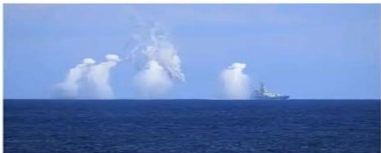  
图1: 现实中的烟幕弹运用

本文针对无人机投放烟幕弹干扰导弹定位这一情景，在烟幕弹的性能、导弹以及无人机的运行参数、初始坐标等数据已经给定的条件下，需要综合考虑多个物体的运动轨迹、烟雾弹的扩散模型对不同情况下无人机投放烟幕弹的策略进行时空上的优化，以达到有效遮挡时间最长这一目标。

## 1.2问题提出

现已经知道了3枚导弹、5架无人机以及真假目标的初始坐标和一些运动参数数据，同时给出了烟幕弹云团的有效遮挡范围及时间，本文需要解决以下问题：

问题一、二：针对单无人机、单烟幕弹干扰单枚导弹的情况，问题一需要考虑运动学以及烟幕弹的效能，分析几何关系，找出有效屏蔽时满足的条件，建立数学模型，算出一组给定的数据下的有效遮挡的时长。问题二从特殊情况拓展到了一般情况，需要综合问题一建立的几何模型，以最大化有效遮挡时长为目标建立优化模型，求解单机单弹的最优投放策略。

问题三：针对单无人机、多烟幕弹干扰单枚导弹的情况，需要规划多枚烟幕弹的投放时序以延长总遮蔽时间。

问题四：不同于问题三单机多弹的情况，同样是投放三校烟幕弹，但是情况变成了三架无人机各自投放一枚烟幕弹对同一枚导弹进行干扰，需要考虑三架无人机在空间上的协调，给出最优的投放策略。

问题五：是一个多机多弹多目标的场景，需要同时解决任务分配（哪架飞机干扰哪枚导弹）和资源调度（每架飞机投几枚弹、何时投）问题，以实现全局最优的有效遮蔽效果。

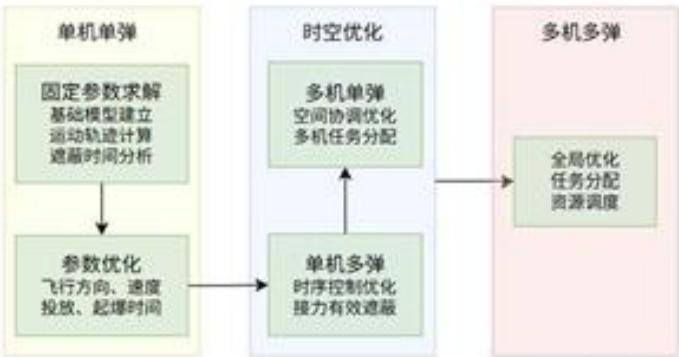  
图 2: 各问题关系图

## 二、问题分析

## 2.1 问题一的分析

问题一是基础情况，要求计算在给定参数下烟幕干扰弹对导弹M1的有效遮蔽时长，首先可以利用题目给定的参数算出烟幕弹起爆时刻烟幕弹和导弹的位置作为后续模型的初值，之后需要根据空间几何的知识找到满足使有效遮挡这一要求成立的几何关系，最后就可以根据初值和该几何关系从起爆时刻进行变步长搜索找出满足有效遮挡的时间范围。

## 2.2 问题二的分析

问题二不同于问题一在给定的参数下求解，而是需要延用问题一的分析，把无人机航向速度、烟幕弹投放、引爆时间四个参数作为决策变量，以最大化有效遮挡时间作为目标函数建立单机单弹情况下的策略优化模型，在满足一些物理约束、运动学约束、边界条件的情况下求解出烟幕弹的最优投放策略。

## 2.3 问题三的分析

问题三基于问题二的优化模型，需协调多枚烟幕弹的投放与起爆时序，避免时间重叠或遗漏，通过时序优化与协同控制延长总有效遮蔽时间。由于三枚烟幕弹是由同一无人机发射，其在空间上位置相差不远，考虑有效遮挡时，可能会存在单个云团不能有效遮挡，而多个云团耦合时会形成有效遮挡的情况。

## 2.4 问题四的分析

问题四是多机单弹拦截同一目标的情况，与问题三的单机多弹模式不同，问题四的核心在于多无人机之间的空间协同和时间协调，这里不需要考虑投弹时间间隔，但是三枚导弹爆炸产生的云团应该避免在空间上过度重叠，同时时间上要保持连续。这需要建立多烟幕弹协同遮蔽的判定模型，分析多个云团在空间上的遮蔽效果叠加关系，在考虑各无人机独立决策的前提下，通过协同目标函数确保整体遮蔽效果最大化。

## 2.5 问题五的分析

问题五是最困难的多机多弹多目标的情况，需要确定哪架无人机去拦截哪枚导弹，每个无人机需要投多少枚烟幕弹以及总体投放的策略，直接考虑所有的决策变量，则变量的维度太大，很难直接快速的计算，因此需要把问题简化，拆分成多个步骤，即要先确定资源分配的策略，再决定烟幕弹投放的策略，以提高计算效率。

## 三、模型假设

1. 将导弹、无人机、烟幕弹、烟幕云团中心以及假目标均视为质点进行运动学分析。

2. 不考虑空气阻力、风速等环境因素对无人机和导弹飞行的影响。

3. 烟幕云团形成后，球心在垂直方向以 $3 \mathrm { m } \cdot \mathrm { s } ^ { - 1 }$ 的速度匀速下沉。

4. 无人机受领任务和调整飞行姿态的时间忽略不计。

## 四、 符号说明

5. 烟幕弹起爆瞬时形成一个半径为10米的理想球状云团，且在有效时间内(20秒)其半径和遮蔽能力保持不变。

<table><tr><td>符号</td><td>含义</td><td>单位</td></tr><tr><td> $P _ { m , i } ( t )$ </td><td>导弹 i 在时刻 t 的位置向量</td><td>m</td></tr><tr><td> $v _ { m , i }$ </td><td>导弹i的速度向量</td><td> $\mathrm { m } / \mathrm { s }$ </td></tr><tr><td> $v _ { m }$ </td><td>导弹速度大小</td><td> $\mathrm { m } / \mathrm { s }$ </td></tr><tr><td> $P _ { f y , j } ( t )$ </td><td>无人机 j 在时刻t 的位置向量</td><td>m</td></tr><tr><td> $v _ { f y , j }$ </td><td>无人机j的速度向量</td><td> $\mathrm { m } / \mathrm { s }$ </td></tr><tr><td> $\theta _ { j }$ </td><td>无人机j的航向角(与 x轴夹角)</td><td>rad</td></tr><tr><td> $P _ { s , j k } ( t )$ </td><td>无人机 j 投放的第 k 枚烟幕弹的位置</td><td>m</td></tr><tr><td> $t _ { d , j k }$ </td><td>烟幕弹投放时间</td><td>s</td></tr><tr><td> $t _ { b , j k }$ </td><td>烟幕弹起爆时间</td><td>s</td></tr><tr><td> $P _ { c , j k } ( t )$ </td><td>烟幕弹爆炸后云团中心的位置</td><td>m</td></tr><tr><td> $v _ { \mathrm { s i n k } }$ </td><td>云团下沉速度</td><td> $\mathrm { m } / \mathrm { s }$ </td></tr><tr><td> $g$ </td><td>重力加速度向量</td><td> $\mathrm { m } / \mathrm { s } ^ { 2 }$ </td></tr><tr><td> $\Omega$ </td><td>真实目标圆柱体表面区域</td><td></td></tr><tr><td> $B o o l ( t )$ </td><td>遮蔽状态布尔函数(1为遮蔽，0为未遮蔽)</td><td></td></tr><tr><td> $t _ { i n }$ </td><td>有效遮蔽开始时刻</td><td>s</td></tr><tr><td> $t _ { o u t }$ </td><td>有效遮蔽结束时刻</td><td>s</td></tr><tr><td> $T$ </td><td>总有效遮蔽时长</td><td>s</td></tr><tr><td> $\Delta t _ { b }$ </td><td>烟幕弹投放至起爆的时间间隔</td><td>s</td></tr><tr><td> $y _ { i j }$ </td><td>无人机 j投向导弹 i的烟幕弹数量</td><td></td></tr></table>

## 五、模型准备

根据题意，本文的所有求解都是建立在空间直角坐标系的基础上进行的，其中假目标视为一个质点作为坐标系原点，水平面作为坐标系的 $x \mathrm { O } y$ 面，竖直向上的方向作为z轴的正方向。现可以绘制出本文的空间直角坐标系，同时利用matlab对各导弹与各无人机的初始位置进行可视化处理：

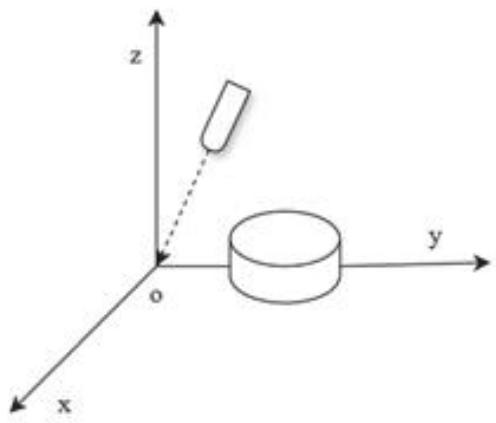  
(a) 坐标系示意图

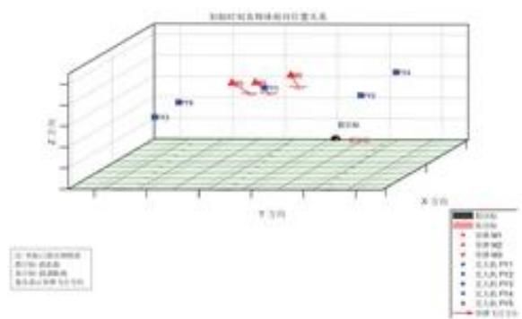  
(b) 初始坐标可视化图  
图3:无人机投弹干扰导弹示意图

通过观察初始时刻的各导弹与无人机的位置，可以发现此时无人机群在导弹群前方按照扇形分布，形成了一个闪现拦截带，扇形的角度约为 $3 0 ^ { \circ }$ ，同时距离目标最远的导弹M1的导弹来向与无人机FY1几乎重合，这说明FY1后续可能对导弹迎面投放烟幕弹，形成烟墙进行阻拦。同时在高度z上，无人机群成梯度配置，可以形成低位前伸烟幕拦截网。

## 5.1 运动轨迹方程

要计算后面的有效遮挡时间，需要根据运动学知识求解出各个导弹、各个无人机及烟幕弹和云团的运动轨迹，再利用几何关系去判断是否满足有效遮蔽的条件，下面给出四个物体的运动轨迹函数推导。

## 5.1.1 导弹轨迹

根据题意，所有的导弹均以300m/s的速度做匀速直线运动，速度的方向沿着导弹与原点的连线方向，利用 ${ \bf v } _ { m , i }$ 表示导弹i的速度向量， $v _ { m }$ 表示导弹的速度大小，其值为 $3 0 0 \mathrm { m } / \mathrm { s } , \mathbf { P } _ { m , i } ( 0 )$ 表示导弹i在初始时刻的位置向量，方向由原点指向导弹，i的取值为1，2，3。

根据方向向量的计算方法可知导弹i的速度向量可以表示为：

$$
\mathbf { v } _ { m , i } = \frac { - \mathbf { P } _ { m , i } ( 0 ) } { \| \mathbf { P } _ { m , i } ( 0 ) \| } \cdot v _ { m } \quad ( i = 1 , 2 , 3 )\tag{5.1}
$$

知道了速度向量后根据匀速直线运动的性质可以算出t时刻导弹i的位置函数即：

$$
{ \bf P } _ { m , i } ( t ) = { \bf P } _ { m , i } ( 0 ) + { \bf v } _ { m , i } \cdot t \quad ( i = 1 , 2 , 3 )\tag{5.2}
$$

## 5.1.2 无人机轨迹

在无人机被指派任务后，无人机将在等高度上沿着确定的航向做匀速直线运动， $z$ 方向上的速度分量为0，因此只需要知道无人机的飞行航向角就可以确定出无人机的速度向量，假设无人机 $j$ 的航线与x轴的正方向的夹角为 $\theta _ { j }$ ，那么速度向量为：

$$
\mathbf { v } _ { f y , j } = ( v _ { f y , j } \cos { \theta _ { j } } , v _ { f y , j } \sin { \theta _ { j } } , 0 ) \quad ( j = 1 , \ldots , 5 )\tag{5.3}
$$

同样的有了无人机的速度向量和初始的位置就能得到无人机的位置函数

$$
\mathbf { P } _ { f y , j } ( t ) = \mathbf { P } _ { f y , j } ( 0 ) + \mathbf { v } _ { f y , j } \cdot t \quad ( j = 1 , \ldots , 5 )\tag{5.4}
$$

## 5.1.3 烟幕弹轨迹

无人机在飞行到指定地点时投放烟幕弹，考虑到重力和惯性的双重作用，烟幕弹投放后做抛体运动，忽略空气阻力的前提下，烟幕弹速度在xOy平面上的投影由于惯性的作用，将维持在此前无人机的速度 $v _ { f y , j }$ ，而在z方向上烟幕弹将在重力加速度g下做自由落体运动，将第 $j$ 个无人机发射出的第k个烟幕弹的速度定义为 $\mathbf { V } _ { \mathrm { s , j k } }$ ，则 $\mathbf { v } _ { \mathrm { s , j k } }$ 可以表示为：

$$
\mathbf { v } _ { { \mathrm { s j k } } } = ( v _ { f y , j } \cos \theta _ { j } , v _ { f y , j } \sin \theta _ { j } , v _ { j k , z } ) \quad ( j = 1 , \ldots , 5 ) ( k = 1 , 2 , 3 )\tag{5.5}
$$

其中 ${ v } _ { j k _ { p } }$ 表示自由落体的速度大小，其值的大小为 $g ( t - t _ { d , j k } ) , t _ { d , j k }$ 是该烟幕弹的投放时间。假设在 $t _ { d , j k }$ 时刻，烟幕弹的坐标为 $\mathbf { P } _ { s , j k } ( t _ { d } )$ ，由于烟幕弹在抛出瞬间的位移可以忽略不记，所以在投放时烟幕弹的坐标等价于无人机的坐标 $\mathbf { P } _ { f y , j } ( t _ { d } )$ ，因此烟幕弹

的位置函数可以表示为：

$$
\mathbf { P } _ { \mathrm { s } , \mathrm { j } \mathrm { k } } ( t ) = \mathbf { P } _ { f y , j } ( t _ { d , j \mathrm { k } } ) + \mathbf { v } _ { f y , j } \cdot ( t - t _ { \mathrm { d , j } \mathrm { k } } ) + \frac { 1 } { 2 } \mathbf { g } \cdot ( t - t _ { \mathrm { d , j } \mathrm { k } } ) ^ { 2 } \quad t \geq t _ { \mathrm { d , j } \mathrm { k } } \quad ( j = 1 , \ldots , 5 ) ( k = 1 , 2 , 3 )\tag{5.6}
$$

其中 $\mathbf { g } = ( 0 , 0 , - g )$ ，g的大小取为 $9 . 8 \mathrm { m / s } ^ { 2 }$ 0

## 5.1.4 云团中心轨迹

烟幕弹爆炸后形成的云团将以团以3m/s的速度匀速下沉，记作 $v _ { s a n k }$ ，要计算云团的轨迹必须要先计算出云团的起爆位置，而计算起爆位置必须要知道起爆时间，

$$
t _ { b , j k } = t _ { d , j k } + \Delta t _ { b , j k } \quad ( j = 1 , 2 , . . . 3 ) ( k = 1 , 2 , 3 )\tag{5.7}
$$

其中 $t _ { b , j k }$ 表示第j架无人机投出的第k枚烟幕弹起爆时间 $\Delta t _ { b , j k }$ 表示该烟幕弹投放至起爆的时间间隔。起爆点位置即烟幕弹在在起爆时刻的轨迹点，即 $\mathbf { P } _ { \mathrm { b j k } } = \mathbf { P } _ { \mathrm { s j k } } ( t _ { \mathrm { b j k } } )$ 所以云团的位置函数为：

$$
\mathbf P _ { \mathrm { c } , \mathrm { j } \mathbf k } ( t ) = ( P _ { \mathrm { b } , \mathrm { j } \mathbf k , x } , P _ { \mathrm { b } , \mathrm { j } \mathbf k , y } , P _ { \mathrm { b } , \mathrm { j } \mathbf k , z } - v _ { \mathrm { s i n k } } \cdot ( t - t _ { \mathrm { b } , \mathrm { j } \mathbf k } ) ) \quad t \geq t _ { \mathrm { b } , \mathrm { j } \mathbf k } \quad ( j = 1 , \ldots , 5 ) ( k = 1 , 2 , 3 )\tag{5.8}
$$

根据上面的四个位置函数就可以计算出各个时刻各物体的空间位置从而进行后面的计算。

## 5.2 有效遮挡判定式

如果把导弹当作一个散发光线的点光源(发射不可见的电磁波)，其产生的光线能够覆盖周围空间，要让圆柱形状的真实目标不被导弹探测，那么导弹产生的光线就不能照射到圆柱上，所以有效遮挡的情境即烟幕弹爆炸生成的云团能够屏蔽所有照向圆柱的光线，使圆柱得到很好的隐匿。可以想象到点光源射向一个球体会在球后生成一个圆锥形的部分区域，只要圆柱能够完全落在这一区域内，那么就能有效地屏蔽导弹的定位。

根据示意图，下面将对有效遮挡这一条件进行数学说明。给定一条由点 $\mathbf { P } _ { 1 }$ 和 $\mathbf { P } _ { 2 }$ 定义的线段，其中 $\mathbf { P } _ { 1 }$ 表示的是导弹在某一时刻的位置， $\mathbf { P } _ { 2 }$ 表示真实目标圆柱上的任意一点，以及此时的云团球体，其球心为C，半径为 $r$ ，判断是否有效遮挡需要判断此线段是否与球体相交。

一个球体 $S ( C , r )$ 由其球心C和半径r唯一定义。空间中任意一点 P位于球面上当且仅当满足： H

$$
| { \bf P } - { \bf C } | = r\tag{5.9}
$$

为避免平方根运算，通常使用平方形式：

$$
( \mathbf { P } - \mathbf { C } ) \cdot ( \mathbf { P } - \mathbf { C } ) = r ^ { 2 }\tag{5.10}
$$

式中·表示向量点积运算。这个方程表达了球面上任意点P到球心C的距离平方

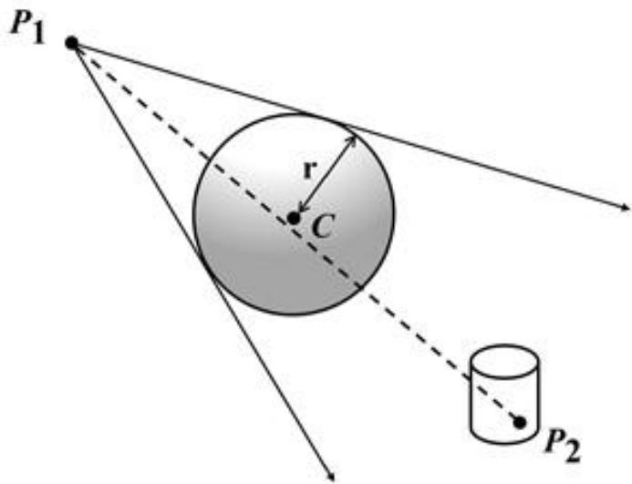  
图 4: 有效遮挡示意图

等于半径平方的几何关系。

同时线段 $P _ { 1 } P _ { 2 }$ 上的任意点 P(t) 可以表示为：

$$
{ \bf P } ( t ) = { \bf P } _ { 1 } + s ( { \bf P } _ { 2 } - { \bf P } _ { 1 } ) , \quad s \in [ 0 , 1 ]\tag{5.11}
$$

其中： $s = 0$ 时， $\mathbf P ( 0 ) = \mathbf P _ { 1 }$ (线段起点); $s = 1$ 时， $\mathbf { P } ( 1 ) = \mathbf { P } _ { 2 }$ (线段终点); $0 < s < 1$ 时， $\mathbf { P } ( t )$ 在线段内部；当 $s < 0$ 或 $s > 1$ 时， $P ( t )$ 位于线段的延长线上。

令 $\mathbf { d } = \mathbf { P } _ { 2 } - \mathbf { P } _ { 1 }$ ，将线段参数方程(5.11)代入球面方程(5.10)，得到：

$$
( \mathbf { P } _ { 1 } + s \mathbf { d } - \mathbf { C } ) \cdot ( \mathbf { P } _ { 1 } + s \mathbf { d } - \mathbf { C } ) = r ^ { 2 }\tag{5.12}
$$

引入向量 $\mathbf { O C } = \mathbf { P } _ { 1 } - \mathbf { C }$ ，表示从球心指向线段起点的向量，则方程简化为：

$$
( \mathbf { O C } + s \mathbf { d } ) \cdot ( \mathbf { O C } + s \mathbf { d } ) = r ^ { 2 }\tag{5.13}
$$

将上面的公式展开得：

$$
s ^ { 2 } ( \mathbf { d } \cdot \mathbf { d } ) + 2 s ( \mathbf { d } \cdot \mathbf { O C } ) + ( \mathbf { O C } \cdot \mathbf { O C } ) - r ^ { 2 } = 0\tag{5.14}
$$

这是一个关于参数s的一元二次方程，标准形式为：

$$
a s ^ { 2 } + b s + c = 0\tag{5.15}
$$

其中系数为：

$$
\begin{array} { r } { a = \mathbf { d } \cdot \mathbf { d } = | \mathbf { d } | ^ { 2 } \qquad b = 2 ( \mathbf { 0 } \mathbf { C } \cdot \mathbf { d } ) \qquad c = \mathbf { 0 } \mathbf { C } \cdot \mathbf { 0 } \mathbf { C } - r ^ { 2 } = | \mathbf { 0 } \mathbf { C } | ^ { 2 } - r ^ { 2 } } \end{array}\tag{5.16}
$$

系数a恒为正（除非d=0，即线段退化为点）， $c$ 的符号取决于 $P _ { 1 }$ 是否在球体内。

利用上面算出的参数表达式，下面根据一元二次方程的判别式进行根的讨论，计算判别式：

$$
\Delta = b ^ { 2 } - 4 a c\tag{5.17}
$$

根据判别式的值判断相交情况： $\Delta < 0$ 无实数解，直线与球体无交点，线段肯定不与球体相交； $\Delta = 0 :$ 一个实数解，直线与球体相切，有一个交点； $\Delta > 0$ 两个实数解，直线贯穿球体，有两个交点。

仅考虑直线与球体的交点的个数不足以说明云团有效地遮挡了导弹的光线，例如当导弹的相对位置运行到了云团和真实目标之间时，线段的延长线仍然可能会与云团有交点，但是却不能遮挡导弹，因此还需要考虑交点与线段 $P _ { 1 } P _ { 2 }$ 的位置关系，只有当两个实数解：

$$
s _ { 1 } = \frac { - b - \sqrt { \Delta } } { 2 a } \qquad s _ { 2 } = \frac { - b + \sqrt { \Delta } } { 2 a }\tag{5.18}
$$

满足以下其中一个条件：至少一个交点在线段上，此时 $s _ { 1 } \in [ 0 , 1 ]$ 或 $s _ { 2 } \in [ 0 , 1 ]$ ，则线段与球体表面相交。这对应于导弹视线从烟幕云团中穿过的情形；线段完全在球体内部，此时 $s _ { 1 } < 0$ 且 $s _ { 2 } > 1$ ，则整个线段都在球体内。这对应于导弹已经完全进入烟幕内部，视线被完全遮蔽的情形。才能说明该点被有效遮挡。而要使整个圆柱被有效遮挡，则圆柱上的任意一点 $P _ { 2 }$ 都应该满足该条件，所以有效遮挡判别式用数学公式表达为：

$$
\forall P _ { 2 } \in \Omega = \{ ( x , y , z ) \in \mathbb { R } ^ { 3 } \mid x ^ { 2 } + ( y - 2 0 0 ) ^ { 2 } \leq 7 ^ { 2 } , \quad 0 \leq z \leq 1 0 \} , \quad P _ { 1 } P _ { 2 } \cap C ( P _ { c } ) \neq \emptyset\tag{5.19}
$$

其中： $\Omega = \{ ( x , y , z ) \in \mathbb { R } ^ { 3 } \mid x ^ { 2 } + ( y - 2 0 0 ) ^ { 2 } \leq 7 ^ { 2 } , \quad 0 \leq z \leq 1 0 \}$ 表示圆柱的整个表$\overline { { P _ { 1 } P _ { 2 } } }$ 表示线段， $C ( P _ { c } )$ 表示以 $C$ 为球心，半径为10m的球体。

## 5.2.1 有效遮蔽时间区间说明

由于导弹和云团的运动速度是恒定的，所以遮蔽情况不会发生突变，只会在一段时间内有效遮蔽，一段时间内没有有效遮蔽。记进入有效遮挡的时刻为 $t _ { \mathrm { i n } } ^ { k }$ ，离开有效遮挡的时间为 $t _ { \mathrm { o u t } } ^ { k }$ ，假设存在n个有效遮挡的连续区间那么这些有效区间都应该满足有效遮挡的判定式：

$$
\forall t \in [ t _ { \mathrm { i n } } ^ { k } , t _ { \mathrm { o u t } } ^ { k } ] , \forall P \in \Omega , \overline { { P _ { 1 } P _ { 2 } } } \cap C ( P _ { c } ( t ) ) \neq \emptyset
$$

同时，满足有效遮挡的时间段应该包含于烟幕弹起爆和烟幕弹浓度降低这两个关键时间点，即求解模型中的时间t应该满足：

$$
t _ { \mathrm { b } } \leq t \leq t _ { \mathrm { b } } + 2 0\tag{5.20}
$$

再进一步推导可以把上述公式变为：

$$
t \in \bigcup _ { k = 1 } ^ { n } [ t _ { \mathrm { i n } } ^ { k } , t _ { \mathrm { o u t } } ^ { k } ] \subseteq [ t _ { \mathrm { b } } , t _ { \mathrm { b } } + 2 0 ]
$$

考虑到每个有效遮挡时间段与总体的时间关系后，还应该考虑每个时间段相互之间的关系，即各个时间段之间没有重叠，它们是相互分离的。即：

$$
[ t _ { \mathrm { i n } } ^ { k } , t _ { \mathrm { o u t } } ^ { k } ] \cap [ t _ { \mathrm { i n } } ^ { k + 1 } , t _ { \mathrm { o u t } } ^ { k + 1 } ] = \emptyset \quad k = ( 1 , 2 . . . n - 1 )
$$

## 5.2.2 判定式相关参数说明

针对单机单弹的情况，根据上文的分析，已经知道了判定有效遮挡所需数据的计算方法，下面进行一个总结：

$P _ { 2 }$ 是圆柱表面上的任意一点，可以利用数学表达式 $\forall P _ { 2 } \in \Omega = \{ ( x , y , z ) \in \mathbb { R } ^ { 3 } \mid$ $x ^ { 2 } + ( y - 2 0 0 ) ^ { 2 } \leq 7 ^ { 2 }$ $0 \leq z \leq 1 0 \}$ 表出，对于导弹在某一时刻的位置 $P _ { 1 }$ ，由导弹的位置函数可以得出：

$$
\mathbf P _ { 1 } = \mathbf P _ { m , i } ( t ) = \mathbf P _ { m , i } ( 0 ) + \mathbf v _ { m } \cdot t\tag{5.21}
$$

云团的球心可以通过云团的位置函数求出：

$$
\begin{array} { r } { \left\{ \begin{array} { l l } { \mathbf { P } _ { \mathrm { c , j k } } ( t ) = ( P _ { \mathrm { b , j k } , z } , P _ { \mathrm { b , j k } , y } , P _ { \mathrm { b , j k } , z } - v _ { \mathrm { s i n k } } \cdot ( t - t _ { \mathrm { b , j k } } ) ) \quad t \geq t _ { \mathrm { b , j k } } } \\ { \mathbf { P } _ { \mathrm { s , j k } } ( t ) = \mathbf { P } _ { f y , i } ( t _ { d j k } ) + \mathbf { v } _ { f y , i } \cdot ( t - t _ { \mathrm { d , j k } } ) + \frac { 1 } { 2 } \mathbf { g } \cdot ( t - t _ { \mathrm { d , j k } } ) ^ { 2 } \quad t \geq t _ { \mathrm { d , j k } } } \\ { \mathbf { v } _ { f y , i } = ( v _ { f y , i } \cos \theta _ { i } , v _ { f y , i } \sin \theta _ { i } , 0 ) } \\ { \mathbf { P } _ { f y , i } ( t ) = \mathbf { P } _ { f y , i } ( 0 ) + \mathbf { v } _ { f y , i } \cdot t } \end{array} \right. } \end{array}\tag{5.22}
$$

## 5.2.3 基于布尔函数的有效遮蔽条件表达

为了便于后文中有效遮挡条件的表述，本文引入了遮蔽状态的布尔函数

$$
B o o l ( t ) = \left\{ \begin{array} { l l } { 1 , } & { \mathrm { i f } \forall P _ { 2 } \in \Omega , \quad \widehat { P _ { 1 } P _ { 2 } } \cap C ( P _ { c } ( t ) ) \neq \mathcal { O } } \\ { 0 , } & { \mathrm { o t h e r w i s e } } \end{array} \right.\tag{5.23}
$$

那么对于有效遮蔽时间区间的开始时刻 $t _ { i n }$ ，其前一段微小时间没有达到有效遮蔽，则其相对应的布尔函数值为0，其后一段微小时间达到了有效遮蔽，则其布尔值输出为1，用数学表达式可以写为：

$$
B o o l ( t _ { i n } ^ { + } ) \wedge \neg B o o l ( t _ { i n } ^ { - } ) = 1\tag{5.24}
$$

同样的，对于有效屏蔽的结束时刻 $t _ { o u t }$ ，其前一段微小时间达到了有效遮蔽，则其相对应的布尔函数值为1，其后一段微小时间没有达到有效遮蔽，则其布尔值输出为0，用数学表达式可以写为：

$$
B o o l ( t _ { o u t } ^ { - } ) \wedge \neg B o o l ( t _ { o u t } ^ { + } ) = 1\tag{5.25}
$$

所以满足有效遮蔽的时刻都应该满足：

$$
T = \{ t \in \mathbb { R } ^ { + } \mid B o o l ( t ) = 1 \}\tag{5.26}
$$

有效遮挡时长及所有有效遮挡时间点的集合，即为这个集合的总长度

$$
T \ = \int _ { 0 } ^ { \infty } B o o l ( t ) d t\tag{5.27}
$$

时间t的积分区间为[0,∞]，这是因为在有效遮挡时间段布尔值才为1，积分即为这一段的时长，而在非有效遮挡的时段，积分值为0，不会对结果造成影响，这样考虑可以避免上文关于存在多段有效时间的考虑，使模型的约束减少，计算效率更优。

## 六、问题一模型建立及求解

问题一针对具体的一个场景，在所有参数都已经给定的情况下(烟幕弹投放时间为1.5s，起爆时间为5.1s)，需要求解单枚烟幕弹对单枚导弹的有效遮挡时长。需要利用各物体的位置函数以及有效遮挡判定式来确定发生有效遮挡的时间段。

## 6.1 有效时长计算模型

## 6.1.1 导弹 M1 与烟幕云团球心的轨迹

根据模型准备部分的分析，可以得出无人机FY1和导弹M1在给定的参数下的位置函数，以及烟幕弹和云团的运动轨迹：

$P _ { 2 }$ 是圆柱表面上的任意一点，可以利用数学表达式 $\forall P _ { 2 } \in \Omega$ 表出，对于导弹在某一时刻的位置 $P _ { 1 }$ ，这里指的是导弹 $M _ { 1 }$ 的位置，由导弹的位置函数可以得出：

$$
\mathbf P _ { 1 } = \mathbf P _ { m , 1 } ( t ) = \mathbf P _ { m , 1 } ( 0 ) + \mathbf v _ { m , 1 } \cdot t\tag{6.1}
$$

云团的球心可以通过云团的位置函数求出：

$$
\begin{array} { r l } & { \left( \mathbf { P } _ { \mathrm { c } , 1 1 } ( t ) = ( R _ { \mathrm { b } , 1 1 , z } , R _ { \mathrm { b } , 1 1 , y } , R _ { \mathrm { b } , 1 1 , z } - v _ { \mathrm { s i n k } } \cdot ( t - t _ { \mathrm { b } , 1 1 } ) ) \quad t \geq t _ { \mathrm { b } , 1 1 } \right. } \\ & { \left. \begin{array} { r l } { \mathbf { P } _ { \mathrm { s } , 1 1 } ( t ) = \mathbf { P } _ { f y 1 } ( t _ { \mathrm { d } 1 1 } ) + \mathbf { v } _ { f y 1 } \cdot ( t - t _ { \mathrm { d } , 1 1 } ) + \frac { 1 } { 2 } \mathbf { g } \cdot ( t - t _ { \mathrm { d } , 1 1 } ) ^ { 2 } } & { t \geq t _ { \mathrm { d } , 1 1 } } \\ { \mathbf { v } _ { f y , 1 } = ( v _ { f y , 1 } \cos \theta _ { 1 } , v _ { f y , 1 } \sin \theta _ { 1 } , 0 ) } & { } \end{array} \right. } \\ & { \left. \begin{array} { r l } { \mathbf { P } _ { f y , 1 } ( t ) = \mathbf { P } _ { f y , 1 } ( 0 ) + \mathbf { v } _ { f y , 1 } \cdot t } & { { } } \end{array} \right. } \end{array}\tag{6.2}
$$

## 6.1.2 判定式说明

该问题考虑的是单枚烟幕弹与单枚导弹的情况，所以只需要考虑单个云团的遮挡，而不存在云团间的耦合，所以满足有效遮挡的判别式为：

$$
B o o l ( t ) = \left\{ \begin{array} { l l } { 1 , } & { \mathrm { i f } \forall P _ { 2 } \in \Omega , \quad \overline { { P _ { m 1 } P _ { 2 } } } \cap C ( P _ { c , 1 1 } ( t ) ) \neq \emptyset } \\ { 0 , } & { \mathrm { o t h e r w i s e } } \end{array} \right.\tag{6.3}
$$

上式中的 $C ( P _ { c , 1 1 } ( t ) )$ 是无人机FY1发射的云团形成的球体， $C _ { 1 1 }$ 是球体的球心，其数值根据即为云团中心轨迹的位置函数 $\mathbf { P } _ { \mathrm { c , j k } } ( t )$ 的大小确定。

## 6.1.3 有效时长计算模型汇总

综上，有效遮挡时间为各有效遮挡时间点的集合长度，，则在固定参数下求解有效遮蔽时长的计算模型如下;

$$
T = \int _ { 0 } ^ { \infty } B o o l ( t ) d t
$$

s.t.

$$
\{ \begin{array} { l l } { \mathbf { P } _ { 1 } = \mathbf { P } _ { m , 1 } ( t ) = \mathbf { P } _ { m , 1 } ( 0 ) + \mathbf { v } _ { m , 1 } \cdot t } \\ { ( \mathbf { P } _ { \mathrm { e } , \mathrm { u } 1 } ( t ) = ( R _ { \mathrm { b } , 1 1 , z } , \vec { R } _ { \mathrm { b } , 1 1 , y } , \vec { R } _ { \mathrm { b } , 1 1 , z } - \vec { v } _ { \mathrm { s i n k } } ; ( t - t _ { \mathrm { b } , 1 1 } ) )   t \geq t _ { \mathrm { b } , 1 1 }  } \\ {  \mathbf { P } _ { \mathrm { s } , \mathrm { u } 1 } ( t ) = \mathbf { P } _ { f y 1 } ( t _ { d 1 1 } ) + \mathbf { v } _ { f y 1 } \cdot ( t - t _ { d , 1 1 } ) + \frac { 1 } { 2 } \mathbf { g } \cdot ( t - t _ { d , 1 1 } ) ^ { 2 }   t \geq t _ { \mathrm { d } , 1 1 }  } \\ {  \mathbf { v } _ { f y , 1 } = ( v _ { f y , 1 } \cos \theta _ { 1 } , v _ { f y , 1 } \sin \theta _ { 1 } , 0 )  } \\ {  \mathbf { P } _ { f y , 1 } ( t ) = \mathbf { P } _ { f y , 1 } ( 0 ) + \mathbf { v } _ { f y , 1 } \cdot t } \\ { B o l ( t ) = \{ \begin{array} { l l } { 1 , } & { \mathrm { i f } \forall P _ { 2 } \in \Omega , \quad \overline { { P _ { m 1 } P _ { 2 } } } \cap C ( P _ { \mathrm { e } , \mathrm { u } 1 } ( t ) ) \neq \emptyset } \\ { 0 , } & { \mathrm { o t h e r w i s e } } \end{array}  } \end{array}\tag{6.4}
$$

## 6.2 模型的求解

## 6.2.1 有效遮蔽时间区间是一段连续的区间

真目标被烟幕云团有效遮蔽的时间必为一段连续时间区间。理由如下：

导弹 M(t) 沿直线匀速靠近原点，云团球心C(t) 仅沿竖直方向匀速下沉，这些运动轨迹均为连续且单调的函数。对于给定时刻t，圆柱是否被完全遮蔽，相当于判断：从导弹出发的所有视线是否都被半径固定的球B(t)阻挡，是否遮蔽由导弹、云团和圆柱的相对位置关系决定，而这一几何关系是随时间连续演化的。

由于导弹和云团的运动没有振荡或往复，遮蔽关系的变化只能按以下顺序单调发生:初始时圆柱不在阴影之内；随后随着导弹接近和云团下沉，烟幕阴影的投影逐渐扩大并首次完全覆盖圆柱；此后在一段时间内圆柱保持完全遮蔽；最终阴影边界离开圆柱，完全遮蔽消失。整个过程中不存在的跳跃，因为对应的几何覆盖条件在连续单调的运动下只能经历一次进入和一次退出。由此可知，圆柱整体的完全遮蔽持续时间必然构成一个连通区间(在本问题的实际参数下为非空)，即一段连续的时间区间。

## 6.2.2 求解定位圆周简化证明

问题一需要判断射向真目标圆柱体上任意一点的视线线段是否与半径为10米的烟幕球体相交。而这显然是不可能实现的，在求解过程中，只能对圆柱体进行离散化取点，而直接对整个圆柱体进行离散化取点会导致求解效率低下。 go

注意到:要判断一个物体是否被完全遮蔽，只需判断它最难被遮蔽的部分即可。对于圆柱体，这个最难被遮蔽的部分是从导弹的视角观察到的物体的外轮廓线（如图5所

示)。如果圆柱的外轮廓线被完全遮蔽，那么物体表面上所有在轮廓线内部的点也必然被遮蔽。对于圆柱体而言，其轮廓线通常由上下底面圆周的两段圆弧和两条侧面的竖直母线构成(如图6所示)。

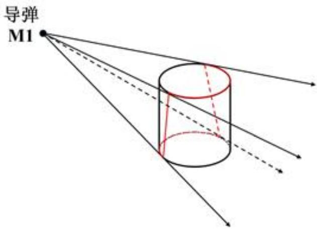  
图5: 导弹视角下观察圆柱

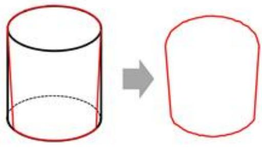  
图6: 导弹视角下圆柱体的外轮廓

因此，我们将判断整个圆柱体是否被烟幕云团遮蔽简化为:判断圆柱体在导弹的视角下的外轮廓是否被烟幕云团完全遮蔽。

经过进一步的分析，我们发现利用烟幕球体的凸性，可以再次简化这个问题：只需判断圆柱体上下两个底面圆周是否被完全遮蔽，即可判定整个圆柱体是否被完全遮蔽。具体证明如下。

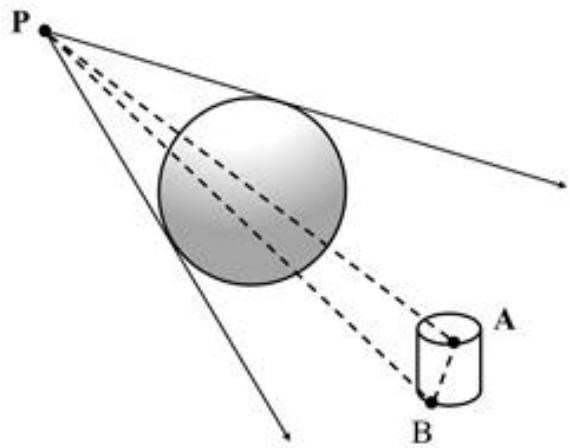  
图 7: 圆柱体被遮蔽示意图

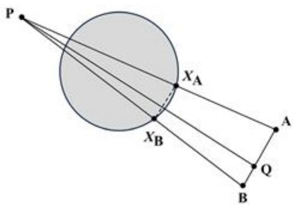  
图 8: 截面 PAB 示意图

命题:若导弹位置为P，且对于任意分别位于上底和下底圆周上的两点A(上底)和B（下底）对应的射线 PA与 PB都与烟幕球体 S相交（即被遮挡)，则对于线段AB 上任意一点 Q，射线 PQ也与烟幕球体 S 相交（也被遮挡)。

证明.因为 PA 与 PB 都与 S 相交，这说明平面 PAB 和球体 S的交集不为空，它们的交集为一个圆盘。在平面PAB上，令：

$$
D : = S \cap \mp \sqrt { \eta } P A B
$$

区域D是一个闭的圆盘。要证明原命题，即证明在二维平面内，从点P指向位于 A 与 B 之间任一点 $Q$ 的线段也与圆盘D相交。

令 $X _ { A }$ 为 $P A$ 与 D的某个交点。同理取 $X _ { B }$ 为 PB 与D的某一个交点。则有$X _ { A } , X _ { B } \in D .$

因为D是凸的，线段 $X _ { A } X _ { B }$ 完全包含在D内。

因为 $X _ { A } \in P A$ 且 $X _ { B } \in P B ,$ 因此 $X _ { A } X _ { B }$ 是位于三角形PAB内部的一条连线(或在其边界上)。从P指向边AB上任意一点Q的线段必与线段 $X _ { A } X _ { B }$ 相交。

又由于线段 $X _ { A } X _ { B } \subset D$ ，所以线段 PQ 和线段 $X _ { A } X _ { B }$ 交点也属于D。因此射线 $P Q$ 与D相交，得证。 □

## 6.2.3 圆周离散化及采样点数的选取

根据前文的证明，我们只需判断圆柱体的上下底面圆周是否被完全遮蔽。在数值计算中，我们通过在圆周上均匀选取有限个采样点来近似模拟连续的圆周。

采样点数（记为n)的选取需要在计算精度和效率之间取得平衡。为了量化几何近似的精度，我们计算了内接正n边形与圆的面积相对误差。从表2可以看出，当 $n = 3 0 0$ 时，相对误差仅为0.0073%，此时正300边形在几何上已经能够很好地逼近圆。

表2: 不同 n值下正 n 边形与圆的面积相对误差
<table><tr><td>取点个数(n)</td><td>100</td><td>200</td><td>300</td><td>500</td><td>1000</td></tr><tr><td>相对误差 (%)</td><td>0.06578</td><td>0.01645</td><td>0.00731</td><td>0.00263</td><td>0.00066</td></tr></table>

因此，在模型的求解过程中，我们暂时选取 $n = 3 0 0$ ，即在上下底面圆周上各均匀取300个点进行遮蔽判断。该选择的合理性将在后文的结果验证部分通过敏感性分析进一步确认。

## 6.2.4 二分法查找有效遮挡时间段的开始和结束时刻

上文已经说明了有效遮挡的时间段是一段单一连续的时间段，故本问可以通过二分查找法来搜寻有效遮挡时间段的开始时刻 $t _ { i n }$ 和结束时刻 $t _ { o u t }$

算法包含两个阶段:第一步，需要找到一个在有效遮蔽区间内部的时刻 $t ^ { * }$ ；第二步，利用该时刻作为端点，通过二分法分别逼近有效遮蔽区间的开始时刻 $t _ { \mathrm { i n } }$ 和结束时刻 $t _ { \mathrm { o u t } }$ 6

Step1算法初始化:定义初始点集 $S _ { 0 } = \{ t _ { b } , t _ { b } + 1 0 , t _ { b } + 2 0 \}$ ，设置时间精度 $\varepsilon _ { 0 } = 1 0 ^ { - 5 }$ 定义初始时间网格尺寸 $\delta _ { 0 } = 1 0$ (即 $S _ { 0 }$ 中相邻两点的初始间距)。 cn

Step2 迭代点集：若当前迭代的网格尺寸 $\delta _ { k } < \varepsilon _ { 0 }$ ，则算法终止，转至step4。基于有序集合 $S _ { k } = \{ s _ { 1 } , s _ { 2 } , \ldots , s _ { m } \}$ ，生成新的测试点集 $S _ { n e w } = \{ \frac { s _ { i } + s _ { i + 1 } } { 2 } \} _ { i = 1 } ^ { m - 1 }$ 。对每一个满足 $t \in S _ { n e w }$ 的 t 计算遮蔽状态 $C ( t )$

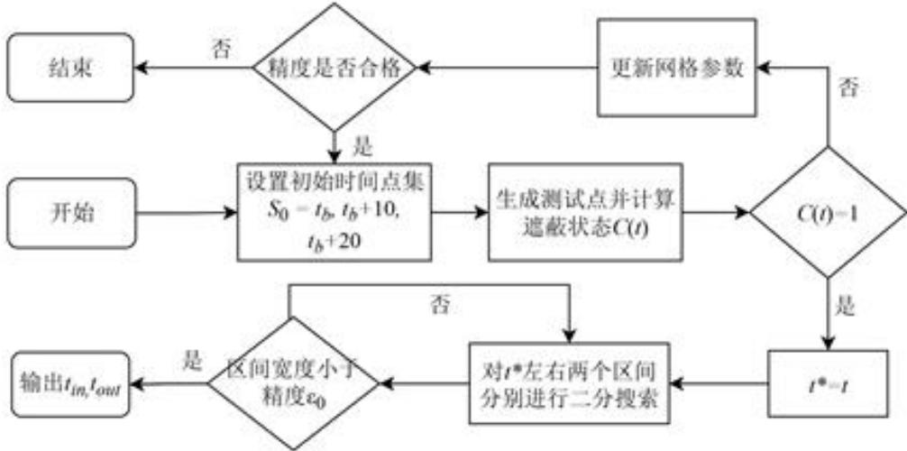  
图 9: 问题一算法总体流程图

Step 3 检验新的测试点集：若 $S _ { n e w }$ 中存在 t 满足 $C ( t ) = 1$ ，则令 $t ^ { * } = t$ ，成功找到有效遮挡时间段内的一个时刻，结束算法。

若不存在这样的t，则通过合并点集来更新 $S _ { k + 1 } = S _ { k } \cup S _ { n e w }$ ，并更新网格尺寸$\delta _ { k + 1 } = \delta _ { k } / 2$ 转至 step2 继续迭代。

Step4终止条件：若在有限次迭代后，仍未找到满足 $C ( t ) = 1$ 的点，即在网格精度高于 $\varepsilon _ { 0 }$ 前仍未找到满足 $C ( t ) = 1$ 的点，则可以判定有效遮蔽区间的长度小于当前搜索精度 $\varepsilon _ { 0 }$ ，算法终止。

## 6.2.5 用二分查找法求解有效遮蔽区间的起始时刻 $t _ { i } n$

二分查找法的示意图以及具体步骤如下：

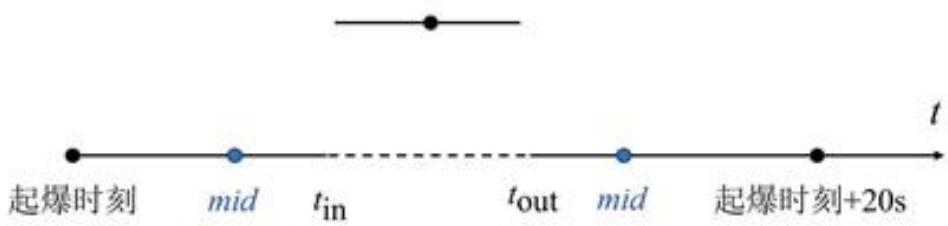  
图10: 二分查找法示意图

Step1初始化搜索区间:设定初始搜索区间为 $[ l e f t , r i g h t ] = [ t _ { b } , t ^ { * } ]$ ，其中 $t _ { b }$ 是烟幕起爆时刻。设定时间精度 $\varepsilon = 1 0 ^ { - 5 }$ 。初始化起始时刻的当前值为 $t _ { \mathrm { i n } } = t ^ { * }$ 0

Step2计算中间点:根据当前区间 $[ l e f t , r i g h t ]$ ，计算中点 $m i d = ( l e f t + r i g h t ) / 2$ 计算 C(mid)的值来判断在mid时刻真目标是否被完全遮蔽。 X

Step 3 更新区间：如果 $C ( m i d ) = 1$ ，说明mid时刻仍在有效遮蔽期内，真正的起始时刻可能等于或早于mid。我们记录下这个可能的新边界 $t _ { \mathrm { i n } } = m i d$ 并向左继续搜索，更新区间为 $[ l e f t , m i d ]$

如果 $C ( m i d ) = 0$ ，说明mid时刻已经早于有效遮蔽期的起始点，起始时刻必然在$_ { m i d }$ 之后。目标值位于[mid,right]，更新区间为 $[ m i d , r i g h t ]$ g

Step 4 求解结果：循环迭代直至区间宽度 $r i g h t - l e f t < \varepsilon$ 。迭代结束时， $t _ { \mathrm { i n } }$ 的最终值即为有效遮蔽区间的精确起始时刻。

## 6.2.6 用二分查找法求解有效遮蔽区间的结束时刻 $t _ { o u t }$

求解结束时刻 $t _ { \mathrm { o u t } }$ 的过程与求解 $t _ { \mathrm { i n } }$ 的方法完全类似，同样采用二分查找法，其不同之处仅在于：

1. 初始搜索区间设定为 $[ l e f t , r i g h t ] = [ t ^ { * } , t _ { b } + 2 0 ]$ 6

2. 区间更新逻辑 (Step 3):

如果 $C ( m i d ) = 1$ ，说明有效遮蔽尚未结束，真正的结束时刻位于或晚于mid，因此向右搜索，更新区间为 $[ m i d , r i g h t ]$

如果 $C ( m i d ) = 0$ ，说明mid时刻已超出有效遮蔽范围，结束时刻必然早于 $_ { m i d }$ 因此向左搜索，更新区间为 $[ l e f t , m i d ]$ 0

算法的其余步骤与终止条件均与求解 $t _ { \mathrm { i n } }$ 的过程相同。

## 6.3 结果展示

通过前文所述的计算方法，得到有效遮挡时间段的开始时刻 $t _ { i n }$ 和结束时刻 $t _ { o u t }$ 然后将求得的起止时刻相减，即可得到问题一需要求得的有效遮蔽时长 $T = t _ { \mathrm { o u t } } - t _ { \mathrm { i n } }$ 。我们最终求得的烟幕干扰弹对M1的有效遮蔽时长为1.391643s。

## 6.4 结果的分析与验证

## 6.4.1 离散化点数 n 的敏感性分析

为验证模型求解过程中所选取的圆周离散化点数 $n = 3 0 0$ 的合理性与结果的稳定性，我们进行了一项敏感性分析。我们分别取 $n = \{ 1 0 0 , 2 0 0 , 3 0 0 , 5 0 0 , 1 0 0 0 \}$ ，并重复问题一的完整求解过程，得到的有效遮蔽时间结果如表3所示。

表3: 不同n值下的有效遮蔽时长
<table><tr><td>取点个数(n)</td><td>100</td><td>200</td><td>300</td><td>500</td><td>1000</td></tr><tr><td>有效时长(s)</td><td>1.391646</td><td>1.391644</td><td>1.391643</td><td>1.391643</td><td>1.391643</td></tr></table>

从上表可以看出，当 $n \geq 3 0 0$ 时，计算得到的有效遮蔽时长在小数点后六位上保持一致，表明结果已经收敛。这证明我们选择 $n = 3 0 0$ 不仅保证了计算结果的精确性和稳定性，也避免了因n值过大而导致的额外计算开销。因此，我们认为基于 $n = 3 0 0$ 出的有效遮蔽时长1.391643s是可靠的。

## 七、问题二模型建立及求解

问题二在问题一建立的数学模型基础上，从固定参数计算提升到多参数的优化，这是一个典型的非线性优化问题。在实际军事应用中，烟幕干扰弹的投放策略优化具有重

要意义通过精确控制无人机的飞行参数和烟幕弹的引爆时间，可以在最合适的时间、最合适的位置形成有效遮蔽。本问针对这一背景进行最优策略的研究，下面对问题二的优化模型的建立进行详细说明：

## 7.1 单机单弹优化模型的建立

## 7.1.1 决策变量定义

本问需要决策无人机FY1往哪边飞，以多大的速度飞，何时投放烟幕弹，何时引爆烟幕弹这四个问题。因此本文定义了一个四维决策空间：

$$
\mathcal { X } = ( \theta , v _ { f y } , t _ { d } , t _ { b } ) \in \mathbb { R } ^ { 4 }\tag{7.1}
$$

其中各变量的物理含义和约束范围如下：航向角θ：决定了无人机的飞行方向，直接影响烟幕弹的投放位置。 $\theta \in [ 0 , 2 \pi ]$ 覆盖所有可能的方向选择。飞行速度 $v _ { f y }$ ：影响无人机到达投放点的时间， $v \ [ 7 0 , 1 4 0 ] m / s$ 反映了无人机的性能限制。投放时间 $t _ { d } { : }$ 决定了烟幕弹何时开始自由飞行， $t _ { d } \geq 0$ 表示在受领任务后的某个时间点投放。

## 7.1.2 目标函数设置

研究烟幕弹的投放策略最终的目的在于延长有效遮档的时间，所以应该选取最大化有效遮挡时间作为目标函数，因此求解最优策略的目标函数 $f ( \mathbf { x } )$ 的表达式为：

$$
\operatorname* { m a x } \quad f ( \mathcal X ) = t _ { \mathrm { o u t } } - t _ { \mathrm { i n } } = \int _ { 0 } ^ { \infty } B o o l ( t ) d t\tag{7.2}
$$

## 7.1.3 约束条件分析

速度约束：无人机FY1的飞行速度 $v _ { f y }$ 必须是一个在 70 m/s 到 140 m/s 的区间内的常数。

$$
7 0 \leq v _ { f y } \leq 1 4 0\tag{7.3}
$$

飞行方向角约束：无人机的飞行方向角θ可以是水平面内的任意方向， $\theta \in \left[ 0 , 2 \pi \right]$ 就能覆盖所有可能的飞行方向：

$$
0 \leq \theta < 2 \pi\tag{7.4}
$$

等高度飞行约束：无人机须在初始高度1800米进行等高度飞行，其飞行速度的垂直分量为0。

时间约束：烟幕弹的投放时间 $t _ { d }$ 必须在任务开始后，烟幕弹的起爆时间 $t _ { b }$ 必须晚于或等于其投放时间 $t _ { d }$ 因此两者应该满足： cn

$$
t _ { d } , t _ { b } \geq 0 , t _ { d } \leq t _ { b }\tag{7.5}
$$

有效遮蔽窗口约束：烟幕云团仅在起爆后的20秒内可以提供有效遮蔽。因此，最终计算出的有效遮蔽时间区间 $[ t _ { i n } , t _ { o u t } ]$ 必须完全包含在 $[ t _ { b } , t _ { b } + 2 0 ]$ 这个时间窗口内：

$$
[ t _ { i n } , t _ { o u t } ] \subseteq [ t _ { b } , t _ { b } + 2 0 ]\tag{7.6}
$$

有效遮挡判定约束：根据第一问的分析，单一烟幕弹对于导弹M1的有效遮挡判定是根据定义的布尔函数确定的，所以：

$$
B o o l ( t ) = \left\{ \begin{array} { l l } { 1 , } & { \mathrm { i f } \forall P _ { 2 } \in \Omega , \quad \overline { { P _ { m 1 } P _ { 2 } } } \cap C ( P _ { c , 1 1 } ( t ) ) \neq \emptyset } \\ { 0 , } & { \mathrm { o t h e r w i s e } } \end{array} \right.\tag{7.7}
$$

## 7.1.4 模型汇总

综上求解本问题的优化模型为：

s.t

$$
\begin{array} { r l } & { \begin{array} { c } { m a x \cdot  { f } ( X ) = \int _ { 0 } ^ { \infty } B o a l ( t ) d t } \\ { [ v _ { F \rho } + [ v _ { 0 } , 1 4 0 ] , t _ { b } \ge t _ { d } + 1 , t _ { d } \ge 0 , \theta \in [ 0 , 2 \pi ] ] } \end{array} } \\ & { \begin{array} { r l } { [ u _ { t , 0 } + z \in t _ { b } + 2 0 0  } \\ { [ t _ { b , 1 } ( t ) - \mathbf { P } _ { \mathrm { n } , 1 } ( t ) + \mathbf { v } _ { \mathrm { n } , 1 } \cdot t  } \end{array}  } \\ { [ } & { \begin{array} { l } { \mathbf { P } _ { \mathrm { e } , 1 } ( t ) - \mathbf { P } _ { \mathrm { n } , 1 } ( t ) + \mathbf { v } _ { \mathrm { n } , 1 } \cdot t } \\ { \mathbf { P } _ { \mathrm { e } , 1 } ( t ) - ( \mathbf { P } _ { \mathrm { n } , 2 } \cdot \mathbf { P } _ { \mathrm { n } , 3 } \cdot \mathbf { P } _ { \mathrm { n } , 3 } - v _ { \mathrm { n } , 4 } \cdot ( t - t _ { b } ) ) \cdot \mathbf {  { f } } \ge t _ { b } } \\ { [ \mathbf { P } _ { \mathrm { n } , 1 } ( t ) - \mathbf { P } _ { \mathrm { f } , 1 } ( t _ { b } ) + \mathbf { v } _ { \mathrm { f } , 1 } \cdot ( t - t _ { b } ) + \mathbf {  { f } } \mathbf { \cdot } ( t - t _ { d } ) ^ { 2 } \cdot \mathbf {  { f } } \in t _ { b } } \\ { [ \mathbf { P } _ { \mathrm { f } , 1 } ( t ) - ( \mathbf { P } _ { \mathrm { f } , 1 } \cos \theta , \mathbf { P } _ { \mathrm { f } , 1 } \sin \theta , 0 )  } \end{array}  } \\ { [ } &  \begin{array} { l }  B o a l ( t ) - \mathbf { p } _ { \mathrm { f } , 1 } ( t ) + \mathbf { v } _ { \mathrm { f } , 1 } \cdot t \end{array} \end{array}\tag{7.8}
$$

## 7.2 优化模型求解

## 7.2.1 多起点变步长搜索寻优

由于本问题的目标函数有效遮蔽时长 f(X)没有解析表达式，其函数值需要通过模拟仿真才能得到，这导致它的梯度信息难以计算，传统的梯度下降等优化算法不再适用。因此，我们设计了一种多起点变步长搜索算法。通过在可行域内进行多次随机采样来保证解的全局探索性，并对每个采样点采用自适应变步长的坐标搜索方法进行局部寻优，从而有效平衡了全局搜索与局部收敛的效率，并且能够防止陷入局部最优。

Step1初始化与全局采样:为避免陷入局部最优，我们首先在整个可行解空间内进行全局随机抽样，生成N个初始解作为局部搜索的起点。

每一个初始解 $\mathcal { X } ^ { ( i ) } = ( \theta , v _ { f y } , t _ { d } , t _ { b } )$ 都是通过在其四个决策变量的各自可行域，进行独立的均匀随机采样而生成的。这保证了初始种群在整个多维参数空间中的分布是均匀

的，从而更有可能找到全局最优解。

Step 2 生成测试解：对每一个初始解 $\chi ( \div )$ ，执行一次变步长坐标搜索进行局部寻优。令当前迭代的最优解为 $\mathcal { X } _ { b e s t }$ ，并初始化步长衰减等级 $k = 0$ 。算法迭代执行直至k达到最大预设值 $K _ { m a z }$

依次遍历四个决策变量维度(j=1,2,3,4)。在当前维度j上，生成两个测试解：

$$
\chi ^ { + } = \chi _ { b e s t } + \frac { \Delta _ { j } } { 2 ^ { k } } \cdot { \bf e } _ { j }
$$

$$
\chi ^ { - } = \chi _ { b e s t } - \frac { \Delta _ { j } } { 2 ^ { k } } \cdot { \bf e } _ { j }
$$

其中 $\Delta _ { j }$ 是维度j的初始搜索步长， $\mathbf { e } _ { j }$ 是该维度的单位基向量。

Step 3 择优更新：若 $f ( \mathcal { X } ^ { + } ) > f ( \mathcal { X } _ { b e s t } )$ 或 $f ( \mathcal { X } ^ { - } ) > f ( \mathcal { X } _ { b e s t } )$ ，则更新 $\chi _ { b e s t }$ 为更优的解

若本轮搜索未能找到更优解，则对步长进行衰减， $k \gets k + 1$

否则，保持k不变，以更新后的 $\mathcal { X } _ { b e s t }$ 为中心开始新一轮的坐标轮换探索。

Step 4 确定全局最优解:

将 Step2的局部寻优过程应用于全部 N 个初始点，会得到 N个对应的局部最优点。最后，通过比较这N个点的目标函数值，选取其中最大者，即为最终求得的全局最优投放策略。

## 7.2.2 单个无人机单个干扰弹的投放最优策略

根据以上算法步骤，我们最终求出：无人机FY1在受领任务0.8977s后投放一枚烟幕干扰弹，间隔0.0497s后起爆，这样有效遮蔽时长最长，最长有效遮蔽时长为4.5873s。飞行方向：5.168°(0.0902弧度)，无人机朝x轴正方向略偏向y轴正方向飞行。飞行速度为136.3663m/s，无人机以接近其速度的上限飞行，以求尽快抵达最优投放区域。烟幕干扰弹投放点坐标 $( x , y , z )$ 为(17921.9184,11.0270,1800.0000)，烟幕干扰弹起爆点坐标 $( x , y , z )$ 为(17928.6682, 11.6375, 1799.9879)。

## 7.3 结果的分析与验证

为验证本文所采用的多起点变步长搜索算法求解这个优化模型的可靠性与准确性，我们采用粒子群优化算法对问题二进行独立的再次求解。粒子群算法在解空间中进行全局搜索，同样适用于求解目标函数复杂、非凸的优化问题。将两种算法求解得到的最优投放策略进行对比，具体结果如表4所示：

表4:两种优化算法最优策略对比
<table><tr><td>决策变量/目标</td><td>变步长搜索(本文算法)</td><td>粒子群优化(PSO)</td></tr><tr><td>最长有效遮蔽时长(s)</td><td>4.587300</td><td>4.587772</td></tr><tr><td>飞行方向(弧度)</td><td>0.0902</td><td>0.0880</td></tr><tr><td>飞行速度(m/s)</td><td>136.3663</td><td>137.8825</td></tr><tr><td>投放时间 td (s)</td><td>0.8977</td><td>0.9389</td></tr><tr><td>起爆延迟  $\Delta t _ { b }$  (s)</td><td>0.0497</td><td>0.0106</td></tr></table>

从表4可以看出，两种截然不同的优化算法所求得的最长有效遮蔽时长分别为4.5873 秒和4.5878秒，相对误差仅为0.01%。这表明我们的多起点变步长搜索算法在求解这个优化模型上的准确性和可靠性很高。

另外，两种算法给出的最优策略在核心特征上保持一致。比如，无人机的飞行速度都接近其性能上限(140m/s)，飞行方向角都非常小(约0.09弧度/5角度，即朝x轴正向略偏向y轴正方向飞行)，投放时间都在0.9秒左右。从这些相似之处我们可以得出最优策略的一些规律:要最有效遮挡其视线，理想的烟幕云团就应该位于导弹到真目标这条视线路径上。并且无人机FY1的初始位置在导弹到真目标和导弹到假目标这两个直线附近。因此，最直接高效的投放策略就是迎着导弹来的方向飞过去，这样就能最快地将烟幕干扰弹部署到导弹的必经之路上，形成一道迎面的烟幕云团。微小的角度偏差(5.1°)是为了更好地对准圆柱体轮廓而非仅仅是其中心点所做出的精细调整。

## 八、问题三模型建立及求解

问题三在问题二的基础上，从单架无人机投放一枚烟幕弹提升到了单架无人机投放多枚烟幕弹，这就导致需要综合考虑三枚烟幕弹的投放时间序列、引爆时间序列、飞机的航向速度等，确定出一个能够有效衔接并且最大化总有效遮挡时间的方案，在本问中，优化模型中关于时间的变量从两个单独的时间变为了两个相互关联的时间序列。下面对这种单机多弹的优化模型的建立进行说明。

## 8.1 单机多弹优化模型的建立

## 8.1.1 决策变量的定义

同问题一一样，本问只考虑一架无人机，所以设该无人机的航向和速度分别为θ和$v _ { f y }$ ，而起爆时间和引爆时间都变成了三个，因此令三枚烟幕弹的投放时间和起爆时间分别为 $t _ { d 1 } 1 , t _ { d 2 } , t _ { d 3 }$ 和 $t _ { b 1 } , t _ { b 2 } , t _ { b 3 }$ 。所以本问的决策空间变为:

$$
\mathcal { X } = ( \theta , v _ { f y } , t _ { d , 1 } , t _ { d , 2 } , t _ { d , 3 } , t _ { b , 1 } , t _ { b , 2 } , t _ { b , 3 } )\tag{8.1}
$$

这些决策变量都应该约束在相应的范围内，下文将给出详细说明。

## 8.1.2 目标函数设置

前文已经说明了单枚烟幕弹对同一个导弹的有效遮挡时间是一段单一连续的时间段，但是在引入另外两校烟幕弹后，不同的烟幕弹对同一导弹的有效遮挡时间段可能会由于投放时间序列和引爆时间序列的决策而发生重叠或者衔接，因此本问中有效遮挡的时间段不再由单一的两个时间点决定，而是需要综合三枚烟幕弹共同的有效遮挡效果。

原有的判定式是判断导弹视线 $P _ { m 1 } P _ { 2 }$ 是否与单个球体 $C ( P _ { c } )$ 相交。现在，我们需要判断视线是否与任意一个烟幕云团相交。在时刻t，真目标圆柱体被有效遮蔽的条件是:对于圆柱体表面上的任意一点 $P _ { 2 }$ ，连接导弹位置 $P _ { m 1 } ( t )$ 与 $P _ { 2 }$ 的视线线段 $P _ { m 1 } P _ { 2 }$ 至少与这3个烟幕云团中的一个相交。

新的有效遮挡判定式为：

$$
\forall P _ { 2 } \in \Omega , \quad \exists k \in \{ 1 , 2 , 3 \} \quad \mathrm { s . t . } \quad P _ { m 1 } ( t ) P _ { 2 } \cap C ( P _ { c , k } ( t ) ) \neq \emptyset\tag{8.2}
$$

其中 $C ( P _ { c , k } )$ 代表 FY1 投下的第 k 个有效云团。

基于此，我们重新定义布尔函数Bool(t):

$$
B o o l ( t ) = \left\{ \begin{array} { l l } { 1 , } & { \mathrm { i f } \ \forall P _ { 2 } \in \Omega , \quad \left( \bigcup _ { k = 1 } ^ { N ( t ) } C ( P _ { c , k } ) \right) \cap \overline { { P _ { m 1 } ( t ) P _ { 2 } } } \neq \mathcal { O } } \\ { 0 , } & { \mathrm { o t h e r w i s e } } \end{array} \right.\tag{8.3}
$$

这里的 $N ( t )$ 表示在时刻t处于有效期内的云团总数。这个函数 $B o o l ( t ) = 1$ 的时刻t，就构成了总的有效遮蔽时间。

令 $T$ 为所有满足 $B o o l ( t ) = 1$ 的时刻t的集合。这个集合可能是由多个不连续的时间段组成的。

$$
T = \{ t \in \mathbb { R } ^ { + } \mid B o o l ( t ) = 1 \}\tag{8.4}
$$

目标函数即为这个集合的总长度：

$$
\operatorname* { m a x } \quad f ( \chi ) = \int _ { 0 } ^ { \infty } B o o l ( t ) d t\tag{8.5}
$$

## 8.1.3 约束条件分析

物理约束：决策变量以及一些量的取值范围应该符合题意与物理实际，所以应该满足：

$$
\left\{ \begin{array} { l l } { { 7 0 \leq v _ { f y } \leq 1 4 0 \quad , \quad 0 \leq \theta \leq 2 \pi \quad , \quad v _ { f y , z } = 0 } } \\ { { t _ { d , k } , t _ { b , k } \geq 0 \quad k = ( 1 , 2 , 3 ) } } \\ { { t _ { b , k } \geq t _ { d , k } \quad k = ( 1 , 2 , 3 ) } } \end{array} \right.\tag{8.6}
$$

有效遮蔽窗口约束:烟幕弹爆炸产生的云团只在起爆后的20s内可以提供有效遮

挡，因此每一枚烟幕弹的有效遮挡时长应该含与起爆时刻到起爆20s这两个时刻之间：

$$
[ t _ { i n , k } , t _ { o u t , k } ] \subseteq [ t _ { b , k } , t _ { b , k } + 2 0 ] \quad ( k = 1 , 2 , 3 )\tag{8.7}
$$

投放延迟约束：根据题意虽然同一烟幕弹投放时间和引爆时间没有影响，但同一架无人机投放多枚烟幕弹，其投放间隔必须在1s以上：

$$
t _ { d , k } \le t _ { d , k + 1 } - 1 ~ ( k = 1 , 2 )\tag{8.8}
$$

## 8.1.4 模型汇总

综上，单架无人机投放多枚烟幕弹的策略优化模型为

$$
\operatorname* { m a x } \quad f ( \chi ) = \int _ { 0 } ^ { \infty } B o o l ( t ) d t
$$

s.t.

$$
\{ \begin{array} { l l } { \{ \begin{array} { l l } { \eta _ { 0 } \leq v _ { b } \leq 1 6 0 } \\ { \epsilon _ { 1 , k } + \eta _ { 0 } } \\ { \epsilon _ { 2 , k } + \eta _ { k } \leq 0 } \\ { \epsilon _ { 3 , k } \geq t _ { 3 } } \\ { \epsilon _ { 4 , k } \geq t _ { 4 , k } - ( 1 , 2 , 3 ) } \\ { t _ { 3 } \geq t _ { 4 , k } + \eta _ { 0 } } \\ { \epsilon _ { 5 , k } \geq 0 , \quad \epsilon _ { 6 } + 2 0 } \end{array}  } & { \epsilon _ { 1 , 2 , 3 } > 0 , } \\ { \{ \begin{array} { l l } { 1 , } \\ { t _ { 3 } < t _ { 4 , k + 1 } - 1 , } \\ { 0 , } \\ { \epsilon _ { 5 , k } ( t _ { 3 } - \eta _ { 5 , 1 , 3 } ) + \eta _ { 1 } \leq 0 , } \\ { \epsilon _ { 1 , k } ( t _ { 5 } - \eta _ { 6 , 3 , k } - \eta _ { 5 , 1 , 3 } ) + \eta _ { 0 } \leq 2 \pi \delta _ { k , k } - ( t _ { 6 } - t _ { 6 } ) \delta _ { k , k } } \end{array}  } \\ { \{ \begin{array} { l l } { \mathbf { P } _ { \alpha , 3 1 } ( t _ { 5 } ) = \mathbf { P } _ { \alpha , 5 } ( t _ { 6 } ) + \mathbf { P } _ { \alpha , 5 } ( t - t _ { 6 } ) + \eta _ { 5 } \leq 0 , } \\ { \mathbf { P } _ { \alpha , 3 1 } ( t _ { 5 } - \eta _ { 6 , 3 } ) + \eta _ { 5 } \leq 0 , } \\ { \mathbf { P } _ { \alpha , 3 1 } ( t _ { 5 } - \eta _ { 5 , 1 , 3 } ) + \eta _ { 0 } \leq 2 \pi \delta _ { k , k } + \eta _ { 0 } \leq 2 \pi \delta _ { k , k } - ( t _ { 6 } - t _ { 6 } ) \delta _ { k , k } } \end{array} \} } & { \geq \hat { \mathbf { E } } _ { \beta , k } } \\  \{ \begin{array}  l \end{array} \end{array}\tag{8.9}
$$

## 8.2 优化模型求解

本问共有八个决策变量，一般的算法解决不了高维变量空间的模型，而且目标函数是没有解析表达式的，仅是一些逻辑表达，函数值需要通过数值仿真计算，梯度信息难以获取。由于差分进化算法能够处理高维、非线性优化问题同时不依赖梯度信息，适合复杂仿真计算的特点，本问选择利用差分进化法进行求解。

## 8.2.1 差分进化算法

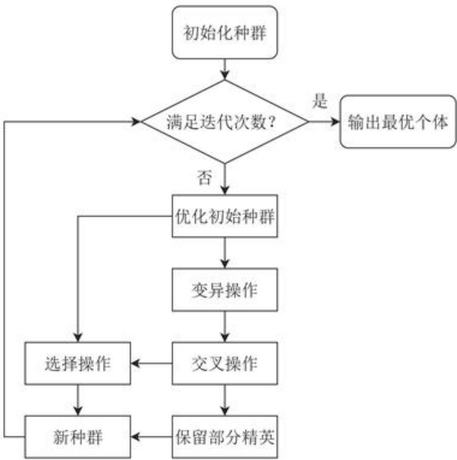  
图11:差分进化算法流程图

Step 1 初始化:设定种群规模 $N = 1 0 0$ 、最大迭代次数 $G = 5 0 0$ 、变异因子$F = 0 . 5$ 及交叉概率 $C R = 0 . 9$ 等关键参数。每个个体为一个8维决策向量 $\mathcal { X } =$ $( \theta , v _ { f y } , t _ { d , 1 } , t _ { d , 2 } , t _ { d , 3 } , t _ { b , 1 } , t _ { b , 2 } , t _ { b , 3 } )$ 。在可行域内随机生成初始种群，并确保其满足所有的约束条件。

Step2个体评估与约束处理：对种群中的每个个体 $\mathcal { X } _ { i }$ 通过模拟仿真计算其对应的总有效遮蔽时长 $\boldsymbol { f } ( \mathcal { X } _ { i } )$ 。采用惩罚函数法处理约束，将约束违反度整合到适应度评估中，使种群向可行域搜索。

Step3差分进化操作：对种群中的每一个个体 $\mathcal { X } _ { i }$ 进行如下变异和交叉操作以生成试验向量 $U _ { i }$ 。

变异:从当前种群中随机选择三个与 $\mathcal { X } _ { i }$ 不同的个体 $\chi _ { r 1 } , \chi _ { r 2 } , \chi _ { r 3 }$ ，根据式8.10生成变异向量 $V _ { i }$

$$
V _ { i } = \mathcal { X } _ { r 1 } + F \cdot \left( \mathcal { X } _ { r 2 } - \mathcal { X } _ { r 3 } \right)\tag{8.10}
$$

交叉：将变异向量 $V _ { i }$ 与目标向量 $\mathcal { X } _ { i }$ 进行交叉，生成试验向量 $U _ { i }$ 。本文采用二项式交叉，即以交叉概率 $C R$ 决定试验向量的每个维度是继承自变异向量还是目标向量，并确保至少有一个维度发生交换，以引人新信息。

Step 4 选择：计算试验向量 $U _ { i }$ 的目标函数值f(Ui)，如果f(Ui) 优于 f(χ)，则在下一代中用 $U _ { i }$ 替换χ；否则，保留原个体 $\chi _ { i }$

Step 5 迭代与输出：重复执行 Step2 至 Step 4， 直到达到预设的最大迭代次数$G _ { m a x }$ 。算法终止后，输出整个进化过程中记录下的最优个体 $\mathcal { X } _ { b e s t }$ ，该个体对应的决策变量组合即为所求的无人机最优投放策略，其对应的目标函数值即为最长有效遮蔽时间。

## 8.2.2 求解结果

根据上述流程，本问利用差分进化算法求解出的无人机 FY1投放3 枚烟幕弹干扰导弹M1的最优策略下对应的最大有效遮挡时间是6.93586s，无人机航向方向角为：13.57377°，无人机速度大小为：116.81318m/s。三枚烟幕弹的具体投放策略见表5。

表 5: 烟幕干扰弹投放与效能数据
<table><tr><td rowspan="3">烟幕弹序号</td><td colspan="3">投放坐标(m)</td><td colspan="3">起爆坐标(m)</td></tr><tr><td>X</td><td>Y</td><td>Z</td><td>X</td><td>Y</td><td>Z</td></tr><tr><td>1</td><td>17800</td><td>0</td><td>1800</td><td>17800</td><td>0</td><td>1800</td></tr><tr><td>2</td><td>17915.99463</td><td>13.80460</td><td>1800</td><td>17915.99463</td><td>13.80460</td><td>1800</td></tr><tr><td>3</td><td>22048.21768</td><td>505.58318</td><td>1800</td><td>23913.0268</td><td>727.51534</td><td>533.54687</td></tr><tr><td>烟幕弹序号</td><td>生效时间(s)</td><td></td><td></td><td>失效时间(s)</td><td>有效干扰时长(s)</td><td></td></tr><tr><td>1</td><td>0.79116</td><td></td><td></td><td>5.41117</td><td>2.55600</td><td></td></tr><tr><td>2</td><td>1.00000</td><td></td><td></td><td>5.07793</td><td>4.37985</td><td></td></tr><tr><td>3</td><td>0.00000</td><td></td><td></td><td>0.00000</td><td>0.00000</td><td></td></tr></table>

分析上表中数据可以看出，第二发烟幕干扰弹于1s极早期开始生效，持续到了5.07793s，贡献了4.07793s的有效遮蔽，占到了总有效遮挡时间的极大部分，说明第二枚烟幕弹的投放策略是极优的，但是该参数下的无人机行进轨迹会很早的与导弹相遇，使无人机相对于目标的位置比导弹更远，之后投放的烟幕弹不能够再提供有效遮挡，这也是第三枚烟幕弹始终没有发挥作用的原因。导致这种现象出现的原因可能与无人机的初始位置有关，在其他的初始位置可能可以找到真正的全局最优的投放策略达到最大的有效遮挡时长。

## 九、问题四模型建立及求解

问题四要求利用FY1、FY2、FY3三架无人机各投放一枚烟幕弹以干扰来袭的M1导弹。此问题从单无人机的任务规划，转变为一个协同优化问题，与第三问不同的地方在于：三个无人机各自投弹不需要考虑不同烟幕弹的投放时间的制约，三个烟幕弹的投放时间是相互独立的。需要为三架无人机分别规划出最优的飞行策略和投弹时机，使得三枚烟幕弹形成的遮蔽效果能够同实现对真目标总有效遮蔽时间的最大化。

## 9.1 多机单弹优化模型的建立

## 9.1.1 决策变量的定义

本问仍然以最大化有效遮挡时间为目标，但现在有三架无人机分别投一枚烟雾弹，而不是一架无人机独自投三枚，因此需要决策的参数是三架无人机各自的航向、速度以及烟幕弹的投放与引爆时间，即决策空间为：

$$
\begin{array} { r } { \mathbf { x } _ { j } = ( \theta _ { j } , v _ { f y , j } , t _ { d , j } , t _ { b , j } ) , \quad \stackrel { \mathrm { \tiny ~ f f } } { \mathrm { \tiny ~ \mathscr { L } ~ m ~ } } \mathbf { x } = ( \mathbf { x } _ { 1 } , \mathbf { x } _ { 2 } , \mathbf { x } _ { 3 } ) \in \mathbb { R } ^ { 1 2 } . } \end{array}\tag{9.1}
$$

上式中j的取值为j=1,2,3，代表了三架无人机。

## 9.1.2 目标函数的设置

同问题三一样，问题四的目标也是最大化有效遮挡时间，因此在形式上，问题四的目标函数与问题三完全一致：

$$
\operatorname* { m a x } \quad f ( \mathcal X ) = \int _ { 0 } ^ { \infty } B o o l ( t ) d t ,\tag{9.2}
$$

其中，布尔函数的定义需要进行调整，无人机FY1投下的第k个有效云团 $C ( P _ { c , k } )$ 应该变为第 $j$ 架无人机投下的云团 $C ( P _ { c , j } )$ 即：

$$
B o o l ( t ) = \left\{ \begin{array} { l l } { 1 , } & { \forall P _ { 2 } \in \Omega , \exists j \in \{ 1 , 2 , 3 \} , \overline { { P _ { m 1 } ( t ) P _ { 2 } } } \cap C ( P _ { e , j } ( t ) ) \neq \emptyset } \\ { 0 , } & { \mathrm { o t h e r w i s e } . } \end{array} \right.\tag{9.3}
$$

## 9.1.3 约束条件分析

由于三架无人机投放烟幕弹同样需要满足物理约束以及烟幕弹爆炸产生的云团的有效期的约束，这与上文的模型中的分析并无太大差别，这里不再赘述。即满足：

$$
\left\{ \begin{array} { l l } { 7 0 \leq v _ { f y , j } \leq 1 4 0 \quad , \quad 0 \leq \theta _ { j } \leq 2 \pi \quad , \quad v _ { f y , j , z } = 0 } \\ { t _ { d , j } , t _ { b , j } \geq 0 \quad j = ( 1 , 2 , 3 ) } \\ { t _ { b , j } \geq t _ { d , j } \quad j = ( 1 , 2 , 3 ) } \end{array} \right.\tag{9.4}
$$

## 9.1.4 模型汇总

综上，多架无人机各自投放单枚烟幕弹的最优投放策略求解模型为：

$$
\operatorname* { m a x } \quad f ( \chi ) = \int _ { 0 } ^ { \infty } B o o l ( t ) d t
$$

$$
\begin{array} { r l } & { s _ { A , t } \{ \begin{array} { l l } { \{ \tau _ { 0 } \leq v _ { t , j } \leq 1 4 0 \ ~ , ~ 0 \leq 6 , 0 \leq 2 \pi \quad , \nu _ { t , j , x } = 0 , } \\ { \vdots _ { t , j , x } \geq 0 ~ , ~ 0 \leq \ 0 , } \\ { \ell _ { 0 , t , j } \geq \tau _ { 0 } ~ , j = ( 1 , 2 , 3 ) } \\ { \vdots _ { t , j , x } \geq \tau _ { 0 } ~ , j = ( 1 , 2 , 3 ) } \\ { \{ l _ { 0 , t , j } , l _ { 0 , t , j } \} \zeta = \{ \tau _ { 0 , t , j } + 2 \} ~ ( j = 1 , 2 , 3 ) , } \end{array}  } \\ &  s _ { A , t } \{ \begin{array} { l l } { \mathbf { P } _ { \mathrm { r } , 1 } ( t ) = \mathbf { P } _ { \mathrm { r } , 1 } ( 0 ) + \mathbf { v } _ { \mathrm { r } , 1 } , t } \\ { \mathbf { P } _ { \mathrm { e } , 0 } ( t ) = ( \mathbf { h } _ { \mathrm { s } , 2 } , \nu _ { \mathrm { h } , 0 } , \mathbf { h } _ { \mathrm { s } , 2 } - \nu _ { \mathrm { a v } , \cdot } ( t - t _ { 0 , \ast } ) ) ~ \land \ \Sigma \in k _ { \mathrm { b } , 0 } } \\ { \mathbf { P } _ { \mathrm { s } , 0 } ( t ) = \mathbf { P } _ { \mathrm { r } , 1 } ( t _ { 0 , j } ) + \mathbf { v } _ { \mathrm { p } , \cdot } ( t - t _ { 0 , \ast } ) + \frac { 1 } { 2 } \cdot ( \cdot \cdot \ell _ { 1 , 0 } ) ^ { 2 } \cdot ( \cdot \cdot \ell _ { 1 , j } ) ^ { 2 } \cdot ( \cdot \cdot \mathbf { f } _ { 0 , j } ) ^ { 2 } \cdot ( \cdot \cdot \mathbf { f } _ { 0 , j } ) } \\  \mathbf { P } _ { \mathrm { p } , 2 } ( t ) = ( \nu _ { 0 , j } , \nu _ { 0 } , \mathbf { h } _  \ \end{array} \end{array}\tag{9.5}
$$

## 9.2 优化模型求解

## 9.2.1 基于预测拦截点的协同优化策略

问题4的优化模型涉及3个无人机，决策变量较多，如果直接进行求解会导致效率低下。

由问题2的结果分析可知:要最有效遮挡其视线，理想的烟幕云团应该近似位于导弹到真目标这条视线路径上，同时，由于真目标距离原点的距离相对于真目标距离导弹以及原点距离导弹的距离很小，导弹到真目标的这条线段和导弹到假目标（即原点）的线段很接近，所以近似有：理想的烟幕云团应该近似位于导弹到假目标（即原点）这条视线路径上。因此，最直接高效的投放策略就是迎着导弹来的方向飞过去，然后将烟幕干扰弹投放到导弹到假目标（即原点）这条视线路径上，形成一个迎面的烟幕云团。

基于以上分析，我们考虑将烟幕干扰弹投到导弹到假目标（即原点）的线段上，然后再对这个结果进行微调，从而得到烟幕干扰弹的投放策略。为进一步简化并获得高质量的初始解，我们提出一个更强的约束作为寻优起点:在某一时刻t，烟幕于扰弹的中心与导弹的位置完全重合。即：

$$
P _ { s , j } ( t ) = P _ { m 1 } ( t )\tag{9.6}
$$

通过一些运动学分析建立一组不等式来求得能够得到满足条件的一些解集。具体而言:我们希望知道是否存在某一组满足所有约束条件的决策变量 $( v _ { f y , j } , \theta _ { j } , t _ { d , j } )$ ，能使得在某一时刻t，烟幕干扰弹的中心与导弹的位置完全重合。建立不等式组和求解的具体过程如下：

为简化求解过程，我们引入比例系数 $s \in [ 0 , 1 ]$ ，定义为烟幕弹自由落体时间占无人机总飞行时间t的比值。因此，投放时间 $\ell _ { d , j }$ 可表示为 $t _ { d , j } = t ( 1 - s )$ OV

令 $P _ { s , j } ( t ) = ( x _ { s } , y _ { s } , z _ { s } )$ 和 $P _ { m 1 } ( t ) = ( x _ { m 1 } , y _ { m 1 } , z _ { m 1 } )$ ，其中：

$$
\left\{ \begin{array} { l l } { x _ { s } ( t ) = x _ { f y , j } ( 0 ) + v _ { f y , j } \cos ( \theta _ { j } ) t , } \\ { y _ { s } ( t ) = y _ { f y , j } ( 0 ) + v _ { f y , j } \sin ( \theta _ { j } ) t , } \\ { z _ { s } ( t ) = z _ { f y , j } ( 0 ) - \frac { 1 } { 2 } g ( t - t _ { d , j } ) ^ { 2 } } \end{array} \right.\tag{9.7}
$$

重合条件 $P _ { s , j } ( t ) = P _ { m 1 } ( t )$ 可分解为以下方程组：

$$
\begin{array} { r } { \left\{ \begin{array} { l l } { x _ { f y , j } ( 0 ) + v _ { f y , j } \cos ( \theta _ { j } ) \cdot t = x _ { m 1 } ( t ) } \\ { y _ { f y , j } ( 0 ) + v _ { f y , j } \sin ( \theta _ { j } ) \cdot t = y _ { m 1 } ( t ) } \\ { z _ { f y , j } ( 0 ) - \frac { 1 } { 2 } g ( s \cdot t ) ^ { 2 } = z _ { m 1 } ( t ) } \end{array} \right. } \end{array}\tag{9.8}
$$

该方程组为我们提供了一种高效的求解路径。对于任意一个假定的拦截时刻t，由Z轴方程可直接解出所需的自由落体时间比例s:

$$
s = \frac { 1 } { t } \sqrt { \frac { 2 ( z _ { f y , j } ( 0 ) - z _ { m 1 } ( t ) ) } { g } }\tag{9.9}
$$

其次，联立X轴和Y轴方程，可解出无人机为在时刻t到达目标水平位置 $( x _ { m 1 } ( t ) , y _ { m 1 } ( t ) )$ 所需的恒定飞行速度大小 $v _ { f y , j }$

$$
v _ { f y , j } = \frac { 1 } { t } \sqrt { ( x _ { m 1 } ( t ) - x _ { f y , j } ( 0 ) ) ^ { 2 } + ( y _ { m 1 } ( t ) - y _ { f y , j } ( 0 ) ) ^ { 2 } }\tag{9.10}
$$

然而，并非任意时刻t都存在可行策略。一个解要想在物理上成立，必须同时满足以下所有约束条件：

$$
\left\{ \begin{array} { l l } { z _ { f y , j } ( 0 ) \geq z _ { m 1 } ( t ) } \\ { 0 \leq s \leq 1 } \\ { 7 0 \leq v _ { f y , j } \leq 1 4 0 } \end{array} \right.\tag{9.11}
$$

最终可以求得可行时刻的解集，只需选取在这个解集中最小的那个时刻t即可，理由如下：

随着时刻t的增长、导弹持续向原点方向移动，所以导弹距离原点的距离会逐渐减小。因此真目标、导弹和原点的夹角会持续增大，即导弹对于真目标圆柱体的切向线速度逐渐增大，并且导弹和真目标的距离在减小。所以导弹对于真目标圆柱体的切向角速度在逐渐增大。这会导致导弹以更快的速度掠过烟幕云团，使得有效遮蔽时间变短，因此需要选取尽可能小的t。

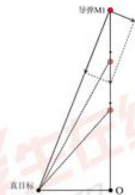

得到的解是基于导弹和烟幕干扰弹重合这一理想化近似，需要进一步微调以最大化对真实圆柱目标的有效遮蔽时长。我们采用精细化的局部网格搜索来对上文得到的近似最优解进行微调，算法具体步骤如下:

step1 定义搜索空间:以上文得到的近似最优解 $\mathcal { X } _ { 0 } = ( \theta _ { 0 } , v _ { f y , 0 } , t _ { d , 0 } , \Delta t _ { b , 0 } )$ 作为搜索

空间的中心。在这个中心附近定义一个搜索域。

step2网格离散化与遍历：各维度的搜索域范围及离散化如下：

航向角θ在弧度区间 $[ \theta _ { 0 } - 0 . 2 , \theta _ { 0 } + 0 . 2 ]$ 内以0.008弧度为步长进行采样。

飞行速度 $v _ { f y }$ 在区间 $[ \operatorname* { m a x } \{ v _ { f y , 0 } - 2 0 , 7 0 \} , \operatorname* { m i n } \{ v _ { f y , 0 } + 2 0 , 1 4 0 \} ] \ \mathrm { m / s }$ 内均匀采样50个点。

投放时间 $t _ { d }$ 在 $[ t _ { d , 0 } - 5 , t _ { d , 0 } + 5 ]$ 秒区间内均匀采样80个点。

引爆延迟 $\Delta t _ { b }$ 在 $\left[ \Delta t _ { b , 0 } - 5 , \Delta t _ { b , 0 } + 5 \right]$ 秒区间内均匀采样80个点。

step3候选策略评估与择优：对于网格中的每一个策略 $\mathcal { X } _ { c a n d }$ 进行模拟仿真，计算出该策略下对真目标的有效遮蔽时长T。动态更新最大的有效遮蔽时长和决策变量。

step4输出：遍历所有网格节点后，算法输出最终记录的 $\mathcal { X } _ { b e s t }$ ，作为该架无人机在当前情形下的最优投放策略。

## 9.2.2 求解结果

根据对预测拦截点的分析，本文在采用局部网格搜索进行求解时，效率得到了极大的提高。最终利用局部网格搜索求解出最大总有效遮蔽时间达到11.125936s，其余结果可见附件result2.xlsx。各烟幕弹的遮蔽时间段衔接良好，形成了连续的有效遮蔽效果，各无人机投放烟幕弹的具体策略见表6:

表6: 烟幕干扰弹投放策略
<table><tr><td rowspan="3">烟幕弹序号</td><td colspan="3">投放坐标(m)</td><td colspan="3">起爆坐标(m)</td></tr><tr><td>X</td><td>Y</td><td>Z</td><td>X</td><td>Y</td><td>Z</td></tr><tr><td>1</td><td>17763.38330</td><td>1.17214</td><td>1800</td><td>17552.65402</td><td>7.91777</td><td>1762.82904</td></tr><tr><td>2</td><td>13251.30020</td><td>260.33090</td><td>1400</td><td>13521.74556</td><td>14.01253</td><td>1361.06668</td></tr><tr><td>3</td><td>6455.35305</td><td>-208.59043</td><td>700</td><td>6498.39015</td><td>55.23604</td><td>654.78273</td></tr><tr><td>烟幕弹序号</td><td>生效时间(s)</td><td></td><td></td><td>失效时间(s)</td><td>有效干扰时长(s)</td><td></td></tr><tr><td>1</td><td>3.49922</td><td></td><td></td><td>8.02193</td><td>4.52271</td><td></td></tr><tr><td>2</td><td>16.51588</td><td></td><td></td><td>20.41043</td><td></td><td>3.89455</td></tr><tr><td>3</td><td>35.41727</td><td></td><td></td><td>38.12596</td><td></td><td>2.70869</td></tr><tr><td>无人机序号</td><td></td><td>航向(°)</td><td></td><td></td><td>速度(m/s)</td><td></td></tr><tr><td>1</td><td></td><td>178.16654</td><td></td><td></td><td>76.54968</td><td></td></tr><tr><td>2</td><td></td><td>317.67312</td><td></td><td></td><td>129.77384</td><td></td></tr><tr><td>3</td><td></td><td>80.73514</td><td></td><td></td><td>87.996834</td><td></td></tr></table>

分析表6可知，三架无人机（FY1、FY2、FY3）通过合理规划投放策略，使得投下的三枚烟幕弹在时间上形成了较好的衔接，最终实现了约11.1秒的总有效遮蔽时间。从结果可以看出：各无人机投放的烟幕弹虽然作用区间不重叠，但覆盖在导弹来袭路径上的时间段分布合理，最大限度地延长了真目标被遮蔽的总时长。同时，优化策略利用了预测拦截点和局部搜索的方法，既保证了烟幕云团基本位于导弹和目标的视线附近，又通过微调提升了遮蔽时长。 m

## 9.3结果的验证

为验证本文所提出的预测起爆点和局部网格搜索进行优化的有效性和解的质量，我们采用差分进化算法对问题四进行独立的对比求解。差分进化算法能够在复杂的解空间中进行全局搜索，可以有效避免陷入局部最优解，因此非常适合用来验证本文选取的求解算法是否合适。

最终，用差分进化算法求解得到的总最大有效遮蔽时间是11.645260s，相对误差为4.46%，说明我们的算法在求解这个问题上误差较小。同时，该方法利用了问题的物理特性，大幅缩小了搜索空间，避免了全局进化算法的大量迭代开销，在运算效率上具有显著优势。

## 十、问题五模型建立及求解

## 10.1 多机多弹优化模型建立

## 10.1.1 决策变量的定义

问题五涉及多架无人机和多枚烟幕弹，决策变量的数量将显著增加。对于每架无人机 $j \in \{ 1 , \ldots , 5 \}$ ，如果它被分配了任务并决定投放 $y _ { j }$ 枚烟幕弹 $( 0 \leq y _ { j } \leq 3 )$ ，则需要决策该无人机的飞行航向角、速度和烟幕干扰弹的投放时间和起爆时间。

为了简化模型，我们假设每架无人机如果参与任务，都会确定一个飞行方向和速度，并在该方向和速度下投放所有烟幕弹，而不会在飞行途中临时改变飞行参数。

因此，决策变量可以定义为：

$$
\mathcal X = \{ ( \theta _ { j } , v _ { f y , j } , t _ { d , j k } , t _ { b , j k } ) \mid j = 1 , \ldots , 5 ; k = 1 , \ldots , 3 \}\tag{10.1}
$$

其中：j表示无人机编号，k表示无人机j投放的第k枚烟幕弹。如果某架无人机决定只投放1枚或2枚烟幕弹，那么相应的 $t _ { d , j m }$ 和 $t _ { b , j m }$ 将被设为一些无效值或通过其他方式处理。为了方便表示，我们可以在模型中假定每架无人机都考虑投放3枚，然后通过约束条件来限制实际投放的数量。

## 10.1.2 目标函数设置

目标仍然是最大化对真实目标的总有效遮蔽时间。即：

$$
\operatorname* { m a x } \quad f ( \mathcal X ) = \int _ { 0 } ^ { \infty } B o o l ( t ) d t ,\tag{10.2}
$$

但是现在需要同时考虑3枚来袭导弹。这意味着，我们需要在任何给定时刻t，判断对于所有来袭导弹 $i \in \{ 1 , 2 , 3 \}$ 射向真目标的所有视线是否都被所有有效的烟幕云团所遮蔽。

因此，布尔函数 Bool(t) 的定义需要进一步修改：

$$
B o o l ( t ) = \left\{ \begin{array} { l l } { 1 , } & { \mathrm { i f } \forall i \in \{ 1 , 2 , 3 \} , \forall P _ { 2 } \in \Omega , \quad \exists j \in \{ 1 , \ldots , 5 \} , \exists k \in \{ 1 , \ldots , 3 \} } \\ { \qquad \mathrm { s . t . } \quad \overline { { P _ { m i } ( t ) P _ { 2 } } } \cap C ( P _ { e , j k } ( t ) ) \neq \emptyset } \\ { 0 , } & { \mathrm { o t h e r w i s e } } \end{array} \right.\tag{10.3}
$$

其中， $P _ { m i } ( t )$ 是第i枚导弹在时刻t的位置， $C ( P _ { c , j k } ( t ) )$ 是无人机j投放的第k枚烟幕弹在时刻t 形成的云团球体。

## 10.1.3 约束条件分析

除了问题三和问题四中已有的如物理约束、运动学约束的约束外，问题五还需考虑以下约束：

任务分配约束：每枚导弹至少被一架无人机干扰，每架无人机最多投放3枚烟幕弹：

$$
\sum _ { j = 1 } ^ { 5 } a _ { i j } \geq 1 \quad \forall i \in \{ 1 , 2 , 3 \} \qquad \sum _ { k = 1 } ^ { 3 } b _ { j k } \leq 3 \quad \forall j \in \{ 1 , \ldots , 5 \}\tag{10.4}
$$

其中 $a _ { i j }$ 为二进制变量，表示无人机j是否干扰导弹i; $b _ { j k }$ 表示无人机j是否投放第k枚烟幕弹。这两个约束可以来限制实际的投弹数量。

投弹间隔约束：根据题意同一无人机投放多枚烟幕弹的时间间隔至少为1秒：

$$
t _ { d , j ( k + 1 ) } > t _ { d , j k } + 1 \quad \forall j \in \{ 1 , . . . , 5 \} , k \in \{ 1 , 2 \}\tag{10.5}
$$

运动学约束：根据模型准备部分，已经求出了各个物体的位置函数，即

$$
\left\{ \begin{array} { l l } { \mathbf { P } _ { m , 1 } ( t ) = \mathbf { P } _ { m , 1 } ( 0 ) + \mathbf { v } _ { m , 1 } \cdot t } \\ { \mathbf { P } _ { c , j } ( t ) = ( R _ { \mathrm { b } , j , x } , R _ { \mathrm { b } , j , y } , R _ { \mathrm { b } , j , z } - v _ { \mathrm { s i n k } } \cdot ( t - t _ { \mathrm { b } , \mathbf { j } } ) ) \quad t \geq t _ { \mathrm { b } , \mathbf { j } } } \\ { \mathbf { P } _ { \mathrm { s } , \mathbf { j } } ( t ) = \mathbf { P } _ { f y , j } ( t _ { d , j } ) + \mathbf { v } _ { f y , j } \cdot ( t - t _ { \mathrm { d } , \mathbf { j } } ) + \frac { 1 } { 2 } \mathbf { g } \cdot ( t - t _ { \mathrm { d } , \mathbf { j } } ) ^ { 2 } \quad t \geq t _ { \mathrm { d } , \mathbf { j } } } \\ { \mathbf { v } _ { f y , j } = ( v _ { f y , j } \cos \theta _ { j } , v _ { f y , j } \sin \theta _ { j } , 0 ) } \\ { \mathbf { P } _ { f y , j } ( t ) = \mathbf { P } _ { f y , j } ( 0 ) + \mathbf { v } _ { f y , j } \cdot t } \end{array} \right.\tag{10.6}
$$

## 10.1.4 模型汇总

综上，问题五针对多机多弹的投放策略优化模型可表述为：

$$
\operatorname* { m a x } \quad f ( \mathcal X ) = \int _ { 0 } ^ { \infty } B o o l ( t ) , d t
$$

$$
\begin{array} { r l } & { \mathbb { P } _ { 1 } = \mathbf { P } _ { n , n } ( t ) - \mathbf { P } _ { n , n } ( t ) + \mathbf { P } _ { n , n } \cdot \boldsymbol { A } , } \\ & { \{ \begin{array} { l l } { \mathbf { P } _ { 1 } = \mathbf { p } _ { n , n } \cdot D _ { 1 } \cdot ( \boldsymbol { A } _ { n , n } ^ { \top } ) + \mathbf { P } _ { n , n } \cdot \boldsymbol { A } , } \\ { \mathbf { P } _ { 2 } \cdot ( \boldsymbol { A } _ { n , n } ^ { \top } ) - ( \mathbf { P } _ { n , n } \cdot \boldsymbol { A } _ { n , n } - \mathbf { P } _ { n , n } ) \cdot \boldsymbol { A } , \cdot ( - \boldsymbol { A } _ { n , n } \cdot ( \boldsymbol { A } _ { n , n } ^ { \top } ) ) \cdot \boldsymbol { 1 } \geq \tilde { t } _ { n , n } } \end{array}  } \\ &  \quad \times \{ \begin{array} { l l } { \mathbf { P } _ { 2 , k } ( t ) = \mathbf { P } _ { j , n } \cdot ( \boldsymbol { A } _ { n , n } ^ { \top } ) + \mathbf { P } _ { n , n } \cdot ( \boldsymbol { A } _ { n , n } ^ { \top } ) + \frac { 1 } { 2 } \mathbf { b } \cdot ( \boldsymbol { B } ^ { \top } - \boldsymbol { A } _ { n , n } ^ { \top } ) ^ { 2 } \cdot \boldsymbol { 1 } \geq \tilde { t } _ { n , n } } \\  \mathbf { P } _ { j , k } ( t ) = \mathbf { P } _ { j , k } \cdot ( \boldsymbol { B } _ { n , n } ^ { \top } ) \cdot \boldsymbol { B } \cdot \boldsymbol { B } \cdot \boldsymbol { B } \cdot \boldsymbol { B } \cdot \boldsymbol { B } \cdot \boldsymbol { B } \cdot \boldsymbol { B } \cdot \boldsymbol { B } \cdot \boldsymbol { B } \cdot \boldsymbol { B } \cdot \boldsymbol { B } \cdot \boldsymbol { B } \cdot \boldsymbol { B } \cdot \boldsymbol { B } \cdot \boldsymbol { B } \cdot \boldsymbol { B } \cdot \boldsymbol { B } \cdot \boldsymbol { B } \cdot \boldsymbol { B } \cdot \boldsymbol { B } \cdot \boldsymbol { B } \cdot \boldsymbol { B } \cdot \boldsymbol { B } \cdot \boldsymbol { B } \cdot \boldsymbol { B } \cdot \boldsymbol { B } \ \end{array} \end{array}\tag{10.7}
$$

## 10.2 模型求解

由于问题五的决策变量维度非常高(最多可达到45维)，约束复杂，属于大规模组合优化问题，利用传统的优化算法难以直接求解。所以本文采用分层优化策略结合改进的遗传算法进行求解。分析各无人机与各导弹的初始位置示意图：

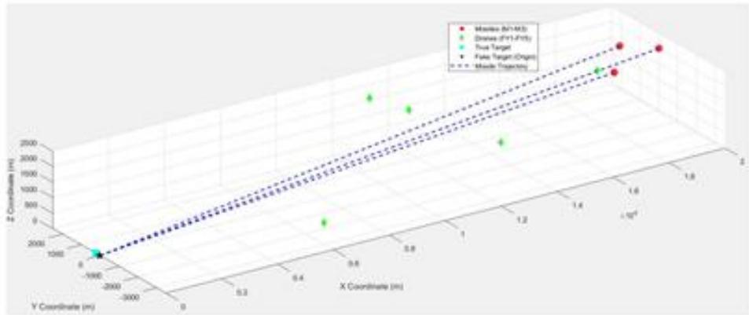  
图12: 各无人机与各导弹的初始位置示意图

关于这幅图，很容易产生一个想法:无人机应该去拦截在空间上距离它最近的那枚导弹，即 FY3和 FY5应该去拦截M3，FY1 拦截 M1，FY2和 FY4拦截M2。从算法角度来讲，如果能够提前确定各无人机应该投放几发烟幕弹去分别拦截哪枚导弹，那么会极大的提升后续的计算效率，以便更快地去确定无人机的航向、速度，烟幕弹的投放、引爆时间。下面将对如何确定每架无人机干扰哪枚导弹，以及每架无人机投放烟幕弹的数量进行说明。

## 10.2.1 任务分配说明

这一步的目的在于确定最优的任务分配方案，即每架无人机j干扰哪枚导弹i，以及每架无人机投放烟幕弹的数量 $y _ { j }$ 。为了定义这个最优，这里假设无人机都以固定的140m/s进行匀速直线运动，航向沿着能够截击导弹的直线飞到导弹航迹正前方的一个参考点，这个参考点记为 $P _ { r e f }$ ，根据以上的假设能够快速计算该烟幕弹理论上最大的有效遮挡时长。令这个理论上最大的有效遮挡时长为 $c _ { i j }$ ，下面说明 $c _ { i j }$ 的计算方法；

$$
\begin{array} { r l } & { T _ { \mathrm { f l y } , i j } = \frac { \lVert \mathbf { P } _ { \mathrm { f y } , i } \left( 0 \right) - \mathbf { P } _ { \mathrm { r e f } , j } \rVert } { 1 4 0 } , } \\ & { T _ { \mathrm { c l o u d } } = 2 0 } \\ & { \qquad c _ { i j } = \operatorname* { m a x } \left( 0 , T _ { \mathrm { c l o u d } } - T _ { \mathrm { f l y } , i j } \right) } \end{array}\tag{10.8}
$$

$P _ { r e f , j }$ 可以取导弹i 初位置沿 x负方向偏移5 k，无人机j以最大速度140 m/s到该参考点即刻释放1枚弹并立即起爆，云团的寿命为20s、之后按3m/s匀速下沉。如果无人机在导弹袭来该点时已经在该点引爆烟幕弹，那么理论上可用时间窗口被飞行时间挤占的值还未到达20s，理论最大有效遮挡时间就为 $T _ { \mathrm { { e l o u d } } } - T _ { \mathrm { { f l y , i j } } }$ ，而如果导弹比无人机先经过此点，那么烟幕弹就不能提供有效的遮挡，则 $c _ { i j } = 0$

如果把无人机j发射向导弹i的烟幕弹数量记为 $y _ { i j }$ ，显然 $y _ { i j }$ 是一个十五维的变量，也可以写成一个 $3 \times 5$ 的矩阵 $Y _ { i j }$ ，那么通过改变矩阵元素的取值，计算无人机群对导弹群拦截的理论上的最大有效遮挡时间，就可以初步决定出最优的任务分配。寻找$Y _ { i j }$ 的步骤如下：

无人机群对导弹群拦截的理论上的有效遮挡时间可以记作 $\begin{array} { r } { \sum _ { i = 1 } ^ { 3 } \sum _ { j = 1 } ^ { 5 } c _ { i j } y _ { i j } } \end{array}$

在满足导弹的拦截已经无人机发射导弹数量的前提下，求解最优的分配方案的优化模型为：

$$
m a x \sum _ { i = 1 } ^ { 3 } \sum _ { j = 1 } ^ { 5 } c _ { i j } y _ { i j }
$$

$$
\mathrm { s . t . } \left\{ \begin{array} { l l } { \sum _ { j = 1 } ^ { 5 } y _ { i j } \le 3 } \\ { \sum _ { i = 1 } ^ { 3 } y _ { i j } \ge 1 } \\ { y _ { i j } \le 3 , y _ { i j } \in N } \end{array} \right.\tag{10.9}
$$

这是一个整数线性规划模型，可以利用分支定界法对其进行求解得到 $Y _ { i j }$

## 10.2.2 投放策略求解

有了最优的分配方案之后，最初的优化问题可以分解为3个独立的规模更小的子问题。每个子问题都只对应一枚来袭导弹。

子问题1:优化导弹M1的无人机群的投放策略，目标是最大化对M1的有效遮蔽时长。 oe.

子问题2:优化导弹M2的无人机群的投放策略，目标是最大化对M2的有效遮蔽

时长。

子问题3：优化导弹M3的无人机群的投放策略，目标是最大化对M3的有效遮蔽时长。

求解出来之后再对这三个子问题得到的三个有效遮蔽时间区间取交集，最终的总有效遮蔽时间为这三个集合交集的总长度。

## 10.2.3 求解结果

通过上面的策略结合问题三的求解思路，求解得到总最长有效遮蔽时间为21.0770s。其他的具体数据见附录以及文件result3.xlsx。

## 十一、模型的评价与推广

## 11.1模型的评价

## 模型的优点：

1.本文对导弹、无人机、云团及烟幕弹的运动情况做了详细分析，给出了精确的运动轨迹方程，同时没有简单地假设“导弹与云团中心距离小于10米即遮蔽”，而是敏锐地抓住了问题的核心需要遮蔽的是一个圆柱体，而不是一个点，体现了建模过程的数学严谨性于思考的深度。

2.创新性地引入了布尔函数来清晰地定义遮蔽状态，这使得逻辑非常清晰，同时对模型的推导以及算法的实现给出了详细的说明，文章层级分明、逻辑很严谨。

3.绘制了许多可视化图像让论文更加地直观，易于读者的理解。

## 模型的缺点：

1. 符号系统略显繁琐，定义了很多包含大量下标的符号，包含大量下标和字母的符号虽然精确，但严重影响了阅读的流畅性。

2.算法流程说明太过冗长，本文对每一个算法的使用都进行了详细的说明，虽然易于读者理解，但是使文章的篇幅过于长会引起阅读的疲劳。

## 11.2 模型的推广

本文的模型是在理想情况下进行，没有考虑到空气的阻力、云团的扩散，在实际的问题研究中，这些都是不可忽略的因素。同时可以设计更高效的策略来在更大的范围内找到最优的策略使效益最大。

## 参考文献

[1]DeepSeek,DeepSeek-V3.1,深度求索(DeepSeek),2025.09.05-2025.09.07);

[2] 王庆华.防空火箭烟幕弹干扰[J]. 光电技术应用，2008，23(6)

[3]杨甲胜，耿晓蕾，顾文慧，等.对烟幕遮蔽干扰投放参数的修正分析[J]. 光电技术应用，2007，22（1）；

[4]顾文慧，高红杰，烟幕投放控制分析与设计[J].光电技术应用,2014，29(2)

## 附录

## A支撑材料目录

<table><tr><td>AI使用说明</td><td>DOCX文档</td><td>119 KB</td></tr><tr><td>fifth</td><td>MATLAB Code</td><td>3 KB</td></tr><tr><td>first</td><td>MATLAB Code</td><td>2 KB</td></tr><tr><td>fourth_DE</td><td>MATLAB Code</td><td>5 KB</td></tr><tr><td>fourth_grid</td><td>MATLAB Code</td><td>4 KB</td></tr><tr><td>Intervalinter</td><td>MATLAB Code</td><td>1 KB</td></tr><tr><td>IntervalUnion</td><td>MATLAB Code</td><td>1 KB</td></tr><tr><td>isOverwhelm</td><td>MATLAB Code</td><td>1KB</td></tr><tr><td>result1</td><td>XLSX 工作表</td><td>9 KB</td></tr><tr><td>result2</td><td>XLSX工作表</td><td>9 KB</td></tr><tr><td>result3</td><td>XLSX 工作表</td><td>10 KB</td></tr><tr><td>second_greed_solve</td><td>MATLAB Code</td><td>2 KB</td></tr><tr><td>second2_pso</td><td>MATLAB Code</td><td>3 KB</td></tr><tr><td>third</td><td>MATLAB Code</td><td>4 KB</td></tr></table>

图 1:支撑材料目录

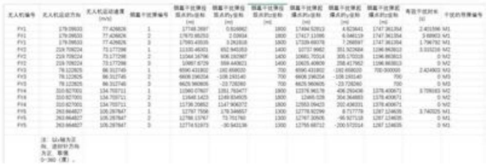  
图 2: 问题五详细数据