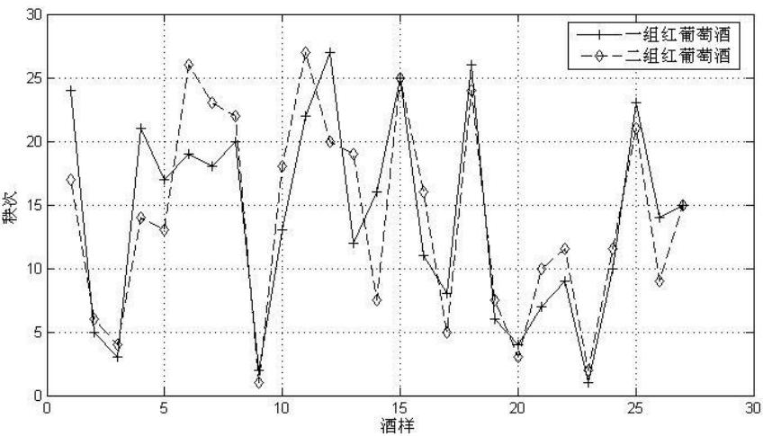
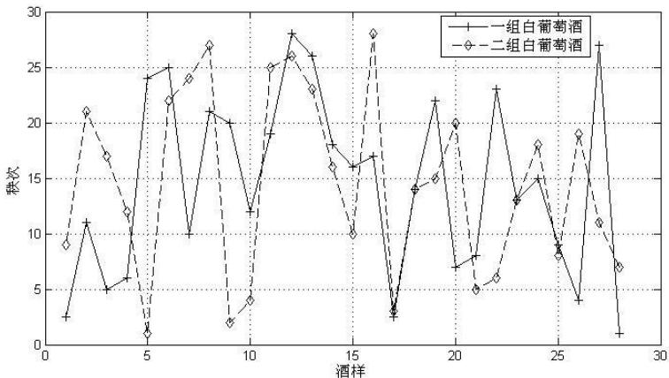
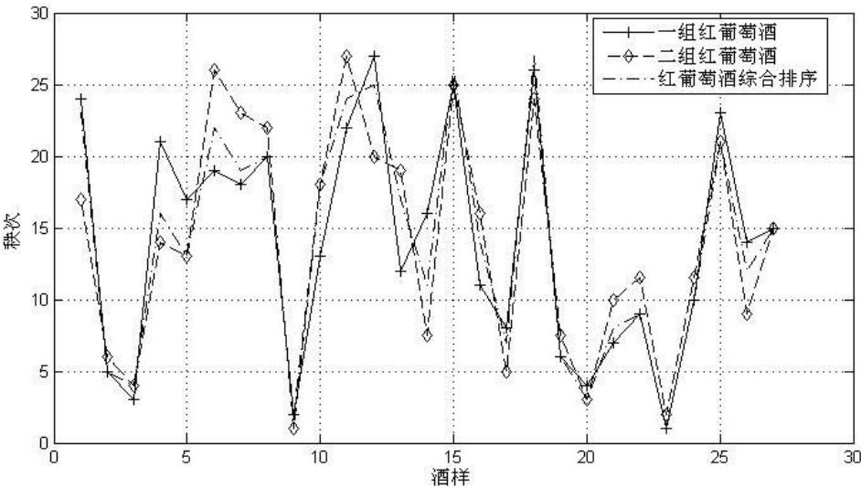
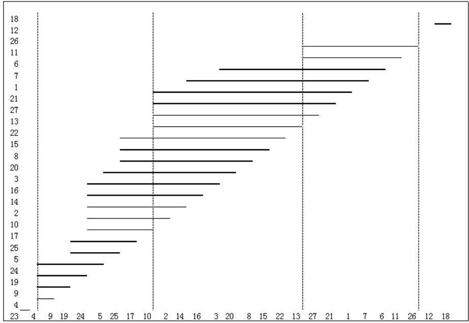
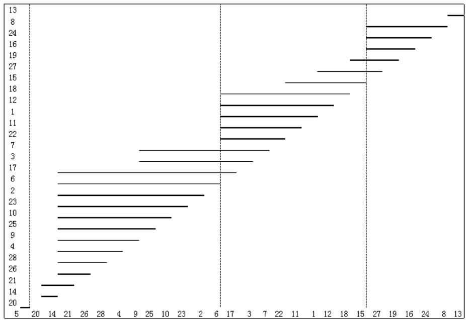
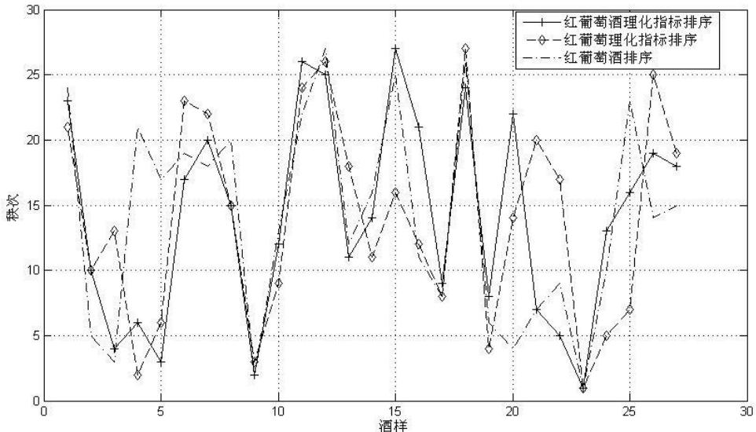
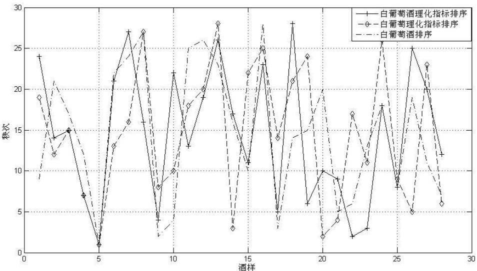
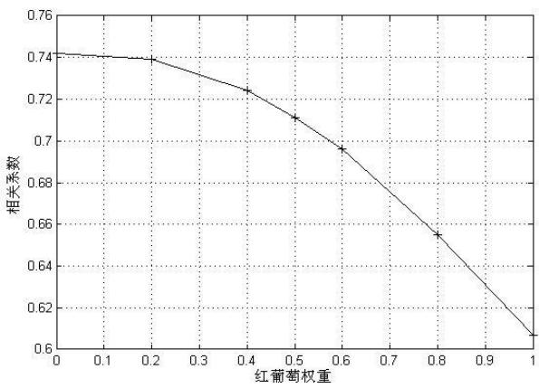
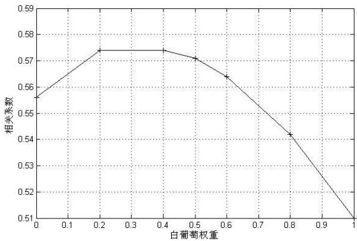

# 2012 高教社杯全国大学生数学建模竞赛

## 编 号 专 用 页

赛区评阅编号（由赛区组委会评阅前进行编号）：

赛区评阅记录（可供赛区评阅时使用）：

<table><tr><td rowspan=1 colspan=1>评阅人</td><td rowspan=1 colspan=1></td><td rowspan=1 colspan=1></td><td rowspan=1 colspan=1></td><td rowspan=1 colspan=1></td><td rowspan=1 colspan=1></td><td rowspan=1 colspan=1></td><td rowspan=1 colspan=1></td><td rowspan=1 colspan=1></td><td rowspan=1 colspan=1></td><td rowspan=1 colspan=1></td></tr><tr><td rowspan=1 colspan=1>评分</td><td rowspan=1 colspan=1></td><td rowspan=1 colspan=1></td><td rowspan=1 colspan=1></td><td rowspan=1 colspan=1></td><td rowspan=1 colspan=1></td><td rowspan=1 colspan=1></td><td rowspan=1 colspan=1></td><td rowspan=1 colspan=1></td><td rowspan=1 colspan=1></td><td rowspan=1 colspan=1></td></tr><tr><td rowspan=1 colspan=1>备注</td><td rowspan=1 colspan=1></td><td rowspan=1 colspan=1></td><td rowspan=1 colspan=1></td><td rowspan=1 colspan=1></td><td rowspan=1 colspan=1></td><td rowspan=1 colspan=1></td><td rowspan=1 colspan=1></td><td rowspan=1 colspan=1></td><td rowspan=1 colspan=1></td><td rowspan=1 colspan=1></td></tr></table>

全国统一编号（由赛区组委会送交全国前编号）：

全国评阅编号（由全国组委会评阅前进行编号）：

# 基于排序检验的葡萄酒评价

## 摘要

现行葡萄酒质量评价方案主要为专家感官评分，本文旨在通过数学建模的方法对酿酒葡萄与葡萄酒理化指标进行分析，从而研究两者与葡萄酒质量的关系。

针对问题一，通过食品评价中的排序检验法，计算同一酒样在不同评酒员评分方案的秩次，再对两组的秩和排序进行 Wilcoxon符号秩检验，求得两种葡萄酒在不同置信水平内的评价结果均无显著性差异。在无显著性差异的情况下，比较同组内不同品酒员对该组总排序的方差大小，同时综合所有评酒员的打分得到一个理想排序，再比较不同组对理想排序的方差大小。两种方法所得到的结果均为第一组对红葡萄酒的评价更可信，第二组对白葡萄酒的评价更可信。

针对问题二，将葡萄酒质量最高的样品作为理想点，通过相关性分析筛选芳香物质中与香气评分相关性较大的成分，对这些成分和葡萄的理化指标进行基于TOPSIS 法的秩和排序，利用多重比较法对酿酒葡萄进行分级，结果得出红葡萄可分为五级，白葡萄可分为四级。

针对问题三，运用主成分分析法对葡萄和葡萄酒的理化指标进行降维，分别以葡萄酒和葡萄的主成分作为因变量和自变量进行回归分析，得出葡萄酒中总酚、色泽等与葡萄中的花色苷、VC含量、蛋白质和黄酮醇等有联系。

针对问题四，利用秩和排序的方法，对葡萄酒和葡萄的理化指标以及葡萄酒的质量评分进行转换。将两组理化指标的秩和排序与葡萄酒评分作相关性分析，结果表明有影响。为葡萄的理化指标设定不同权重，得到变权下的综合排序与葡萄酒质量的相关性，证明能用红葡萄酒的理化指标评价红葡萄酒的质量，白葡萄酒的质量需要结合白葡萄酒和白葡萄的理化指标来评价。

本文的创新之处在于将葡萄酒的质量、葡萄与葡萄酒的理化指标逐步转化为同一类型的秩和排序，消除了不同类型数据之间量纲、数量级等的区别。这种转化方法可以推广到其他评价问题中去。

关键词：葡萄酒评价 排序检验法 符号秩检验 TOPSIS 法 多重比较

## 一、问题重述

对于葡萄酒质量的确定，现如今通常采用感官评价的方法，即聘请一批有资质的品酒员对葡萄酒进行品评，然后对其外观、口感等分类指标进行打分。最后通过求和得到每种葡萄酒的总分，从而确定葡萄酒的质量。附件 1中给出了某一年份一些葡萄酒的打分结果。

同时，酿酒葡萄的好坏又直接影响着所酿葡萄酒的质量。除了感官评价的方法之外，在某种程度上，葡萄酒和酿酒葡萄检测的理化指标也能反映葡萄酒和葡萄的质量。附件2和附件3即给出了同一年份中，这些葡萄酒的和酿酒葡萄的成分数据。

请分析题目，试建立合适的数学模型解决以下问题：

1. 对于附件1中的红葡萄酒与白葡萄酒，每种葡萄酒均由两组评酒员对其进行打分。试分析这两组品酒员的评价结果有无显著性差异，并判断哪一组的结果更为可信。

2. 综合感官评价所得到的葡萄酒质量与酿酒葡萄的理化指标，对酿酒葡萄进行分级。

3. 试分析酿酒葡萄、葡萄酒的两组理化指标之间有何关系。

4. 分析酿酒葡萄的理化指标、葡萄酒的理化指标对葡萄酒质量的影响，论证能否只用葡萄和葡萄酒的理化指标来评价葡萄酒的质量。

## 二、问题分析

## 问题一的分析

问题一中，每个品酒员都要从外观、香气、口感、整体四个大方面对每个酒样进行评分，可将每个方面的评分相加作为总分确定葡萄酒的质量。问题一涉及的是葡萄酒感官评价结果的统计检验问题，由于样本量偏小，且葡萄酒质量评分的分布难以确定，因此，可考虑采取非参数检验的办法。

结合本题的背景，对于问题一中感官评价的问题，可选用排列试验中的排序检验法对总分进行排序。对于 10 种排序结果，根据每一个排序的秩次求得每个样品的秩和。最后通过秩和的非参数检验的方法评价有无显著性差异。

要评价哪组的评价结果更可信，主要是检验组内品酒员的评分是否集中，即比较哪组的方差更小，亦可以通过该组内所有品酒员与最终得分的差异来确定谁的可信度更改。

## 问题二的分析

问题二中，对酿酒葡萄进行分级时，根据题意要将葡萄的理化指标与葡萄酒的质量统一结合作为参考。而葡萄酒的质量则是通过问题一中感官评价的得分反应的。由于理化指标过多，因此在解决本问时，首先应该完成对指标的处理，尤其是怎样将附表三的芳香物质与附表二中的理化指标结合起来。

由于指标的繁杂，且难以确定指标是偏大型还是偏小型，因此，可考虑将众多指标数据经过转换，统一成与感官排序一样的排序类型数据，这样，转换后的指标即可直接用来对葡萄进行分级。本问的整体思想还是可运用排序检验中的求秩和的方法。

## 问题三的分析

葡萄酒和葡萄的两组指标数量大，难以直接进行统计分析中的回归和相关等方法建立联系。因此，可首先考虑对指标的降维。在对降维方法的选择上，本题可采用主成分分析。根据题意，要分析两组理化指标之间的联系，可建立指标之间的函数关系用来表征指标之间的联系。

由于本问中的指标变量之间的关系是多变量对多变量，则在建立联系时，可以葡萄酒理化指标为因变量，在以求得主成分的结果的基础之上，求葡萄酒理化指标的每一个主成分对葡萄所有主成分之间的回归关系。建立多个回归关系式来分析指标之间的联系。

## 问题四的分析

要求理化指标与葡萄酒质量间的联系，在已经有前几问求解的基础上，可考虑将这三个变量统一化。由于理化指标的值是多个指标的含量，而葡萄酒的质量则是专家打得分数，因此，直接分析理化指标对葡萄酒质量的影响是不好实现的，而第一问和第二问均将葡萄酒质量与酿酒葡萄的理化指标转换为了秩和，则也可将葡萄酒的理化指标转化为秩和。

要研究理化指标的秩和排序对葡萄酒质量秩和排序的影响，可用相关性分析比较相关性系数的大小。最后，根据相关性的结果加以分析。

## 三、模型假设

1.假设酿酒工艺和贮存条件等对葡萄酒质量及理化指标无影响；

2.假设品酒员打分是公平可信的；

3.假设对理化指标的检测误差在可接受范围之内；

四、符号说明
<table><tr><td>符号</td><td>符号说明</td></tr><tr><td> $x _ { i j }$ </td><td>i品酒员对葡萄酒样品j评分排序的秩次</td></tr><tr><td> $R _ { j }$ </td><td>第j个样本的总秩和</td></tr><tr><td> $r _ { i j }$ </td><td>i酿酒葡萄的 i指标值</td></tr><tr><td> $\delta _ { i j }$ </td><td>i酿酒葡萄的j指标值对理想点对应指标的接近度</td></tr><tr><td>u</td><td>曼-惠特尼 U检验统计量</td></tr><tr><td>D</td><td>排序间的方差</td></tr><tr><td>W</td><td>酒样的理化指标向量</td></tr></table>

## 五、模型的建立与求解

## 一 模型一的建立与求解

## 1.1 基于排序检验与符号秩检验的显著性评价

对于白葡萄酒和红葡萄酒，两个组别分别给出了各自的感官评价，对于同一个葡萄酒样本，不同的评酒员的打分存在差异，但一定假设范围内的差异是允许的。

要分析两组评酒员的评价结果有无显著性差异，应构造统计量，检验两组评

分的差异是否在一定的置信区间内，若不在，则认为评分差异性显著。

考虑到本题的背景，两组评分的差异可体现在对样本酒的排名差异上。由于该问属于食品评价中的感官评价问题，因此，可结合感官评价中的排序检验与非参数检验中的符号秩检验，对两组评分的显著性进行评价。

## 1.1.1样品秩次和秩和的求解

评酒员对每一个酒样均从四大方面进行了评分。根据题意，葡萄酒的质量由总分所确定。因此，我们将每一个方面的评分加和，得到i品酒员对葡萄酒样品j的总评分。

以红葡萄酒的评价为例，对于品酒员i，将其对27种样品的评分进行排序，评分最高的酒样秩次为 1，当多个样品有相同秩次时，则取平均秩次。记在i品酒员的评价排序中，j酒样的秩次为x ，可得到秩次矩阵为： $x _ { i j }$

$$
A = \left( x _ { i j } \right) _ { 1 0 \times 2 7 }\tag{1-1}
$$

因此，第j个样品的总秩和为：

$$
R _ { j } = \sum _ { i = 1 } ^ { 1 0 } x _ { i j }\tag{1-2}
$$

最终，根据样品的总秩和对 27 个样本进行排序，秩和越小代表该酒样的得分越高，排名越好，第一名记为 1.样品j的排序为 $X _ { j }$ 。因此，对于红葡萄酒，两个组共得到了两个排序结果。图 1-1、1-2 分别为红、白葡萄酒的两组排序比较，纵坐标为每组综合排序中对应酒样的秩次：

  
图 1-1 红葡萄酒两组排序比较

  
图 1-2 白葡萄酒两组排序比较

接下来，对两个排序结果进行显著性检验。

## 1.1.2 Wilcoxon 符号秩检验

Wilcoxon 符号秩检验为一种非参数检验方法，具有无需对总体分布作假定的优点。该方法是在成对观测数据的符号检验基础上发展起来的，用于检验产生数据的总体是否具有相同的均值，比传统的单独用正负号的检验更加灵敏<sup>[1]</sup>。

Wilcoxon 符号秩检验的步骤为<sup>[2]</sup>：

（1）计算差数：求出成对观测数据的差 $d _ { i }$ ；

（2）编秩次:按差数的绝对值，由小到大编上等级，并标上原数的正负号。根据 Mann-Whitney U 检验，对 $d _ { i }$ 绝对值按大小顺序编上等级。u 值计算：

$$
u = { \frac { \left| T - { \frac { n ( n + 1 ) } { 4 } } \right| } { \sqrt { \frac { n ( n + 1 ) ( 2 n + 1 ) } { 2 4 } } } }
$$

（3）等级编号完成后恢复正负号，求出正等级之后 $T ^ { ( + ) }$ 和负等级之和$T ^ { ( - ) }$ ,选择两者中较小一个最为检验统计量 $T$ 。

（4）根据显著性水平 $\alpha$ 查附表得到临界值 $T _ { \alpha }$ ，若 $T < T _ { \alpha }$ ,则拒绝原假设$H _ { 0 }$

通过 spss 软件，分别对红葡萄酒和白葡萄酒的两组酒样排序进行检验，检验结果如下表所示：

表 1-1 红葡萄酒符号秩检验
<table><tr><td> $H _ { 0 }$ </td><td>显著性水平</td><td>标准差</td><td>检验统计量</td><td> $S \mathrm { i g . }$ </td><td>决策</td></tr><tr><td>两组之间 差异中位</td><td> $\alpha = 0 . 0 5$ </td><td>37.054</td><td>166.50</td><td>0.914</td><td>无显著性 差异</td></tr><tr><td>数为0</td><td>α=0.01</td><td>37.054</td><td>166.50</td><td>0.914</td><td>无显著性 差异</td></tr></table>

表 1-2 白葡萄酒符号秩检验
<table><tr><td> $H _ { 0 }$ </td><td>显著性水平</td><td>标准差</td><td>检验统计量</td><td>Sig.</td><td>决策</td></tr><tr><td>两组之间 差异中位</td><td>α=0.05</td><td>39.324</td><td>182.50</td><td>0.859</td><td>无显著性 差异</td></tr><tr><td>数为0</td><td>α=0.01</td><td>39.324</td><td>182.50</td><td>0.859</td><td>无显著性 差异</td></tr></table>

因此，由表中信息可以看出，在显著性水平为 0.05、0.01 的两种情况下，两组品酒员对于两种酒的评价均无显著性差异，则显著性水平对检验结果无影响。

可认为，该检验方法是比较稳健的，即评价结果较为可信。

## 1.2 可信度评价模型

## 1.2.1基于组内方差比较的可信度评价

感官评分的差异体现在酒样之间的差异与品酒员之间的差异上。一个良好的评价方案中，品酒员之间的差异应该尽可能小，即 10个排序之间越集中越好。

由于求出的对于两种葡萄酒，两组品酒员的评价结果无显著性差异，因此，我们通过比较哪组组内的差异小来确定哪组可信度高。

本题中每个品酒员得到的评分不满足正态分布，因此一般的组间方差齐次性检验不适用。由于每组都通过综合 10个品酒员得到了一个评分的总排序，因此，可通过10个排序与总排序之间的方差大小进行评价。

（1）第i品酒员的排序与该组总排序方差：

$$
D _ { i } = \sum _ { j = 1 } ^ { 2 3 } ( x _ { i j } - X _ { j } )\tag{1-3}
$$

（2）第一组品酒员的平均组内方差：

$$
D = { \frac { \displaystyle \sum _ { i = 1 } ^ { 1 0 } D _ { i } } { 1 0 } } = { \frac { \displaystyle \sum _ { i = 1 } ^ { 1 0 } \sum _ { j = 1 } ^ { 2 3 } ( x _ { i j } - X _ { j } ) } { 1 0 } }\tag{1-4}
$$

通过计算，得到两组品酒员对红、白葡萄酒的方差如下表所示：

表 1-3 组内方差比较
<table><tr><td colspan="4">红葡萄酒</td><td colspan="2">白葡萄酒</td></tr><tr><td rowspan="2">平均组内方差</td><td>第一组</td><td>第二组</td><td>第一组</td><td>第二组</td><td></td></tr><tr><td>39.57</td><td>40.21</td><td>53.32</td><td></td><td>48.99</td></tr></table>

从表中结果可直观看出，对于红葡萄酒而言，第一组的方差更小，即第一组的更可信；对于白葡萄酒而言，第二组的方差更小，即第二组的评分更可信。所以总结为：

红葡萄酒：第一组；

白葡萄酒：第二组。

## 1.2.2 基于理想排序的方差可信度评价

由于两组排序均无差异，因此，可将两组 20个评酒员的 20个排序综合，求秩和得到一个新的排序。由于此排序综合了 20 个评酒员的结果，因此，更能反应酒样的排序真实性，即认为该综合排序为理想排序。记样品j在第一组、第二组排序内的秩次为 ${ X _ { j } } ^ { ( 1 ) }$ ${ X _ { j } } ^ { ( 2 ) }$ ，综合之后排序秩次为 $\overline { { \boldsymbol X _ { j } } }$ 。红葡萄酒三种排序的比较图如下：

  
图 1-3 红葡萄酒的三种排序比较

因此，两组秩次排序与综合排序的平均方差分别为：

$$
D ( n ) = \sum _ { j = 1 } ^ { 2 3 } ( { X _ { j } } ^ { ( n ) } - { \overline { { X _ { j } } } } ) ^ { 2 } , n = 1 , 2\tag{1-5}
$$

求得红、白葡萄酒中两组排序与综合排序的平均方差见下表.：

表 1-4 与理想排序的方差比较
<table><tr><td colspan="3">红葡萄酒</td><td colspan="2">白葡萄酒</td></tr><tr><td rowspan="2">方差</td><td>第一组</td><td>第二组</td><td>第一组</td><td>第二组</td></tr><tr><td>5.85</td><td>6.33</td><td>29.81</td><td>29.53</td></tr></table>

由表1-4中的数据分析可得，与理想排序间的方差越小则代表该组越可信。因此，此步分析结果与上步得出的结果一致。

## 1.2.3两种评价检验总结

两种方法得到的可信度保持一致，均为红葡萄酒第一组好，白葡萄酒第二组好，因此，结合这两种方法，可认为得到的结果是稳健的。

## 二 模型二的建立与求解

## 2.1 芳香指标与香气评分的相关性分析

与附表2中所给出的理化指标不同，附表 3中单独给出了酿酒葡萄与葡萄酒的芳香物质指标。对于葡萄酒而言，其芳香物质对于葡萄酒的香气起着决定性的作用，与其香气密切相关<sup>[2]</sup>。

鉴于芳香物质的种类过多，因此，我们通过 spss 软件，将芳香物质指标与感官分析评分中的三个香气指标的总分进行相关性分析。在相关性分析中，不需要区分自变量和因变量，两个变量之间是平等关系，通过相关分析可以了解变量之间的关系密切程度<sup>[3]</sup>。

将芳香物质指标与感官分析评分中的三个香气指标的总分进行相关性分析，相关性系数可表征指标指标对香气的重要程度，相关性系数越接近于 1或-1，则该指标对香气的影响越大，剔除相关性系数接近于零的指标。得到的结果如下表所示：

表 2-1 红葡萄酒芳香物质相关性分析保留指标
<table><tr><td>置信水平</td><td>芳香物质</td><td>相关性系数</td></tr><tr><td rowspan="6">0.05</td><td>甲苯</td><td>-0.385</td></tr><tr><td>乙酸戊酯</td><td>-0.482</td></tr><tr><td>己酸乙酯</td><td>-0.872</td></tr><tr><td>1-己醇</td><td>-0.444</td></tr><tr><td>1-辛稀-3-醇</td><td>-0.473</td></tr><tr><td>(E)-3,7-二甲基-2,6-辛二烯-1-醇</td><td>0.460</td></tr></table>

表 2-2 白葡萄酒芳香物质相关性分析保留指标
<table><tr><td>置信水平</td><td>(E)-2-已烯醛</td><td>萘</td></tr><tr><td>0.05</td><td>-0.533</td><td>0.401</td></tr></table>

注：分析结果中已经将缺失值较多的化学物质剔除

将相关性分析后最终的指标加入酿酒葡萄的理性指标中，用二级指标代替一级指标，对于同一个指标测多次时，取测量的平均值。最终得到总共65个指标，再对所有理性指标进行综合分析。

## 2.2 基于 TOPSIS 法的秩次排序

由于现有葡萄酒的质量评价大都基于感官评价的评分结果，因此，我们将问题一中求得的样品感官质量排序结果作为酿酒葡萄分级的标准，以逼近理想点的方法，对加入芳香物质的葡萄各个指标进行秩次排序。

## （1）确定理想点

根据题意，要求将酿酒葡萄的理化指标与葡萄酒的质量相结合对葡萄质量进行综合评价，而目前专家打分则是葡萄酒质量评价的标准。

因此，将第一问中秩次最低，即得分最高的葡萄样本设为“理想点”，以该理想点的各项指标作为最理想的指标值。对于红、白葡萄，选取第一问中各自更可信的一组数据确定理想点。即：

$$
\underline { { 4 } } _ { \mathrm { T } } \sharp \sharp \sharp \sharp 2 3 \ \sharp , \sharp \sharp \sharp \sharp \sharp 5 \ \sharp
$$

$$
\begin{array} { r } { ( 2 ) \ \overset { , } { \underset { \mathrm { i } } { \mathop { : } } } + \frac { \varkappa \widetilde { \Xi } } { \mathcal { H } } \underset { \mathrm { f } } { \mathop { : } } + \widetilde { \Xi } \mathrm { i } \frac { \varkappa } { \mathcal { H } } \underset { \mathrm { i } \mathrm { f } } { \mathop { : } } ] \widetilde { \Xi } \pm \frac { \varkappa } { \mathrm { t s } } \int \widetilde { \Xi } \left( \frac { \star } { \mathcal { H } } \right) \underset { \mathrm { i } } { \mathop { : } } \left. \frac { \star } { \mathcal { H } } \right. \overset { \mathrm { d } \widetilde { \Xi } } { \underset { \mathrm { i } \mathrm { f } } { \mathop { : } } } + \widetilde { \Xi } \left( j \right) = ( \delta _ { 1 } , \delta _ { 2 } , \cdots , \delta _ { 6 s } ) \ ^ { [ 4 ] } } \end{array}
$$

由于采用理想点逼近的方法，因此指标虽多，达到了 65 个，但可不必对指标进行降维。设理想点的各项指标值组成的向量为：

$$
\overline { { w } } = ( \overline { { r } } _ { 1 } , \quad \overline { { r } } _ { 1 } , \quad \cdots , \quad \overline { { r } } _ { 1 } )
$$

其他样本的指标向量为：

$$
w = ( r _ { 1 } , \quad r _ { 2 } , \quad \cdots , \quad r _ { 6 5 } )
$$

$$
\delta _ { i } = \left| \boldsymbol { r _ { i } } - \boldsymbol { \overline { { r _ { i } } } } \right|\tag{2-1}
$$

因此，对于红葡萄的27种酒样，可得到 $2 7 \times 6 5$ 的接近度矩阵：

$$
\delta = \left( \begin{array} { c c c c } { { \delta _ { 1 1 } } } & { { \delta _ { 1 2 } } } & { { \cdots } } & { { \delta _ { 1 j } } } \\ { { \delta _ { 2 1 } } } & { { \delta _ { 2 2 } } } & { { \cdots } } & { { \delta _ { 2 j } } } \\ { { \vdots } } & { { \vdots } } & { { \ddots } } & { { \vdots } } \\ { { \delta _ { i 1 } } } & { { \delta _ { i 2 } } } & { { \cdots } } & { { \delta _ { i j } } } \end{array} \right)\tag{2-2}
$$

同理，对于白葡萄的28种酒样，可得到 $2 8 \times 6 5$ 的接近度矩阵。

## （3）秩次排序

在求得 2-1、2-2 的接近度矩阵后，对于每一个指标，对接近度进行排序。按照问题一中求秩次的方法，求秩次 $x _ { i j }$ ，根据秩次求得i种酿酒葡萄的秩和：

$$
R _ { i } = \sum _ { j = 1 } ^ { 6 5 } x _ { i j }\tag{2-3}
$$

## 2.3 基于多重比较的酿酒葡萄分级

根据酿酒葡萄的秩和，运用排序检验中的统计分组方法对酿酒葡萄进行分组定级。以红葡萄为例：

（1）根据各样品的秩和 $R _ { i }$ ，从小到大将样品初步排序，本题中，秩和最小的为23号葡萄，最大的为样品 18.

（2）计算临界值 $r ( I , \alpha )$

$$
r \big ( I , \alpha \big ) = q \big ( I , \alpha \big ) \frac { \sqrt { J P ( P + 1 ) } } { 1 2 }\tag{2-4}
$$

P为样本数目，J 为指标数， $\alpha$ 代表显著性水平。

式中 $q ( I , \alpha )$ 值可查表得到.本题中，临界值 $r ( I , \alpha )$ 为：

$$
r \big ( I , \alpha \big ) = q \big ( I , \alpha \big ) \frac { \sqrt { 6 5 \times 2 7 \times 2 8 } } { 1 2 } = 1 8 . 4 7 q \big ( I , \alpha \big )\tag{2-5}
$$

## （3）比较和分组

以下列的顺序检验这些秩和的差数：最大减最小，最大减次小， ，最大减次大，然后次大按照同样方式依次减下去。对于所得到的秩差，与 $r \big ( p , \alpha \big )$ 进行比较。如： $R _ { A P } - R _ { A 1 }$ 与 $r \big ( p , \alpha \big )$ 比较， $R _ { A P } - R _ { A 2 }$ 与 $r ( p - 1 , \alpha )$ 比较， ， $R _ { A 2 } - R _ { A 1 }$ 与 $r ( 2 , \alpha )$ 比较。

若相互比较的秩和只差小于对于的r值，则表示两个样品以及秩和位于这两个样品之间的所有样品无显著差异，在这些样品以下可用一横线表示，即：

$$
A _ { i } \quad A _ { i + 1 } \quad \cdots A _ { j }
$$

横线内的样品不必再比较。若小于r值，则表示两个样品有显著性差异，其下面不划横线。

通过查表得到I 不同时 $q ( I , \alpha )$ 的值，从而得到 $r \big ( p , \alpha \big )$ 的值进行分组分析。

通过 Matlab 编程<sup>[5]</sup>，选取 99%的置信区间，得到画线结果如图 2-1、2-2 所示，横坐标表示葡萄种类编号，两竖虚线内的葡萄归为一级，越靠左的品种级别越高（程序见附录）：

  
图 2-1 红葡萄分组图示  
根据划线图的分组总原则为：

（1）参考葡萄酒分级的划分原则，根据参考文献的葡萄酒分级分为五级:（一级：60 分一下；二级：60-69；三级：70-79；四级：80-89；五级：90-95）将葡萄的等级大致分为五级左右。

（2）根据横线划分情况，尽量不破坏横线重合，选取破坏横线最少且区间两端秩和之差相对平均的方法。

首先，将秩和与其他样本差距较大的样本独立分组，例如红葡萄酒中的 23号样本和白葡萄酒中的5号样本；

  
图 2-2 白葡萄分组图示

如图所示，红葡萄被分为了五个级别，白葡萄分为了四个级别，分组具体情

况如下表所示（等级一代表质量最好）：

表 2-3 红葡萄分级结果
<table><tr><td>等级</td><td>组内酒样</td><td>秩和区间</td></tr><tr><td>一</td><td>23</td><td>65.5</td></tr><tr><td>二三四</td><td>4,5,9,10,17,19,24,25</td><td>739-896</td></tr><tr><td></td><td>2,3,8,13,14，15，16,20,22</td><td>908-982</td></tr><tr><td>四</td><td>1,6,7,11,21,26,27</td><td>989-1073</td></tr><tr><td>五</td><td>12,18</td><td>1162.5-1222</td></tr></table>

表 2-4 白葡萄分级结果
<table><tr><td>等级</td><td>组内酒样</td><td>秩和区间</td></tr><tr><td>一</td><td>5</td><td>95</td></tr><tr><td>二一</td><td>2,4，6,9,10,14,20,21,23，25,26,28</td><td>684-836</td></tr><tr><td>三</td><td>1,3,7,11,12,15,17,18,22</td><td>867.5-1034</td></tr><tr><td>四</td><td>8,13,16,19,24,27</td><td>1045-1157</td></tr></table>

## 三 模型三的建立与求解

## 3.1 两组指标的主成分分析

酿酒葡萄的理化指标与葡萄酒质量的理化指标数目过多，且部分指标对各自的品质影响小，且数目过多难以建立指标之间的联系。

因此，首先可对各指标进行降维，减小指标个数。本问中采取主成分分析的方法对指标进行降维。主成分分析可将原来众多的具有一定相关性的变量重新组合成一组新的相互无关的综合变量来代替原来的变量。其一般步骤<sup>[4]</sup>：

（1）由相关系数矩阵R得到特征值 $\lambda _ { j }$ 及各主成分的方差贡献率等，根据累计贡献率确定主成分保留个数；

（2）利用施密特正交方法，对每一个 $\lambda _ { j }$ 求其对应基本方程组的解，对数据进行转换得到主成分；

（3）将观测值代入主成分表达式中计算各个主成分的值；

（4）由因子载荷解释主成分的意义。

用一级指标代替二级指标，通过 spss 软件，以特征值贡献率之和大于 80%筛选成分，得到红葡萄的主成分数为:

表 3-1 主成分数目
<table><tr><td></td><td>红葡萄</td><td>白葡萄</td><td>红葡萄酒</td><td>白葡萄酒</td></tr><tr><td>成分数数目</td><td>12</td><td>13</td><td>4</td><td>5</td></tr></table>

通过系数矩阵，分析得知红葡萄酒的 4个主成分分别主要体现在：总酚、色泽C、色泽H、反式白藜芦醇成分上；白葡萄酒的 5个主成分分别主要体现在：色泽C、总酚、顺式白藜芦醇苷、反式白藜芦醇、色泽 H成分上。

## 3.2 两组主成分间的回归分析

由于葡萄酒的理化指标数目小于葡萄的理化指标数，因此以酿酒葡萄的理化

指标主成分为自变量，葡萄酒的理化指标主成分为因变量，对于后者的每一个主成分，与葡萄的所有主成分做回归分析，对于红葡萄酒和白葡萄酒，分别得到了4个和5个回归方程

首先选取红葡萄酒指标的四个主成分 $y _ { i }$ 与红葡萄的 12 种主成分 $x _ { i }$ 做线性回归，假设它们之间存在线性关系式

$$
y _ { i } = \alpha _ { 1 } x _ { 1 } + \alpha _ { 2 } x _ { 2 } + \cdots + \alpha _ { 1 2 } x _ { 1 2 } + \beta\tag{3-1}
$$

通过SPSS 做逐步回归分析，算得系数矩阵为：

$$
\alpha _ { i } = \left[ \begin{array} { c c c c c c c c c c } { 0 . 7 5 } & { 0 } & { - 0 . 2 8 3 } & { 0 . 3 0 5 } & { 0 } & { 0 } & { 0 . 2 8 4 } & { 0 } & { 0 } & { 0 } & { 0 . 1 8 7 } & { 0 } \\ { - 0 . 3 1 9 } & { 0 } & { 0 } & { 0 . 5 4 6 } & { 0 } & { 0 } & { 0 } & { - 0 . 4 2 9 } & { 0 } & { 0 } & { 0 . 3 1 4 } & { 0 } \\ { 0 } & { 0 } & { 0 } & { 0 } & { 0 } & { - 0 . 4 5 4 } & { 0 } & { 0 } & { 0 } & { 0 } & { 0 } & { 0 } & { 0 } \\ { 0 } & { 0 } & { - 0 . 5 5 3 } & { 0 } & { 0 } & { 0 } & { 0 } & { 0 } & { 0 } & { 0 } & { 0 } & { 0 } \end{array} \right]
$$

回归方程为：

$$
\left\{ \begin{array} { l l } { y _ { 1 } = 0 . 7 5 x _ { 1 } - 0 . 2 8 3 x _ { 3 } + 0 . 3 0 5 x _ { 4 } + 0 . 2 8 4 x _ { 7 } + 0 . 1 8 7 x _ { 1 2 } } \\ { y _ { 2 } = - 0 . 3 1 9 x _ { 1 } + 0 . 5 4 6 x _ { 4 } - 0 . 4 2 9 x _ { 9 } + 0 . 3 4 1 x _ { 1 2 } } \\ { y _ { 3 } = - 0 . 4 5 4 x _ { 6 } } \\ { y _ { 4 } = - 0 . 5 5 3 x _ { 3 } } \end{array} \right.\tag{3-2}
$$

同理，将白葡萄酒理化指标的 5 个主成分作为因变量和白葡萄的 13 种主成分回归后系数矩阵为：

$$
\begin{array} { r } { \varepsilon _ { i } = \left[ \begin{array} { c c c c c c c c c c c c c c } { 0 . 4 2 0 } & { - 0 . 4 9 3 } & { 0 } & { 0 } & { - 0 . 3 1 6 } & { 0 } & { 0 } & { 0 } & { 0 } & { 0 } & { 0 } & { 0 } & { 0 } & { 0 } \\ { 0 . 6 6 7 } & { 0 . 5 3 1 } & { 0 } & { 0 } & { 0 } & { 0 } & { 0 } & { 0 } & { 0 } & { 0 } & { 0 } & { 0 } & { 0 } & { 0 } \\ { 0 } & { 0 } & { 0 } & { 0 } & { 0 } & { 0 } & { 0 } & { 0 } & { 0 } & { 0 } & { 0 } & { - 0 . 3 7 9 } & { 0 } & { 0 } \\ { 0 } & { 0 } & { 0 } & { 0 } & { 0 } & { 0 } & { 0 } & { - 0 . 4 4 9 } & { 0 } & { 0 } & { 0 } & { 0 } & { 0 } & { 0 } & { 0 } \\ { 0 } & { 0 } & { 0 } & { - 0 . 4 5 6 } & { 0 } & { 0 } & { 0 } & { 0 } & { 0 } & { 0 } & { 0 } & { 0 } & { 0 } & { 0 } \end{array} \right] } \end{array}
$$

回归方程为：

$$
\left\{ \begin{array} { l l } { y _ { 1 } = 0 . 4 2 0 x _ { 1 } - 0 . 4 9 3 x _ { 2 } - 0 . 3 1 6 x _ { 5 } } \\ { y _ { 2 } = 0 . 6 6 7 x _ { 1 } + 0 . 5 3 1 x _ { 2 } } \\ { y _ { 3 } = - 0 . 3 7 9 x _ { 1 1 } } \\ { y _ { 4 } = - 0 . 4 4 9 x _ { 7 } + 0 , 3 7 2 x _ { 1 2 } } \\ { y _ { 5 } = - 0 . 4 5 6 x _ { 4 } } \end{array} \right.\tag{3-3}
$$

回归方程的检验：

（1）回归方程显著性检验

多元线性回归方程的总离差平方和 SST 可分解为剩余平方和 SSE 与回归平方和SSR。当原假设 $H _ { 0 }$ 为 $\beta _ { 1 } = \beta _ { 2 } = \cdots = \beta _ { { p } } = 0$ 且 $H _ { 0 }$ 成立时：

$$
F = \frac { S S R / p } { S S E / ( n - p - 1 ) } \mathop { \prod } \ F ( p , n - p - 1 ) , \quad \sigma ^ { 2 } = M S E = \frac { S S E } { n - p - 1 }
$$

为 $\sigma ^ { 2 }$ 的无偏估计量。因此，给出显著性水平 $\alpha$ ，即可进行回归方程的显著性检

验<sup>[6]</sup>。

表 3-2 红葡萄酒回归方程显著性检验
<table><tr><td>模型</td><td>平方和</td><td>df</td><td>均方</td><td>F</td><td></td><td>Sig.</td></tr><tr><td rowspan="3">回归方 程一</td><td>回归</td><td>22.151</td><td>5</td><td>4.430</td><td>24.170</td><td>.000</td></tr><tr><td>残差</td><td>3.849</td><td>21</td><td>0.183</td><td></td><td></td></tr><tr><td>总计</td><td>26.000</td><td>26</td><td></td><td></td><td></td></tr><tr><td rowspan="3">回归方 程二</td><td>回归</td><td>18.206</td><td>4</td><td>4.552</td><td>12.848</td><td>.000</td></tr><tr><td>残差</td><td>7.794</td><td>22</td><td>0.354</td><td></td><td></td></tr><tr><td>总计</td><td>26.000</td><td>26</td><td></td><td></td><td></td></tr><tr><td rowspan="3">回归方 程三</td><td>回归</td><td>5.350</td><td>1</td><td>5.350</td><td>6.476</td><td>0.017</td></tr><tr><td>残差</td><td>20.650</td><td>25</td><td>0.826</td><td></td><td></td></tr><tr><td>总计</td><td>26.000</td><td>26</td><td></td><td></td><td></td></tr><tr><td rowspan="3">回归方 程四</td><td>回归</td><td>7.961</td><td>1</td><td>7.961</td><td>11.032</td><td>0.003</td></tr><tr><td>残差</td><td>18.039</td><td>25</td><td>0.722</td><td></td><td></td></tr><tr><td>总计</td><td>26.000</td><td>26</td><td></td><td></td><td></td></tr></table>

表 3-3 白葡萄酒回归方程显著性检验
<table><tr><td>模型</td><td></td><td>平方和</td><td>df</td><td>均方</td><td>F</td><td>Sig.</td></tr><tr><td rowspan="3">回归方 程一</td><td>回归</td><td>14.014</td><td>3</td><td>4.671</td><td>8.633</td><td>.000</td></tr><tr><td>残差</td><td>12.986</td><td>24</td><td>0.541</td><td></td><td></td></tr><tr><td>总计</td><td>27.000</td><td>27</td><td></td><td></td><td></td></tr><tr><td rowspan="3">回归方 程二</td><td>回归</td><td>19.604</td><td>2</td><td>9.802</td><td>33.132</td><td>.000</td></tr><tr><td>残差</td><td>7.396</td><td>25</td><td>0.296</td><td></td><td></td></tr><tr><td>总计</td><td>27.000</td><td>27</td><td></td><td></td><td></td></tr><tr><td rowspan="3">回归方 程三</td><td>回归</td><td>3.877</td><td>1</td><td>3.877</td><td>4.360</td><td>0.047</td></tr><tr><td>残差</td><td>23.123</td><td>26</td><td>0.889</td><td></td><td></td></tr><tr><td>总计</td><td>27.000</td><td>27</td><td></td><td></td><td></td></tr><tr><td rowspan="3">回归方 程四</td><td>回归</td><td>9.191</td><td>2</td><td>4.595</td><td>6.451</td><td>0.006</td></tr><tr><td>残差</td><td>17.809</td><td>25</td><td>0.712</td><td></td><td></td></tr><tr><td>总计</td><td>27.000</td><td>27</td><td></td><td></td><td></td></tr><tr><td rowspan="3">回归方 程五</td><td>回归</td><td>5.603</td><td>1</td><td>5.603</td><td>6.809</td><td>0.015</td></tr><tr><td>残差</td><td>21.397</td><td>26</td><td>0.823</td><td></td><td></td></tr><tr><td>总计</td><td>27.000</td><td>27</td><td></td><td></td><td></td></tr></table>

Sig 的值均小于 0.05，故拒绝原假设，接受背择假设，认为上述所有回归方程均通过检验，即线性关系显著。

## （2）参数显著性检验

由于篇幅限制 ，此处只给出红葡萄酒的回归方程一与白葡萄酒回归方程一

的参数检验结果：

表 3-4（a） 红葡萄方程一参数显著性检验
<table><tr><td rowspan="2">模型</td><td colspan="2">非标准化系数</td><td rowspan="2">标准系数 试用版</td><td rowspan="2">t</td><td rowspan="2">Sig.</td></tr><tr><td>B</td><td>标准误差</td></tr><tr><td>(常量)</td><td>6.019E-7</td><td>.082</td><td></td><td>.000</td><td>1.000</td></tr><tr><td>主成分1</td><td>.750</td><td>.084</td><td>.750</td><td>8.937</td><td>.000</td></tr><tr><td>主成分4</td><td>.305</td><td>.084</td><td>.305</td><td>3.630</td><td>.002</td></tr><tr><td>主成分7</td><td>.284</td><td>.084</td><td>.284</td><td>3.387</td><td>.003</td></tr><tr><td>主成分3</td><td>-.283</td><td>.084</td><td>-.283</td><td>-3.368</td><td>.003</td></tr><tr><td>主成分12</td><td>.187</td><td>.084</td><td>.187</td><td>2.232</td><td>.037</td></tr></table>

表 3-4（b） 白葡萄方程一参数显著性检验
<table><tr><td rowspan="2">模型</td><td colspan="2">非标准化系数</td><td>标准系数</td><td>t</td><td>Sig.</td></tr><tr><td>B</td><td>标准误差</td><td>试用版</td><td></td><td></td></tr><tr><td>(常量)</td><td>-9.215E-7</td><td>.139</td><td></td><td>.000</td><td>1.000</td></tr><tr><td>主成分2</td><td>-.493</td><td>.142</td><td>-.493</td><td>-3.480</td><td>.002</td></tr><tr><td>主成分1</td><td>.420</td><td>.142</td><td>.420</td><td>2.966</td><td>.007</td></tr><tr><td>主成分5</td><td>-.316</td><td>.142</td><td>-.316</td><td>-2.234</td><td>.035</td></tr></table>

由于所做的为逐步回归，所剩下的主成分系数均通过了参数检验。  
分析回归分析方程可知：

1. 红葡萄酒中理化指标总酚与红葡萄的理化指标花色苷、蛋白质、脯氨酸、天门冬氨酸、VC含量有线性关系；

2. 红葡萄酒中理化指标色泽 C 与红葡萄的理化指标花色苷、脯氨酸、百粒质量、VC含量有线性关系；

3. 红葡萄酒中理化指标色泽 H与红葡萄的理化指标VC含量有线性关系；

4. 红葡萄酒中理化指标反式白藜芦醇与红葡萄的理化指标蛋白质有线性关系。

5. 白葡萄酒中理化指标色泽 C 与白葡萄的理化指标丝氨酸、葡萄总黄酮、苯丙氨酸有线性关系；

6. 白葡萄酒中理化指标总酚与白葡萄的理化指标丝氨酸、葡萄总黄酮有线性关系；

7. 白葡萄酒中理化指标顺式白藜芦醇苷与白葡萄的理化指标果皮质量有线性关系；

8. 白葡萄酒中理化指标反式白藜芦醇与白葡萄的理化指标精氨酸、苯丙氨酸有线性关系；

9. 白葡萄酒中理化指标色泽 H与白葡萄的理化指标黄酮醇有线性关系。

## 四 模型四的建立与求解

## 4.1 葡萄酒理化指标的转换

对于一、二问中，我们已经用排列检验的方法，通过秩和排序，将感官评价结果（即葡萄酒的质量评分）与酿酒葡萄的理化指标做了统一的数据转换，即都转换为了秩和，并对秩和进行排序得到了样品的排名。

为了将葡萄酒的理化指标也与两者统一起来，因此，也按照模型二中的方法，对葡萄酒理化指标进行秩和排序。

对芳香性物质与香气评分进行相关性检验，保留的成分的相关系数见下表所示：

表 4-1 红葡萄酒芳香物质相关性分析保留指标
<table><tr><td>置信区间</td><td>芳香物质</td><td>相关性系数</td></tr><tr><td rowspan="7">95%</td><td>乙醇</td><td>0.383</td></tr><tr><td>3-甲基-1-丁醇</td><td>0.553</td></tr><tr><td>香叶基乙醚</td><td>0.585</td></tr><tr><td>辛酸丙酯</td><td>0.439</td></tr><tr><td>3,7-二甲基-1</td><td>0.401</td></tr><tr><td>5-甲基糠醛</td><td>0.432</td></tr><tr><td>苯乙醇</td><td>0.434</td></tr></table>

确定指标总数后，通过逼近理想点法，同样对葡萄酒根据其理化指标得到秩和排序（具体过程见模型二）。对于红、白葡萄酒，分别将感官评分排序、葡萄理化指标排序、葡萄酒理化指标排序作图，得到较直观的表达：

  
图 4-1 红葡萄酒三种排序

  
图 4-2 白葡萄酒三种排序

## 4.2 三种排序的相关性检验

经过四问的数据转换，理化指标与感官指标均被转换为了秩和排序。要验证酿酒葡萄的理化指标、葡萄酒的理化指标对葡萄酒质量的影响，我们将模型一中葡萄酒质量的秩和排序分别与另外两者之间进行相关性检验，以相关性系数的大小评判后者对葡萄酒质量评价有无影响。

通过SPSS,以三个秩和排序数据做皮尔斯相关性检验<sup>[7]</sup>，如下表所示：

表 4-2 红葡萄酒的相关性检验（95%置信区间）
<table><tr><td colspan="2"></td><td>红葡萄</td><td>红葡萄酒</td></tr><tr><td rowspan="3">红酒质量</td><td>Pearson 相关性</td><td>0.607</td><td>0.742</td></tr><tr><td>显著性（双侧）</td><td>0.001</td><td>0</td></tr><tr><td>N</td><td>27</td><td>27</td></tr></table>

表 4-3 白葡萄酒的相关性检验（95%置信区间）
<table><tr><td></td><td></td><td>白葡萄</td><td>白葡萄酒</td></tr><tr><td rowspan="3">白酒质量</td><td>Pearson 相关性</td><td>0.510</td><td>0.556</td></tr><tr><td>显著性（双侧）</td><td>0.006</td><td>0.002</td></tr><tr><td>N</td><td>28</td><td>28</td></tr></table>

结果分析：

（1）由上表分析相关性系数可知，所有值的 Sig.均小于 0.01。即对于两种酒，葡萄与酒的理化指标与葡萄酒质量均在  0.01的水平上显著相关，且红葡萄酒的相关性系数大于白葡萄酒。

（2）可认为葡萄酒的质量与酒和葡萄的理化指标均成正相关，葡萄酒与葡萄的理化指标水平越高时，葡萄酒的质量越高，反正越低。

（3）虽然理化指标与葡萄酒质量呈显著性相关，但是相关性系数并没有太高，特别是白葡萄酒，相关性系数只有 0.5左右，即单个理化指标并不能完全代表葡萄酒质量。为了对两个理化指标的综合结果进行检验，我们进行以下的进一步分析。

设葡萄的理化指标与葡萄酒的理化指标相比，其对葡萄酒质量影响所占权重为 $w _ { 1 }$ ，将两个理化指标加权得到新的总秩和为：

$$
R = w _ { 1 } R _ { 1 } + ( 1 - w _ { 1 } ) R _ { 2 }\tag{4-1}
$$

将两个指标综合得到的新秩和排序与葡萄酒质量做相关性检验，观察相关性系数的变化。

设定不同的 $w _ { 1 }$ ,将 $w _ { 1 }$ 分别取 0、0.2、0.4、0.5、0.6、0.8、1.0，得到的总秩和排序与葡萄酒质量的相关性系数将随之变化，见图 4-3、4-4：

  
图 4-3 红葡萄权重变化的相关系数变化图

  
图 4-4 白葡萄权重变化的相关系数变化图

根据两个图可得如下分析：

（1）对于红葡萄酒，随着红葡萄理化指标权重的增加，与红酒质量的相关性系数一直减小。因此，对于红葡萄酒而言，只用酒的理化指标来衡量葡萄酒的质量更为合理。且最大相关系数大于 0.7，则可认为只用红葡萄酒的理化指标评判红葡萄酒的质量较为合理；

（2）对于白葡萄酒，相关性系数随着白葡萄理化指标权重的增加先增加后减小，当其权重在 0.2-0.4 之间时相关系数达到最大。因此，用白葡萄与白葡萄酒的理化指标综合评判白葡萄酒的质量更为合理。但是最大相关系数不如红葡糖酒的大。

总结如下：

用红葡萄酒的理化指标评价红葡糖酒的质量更为合理；

用白葡萄酒的理化指标与白葡萄的理化指标综合评价白葡萄酒的质量更为合理。

## 六、模型的评价与推广

## 一 排序检验法的评价：

## （1）模型优点：

1.当样品数量较大，且不是比较样品间的差别大小时，选用排序检验法具有一定的优势；

2.对于排序检验所得的数据，可以更充分地检测出各个样品之间的显著性差异；

3.当试验目的是就某一项性质对多个产品进行比较时，比如甜度、新鲜程度等，适用排序检验法是进行这种比较的最简单的方法，比其他任何方法更节省时间。

## （2）模型缺点：

排序检验法只能按照一种特性进行，如要求对不同的特性进行排序，则按不同的特性安排不同的排序；

## 二 符号秩和检验（Wilcoxon检验）的评价：

## （1）模型优点

1. 不受总体分布限制，适用面广；

2. 适用于等级资料及两端无缺定值的资料；

3. 既考虑差数符号，又考虑差数大小

## （2）模型缺点：

1.相同秩次较多时，统计量要校正；

2.如果是精确测量的变量，并且已知服从或者经变量转换后服从某个特定分布，这时人为地将精确测量值变成顺序的秩，将丢失部分信息，造成检验功效下降。

## 参考文献

[1]祝国强.谈谈两总体比较的非参数检验方法[J].Journal of MathematicalMedical，524-525，2011.

[2] 郑 莉 莉 . 葡 萄 酒 香 气 成 分 分 析 的 研 究 进 展 [J]. 中 外 葡 萄 与 葡 萄酒.38-40,2008.

[3]李运，李记明.统计分析在葡萄酒质量评价中的应用[J].第四期：酿酒科技，80-82,2009.

[4]余祖德，陈俊芳.基于最大熵的两极逼近理想点的配送路线选择[J].工业工程与管理，第 1 期：48-51，2007.

[5]周开利.MATLAB 基础及其应用教程[M].北京：北京大学出版社，170-171,2007.

[6]汪晓银，周保平.数学建模与数学实验[M].北京：科学出版社，1-6，2010.

[7]Pavel B.Brazdil.A comparion of ranking methods for classification algorithm selection[J].LIACC/Faculty of Economics,2000.

```matlab
附录
附录：白葡萄分等级的MATLAB 程序
clc
clear
%输入28个白葡萄样品的秩和
A=[95 684 766 788 793 804 809 819.5 820 824 829 836 867 867.5 916.5
924 944 947.5 961 964.5 968.5 1034 1045.5 1059 1074 1075.5
1093 1157];
%求出两两白葡萄样品的秩和之差并存入 B向量之中
k=1;
for i=1:28
for j=1:(28-i)
B(k)=A(29-i)-A(j);
k=k+1;
end
end
B
%输入 q(i,0.01),并根据 r(i,0.01)=q(i,0.01)*sqrt(j*p*(p+1))/12,求出临界值 C
I=[3.64 4.12 4.4 4.6 4.76 4.88 4.99 5.08 5.16 5.23
5.29 5.35 5.4 5.45 5.49 5.54 5.57 5.61 5.65 5.68
5.71 5.74 5.77 5.8 5.82 5.85 5.87];
I=(sqrt(61*29*28)/12)*I;
n=1;
for l=1:27
for m=1:(28-l)
C(n)=I(28-m);
n=n+1;
end
end
C
%比较B和C，并确定需要划线的点，以 0，1变量作记号存入 X向量中
for i=1:378
if B(i)<C(i)
X(i)=1;
else X(i)=0;
end
end
X
```