# 基于多阶段模拟仿真的生产决策问题

## 摘要

企业生产过程中需要考虑次品抽样、生产流程质量控制中的决策等问题。这些是关乎企业效益的极具经济价值的关键难题，而其本质上是一个多阶段策略优化问题。本文综合假设检验、收益期望、贝叶斯理论等数理统计方法，建立多阶段优化模型，运用模拟仿真、线性模拟退火算法完成了模型求解，得到了不同情况下的最优决策。

对于问题一(以及之后的所有问题)，在计算机上进行模拟仿真。根据实际现象规律，生成一组正态分布数据，并根据标准正态分布、给定的次品率得到次品的数据范围，再比较不同的抽样结果得出优劣。结果表明实际应用过程中经常使用的(n,c)抽样法较优（判断n件产品中次品数是否超过c，若超过则不接受，若不超过则接受)，该法同时具有国家标准，具有较好的可信度.本文采用两种计算方法得出了一系列(n,c)值，列举一部分值如下：(1)[78,12],[85,13];(2)[68,10],[65,3],[78,4]。

对于问题二，分析生产全流程，利用迭代思想将流程决策问题转化为多阶段问题，降低仿真难度。利用全概率公式考虑零件组合成为正品的概率，将拆解决策转换为不同阶段参数。把其余所有决策转化为概率事件，从而将决策对应的价值期望转化为净利润的比较，建立以最大盈利值为目标的单目标决策函数优化模型。考虑成品中次品检测与退换的等价性，改进决策函数，确定6个决策变量：购买获得的零配件1、2的检测率，成品检测率、拆解率，拆解获得的零配件1、2的检测率。并且通过线性模拟退火寻找最优的决策变量，得到不同情形下最优决策，发现所有决策结果均为0、1事件。且当调换费用远大于成品检查费用时，期望进行成品检查，当次品率较大时，期望检查购买所得零件。列出情形一的答案如下：只检验零配件1，不检验零配件2，不检验成品，对所有不合格成品进行拆解，不检验拆解后得到的零配件1，检验拆解后得到的零配件2。

对于问题三，生产流程添加半成品环节，通过对半成品进行分类，修改问题二的多阶段问题，从而解决对半成品的处理问题。通过新增不同阶段参数，按照问题二所述方法，将所有新增决策转化为净利润的比较，对应优化单目标决策函数优化模型。考虑模型实际意义，改进决策函数，确定16个决策变量，将其按顺序排成新的决策矩阵。沿用问题二结论，所有决策为0，1事件，比较所有可能决策方案，得到两个最优的决策矩阵（1代表检验或拆解，0代表不检验或不拆解）和净盈利值（仿真初始配件数为各10000件)：[1111111100011111],448518；[1111111111100001],435188。

对于问题四，对于扰动问题，本文使用贝叶斯统计公式，结合先验信息（可能的次品率分布）和抽样数据（似然概率分布，在本题中为二项分布）来计算后验概率分布，即零件真实的次品率分布。得到最大可能的置信区间，对置信区间内的最大和最小次品率重新代入二三问的模型，给出新决策，从而得出引入干扰后的决策范围。结果表明在0.95的置信区间内，二三题的决策不变，利润值产生微小改变，如第三题的两种方案利润值分别变为：448492、436620(0.95置信区间左侧值);425154、421235(0.95置信区间的右侧值)。

关键词:线性模拟退火 多阶段决策 模拟仿真 贝叶斯统计

## 1 问题重述

## 1.1 问题背景

企业生产产品需要考虑许多重要因素，首先需要确保生产的零件符合质量标准，这涉及到生产过程的监控、检验和测试，以确保产品的质量可靠。在保持质量的同时，努力降低生产成本，提高生产效率。此外还需要建立健全供应链体系，确保原材料、零部件和其他必要物资的供应及时并具有稳定性。且在生产过程中要考虑生产对环境的影响，遵守相关的环境法规，采取可持续的生产方式，减少对环境的负面影响。某企业需要分别购买两种或多种零配件以装配成成品，对于不合格成品，可以选择拆解或报废。请建立数学模型优化其生产过程中的决策问题。

## 1.2 问题提出

## 1.2.1 问题一

公司零部件供应商所提供的零部件不合格率不得高于某一定值，为了检查零部件的合格率，企业采取了一种抽样测试的方式来确定是否从供应商处购买此类零部件。因为测试会产生测试成本，故应以最小测试次数的方式进行测试。特别是在下面的两个例子中，假设额定值是10%，提供一个方案：

(1)在95%的信度下认定零配件次品率超过标称值，则拒收这批零配件；

(2) 在90%的信度下认定零配件次品率不超过标称值，则接收这批零配件。

## 1.2.2 问题二

在这两种零配件和成品的次品率已知的情形下，对企业生产过程的四个阶段作出决策：

(1)对零配件（零配件1和/或零配件2)是否进行检测，如果对某种零配件不检测，这种零配件将直接进入到装配环节；否则将检测出的不合格零配件丢弃；(即总共四种情况)

(2)对装配好的每一件成品是否进行检测，如果不检测，装配后的成品直接进入到市场；否则只有检测合格的成品进入到市场；(对每件成品的决策)

(3)对检测出的不合格成品是否进行拆解，如果不拆解，直接将不合格成品丢弃；否则对拆解后的零配件，重复步骤(1)和步骤(2)；(对每件不合格成品的决策)

(4)对用户购买的不合格品，企业将无条件予以调换，并产生一定的调换损失（包括了物流成本、企业信誉等)。对退回的不合格品，重复步骤(3)。(该决策包含在步骤三中，即对每件退回的不合格品是否拆解或丢弃)

其中零配件具有次品率、购买单价、检测成本；成品具有次品率、装配成本、检测成本、市场售价；不合格成品具有调换损失和拆解费用。题目给出六种情况，请对这些情形给出具体方案。 一体纹

## 1.2.3 问题三

对m道工序、n个零配件，已知零配件、半成品和成品的次品率，仿照问题二，给出决策方案。并在图三给出的一种具体情况下 $\scriptstyle ( \ m = 2 , \ n = 8 )$ 给出具体决策方案、决策依据、相应

指标。

## 1.2.4 问题四

若第2、3问各工序中产品的次品率均由抽样检测方法得到，请重新完成问题2、3。

## 问题分析

## 2.1 问题一的分析

抽样整体差异性较小，为等概率抽样。对于等概率抽样，简单随机抽样具有较好的代表性，故直接的思路是将简单随机抽样应用到合理选择的抽样样本上。对于大规模抽样可以采用整群抽样，即以箱为单位划分产品，对部分箱子运用简单随机抽样或全部进行检验（取决于箱子大小)。也可以采用多重抽样以降低样本数。

由于题目并未给出实际的产品样本，故需要在程序上进行模拟仿真。对于以万为单位的产品数（假设)，可以考虑生成一组正态分布数据，并根据标准正态分布、给定的次品率得到次品的数据范围，再比较不同抽样的仿真结果得出优劣。

简单随机抽样具有较明显的局限性，对于理想的抽样，抽样样本数应当控制在数百以内，而且不随整体产品总量的增多而增大。当然简单随机抽样的结果可以作为检测仿真数据准确性的有力判据。

由此可以考虑采用实际应用过程中经常使用的 $( n , c )$ 抽样法，该法同时具有国家标准，具有较好的可信度。在理想情况下，对具有一定次品率的整批产品，选取抽样样本为n，则数学上相当于n重伯努利分布。对于某次品率 p、样本判据c(即n件产品中次品数v是否小于等于c)、标称值 $p _ { 0 }$ (在本题中等于0.1)、人为给定的次品率p1，以及最关键的判断接受 $p _ { 1 }$ 与否的置信度 $\alpha$ $\beta$ ，可以得到包括以上变量的不等式(即约束条件)，由此可以求出合适的$( n , c )$ 数对作为较为可行的抽样方案，其最明显的优点便是：有较为严谨的推导公式、有相应的国家标准可以直接查阅合适的n、c值。除去直接查阅国家标准，本题考虑采用两种不同方法进行直接计算，可以更有效率地得到期望值。

## 2.2 问题二的分析

分析决策图、将决策转换为决策参数后，可以将企业生产流程从零件的检查与装配开始分析到拆解环节。本题中不存在多目标规划，或者说存在一个最重要的指标：直接盈利值。除此之外，分析题干知，还有环保性指标(即丢弃产品的价值)、调换费用（包括信誉等较难量化的指标)。

但是决策设计拆解环节必定要求对产品进行二次利用，于是有了对循环生产的要求。故如果有拆解得到的配件，便在程序上设计循环直至直接盈利值饱和，由此可以得到某种决策的重要性不同的三个衡量指标。

则题目目标转化为优化决策参数矩阵使衡量指标达到最优，最后人为筛选最优的几个解并翻译成文字决策，即决策方案。 九国ne.9

## 2.3 问题三的分析

显然问题三是对问题二的推广，对于每种零配件、每种半成品、成品都存在一个决策参数，即是否检验，对于三种半成品、成品存在是否拆解的决策参数。第一次循环拆解成品后得到的半成品、组装成成品前剩下的半成品(已检验或未检验)、组装成半成品前剩下的零件(已检验或未检验)则进入第二个循环，得到第二个盈利值，最后得到次品并重新进入循环。设立决策变量矩阵后，再仿照问题二的思路进行模拟退火，得到最优的决策矩阵。

## 2.4 问题四的分析

直接的思路便是利用贝叶斯公式从先验概率、似然概率求出后验概率。先验概率一般选择为Beta分布，且其与二项分布（即似然概率函数）有一定相似性。在仿真中设定抽样整体值n，随机抽样次品率θ，若出现c个次品，则后验概率密度函数即为

$$
P ( \theta | c ) = \frac { L ( \theta | c ) p ( \theta ) } { \int L ( \theta | c ) p ( \theta ) \mathrm { d } \theta }
$$

根据后验概率密度函数，可以得到最大可能的概率区间，对区间内的次品率重新代入间题二、三的模型，从而给出新的决策。

若某批零件有一定的次品率，即不能100%确定它是正品还是次品。如果由某零件生产的产品是次品，那么也无法确定该产品拆解得到的零件是否为次品。进一步讲即使检测了一部分，但生产时又将检测出来的正品零件和未知质量的零件混合，即使拆解也无法确定哪些是正品，哪些是次品了。故不能省去关键的检测步骤。(与问题三的第二个小循环的情形存在差异)

## 3 模型假设

(1)假设零件的次品和正品随机分布，以避免次品的集中扎堆情形。

(2) 假设半成品和产品的制作过程中，由于工艺出现次品的概率是随机的。

(3)检测产品半成品和零件时，若部分检测，则随机地选择部分零件检测。

(4)假设若不能回收零件、半成品和产品的次品，则直接丢弃不会造成环境污染等回收费用。

(5)假设生产环境中的多个环节都会影响半成品、成品的次品率，但均抽象成一个次品率。

(6) 假设生产规模较大，本文仿真起始均使用10000套零件。

## 4 符号说明与名词解释

<table><tr><td>符号</td><td>含义</td></tr><tr><td> $L ( p , n , c )$ </td><td>次品率为p的整批产品，选取抽样数为n，则其中次品件数  $v \leq c$  的概率</td></tr><tr><td> $M _ { i }$ </td><td>零配件i的购买单价</td></tr><tr><td> $T _ { i }$ </td><td>零配件i的检测成本</td></tr><tr><td> $P _ { i }$ </td><td>零配件i的次品率</td></tr><tr><td> $n _ { 4 }$ </td><td>零配件i的购买个数</td></tr><tr><td> $M _ { 0 }$ </td><td>成品的售价</td></tr><tr><td> $T _ { 0 }$ </td><td>成品的检测成本</td></tr><tr><td> $P _ { 0 }$ </td><td>成品的次品率</td></tr><tr><td> $C _ { 0 }$ </td><td>成品的调换损失</td></tr><tr><td> $D _ { 0 }$ </td><td>成品的拆解费用</td></tr><tr><td> $H _ { 0 }$ </td><td>成品的装配成本</td></tr><tr><td> $x _ { i }$ </td><td>检验参数或拆解参数</td></tr><tr><td> $m _ { i }$ </td><td>衡量指标</td></tr></table>

## 5 模型建立与求解

## 5.1 问题一的求解

企业的产品检测一般不存在非等概率现象，对于分类较少的大样本等概率检测，采用三种可行思路：简单随机抽样、整群抽样、二重抽样。由于题目考虑理想情况且未给出数据，故自行生成产品数据进行模拟检验。

## 5.1.1 简单随机抽样

定义及操作:从N个单元的总体中抽取n个单元组成样本，如果抽样是不放回的，则所有可能的样本有 $C _ { N } ^ { n }$ 个，每个样本被抽中的概率为 $\frac { 1 } { C _ { N } ^ { n } }$ ，该方法精度中等，但对总体的代表性并不差。

## 5.1.2 整群抽样

对于大样本，直接采用简单随机抽样成本过大且在实际情况中操作较为麻烦。考虑到企业生产的产品多以箱的形式构成群体，故可以采用整群抽样。

定义及操作:对于某产品总体，先将其分成很多不重合的子总体或群，然后以群为抽样单元，随机抽取若干个群，对群内所有单元全部进行调查。实际意义为随机抽取若干个产品箱，对这些箱内的产品全部进行检验。 吃

## 5.1.3 二重抽样

同整群抽样的目标，即降低抽样样本规模。

定义及操作:从总体中抽取一个样本量较大的样本，即第一重样本，在对第一重样本进行简单调查或分析，并从第一重样本中抽样出第二重样本。最后对第二重样本采用其他随机抽样方法。

## 5.1.4 模拟仿真与求解

采用生成正态分布数据模拟供应商生产的零配件质量，设正态分布数据的均值为0、标准差为1，并初步规定样本总数、次品率。

首先假设样本总数为100000，次品率为0.11。如果某抽样方法理想，得出的结果应为：在95%的可信度下认定零件次品率超过10%；没有足够证据认为在90%的信度下零配件次品率不超过10%。对于正态分布数据，采用z检验和零检验假设，并设定α值作为判据，且在程序上可以设定随机种子的值来模拟多次的随机抽样。以下给出某次抽样的结果。

对于简单随机抽样，设抽样比例为0.1，即抽取10000个配件，其中次品个数为1085；对于整群抽样，设定每个群的大小为10，整体抽样比例仍为10000，其中次品个数为1086；对于二重抽样，两次抽样的比例分别为0.5和0.2，总抽样比例为0.1，抽样方法为简单随机抽样，其中次品个数为1088。这三种抽样方法在抽样比例均为0.1的情况下，得出的结果均为：有95%的把握认为次品率大于10%，没有足够证据认为在90%的信度下零配件次品率不超过10%。

同理，假设次品率为0.09，如果某抽样方法理想，得出的结果应为：没有足够证据认为在95%的可信度下零件次品率超过10%；在90%的信度下认定零配件次品率不超过10%。对于三种抽样方法，抽样比仍为0.1，所得次品数分别为872、899、908，z检验下所得结果为：有90%的把握认为次品率低于10%，没有足够证据认为在95%的可信度下零件次品率超过10%。

从以上数据来看，在抽样比例为0.1的情况下，三种抽样方法均有较大的可信度，次品概率也相当准确。

## 5.1.5 (p,c) 抽样法

在实际生活中，根据产品的生产和使用需要，一般定出两个正数 $p _ { 0 }$ $p _ { 1 }$ 作为检测指标，其中 $p _ { 1 }$ 略大于 $p _ { 0 } .$ 在本题中 $p _ { 0 } = 0 . 1$ ，即标称值。显然，若产品的次品率 $p \le p _ { 0 }$ ，则接受这批产品出厂；若 $p \geq p _ { 1 }$ ，则拒绝这批产品出厂。将以上两个事件分别记作 $H _ { 0 }$ 和 $H _ { 1 }$ 。

但在判断为 $H _ { 0 }$ 事件还是 $H _ { 1 }$ 事件时，存在判断错误的可能，即置信度。故除了给定n与$\mathrm { c } ,$ 还需要给定两个数α、 $\beta$ ，其含义分别为：对于事件 $H _ { 0 }$ ，将其判断为 $H _ { 1 }$ 的概率不大于 $\alpha$ 对于事件 $H _ { 1 }$ ，将其判断为 $H _ { 0 }$ 的概率不大于 $\beta _ { \circ }$ 在此题（1）中， $\alpha$ 的值未知， $\beta$ 的值已确定为0.05；在此题(2)中， $\alpha$ 的值已确定为0.1， $\beta$ 的值未知。

接下来进行模拟抽样。显然某个配件不是正品就是次品，故符合二项分布。对次品率为$\mathfrak { p }$ 的整批产品，选取抽样数为n，则其中次品件数 $v \leq c$ 的概率为

$$
L ( p , n , c ) = \sum _ { k = 0 } ^ { c } { \binom { n } { k } } p ^ { k } ( 1 - p ) ^ { n - k }
$$

在给定n、c的情况下，将 $L ( p , n , c )$ 简记为 $L ( p )$ 。由此可以将问题一转化为以下数学问题：

从整批产品中随机抽取n件产品进行检验（即检验次数为n)，其中次品的件数记为 ${ \bf { v } } _ { \circ }$ 若 $v \leq c$ 时，接受 $H _ { 0 }$ 事件；若 $v \geq c$ 时，拒绝 $H _ { 0 }$ 事件，即接受 $H _ { 1 }$ 事件。若这批产品的次品率 $p \geq p _ { 1 }$ ，则理想情况下应当出现 $H _ { 1 }$ 事件，而 $L ( p )$ 的值为判断成 $H _ { 0 }$ 事件的概率，亦即判断错误的概率。由题知，该概率应当小于等于 $\beta$ 即

$$
L ( p _ { 1 } ) \leq L ( p ) \leq \beta
$$

同理，若这批产品的次品率 $p \leq p _ { 0 }$ ，则理想情况下应当出现 $H _ { 0 }$ 事件，而 $L ( p )$ 的值为判断成 $H _ { 0 }$ 事件的概率，则错判为 $H _ { 1 }$ 事件的概率为 $1 - L ( p )$ 。由题知，该概率应当小于等于α，即

$$
1 - L ( p _ { 0 } ) \leq 1 - L ( p ) \leq \alpha
$$

即对给定的 $p _ { 0 }$ , $p _ { 1 }$ 、α、 $\beta$ 给出检验次数n、检验判据 $\mathrm { ~ c ~ } _ { i }$ ，使之满足以上两个约束条件。因为L的表达式较复杂，精确求解以上两式较为困难，当n较大时，可以利用

$$
T = { \frac { v - n p } { \sqrt { n p ( 1 - p ) } } }
$$

渐近于 $N ( 0 , 1 )$ 标准正态分布作近似处理。因为在实际应用中，当样本容量较大时（通常大于30)，t分布的t值会逼近于标准正态分布的z值，因此可以使用正态分布表中的值来近似t分布的计算。由于n较大的情况下，二项分布 $B ( n , p )$ 也近似于正态分布，则所给约束条件可进行如下转化

$$
\begin{array} { r } { L ( p _ { 1 } ) \le \beta \Leftrightarrow T ( n , c , p _ { 1 } ) \le Z ( 1 - \beta ) } \\ { L ( p _ { 0 } ) \ge 1 - \alpha \Leftrightarrow T ( n , c , p _ { 0 } ) \ge Z ( \alpha ) } \end{array}
$$

解得

$$
n p _ { 1 } + Z ( 1 - \beta ) \sqrt { n p _ { 1 } ( 1 - p _ { 1 } ) } \ge c \ge n p _ { 0 } + Z ( \alpha ) \sqrt { n p _ { 0 } ( 1 - p _ { 0 } ) }
$$

$$
\sqrt { n } \ge \frac { Z ( \alpha ) \sqrt { p _ { 0 } ( 1 - p _ { 0 } ) } - Z ( 1 - \beta ) \sqrt { p _ { 1 } ( 1 - p _ { 1 } ) } } { p _ { 1 } - p _ { 0 } }
$$

## 5.1.6 问题 1 (1) 的求解

未知数为 $p _ { 1 }$ 和 $\alpha$ 9

方法一：

通过遍历 $p _ { 1 }$ 和α得到n的最小值。

因为

$$
\sqrt { n } \ge \frac { Z ( \alpha ) \sqrt { p _ { 0 } ( 1 - p _ { 0 } ) } - Z ( 1 - \beta ) \sqrt { p _ { 1 } ( 1 - p _ { 1 } ) } } { p _ { 1 } - p _ { 0 } }
$$

故

$$
n _ { m i n } = \frac { [ Z ( \alpha ) \sqrt { p _ { 0 } ( 1 - p _ { 0 } ) } - Z ( 1 - \beta ) \sqrt { p _ { 1 } ( 1 - p _ { 1 } ) } ] ^ { 2 } } { ( p _ { 1 } - p _ { 0 } ) ^ { 2 } }
$$

为便于分析，以 $p _ { 1 }$ 和α为横、纵坐标，n为纵坐标，作出二维函数图。

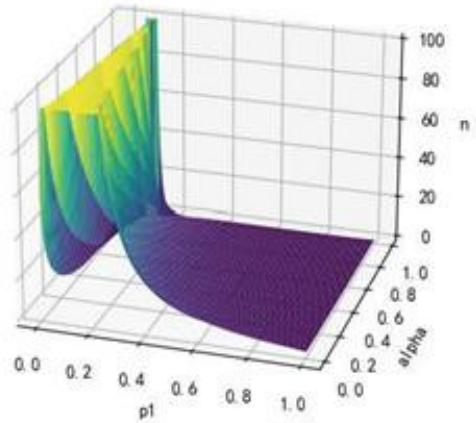  
图1

理想情况下， $\mathcal { P } 1$ 应当控制在0.13-0.15左右，而n应当小于100。求得 $( n , c )$ 数对如下： [65, 4], [42, 2], [28, 1], [91, 7]

方法二：

若 $\mathcal { P } = 0 . 1 \leq \mathcal { P } \ i$ ，则错判为拒收的概率应当小于5%，即

$$
1 - L ( p , n , c ) \leq \beta
$$

亦即

$$
{ \it L } ( p , n , c ) = P ( X \leq c ) = \sum _ { k = 0 } ^ { c } { \binom { n } { k } } p ^ { k } ( 1 - p ) ^ { n - k } \geq 1 - \beta = 0 . 9 5
$$

那么对于某个n，c应当有一个极限值 $c _ { 0 }$ ，使上式取等，由于n重伯努利分布对应的横坐标为整数，故 $c _ { 0 }$ 也为整数，合格的 $c _ { 0 }$ 所对应的抽样概率 $L ( p , n , c _ { 0 } )$ 应当尽可能接近0.95，人为规定误差为1%，那么可以列出

$$
\begin{array} { c } { { L ( p , n , c ) \geq 0 . 9 5 , \ldots ( c \geq c _ { 0 } ) } } \\ { { \ldots } } \\ { { \frac { L ( p , n , c _ { 0 } ) - 0 . 9 5 } { 0 . 9 5 } \leq 0 . 0 1 } } \end{array}
$$

由此遍历n值（一般小于100较为合适)，若存在 $c _ { 0 }$ 满足以上不等式，则对应的 $( n , c _ { 0 } )$ 数对即为所得抽样方案。所有可行的 $( n , c _ { 0 } )$ 数对如下：

[14,3], [20,4],[27,5], [33,6], [34,6], [40,7], [41,7],[47,8], [48,8],[55,9], [56,9],[62,10],

[63, 10], [70, 11], [71, 11], [77, 12], [78, 12], [79, 12], [85, 13], [86, 13], [93, 14], [94, 14]

## 5.1.7 问题 1（2) 的求解

未知数为 $\mathcal { P } _ { \tilde { 1 } }$ 和 $\beta$

方法一：

通过遍历 $p _ { 1 }$ 和 $\beta$ 得到n的最小值。同理

$$
n _ { m i n } = \frac { [ Z ( \alpha ) \sqrt { p _ { 0 } ( 1 - p _ { 0 } ) } - Z ( 1 - \beta ) \sqrt { p _ { 1 } ( 1 - p _ { 1 } ) } ] ^ { 2 } } { ( p _ { 1 } - p _ { 0 } ) ^ { 2 } }
$$

同样，以 $\mathcal { P } _ { 1 }$ 和 $\beta$ 为横、纵坐标，n为纵坐标，作出二维函数图。

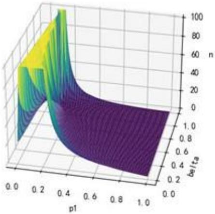  
图2

同理，理想情况下， $\mathcal { P } \tau$ 应当控制在0.15左右，而n应当小于100。求得 $( n , c )$ 数对如下：[68,10], [52,8], [55, 13]

方法二：

同问题一(1)，若 $\mathcal { P } = 0 . 1 \geq \mathcal { p } _ { 0 }$ ，则错判为接受的概率应当小于10%，即

$$
L ( p , n , c ) \leq \alpha
$$

亦即

$$
L ( p , n , c ) = P ( X \leq c ) = \sum _ { k = 0 } ^ { c } { \binom { n } { k } } p ^ { k } ( 1 - p ) ^ { n - k } \leq \alpha = 0 . 1
$$

同样的，对于某个n值，应当存在一个 $c _ { 0 }$ 值，满足下述不等式

$$
\begin{array} { c } { { L ( p , n , c ) \leq 0 . 1 . . . . . ( c \leq c _ { 0 } ) } } \\ { { \underline { { { 0 . 1 - L ( p , n , c _ { 0 } ) } } } < 0 . 0 1 } } \end{array}
$$

遍历 $\mathbf { n }$ 求得 $( n , c )$ 数对如下：

$$
[ 6 5 , 3 ] , [ 7 8 , 4 ]
$$

## 5.1.8 小结

结果表明实际应用过程中经常使用的 $( n , c )$ 抽样法较简单随机抽样优 $( ( n , c )$ 数对的意思为判断n件产品中次品数是否超过c，若超过则不接受，若不超过则接受)。

## 5.2 问题二的求解

## 5.2.1 未知数假设

对于决策1，有四种情况，即两种零配件都检验、都不检验、只检验零配件1、只检验零配件2。考虑到从决策2开始，都只考虑成品，决策过程相似，故将决策1的四种情况合并，并对每项决策都设计检验参数来模拟是否检验产品。

对于零配件1. 其检验参数设为 $x _ { 1 }$ ，其值为1则对零配件1检验，其值为0则不对零配件1检验；

对于零配件2，其检验参数设为 $x _ { 2 }$ ，意义同理；

成品的检验参数设为 $x _ { 3 }$ ，由于决策2考虑的是每件成品，故该参数应为介于0到1中的某个值，其实际意义为对占比为 $x _ { 3 }$ 的成品进行检验。

## 5.2.2 模型建立

Step1.

首先，对于两种零配件，企业花费的购买价格为

$$
M _ { b } = n _ { 1 } M _ { 1 } + n _ { 2 } M _ { 2 }
$$

两种零配件的检验个数为

$$
n _ { 1 } ^ { ' } = n _ { 1 } x _ { 1 } , n _ { 2 } ^ { ' } = n _ { 2 } x _ { 2 }
$$

两种零配件的检验成本为

$$
M _ { t _ { 1 } } = n _ { 1 } x _ { 1 } T _ { 1 } + n _ { 2 } x _ { 2 } T _ { 2 }
$$

最终进入成品装配的两种零配件的个数为

$$
\begin{array} { r } { n _ { 1 } ^ { \prime \prime } = n _ { 1 } ( 1 - x _ { 1 } ) + n _ { 1 } x _ { 1 } ( 1 - P _ { 1 } ) } \\ { n _ { 2 } ^ { \prime \prime } = n _ { 2 } ( 1 - x _ { 2 } ) + n _ { 2 } x _ { 2 } ( 1 - P _ { 2 } ) } \end{array}
$$

两种零配件丢弃的个数为

$$
n _ { 1 } = n _ { 1 } x _ { 1 } P _ { 1 } , n _ { 2 } = n _ { 2 } x _ { 2 } P _ { 2 }
$$

零件更新流程图如下。

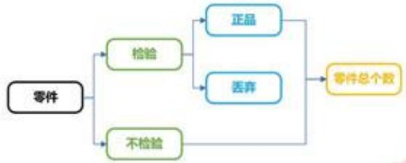  
图3

其中两种零配件的合格数为

$$
n _ { 1 } ^ { * } = n _ { 1 } ( 1 - P _ { 1 } ) , n _ { 2 } ^ { * } = n _ { 2 } ( 1 - P _ { 2 } )
$$

则两种零配件的新次品率为

$$
P _ { 1 } ^ { * } = { \frac { P _ { 1 } ( 1 - x _ { 1 } ) } { 1 - x _ { 1 } P _ { 1 } } } , P _ { 2 } ^ { * } = { \frac { P _ { 2 } ( 1 - x _ { 2 } ) } { 1 - x _ { 2 } P _ { 2 } } }
$$

成品个数为

$$
n = m i n ( n _ { 1 } , n _ { 2 } )
$$

因为现在零配件1的次品率为 $P _ { 1 } ^ { * }$ ，零配件2的次品率为 $P _ { 2 } ^ { * }$ ，两个正品零配件装配成功的概率为 $1 - P _ { 3 }$ ，则这些成品的正品率为

$$
( 1 - P _ { 1 } ^ { * } ) ( 1 - P _ { 2 } ^ { * } ) ( 1 - P _ { 3 } )
$$

这些成品的次品率为

$$
P _ { 3 } ^ { * } = 1 - ( 1 - P _ { 1 } ^ { * } ) ( 1 - P _ { 2 } ^ { * } ) ( 1 - P _ { 3 } )
$$

Step2.

检测成品的个数为

$$
n ^ { ' } = n x _ { 3 }
$$

成品的检测成本为

$$
M _ { t _ { 2 } } = n x _ { 3 } T _ { 0 }
$$

则可以直接售卖并盈利的成品个数为

$$
n _ { p } = n x _ { 3 } ( 1 - P _ { 3 } ^ { * } ) + n ( 1 - x _ { 3 } ) ( 1 - P _ { 3 } ^ { * } )
$$

盈利的收入为

$$
M _ { p } = [ n x _ { 3 } ( 1 - P _ { 3 } ^ { * } ) + n ( 1 - x _ { 3 } ) ( 1 - P _ { 3 } ^ { * } ) ] M _ { 0 }
$$

检测过的成品中，不合格数为

$$
{ n } ^ { \prime \prime } = n x _ { 3 } P _ { 3 } ^ { * }
$$

Step3.

设其中需要拆解的比例为 $x _ { 4 }$ ，则拆解的数目为

$$
n _ { d m _ { 1 } } = n x _ { 3 } P _ { 3 } ^ { * } x _ { 4 }
$$

拆解花费为

$$
M _ { d m _ { 1 } } = n x _ { 3 } P _ { 3 } ^ { * } x _ { 4 } D _ { 0 }
$$

直接丢弃的数目为

$$
n _ { d e _ { 1 } } = n x _ { 3 } P _ { 3 } ^ { * } ( 1 - x _ { 4 } )
$$

Step4.

未检测过的成品个数为

$$
n _ { t } = n ( 1 - x _ { 3 } )
$$

其中不合格成品数为

$$
n _ { t 1 } = n ( 1 - x _ { 3 } ) P _ { 3 } ^ { \ast }
$$

这些不合格产品产生的调换费用为

$$
M _ { c } = n ( 1 - x _ { 3 } ) P _ { 3 } ^ { * } C _ { 0 }
$$

调换回企业后，设这些不合格产品决定拆解的比例为 $x _ { 5 }$ ，则拆解费用为

$$
M _ { d m _ { 2 } } = n ( 1 - x _ { 3 } ) P _ { 3 } ^ { * } x _ { 5 } H _ { 0 }
$$

直接丢弃的数目为

$$
n _ { d c _ { 2 } } = n ( 1 - x _ { 3 } ) P _ { 3 } ^ { * } ( 1 - x _ { 5 } )
$$

## 5.2.3 成品决策的流程图

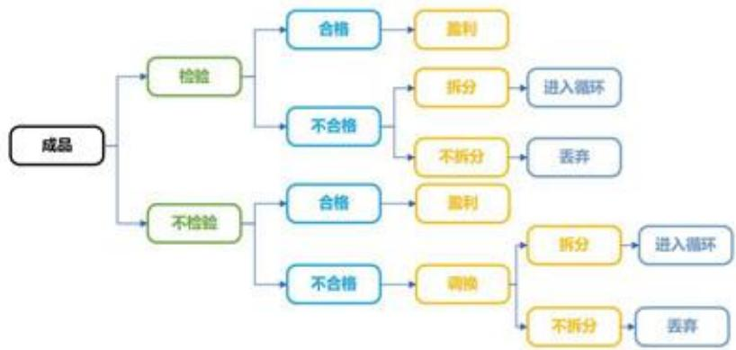  
图4

## 5.2.4 生产过程中检验与否的讨论

若某批零件有一定的次品率，即不能100%确定它是正品还是次品。如果由某零件生产的产品是次品，那么也无法确定该产品拆解得到的零件是否为次品。进一步讲即使检测了一部分，但生产时又将检测出来的正品零件和未知质量的零件混合，即使拆解也无法确定哪些是正品，哪些是次品了。故不能省去关键的检测步骤。(与问题三的第二个小循环的情形存在差异)

## 5.2.5 决策指标计算

在这个过程中，销售收入(即盈利收入)为

$$
M _ { p } = n ( 1 - P _ { 3 } ^ { * } ) M _ { 0 }
$$

检测费用为

$$
M _ { T } = n _ { 1 } x _ { 1 } T _ { 1 } + n _ { 2 } x _ { 2 } T _ { 2 } + n _ { 3 } x _ { 3 } T _ { 3 }
$$

装配成本为

$$
M _ { \alpha } = n H _ { 0 }
$$

拆解成本为

$$
M _ { d m } = n x _ { 3 } P _ { 3 } ^ { * } x _ { 4 } D _ { 0 } + n ( 1 - x _ { 3 } ) P _ { 3 } ^ { * } x _ { 5 } D _ { 0 }
$$

考虑三个决策指标：直接盈利值(销售收入-检测成本-产品购买成本-拆解成本-装配成本)、不合格成品调换费用(包括了物流成本、企业信誉等)、环保性（丢弃产品的价值)。

其中调换费用虽然直接包含了有形的金钱损失，但也包括了无形的企业信誉，所以单独作为一个指标衡量。分别设为 $m _ { 1 } , m _ { 2 } , m _ { 3 }$ 。则

$$
\begin{array} { r } { m _ { 1 } = n ( 1 - P _ { 3 } ^ { * } ) M _ { 0 } - ( n _ { 1 } x _ { 1 } T _ { 1 } + n _ { 2 } x _ { 2 } T _ { 2 } + n _ { 3 } x _ { 3 } T _ { 3 } ) - } \\ { ( n _ { 1 } M _ { 1 } + n _ { 2 } M _ { 2 } ) - [ n x _ { 3 } P _ { 3 } ^ { * } x _ { 4 } D _ { 0 } + n ( 1 - x _ { 3 } ) P _ { 3 } ^ { * } x _ { 5 } D _ { 0 } ] - n H _ { 0 } } \end{array}
$$

$$
m _ { 2 } = n ( 1 - x _ { 3 } ) P _ { 3 } ^ { * } C _ { 0 }
$$

$$
m _ { 3 } = n _ { 1 } x _ { 1 } P _ { 1 } M _ { 1 } + n _ { 2 } x _ { 2 } P _ { 2 } M _ { 2 } + [ n x _ { 3 } P _ { 3 } ^ { * } ( 1 - x _ { 4 } ) + n ( 1 - x _ { 3 } ) P _ { 3 } ^ { * } ( 1 - x _ { 5 } ) ] ( M _ { 1 } + M _ { 2 } + H _ { 0 } )
$$

## 5.2.6 整体流程图

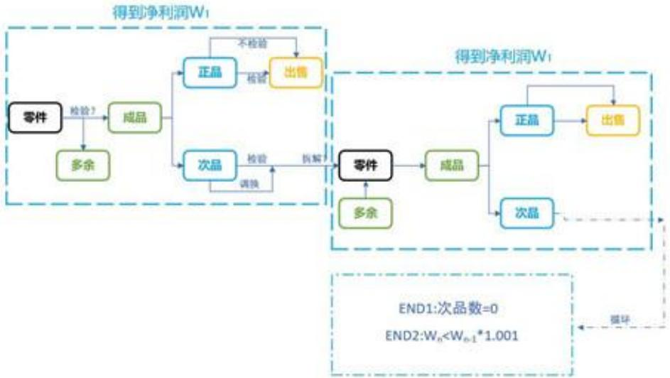  
图5

## 5.2.7 拆解后的处理

前述的讨论可以视作首次循环，为了最大化利用拆解后的产品，可以把拆解后的产品重新投入使用。对此又产生了新的决策分支:1.对这些拆解后的产品全部进行检测，若检测合格则重新装配出售；2.不检测，直接重新投入使用，但这些拆解后的产品次品率必然较大，故通过购买更多零配件以降下次品率，即进入第二层次循环。

对于决策1，可以对首次循环的检测情况作出优化:如果对零配件1、零配件2都检测，则进入参与成品生产的零配件均为正品，拆解后不需要进行检测，直接重新装配出售，节省了二次检测成本；对于其他三种情况，无法确定拆解后的零配件是否为次品，需要进行二次检测。

以上为理论最优情形，但在仿真过程中，考虑到现实处理的便利与变量分析的统一，对所有不合格产品（包括直接检测的和用户退回的）设定一个统一的拆解比例 $x = x _ { 4 } = x _ { 5 }$ ，再对拆解后得到的零件1和零件2分别设置一个额外的检测比例 $x _ { \beta } , x _ { 7 }$ ，并且从程序可行性角度出发，不严格设定 $x _ { 1 } , x _ { 2 }$ 的值为0或1，而是等同于其他检测比例，可以在 $0 \sim 1$ 间变动。

## 5.2.8 进一步的循环与退火算法

由于拆解这一步骤影响下一个循环，所以将第n轮循环最后的拆解步骤并入第 $n + 1$ 轮循环的起始步骤以便分析与处理。第 $n + 1$ 轮循环起始所具有的零配件应当为第n轮循环起始所余下的零配件和第n轮循环末尾拆解所得到的零配件，在该模型中，并不接续加入新零配件，即不考虑决策2。那么循环应当迅速收敛，因为每一轮循环后配件数会大大减少，三个指标值也会迅速减少。该猜想符合实际的仿真过程。

具体算法上，现在有三个决策指标 $m _ { 1 }$ 、 $m _ { 2 }$ 、 $m _ { 3 }$ ，需要进行优化的变量可以写成如下数组形式

$$
X = [ x _ { 1 } , x _ { 2 } , x _ { 3 } , x _ { 4 } , x _ { 5 } , x _ { 6 } , x _ { 7 } ]
$$

其中

$x _ { 1 }$ =是否对零件1进行检验

$x _ { 2 }$ =是否对零件2 进行检验

$x _ { 3 }$ =是否对成品进行检验

$x _ { 4 }$ =是否对检验过的成品中的次品进行拆解

$x _ { 5 }$ =是否对退回的成品进行拆解

$x _ { 6 }$ =是否对拆解后得到的零件1进行检验

$x _ { 7 }$ =是否对拆解后得到的零件2进行检验

且一般假定 $x _ { 4 } = x _ { 5 }$

对于多变量决策问题，可以采用模拟退火算法来优化变量矩阵X。对于某个X,每一轮循环都会得到三个指标值，即直接盈利值、调换费用、环保性，将这三个值累加到最终决策指标 $m _ { 1 } , m _ { 2 } , m _ { 3 }$ 上。这三个指标中， $m _ { 1 }$ 的重要性最大，而且数值比重也最大，故将中止循环的条件设为

$$
m _ { n + 1 } \leq 1 . 0 0 1 m _ { n }
$$

(意为盈利达到饱和，继续循环的意义不大，如若继续循环，甚至会亏本)

或

$$
\therefore a - 1 = - \frac { 5 } { 2 }
$$

故对于某个X，在进行若于轮循环后，盈利值达到饱和（实际3～8轮即接近饱和)，同时对应一个调换费用和一个环保性(这两个指标越低越好)，仿真的目标即为找到一个X，使盈利值尽可能大，调换费用和环保性尽可能小。

## 5.2.9 仿真结果分析

仿真结果非常理想，而且存在以下特点：

1. 尽管初始设定 $x _ { 1 }$ $x _ { 2 }$ 的值可变，但结果值总取在0或1，即决策1的四种情况。

2 $x _ { 3 }$ $x _ { 4 }$ (或 $_ { x _ { 5 } } )$ 的结果值同样取在0或1，即要么都检测要么都不检测。

3. $x _ { 6 }$ $x _ { 7 }$ 的值对最终结果影响非常小，大约在 $2 \sim 3 \%$ ，同时题干也并未要求对此进行讨论，可以视作过程量弱化其讨论结果，忽略不计。

## 5.2.10 最终结果与决策

仿真初始的两种零配件数量级设为10000，所得最优的6个X与对应的企业净盈利值如 下表。(将 $x _ { 4 }$ $x _ { 5 }$ 合并后X的长度由7变为6)

表1
<table><tr><td>情况</td><td>1</td><td>2</td><td>3</td><td>4</td><td>5</td><td>6</td></tr><tr><td>X</td><td>100101</td><td>110100</td><td>001111</td><td>111100</td><td>011110</td><td>000011</td></tr><tr><td>净盈利值</td><td>168993.2</td><td>95995</td><td>147894</td><td>117979</td><td>186483</td><td>185867</td></tr></table>

该表的对应决策如下：

(1)只检验零配件1，不检验零配件2，不检验成品，对所有不合格成品进行拆解。不检验拆解后得到的零配件1，检验拆解后得到的零配件2。

(2)对零配件1、2都检验，不检验成品，对所有不合格成品进行拆解。不检验拆解后得到的零配件。

(3)对零配件1、2都不检验，检验全部成品，对所有不合格成品进行拆解。检验所有拆解后得到的两种零配件。

(4)对零配件1、2都检验，检验全部成品，对所有不合格成品进行拆解。不检验拆解后得到的零配件。

(5)不检验零配件1，只检验零配件2，检验全部成品，对所有不合格成品进行拆解。检验拆解后得到的零配件1，不检验拆解后得到的零配件2。

(6)对零配件1、2都不检验，不检验成品，不拆解所有不合格成品。

## 5.2.11 小结

从结果中可见，当调换费用远大于成品检查费用时，期望进行成品检查，当次品率较大时，期望检查购买所得零件。 一学

## 5.2.12 算法合理性解释

模拟退火的某次优化过程如下图。

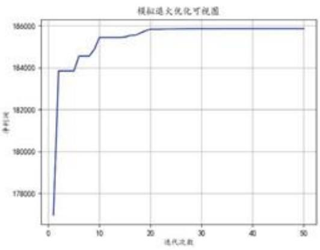  
图6

从图中可见，只有当 $x _ { i }$ 取到极值(0或1)时，才会达到最优的收敛值。

## 5.3 问题三的求解

## 5.3.1 决策模型的建立

分析过程同问题二，区别在于决策变量x增多，令决策矩阵

$$
X = [ x _ { 1 } , . . . , x _ { 1 6 } ]
$$

这些决策变量分别代表是否对8个零配件进行检验、是否对3个半成品进行检验、是否对成品进行检验、是否对三个半成品进行拆解、是否对成品进行拆解。同理，优化后的决策变量很可能只取0或1，但为了完成模拟退火的优化过程，允许其值在0\~1之间浮动。

具体决策过程如下。

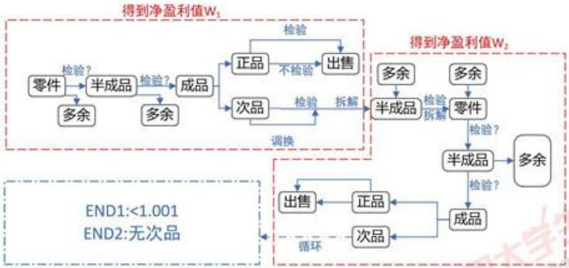  
图7

## 5.3.2 第一次小循环

首先在零件组成半成品时，会有多余的零件；在半成品组成成品时，会有多余的半成品；成品同样分为正品和次品(或者检验部分和不检验部分)。每一步都包含是否检验的决策参数。对于成品中的正品，可以直接出售盈利，并视作第一次循环停止，算出该循环内的直接盈利值 1 $W _ { 1 }$

## 5.3.3 第二次小循环

对于成品中的次品，可以决定是否拆解，拆解得到的半成品进入第二次循环，在这些半成品中加入第一次循环得到的多余半成品，并决定是否对这些半成品进行检验和拆解，对拆解出来的零件（并加入第一次循环多余的零件)重新组成半成品，再组成成品，最后正品出售盈利，次品重新进入循环。在第二次循环中同样可以得到一个直接盈利值 $W _ { 2 }$ ，这两个盈利值之和为一个大循环得到的总直接盈利值 $W _ { 3 }$ ，判断是否进入下一个循环的条件类似题二即 $W _ { 3 _ { n + 1 } }$ 是否小于 $1 . 0 0 1 W _ { 3 _ { n } }$ 或者是否产生了次品。

## 5.3.4 模型的优化

但该模型存在需要优化的地方，经过仔细分析后，将模型优化如下。

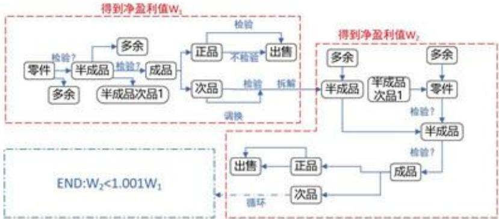  
图8

在优化前的模型中，进入第二个小循环的半成品拆解再组装，是一个重复步骤，故去掉该决策，而是只对已经检验出来的半成品次品进行拆解，在第二次组成半成品时加入这些半成品，再组装成成品进行第二次出售。

## 5.3.5 决策变量的优化

显然以上步骤并不止16个决策变量，而是27个(需要加上第二次循环中，是否对8个零件进行检验、是否对3个半成品进行检验)。但通过分析可以发现，若第一次循环已经对产品进行检验，在第二次循环中不必进行再次检验，反之亦然。所以实际上只需考虑16个决策变量。 AKov.c

在求解过程中发现,这些变量中,起到决定性作用的变量只有前12个即是否对零配件、半成品、成品进行检验，而是否拆解的决策重要性并不强。 dxs.

## 5.3.6 线性退火算法求解

求解过程依旧采用退火算法(设置初始零件为10000套)，求得最优结果如下。

表2
<table><tr><td>答案</td><td>1</td><td>2</td></tr><tr><td>X</td><td>1111111100011111</td><td>1111111111100001</td></tr><tr><td>净盈利值</td><td>448518</td><td>435188</td></tr></table>

转化为文字决策，即

(1)8种零件都检测，3种半成品都不检测，检测全部成品。次品（包括3种半成品以及成品）全部拆解。

(2)8种零件都检测，3种半成品都检测，不检测成品。对于次品，不拆解半成品，拆解全部成品。

## 5.3.7 小结

以上给出的两种最优方案有细微差别。最终盈利值较小（即第二种)的方案收敛较快，可以视作短期决策。最终盈利值较大（即第一种）的方案收敛较慢，可以视作长期决策。两种决策的利润曲线如下。

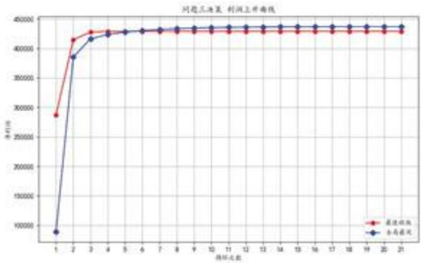  
图9

从图中可见，方案二在第三轮循环即达到收敛，方案一在第十轮循环后达到收敛。即企业若想达到最大利润，不考虑循环的时间成本，方案一较优。

## 5.4 问题四的求解

假设若根据简单随机抽样得到某次品率，可以使用贝叶斯统计推断来估计零件的真实次品率。该方法结合先验信息（可能的次品率分布）和抽样数据的似然函数来（二项分布)计算后验概率分布，从而得到零件真实的次品率。 中国e.g

## 5.4.1 先验分布

首先假设真实的次品率服从Beta分布，即先验分布。(Beta分布具有较好的性质，适于表示在[0,1]区间上各种形状的概率分布。因为它具有良好的形状灵活性，能够很好地描述对参数的先验认识，在贝叶斯统计中，Beta分布常常被用作先验分布。)Beta函数的定义为

$$
B ( \alpha , \beta ) = \int _ { 0 } ^ { 1 } u ^ { \alpha - 1 } ( 1 - u ) ^ { \beta - 1 } d u
$$

Beta分布的均值和方差分别为

$$
\begin{array} { c } { { \displaystyle \mu = \frac { \alpha } { \alpha + \beta } } } \\ { { \displaystyle \sigma ^ { 2 } = \frac { \alpha \beta } { ( \alpha + \beta ) ^ { 2 } ( \alpha + \beta + 1 ) } } } \end{array}
$$

归一化后得到的次品概率密度分布函数

$$
p ( \theta ) = f ( \theta ; \alpha , \beta ) = \frac { \theta ^ { \alpha - 1 } ( 1 - \theta ) ^ { \beta - 1 } } { B ( \alpha , \beta ) }
$$

## 5.4.2 似然函数

抽样数据服从二项分布，若次品率为 $\theta ,$ 抽样 n次，则出现 $\mathrm { c }$ 次次品的概率可以表示为

$$
L ( \theta , c ) = { \binom { n } { c } } \theta ^ { c } ( 1 - \theta ) ^ { n - c }
$$

## 5.4.3 后验概率

最后利用贝叶斯公式计算后验分布，并通过后验均值（即后验分布的最可能值）来估计真实的次品率，从而得到可能的真实次品率以及对应的置信度。积分形式下贝叶斯公式为

$$
P ( \theta | c ) = \frac { L ( \theta | c ) p ( \theta ) } { \int L ( \theta | c ) p ( \theta ) \mathrm { d } \theta }
$$

对于连续的参数变量 $\theta ,$ 其后验概率密度即为 $P ( \theta | c )$

为计算以上公式，需要设定 $\alpha$ $\beta$ 的初始值。其取值大小取决于对参数的信心程度。取值较小时，即对参数的先验知识不强，从而准许更多可能性；取值较大时，即对参数的先验性较强，对概率分布情况更有信心。参数的选择可以显著影响最终的后验分布，从而影响对真实参数的估计结果。

在贝叶斯推断中，通常会根据先验信息和信念程度来选择合适的先验分布参数alpha和beta。根据似然原则，令先验函数与似然函数成比例，则

$$
\begin{array} { c } { { \alpha - 1 = c } } \\ { { } } \\ { { \beta - 1 = n - c } } \end{array}
$$

带入贝叶斯公式，得到二项分布数据的后验概率密度函数

$$
P ( \theta | c ) = { \frac { \theta ^ { \delta - 1 } ( 1 - \theta ) ^ { \beta - 1 } } { B ( \bar { \alpha } , \beta ) } }
$$

$$
{ \bar { \alpha } } = \alpha + c
$$

$$
\bar { \beta } = \beta + n - c
$$

## 5.4.4 模拟仿真求解不同次品率的后验概率分布

例如，令 $n = 1 0 0 0 0 , c = 5 0 0$ ，则抽样得到的次品率为5.0%，可能的真实次品率均值为0.05008980243464378，置信度为0.95可能的真实次品率置信区间为[0.04590519,0.05444447]。同样若抽样得到的次品率为20.0%，可能的真实次品率均值为0.19976052684094991，置信度为0.95的可能的真实次品率置信区间为[0.19199026,0.20764429]。若抽样得到的次品率为10.0%，可能的真实次品率均值为0.09998004390341249，置信度为0.95的可能的真实次品率置信区间为[0.09418352,0.10592778]。

抽样后次品率为5.0%、10%和20%的后验概率分布图如下。

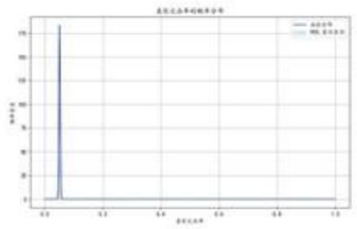  
(a) 次品率为 0.05

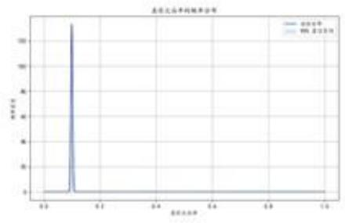  
(b) 次品率为 0.1

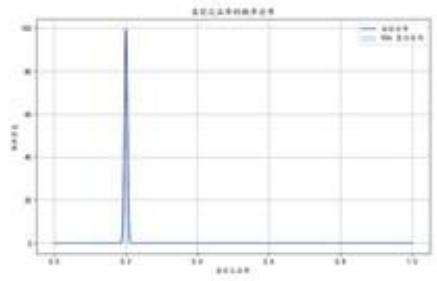  
(c) 次品率为 0.2  
图 10

## 5.4.5 重新求解问题二、三

最终的结果相当于在原有确定概率上加入了微扰。将扰动后的0.95概率置信区间的两个端点值作为新的次品率，重新进行问题二、问题三的操作，所得结果如下:

(1)对于问题二，在0.95置信区间下，所得决策不变，即5.2.10的六种决策方案。

(2)对于问题三，在0.95置信区间下，所得决策亦不变，即5.3.6的两种决策方案.决策矩阵分别为[1,1,1,1,1,1,1,1,0,0,0,1,1,1,1,1]、[1,1,1,1,1,1,1,1,1,1,1,0,0,0,0,1]。若带入置

信区间的左侧值，两种决策方案所得利润值分别为：448491.9298575758、436619.5888。若带入置信区间的右侧值，两种决策方案所得利润值分别为：425153.86094869545、421234.6082。

(3)对于问题三，画出两种不同扰动的利润上升曲线如下，可见特征依旧符合原来问题三的结论。

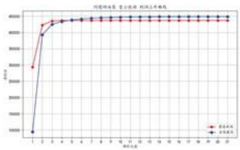  
(a)

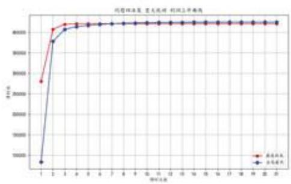  
图11  
(b)

## 5.4.6 小结

在0.95置信区间下，决策并未发生显著改变，说明本题的随机抽样不会对决策结果、净利润有较大影响。

## 6模型改进

(1)问题三决策变量较多，传统的模拟退火、禁忌搜索蚁群算法、遗传算法等，效果无法达到预期。

(2)问题三更改了模拟退火算法中一些关键函数，从而可以使用优化后的遗传算法，即类似于最速粒子群算法和飞蛾扑火算法，但即使这两个算法在特定情况下结果比较好，情况依然非常多。

(3)预期在这两个算法的基础上，使用最速粒子群算法得到一个更好的快速迭代方法。

## 7 模型优缺点评价

## 7.1 模型优点

(1)模型的稳定性:第二问和第三问分成两个模块，多个步骤，不需要考虑扰动的问题本文的模型给出了期望值，并且十分准确。第四问加入扰动，但决策结果不变，证明模型至少有95%以上的抗扰动能力。且模型随着加工的零件和产品数目上升，越来越稳定。

(2)模型的灵敏性:问题二使用模拟退火算法可以收敛到局部最优解。通过多次使用模拟退火可以筛选出一两个备用的决策，发现在几个情况下最优的决策比次优的决策仅仅高出0.012的利润。 s.mc

(3)算法:本文模型是一个线性进程，有多个步骤，每个步骤都是一个循环。于是可以无限循环迭代。而且使用了非传统的线性模拟退火。筛选出最优解以及几个备用决策，把备用的决策再验算，便得出正确的解。

## 7.2 模型缺点

(1)迭代过程中有部分决策过程不合适，但是最终结果正确。

(2)通过模型，整个仿真过程转化成不断迭代的线性进程。但该模型忽视了一种情况，一般在生产中会优先使用检测出来的正品，但模型中存在检测到的是正品，又对其拆解的情况。但最后迭代得出的结果表明该现象为算法区域机制，对于最终结果不存在任何影响。

(3)生产规模很小的情况下，决策不一定最好，因为模型建立在10000套的基础上，更适用于常规规模。

## 8参考文献

## 参考文献

[1] 孙小素，尚书钰.计数标准型一次抽样检验方案设计方法探讨 兼议 GB/T 132622008 改进问题[J]. 山东工商学院学报,2024,38(01):69-76.

## 9 附录

## 9.1 程序结果汇总

## 9.2 代码汇总

```python
from scipy.stats import norm
import math
import random
import matplotlib.pyplot as plt
import numpy as np
plt.rcParams['font.sans-serif'] = ['KaiTi']
前 plt.rcParams['axes.unicode_minus] = False
10 def quantile_value(p):
11 #计算标准正态分布的第p分位数值
12 value = norm. ppf(p)
18 return value
14 车在线
18 def get_n(p0, p1, alpha, belta):
10 swap_n = quantile_value(1 - alpha) * math.sqrt(p0 × (1 - p0)) - quantile_value(belta)
* math.sqrt(p1 * (1 − p1))
17 swap_n /= p1 - p0 中国大
18 return swap_n ** 2 if swap_n ** 2 < 100 else 100 dxs.moe.gov.
10
```

20]def get\_c(p0, p1, alpha, belta, n):   
21 # print(p0, p1, alpha, belta, n)   
22 1\_value = n \* p1 + quantile\_value(belta) \* math.sqrt(n \* p1 \* (1 − p1))   
23 r\_value = n \* p0 + quantile value(1 − alpha) × math.sqrt(n \* p0 \* (1 − p0))   
24 return l\_value, r\_value   
2t   
20 def get\_ans(p1, belta):   
27 n = get\_n(p0, p1, alpha, belta)   
28 c\_1, c\_r = get\_c(p0, p1, alpha, belta, n)   
20 # print(n, c\_1, c\_r)   
10 return n, c\_l   
31   
22 def get\_ans\_n(p1, belta):   
33 n = get\_n(p0, p1, alpha, belta)   
34 c\_1, c\_r = get\_c(p0, p1, alpha, belta, n)   
35 # print(n, c\_1, c\_r)   
36 return n   
37   
38#todo：问题一，法一   
30print(”问题二，法一”)   
40f1 =open("问二，法一.txt”，mode="w”,encoding="utf-8")   
41p0 = 0.1   
42belta = 0   
43 p1 = 0   
alpha = 0.1   
48 for p1 in [0.001 \*\_ for \_ in range(1, 1000)if 0.001 \*\_!= p0]:   
45 for belta in [0.01 \* \_ for \_ in range(1, 100)]:   
47 n, c = get\_ans(p1, belta)   
48 if c < 0:   
40 continue   
书0 f1,write(f"p1 ={p1},belta = {belta},,,此时n为:{n},c为:{c}\n")   
61 # print(f"解为: p1 = {p1}, alpha = {alpha}")   
62 #print(f"此时n为：{n}，c为：{c}"}   
13x = np. array([0.001 \* \_ for \_ in range(1, 1000) if 0.001 \* \_!= p0])   
64y = np.array([0.01 \* \_ for \_ in range(1, 100)])   
s x, y = np.meshgrid(x, y)   
86 custom\_function\_vectorized = np.vectorize(get\_ans\_n)   
sz = custom\_function\_vectorized(x, y)   
8#创建三维图形对象   
10fig = plt.figure()   
0ax = fig.add\_subplot(111, projection='3d')   
61   
42#绘制三维图形   
<1 ax.plot\_surface(x, y, z, cmap='viridis')   
04   
05#设置坐标轴标签   
ax.set\_xlabel('pl')   
ax.set\_ylabel('belta')   
sax.set\_zlabel('n') 中国大学   
69ax.set\_title('问题二方法一) dxs.moe.   
70plt.show()

```python
71
p from scipy.stats import norm
import math
7 import random
import matplotlib.pyplot as plt
76 import numpy as np
7.7
78 plt.rcParams['font.sans-serif']= ['KaiTi']
plt.rcParams['axes.unicode_minus'] = False
80
a1 def quantile_value(p):
B2 #计算标准正态分布的第p分位数值
83 value = norm.ppf(p)
34 return value
88
def get_n(p0, p1, alpha, belta):
a7 swap_n = quantile_value(1 − alpha)  math.sqrt(p0  (1 − p0)) − quantile_value(belta)
* math.sqrt(p1 * (1 − p1))
B swap n /= p1 - p0
8 return swap_n ** 2 if swap_n ** 2 < 100 else 100
00
01 def get_c(p0, p1, alpha, belta, n):
92 1_value = n * p1 + quantile_value(belta) * math.sqrt(n * p1 * (1 − p1))
05 r_value = n * p0 + quantile_value(1 − alpha) * math,sqrt (n * p0 * (1 − p0))
94 return 1_value, r_value
06
def get_new_ans(p1, alpha, t):
07 p1 += 2=random.random()·math.exp(t − 1000)- math.exp(t − 1000)
08 alpha += 2 × random.random() * math.exp(t − 1000) − math.exp(t − 1000)
00 return pl, alpha
100
101 def get_ans(p1, alpha):
102 n = get_n(p0, p1, alpha, belta)
103 c_1, c_r = get_c(p0, p1, alpha, belta, n)
104 # print(n, c_1, c_r)
105 return n, c_l
106
10T def get_ans_n(p1, alpha):
108 n = get_n(p0, p1, alpha, belta)
10g c_1, c_r = get_c(p0, p1, alpha, belta, n)
110 # print(n, c_1, c_r)
111 return n
112
111 def is_ans(p1, alpha):
114 if p1 < 0.13 or p1 > 0.19 or p1 <= p0:
115 return False
116 117 if alpha < 0 or alpha > 1: return False 中国大学生在线
118 return True
dxs.moe.gov.cm
110
120
```

```python
121]def get_p(delta,t):
122 #返回一个无限小的正数，范围为0到1
123 #随着退火次数增加而越来越小
124 return math.exp(-delta/t)
125
12## todo：问题一，法一
127# print(”问题一，法一”)
128# f1 = open(”问题一，法一.txt”，mode="w”，encoding="utf-8")
120 # p0 = 0.1
130# belta = 0.05
131 # p1 = 0.15
132# alpha = 0.1
133 # for p1 in [0.001 * _ for _ in range(1, 1000) if 0.001 •_[= p0]:
134# for alpha in [0.01  _ for _ in range(1, 100)]:
138# n, c = get_ans(p1, alpha)
136# if c < 0:
137# continue
138# f1.write(f"p1 = {p1},alpha = {alpha},,,此时n为:{n}, c为: {c}\n")
130# # print(f"解为: p1 = {p1}, alpha = {alpha}")
140# #print(f"此时n为：{n}，c为：{c}")
14:# x = np.array([0.001 • _ for _ in range(1, 1000) if 0.001 • _|= p0])
142# y = np.array([0.01 * _ for _ in range(1, 100)1)
143 # x, y = np . meshgrid (x, y)
144# custom_function_vectorized = np.vectorize(get_ans_n)
14s# z = custom_function_vectorized(x, y)
146##创建三维图形对象
147 # fig = plt. figure()
148# ax = fig.add_subplot(111, projection='3d')
140#
150##绘制三维图形
1:# ax.plot_surface(x, y, z, cmap='viridis')
152#
163##设置坐标轴标签
154# ax.set_xlabel('p1')
185# ax.set_ylabel('alpha')
# ax.set_zlabel('n')
157# ax.set_title('问题一 方法一)
15s# # ax.set_zlim(0, 10)
159# plt.show()
160#
1#1 ##t = 1000 #初始化温度值
162## t_min = 980 #设置温度下限
162 ##k = 1000 #设置迭代次数（有用吗）
104##
165 ## while (t > t_min):
16## for i in range(500):
187## n, c = get__ans(p1, alpha)
168## pl_, alpha__ = get_new_ans(p1, alpha, t)
100## if is_ans(pl__, alpha_): 中国大学
170## n_, c_ = get_ans(pl_,alpha_}) dxs.moe.g
171## delta = n_- n
```

```python
172## #n最小
173## if c_ > 0:
174## if delta < 0:
175## p1, alpha = pl_, alpha_
176## else:
177## p = get_p(delta, t)
178## if (p > random.random ()):
170## p1, alpha = p1_, alpha_
180 ##
181## print(f”当前最优解为:p1 ={p1},alpha ={alpha}")
102## print(f”此时n为：{n}，c为：{c}”}
183## # t = t · alpha #温度下降
184## t-=0.01
185 ##
ise # # n, e = get_ans(p1, alpha)
18# # print(f"最优解为: p1 = {p1}, alpha = {alpha}")
1##print(f”此时n为：{n}，c为：{c}”)
100#问题一
190 import scipy.stats as stats
191
192p = 0.1
103 n_values = range(10, 101)
104 valid_n_values = []
105 for n in n_values:
190 binom_dist = stats.binom(n, p)
107 c0 = binom_dist. ppf(0.95)
1u8 P_X_leq_c0 = binom_dist. cdf(c0)
190 diff = (P_X_leq_c0 − 0.95) / 0.95
200 if diff < 0.01:
201 valid_n_values.append([n, c0])
203 print(f”符合条件的所有n为：{valid_n_values}")
202
204#问题二
205 valid_n_values = []
200 for n in n_values:
207 binom_dist = stats.binom(n, p)
208 c0 = binom_dist. ppf(0.1) - 1
20G P_X_leq_c0 = binom_dist.cdf(c0)
210 # print(P_X_leq_c0)
211 diff = (0.1 - P_X_leq_c0) / 0.1
212 if diff < 0.01:
213 valid_n_values.append([n, c0])
214 print(f”符合条件的所有n为：{valid_n_values}")
215 import numpy as np
216 import pandas as pd
217 import random
218 from statsmodels.stats.proportion import proportions_ztest
219
220
221 def ztest_func(data_get):
222
```

```python
223 传人一维列表，表示样本
224 :param data_get:
225 :return:
226
227 # todo:对抽样数据进行检验 检验
228 data_get = np.array(data_get, dtype="int32")
229 #进行z检验
220 wanna_ p0 = 0.1
237 no_num = int((data_get = 0).sum())
202 all_num = len (data_get)
333 print(f"次品个数：{no_mum}，整体数目：{all_num}")
234
238 #检验一
230 print("检验一")
237 #smaller'代表低于alpha时成立，
22.8 z_stat, p_val = proportions_ztest(no_num, all_num, wanna_pO, alternative='smaller')
230 print(f"Z statistic: {z_stat}. P-value:{p_val}")
240
241 #判断原假设
242 alpha = 0.10
241 if p_val < alpha:
244 print(”拒绝零假设：即认为有90%的把握认为次品率低于10%”)
245 else:
240 print(接受零假设：即认为没有90%的把握认为次品率低于10%”)
247
248 #检验二
240 print("检验二")
260 #larger'代表高于alpha时成立，
261 z_stat, p_val = proportions_ztest(no_num, all_num, wanna_pO, alternative='larger')
282 print(f"Z statistic: {z_stat}, P-value:{p_val}")
26.3
264 #判断原假设
008 alpha = 0.05
256 if p_val < alpha:
257 print(”拒绝零假设：即认为有95%的把握认为次品率大于10%”)
258 else:
259 print(接受零假设：即认为没有95%的把握认为次品率大于10%)
200
261
202np.random.seed(12845425)
23random.seed(10524) #设置随机数种子，以确保结果可重复
204
205# todo：生成合理的样本
200#样本总数确定
data_num = 100000
268 cipin_lv = 0.11
200 中国大学生在线
270##样本生成（应当是二项分布）
271 # data_0_num = int (data_num  cipin_lv) moe.gov.cn
272 # data 1_num = int (data_num - data_ 0_num)
27z# data_get = np.concatenate((np.zeros (data_0_num), np.ones (data_
```

```python
274|# np.random. shuffle(data_get)
278## print{f”生成数据：{data__get}”)
270
277#样本生成（正态分布，较大的90%为正品，其余为次品）
278 data_get = np.random.normal(loc=0, scale=1,size=data_num)#均值为0，标准差为1
279 threshold = np-percentile(data_get, cipin_lv * 100)
280 data_get[data_get >= threshold| = 1
281 data_get[data_get != 1] = 0
282# print(f”生成数据：{data_get}"}
283
284#样本保存
285df = pd. DataFrame(data__get，columns=[样本(0为次品，1为合格)])
286f1 =第一间/问题一数据.x1sx
287 df.to_excel(f1, index=False)
288 print(f"样本已成功生成并保存到{f1}文件中。”)
290no_num = int((data_get = 0).sum())
290 all_num = len(data_get)
291 print(f”次品个数：{no_num}，签体数目：{all_num}")
292
293# todo:尝试不同的抽样方法
204#简单随机抽样，整群抽样，二重抽样
200
29 #截人数据并建检验数据
207 df =pd,read_excel(’第一同/间题一数据.xlsx，sheet_name='Sheet1)
298 data_get = df[’样本(0为次品，1为合格）]
290 print(f”首先进行数据检验，此批产品中合格率为：{np.sum(data_get)/len(data_get)}")
200 print(f"此批产品中次品率为：{(1 -np.sum(dats_get)/len(data_get))•100}%”)
301
302
303# todo：简单随机抽样
304#确定抽样比例
305 data_get = df [样本(0为次品，1为合格）]
sono_num = int((data_get = 0).sum())
307 all_num = len(data_get)
308 sample_num = all_num * 0.1
300#进行抽样
s10random_indices = random. sample(range(all_num), int(sample_num))
a11 # print (random_indices)
112 sample = [data_get [i] for i in random_indices}
print(”随机抽样的样本为：”，sample)
314ztest_func(sample)
510
31# todo:整群抽样
517#依据排序进行分组，10个位一组
s18data_get = df[样本（0为次品，1为合格）] 在线
310all_num = len(data__get)
210
1
221#创建划分好的产品群体 222 all_num = len(data_get) 中国大 dxs.moe.gov.
323sample_num = all_num * 0.1
```

```python
224| sample_indices = random. sample(range(all_num), int (sample_num))
325
220 #抽取整个群的产品作为样本
227 sample = []
328 for indices in sample_indices:
220 sample += data_get[indices]
330
331#打印抽样结果
332print(”整群抽样的样本为:”，sample)
833 ztest_func(sample)
334
33# todo:二重抽样
836#第一阶段抽样
337 data_get = df['样本（0为次品，1为合格）]
338 all_num = len(data_get)
330 sample_num = all_num * 0.5
240 random_indices = random.sample(range(all_num), int(sample_num))
241 data_get = [data_get[i] for i in random_indices]
342# print(”一重抽样的样本为：”，data_get)
343#第二阶段抽样
344data_get = np.array(data_get)
346 all_num = len(data_get)
340 sample_num = all_num * 0.2
347 random_indices = random.sample(range(all_num), int(sample_num))
348 sample = [data_get[i] for i in random_indices]
240 print("二重抽样的最终样本为：”，sample)
350 ztest_func(sample)
361
352# todo:尝试不同的抽样方法
3#简单随机抽样，整群抽样，二重抽样
354
358 import numpy as np
356 import pandas as pd
351 from statsmodels.stats.proportion import proportions_ztest
558 import random
350
360#载入数据并建检验数据
361 df = pd.read_excel('第一同/问题一数据.xisx'，sheet_name='Sheet1')
382 data_get =df|样本（0为次品，1为合格）]
3码 print(f”首先进行数据检验，此批产品中合格率为：{up.sum(data_get)/len(data_get)}")
304
386 random.seed(1024)#设置随机数种子，以确保结果可重复
386
367# todo：简单随机抽样
308#确定抽样比例
300data_get = df[样本（0为次品，1为合格）]
370|no_num = int((data_get = 0).sum())
571 all_num = len(data_get) 中国大学生
872 sample_num = all_num * 0.1
373#进行抽样 dxs.moe.
374random_indices = random. sample(range(all_num), int(sample_num))
```

```python
37s# print (random_indices)
s7e sample = [data_get[i] for i in random indices]
377 print(”随机抽样的样本为：”，sample)
878
179
380# todo:整群抽样
383#依据排序进行分组，10个位一组
382 data_get = df['样本（0为次品，1为合格）]
383 all_num = len(data_get)
884 data_get = [[data_get[__ + _ * 10] for _in range(10)] for _ in range(int(all_num / 10))
335#创建划分好的产品群体
38 all_num = len(data_get)
387 sample_num = all_num * 0.1
388 sample_indices = random.sample(range(all_num), int(sample_num))
380
290 #抽取整个群的产品作为样本
201 sample = []
292 for indices in sample_indices:
395 sample += data_get[indices]
294
395#打印抽样结果
396 print("整群抽样的样本为:”，sample)
397
3a8# todo: 二重抽样
300#第一阶段抽样
400 data_get = df|样本（0为次品，1为合格)
407 all_num = len(data_get)
402 sample_num = all_num * 0.5
403 random_indices = random.sample(range(all_num), int(sample_num))
404 data_get = [data_get[i] for i in random_indices]
40 print("一重抽样的样本为:”，data_get)
400 #第二阶段抽样
407 data_get = np.array(data_get)
401 all_num = len(data_get)
400 sample num = all_ num * 0.2
410 random_indices = random.sample(range(all_num), int(sample_num))
411 sample = [data_get[i] for i in random_indices]
412print("二重抽样的最终样本为：”，sample)
413
414
410
41€
417
418
410
420## 421 # data_get = np.array(sample) 中国大学生在线
423##进行z检验
dxs.moe.gov.cn
423 # wanna_p0 = 0.1
424# no_num = int((data_get = 0).sum())
```

```python
423|# all_num = len (data_get)
420# print(f”次品个数：{no_num}，整体数目：{all_num }”)
427###
428##检验一
420# print(”检验一”)
420##'smaller'代表低于alpha时成立，
43:# z_stat, p_val = proportions_ztest(no_mum, all_num, wanna_p0, alternative='smaller')
432# print(f"Z statistic: {z_stat}, P-value:{p_val}")
433#
434##判断原假设
435 # alpha = 0.05
4 # if p_val < alpha:
437# print(”拒绝零假设：即认为有95%的把握认为次品率低于10%”)
438# else:
420# print(”接受零假设：即没有足够的证据认为次品率低于10%”)
440###
441##检验二
442# print(”检验二”)
443##'larger'代表高于alpha时成立，
44# z_stat, p_val = proportions_ztest(no_num, all_num, wanna_ p0, alternative='larger')
s# print(f"Z statistic: {z_stat}, P-value:{p_val}")
440#
447##判断原假设
448 # alpha = 0.10
440 # if p_val < alpha;
480# print(”拒绝零假设：即认为有90%的把握认为次品率大于10%”)
45:# else:
452# print(”接受零假设：即没有足够的证据认为次品率大于10%”)
452
454# todo:生成合理的样本
455
456import numpy as np
457 import pandas as pd
458
450#样本总数确定
400 data_num = 1000
41 data 0 num = int (data num * 0.12)
402 data_1_num = int (data_num - data_0_num)
402#样本生成
404np.random. seed(1024)
406 data_get = np.concatenate((np.zeros(data_0_num), np.ones(data_1_num)))
468 np.random.shuffle(data_get)
461#样本保存
408 df = pd.DataFrame(data_get，columns=[样本(0为次品，1为合格）1)
460 f1 =第一间/问题一数据.x1sx
470 df.to_excel(f1, index=False)
471 print(f”样本已成功生成并保存到{f1}文件中。") 国大学生在
472
472
```

题一代码

```python
import numpy as np
import pandas as pd
import random
import math
import matplotlib.pyplot as plt
import numpy as np
plt.rcParams['font.sans-serif'| = ['KaiTi']
plt.rcParams['axes.unicode_minus'] = False
def get_w(data_list):
#此处进行仿真，为时间角度考虑，仅循环两次
ans_list = []
# todo:过程函数
def get_new_part(n_part_ori, p_part_make, p_part_test):
#零件检测函数，输人零件数、次品率、检测率，得到新零件数、新次品率、检测数
n_part_good = n_part_ori . (1 - p_part_make)
n__part_bad = n_part_ori . p_part make
n_part bad_test = n_part bad * p_part test
n_part__new = n_part_ori - n_part_bad_test
p__part_new = 1 - n_part_good / n_part_new
return n_part_new, p_part_new, n_part_ori * p_part_test
defget_product(n_parts, P_parts, P_product_make):
#输入每种零件的个数，得到产品生产数、次品数、正品数
p_good = 1 - p_product_make
for enum in p_parts:
p__good ±= 1 - enum
n_parts = np. array(n_parts)
n_product = np. min(n_parts)
n_product_good = n_product * p_good
n_product_bad = n_product - n__product_good
return n_product, n_product_good, n_product_bad
def deal_product_bad2(n_product_bad, p_parts):
#输入次品数、每个零件的次品率，得到每种新的零件个数，每种新的零件的次品率（一个
成品由两个零件构成）
n_part_1 = n_product_bad
n_part_2 = n_product_bad
p_swap = p__parts [0] + p_parts [1] − p_parts [0] × p_parts [1] + (1 − p_parts [0]) * (
1 − p_parts [1]) * p_product_make
p_part_1 = p__parts [0]/ p_swap
p_part_2 = p_parts [1]/ p_swap
return n_part 1, n_ part 2, p_part 1, p_part_2
#循环仿真直至不能盈利 中国大学生在线
#此处使用法一（全程固定）进行循环处理 Axs.moe.gov.cn
#print("此处使用法一（全程固定）进行循环处理”)
```

```ini
# todo:决策变量
6. #总盈利值、丢弃成本，调换成本
w_1 = 0
8.2 w_2 = 0
54 w_3 = 0
08 # todo:决策方案变量
86 #检测率、拆解率
p_part1_test = data_list [0]
书8 p_part2_test = data_list [1]
80 p_product_test = data_list[2]
p_product_dismantle = data_list [3]
#
02 P_part1_test0 = data_list [4]
p__part2_test0 = data_list [5]
8 # todo:环境变量
#次品率
P_part1_make = 0.05
07 P.__part2_make = 0.05
P_product_make = 0.05
#购买或者制作单价
m_part1_buy = 4
m_part2_buy = 18
72 m_product_buy = 6 #制作单价
#测试单价
m__part1_test = 2
m_part2_test = 3
7 m_product_test = 3
#售价、拆解价格、调换价格
m_product_sale = 56
m_product_dismantle = 40
80 m_product_exchange = 10
#零件数（总是希望利用率最大）
n_part1_ori = 10000
n_part2_ori = 10000
# todo:仿真交换变量
n__part1_swap = 0
p___part1_swap = 0
n__part2_swap = 0
p__part2_swap = 0
#todo：仿真过程(每次仿真得到的新的决策变量应当在前一次的基础上改变)
90 count = 0
0 while True:
92 # print("asd")
#继承上次循环决策变量
0 w_1_new, w_2_new, w_3_new = w_1, w_2, w_3
9 count += 1
#print(f"当前是第{count}次循环”)
# todo:零件检测
if count == 1: 中国大
#首次进行时，需计算零件成本，计算零件检测成本
w_1_new -= n__part1_ori * m_part1_buy + n__part2_ori * m_part2_buy
```

#零件检测函数，输人零件数、次品率、检测率，得到新零件数、新次品率，检测数   
n\_part1\_new, P\_part1\_new, n\_part1\_test = get\_new\_part(n\_part1\_ori,   
P\_part1\_make, p\_part1\_test}   
n\_part2\_new, p\_part2\_new, n\_part2\_test = get\_new\_part(n\_part2\_ori,   
p\_part2\_make, p\_part2\_test)   
w\_1\_new -= n\_part1\_test × m\_part1\_test + n\_part2\_test \* m\_part2\_test   
w\_2\_new += (n\_part1\_ori − n\_part1\_new) \* m\_part1\_buy + (n\_part2\_ori -   
n\_part2\_new) \* m\_\_part2\_buy   
# print("asd")   
# print(n\_part1\_new, P\_part1\_new, n\_part1\_test)   
# print(n\_part2\_new, p\_part2\_new, n\_\_part2\_test)   
else:   
#其他情况，产品零件在最后一步进行处理，此处进行继承   
n\_part1\_new, p\_part1\_new = n\_part1\_swap, p\_part1\_\_swap   
n\_part2\_new, p\_part2\_new = n\_part2\_swap,p\_part2\_swap   
# todo:生成产品   
n\_product, n\_\_product\_good, n\_product\_bad = get\_product([n\_part1\_new, n\_part2\_new   
], [p\_part1\_new, p\_\_part2\_new],   
P\_product\_make)   
n\_part1\_ex = n\_part1\_new - n\_product   
n\_part2\_ex = n\_part2\_new - n\_product   
p\_part1\_ex = p\_part1\_new   
p\_part2\_ex = p\_part2\_new   
# print(n\_part1\_ex, n\_\_part2\_ex)   
# print(p\_part1\_ex, P\_part2\_ex}   
# print(n\_product, n\_product\_good, n\_product\_bad)   
w\_1\_new == n\_product \* m\_product\_buy   
#todo：计算决策变量（次品默认丢弃），区分产品正品与次品   
w\_1\_new += n\_product\_good \* m\_\_product\_sale - n\_product\_good \* p\_product\_test \*   
m\_product\_test   
w\_1\_ new -= n\_product\_bad  p\_product\_test \* m\_product\_test + n\_product\_bad  {   
1 - p\_product\_test) \* m\_product\_exchange   
# print(n\_product\_bad  p\_product\_test)   
# print(n\_product\_bad \* {   
# 1 - p\_product\_test}}   
w\_2\_new += n\_product\_bad × (m\_part1\_buy + m\_part2\_buy + m\_product\_buy)   
w\_3\_new += n\_product\_bad × m\_\_product\_exchange   
# w\_3\_new += n\_product\_bad \* (1 - p\_product\_test) • m\_product\_exchange   
# print(f"当前得到的净利润：{w\_1\_new}，环境成本：{w\_2\_new}，信用成本：{w\_3\_new}”}   
ans\_list,append([w\_1\_new, w\_2\_new, w\_3\_new])   
#print(f”上一轮得到的净利润：{w\_1}，环境成本：{w\_2}，信用成本：{w\_3}”}   
#todo:判断循环是否结束   
if w\_1\_new - w\_1 <= w\_1 \* 0.001 or p\_product\_dismantle = 0:   
break   
# todo：处理产品次品   
n\_product\_bad \* p\_product\_dismantle,   
P\_part1\_new, P\_part2\_new]) dxs.moe.gov.cn   
# print(n\_partl\_new1 + n\_part1\_ex)

```python
141 # print(n_part2_new1 + n_part2_ex)
146 P_part1_new1 = (n_part1_new1 * p_part1_new1 + n_part1_ex * p_part1_ex) / (
n_part1_new1 + n_part1_ex)
147 n_part1_new1 = n_partl_new1 + n_part1_ex
148 p__part2_new1 = (n_part2_new1 * p_part2_new1 + n_part2__ex * p_part2__ex) / (
n_part2_new1 + n_part2_ex)
140 n_part2_new1 = n_part2_new1 + n_part2_ex
180 # print(n_part1_new1, n_ part2 new1, p_part1_new1, p_ part2_new1)
w_1_new - (n_product_bad * p_product_ dismantle) * m_product_dismantle
362 w_2_new -= (n_product_bad * p_product_dismantle) * (m_part1_buy + m_part2_buy +
m_product_buy)
153 #todo：对于拆解得到的零件，此处讨论是否进行检验
154 #零件检测函数，输人零件数、次品率、检测率、得到新零件数、新次品率、检测数
15 n_part1_new, p_part1_new, n_part1_test = get__new_part(n_part1_new1, p_part1_new1,
p_part1_test0)
156 n_part2_new, p_part2_new, n_part2_test = get_new_part(n_part2_new1, P_part2_new1,
p_part2_test0}
157 # print(n_partl_new, p_part1_new, n_partl_test)
158 # print(n_part2_new, P_part2_new, n_part2_test)
180
100 w_1 new -= n_part1_test * m_part1_test + n_part2_ test * m_part2_test
101 w_2_new += (n_part1_new1 - n_part1_new) * m_part1 buy + (n_part2_new1 -
n_part2_new) * m_part2_buy
102 # todo:保留迭代值
103 w_1, w_2, w_3 = w_1_new, w_2_new, w_3_new
164 n__part1_swap, p_part1_swap, n_part2_swap, p_part2_swap = n_part1_new, p_partl_new
, n_part2_ new, p_part2_new
166
168 # print(f”最终得到的净利润：{w_1_new}，环境成本：{w_2_new}，信用成本：{w_3_new}”}
107 if len(ans_list) = 1:
108 return ans_list [0]
10 if ans_list[−2][0] > ans_list[−1][0]:
170 return ans_list[-2]
171 return ans list[-1]
172
173 def get_p(delta, t):
174 return math.exp(delta/t)
175
176def get_new_ans_list(ans_list, t):
177 swap_list = [|
178 for i in range(len(ans_list)):
170 # print(+ 2 = random.random() * math.exp(t - 1000) - math.exp(t - 1000))
180 swap_list.append(ans_list[i] + 2 * random. random() * math.exp(t - 1000) - math.
exp(t − 1000))
181 # print(swap_list)
183
for enum in ans__list]
183 return swap_list
184 dxs.moe.gov.cn
188 def is_ans_list(ans_list__new):
186 for enum in ans list_new:
```

```python
187 if enum < 0 or enum > 1:
103 return False
return True
190# todo:设定初始值
191 t = 1000 #初始化温度值
192 t_min = 100 #设置温度下限
103 # alpha = 0.99 #设置温度下降率
104k = 10000 #设置迭代次数
105# todo：给定一个初始解，
10c ans_list = [0.5, 0.2, 0.1, 0.1, 0.1, 0.1]
10:ans_w = 0
198ans_all = []
100# todo:开始退火过程
200 # while (t > t_min):
201 for i in range(50):
20:2 for i in range(k):
203 ans__w = get_w(ans_list)
204 ans_list_new = get_new_ans_list(ans_list, t)
205 if is_ans_list(ans_list_new):
206 # print("ok")
201 ans_w_new =get_w(ans_list_new)
208 delta = ans_w_new[0] − ans_w[0]
200 if delta > 0:
210 ans list = ans list new
211 # else:
212 # p = get_p(delta, t)
213 # # print(p)
214 # if (p < random.random()):
216 # ans_list = ans_list_new
210 # t = t * alpha
217 t −= 0.2
218 print(f"得到的净利润：{ans_w[0]}，环境成本：{ans_w[1]}。信用成本：{ans_w|2]}")
210 print(f"最优解为: {ans_list [0]},{ans_list [1]},(ans_list[2]},{ans_list[3]},{ann_list
[4]},{ans_list[5]}")
220 # print(f”最优解为: {ans_list[0]},{ans_list [1]},{ans_list [2]},{ans_list[3]}")
221 ans_all.append(ans__w[0]}
222 print(f”最终得到的净利润：{ans_w[0]}，环境成本：{ans_w[1]}，信用成本：{ans_w[2]}”)
228
224
226 iteration = list(range(1, len(ans_all) + 1))
220 plt.figure()
227 plt.plot(iteration, ans_all, marker=, color='b, linestyle=)
228 plt.xlabel('迭代次数')
220 plt.ylabel('净利润')
220 plt.title(模拟退火优化可视图)
23.1 plt.grid(True)
233 232 plt.show() 中国大学生在线
224 import numpy as np
dxs.moe.gov.cn
238 import pandas as pd
216import random
```

227import matplotlib.pyplot as plt   
235import numpy as np   
220   
240 plt.rcParams['font.sans-serif'] = ['KaiTi]   
241 plt,rcParams['axes.unicode\_minus'] = False   
242   
243   
244# todo:过程函数   
248 def get\_new\_part(n\_part\_ori, p\_part\_ make, p\_part\_test):   
240 #零件检测函数，输入零件数、次品率、检测率，得到新零件数、新次品率、检测数   
247 n\_part\_good = n\_part\_ori \* (1 - p\_part\_make)   
248 n\_part bad = n\_ part\_ori • p\_part make   
240 n\_part bad\_ test = n part bad  p\_part\_test   
250 n\_part\_new = n\_\_part\_\_ori - n\_part\_bad\_\_test   
251 p\_part\_new = 1 − n\_part\_good / n\_part\_new   
253 return n\_ part\_ new, p\_part new, n part ori » p part test   
223   
254   
255def get\_product(n\_parts, P\_parts, P\_product\_make):   
366 #输人每种零件的个数，得到产品生产数、次品数、正品数   
257 P\_\_\_good = 1 - p\_product\_make   
258 for enum in p\_parts:   
250 p\_\_good \*= 1 - enum   
200 n\_parts = np.array(n\_parts)   
201 n\_product = np.min(n\_parts)   
262 n\_product\_good = n\_product \* p\_good   
263 n\_\_product\_bad = n\_product - n\_\_product\_good   
264 return n\_product, n\_product\_good, n\_product bad   
265   
286   
207def deal\_product\_bad2(n\_product\_bad, P\_parts):   
288 #输入次品数、每个零件的次品率，得到每种新的零件个数，每种新的零件的次品率（一个成品   
由两个零件构成）   
200 n\_part\_1 = n\_product\_bad   
270 n\_part\_2 = n\_product\_bad   
271 p\_swap = p\_parts [0] + p\_parts[1] - p\_parts [0] \* p\_parts [1] + (1 − p\_parts [0]) \* (1 -   
P\_parts [1]) \* p\_product\_make   
272 p\_part\_1 = p\_parts [0] / p\_swap   
273 p.\_part\_2 = p\_parts[1] / p\_\_\_swap   
274 return n\_part\_1, n\_part\_2, p\_part\_1, p\_part\_2   
275   
278   
272#循环仿真直至不能盈利   
278#此处使用法一（全程固定）进行循环处理   
270print(”此处便用法一(全程固定）进行循环处理”)   
280# todo:决策变量   
202 w\_1 = 0 281 #总盈利值、丢弃成本，调换成本 中国大学生在线   
283w\_2 = 0 dxs.moe.gov.cn   
204w\_3 = 0   
283# todo:决策方案变量

286#检测率、拆解率   
387P\_part1\_test = 0.1   
208 p\_part2\_test = 0.1   
280p\_product\_test = 0.1   
290p\_product\_dismantle = 0.1   
291   
202 p\_part1\_test0 = 0.1   
293 P\_part2\_test0 = 0.1   
204# todo:环境变量   
205#次品率   
200   
207 p\_part1\_make = 0.1   
208p\_part2\_make = 0.1   
200p\_product\_make = 0.1   
500#购买或者制作单价   
201 m\_\_part1\_buy = 4   
302m\_part2\_buy = 18   
303 m\_product\_\_buy = 6 # 制作单价   
304#测试单价   
305m\_\_part1\_test = 2   
30m\_part2\_test = 3   
207m\_product\_test = 3   
208#售价、拆解价格、调换价格   
300 m\_product\_sale = 56   
310m\_product\_dismantle = 5   
x11 m\_product\_exchange = 6   
312#零件数（总是希望利用率最大）   
212 n\_part1\_ori = 10000   
814n\_part2\_ori = 10000   
115# todo:仿真交换变量   
316n\_part1\_swap = 0   
317P\_part1\_swap = 0   
318n\_part2\_swap = 0   
110p\_part2\_swap = 0   
820#todo：仿真过程(每次仿真得到的新的决策变量应当在前一次的基础上改变)   
321 count = 0   
22 ans\_all = []   
328 while True:   
224 #继承上次循环决策变量   
326 w\_1\_new, w\_2\_new, w\_3\_new = w\_1, w\_2, w\_3   
226 count += 1   
327 print(f"当前是第{count}次循环”)   
28 # todo:零件检测   
220 if count = 1:   
330 33.1 #首次进行时，需计算零件成本，计算零件检测成本 w\_1\_new -= n\_part1\_\_ori \* m\_part1\_buy + n\_\_part2\_ori \* m\_part2\_buy 生在线   
332 #零件检测函数，输人零件数、次品率、检测率，得到新零件数、新次品率、检测数   
533 n\_part1\_new, p\_partl\_new, n\_part1\_test = get\_new\_part(n\_partl\_ori, P\_partl\_make,   
p\_\_part1\_test)   
334 n\_part2\_new, P\_part2\_new, n\_part2\_test = get\_new\_part(n\_part2\_ori, p\_part2\_make,   
P.\_part2\_test)

335| w 1\_new -= n\_part1\_ test  m part1\_ test + n\_part2\_ test \* m\_part2\_test   
336 w\_2\_new += (n\_part1\_ori - n\_part1\_new) \* m\_part1\_buy + (n\_part2\_ori - n\_part2\_new   
) \* m\_part2\_buy   
557 print(n\_part1\_new, p\_partl\_new, n\_part1\_test)   
338 print(n\_part2\_new, p\_part2\_new, n\_part2\_test)   
220 else:   
340 #其他情况，产品零件在最后一步进行处理，此处进行继承   
241 n\_part1\_new, p\_partl\_new = n\_part1\_swap, P\_part1\_swap   
342 n\_part2\_new, P\_part2\_new = n\_part2\_swap, P\_part2\_swap   
242 # todo:生成产品   
344 n\_product, n\_product\_good, n\_product\_bad = get\_product([n\_part1\_new, n\_part2\_new], [   
p\_part1\_new, p\_part2\_new],   
348 p\_product\_make}   
340 print(n\_product, n\_product\_good, n\_product\_bad)   
247 w\_1\_new -= n\_product  m\_product\_buy   
348 #todo：计算决策变量（次品默认丢弃），区分产品正品与次品   
240 w\_1\_new += n\_product\_good = m\_product\_sale - n\_product\_good = p\_product\_test \*   
m\_product\_test   
350 w\_1\_new -= n\_product\_bad \* p\_product\_test \* m\_product\_test + n\_product\_bad = (1 -   
P\_product\_test} \* m\_\_product\_exchange   
351 w\_2\_new += n\_product\_bad \* (m\_part1\_buy + m\_part2\_buy + m\_product\_buy)   
362 w\_3\_new += n\_product\_bad \* (1 - p\_product\_test) \* m\_product\_exchange   
383 print(f"当前得到的净利润：{w\_1\_new}，环境成本：{w\_2\_new}，信用成本：{w\_3\_new}"}   
554 ans\_all.append(w\_1\_new)   
#print(f”上一轮得到的净利润：{w\_1}，环境成本：{w\_2}，信用成本：{w\_3}”}   
386 #todo:判断循环是否结束   
357 # if w\_1 new - w\_1 <= w\_1 \* 0.05 or p\_product\_dismantle = 0:   
38 #   
360 # break   
360 if count > 5:   
381 break   
302 # todo：处理产品次品   
383 n\_part1\_new1. n\_ part2\_ new1. p\_part1\_ new1, p\_part2\_new1 = deal\_product bad2(   
n\_product bad \* p\_product dismantle,   
384 1   
p\_part1\_new, p\_part2\_ new])   
265 # print(n\_partl\_new1, n\_part2\_new1, p\_part1\_new1, p\_part2\_new1)   
386 w 1\_new - (n\_product\_ bad. p\_\_product\_ dismantle) . m\_product\_dismantle   
387 w\_2\_new - (n\_product\_bad  p\_product\_dismantle) \* (m\_part1\_buy + m\_part2\_buy +   
m\_product\_buy)   
348 #todo：对于拆解得到的零件，此处讨论是否进行检验   
380 #零件检测函数，输人零件数、次品率、检测率，得到新零件数、新次品率、检测数   
370 n\_part1\_new, p\_part1\_new, n\_part1\_test = get\_new\_part(n\_part1\_new1, p\_part1\_new1,   
p\_part1\_test0}   
871   
p\_part2\_test0}   
872 # print(n\_part1\_new, p\_part1\_new, n\_part1\_test)   
873 # print(n\_part2\_new, p\_part2\_new, n\_part2\_test)   
874   
378   
376 w\_2\_new += (n\_part1\_new1 − n\_part1\_new) \* m\_part1\_buy + (n\_part2\_new1 - n\_part2\_new)

\* m\_part2\_buy   
377 # todo:保留迭代值   
371 w\_1, w\_2, w\_3 = w\_1\_new, w\_2\_new, w\_3\_new   
879 n\_partl\_swap, p\_part1\_swap, n\_\_part2\_swap, p\_part2\_swap = n\_partl\_new, p\_partl\_new,   
n\_part2\_new, p\_\_part2\_new   
380   
381   
382 print(f”最终得到的净利润：{w\_1\_new}，环境成本：{w\_2\_new}，信用成本：[w\_3\_new}”)   
383 iteration = list(range(1, len(ans\_all) + 1))   
884 plt.figure()   
308 plt.plot(iteration, ans\_all, marker=, color='b', linestyle=)   
386 plt.xlabel(循环次数)   
387 plt.ylabel(净利润')   
338 plt.title(仿真循环可视图')   
389 plt.grid(True)   
200plt.show()   
391   
202   
393   
294   
395   
300

题二代码

```python
import matplotlib.pyplot as plt
import numpy as np
from itertools import product
plt.rcParams['font.sans-serif'] = ['KaiTi']
plt.rcParams['axes.unicode_minus'] = False
def get_ans(x_list):
# todo:过程函数
def get_new_part(n_part_ori, p_part_make, p_part_test):
#零件检测函数，输入零件数、次品率、检测率，得到新零件数、新次品率、检测数
n_part_good = n_part__ori = (1 - p_part_make)
n_part_bad = n_part_ori * p_part_make
n_part_bad_test = n_part_bad + p_part_test
n__part_new = n_part_ori - n_part_bad_test
p.__part_new = 1 - n_part__good / n_part_ new
return n_part_new, p_part_new, n_part_ori * p_part_test
def get_product(n_parts, P_parts, P_product_make):
#输入每种零件的个数，得到产品生产数、次品数、正品数
p_good = 1 - p_product_make
for enum in p_parts: 中国大学生在
p_good = 1 - enum
n_parts = np.array(n_parts) Axs.moe.gov.cn
n_product = np.min(n_parts)
```

```ini
n_product_good = n_product * p_good
n_product bad = n_product - n_product_good
return n_product, n_product_good, n_product_bad
def deal_product_bad2(n_product_bad, p_parts, p_product_make):
#输人次品数、每个零件的次品率，制作工艺，得到每种新的零件个数，每种新的零件的次
品率（一个成品由两个零件构成）
33 n_part_1 = n_product_ bad
34 n_part_2 = n_product_bad
30 p_swap = p_parts [0] + p_parts [1] − p_parts [0] * p_parts [1] + (1 − p_parts [0]) * (
1 − p_parts [1]) * p_product_make
p_part_1 = p_parts [0] / p_swap
24 p_part_2 = p_parts [1] / p__swap
return n_part_1, n_part_ 2, p_part_ 1, p_part_2
def deal_ product_bad3(n_product_bad, p_parts, p_product_make):
42 #输人次品数、每个零件的次品率，得到每种新的零件个数，每种新的零件的次品率（一个
成品由三个零件构成）
43 n_part_1 = n_product_bad
44 n_part_2 = n_product_bad
45 n_part_3 = n_product_bad
40
41 p_good = 1 - p_product_make
4 for enum in p_parts:
P._good *= 1 - enum
P__swap = 1 - p__good
p_part_1 = p___parts [0]/ p_swap
p_part_2 = p_parts [1]/ p__swap
p_part_3 = p_parts [2]/ p__swap
54 return n_part_ 1, n_ part 2, n_part 3, p_part_ 1, p_ part_ 2, p_part 3
# todo:决策变量
临 #总盈利值
58 w_1 = 0
# todo:决策方案变量
#检测率、拆解率
@ p_part1_test = x_list [0]
32 p_part2_test = x_list [1]
p_part3_test = x_list [2]
64 P_part4_test = x_list [3]
p_part5_test = x_list [4]
se p_part6_test = x_list [5]
p_part7_test = x_list [6]
08 p_part8_test = x_list [7]
p_half_product1_test = x_list [8]
P p_half_product2_test = x_list [9]
7 p_half_product3_test = x_list[10] p_product_test = x_list[11] 中国大学生在线
# p_half_product1_dismantle = 0
dxs.moe.gov.cn
# p_half_product2_dismantle = 0
# p_half_product3_dismantle = 0
```

```ini
# p_product_dismantle = 0
p_half_product1_dismantle = x_list [12]
p_half_product2_dismantle = x_list [13]
p_half_product3_dismantle = x_list [14]
p_product_dismantle = x_list [15]
#todo：新的参数，用于第二次及以后的迭代
02 p_part1_test0 = 1 if x_list [0] = 0 else 0
83 p_part2_test0 = 1 if x_list [1] = 0 else 0
84 p_part3_test0 = 1 if x_list[2] = 0 else 0
p_part4_test0 = 1 if x_list [3] = 0 else 0
p_part5_test0 = 1 if x_list [4] = 0 else 0
p_part6_test0 = 1 if x_list [5] == 0 else 0
0.8 p_part7 test0 = 1 if x list [6] = 0 else 0
p_part8_test0 = 1 if x_list [7] = 0 else 0
# p_half_product1_test0 = x_list [16]
# p_half_product2_test0 = x_list [17]
92 # p_half_product3_test0 = x_list[18]
03 p_half_product1_test0 = 1 if x_list [8] = 0 else 0
9 p_half_product2_test0 = 1 if x_list [9] = 0 else 0
p half_product3_test0 = 1 if x _list [10] = 0 else 0
00 # p_part1_test0 = x_list[16]
07 # p_part2_test0 = x_list [17]
98 # p_part3_test0 = x_list |18]
00 # p_part4_test0 = x_list [19]
100 # p_part5_test0 = x_list [20]
101 # p_part6_test0 = x_list [21]
102 # p_part7_test0 = x_list [22]
102 # P_part8_test0 = x_list [23]
104 # p_half_product1_test0 = x_list [24]
105 # p__half_product2_test0 = x_list [25]
106 # p_half_product3_test0 = x_list [26]
107 # todo：环境变量
108 #次品率
100 P_part1_make = 0.1
110 p_part2_make = 0.1
111 P__part3_make = 0.1
112 p__part4_make = 0.1
118 p__part5_make = 0.1
114 p_part6_make = 0.1
115 P._part7_make = 0.1
110 p__part8_make = 0.1
117 p_half_product1_ make = 0.1
118 p_half_product2_make = 0.1
110 p_half_product3_make = 0.1
150 p_product_make = 0.1
121 #购买或者制作单价
122 m__part1_buy = 2
123 m__part2_buy = 8
124 m__part3_buy = 12
121 m_part4_buy = 2
126 m__part5_buy = 8
```

127 m\_part6\_buy = 12   
128 m\_\_part7\_buy = 8   
120 m\_part8\_buy = 12   
130 m\_half\_product1\_buy = 8   
131 m\_half\_product2\_buy = 8   
132 m\_half\_product3\_buy = 8   
133 m\_\_product\_buy = 8   
134 #测试单价   
136 m\_part1\_test = 1   
136 m\_part2\_test = 1   
187 m\_part3\_test = 2   
118 m\_part4\_test = 1   
130 m\_part5 test = 1   
140 m\_\_part6\_test = 2   
141 m\_part7\_test = 1   
142 m\_part8\_test = 2   
143 m\_half\_product1\_test = 4   
144 m\_half\_product2\_test = 4   
145 m\_half\_product3\_test = 4   
145 m\_product\_test = 6   
147 #售价、拆解价格、调换价格   
148 m\_product\_sale = 200   
140 m\_product\_exchange = 40   
160 m\_half\_product1\_dismantle = 6   
161 m\_half\_product2\_dismantle = 6   
152 m\_half\_product3\_dismantle = 6   
163 m\_product\_dismantle = 10   
164 # todo：初始零件数   
165 n\_part1\_ori = 10000   
166 n\_part2\_ori = 10000   
167 n\_part3\_ori = 10000   
158 n\_part4\_ori = 10000   
160 n\_part5\_ori = 10000   
100 n\_part6\_ ori = 10000   
101 n\_part7\_ori = 10000   
102 n\_part8\_ori = 10000   
163 # todo：循环过程变量（用于维护迭代）   
104 n\_\_part1\_swap = 0   
165 n\_\_part2\_swap = 0   
166 n\_\_part3\_swap = 0   
107 n\_\_part4\_swap = 0   
168 n\_part5\_swap = 0   
10 n\_part6\_swap = 0   
170 n\_\_part7\_swap = 0   
171 n\_part8\_swap = 0   
172 n half\_product1\_swap = 0   
178 n\_half\_product2\_swap = 0   
174 n\_half\_product3\_swap = 0   
178 p\_part1\_swap = 0   
176 p\_\_part2\_swap = 0   
177 P.\_\_part3\_swap = 0

```python
p_part4_swap = 0
p__part5_swap = 0
p_part6_swap = 0
p_part7_swap = 0
p_part8_swap = 0
p__half_product1_swap = 0
p_half_product2_swap = 0
p_half_product3_swap = 0
# todo:开始循环
ans_list = []
count = 0
while True:
# todo:继承循环
w_1_new = w_1
count += 1
# print(f"当前是第{count}次循环”)
# todo:零件检测
if count = 1:
# todo：计算零件成本
w_1_new - n_part1_ori * m_part1_buy + n_part2_ori * m_part2_buy
w_1_new -= n_part3_ori * m_part3_buy + n_part4_ori * m_part4_buy
w_1_new -= n_part5_ori * m_part5_buy + n_part6_ori * m_part6_buy
w_1_new -= n_part7_ori * m_part7 _buy + n_part8_ori * m_part8_buy
# print (w_1_new)
#todo：零件进行检测，更新数据
n_part1_new, p_part1_make_new, n_part1_test = get_new_part(n__part1_ori
p_part1_make, p_part1_test)
n_part2_new, p_part2_make_new, n__part2_test = get_new_part(n_part2_ori,
p_part2_make, p_part2_test)
n_part3_new, p_part3_make_new, n_part3_test = get_new_part(n_part3_ori,
P_part3_make, P_part3_test)
n_part4_new, p_part4_make_new, n_part4_test = get_new_part(n_part4_ori.
p_part4_make, p_part4_test)
n_part5_new, p_part5_make_new, n_part5_test = get_new_part(n_part5_ori,
p_part5_make, p_part5_test)
n_part6_new, p_part6_make_new, n_part6_test = get_new_part(n_part6_ori,
p_part6_make, p_part6_test)
n__part7_new, p_part7_make_new, n_part7_test = get_new__part(n_part7_ori
p_part7_make, p_part7_test)
n_part8_new, P_part8_make_new, n_part8_test = get_new_part(n_part8_ori,
p_part8_make, P_part8_test)
n_half_product1_new, p_half_product1_new = 0, 0
n_half_product2_new, p_half_product2_new = 0, 0
n_half_product3_new, p_half_product3_new = 0, 0
# todo:计算检测费
w_1_new -= n_part1_test * m_part1_test + n_part2_test * m_part2_test
w_1_new -= n_part3_test  m__part3_test + n_part4_test * m_part4_test
w_1_new -= n_part5_test * m_part5_test + n_part6_test * m_part6_test
w_1_new -= n_part7_test × m_part7_test + n_part8_test * m_part8_test
# print (w_1_new)
dxs.moe
else:
```

```python
n_part1_new, p_part1 new = n_part1_ swap, p_part1_swap
n_part2_new, p_part2 new = n_part2 swap, p_part2 swap
n_part3_new, p_part3_new = n_part3_swap, p_part3_swap
n_part4_new, p_part4_new = n_part4_swap, p_part4_swap
n_part5_new, p_part5_new = n_part5_swap, p_part5_swap
n_part6_new, p_part6_new = n_part6_swap, p_part6_swap
n_part7_new, p_part7_new = n_part7_swap, p_part7_swap
n_part8_new, p_part8_new = n_part8 swap, p_part8_swap
n_half_product1_new, p_half_product1_new = n_half_product1_swap,
p_half_product1_swap
n_half_product2_new, p_half_product2_new = n_half_product2_swap,
p_half_product2_swap
n_half_product3_new, p_half_product3_new = n_half_product3_swap,
p_half_product3_swap
# todo:生产半成品
#输人每种零件的个数，每种零件的次品率，工艺的次品率，返回得到的产品总数、次品
数、正品数
# print(f"零件数: {n_part1_new}"}
n_ half_product1, n_half_ productl_good, n_half_product1_bad = \
get_product([n_part1_new, n_part2_new, n_part3_new], [p_part1_make_new,
p_part2_make_new, p_part3_make_new],
p_half_product1_make)
n_half_product2, n_half_ product2_good, n_half_product2_bad = \
get_product ([n_part4_new, n_part5_new, n_part6_new], [p_part4_make_new
p_part5_make_new, p_part6_make_new],
p_half_product2_make)
n_half_product3, n_half_product3_good, n_half_ product3_bad = \
get_product([n_part7_new, n_part8_new], [p_part7_make_new, p_part8_make_new],
p_half_product3_make)
# print(n_half_product1, n_half_product2, n_half_product3)
# todo：计算制作费用
w_1_new -= n_half_product1 * m_half_product1_buy
w_1_new -= n_half_product2 * m_half_product2_buy
w_1_new -= n_half_product3 * m_half_product3_buy
# print(w_1_new)
#todo：得到剩余零件数，得到剩余零件数次品率
n_part1_ex1 = n_part1_new - n_half_product1
n__part2 ex1 = n_part2 new - n half_ product1
n_part3_ex1 = n_part3_new - n_half__product1
n_part4_ex1 = n_part4_new - n_half_product2
n_part5_ex1 = n_ part5 new - n_half_product2
n_part6_ex1 = n_part6_new - n_half_product2
n_part7_ex1 = n_part7_new - n_half_product3
n_part8_ex1 = n_part8_new - n_half_product3
p_part1_ex = p_part1_make_new
p_part2_ex = p_part2_make_new
p_part4_ex = p.__part4_make_new p_part3_ex = p__part3_make_new 中国大学生在线
p_part5_ex = p_part5_make_new
dxs.moe.gov.cn
p_part6_ex = p_part6_make_new
P__part7_ex = p_part7_make_new
```

p\_part8\_ex = p\_part8\_make\_new   
#todo：得到当前半成品数，得到当前半成品次品率   
p\_half\_product1\_make\_new = (n\_half\_productl\_bad + n\_half\_product1\_new \*   
p\_half\_product1\_new)/ {   
n\_half\_product1 + n\_half\_product1\_new)   
n\_half\_product1\_new = n\_half\_product1 + n\_half\_product1\_new   
p\_half\_product2\_make\_new = (n\_half\_product2 bad + n\_half\_ product2\_new \*   
p\_half\_product2\_new) / (   
n half\_product2 + n\_half\_product2\_new)   
n\_half\_product2\_new = n\_half\_product2 + n\_half\_product2\_new   
p\_half\_product3\_make\_new = (n\_half\_product3\_bad + n\_half\_product3\_new \*   
p half\_product3 new) / (   
n\_half\_product3 + n\_half\_product3\_new)   
n\_half\_product3\_new = n\_half\_product3 + n\_half\_product3\_new   
# print(f"{n\_half\_product1\_new}, {n\_half\_product2\_new}, {n\_half\_product3\_new}")   
if count = 1:   
# todo：保留半成品次品   
n\_half\_product1\_ex2 = p\_half\_product1\_make\_new \* n\_half\_product1\_new \*   
p\_half\_productl\_test   
n\_half\_product2\_ex2 = p\_half\_product2\_make\_new \* n\_half\_product2\_new \*   
p\_half\_product2\_test   
n\_half\_product3\_ex2 = p\_half\_product3\_make\_new \* n\_half\_product3\_new \*   
p\_half\_product3\_test   
# todo：检测半成品   
n\_half\_product1\_new, p\_half\_product1\_make\_new, n\_half\_product1\_test =   
get\_new\_part(n\_half\_product1\_new,   
p\_half\_product1\_make\_new,   
p\_half\_product1\_test)   
n\_half\_product2\_ new, p\_half\_product2\_make\_new, n\_half\_product2\_test =   
get\_new\_part(n\_half\_product2\_new,   
p half product2 make\_ new,   
p\_half\_product2\_test)   
n\_half\_product3\_new, p\_half\_product3\_make\_new, n\_half\_product3\_test =   
get\_new\_part(n\_half\_product3\_new,   
p\_half\_product3\_make\_new,   
p\_half\_product3\_test)   
else:   
# todo：保留半成品次品   
n\_half\_product1\_ex2 = p\_half\_product1\_make\_new \* n\_half\_product1\_new \*   
p\_half\_product1\_test0   
p\_half\_product2\_test0   
n\_half\_product3\_ex2 = p\_half\_product3\_make\_new \* n\_half\_product3\_new   
p\_half\_product3\_test0   
dxs.mo   
# todo:检测半成品

n\_half\_ product1\_new, p\_half\_product1\_make\_new, n\_half\_ product1\_test =   
get\_new\_part(n half\_product1\_new,   
p\_half\_product1\_make\_new,   
p\_half\_product1\_test0)   
n\_half\_product2\_new, p\_half\_product2\_make\_new, n\_half\_product2\_test =   
get\_new\_part(n\_half\_product2\_new,   
p\_half\_product2\_make\_new,   
p\_half\_product2\_test0)   
n\_half\_product3\_new, p\_half\_product3\_make\_new, n\_half\_product3\_test =   
get\_new\_part(n\_half\_product3\_new,   
p\_half\_product3\_make\_new,   
p\_half\_product3\_test0)   
# todo:计算检测费   
w\_1\_new -= n\_half\_product1\_test \* m\_half\_product1\_test + n\_half\_product2\_test   
m\_half\_product2\_test + n\_half\_product3\_test  m\_half\_product3\_test   
# print(w\_1\_new)   
# todo:生产产品   
#输人每种零件的个数，每种零件的次品率，工艺的次品率，返回得到的产品总数、次品   
数、正品数   
n\_product, n\_product\_good, n\_product\_bad = \   
get\_product ([n\_half\_product1\_new, n\_half\_product2\_new, n\_half\_product3\_new]   
p\_half\_product1\_make\_new, p\_half\_product2\_make\_new,   
p\_half\_product3\_make\_new], p\_product\_make)   
#todo：得到剩余半成品数，得到剩余半成品次品率   
n\_half\_product1\_ex = n\_half\_product1\_new - n\_product   
n\_half\_product2\_ex = n\_half\_product2\_new - n\_product   
n half\_ product3\_ ex = n half\_product3 new - n product   
p\_half\_product1\_ex = p\_half\_productl\_make\_ new   
p\_half\_product2\_ex = p\_half\_product2\_make\_new   
p\_half\_product3\_ex = p\_half\_product3\_make\_new   
# todo:计算制作费用   
w\_1\_new -= n\_\_product \* m\_product\_ buy   
# todo:计算决策变量   
w\_1\_new += n\_product\_good \* m\_product\_sale - n\_product\_good \* p\_product\_test \*   
m\_product\_test   
w\_1\_new -= n\_\_product\_bad = p\_product\_test \* m\_product\_test + n\_product\_bad  (   
1 - p\_product\_test)\* m\_product\_exchange   
ans\_list.append(w\_1\_new)   
# print(f"当前第{count}轮得到的净利润：{w\_1\_new}")   
# todo：判断循环是否结束   
# if w\_1\_new - w\_1 <= w\_1 = 0.001 or p\_product\_dismantle 中国大学生在   
# if p\_product\_dismantle = 0:   
# if count > 1 and w\_ 1 new < w 1 = 1.001: dxs.moe.gov.cr   
# # print(”循环结束”)

336 # break   
337 if count > 20:   
338 break   
559 #todo：成品次品拆成半成品   
240 n\_half\_product1\_new1, n\_half\_product2\_new1, n\_half\_product3\_new1,   
p\_half\_product1\_new1, p\_half\_product2\_new1, p\_half\_\_product3\_new1 = \   
341 deal\_product\_bad3(n\_product\_bad \* p\_product\_dismantle,   
242 [p\_half\_product1\_make\_new, p\_half\_product2\_make\_new,   
p\_half\_product3\_make\_new],   
142 P\_product\_make)   
344 # todo:计算拆解费   
241 w\_1\_new -= n half\_product1\_new1 \* m\_product dismantle   
346 ##todo：处理半成品次品(前方遗留半成品有检测不合格和多余，此处检测不合格应当不进   
行检测，数目多余与拆除之后的进行检测进行检测）   
247 #todo：得到当前未检验半成品数目，（多余与拆除之后）   
348 if n\_half\_product1\_new1 + n\_half\_product1\_ex = 0:   
240 p\_half\_product1\_new1 = 0   
360 n\_half\_product1\_new1 = 0   
351 else:   
882 p\_half\_product1\_new1 = (n\_half\_product1\_new1 \* p\_half\_product1\_new1 +   
n\_\_half\_product1\_ex \*p\_half\_product1\_ex) / (n\_half\_product1\_new1 + n\_half\_product1\_ex   
一   
383 n half\_product1\_ new1 = n\_half product1\_new1 + n half\_product1\_ex   
554 if n\_half\_product2\_new1 + n\_half\_product2\_ex = 0:   
an5 p\_half\_product2\_new1 = 0   
386 n\_half\_product2\_new1 = 0   
357 else:   
388 p\_half\_product2\_new1 = (n\_half\_product2\_new1  p\_half\_product2\_new1 +   
n\_half\_product2\_ex p\_half\_product2\_ex) / (n\_half\_product2\_new1 + n\_half\_product2\_ex   
)   
350 n\_half\_product2\_new1 = n\_half\_product2\_new1 + n\_half\_ product2\_ex   
380 if n\_half\_product3\_new1 + n\_half\_product3\_ex = 0:   
361 p\_half\_product3\_new1 = 0   
382 n half\_product3 new1 = 0   
383 else:   
304 p\_half\_product3\_new1 = (n\_half\_product3\_new1  p\_half\_product3\_new1 +   
n\_half\_product3\_ex  p\_half\_product3\_ex) / (n\_half\_product3\_new1 + n\_half\_product3\_ex   
388 n\_half\_product3\_new1 = n\_half\_product3\_new1 + n\_half\_product3\_ex   
386 #todo：半成品拆成零件（仅拆前方留下半成品次品）   
38T n\_part1\_new1, n\_part2\_new1, n\_part3\_new1, p\_part1\_new1, p\_part2\_new1,   
P\_part3\_new1 = \   
388 deal\_product\_bad3(n\_half\_product1\_ex2\* p\_half\_product1\_dismantle,   
300 [p\_part1\_make, p\_part1\_make, p\_part1\_make],   
p\_half\_product1\_make)   
370 n\_part4\_new1, n\_part5\_new1, n\_part6\_new1, p\_part4\_new1, p\_part5\_new1,   
P\_part6\_new1 = \   
571   
872 p\_half\_product2\_make} [p\_part4\_make, p\_part5\_make, p\_part6\_make] dxs.moe.gov.cr   
373 n\_part7\_new1, n\_part8\_new1, P\_part7\_new1, P\_part8\_new1 =

deal\_ product\_bad2(n\_half\_ product3\_ex2 \* p\_half\_product3\_dismantle, [   
p\_part7\_make, p\_part8\_make], p\_half\_product3\_make) # todo:计算半成品拆解费 w\_1\_new -= n\_part1\_new1  m\_half\_product1\_dismantle + n\_part4\_new1 .   
m\_half\_product2\_dismantle + n\_\_part7\_new1  m\_half\_product3\_dismantle #todo：得到当前零件数，得到当前零件次品率 if n\_part1\_new1 + n\_part1\_ex1 = 0: p.part1 new1 = 0 n\_part1\_new1 = 0 else: p\_part1\_new1 = (n\_part1\_new1 \* p\_part1\_new1 + n\_part1\_ex1  p\_part1\_ex) / (   
n\_part1\_new1 + n\_partl\_ex1) n\_part1\_new1 = n\_part1\_new1 + n\_part1\_ex1 if n\_part2\_new1 + n\_part2\_ex1 = 0: p\_\_part2\_new1 = 0 n\_part2\_new1 = 0 else: P\_part2\_new1 = (n\_part2\_new1 \* P\_part2\_new1 + n\_part2\_ex1 \* p\_part2\_ex) / (   
n\_part2\_new1 + n\_part2\_ex1) n\_part2\_new1 = n\_part2\_new1 + n\_part2\_ex1 if n\_part3\_new1 + n\_part3\_ex1 = 0: p\_part3\_new1 = 0 n\_\_part3\_new1 = 0 else: p\_part3\_new1 = (n\_part3\_new1  p\_part3\_new1 + n\_part3\_ex1  p\_part3\_ex) / {   
n\_part3\_new1 + n\_part3\_ex1) n\_part3\_new1 = n\_part3\_new1 + n\_part3\_ex1 if n\_part4\_new1 + n\_part4\_ex1 = 0: p\_part4\_new1 = 0 n\_part4\_new1 = 0 else: p\_\_part4\_new1 = (n\_part4\_new1 \* p\_part4\_new1 + n\_\_part4\_ex1 \* p\_part4\_ex) / (   
n\_part4\_new1 + n\_part4\_ex1) n\_part4\_new1 = n\_\_part4\_new1 + n\_part4\_ex1 if n\_part5\_new1 + n\_part5\_ex1 = 0: p\_part5\_new1 = 0 n\_part5\_new1 = 0 else: p\_\_part5\_new1 = (n\_part5\_new1 \* p\_part5\_new1 + n\_part5\_ex1 \* P\_part5\_ex) / (   
n\_part5 new1 + n\_part5\_ex1) n\_part5\_new1 = n\_part5\_new1 + n\_part5\_ex1 if n\_part6\_new1 + n\_part6\_ex1 = 0: p.\_\_part6\_new1 = 0 else: n\_part6\_new1 = 0 先在线 P\_\_part6\_new1 = (n\_part6\_new1 \* p\_part6\_new1 + n\_part6\_ex1 \* p\_part6\_ex)   
n\_part6\_new1 + n\_part6\_\_ex1) if n\_part7\_new1 + n\_part7\_ex1 = 0: n\_part6\_new1 = n\_part6\_new1 + n\_part6\_ex1 中国大 dxs.moe.gov.cn p\_\_part7\_new1 = 0

```python
n_part7_new1 = 0
else:
p_part7_new1 = (n_part7_new1 * p_part7_new1 + n_part7_ex1 * p_part7_ex) / (
n_part7_new1 + n_part7_ex1)
n__part7_new1 = n__part7_new1 + n_part7_ex1
if n_part8__new1 + n_part8__ex1 = 0:
p_part8_new1 = 0
n_part8_new1 = 0
else:
P_part8_new1 = (n_part8_new1 * p_part8_new1 + n_part8_ex1 * p_part8_ex) / (
n_part8_new1 + n_part8_ex1)
n_part8_new1 = n part8_new1 + n_ part8_ex1
if n_part1 new + n part2 new + n_part3 new + n_part4 new + n_ part5 new +
n_part6_new + n_part7_new + n_part8_new = 0 and n_half_product1__swap +
n half_product2_swap + n half_product3_swap = 0:
break
# print(n_part1_new1)
# todo:处理零件
if n_part1_ new1 > 0:
n_part1_new, P_partl_make_new, n_part1_test = get_new_part(n_part1_new1,
p_part1_new1, p_part1_test0)
else:
n_partl_new, p_partl_make_new, n_part1_test = 0, 0, 0
if n_part2_new1 > 0:n_part2 new, p_part2_make_new, n_part2_ test = get_new _part(
n_part2_new1, p_part2_new1, p_part2_test0)
else:
n__part2_new, p_part2_make_new, n_part2_test = 0, 0,0
if n_part3_new1 > 0:n_part3_new, P_part3_make_new, n_part3_test = get_new_part{
n_part3_new1, p_part3_new1, p_part3_test0)
else:
n_part3_new, p_part3_ make_new, n_part3 test = 0, 0, 0
if n_part4_new1 > 0:n_part4_new, P__part4_make_new, n_part4_test = get_new_part(
n_part4_new1, p_part4_new1, p_part4_test0)
else:
n_part4 new, p_part4 make new, n_part4 test = 0, 0, 0
if n_part5_new1 > 0:n_part5_new, p.__part5_make_new, n_part5_test = get_new_part(
n_part5_new1, p_part5_new1, p_part5_test0)
else:
n_part5 new, p part5_make new, n__part5 test = 0, 0, 0
if n_part6_new1 > 0:n_part6_new, P_part6_make_new, n_part6_test = get_new_part{
n_part6_new1, P_part6_new1, P_part6_test0}
else:
n_part6_new, p_part6_make_new, n_part6_test = 0, 0, 0
if n_part7_new1 > 0:n_part7_new, p_part7_make_new, n_part7_test = get_new_part(
n_part7_new1, p_part7_new1, p_part7_test0)
else: 学生在线
n_part7_new, P_part7_make_new, n_part7_test = 0, 0, 0
if n_part8_new1 > 0:n_part8_new, p_part8_make_new, n_part8_test = get_new_part{
n_part8_new1, p_part8_new1, p_part8_test0) else: 中国 dxs.moe.g
n_part8_new, P_part8_make_new, n__part8_test =0,
```

```python
456 # todo:计算检测费
457 # print(n_partl_test * m_part1_test)
45.8 w_1_new -= n_part1_test * m_part1_test + n_part2_test * m_part2_test
45.9 w_1_new -= n_part3 test * m_part3_test + n_part4 test  m_part4_test
400 w_1_new -= n_part5_test  m__part5_test + n_part6_test . m__part6_test
401 w_1_new -= n_part7_test * m_part7_test + n_part8_test  m_part8_test
482
463 # todo:处理迭代
464 # if n_ part1_new + n_ part2 new + n_part3_new + n_ part4 new + n_part5 new +
n_part6_new + n_part7_new + n_part8_new = 0:
408 # break
466 # if n_half_product1_swap + n_half_product2_swap + n_half_product3_swap = 0:
467 # break
408 # print(n_part1_new)
410 n_part1_swap = n_part1_new
470 n_part2_swap = n_part2_new
471 n_part3_swap = n_part3_new
472 n_part4_swap = n_part4_new
473 n_part5_swap = n_part5_new
474 n_part6_swap = n_part6_new
476 n_part7_swap = n_part7_new
478 n_part8_swap = n_part8_new
477 n_half_product1_swap = n_half_product1_new1
478 n_half_product2_swap = n_half_product2_new1
470 n_half_product3_swap = n_half_product3_new1
480 p_part1_swap = p_part1_make_new
481 p__part2_swap = p__part2_make_new
482 p_part3_swap = p_part3_make_new
402 P_part4_swap = p_part4_make_new
484 p_part5_swap = p_part5_make_new
485 P_part6_swap = p_part6_make_new
488 p_part7_swap = p_part7_make_new
457 p__part8_swap = p_part8_make_new
488 p_half_product1_swap = p_half_product1_new1
4810 p_half_product2_swap = p_half_product2_new1
400 p__half_product3_swap = p__half_product3_new1
493 w_1 = w_1_new
492 # print(f”最终得到的净利润：{w_1_new}”}
493 print(f"总循环数：{count}")
494 # print(ans_list)
405 # if len(ans_list) = 1:
406 # return ans_list [0]
407 # if ans_list[-2] > ans_list[-1]:
498 # return ans_list[-2]
400 # return ans_list[-1]
500 return ans list
501 中国大学生在线
802
s03 print(get_ans([1, 1, 1, 1, 1, 1, 1, 1, 1, 1, 1, 0, 0, 0, 0, 1])) xs.moe.gov.cn
604 print ([1, 1, 1, 1, 1, 1, 1, 1, 1, 1, 1, 0, 0, 0, 0, 1])
# print(get_ans([1, 1, 1, 1, 1, 1, 1, 1, 0, 0, 0, 1, 1, 1, 1,
```

```python
os|# ans_maybe_list = list (product ([0, 1], repeat=16))
50T # ans_list = []
cos # count = 0
o# for maybe_list in ans_maybe_list:
510# count += 1
611# print(count)
612# ans_list.append(|maybe_list, get_ans(maybe_list)])
513# # print(sorted(ans_list, key=lambda x: x{1]))
614# ans_list = [enum for enum in ans_list if enum[1] >0]
s16# ans_list = sorted(ans_list, key=lambda x: x[1])
si0 # for enum in ans_list:
617# # if enum[1] < 2000000:
518# print (enum)
510 print(f"最速收波： {[1, 1, 1, 1, 1, 1, 1, 1, 1, 1, 1, 0, 0, 0,0, 1}”)
520 print(f"全局最优: {[1, 1, 1, 1, 1, 1, 1, 1, 0, 0, 0, 1, 1, 1, 1, 1]}")
521
622 x = [_ + 1 for _ in range(21)]
22 y1 = get_ans([1,1,1,1,1, 1, 1,1,1, 1,1,0, 0, 0, 0, 1])#最速收敛
524 y2 = get_ans([1, 1,1,1, 1,1,1, 1,0, 0,0, 1, 1, 1, 1, 1]) #全局最优
525 plt.figure(figsize=(10, 6))
600 plt.subplot (111)
827 plt,plot(x,y1,'red',label='最速收敛,marker='o')
528 plt.plot(x,y2,color='blue,label=全局最优,marker='D')
529 plt.legend()
830 plt.title('同题三决策 利病上升曲线)
531 plt.xlabel(循环次数')
532 plt.ylabel('净利润')
633 plt.xticks(x)
884 plt.grid(True)
535plt.show()
836
```

## 题三代码

```python
import random
import math
import matplotlib.pyplot as plt
import numpy as np
plt.rcParams['font.sans-serif'] = ['KaiTi']
plt.rcParams['axes.unicode_minus'| = False
10
11 def get_w(data_list):
12 #此处进行仿真，为时间角度考虑，仅循环两次
11 14 ans_list = [] # todo:过程函数 国大学生
15 def get_new_part(n_part_ori, p_part_make, p_part_test):
16 #零件检测函数，输人零件数、次品率、检测率，得到新零件数、新次品率检测数
17 n_part_good = n_part_ori * (1 - p_part_make) dxS.
```

18 n\_part\_bad = n\_part\_ori \* p\_part\_make   
19 n\_part\_bad\_test = n\_part\_bad \* p\_part\_test   
30 n\_part\_new = n\_part\_ori - n\_part\_bad\_test   
21 p\_\_\_part\_new = 1 - n\_part\_good / n\_part\_new   
22 return n\_part\_new, p\_part\_new, n\_part\_ori \* p\_\_part\_\_test   
23   
24 def get\_product(n\_parts, p\_parts, p\_product\_make):   
25 #输人每种零件的个数，得到产品生产数、次品数、正品数   
26 p\_\_\_good = 1 - p\_product\_make   
27 for enum in p\_parts:   
38 p\_good = 1 − enum   
20 n\_parts = np. array(n\_parts)   
20 n\_product = np.min(n\_parts)   
31 n\_product good = n product \* p good   
32 n\_product\_bad = n\_product - n\_product\_good   
33 return n\_product, n\_product\_good, n\_product\_bad   
24   
35 def deal\_product\_bad2(n\_product\_bad, P\_parts):   
36 #输人次品数、每个零件的次品率，得到每种新的零件个数，每种新的零件的次品率（一个   
成品由两个零件构成）   
31 n\_part\_1 = n\_product\_bad   
24 n\_part\_2 = n\_product\_bad   
20 p\_swap = p\_parts [0] + p\_parts [1] − p\_parts [0] \* p\_parts [1] + (1 − p\_parts [0]} \* (   
40 1 − p\_parts [1]) \* p\_product\_make   
4. p\_part\_\_1 = p\_parts [0]/ p\_swap   
p\_part\_2 = p\_parts [1]/ p\_swap   
43 return n\_part\_1, n\_part\_2, p\_part\_1, p\_part\_2   
44   
46 #循环仿真直至不能盈利   
40 #此处使用法一（全程固定）进行循环处理   
47 #print(”此处使用法一（全程固定）进行循环处理”)   
48 # todo:决策变量   
40 #总盈利值、丢弃成本，调换成本   
t0 w\_1 = 0   
6.1 w\_2 = 0   
53 w\_3 = 0   
85 # todo:决策方案变量   
54 #检测率、拆解率   
p\_part1\_test = data\_list [0]   
16 P\_part2\_test = data\_list [1]   
&T P\_product\_test = data\_list [2]   
p\_product\_dismantle = data\_list [3]   
59   
40 P\_part1\_test0 = data\_list[4]   
61 p\_part2\_test0 = data\_list [5]   
62 # todo:环境变量   
#3 64 #次品率 pP\_part1\_make = 0.10592778 中国大学生在线   
25 p\_\_part2\_make = 0.10592778 dxs.moe.gov.cn   
06 P.\_product\_make = 0.1   
#购买或者制作单价

```python
#8 m_part1_buy = 4
m_part2_buy = 18
70 m_product_buy = 6 #制作单价
#测试单价
m_part1__test = 2
73 m_part2_test = 3
74 m_product_test = 3
75 #售价、拆解价格、调换价格
m_product_sale = 56
m_product_dismantle = 5
78 m_product_exchange = 6
70 #零件数（总是希望利用率最大）
80 n_part1_ori = 10000
31 n_part2_ori = 10000
82 # todo：仿真交换变量
83 n_part1_swap = 0
34 p_part1_swap = 0
n__part2_swap = 0
P_part2_swap = 0
BT #todo：仿真过程(每次仿真得到的新的决策变量应当在前一次的基础上改变)
B8 count = 0
a0 while True:
00 # print("asd")
#1 #继承上次循环决策变量
92 w_1_new, w_2_new, w_3_new = w_1, w_2, w_3
03 count += 1
04 # print(f”当前是第{count}次循环”)
05 # todo:零件检测
0 if count = 1:
97 #首次进行时，需计算零件成本，计算零件检测成本
08 w_1_new -= n_part1_ori * m_part1_buy + n_part2_ori * m_part2_buy
00 #零件检测函数，输入零件数、次品率、检测率，得到新零件数、新次品率、检测数
100 n_part1_new, p_part1_new, n_part1_test = get_new_part(n_part1_ori,
P_part1_make, p_part1_test)
101 n_part2_new, p_part2_new, n_part2_ test = get_new_part(n_part2_ori,
P_part2_make, P_part2_test)
102 w_1_new -= n_part1_test × m_partl_test + n_part2_test * m_part2_test
103 w_2_new += (n_part1_ori- n_part1_new) ·m_part1_buy + (n_part2_ori -
n_part2_new)  m_part2_buy
104 # print("asd")
108 # print(n_partl_new, P_partl_new, n_part1_test)
106 # print(n_part2_new, p_part2_new, n_part2_test)
107 else:
108 #其他情况，产品零件在最后一步进行处理，此处进行继承
100 110 n_part2_new, P_part2_new = n_part2_swap, p_part2_swap n_partl_new, p_part1_new = n_partl_swap, P_part1_swap 学生在线
111 # todo:生成产品
112 n_product, n_product_good, n_product_bad = get_product ([n_partl_new, n_part2_new
], [p__part1_new, p_part2_new],
11 P_product_make)
114 n__part1_ex = n_part1_new - n_product
```

112] n\_part2\_ex = n\_part2\_new - n\_product   
116 p\_part1\_ex = p\_part1\_new   
117 p\_part2\_ex = p\_part2\_new   
118 # print(n\_part1\_ex. n\_part2\_ex)   
11 # print(p\_part1\_\_ex, P.\_\_part2\_ex)   
120 # print(n\_product, n\_product\_\_good, n\_product\_bad)   
122 w\_1\_ new -= n\_product \* m\_product\_buy   
122 #todo：计算决策变量（次品默认丢弃），区分产品正品与次品   
123 w\_1\_ new += n\_product\_good \* m\_product\_ sale - n\_product\_good \* p\_product\_test .   
m\_product\_test   
124 w\_1\_new -= n\_product\_bad \* p\_product\_test \* m\_product\_test + n\_product\_bad × (   
125 1 - p\_product\_test) \* m\_product\_exchange   
126 # print(n\_product\_bad  p\_product\_test)   
127 # print(n\_product\_bad = (   
228 # 1 - p\_product\_test))   
120 w\_2\_new += n\_product\_bad  (m\_part1\_buy + m\_part2\_buy + m\_product\_buy)   
130 w 3 new += n\_product bad = m\_\_product\_\_exchange   
131 # w 3 new += n product bad  (1 - p product test) \* m product exchange   
132 #print(f”当前得到的净利润：{w\_1\_new}，环境成本：{w\_2\_new}，信用成本：{w\_3\_new}”)   
133 ans\_list.append([w\_1\_new, w\_2\_new, w\_3\_new])   
134 #print(f”上一轮得到的净利润：{w\_1}，环境成本：{w\_2}，信用成本：{w\_3}”}   
135 # todo：判断循环是否结束   
130 if w 1 new - w 1 <= w 1 \* 0.001 or p product dismantle = 0:   
137 break   
138 # todo:处理产品次品   
130 n\_\_part1\_new1, n\_part2\_new1, p\_part1\_new1, p\_part2\_new1 = deal\_product\_bad2(   
n\_product\_bad \* p\_product\_dismantle,   
140 1   
p\_part1\_new, p\_part2\_new])   
141 # print(n\_part1\_new1, n\_part2\_new1, p\_part1\_new1, P\_part2\_new1)   
142 # print(n\_ part1\_new1 + n\_part1\_ex)   
14 # print(n\_part2\_new1 + n\_part2\_\_ex)   
144 p\_part1\_new1 = (n\_part1\_new1 \* p\_part1\_new1 + n\_part1\_ex \* p\_part1\_ex) / (   
n\_part1\_new1 + n\_part1\_ex)   
145 n\_\_part1\_new1 = n\_part1\_new1 + n\_partl\_ex   
140 p\_part2\_new1 = (n\_part2\_new1 \* p\_part2\_new1 + n\_part2\_ex \* p\_part2\_ex) / {   
n part2 new1 + n part2 ex)   
147 n\_part2\_new1 = n\_part2\_new1 + n\_part2\_ex   
148 # print(n\_part1\_new1, n\_part2\_new1, P\_part1\_new1, P\_part2\_new1)   
140 w\_1\_new -= (n\_product\_bad \* p\_product\_dismantle) \* m\_product\_dismantle   
160 w\_2\_new -= (n\_product\_bad \* p\_product\_dismantle) \* (m\_part1\_buy + m\_part2 buy +   
m\_product\_buy}   
161 #todo：对于拆解得到的零件，此处讨论是否进行检验   
162 #零件检测函数，输人零件数、次品率、检测率，得到新零件数、新次品率、检测数   
18.8 n\_part1\_new, p\_partl\_new, n\_part1\_test = get\_new\_part(n\_part1\_new1, p\_part1\_newI,   
p\_part1\_test0}   
164 n\_part2\_new, p\_part2\_new, n\_part2\_test = get\_new\_part(n\_part2\_new1, P\_part2\_new1,   
p\_part2\_test0}   
168 166 # print(n\_partl\_new, p\_part1\_new, n\_\_partl\_test) # print(n\_part2\_new, p\_part2\_new, n\_part2\_test) 中国大 Axs.moe.gov.   
157

```python
158 w 1_ new -= n_part1 test * m part1 test + n_ part2 test * m_ part2_test
189 w_2_new += (n_part1 new1 - n_part1_ new) * m_ part1 buy + (n_part2 new1 -
n_part2_new) * m_ part2_buy
160 # todo:保留迭代值
161 w_1, w_2, w_3 = w_1_new, w_2_new, w_3_new
162 n_part1_swap, p_part1_swap, n_part2_swap, p_part2_swap = n_part1_new, p_part1_new
, n_part2 new, p_part2 new
163
164 # print(f”最终得到的净利润：{w_1_new}，环境成本：{w_2_new}，信用成本：{w_3_new}”)
105 if len(ans_list) = 1:
10e return ans_list [0]
107 if ans_list[−2][0] > ans_list[-1][0]
168 return ans list[-2]
100 return ans_list[-1]
170
171 def get_p(delta, t):
172 return math.exp(delta/t)
172
174 def get_new_ans_list(ans_list, t):
178 swap_list = []
176 for i in range(len(ans_list)):
177 # print(+ 2 = random.random() * math.exp(t - 1000) - math.exp(t − 1000))
178 swap_list.append(ans_list |[i] + 2 * random.random() * math.exp(t - 1000) - math.
exp(t - 1000))
170 # print(swap_list)
180 # swap_list = (enum + 2 * random.random() * math.exp(t - 1000) - math.exp(t - 1000)
for enum in ans_list]
102 return swap_list
182
183def is_ans_list(ans_list_new):
384 for enum in ans list new:
385 if enum < 0 or enum > 1:
186 return False
187 return True
103# todo:设定初始值
180t = 1000 #初始化温度值
190 t_min = 100 #设置温度下限
10: # alpha = 0.99 #设置温度下降率
102k = 10000 #设置迭代次数
193# todo：给定一个初始解，
104 ans_list = [0.5, 0.5, 0.5, 0.5, 0.5, 0.5]
10ans_w = 0
190 ans_all = []
107# todo:开始退火过程
100 # while (t > t_min):
100 for i in range(50):
200 201 for i in range(k): ans_w = get_w(ans_list) 中国大学生在线
202 ans_list_new = get_new_ans_list(ans_list, t)
dxs.moe.gov.cn
203 if is_ans_list(ans_list_new):
204 # print("ok")
```

```python
206 ans_w_new = get_w(ans_list_new)
200 delta = ans_w_new[0] − ans_w[0]
207 if delta > 0:
208 ans_list = ans_list_new
209 else:
210 p = get_p(delta, t)
211 # print (p)
212 if (p < random. random()):
213 ans_list = ans_list_new
214 t-= 0.2
216 print(f"得到的净利润：{ans_w[0]}，环境成本：{ans_w[1]}。信用成本：{ans_w|2]}")
216 print(f"最优解为: {ans_list [0]},{ans_list [1]},{ans_list [2]},{ann_list[3]},{ans_list
[4]},{ans_list[5]}")
217 # print(f”最优解为:{ans_list[0]},{ans_list [1]},{ans_list [2]},{ans_list [3]}"}
218 ans_all.append(ans_w[0])
210 print(f”最终得到的净利润：{ans_w[0]}，环境成本：{ans_w|1]}，信用成本：{ans_w[2]}”)
220
221
222# iteration = list (range(1, len(ans_all) + 1))
223# plt.figure()
224# plt.plot(iteration, ans_all, marker=", color='b', linestyle='-')
220# pIt.xlabel('迭代次数')
22# plt. ylabel('净利润')
227#plt.title('模拟退火优化可视图’)
228 # plt.grid(True)
220# plt.show()
330
221#我们抽样得到的次品率10.0%
233#可能的真实次品率均值：0.09998004390341249
223#可能的真实次品率置信区间：0.09418352 0.10592778]
234#我们抽样得到的次品率5.0%
235#可能的真实次品率均值：0.05008980243464378
23#可能的真实次品率置信区间：[0.04590519 0.05444447]
23#我们抽样得到的次品率20.0%
228#可能的真实次品率均值：0.19976052684094991
230#可能的真实次品率置信区间：[0.19199026 0.20764429]
240
241#情况一：
242#偏小扰动：[1，0，0，1，0，1]
24三#编大扰动：[1，0，0，1,0，1]
244
245 import matplotlib.pyplot as plt
240 import numpy as np
247 from itertools import product
248
240 plt.rcParams['font.sans-serif'] = ['KaiTi']
261 plt.rcParams['axes.unicode_minus'| = False 中国大学生在线
363 dxs.moe.gov.cn
26.2 def get_ans(x_list):
264 # todo:过程函数
```

```python
def get_new_part(n_part_ori, p_part_make, p_part_test):
#零件检测函数，输人零件数、次品率、检测率，得到新零件数、新次品率、检测数
n_part_good = n_part_ori * (1 - p_part_make)
n__part_bad = n_part_ori * p_part_make
n__part_bad_test = n__part_bad + p_part_test
n_part_new = n_part_ori - n_part_bad_test
p__part_new = 1 - n_part_good / n_part_new
return n_part_new, P_part_new, n_part_ori * p_part_test
def get_product(n__parts, P_parts, P_product_make):
#输入每种零件的个数，得到产品生产数、次品数、正品数
p_good = 1 - p_product_make
for enum in p_parts:
Pp.__good ≈= 1 - enum
n_parts = np.array(n_parts)
n_product = np.min(n_parts)
n_product_good = n_product * p__good
n_product_bad = n_product - n_product_good
return n_product, n_product_good, n_product_bad
def deal_product_bad2(n_product_bad, P_parts, p_product_make):
#输入次品数、每个零件的次品率，制作工艺，得到每种新的零件个数，每种新的零件的次
品率（一个成品由两个零件构成）
n_part_1 = n_product_bad
n__part_2 = n_product_bad
p_swap = p_parts [0] + p_parts [1] − p_parts [0] * p_parts [1] + (1 − p_parts [0])  (
1 - p_parts [1])  p_product_make
p___part_1 = p_parts [0] / p__swap
p_part_2 = p_parts [1]/ p_swap
return n_part_1, n_part_2, p_part_1, p_part_2
def deal_product_bad3(n_product_bad, p_parts, p_product_make):
#输人次品数、每个零件的次品率，得到每种新的零件个数，每种新的零件的次品率（一个
成品由三个零件构成）
n__part_1 = n_product_bad
n_part_2 = n__product_bad
n_part_3 = n_product_bad
P.__good = 1 − p_product_make
for enum in p_parts:
p_good ≈= 1 - enum
p_swap = 1 - p_good
p_part_1 = p_parts [0] / p_swap
p_part_2 = p_parts [1]/ p_swap
p_part_3 = p_parts [2]/ p_swap
return n_part_ 1, n_part_2, n_part_ 3, p_part_ 1, p_part_2, p_part_3
# todo:决策变量 中国大学生在线
#总盈利值 dxs.moe.gov.cn
w_1 = 0
# todo:决策方案变量
```

```ini
304] #检测率、拆解率
306 p_part1_test = x_list [0]
300 p__part2_test = x_list [1]
307 p_part3_test = x_list [2]
309 P__part4_test = x_list [3]
200 p__part5_test = x_list [4]
210 p_part6_test = x_list [5]
311 p_part7_test = x_list [6]
312 p_part8_test = x_list [7]
313 p_half_product1_test = x_list[8]
314 p_half_product2_test = x_list[9]
118 p_half_product3_test = x_list [10]
516 p_product_test = x_list [11]
817 # p_half_product1_dismantle = 0
518 # p_half_product2_dismantle = 0
310 # p_half_product3_dismantle = 0
220 # p_product_dismantle = 0
321 p_half_product1_dismantle = x_list [12]
222 p_half_product2_dismantle = x_list [13]
333 p_half_product3_dismantle = x_list [14]
324 p_product_dismantle = x_list [15]
820 #todo：新的参数，用于第二次及以后的迭代
328 p_part1_test0 = 1 if x_list [0] = 0 else 0
327 p_part2_test0 = 1 if x_list[1] = 0 else 0
328 p_part3_test0 = 1 if x_list[2] = 0 else 0
320 p__part4_test0 = 1 if x_list [3] = 0 else 0
330 p_part5_test0 = 1 if x_list[4] = 0 else 0
331 p___part6_test0 = 1 if x_list [5] = 0 else 0
332 P_part7_test0 = 1 if x_list [6] = 0 else 0
338 p_part8_test0 = 1 if x_list[7] = 0 else 0
334 # p_half_product1_test0 = x_list [16]
335 # p_half_produet2_test0 = x_list [17]
336 # p_half_product3_test0 = x_list [18]
B37 p_half_product1_test0 = 1 if x_list [8] = 0 else 0
335 p_half_product2_test0 = 1 if x_list [9] = 0 else 0
330 p__half_product3_test0 = 1 if x_list [10] == 0 else 0
240 # p_part1_test0 = x_list[16]
341 # p_part2_test0 = x_list [17]
342 # p_part3_test0 = x_list [18]
341 # P_part4_test0 = x_list [19]
244 # p_part5_test0 = x_list [20]
340 # p_part6_test0 = x_list [21]
346 # p_part7_test0 = x_list[22]
147 # p_part8_test0 = x_list [23]
343 # p_half_product1_test0 = x_list [24]
540 # p_half_product2_test0 = x_list [25]
380 # p_half_product3_test0 = x_list [26]
351 # todo:环境变量
352 #次品率
353 p.__part1_make = 0.10592778
354 P.__part2_make = 0.10592778
```

555 p\_part3\_make = 0.10592778   
556 p\_part4 make = 0.10592778   
557 p\_part5\_make = 0.10592778   
388 p\_part6\_make = 0.10592778   
559 p.part7\_\_make = 0.10592778   
360 p\_\_part8\_make = 0.10592778   
381 p\_half\_product1\_make = 0.1   
382 p\_half\_product2\_make = 0.1   
383 p\_half\_product3\_make = 0.1   
304 p\_product\_make = 0.1   
388 #购买或者制作单价   
386 m\_\_part1\_buy = 2   
307 m\_\_part2\_buy = 8   
308 m\_\_part3\_buy = 12   
380 m\_part4\_buy = 2   
370 m\_part5\_buy = 8   
871 m\_\_part6\_buy = 12   
372 m\_\_part7\_buy = 8   
373 m\_\_part8\_buy = 12   
374 m\_half\_product1\_buy = 8   
376 m\_half\_product2\_buy = 8   
\$re m\_half\_product3\_buy = 8   
27 m\_product\_buy = 8   
578 #测试单价   
370 m\_\_part1\_test = 1   
330 m\_part2\_ test = 1   
38.1 m\_\_part3\_test = 2   
382 m\_part4\_test = 1   
382 m\_part5\_test = 1   
384 m\_part6\_test = 2   
385 m\_part7\_test = 1   
388 m\_part8\_test = 2   
387 m half\_product1\_test = 4   
38.8 m\_half\_product2\_test = 4   
380 m half product3 test = 4   
300 m\_product\_test = 6   
291 #售价、拆解价格、调换价格   
392 m\_product\_sale = 200   
293 m\_product\_exchange = 40   
394 m\_half\_product1\_dismantle = 6   
205 m\_half\_product2\_dismantle = 6   
506 m\_half\_product3\_dismantle = 6   
m\_product\_dismantle = 10   
898 # todo：初始零件数   
300 n\_part1\_ori = 10000   
400 n\_part2\_ori = 10000   
401 n\_part3\_ori = 10000   
402 n\_\_part4\_ori = 10000   
403 n\_part5\_ori = 10000   
404 n\_part6\_ori = 10000   
405 n\_\_part7\_ori = 10000

40| n\_\_part8\_ori = 10000   
407 #todo：循环过程变量（用于维护迭代）   
408 n\_part1\_swap = 0   
409 n\_part2\_swap = 0   
410 n\_\_part3\_swap = 0   
411 n\_part4\_swap = 0   
412 n\_\_part5\_swap = 0   
413 n\_part6\_swap = 0   
414 n\_part7\_swap = 0   
416 n\_part8\_swap = 0   
410 n\_half\_product1\_swap = 0   
417 n\_half product2\_swap = 0   
418 n half\_product3\_swap = 0   
410 p\_\_part1\_swap = 0   
420 p\_\_part2\_swap = 0   
421 p\_part3\_swap = 0   
422 p\_part4\_swap = 0   
423 p.\_\_part5\_swap = 0   
424 P\_part6\_swap = 0   
425 P\_\_\_part7\_swap = 0   
420 Pp\_\_part8\_swap = 0   
427 p\_half\_product1\_swap = 0   
428 p\_half\_product2\_swap = 0   
420 p\_half\_product3\_swap = 0   
430 # todo：开始循环   
421 ans\_list = []   
422 count = 0   
433 while True:   
434 # todo:继承循环   
435 w\_1\_new = w\_1   
436 count += 1   
437 #print(f”当前是第{count}次循环”)   
438 # todo:零件检测   
430 if count = 1:   
440 # todo:计算零件成本   
44 w\_1\_new -= n\_part1\_ori \* m\_part1\_buy + n\_part2\_ori \* m\_part2\_buy   
442 w\_1\_new -= n\_part3\_ori \* m\_\_part3\_buy + n\_part4\_ori \* m\_part4\_buy   
443 w\_1\_new -= n\_part5\_ori \* m\_part5\_buy + n\_part6\_ori \* m\_part6\_buy   
444 w\_1\_new -= n\_part7\_ori \* m\_part7\_buy + n\_part8\_ori \* m\_part8\_buy   
445 # print (w\_1\_new)   
440 #todo：零件进行检测。更新数据   
447 n\_part1\_new, p\_partl\_make\_new, n\_partl\_test = get\_new\_part(n\_part1\_ori,   
p\_part1\_make, p\_part1\_test)   
448 n\_part2\_new, p\_part2\_make\_new, n\_part2\_test = get\_new\_part(n\_part2\_ori,   
p\_part2\_make, p\_part2\_test)   
440 n\_part3\_new, P\_part3\_make\_new, n\_part3\_test = get\_new\_part(n\_\_part3\_ori,   
P\_part3\_make, P\_part3\_test)   
450 n\_part4\_new, p\_part4\_make\_new, n\_\_part4\_test = get\_new\_part(n\_part4\_ori,   
P\_part4\_make, p\_part4\_test)   
452 n\_part5\_new, p\_part5\_make\_new, n\_part5\_test = get\_new\_part(n\_part5\_ori,   
P\_part5\_make, P\_part5\_test)

n\_part6\_new, p\_part6\_make\_ new, n\_part6\_test = get new\_part(n\_part6\_ori,   
p\_part6\_make, p\_part6\_test}   
n\_part7\_new, p\_part7\_make\_new, n\_part7\_test = get\_new\_part(n\_\_part7\_ori,   
p\_part7\_make, p\_part7\_test}   
n\_part8\_new, p\_part8\_make\_new, n\_\_part8\_test = get\_new\_part(n\_part8\_ori,   
p\_part8\_make, p\_part8\_test)   
n\_half\_product1\_new, p\_half\_product1\_new = 0, 0   
n half product2 new. p half product2 new = 0. 0   
n\_half\_ product3 new, p\_half\_product3\_new = 0, 0   
# todo:计算检测费   
w\_1\_new -= n\_part1\_test \* m\_part1\_test + n\_part2\_test \* m\_part2\_test   
w 1 new - n\_part3 test  m part3 test + n part4\_test \* m part4 test   
w\_1\_new -= n\_part5 test  m\_part5 test + n\_part6 test \* m part6 test   
w\_1\_new -= n\_part7\_test \* m\_part7\_test + n\_part8\_test \* m\_\_part8\_test   
# print (w\_1\_new)   
else:   
n\_part1\_new, p\_part1\_new = n\_part1\_swap. p\_part1\_swap   
n\_part2\_new, p\_part2\_new = n\_part2\_swap, p\_part2\_swap   
n\_part3\_new, P\_part3\_new = n\_part3\_swap, P\_part3\_swap   
n\_part4\_new, p\_part4\_ new = n\_part4\_swap, p\_part4\_swap   
n\_part5\_new, p\_part5\_new = n\_part5\_swap, p\_part5 swap   
n\_part6\_new, p\_part6\_new = n\_part6\_swap, p\_part6\_swap   
n\_part7\_new, p\_part7\_new = n\_part7\_swap, p\_part7\_swap   
n\_part8\_new, p\_part8\_new = n\_part8\_swap, p\_part8\_swap   
n\_half\_product1\_new, p\_half\_product1\_new = n\_half\_productl\_swap,   
p\_half\_product1\_swap   
n\_half\_product2\_new, p\_half\_product2\_new = n\_half\_product2\_swap,   
p\_half\_product2\_swap   
n\_half\_product3 new, p\_half\_product3\_new = n\_half\_product3\_swap.   
p\_half\_product3\_swap   
# todo：生产半成品   
#输入每种零件的个数，每种零件的次品率，工艺的次品率，返回得到的产品总数、次品   
数、正品数   
# print(f”零件数:{n\_part1\_new}")   
n\_half\_product1, n\_half\_productl\_good, n\_half\_product1\_bad = \   
get\_product ([n\_part1\_new, n\_part2\_new, n\_part3\_new], [p\_part1\_make\_new,   
P\_part2\_make\_new, P\_part3\_make\_new],   
p\_half\_product1\_\_make)   
n\_half\_product2, n\_half\_product2\_good, n\_half\_product2\_bad = \   
get\_product ([n\_part4\_new, n\_part5\_new, n\_part6\_new], [p\_part4\_make\_new,   
p\_part5 make\_ new, p\_part6\_make\_new],   
p\_half\_product2\_make)   
n\_half\_product3, n\_half\_product3\_good, n\_half\_product3\_bad = \   
get\_product([n\_part7\_new, n\_part8\_new], [p\_part7\_make\_new, p\_part8\_make\_new]   
p\_half\_product3\_make)   
# print(n\_half\_ product1, n\_half\_product2, n\_half\_ product3)   
# todo:计算制作费用   
w\_1\_new -= n\_half\_product1 \* m\_half\_product1\_buy 中国大学生在线   
w\_1\_new -= n\_ half\_product2 \* m\_half\_product2\_buy   
w\_1\_new -= n\_half\_product3 \* m\_half\_product3\_buy dxs.moe.gov.cn   
# print(w\_1\_new)

403 #todo：得到剩余零件数，得到剩余零件数次品率   
404 n\_part1\_ex1 = n part1\_new - n half\_ product1   
405 n\_part2\_ex1 = n\_part2\_new - n\_half\_product1   
496 n\_ part3\_ex1 = n\_part3\_new - n\_half\_product1   
497 n\_part4\_ex1 = n\_part4\_new - n\_half\_\_product2   
498 n\_part5\_ex1 = n\_part5\_new - n\_half\_product2   
400 n\_part6\_ex1 = n\_part6 new - n\_half\_product2   
500 n\_part7\_ex1 = n\_part7\_new - n\_half\_ product3   
501 n\_part8\_ex1 = n\_ part8\_new - n\_half\_product3   
602 p\_part1\_ex = p\_part1\_make\_new   
603 p\_part2\_ex = p\_part2\_make\_new   
604 p\_part3\_ex = p\_\_\_part3\_make\_new   
506 p\_part4\_ex = p\_part4\_make\_ new   
500 p\_\_part5\_ex = p\_part5\_make\_new   
507 p\_part6\_ex = p\_part6\_make\_new   
508 p\_part7\_ex = p\_part7\_make\_new   
to0 p\_part8\_ex = p\_part8\_make\_new   
510 #todo：得到当前半成品数，得到当前半成品次品率   
511 p half\_product1\_make\_new = (n\_half\_product1\_bad + n\_half\_ product1\_new   
p\_half\_product1\_new) / (   
612 n\_half\_product1 + n\_half\_product1\_new)   
613 n\_half\_product1\_new = n\_half\_product1 + n\_half\_productl\_new   
614 p\_half\_product2\_make\_new = (n\_half\_product2\_bad + n\_half\_ product2\_new   
p\_half\_product2\_new) / (   
515 n\_half\_product2 + n\_half\_product2\_new)   
516 n half\_product2 new = n\_half\_product2 + n half\_product2\_new   
517 p\_half\_product3\_make\_new = (n\_half\_product3\_bad + n\_half\_product3\_new   
p half\_product3 new)/ (   
518 n\_half\_product3 + n\_ half\_product3\_ new)   
510 n\_half\_product3\_new = n\_half\_product3 + n\_half\_product3\_ new   
500 # print(f"{n\_half\_product1\_new}, {n\_half\_product2\_new}, {n\_half\_product3\_new}")   
621 if count = 1:   
622 # todo：保留半成品次品   
523 n\_half\_product1\_ex2 = p\_half\_product1\_make\_new \* n\_half\_product1\_new \*   
p\_half\_productl\_test   
024 n\_half\_product2\_ex2 = p\_half\_product2\_make\_new \* n\_half\_product2\_new \*   
p\_half\_product2\_test   
525 n\_half\_product3\_ex2 = p\_half\_ product3 make\_new \* n\_half\_product3\_new \*   
p\_half\_product3\_test   
536 # todo：检测半成品   
527 n\_half\_product1\_new, p\_half\_product1\_make\_new, n\_half\_product1\_test =   
get\_new\_part(n\_half\_product1\_new,   
628   
p\_half\_product1\_make\_new,   
620   
p\_half\_product1\_test)   
530   
get\_new\_part(n\_half\_product2\_new,   
631 中国大   
p\_ half\_product2\_make\_new, dxs.moe.gov.cr   
552

p\_half\_product2\_test}   
n half product3 new, p half product3\_make\_new, n\_half\_product3\_ test =   
get\_new\_part(n\_half\_product3\_new,   
p\_half\_product3\_make\_new,   
p\_half\_product3\_test)   
else:   
#todo：保留半成品次品   
n\_half\_product1\_ex2 = p\_half\_product1\_make\_new \* n\_half\_product1\_new \*   
p\_half\_product1\_test0   
n\_half\_product2\_ex2 = p\_half\_product2\_make\_new \* n\_half\_product2\_new   
p\_half\_product2\_test0   
n\_half\_\_product3\_ex2 = p\_half\_\_product3\_make\_new \* n\_half\_product3\_new \*   
p\_half\_product3\_test0   
# todo：检测半成品   
n\_half\_product1\_new, p\_half\_product1\_make\_new, n\_half\_product1\_test =   
get\_new\_part(n\_half\_product1\_new,   
p\_half\_product1\_make\_new,   
p\_half\_product1\_test0)   
n\_half\_product2\_new, p\_half\_product2\_make\_new, n\_half\_product2\_test =   
get\_new\_part(n\_half\_product2\_new,   
p\_half\_product2\_make\_new,   
p\_half\_product2\_test0)   
n\_half\_product3\_new, p\_half\_product3\_make\_new, n\_half\_product3\_test =   
get\_new\_part(n\_half\_product3\_new,   
p\_half\_product3\_make\_new,   
p\_half\_product3\_test0)   
# todo: 计算检测费   
w\_1\_new -= n\_half\_product1\_test \* m\_half\_product1\_test + n\_half\_product2\_test   
m\_half\_product2\_test + n\_half\_product3\_test  m\_half\_product3\_test   
# print(w\_1\_new)   
# todo:生产产品   
#输人每种零件的个数，每种零件的次品率，工艺的次品率。返回得到的产品总数、次品   
数、正品数   
n product. n product good. n product bad = \   
get\_product([n\_half\_product1\_new, n\_half\_product2\_new, n\_half\_product3\_new],   
[p\_half\_product1\_make\_new, p\_half\_product2\_make\_new,   
p\_half\_product3\_make\_new], p\_product\_make)   
#todo：得到剩余半成品数。得到剩余半成品次品率 中国大学生在线   
n\_half\_product1\_ex = n\_half\_product1\_new - n\_product   
n\_half\_product2\_ex = n\_half\_product2\_new - n\_product   
dxs.moe.gov.cn   
n\_half\_product3\_ex = n\_half\_product3\_new - n\_product   
p\_half\_product1\_ex = p\_half\_product1\_make\_new

568 p\_half\_product2\_ex = p\_half\_ product2\_make\_new   
566 p\_half\_product3 ex = p\_half\_ product3\_make\_new   
507 # todo：计算制作费用   
568 w\_1\_ new -= n\_product \* m\_product buy   
# todo:计算决策变量   
670 w\_1\_new += n\_product\_good \* m\_product\_sale - n\_product\_good \* p\_product\_test   
m\_product\_test   
571 w\_1\_new - n\_product\_bad  P\_product\_test \* m\_product\_test + n\_product\_bad \* (   
072 1 - p\_product\_test) \* m\_product\_exchange   
673 ans\_list.append(w\_1\_new)   
674 # print(f”当前第{count}轮得到的净利润：{w\_1\_new}")   
678 #todo：判断循环是否结束   
676 # if w 1 new - w\_ 1 <= w\_1 \* 0.001 or p\_product\_dismantle = 0:   
77 # if p\_product\_dismantle = 0:   
878 # if count > 1 and w\_1\_new < w\_1 \* 1.001:   
570 # # print(”循环结束”)   
680 # break   
if count > 20:   
582 break   
583 # todo：成品次品拆成半成品   
584 n\_half\_product1\_new1, n\_half\_product2\_new1, n\_half\_product3\_new1,   
p\_half\_product1\_new1, p\_half\_product2\_new1, p\_half\_product3\_new1 = \   
555 deal\_product\_bad3(n\_product\_bad \* p\_product\_dismantle,   
586 [p\_half\_product1\_make\_new, p\_half\_product2\_make\_new,   
p\_half\_\_product3\_make\_new],   
587 P\_product\_make)   
538 # todo:计算拆解费   
589 w\_1\_new -= n\_half\_product1\_new1 \* m\_product\_dismantle   
600 ##todo：处理半成品次品(前方遗留半成品有检测不合格和多余，此处检测不合格应当不进   
行检测，数目多余与拆除之后的进行检测进行检测)   
501 #todo：得到当前未检验半成品数目，(多余与拆除之后)   
002 if n\_half\_product1\_new1 + n\_half\_product1\_ex = 0:   
603 p\_half\_product1\_new1 = 0   
504 n half\_product1\_new1 = 0   
595 else:   
000 p\_half\_product1\_new1 = (n\_half\_product1\_new1  p\_half\_product1\_new1 +   
n\_half\_product1\_ex  p\_half\_product1\_ex) / (n\_half\_product1\_new1 + n\_half\_product1\_ex   
一   
607 n\_half\_product1\_new1 = n\_half\_product1\_new1 + n\_half\_product1\_ex   
008 if n\_half\_product2\_new1 + n\_half\_product2\_ex = 0:   
800 p\_half\_product2\_new1 = 0   
600 n\_half\_product2\_new1 = 0   
001 else:   
002 p\_half\_product2\_new1 = (n\_half\_product2\_new1 \* p\_half\_product2\_new1 +   
n\_half\_product2\_ex \* p\_half\_product2\_ex) / (n\_half\_product2\_new1 + n\_half\_product2\_ex   
一   
608 n\_half\_ product2\_new1 = n\_ half\_ product2 new1 + n\_half\_product2\_ex   
604 if n\_half\_product3\_new1 + n\_half\_product3\_ex = 0: 中国大学生在   
008 p\_half\_product3\_new1 = 0   
dxs.moe.gov.cn   
co6 n\_half\_product3 new1 = 0   
0OT else:

```ini
p_half_product3_new1 = (n_half_product3_new1 * p_half_product3 new1 +
n_half_product3_ex  p_half_product3_ex) / (n_half_product3_new1 + n half_product3_ex
)
n half product3 new1 = n half product3 new1 + n half product3 ex
#todo：半成品拆成零件（仅拆前方留下半成品次品）
n_part1_new1, n_part2_new1, n_part3_new1, p_part1_new1, p_part2_new1,
p_part3_new1 = \
deal product bad3(n half product1 ex2 * p half product1 dismantle.
[p_part1_make, p_part1_make, p_part1_make],
p_half_product1_make)
n_part4_new1, n_part5_new1, n_part6_new1, p_part4_new1, p_part5_new1,
p_part6_new1 = \
deal_product_bad3(n_half_ product2_ex2 * p_half_product2_dismantle,
[p_part4_make, p_part5_make, p_part6_make],
p_half_product2_make)
n_part7_new1, n_part8_new1, p_part7_new1, p_part8_new1 = \
deal_product_bad2(n_half_product3_ex2 * p_half_product3_dismantle, [
p_part7_make, p_part8_make],
p_half_product3_make)
#todo：计算半成品拆解费
w_1_new -= n_part1_new1 * m half_productl_dismantle + n_part4_new1 *
m_half_product2_dismantle + n_part7_new1 * m_half_product3_dismantle
#todo：得到当前零件数，得到当前零件次品率
if n_part1_new1 + n_part1_ex1 = 0:
p_part1_new1 = 0
n_part1_new1 = 0
else:
p_part1_new1 = (n_part1__new1 * p__part1_new1 + n_part1_ex1  p_part1_ex) / (
n_part1_new1 + n_part1_ex1)
n_part1_new1 = n_part1_new1 + n_part1_ex1
if n_part2_new1 + n_part2_ex1 = 0:
p_part2 new1 = 0
n__part2_new1 = 0
else:
p_part2_new1 = (n_part2_new1 * p_part2_new1 + n_part2_ex1 * p_part2_ex) / (
n_part2_new1 + n_part2_ex1)
n_part2_new1 = n_part2_new1 + n_part2_ex1
if n_part3_new1 + n_part3_ex1 = 0:
p__part3_new1 = 0
n__part3_new1 = 0
else:
P_part3_new1 = (n_part3_new1 * p_part3_new1 + n_part3_ex1 * p_part3_ex) / (
n_part3_new1 + n_part3_ex1)
n__part3_new1 = n_part3_new1 + n_part3_ex1
if n_part4_new1 + n_part4_ex1 = 0:
p_part4_new1 = 0 大学生在线
n__part4_new1 = 0
else:
P_part4_new1 = (n_part4_new1 * p_part4_new1 + n_part4_exl  p_part4_ex) / (
n_part4_new1 + n_part4_ex1)
n__part4_new1 = n_part4_new1 + n_part4_ex1 dxs.mo
```

647 if n\_part5 new1 + n\_part5\_ex1 = 0:   
648 p\_part5 new1 = 0   
640 n\_part5\_new1 = 0   
650 else:   
651 p\_part5\_new1 = (n\_\_part5\_new1 \* p\_\_part5\_new1 + n\_part5\_ex1 \* p\_part5\_ex) / (   
n\_part5\_new1 + n\_part5\_ex1)   
652 n\_part5\_new1 = n\_part5\_new1 + n\_part5\_ex1   
653 if n\_part6\_new1 + n\_part6\_ex1 = 0:   
664 P\_\_part6\_new1 = 0   
665 n\_part6\_new1 = 0   
886 else:   
657 p\_part6\_new1 = (n\_part6\_new1 \* p\_part6\_new1 + n\_part6\_ex1 \* p\_part6\_ex) / (   
n\_part6\_new1 + n\_part6\_ex1)   
658 n\_part6\_new1 = n\_part6\_new1 + n\_part6\_ex1   
650 if n\_part7\_new1 + n\_part7\_ex1 = 0:   
680 p\_part7\_new1 = 0   
061 n\_part7\_new1 = 0   
683 else:   
683 P\_part7\_new1 = (n\_part7\_new1 \* P\_part7\_new1 + n\_part7\_ex1  p\_part7\_ex) / (   
n\_part7\_new1 + n\_part7\_ex1)   
664 n\_part7\_new1 = n\_part7\_new1 + n\_part7\_ex1   
886 if n\_part8\_new1 + n\_part8\_ex1 = 0:   
888 p\_part8\_new1 = 0   
067 n\_part8\_new1 = 0   
008 else:   
680 p\_part8\_new1 = (n\_part8\_new1 \* p\_part8\_new1 + n\_part8\_ex1  p\_part8\_ex) / {   
n\_part8\_new1 + n\_part8\_ex1)   
70 n\_part8\_new1 = n\_\_part8\_new1 + n\_\_part8\_ex1   
071 if n\_part1\_new + n\_part2\_new + n\_part3\_new + n\_part4\_new + n\_part5\_new +   
n\_part6\_new + n\_part7\_new + n\_part8\_new == 0 and n\_half\_product1\_swap +   
n\_half\_product2\_swap + n\_half\_product3\_swap = 0:   
672 break   
671 # print(n\_part1\_new1)   
674 # todo：处理零件   
676 if n\_part1\_new1 > 0:   
070 n\_part1\_new, p\_part1\_make\_new, n\_\_part1\_test = get\_new\_part(n\_part1\_new1,   
P\_part1\_new1, p\_part1\_test0}   
else:   
078 n\_part1\_new, p\_part1 make\_new, n\_\_part1 test = 0, 0, 0   
670 if n\_part2\_new1 > 0:n\_part2\_new, P\_part2\_make\_new, n\_part2\_test = get\_new\_part(   
n\_part2\_new1, p\_part2\_new1, p\_\_part2\_test0)   
680 else:   
681 n\_part2\_new, p\_part2\_make\_new, n\_part2\_test = 0, 0, 0   
682 if n\_part3\_new1 > 0:n\_part3\_new, p\_part3\_make\_new, n\_part3\_test = get\_new\_part(   
n\_part3\_new1, p\_part3\_new1, p\_part3\_test0)   
683 else: 学生在线   
884 n\_part3\_new, P\_part3\_make\_new, n\_part3\_test = 0, 0, 0   
635 if n\_part4\_new1 > 0:n\_part4\_new, P\_part4\_make\_new, n\_part4\_test = get\_new\_part{   
68€ n\_part4\_new1, p\_part4\_new1, p\_part4\_test0) else: 中国 dxs.moe.g   
687 n\_part4\_new, P\_part4\_make\_new, n\_\_part4\_test =0, 0,

if n\_part5\_new1 > 0:n\_part5\_new, P\_part5\_make\_new, n\_part5\_test = get\_new\_part(   
n\_part5 new1, p\_part5 new1, p\_part5\_test0)   
else:   
n\_part5 new, p part5\_ make\_new, n part5 test = 0, 0, 0   
if n\_part6\_new1 > 0:n\_part6\_new, p.\_\_part6\_make\_new, n\_part6\_test = get\_new\_\_part(   
n\_part6\_new1, p\_part6\_new1, p\_part6\_test0)   
else:   
n\_part6\_ new, p\_part6 make\_new, n\_part6 test = 0, 0, 0   
if n\_part7\_new1 > 0:n\_part7\_new, p\_part7\_make\_new, n\_part7\_test = get\_new\_part(   
n\_part7\_new1, p\_part7\_new1, p\_part7\_test0)   
else:   
n\_part7\_new, p\_part7\_make\_new, n\_part7\_test = 0, 0, 0   
if n\_part8\_new1 > 0:n\_part8\_new, p\_part8\_make\_new, n\_part8\_test = get\_new\_part(   
n\_part8\_new1, p\_part8\_new1, p\_part8\_test0)   
else:   
n\_part8\_new, p\_part8\_make\_new, n\_part8\_test = 0, 0, 0   
# todo:计算检测费   
# print(n\_partl\_test \* m\_partl\_test)   
w\_1\_new -= n\_\_part1\_test \* m\_part1\_test + n\_part2\_test \* m\_part2\_test   
w 1 new -= n part3 test \* m part3 test + n part4 test \* m part4 test   
w\_1\_new -= n\_part5\_test \* m\_part5\_test + n\_part6\_test \* m\_part6\_test   
w\_1\_new -= n\_part7\_test \* m\_\_part7\_test + n\_part8\_test \* m\_part8\_test   
# todo:处理迭代   
# if n\_part1\_new + n\_part2\_new + n part3\_new + n\_ part4\_new + n\_part5\_new +   
n\_part6\_new + n\_\_part7\_new + n\_\_part8\_new == 0:   
# break   
# if n\_half\_product1\_swap + n\_half\_product2\_swap + n\_half\_product3\_swap  0:   
# break   
# print(n\_part1\_new)   
n\_part1\_swap = n\_part1\_new   
n\_part2\_swap = n\_part2\_new   
n\_part3\_swap = n\_part3 new   
n\_part4\_swap = n\_part4\_new   
n\_part5 swap = n part5 new   
n\_part6\_swap = n\_part6\_new   
n\_\_part7\_swap = n\_part7\_new   
n\_part8\_swap = n\_part8 new   
n\_half\_product1\_swap = n\_half\_product1\_new1   
n\_half\_product2\_swap = n\_half\_product2\_new1   
n\_ half\_product3\_swap = n\_half\_product3\_new1   
p\_part1\_swap = p\_part1\_make\_new   
p\_part2\_swap = p\_part2\_make\_new   
p\_part3\_swap = p\_part3\_make\_new   
p\_part4\_swap = p\_part4\_make\_new   
p\_part5\_swap = p\_part5\_make\_new   
P\_\_part6\_swap = p\_\_part6\_make\_new   
p.\_\_part7\_swap = p\_part7\_make\_new 中国大学生在线   
p\_part8\_swap = p\_part8\_make\_new   
p\_half\_product1\_swap = p\_half\_product1\_new1 dxs.moe.gov.cn   
p\_half\_product2\_swap = p\_half\_product2\_new1

```python
734 p_half_product3_swap = p_half_product3_new1
735 w_1 = w_1_new
730 # print(f”最终得到的净利润：{w_1_new}”)
737 # print(f”总循环数：{count}")
738 # print(ans_list)
739 # if len(ans__list) = 1:
740 # return ans_list [0]
741 # if ans_list[-2] > ans_list[-1]:
742 # return ans__list[-2]
743 # return ans_list[-1]
744 return ans_list
741
746##导找策略
va## print(get_ans([1, 1, 1, 1, 1, 1, 1, 1, 1, 1, 1, 0, 0, 0, 0, 1]))
745## print([1, 1, 1, 1, 1, 1, 1, 1, 1, 1, 1, 0, 0, 0, 0, 1])
0## print(get_ans([1, 1, 1, 1, 1, 1, 1, 1, 0, 0, 0, 1, 1, 1, 1, 1]))
760# ans_maybe_list = list(product([0, 1], repeat=16))
761 # ans_list = []
782# count = 0
73# for maybe_list in ans_maybe_list:
764# count += 1
785# print(count)
766# ans_list.append(|maybe_list, get_ans(maybe_list)]}
s7# # print(sorted(ans_list, key=lambda x: x|1]))
s# ans_list = [enum for enum in ans_list if enum[1] >0]
rs0# ans_list = sorted(ans_list, key=lambda x: x[1])
ro # for enum in ans list:
701# # if enum[1] < 2000000:
702# print(enum)
762
704#展示策略
T65 print(f"最速收敛： {1, 1, 1, 1, 1, 1, 1, 1, 1, 1, 1, 0, 0, 0, 0, 1]}")
706 print(f"全局最优： {[1, 1, 1, 1, 1, 1, 1, 1, 0, 0, 0, 1, 1, 1, 1, 1]}")
e# [(1, 1, 1, 1, 1, 1, 1, 1, 0, 0, 0, 1, 1, 1, 1, 1), 448518.046585434]
708# [(1, 1, 1, 1, 1, 1, 1, 1, 1, 1, 1, 0, 0, 0, 0, 1), 435188.3987616001]
770 x = [_ + 1 for _ in range(21)]
7: y1 = get_ans([1, 1, 1, 1, 1, 1, 1, 1, 1, 1, 1, 0, 0, 0, 0, 1]) # 最速收敛
v72y2 = get_ans([1, 1, 1, 1,1, 1, 1, 1,0, 0,0, 1, 1, 1, 1, 1]) # 全局最优
77plt.figure(figsize=(10, 6))
774plt.subplot (111)
plt.plot(x,y1,red，label='最速收敛，marker='o')
7€plt.plot(x,y2,color='bluo',label=全局最优,marker='D')
777 plt.legend()
778 plt.title('间题四决策变大扰动利润上升曲线)
770 plt.xlabel('循环次数')
780 plt.ylabel('净利润')
781 plt.xticks(x)
ra2 plt.grid (True) 783|plt.show() 中国
784print (y1)
```

<table><tr><td>ras|print (y2) TU6</td></tr></table>

题四代码