# 高温作业专用服装设计

## 摘要

本文主要研究高温作业专用服装设计，以 Fourier 定律和能量守恒定律为理论依据，建立了基于热传导方程的温度分布模型，借助追赶法求解。

在问题一温度分布模型求解中。首先，基于 Fourier 定律和能量守恒定律，建立的基于热传导方程的温度分布模型。基于牛顿冷却定律，借助枚举法，确定空气与皮肤表面的转化系数，并给出初值温度37度、左边界Dirichlet边值条件，右边界Robin 边值条件，及基于临界面热流量密度和温度相等的耦合条件。其次，将连续定解区域作网格剖分，用隐式向后差分格式对原微分方程组离散化，得到三对角线性方程组，借助追赶法求解，得到时间与空间维度下的温度分布，见problem1.xlsx。最后，对模型进行误差分析，定义偏差指数f并求得其值为 0.4593，最大误差为1.99。

在问题二求 II介质最优厚度问题中，建立单目标优化模型。首先，基于对服装成本和舒适度的考虑，制定 II介质厚度的“最优”准则——最小厚度为最优，进而确定优化目标；其次，确定约束条件：初值温度 37度、左边界Dirichlet边值条件、右边界Robin 边值条件、基于临界面热流量密度和温度相等的耦合条件及题目对于温度的限制条件；然后，用循环遍历的枚举法，借助 matlab 搜索出II 介质的最优厚度为 19.3mm。最后，对单目标优化模型作灵敏性分析，最优厚度与温度呈现线性关系。

在问题三求 II、IV 介质厚度的问题中，建立多目标优化模型。首先，从成本与穿着舒适度两方面，制定“最优”准则，并确定两个不同的优化目标；然后，借助 matlab 采用双重for循环枚举遍历，搜索出 II介质的最优厚度为 21.7mm，IV 层介质的最优厚度为 6.4mm。

关键词：Fourier定律 热传导方程 追赶法 枚举法 向后差分

## 一、问题重述

在高温环境下工作时，人们需要穿着专用服装以避免灼伤。专用服装通常由三层织物材料构成，记为I、II、III层，其中I层与外界环境接触，III层与皮肤之间还存在空隙，将此空隙记为IV层。

为设计专用服装，将体内温度控制在37ºC的假人放置在实验室的高温环境中，测量假人皮肤外侧的温度。为了降低研发成本、缩短研发周期，请你们利用数学模型来确定假人皮肤外侧的温度变化情况，并解决以下问题：

(1) 专用服装材料的某些参数值由附件1给出，对环境温度为75ºC、II层厚度为6mm、IV层厚度为5 mm、工作时间为90分钟的情形开展实验，测量得到假人皮肤外侧的温度（见附件2）。建立数学模型，计算温度分布，并生成温度分布的Excel文件（文件名为problem1.xlsx）。

(2) 当环境温度为65ºC、IV层的厚度为5.5 mm时，确定II层的最优厚度，确保工作60分钟时，假人皮肤外侧温度不超过47ºC，且超过44ºC的时间不超过5分钟。(3) 当环境温度为80时，确定II层和IV层的最优厚度，确保工作30分钟时，假人皮肤外侧温度不超过47ºC，且超过44ºC的时间不超过5分钟。

## 二、问题分析

## 2.1 问题一分析

问题一，建立基于热传导方程的温度分布模型，确定在一维空间中介质在不同时刻，不同厚度下的温度。在模型建立时本文首先借助导热基本定律——傅里叶定律和能量守恒定律推导热传导方程。

其次简化问题，将四个介质层视为两个新的介质层介质 a、介质b，在只有 a、b介质层的情况下，基于临界处温度与热流量密度相同进行二层耦合。

最后，将二层耦合推广到四层耦合，建立基于热传导方程的的温度分布模型。模型的求解采用隐式向后有限差分近似对方程进行离散化处理，给出方程的差分格式并整理得到代数方程组，采用追赶法求解方程组，得到时间与空间维度下的温度分布情况。

## 2.2 问题二分析

问题二，求解 II层介质最优厚度是一个最优化问题，首先从服装成本与穿着舒适度两个方面讨论“最优”标准的制定，确定优化问题的目标为 II 层介质厚度最小。

其次，考虑问题二关于假人皮肤外侧温度的两个要求，同时结合问题一建立的基于热传导方程的温度分布模型，确定最优化问题的约束条件，从而建立 II层最优厚度的单目标优化模型。

问题二模型的求解利用循环遍历的变步长枚举法，对 II层介质的所有可能厚度进行遍历，求出满足约束条件的最小厚度。

## 2.3 问题三分析

问题三，求解 II，IV两层的最优厚度是一个多目标的优化问题。

首先，从服装成本与穿着舒适度两个方面考虑，分别制定出不同方面下的“最优”厚度标准，确定多目标优化问题的两个不同的目标。

其次，基于问题一建立的基于热传导方程的温度分布模型，考虑问题三提出的两个要求，给出最优化问题的约束条件，分别建立目标是服装成本最低和穿着舒适度最高的两个 II，IV 层厚度优化模型。

问题三模型的求解采用双重循环遍历的枚举法，借助 matlab 对II介质与 IV介质厚度同时进行双重循环遍历，搜寻服装成本最低和穿着舒适度最高这两个目标下 II，IV层介质的最优厚度。

## 三、模型假设

1．假设四层介质均匀，且保持各项同性。

2．假设每层介质的热传导率在各个方向相同。

3．假设在第四层介质中，不考虑空气对流。

4．假设外界无辐射。

## 四、符号说明与名词解释

## 4.1符号说明

<table><tr><td rowspan=1 colspan=1>符号</td><td rowspan=1 colspan=1>说明</td></tr><tr><td rowspan=1 colspan=1> $L _ { i }$ </td><td rowspan=1 colspan=1>第i层介质的厚度，i=1,2,3,4</td></tr><tr><td rowspan=1 colspan=1> $u _ { i } ( x , t )$ </td><td rowspan=1 colspan=1>第 i 层介质在 t 时刻厚度 x 下的温度，i=1,2,3,4</td></tr><tr><td rowspan=1 colspan=1> $u _ { i j } ( x , t )$ </td><td rowspan=1 colspan=1>第 i 层介质在第 j时间层中 t 时刻下的厚度 x 时的温度，i=1,2,3,4</td></tr><tr><td rowspan=1 colspan=1> $q$ </td><td rowspan=1 colspan=1>热流量密度</td></tr><tr><td rowspan=1 colspan=1> $c _ { i }$ </td><td rowspan=1 colspan=1>第i层介质的比热，i=1,2,3,4</td></tr><tr><td rowspan=1 colspan=1> $\rho _ { i }$ </td><td rowspan=1 colspan=1>竞赛第i层介质的密度，i=1,2,3,</td></tr><tr><td rowspan=1 colspan=1> $\lambda _ { i }$ </td><td rowspan=1 colspan=1>-Competi第i层介质的热传导率，i=1,2,3,4</td></tr><tr><td rowspan=1 colspan=1> $Q$ </td><td rowspan=1 colspan=1>单位时间通过截面的热量</td></tr><tr><td rowspan=1 colspan=1> $h$ </td><td rowspan=1 colspan=1>空气与皮肤的转化系数</td></tr><tr><td rowspan=1 colspan=1> $\Gamma _ { i }$ </td><td rowspan=1 colspan=1>第 i 层与第 i+1 层介质的临界面，i=1,2,3</td></tr></table>

## 4.2名词解释

（1）比热：是指没有相变化和化学变化时，一定量均相物质温度升高 1K 所需

的热量，单位为： $J / k g \cdot ^ { o } C$ o

（2）热传导率：是物性参数，在数值上等于单位温度梯度作用下单位时间内单位面积的热量，单位为： $W / m \cdot ^ { o } C$ 。它与物质的结构与状态密切相关，与几何形状无关。

（3）冷却系数：是空气与皮肤的转化系数，空气自然对流下大致范围是[5,25]。

## 五、模型建立与求解

实际问题的数学化处理：

在高温作业过程[1]中，实际为三维立体的空间温度扩散。由于不计空气对流，不考虑人的体积，因此忽略高度与宽度这两个维数，将服装的三层材料与空气层，简化为只与厚度L 有关的一维空间，如图1下：

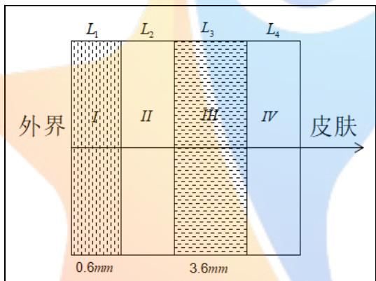  
图 1 一维简化图

其中，I、II、III为服装的三层织物材料，IV 为 III层与皮肤间的空气层，且I层与外界环境接触。并分别将 I、II、III、IV层记为四层介质。

## 5.1 问题一：确定温度分布情况

针对问题一，需要建立数学模型，计算温度分布。由一维简化图可知：只需要确定在一维空间中介质在不同时刻，不同厚度下的温度。

首先，借助导热基本定律——Fourier定律和能量守恒定律推导热传导方程。

其次，简化问题，将 ${ \mathrm { I } } _ { \setminus } \ { \mathrm { I I } } _ { \setminus } \ { \mathrm { I I I } } _ { \setminus }$ IV 四个介质层视为两个新的介质层介质 a、介质b，在只有a、b 介质层的情况下，进行二层耦合。

最后，将二层耦合推广到四层耦合，建立基于热传导方程的温度分布模型。模型的求解采用隐式向后有限差分近似对方程进行离散化处理，给出方程的差分格式并整理得到代数方程组，采用追赶法求解方程组，得到时间与空间维度下的温度分布情况

## 5.1.1两大定律——Fourier定律和牛顿冷却定律

在求解温度分布过程中，由于热量随时间进行扩散，因此本文考虑导热现象和冷却现象。

## （1）Fourier 定律

① 热量与热流密度

在导热现象中，单位时间内通过截面面积为 S的截面所传递的热量Q，正比例于垂直于该截面方向上的温度变化率，但热量传递的方向与温度升高的方向相反，如下图2所示：

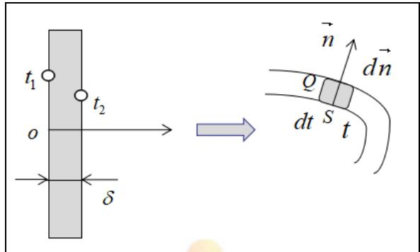  
图 2 Fourier 定律示意图

傅里叶定律表达式为：

$$
\frac { Q } { S } \sim \frac { \hat { \sigma } u } { \hat { \sigma } x } \Leftrightarrow Q = - \lambda S \frac { \hat { \sigma } u } { \hat { \sigma } x }\tag{1}
$$

用热流密度表示为：

$$
q = - \lambda \frac { \partial u } { \partial x }\tag{2}
$$

其中：负号表示热量传递的方向与温度升高的方向相反；

x 表示从外界到皮肤的厚度，为空间坐标；

u=u(x,t) 表示关于厚度 x 和时间 t 的函数；

$\frac { \hat { \partial } u } { \hat { \partial } x }$ 表示温度沿x轴方向的变化率；

表示热传导率，均匀介质中为一固定数值。

② 一维空间中热流密度矢量

本文考虑在一维空间下温度分布，即只有一个坐标x（表示厚度），具体见下图 3：

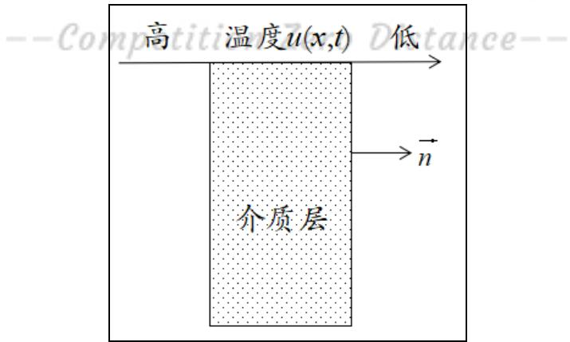  
图 3 单介质示意图

则热流密度矢量的形式为：

$$
\vec { q } = - \lambda g r a d u = - \lambda \frac { \hat { \partial } u } { \hat { \partial } n } \cdot \vec { n }\tag{3}
$$

其中：gradu 是一维空间某厚度下的温度梯度；

$\vec { n }$ 是在临界面的外法向向量。

## （2）牛顿冷却定律

牛顿冷却定律是温度高于周围环境的物体向周围媒质传递热量逐渐冷却时所遵循的规律[4]。具体的表述为：当物体表面与周围存在温差时，单位时间从单位面积散失的热量与温度差成正比，比例系数为热传导率。

计算公式为： $- \lambda \frac { \partial u } { \partial n } = h ( u _ { \scriptscriptstyle  { \mho } } - 3 7 )$

## 5.1.2热传导方程的推导

（1）基于Fourier热传导定律的热量的微元算式

在上述Fourier定律推导过程[3]中，得到热量的微元算式如下：

$$
d Q = - \lambda \frac { \hat { \sigma } u } { \hat { \sigma } n } d s d t = - \lambda \nabla u \cdot d \vec { S } d t\tag{4}
$$

## （2）流入热量与吸收热量

从 $t _ { 1 } \sim t _ { 2 }$ 时间段内，流入介质内部的热量为：

$$
Q _ { 1 } { = } \int _ { t _ { 1 } } ^ { t _ { 2 } } { \left[ \int _ { S } \lambda { \frac { { \hat { \sigma } } u } { { \hat { \sigma } } n } } { \cdot } d s \right] } d t\tag{5}
$$

并将（5）式借助高斯公式化简为：

$$
Q _ { 1 } { = } \int _ { t _ { 1 } } ^ { t _ { 2 } } { \left[ \int \int _ { s } \lambda { \frac { { \widehat { o u } } } { { \widehat { o } } n } } \cdot d s \right] } d t { = } \int _ { t _ { 1 } } ^ { t _ { 2 } } { \left[ \int \lambda { \frac { { \widehat { o u } } } { { \widehat { o } } x } } d x \right] } d t\tag{6}
$$

介质内温度升高吸收的热量为：

$$
\mathcal { Q } _ { 2 } \mathbf { = } \int c \rho [ u ( x , t _ { 2 } ) - u ( x , t _ { 1 } ) ] d x\tag{7}
$$

其中， $c$ 为比热， $\rho$ 为密度。

并将（6）式化简为：

$$
\begin{array} { l } { \displaystyle { Q _ { 2 } = \int c \rho [ u ( x , t _ { 2 } ) - u ( x , t _ { 1 } ) ] d x } } \\ { \displaystyle { \quad = \int c \rho \Bigg [ \int _ { t _ { 1 } } ^ { t _ { 2 } } \frac { \hat { \sigma } u ( x , t ) } { \hat { \sigma } t } d t \Bigg ] d x } } \\ { \displaystyle { \quad = \int _ { t _ { 1 } } ^ { t _ { 2 } } \Bigg [ \int c \rho \frac { \hat { \sigma } u ( x , t ) } { \hat { \sigma } t } d x \Bigg ] d t } } \end{array}\tag{8}
$$

（3）基于能量守恒定律建立能量关系

由能量守恒定律，有 $Q _ { 1 } = Q _ { 2 }$ ，即：

$$
\int _ { t _ { 1 } } ^ { t _ { 2 } } \left[ \int \lambda \frac { \partial u } { \partial x } d x \right] d t = \int _ { t _ { 1 } } ^ { t _ { 2 } } \left[ \int c \rho \frac { \partial u ( x , t ) } { \partial t } d x \right] d t\tag{9}
$$

因此，有 $c \rho \frac { { \hat { \partial } } u } { { \hat { \partial } } t } = \lambda \frac { { { \hat { \partial } } ^ { 2 } } u } { { \hat { \partial } } { { x } ^ { 2 } } }$ ，即 $\frac { \partial u } { \partial t } { = } a ^ { 2 } \frac { \partial ^ { 2 } u } { \partial x ^ { 2 } }$ $a ^ { 2 } = \frac { \lambda } { c \rho }$

其中， 表示为介质的热传导率；c 表示为介质的比热， $\rho$ 表示为介质的密度。

最终推导的热传导方程为： $\frac { \hat { \sigma } u } { \hat { \sigma } t } = a ^ { 2 } \frac { \hat { \sigma } ^ { 2 } u } { \hat { \sigma } x ^ { 2 } } , a ^ { 2 } = \frac { \lambda } { c \rho }$

## 5.1.3 二层耦合介质温度分布模型的建立

首先，在只有介质层 a、b 的情况下，建立二层耦合的温度分布模型。先确定在不同介质中的热传导方程，再根据在同一临界面具有相同的热流量密度和温度进行二层耦合。

其次，将二层耦合扩展为四层耦合，确定完整的温度分布模型。

详细图解如下图4：

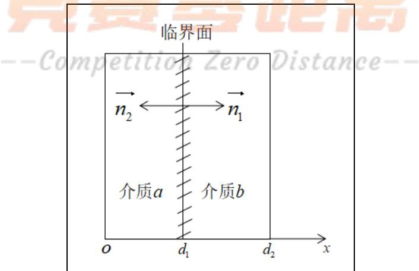  
图 4 两层耦合图

Step1：确定介质a、介质b 的热传导方程。

由5.1.2的热传导方程推导过程可知： $a ^ { 2 } = \frac { \lambda } { c \rho }$ ，则带入相应的热传导率 ，比热 $^ { c , }$ ，密度 $\rho$ ，分别确定介质 a、b的热传导方程，见表 1。

表1 介质a、介质b的热传导方程
<table><tr><td rowspan=1 colspan=1></td><td rowspan=1 colspan=1>热传导方程</td><td rowspan=1 colspan=1>方程参数</td><td rowspan=1 colspan=1>空间范围</td></tr><tr><td rowspan=1 colspan=1>介质 $a$ </td><td rowspan=1 colspan=1> $\frac { \partial u _ { 1 } } { \partial t } = a _ { 1 } ^ { 2 } \frac { \partial ^ { 2 } u _ { 1 } } { \partial x ^ { 2 } }$ </td><td rowspan=1 colspan=1> $a _ { 1 } ^ { 2 } = \frac { \lambda _ { 1 } } { c _ { 1 } \rho _ { 1 } }$ </td><td rowspan=1 colspan=1> $x \in \left[ 0 , d _ { 1 } \right]$ </td></tr><tr><td rowspan=1 colspan=1>介质 $^ b$ </td><td rowspan=1 colspan=1> $\frac { \partial u _ { 2 } } { \partial t } = a _ { 2 } ^ { 2 } \frac { \partial ^ { 2 } u _ { 2 } } { \partial x ^ { 2 } }$ </td><td rowspan=1 colspan=1> $a _ { 2 } ^ { 2 } = \frac { \lambda _ { 2 } } { c _ { 2 } \rho _ { 2 } }$ </td><td rowspan=1 colspan=1> $x \in \left[ d _ { 1 } , d _ { 2 } \right]$ </td></tr></table>

Step2：确定耦合条件。

① 由介质临界面的热流量密度相同，确定第一耦合条件。

根据Fourier热传导定律，在导热过程中，两相邻介质临界面处热流量密度相同，得到：

$$
\lambda _ { 1 } \frac { \partial u _ { 1 } } { \partial n _ { 1 } } \bigg | _ { d _ { 1 } } = \lambda _ { 2 } \frac { \partial u _ { 2 } } { \partial n _ { 2 } } \bigg | _ { d _ { 1 } }\tag{10}
$$

其中， $n _ { 1 }$ , $n _ { 2 }$ 分别表示介质 $^ { a \mathrm { . } }$ 、介质b在临界面上的外法线方向；

$\lambda _ { \mathrm { { \scriptscriptstyle 1 } } }$ ， $\lambda _ { 2 }$ 分别表示介质 a、介质 b 上的热传导率。

② 由介质临界面的温度相同，确定第二耦合条件。

根据两介质临界面处温度相同，得到任意时刻的临界面处温度等价关系：

$$
u _ { 1 } | _ { d _ { 1 } } = u _ { 2 } | _ { d _ { 1 } }\tag{11}
$$

③ 完整耦合条件的确立。

由（9）式和（10）式可得，两层耦合状态下的耦合条件为：

$$
\left\{ \begin{array} { l l } { \displaystyle \lambda _ { 1 } \frac { \partial u _ { 1 } } { \partial n _ { 1 } } \bigg \vert _ { d _ { 1 } } = \lambda _ { 2 } \frac { \partial u _ { 2 } } { \partial n _ { 2 } } \bigg \vert _ { d _ { 2 } } } \\ { \displaystyle u _ { 1 } \big \vert _ { d _ { 1 } } = u _ { 2 } \big \vert _ { d _ { 1 } } } \end{array} \right.\tag{12}
$$

Step3：确定两层耦合介质的初边值条件。

① 确定初值条件。

在 t=0 时刻，介质 a、介质 b 的温度均与假人的恒定皮肤外侧温度相同，即均为 $3 7 ^ { o } C$ ，由此确定初值条件为：

$$
\left\{ \begin{array} { l l } { u _ { 1 } ( x , 0 ) = 3 7 } & { x \in [ 0 , d _ { 1 } ] } \\ { u _ { 2 } ( x , 0 ) = 3 7 } & { x \in [ d _ { 1 } , d _ { 2 } ] } \end{array} \right.\tag{13}
$$

② 确定边值条件。

第一，左边界条件的确定。介质 a左侧与外界接触，因而其温度与恒定的外界温度相同，故方程的左边界Dirichlet边值条件为：

$$
u _ { 1 } ( 0 , t ) = 7 5 \quad t \in [ 0 , T ]\tag{14}
$$

第二，右边界条件的确定。介质 a 接受了温度为 $7 5 \mathrm { { \ : } ^ { o } C }$ 的外界传递的热量，并将热量继续传递给介质 b，并由附件 2提供的数据可知：介质 b右边界的温度始终高于假人皮肤的温度 $3 7 ^ { o } C$ 。进而，介质b右边界与假人皮肤发生热量交换，相当于对介质b产生冷却作用。此时，假人相当于冷却源，这个热量传递过程遵循牛顿冷却定律。

依据牛顿冷却定律，给出 Robin 右边界条件：

$$
- \lambda _ { _ { 4 } } \frac { \hat { \sigma } u } { \hat { \sigma } n _ { _ { 4 } } } = h ( u _ { _ { h } } - u _ { _ { 5 } } )\tag{15}
$$

其中， $u _ { h }$ 表示为介质 b 在贴近假人皮肤处的温度值； $u _ { 5 }$ 表示为假人内部恒定温度，即 $3 7 ^ { o } C$

h 为介质与皮肤之间的转化系数，即冷却系数。

由（13）式和（14）式，确定的热传导方程的完整的边值条件为：

$$
\left\{ \begin{array} { l l } { u _ { 1 } ( 0 , t ) = 7 5 \quad t \in [ 0 , T ] } \\ { \qquad - \lambda _ { 4 } { \frac { \partial u } { \partial n _ { 4 } } } = h ( u _ { h } - u _ { 5 } ) } \end{array} \right.\tag{16}
$$

Step4：确定转化系数 h 的值。

Step5：确定二层耦合介质温度分布模型。

根据以上三个步骤，分别得到了热传导方程以及初值条件、边值条件和耦合

条件，则在只有两介质的情况下，确立基于热传导方程的二层耦合温度分布模型：

$$
\begin{array} { r l } { \{ \begin{array} { l l } { \overline { { \Delta } } _ { 1 } \cdots , } & { \partial ^ { \mathrm { G P } _ { 1 } } , } \\ { \Delta } & { \leq \frac { \partial ^ { \mathrm { G P } _ { 1 } } } { \partial x } , } \end{array}  } & { x \in [ 0 , d ] , } \\ { \{ \begin{array} { l l } { 0 , } & { x \leq \frac { \partial ^ { \prime } } { \partial x } , } \\ { \overline { { \Delta } } _ { 2 } \cdots , } & { x \leq \overline { { \Delta } } _ { 2 } , } \\ { \overline { { \Delta } } _ { 3 } \cdots , } & { x \leq \overline { { \Delta } } _ { 3 } , } \end{array}  } \\ { \{ \begin{array} { l l } { \overline { { \Delta } } _ { 3 } ^ { \prime } , } & { \partial ^ { \prime } , } \\ { \overline { { \Delta } } _ { 4 } \cdots , } & { \partial ^ { \prime } , } \\ { \overline { { \Delta } } _ { 5 } \cdots , } & { x \leq \overline { { \Delta } } _ { 4 } , } \end{array}  } \\ { \{ \begin{array} { l l } { \overline { { \Delta } } _ { 1 } \overline { { \partial } } _ { 1 } , } & { \partial ^ { \prime } , } \\ { \overline { { \Delta } } _ { 6 } \cdots , } & { x \leq \overline { { \Delta } } _ { 5 } , } \\ { \overline { { \Delta } } _ { 1 } \cdots , } & { x \leq \overline { { \Delta } } _ { 5 } , } \end{array}  } & { x \in [ 0 , d ] , } \\ { \{ \begin{array} { l l } { 0 , } & { x \leq \frac { \partial ^ { \prime } } { \partial x } , } \\ { \overline { { \Delta } } _ { 1 } \overline { { \partial } } _ { 1 } , } & { \partial ^ { \prime } , } \\ { \overline { { \Delta } } _ { 2 } \cdots , } & { x \leq \overline { { \Delta } } _ { 5 } , } \end{array}  } & { x \in [ 0 , d ] , } \\  \{ \begin{array} { l l } { 1 , } &  \partial ^  \end{array} \end{array}\tag{17}
$$

## 5.1.4 基于热传导方程的温度分布模型的建立

在二层耦合介质的基础上，用相同的方法，扩展为四层介质。四层耦合介质图如下所示：

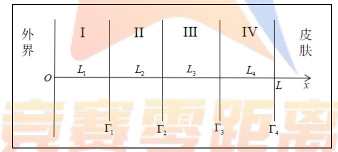  
图 5 四层耦合介质图

Step1：确定四层介质的热传导方程。

$$
\begin{array} { r l } & { \left\{ \begin{array} { l l } { \displaystyle \frac { \hat { \alpha } u _ { i } } { \hat { \alpha } t } = a _ { i } ^ { 2 } \frac { \hat { \sigma } ^ { 2 } u _ { i } } { \hat { \sigma } x ^ { 2 } } \qquad } & { x \in \bigcup _ { i = 1 } ^ { 4 } L _ { i - 1 } , L _ { i } ] , L _ { 0 } = 0 } \\ { \displaystyle a _ { i } ^ { 2 } = \frac { \lambda _ { i } } { c _ { i } \rho _ { i } } \qquad } & { i = 1 , 2 , 3 , 4 } \end{array} \right. } \end{array}\tag{18}
$$

Step2：确定耦合条件、初值条件及边值条件。

（1）相邻两介质的临界面共有 3 个，即： $\Gamma _ { 1 }$ ， $\Gamma _ { 2 }$ ， $\Gamma _ { 3 }$ 。在每一个临界面

的热流量密度和温度相同，可得到两个耦合条件。因此在三个临界面上共确定6个耦合条件，详见温度分布模型；

（2）由t=0时刻，四层介质的温度均与假人的恒定皮肤外侧温度相同，确定初值条件：

$$
u _ { i } ( x , 0 ) = 3 7 \quad i = 1 , 2 , 3 , 4\tag{19}
$$

（3）由介质 I左侧与外界温度相同，确定左边界Dirichlet边值条件：

$$
u _ { 1 } ( 0 , t ) = 7 5\tag{20}
$$

由介质 IV右侧与假人进行热量传递，依据牛顿冷却定律，确定右边界Robin边值条件：

$$
- \lambda _ { { \scriptscriptstyle 4 } } \frac { \widehat { \partial } u _ { { \scriptscriptstyle 4 } } } { \widehat { \partial } x } = h ( u _ { { \scriptscriptstyle h } } - u _ { { \scriptscriptstyle 5 } } )\tag{21}
$$

Step3：确定转化系数h 的值。

首先，查阅文献资料知：转化系数 h的范围是[5,25]。

其次，通过附件 2 给出的不同时刻下假人皮肤表面的温度值，借助变步长多次枚举法确定最佳转化系数的值。

具体过程如下：

① 粗略估计转化系数 h的值。将h=8 h=9，与实际数据用 matlab进行数据处理绘制如下对比图：

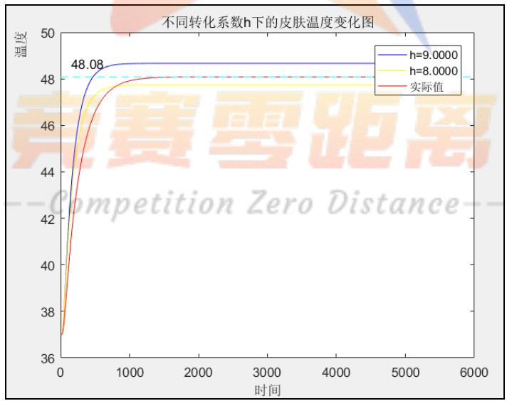  
图 6 在不同转化系数 h下的皮肤温度变化图

由上图可知：红色实线为实际数据温度变化情况；h=8即黄色实线，在实际数据的上方；h=9 即蓝色实线，在实际数据的下方。因此得到最佳吻合的转化系数h值介于区间[8,9]之中。

② 设置的步长为 0.01，在[8,9]范围内，经 matlab 枚举遍历，确定 h 的值在8.62 左右。

③ 为达到 0.0001 的精度，进一步缩小 h 的步长为 0.0001， [8.1,8.3]范围内，再次经matlab 枚举遍历，确定最佳转化系数 h的精确值为8.6125。

故，空气与皮肤的转化系数 $h = 8 . 6 1 2 5$

Step4：得到最终的基于热传导方程的温度分布模型：

$$
\left( \frac { \partial u _ { i } } { \partial t } = a _ { i } ^ { 2 } \frac { \partial ^ { 2 } u _ { i } } { \partial x ^ { 2 } } \right)
$$

$$
\mathscr { x } \in \bigcup _ { i = 1 } ^ { 4 } [ L _ { i - 1 } , L _ { i } ] , L _ { 0 } = 0
$$

$$
\boxed { a _ { i } ^ { 2 } = \cfrac { \lambda _ { i } } { c _ { i } \rho _ { i } } }
$$

$$
i = 1 , 2 , 3 , 4
$$

$$
| \lambda _ { 1 } \frac { \partial u _ { 1 } } { \partial x } | _ { \Gamma _ { 1 } } = \lambda _ { 2 } \frac { \partial u _ { 2 } } { \partial x } | _ { \Gamma _ { 1 } }
$$

$$
\Big | \boldsymbol { u } _ { 1 } \Big | _ { \Gamma _ { 1 } } = \boldsymbol { u } _ { 2 } \Big | _ { \Gamma _ { 1 } }
$$

$$
| \lambda _ { 2 } \frac { \partial u _ { 2 } } { \partial x } | _ { \Gamma _ { 2 } } = \lambda _ { 3 } \frac { \partial u _ { 3 } } { \partial x } | _ { \Gamma _ { 2 } }
$$

$$
 u _ { 2 } | _ { \Gamma _ { 2 } } = u _ { 3 } | _ { \Gamma _ { 2 } }
$$

$$
\lambda _ { 3 } \frac { \partial u _ { 3 } } { \partial x } \Bigg \vert _ { \Gamma _ { 3 } } = \lambda _ { 4 } \frac { \partial u _ { 4 } } { \partial x } \Bigg \vert _ { \Gamma _ { 3 } }
$$

$$
\left. u _ { 3 } \right| _ { \Gamma _ { 3 } } = u _ { 4 } \big | _ { \Gamma _ { 3 } }
$$

$$
u _ { i } ( x , 0 ) = 3 7 \qquad \quad i = 1 , 2 , 3 , 4
$$

$$
u _ { \mathrm { 1 } } ( 0 , t ) = 7 5
$$

$$
- \lambda _ { 4 } \frac { \partial u _ { 4 } } { \partial x } = h ( \boldsymbol { u } _ { h } - \boldsymbol { u } _ { 5 } )\tag{22}
$$

说明： $\frac { \partial u _ { i } } { \partial t } = a _ { i } ^ { 2 } \frac { \partial ^ { 2 } u _ { i } } { \partial x ^ { 2 } } ( a _ { i } ^ { 2 } = \frac { \lambda _ { i } } { c _ { i } \rho _ { i } } )$ ，表示在第 i 个介质中的热传导方程；

$u _ { h }$ 表示为 IV层介质在贴近假人皮肤处的温度值；

$u _ { 5 }$ 表示为假人内部恒定温度，即 $3 7 ^ { o } C$

h表示为空气与皮肤的转化系数，即空气冷却系数，其值为 8.6124。

$\lambda _ { 1 } \frac { \partial u _ { 1 } } { \partial x } \bigg | _ { \Gamma _ { 1 } } = \lambda _ { 2 } \frac { \partial u _ { 2 } } { \partial x } \bigg | _ { \Gamma _ { 1 } } , u _ { 1 } \big | _ { \Gamma _ { 1 } } = u _ { 2 } \big | _ { \Gamma _ { 1 } }$ ，表示介质 I与介质 II的两个耦合条件，

$\lambda _ { 2 } \frac { \partial u _ { 2 } } { \partial x } \bigg | _ { \Gamma _ { 2 } } = \lambda _ { 3 } \frac { \partial u _ { 3 } } { \partial x } \bigg | _ { \Gamma _ { 2 } } , u _ { 2 } \big | _ { \Gamma _ { 2 } } = u _ { 3 } \big | _ { \Gamma _ { 2 } }$ ，表示介质 II与介质 III的两个耦合条件；  
$\lambda _ { 3 } \frac { \partial u _ { 3 } } { \partial x } \bigg | _ { \Gamma _ { 3 } } = \lambda _ { 4 } \frac { \partial u _ { 4 } } { \partial x } \bigg | _ { \Gamma _ { 3 } } , u _ { 3 } \big | _ { \Gamma _ { 3 } } = u _ { 4 } \big | _ { \Gamma _ { 3 } }$ ，表示介质III与介质IV的两个耦合条件；  
$u _ { i } ( x , 0 ) = 3 7 , i = 1 , 2 , 3 , 4$ ，表示热传导方程的初值条件；  
$u _ { 1 } ( 0 , t ) = 7 5$ ，表示热传导方程的左边界Dirichlet边值条件；  
$- \lambda _ { { \scriptscriptstyle 4 } } \frac { \partial u _ { { \scriptscriptstyle 4 } } } { \partial x } = h ( u _ { { \scriptscriptstyle h } } - u _ { { \scriptscriptstyle 5 } } )$ ，表示热传导方程的右边界Robin 边值条件。

## 5.1.5 基于热传导方程的温度分布模型的求解

## （1）求解方法分析

在 5.1.4 中建立的温度分布模型（20）属于抛物型方程，因边值条件条件复杂难以求得解析解。本文采用有限差分法：将连续的定解区域用有限个离散点构成的网格来代替；把定解区域上的连续变量的函数用网格上定义的离散变量的函数来近似；把原方程和定解条件中的微商用差商来近似。最终，把原微分方程和定解条件用代数方程组来代替，即有限差分方程组。解此方程组就可以得到原问题在离散点上的近似值。

常用的差分格式有：向前差分格式、向后差分格式和C-N差分格式（即Crank-Nicolson差分格式）。

在向前差分格式中，要求时间步长与空间步长的比 $r \leq 0 . 5$ ，即时间步长要比空间步长小得多。若不满足此条件，极易发生解的爆破。在本文温度分布模型中，时间步长与空间步长达到 50，远远大于0.5，因此不适合用向前差分格式。此外，向前差分格式为显式格式，难以进行多层介质的耦合。

在C-N差分格式中，稳定性好精度高，计算在交叉点处的函数值，具体如下图 7 所示：

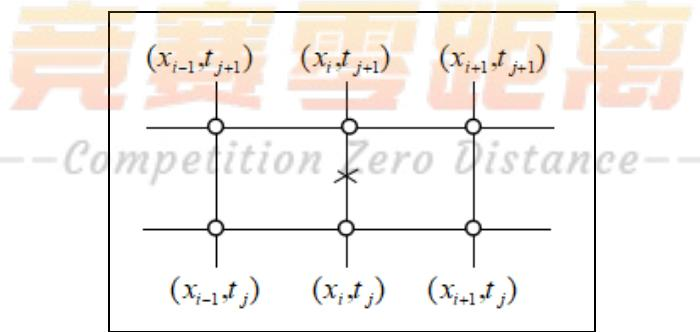  
图7 C-N差分格式图

在向后差分格式中，具有无条件稳定的特点，选取第j+1时间层相邻的三个结点进行 u 对x 二阶偏导的近似，选取第j+1时间层与第j 时间层的相邻两个结点进行对u对t一阶偏导的近似，具体如下图 8 所示：

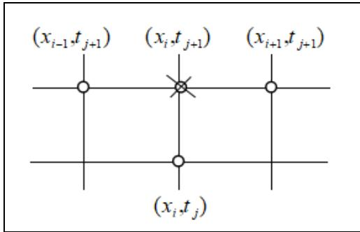  
图 8 向后差分格式图

## （2）温度分布模型的具体求解过程：

经过上述三种差分格式的比较，本文采用向后差分格式求解，并借助迭代法求解。求解流程如下图 9所示：

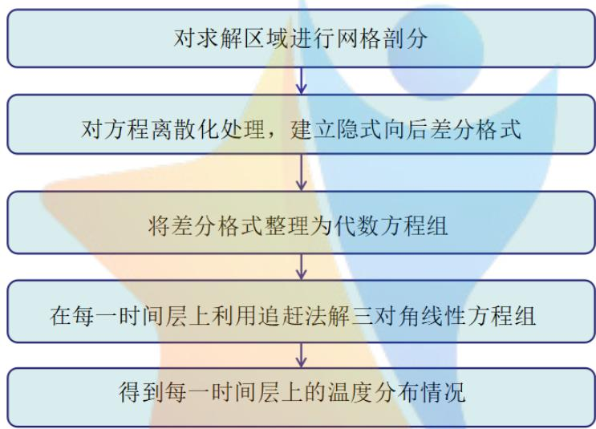  
图 9 温度分布模型求解流程图

Step1：对求解区域进行网格剖分。

求解区域记为 $\Omega = \left\{ ( x , t ) \middle | 0 \leq x \leq L , 0 \leq t \leq T \right\}$ ，其中 $L { = } \sum _ { i = 1 } ^ { 4 } L _ { i }$ 且 $L _ { i }$ 为第 i 层介质的厚度。对此求解区域进行网格剖分，具体如下：

① 在空间维度 $\perp ,$ 将区间[0, $L _ { 1 } ]$ 做 $M _ { 1 }$ 等分 $^ { \cdot , }$ 将区间 $[ L _ { 1 } , L _ { 2 } ]$ 做 $M _ { 2 }$ 等分，将区间 $[ L _ { 2 } , L _ { 3 } ]$ 做 $M _ { 3 }$ 等分，将区间 $[ L _ { 3 } , L _ { 4 } ]$ 做 $M _ { 4 }$ 等分。

记 $m _ { i } = \sum _ { l = 1 } ^ { i } M _ { l } , i = 1 , 2 , 3 , 4$ o

记 $\Delta x _ { i } = \frac { L _ { i } } { M _ { i } }$ $\Delta x _ { i }$ 表示为第i 层介质的空间步长。

② 在时间维度上，将区间[0, ]T 作n等分，并记 $\Delta t = { \frac { T } { n } }$ ，t为时间步长。

③ 用两组平行直线簇 $\left\{ \begin{array} { l l } { x = x _ { i } , 1 \leq i \leq m } \\ { t = t _ { j } , 1 \leq j \leq n } \end{array} \right.$ 将分割成矩形网格，见下图 10：

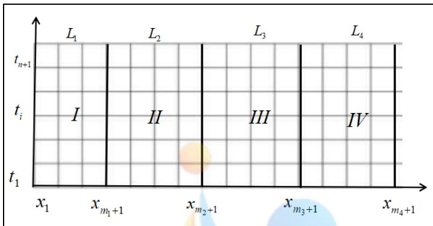  
图 10 网格剖分图  
Step2：建立隐式向后差分格式。

定义上的网格函数， $u = \left\{ u _ { { \scriptscriptstyle i j } } \big | 1 \leq i \leq m _ { \scriptscriptstyle 4 } + 1 , 1 \leq j \leq n + 1 \right\}$ 其中 $u _ { i j } = u ( x _ { i } , t _ { j } )$ 且有 $1 \leq i \leq m _ { 4 } + 1 , 1 \leq j \leq n + 1$

考虑温度分布模型（20）中的热传导方程中的右端项，略去小量项，用二阶中心差商代替u对x的偏导数，得到：

$$
\frac { \partial ^ { 2 } u } { \partial x ^ { 2 } } ( x _ { i } , t _ { j } ) = \frac { 1 } { \left( \Delta x \right) ^ { 2 } } [ u ( x _ { i - 1 } , t _ { j } ) - 2 u ( x _ { i } , t _ { j } ) + u ( x _ { i + 1 } , t _ { j } ) ]\tag{23}
$$

考虑温度分布模型（20）中的热传导方程中的左端项，用一阶向前差商代替u对t的一阶偏导数，得到：

$$
\frac { \partial u } { \partial t } ( x _ { i } , t _ { j } ) = \frac { 1 } { \Delta t } [ u ( \underline { { x _ { i } } } , t _ { j + 1 } ) - u ( \underline { { x _ { i } } } , t _ { j } ) ]\tag{24}
$$

建立差分格式的具体步骤如下：

① 在结点处考虑不同介质下的热传导方程，得到介质内部的差分格式。

第 i 层介质的热传导方程为： $\frac { \hat { \sigma } u _ { k } } { \hat { \sigma } t } = a _ { k } ^ { 2 } \frac { \hat { \sigma } ^ { 2 } u _ { k } } { \hat { \sigma } x ^ { 2 } } \mathrm { ~ , ~ } k = 1 , 2 , 3 , 4$ ，则相应的差分格式为：

$$
\frac { u _ { k j } ^ { i + 1 } - u _ { k j } ^ { i } } { \Delta t } - a _ { k } ^ { 2 } \cdot \frac { u _ { k , j - 1 } ^ { i + 1 } - 2 u _ { k j } ^ { i + 1 } + u _ { k , j + 1 } ^ { i + 1 } } { \left( \Delta x \right) ^ { 2 } } = 0\tag{25}
$$

其中， $u _ { k j } ^ { i }$ 表示第 k 层介质在 $( x _ { i } , t _ { j } )$ 结点处的温度， $k = 1 , 2 , 3 , 4 \ ; \ j = 1 , 2 , \cdots , m \mathop { \circ }$

② 依据热流量密度的耦合条件，得到介质边界处的差分格式。

在临界面 $\Gamma _ { 1 ^ { \setminus } } \ \Gamma _ { 2 ^ { \setminus } } \ \Gamma _ { 3 }$ 处，关于热流量密度的耦合条件为：

$$
\lambda _ { k }  \frac { \hat { \sigma } u _ { k } } { \hat { \sigma } x } | _ { \Gamma _ { k } } = \lambda _ { k + 1 } \frac { \hat { \sigma } u _ { k + 1 } } { \hat { \sigma } x } | _ { \Gamma _ { k } } , k = 1 , 2 , 3
$$

则得到相应的差分格式为：

$$
\lambda _ { k } \frac { u _ { k , m _ { k } + 1 } ^ { i + 1 } - u _ { k , m _ { k } } ^ { i } } { \Delta x _ { k } } = \lambda _ { k + 1 } \cdot \frac { u _ { k + 1 , m _ { k } + 2 } ^ { i + 1 } - u _ { k + 1 , m _ { k } + 1 } ^ { i + 1 } } { \Delta x _ { k + 1 } } \ , \ k = 1 , 2 , 3\tag{26}
$$

③ 依据第 IV 层介质右侧 Robin 边值条件，得到边界 $\Gamma _ { 4 }$ 上的差分格式。

第 IV层介质边界 $\Gamma _ { 4 }$ 处，满足温度分布模型（20）的条件− $\frac { \partial u _ { 4 } } { \partial x } = h ( u _ { h } - u _ { 5 } )$ 可得到相应的差分格式为：

$$
- \lambda _ { 4 } \frac { u _ { m _ { 4 } } ^ { i + 1 } - u _ { m _ { 4 } - 1 } ^ { i + 1 } } { \Delta x _ { 4 } } = h ( u _ { m _ { 4 } } ^ { i + 1 } - 3 7 )\tag{27}
$$

综合①②③，得到温度分布模型（20）的隐式向后有限差分近似如下：

$$
\{ \begin{array} { l l } { { \displaystyle \frac { u _ { k } ^ { i + 1 } - u _ { k _ { j } } ^ { i } } { \Delta t } - a _ { k _ { - } } ^ { 2 } \frac { u _ { k _ { + } - } ^ { i + 1 } - 2 u _ { k _ { + } } ^ { i + 1 } + u _ { k _ { + } , j + 1 } ^ { i + 1 } } { ( \Delta x ) ^ { 2 } } = 0 } } & { { k = 1 , 2 , 3 , 4 , j = 1 , 2 , \cdots , m } } \\  { \displaystyle \sum _ { k _ { + } ^ { i } , \frac { u _ { k _ { + } - } ^ { i } - u _ { k _ { - } } ^ { i } } { \Delta x _ { k _ { + } } } = \lambda _ { k _ { + } + 1 } , \frac { u _ { k _ { + } - } ^ { i + 1 } - u _ { k _ { + } , m , + } ^ { i + 1 } } { \Delta x _ { k _ { + } + 1 } } } } & { { k = 1 , 2 , 3 } } \\ { { - \lambda _ { \epsilon } \frac { u _ { k _ { + } - } ^ { i + 1 } - u _ { k _ { - } - } ^ { i + 1 } } { \Delta x _ { k _ { + } } } = h ( u _ { n _ { + } - } ^ { i + 1 } - 3 7 ) } } & { { \displaystyle \frac { 1 } { - \lambda _ { \epsilon } \frac { \partial } { \partial \tau } \sum _ { \ell = r _ { \ell } } \tilde { q } _ { - } ^ { i } \sum _ { \ell = \ell , m } ^ { i } \tilde { \ell } _ { \ell } \tilde { \ell } ^ { i } \tilde { \ell } ^ { j } } } } \\ { { \displaystyle u _ { \ell } ^ { i + 1 } - 2 5 } } & { { - \lambda _ { \ell } \frac { 1 } { \partial \tau } \sum _ { \ell = 1 } ^ { i } \tilde { \ell } _ { \ell } \tilde { \ell } ^ { i } \tilde { \ell } ^ { j } } } \\ { { \displaystyle u _ { \ell } ^ { i } = 3 } \tilde { \ell } ^ { i } } &  { k = 1 , 2 , 3 , 4 , j = 1 , 2 , \cdots , m + 1 } \end{array}\tag{28}
$$

其中，（26）式中第一式、二式及三式在步骤①、步骤②及步骤③中已做详细说明；（26）式第四式，为基于热传导方程的温度分布模型（20）中左边界Dirichlet边值条件；（26）式第五式，为温度分布模型（20）中初值条件；（26）式第六式，为温度分布模型（20）中基于温度的耦合条件条件。

Step3：将差分格式整理为代数方程组。

①差分格式（26）中，第一式可整理为：

$$
- r _ { k } u _ { { } _ { k , i - 1 } } ^ { j } + ( 1 + 2 r ) u _ { k i } ^ { j } - r u _ { k , i + 1 } ^ { j } = u _ { k i } ^ { j - 1 }\tag{29}
$$

其中， k=1,2,3,4 , $2 \leq i \leq m$ $2 \leq j \leq m$

$r _ { k } = \frac { a _ { k } \Delta t _ { k } } { \left( \Delta x \right) ^ { 2 } }$ ，表示为第k层介质剖分的步长比。

②差分格式（26）式中，第二式可整理为：

$$
- \frac { \lambda _ { k } } { \Delta x _ { k } } u _ { k , m _ { k } } ^ { i + 1 } + ( \frac { \lambda _ { k } } { \Delta x _ { k } } + \frac { \lambda _ { k + 1 } } { \Delta x _ { k + 1 } } ) u _ { k , m _ { k } + 1 } ^ { i + 1 } - \frac { \lambda _ { k + 1 } } { \Delta x _ { k + 1 } } u _ { k + 1 , m _ { k } + 2 } ^ { i + 1 } = 0\tag{30}
$$

③差分格式（26）式中，第三式可整理为：

$$
- \frac { \lambda _ { 4 } } { \Delta x _ { 4 } } u _ { 4 , m _ { 4 } - 1 } ^ { i + 1 } + ( \frac { \lambda _ { 4 } } { \Delta x _ { 4 } } + h ) u _ { 4 , m _ { 4 } } ^ { i + 1 } = 3 7 h\tag{31}
$$

由①②③可将差分格式（26）写成如下矩阵形式：

$$
\begin{array} { r l } { \Gamma _ { 1 1 } \Sigma _ { 4 } } & { \quad \forall } \\ { = } & { \quad \frac { 2 } { \lambda _ { 1 } } \frac { \lambda _ { 2 } } { \lambda _ { 1 } } \frac { \lambda _ { 1 } } { \lambda _ { 2 } } \frac { \lambda _ { 2 } } { \lambda _ { 3 } } } \\ & { \quad \quad \quad \quad \quad \quad \quad \quad \quad \quad \quad \quad \quad \quad \quad \quad \quad \quad \quad \quad \quad \quad \quad \quad \quad \quad \quad \quad \quad \quad \quad \quad \quad \quad \quad \quad \quad \quad \quad \quad \quad \quad \quad \quad \quad \quad \quad \quad \quad \quad \quad \quad \quad \quad \quad \quad \quad \quad \quad \quad \quad \quad \quad \quad \quad \quad \quad \quad \quad \quad \quad \times \quad } \\ & { \quad \quad \quad \quad \quad \quad \quad \quad \quad \quad \quad \quad \quad \quad \quad \quad \quad \quad \quad \quad \quad \quad \quad \quad \quad \quad \quad \quad \quad \quad \quad \quad \quad \quad \quad \quad \quad \quad \quad \quad \quad \quad \quad \quad \quad \quad \quad \quad \quad \quad \quad \quad \quad \quad \quad \quad \quad \quad \quad \quad \quad \quad \quad \quad \quad \quad \quad \quad \quad \quad \quad \quad \quad \quad \quad \quad \quad \quad \quad \quad \quad \quad \quad \quad \quad \quad } \\ & { \quad \quad \quad \quad \quad \quad \quad \quad \quad \quad \quad \quad \quad \quad \quad \quad \quad \quad \quad \quad \quad \quad \quad \quad \quad \quad \quad \quad \quad \quad \quad \quad \quad \quad \quad \quad \quad \quad \quad \quad \quad \quad \quad \quad \quad \quad \quad \quad \quad \quad \quad \quad \quad \quad \quad \quad \quad \quad \quad \quad \quad \quad \quad \quad \quad \quad \quad \quad \quad \quad \quad \quad \quad \quad \quad \quad \quad \quad \quad \times } \\ &  \quad \quad \quad \quad \quad \quad \quad \quad \quad \quad \quad \quad \quad \quad \quad \quad \quad \quad \quad \quad \quad \quad \quad \quad \quad \quad \quad \quad \quad \quad \quad \quad \quad \quad \quad \quad \quad \quad \quad \quad \quad \quad \quad \quad \quad \quad \quad \quad \quad \quad \quad \quad \quad \quad \quad \quad \quad \quad \quad \quad \quad \quad \quad \quad \quad \quad \quad \quad \quad \quad \quad \end{array}
$$

Step4：利用追赶法解三对角线性方程组

在 step3 中，得到的代数矩阵为三对角线性方程组 AU=b，一般可用 matlab求逆命令求解U，但因本题中系数矩阵规模较大，且除主对角线和两个次对角线之外，其余元素均为 0，因而求逆解方程组会导致浪费内存、程序运行缓慢。因此本文利用追赶法求解三对角线性方程组。

算法步骤如下图11所示：

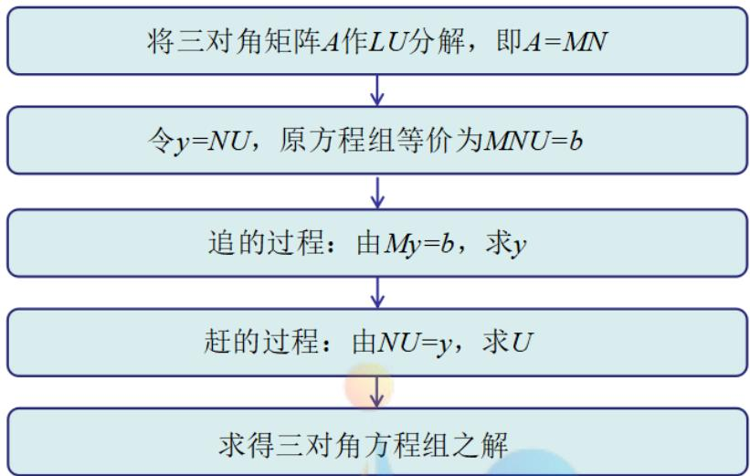  
图 11 追赶法求解三对角线性方程组

## Step5：每一时间层上的温度分布情况

根据追赶法，求得不同时刻不同厚度下的温度分布情况。具体 5个临界面处的温度分布情况见表 problem1.xlsx，如下为部分温分布情况。

表 2 部分温度分布表
<table><tr><td rowspan=1 colspan=1>时间/s</td><td rowspan=1 colspan=1>临界面I</td><td rowspan=1 colspan=1>临界面Ⅱ</td><td rowspan=1 colspan=1>临界面Ⅲ</td><td rowspan=1 colspan=1>临界面IV</td></tr><tr><td rowspan=1 colspan=1>0</td><td rowspan=1 colspan=1>37</td><td rowspan=1 colspan=1>37</td><td rowspan=1 colspan=1>37</td><td rowspan=1 colspan=1>37</td></tr><tr><td rowspan=1 colspan=1>360</td><td rowspan=1 colspan=1>72.77</td><td rowspan=1 colspan=1>69.34</td><td rowspan=1 colspan=1>62.11</td><td rowspan=1 colspan=1>46.89</td></tr><tr><td rowspan=1 colspan=1>720</td><td rowspan=1 colspan=1>74.18</td><td rowspan=1 colspan=1>72.48</td><td rowspan=1 colspan=1>64.88</td><td rowspan=1 colspan=1>47.98</td></tr><tr><td rowspan=1 colspan=1>1080</td><td rowspan=1 colspan=1>74.29</td><td rowspan=1 colspan=1>72.73</td><td rowspan=1 colspan=1>65.10</td><td rowspan=1 colspan=1>48.07</td></tr><tr><td rowspan=1 colspan=1>1440</td><td rowspan=1 colspan=1>74.3</td><td rowspan=1 colspan=1>72.75</td><td rowspan=1 colspan=1>65.12</td><td rowspan=1 colspan=1>48.08</td></tr><tr><td rowspan=1 colspan=1>1800</td><td rowspan=1 colspan=1>74.3</td><td rowspan=1 colspan=1>72.75</td><td rowspan=1 colspan=1>65.12</td><td rowspan=1 colspan=1>48.08</td></tr><tr><td rowspan=1 colspan=1>2160</td><td rowspan=1 colspan=1>74.3</td><td rowspan=1 colspan=1>72.75</td><td rowspan=1 colspan=1>65.12</td><td rowspan=1 colspan=1>48.08</td></tr><tr><td rowspan=1 colspan=1>2520</td><td rowspan=1 colspan=1>74.3</td><td rowspan=1 colspan=1>72.75</td><td rowspan=1 colspan=1>65.12</td><td rowspan=1 colspan=1>48.08</td></tr><tr><td rowspan=1 colspan=1>2880</td><td rowspan=1 colspan=1>74.3</td><td rowspan=1 colspan=1>72.75</td><td rowspan=1 colspan=1>65.12</td><td rowspan=1 colspan=1>48.08</td></tr><tr><td rowspan=1 colspan=1>3240</td><td rowspan=1 colspan=1>74.3</td><td rowspan=1 colspan=1>72.75</td><td rowspan=1 colspan=1>65.12</td><td rowspan=1 colspan=1>48.08</td></tr></table>

表 2 中的数据，是四层介质的四个临界面相同时间间隔 $\Delta t = 3 6 0 s$ 下的温度值。绘制成温度关于时间的二维曲线，如下图 12所示：

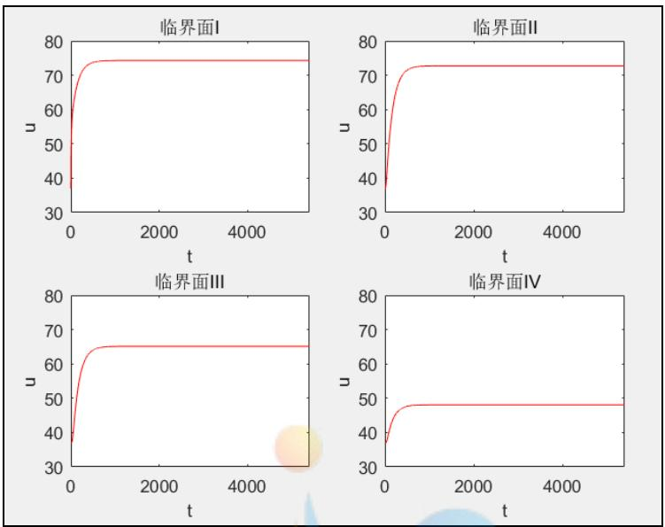  
图12 在不同时刻下临界面处的温度变化情况

由表格 2 和图 12 分析可知：I、II 介质在临界面处温度随时间缓慢降低，当时间 $t { = } 1 4 4 0 s$ 时，I介质温度达到稳定值 $7 4 . 3 ^ { o } C$ ；当时间 $t { = } 1 4 4 0 s$ 时，II介质温度达到稳定值 $7 2 . 7 5 ^ { o } C$ 。II 介质在临界面处的温度随时间降低，但比 I、II 介质降得快,当时间 $t { = } 1 4 4 0 s$ 时，温度达到稳定值 $6 5 , 1 2 ^ { o } C$ 空气层 IV介质温度降低且速度最快，当时间 $t { = } 1 4 4 0 s$ 时，温度达到稳定值 $4 8 . 0 8 ^ { o } C$

在转化系数 $h { = } 8 . 6 1 2 5$ 的条件下，不同时刻不同厚度的温度变化情况如下图所示：

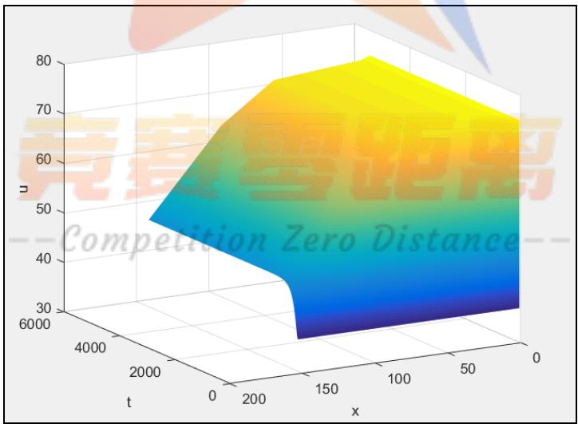  
图13 不同时刻不同厚度的温度变化图

根据图 13，将表格problem1.xlsx 中的离散数据在 matlab 中绘制成三维曲面图。其中，x轴表示对时间维度作剖分 0\~5400s；y轴表示对空间维度作剖分，将I介质的厚度 $L _ { 1 }$ 做6等分，将 II介质的厚度 $L _ { 2 }$ 做60等分，将 III介质的厚度 $L _ { 3 }$ 做

36 等分，将区间 $L _ { 4 }$ 做 50 等分；z 轴表示温度的变化情况。曲面图形在不同时刻临界面处的温度与表格反映的内容一致。

## 5.1.6 问题一模型的检验

问题一中，通过求解四层耦合介质的温度分布模型，可得到任意厚度的介质在每一时刻的温度。将 IV 层介质右侧与皮肤直接接触的临界面的温度与题目中附件2假人皮肤外侧的测量温度进行对比，可检验求解结果的正确性。

假设时间层 $t _ { i }$ 下通过模型解得的温度为 $u _ { i }$ ，附件 2 所给的温度为 $\nu _ { i }$ ，本文定义求解结果与题目所给数据之间的偏差指数 $f ,$ ，用于表示求解得到的温度与附件2温度的差值平方和的平均值，

$$
f = { \frac { \displaystyle \sum _ { i = 1 } ^ { 5 4 0 1 } ( u _ { i } - \nu _ { i } ) ^ { 2 } } { 5 4 0 1 } }\tag{32}
$$

对 $\mathrm { ^ c }$ 的数值开根号进行标准化处理，得到标准化后的偏差

$$
\overline { { f } } = \sqrt { \frac { \displaystyle \sum _ { i = 1 } ^ { 5 4 0 1 } ( u _ { i } - \nu _ { i } ) ^ { 2 } } { \displaystyle 5 4 0 1 } }\tag{33}
$$

通过利用 matlab 编程计算，得到标准化后的偏差为 $\overline { { f } } = 0 . 4 5 9 3 < 0 . 5$ ，说明其IV 层介质右侧与皮肤直接接触的临界面的温度分布与题目中附件 2 假人皮肤外侧的测量温度分布较为接近，说明求解结果具有较好的近似性，求解结果的正确性得到验证。

这里我们还给出了它们的图像，如下图 14,进行验证比较，观察发现其具有良好的近似性。

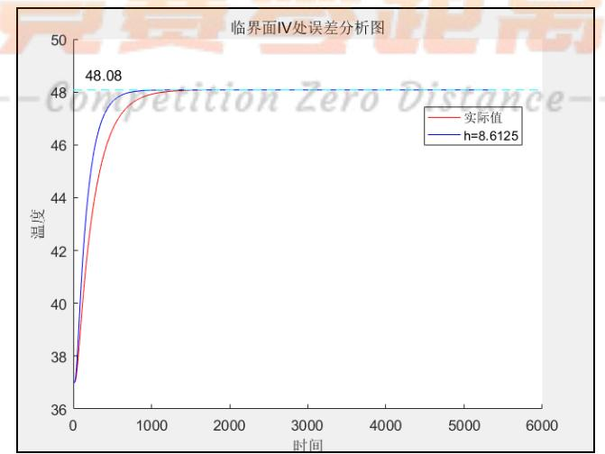  
图 14 临界面IV处误差分析图

## 5.2 问题二：确定 II层的最优厚度

问题二，需要求解 II层介质最优厚度，是一个最优化问题。

首先从服装成本与穿着舒适度两个方面讨论“最优”标准的制定，确定优化问题的目标为 II层介质厚度最小。

其次，考虑问题二关于假人皮肤外侧温度的两个要求，同时基于问题一建立的基于热传导方程的温度分布模型，确定最优化问题的约束条件，从而建立 II层最优厚度的单变量优化模型。

最后，问题二模型的求解，利用循环遍历的变步长枚举法，对 II层介质的所有可能厚度进行遍历，求出满足约束条件的最小厚度。

## 5.2.1 “最优”厚度标准的制定

（1）从成本方面考虑：专用服装的制作成本与其织物材料的厚度成正比，因而在满足问题二要求的前提下，II层介质厚度越小，服装成本越低，认为达到最优厚度。

（2）从穿着舒适度方面考虑：在其他三层介质厚度确定的条件下，II层介质厚度越小，服装总体厚度越小，穿着越舒适，认为达到最优厚度。

因此，从成本和穿着舒适度方面综合考虑，II介质的最优厚度是其满足约束条件的最小厚度。

## 5.2.2 约束条件的确定

Step1：确定保证工作60分钟时，假人皮肤外侧温度不超过 $4 7 ^ { \circ } C$ 的约束条件外界温度始终大于皮肤层温度，在这个热传导过程中，皮肤层温度随时间升高， 因此只要保证最大工作时间 $t { = } 3 6 0 0 s |$ 时，皮肤层温度不超过47 $^ \circ C$ ，即：

$$
u _ { L _ { 2 } } ( \sum _ { i = 1 } ^ { 4 } L _ { i } , 3 6 0 0 ) \leq 4 7\tag{34}
$$

其中， $\sum _ { i = 1 } ^ { 4 } L _ { i }$ 表示为四层介质的总厚度。

## Step2：确定皮肤外侧温度超过 $4 4 ^ { \circ } C$ 的时间不超过5分钟的约束条件

皮肤层温度的变化趋势是随时间一直增长，直至达到稳定状态。由于限定工作总时长为60分钟，为保证温度超过44 $^ \circ C$ 的时间不超过5分钟的约束条件，只要保证临界状态55分钟即 $t { = } 3 3 0 0 s \sharp \mathrm { \Delta } \mathrm { \hat { \cdot } }$ ，皮肤层温度不超过44 $^ \circ C$ 即可。约束条件表达式为：

$$
u _ { L _ { 2 } } ( \sum _ { i = 1 } ^ { 4 } L _ { i } , 3 3 0 0 ) \leq 4 4\tag{35}
$$

其中， $\sum _ { i = 1 } ^ { 4 } L _ { i }$ 表示为四层介质的总厚度。

由（32）式和（33）式可得，II层的最优厚度的优化问题约束条件为：

$$
\begin{array} { r } { \left\{ u _ { L _ { 2 } } ( \displaystyle \sum _ { i = 1 } ^ { 4 } L _ { i } , 3 6 0 0 ) \leq 4 7 \right. } \\ { \left. \displaystyle u _ { L _ { 2 } } ( \displaystyle \sum _ { i = 1 } ^ { 4 } L _ { i } , 3 3 0 0 ) \leq 4 4 \right. } \end{array}\tag{36}
$$

## 5.2.3 II层最优厚度的单目标优化模型的建立

下面结合问题一的基于热传导方程的温度分布模型，建立 II层最优厚度的单目标优化模型。

基于热传导方程的温度分布模型是解决问题二的基础，因此在问题二的约束条件也应该包括问题一所建立的热传导方程及其初边值条件和耦合条件，综合考虑为满足的问题二要求所确定的约束条件，给出 II层最优厚度的优化模型如下：

s.

$$
\begin{array} { r l } & { \mathrm { P r } _ { 1 } ^ { \mathrm { R e } } , } \\ & { \mathrm { R e } _ { 2 } ^ { \mathrm { R e } } , } \\ & { \mathrm { P e } _ { 3 } ^ { \mathrm { R e } } , } \\ & { \mathrm { P e } _ { 4 } ^ { \mathrm { R e } } , } \\ & { \mathrm { P e } _ { 5 } ^ { \mathrm { R e } } , } \\ & { \mathrm { P e } _ { 6 } ^ { \mathrm { R e } } , } \\ & { \mathrm { P e } _ { 7 } ^ { \mathrm { R e } } , } \\ & { \mathrm { P e } _ { 8 } ^ { \mathrm { R e } } , } \\ & { \mathrm { P e } _ { 7 } ^ { \mathrm { R e } } , } \\ & { \mathrm { P e } _ { 8 } ^ { \mathrm { R e } } , } \\ & { \mathrm { P e } _ { 7 } ^ { \mathrm { R e } } , } \\ & { \mathrm { P e } _ { 8 } ^ { \mathrm { R e } } , } \\ & { \mathrm { P e } _ { 7 } ^ { \mathrm { R e } } , } \\ & { \mathrm { P e } _ { 8 } ^ { \mathrm { R e } } , } \\ & { \mathrm { P e } _ { 7 } ^ { \mathrm { R e } } , } \\ & { \mathrm { P e } _ { 8 } ^ { \mathrm { R e } } , } \\ & { \mathrm { P e } _ { 7 } ^ { \mathrm { R e } } , } \\ & { \mathrm { P e } _ { 7 } ^ { \mathrm { R e } } , } \\ & { \mathrm { P e } _ { 8 } ^ { \mathrm { R e } } , } \\ & { \mathrm { P e } _ { 7 } ^ { \mathrm { R e } } , } \\ & { \mathrm { P e } _ { 7 } ^ { \mathrm { R e } } , } \\ & { \mathrm { P e } _ { 8 } ^ { \mathrm { R e } } , } \end{array}\tag{37}
$$

## 5.2.4 II层最优厚度的优化模型的求解

本文采用变步长枚举法对（35）式中的 $L _ { 2 }$ 进行确定，借助 matlab 遍历搜寻最优解，本题中枚举法的算法流程如图 15所示。

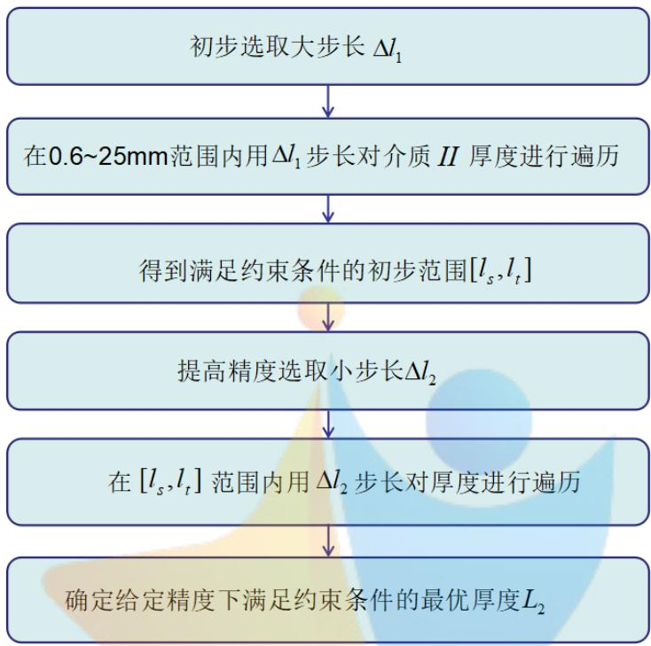  
图 15 问题二算法流程图

首先，本题选取大步长 $\Delta l _ { 1 } = 0 . 5 m m$ ，对0.6\~25mm范围进行初次遍历，求得 满足约束条件的介质 II厚度的初步范围[19.1,19.6]。

其次，对范围在0.6-25的 II层介质厚度进行步长为 0.1的枚举遍历，得到 0.1精度下满足约束条件（35）的 II介质的最优厚度 $L _ { 2 } = 1 9 . 3 m m$

综上，问题二的求解结果为：满足两个约束条件的 II 介质最佳厚度为$L _ { 2 } = 1 9 . 3 m m$

## 5.2.4 问题二模型的求解的灵敏度分析

在问题二中，探究在不同温度下最优厚度的变化来探究其灵敏度，我们将温度从65一直到69进行变化，步长 0.5，逐步探究 II层最优解的厚度，我们发现温度的升高，最优厚度也不断增高且近似于线性，可以说明最优厚度的灵敏度。

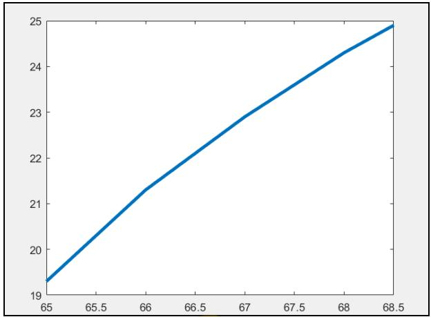  
图16 II层介质最优厚度的灵敏度分析

## 5.3 问题三：II、IV层最优厚度的优化模型

问题三区别于问题二，是一个多目标优化模型。对于问题三，模型的建立与求解主要分为以下步骤：

首先，从服装成本与穿着舒适度两个方面考虑，分别制定出不同方面的“最优”厚度标准，确定多变量优化问题的两个不同的目标。

其次，基于问题一建立的四层耦合介质的温度分布模型，考虑问题三提出的两个要求，给出最优化问题的约束条件，分别建立目标是服装成本最低和穿着舒适度最高的两个 II、IV 层厚度优化模型。

最后，问题三模型的求解，采用循环遍历的枚举法，借助 matlab 对 II 介质与 IV 介质厚度同时进行双重循环遍历，搜寻服装成本最低和穿着舒适度最高这两个目标下 II、IV层介质的最优厚度。

## 5.3.1 “最优”厚度标准的制定

（1）从成本方面考虑：专用服装的制作成本与其织物材料的厚度成正比，IV层为空气介质，无需织物材料，因而服装成本只与II层介质的厚度有关，II层介质厚度越小，服装成本越低，认为达到最优厚度。

（2）从穿着舒适度方面考虑：在I、III层介质厚度确定的条件下，II层介质与IV层介质总厚度越小，服装总体厚度越小，穿着越舒适，认为达到最优厚度。

## 5.3.2 约束条件的确定

Step1：确定保证工作30分钟时，假人皮肤外侧温度不超过 $4 7 ^ { \circ } C$ 的约束条件外界温度始终大于皮肤层温度，在这个热传导过程中，皮肤表面温度随时间升高。因此只要保证最大工作时间t=1800s时，皮肤层温度不超过47C：

$$
u _ { L _ { 2 } , L _ { 4 } } ( \sum _ { i = 1 } ^ { 4 } L _ { i } , 1 8 0 0 ) \leq 4 7\tag{38}
$$

其中， $\sum _ { i = 1 } ^ { 4 } L _ { i }$ 表示为四层介质的总厚度。

满足这个条件，即可满足工作的前60分钟内皮肤层温度始终不超过47C。Step2：确定皮肤外侧温度超过44C的时间不超过5分钟的约束条件

皮肤层温度的变化趋势是随时间一直增长，直至达到稳定状态。由于限定工作总时长为30分钟，为保证温度超过 $4 4 ^ { \circ } C$ 的时间不超过5分钟的约束条件，只要保证临界状态25分钟即t=1500s时，皮肤层温度不超过 $4 4 ^ { \circ } C$ 即可。约束条件表达式为：

$$
u _ { L _ { 2 } , L _ { 4 } } ( \sum _ { i = 1 } ^ { 4 } L _ { i } , 1 5 0 0 ) \leq 4 4\tag{39}
$$

其中， $\sum _ { i = 1 } ^ { 4 } L _ { i }$ 表示为四层介质的总厚度。

由（32）式和（33）式可得，II、IV层的最优厚度的多目标优化问题的约束条件为：

$$
\begin{array} { r } { \{ u _ { L _ { 2 } , L _ { 4 } } ( \displaystyle \sum _ { i = 1 } ^ { 4 } L _ { i } , 1 8 0 0 ) \leq 4 7  } \\ {  \displaystyle \{ u _ { L _ { 2 } , L _ { 4 } } ( \displaystyle \sum _ { i = 1 } ^ { 4 } L _ { i } , 1 5 0 0 ) \leq 4 4  } \end{array}\tag{40}
$$

## 5.3.3 II、IV层最优厚度的多目标优化模型的建立

下面结合问题一的基于热传导方程的温度分布模型，建立关于 II、IV 层最优厚度的多目标优化模型[5]。

从成本方面考虑，给出 II、IV 层最优厚度的最优化模型的目标为：

$$
\operatorname* { m i n } L _ { 2 }\tag{41}
$$

从穿着舒适度方面考虑，给出 II、IV层最优厚度的最优化模型的目标为：

$$
\operatorname* { m i n } L _ { 2 } + L _ { 4 }\tag{42}
$$

基于热传导方程的温度分布模型是解决问题三的基础，因此在问题三中的约束条件也应该包括问题一所建立的热传导方程及其初边值条件和耦合条件。综合考虑问题三的所有约束条件。得到 II、IV 层最优厚度的多目标优化模型的约束条件为：

$$
\left| u _ { L _ { 2 } } ( \sum _ { i = 1 } ^ { 4 } L _ { i } , 1 8 0 0 ) \leq 4 7 \right.
$$

$$
\boxed { u _ { L _ { 2 } } ( \sum _ { i = 1 } ^ { 4 } L _ { i } , 1 5 0 0 ) \leq 4 4 }
$$

$$
0 . 6 \leq L _ { 2 } \leq 2 5
$$

$$
\frac { \hat { \sigma } u _ { i } } { \hat { \sigma } t } = a _ { i } ^ { 2 } \frac { \hat { \sigma } ^ { 2 } u _ { i } } { \hat { \sigma } x ^ { 2 } } \qquad \& \in \bigcup _ { i = 1 } ^ { 4 } [ L _ { i - 1 } , L _ { i } ] , L _ { 0 } = 0
$$

$$
a _ { i } ^ { 2 } = \frac { \lambda _ { i } } { c _ { i } \rho _ { i } }
$$

$$
i = 1 , 2 , 3 , 4
$$

$$
| \lambda _ { 1 } \frac { \partial u _ { 1 } } { \partial x } | _ { \Gamma _ { 1 } } = \lambda _ { 2 } \frac { \partial u _ { 2 } } { \partial x } | _ { \Gamma _ { 1 } }
$$

$$
\left\{ \left. u _ { 1 } \right| _ { \Gamma _ { 1 } } = u _ { 2 } \right| _ { \Gamma _ { 1 } }
$$

$$
| \lambda _ { 2 } \frac { \partial u _ { 2 } } { \partial x } | _ { \Gamma _ { 2 } } = \lambda _ { 3 } \frac { \partial u _ { 3 } } { \partial x } | _ { \Gamma _ { 2 } }
$$

$$
\left| \left. u _ { 2 } \right| _ { \Gamma _ { 2 } } = u _ { 3 } \right| _ { \Gamma _ { 2 } }
$$

$$
 \lambda _ { 3 } \frac { \partial u _ { 3 } } { \partial x } | _ { \Gamma _ { 3 } } = \lambda _ { 4 } \frac { \partial u _ { 4 } } { \partial x } | _ { \Gamma _ { 3 } }
$$

$$
\begin{array} { r l } & { | u _ { 3 } | _ { \Gamma _ { 3 } } = u _ { 4 } | _ { \Gamma _ { 3 } } } \\ & { | u _ { i } ( \boldsymbol { x } , 0 ) = 3 7 \qquad \quad i = 1 , 2 , 3 , 4 } \\ & { | u _ { 1 } ( 0 , t ) = 8 0 \qquad \quad } \end{array}\tag{43}
$$

$$
\boxed { - \lambda _ { 4 } \frac { \hat { \sigma } u _ { 4 } } { \hat { \sigma } x } = h ( u _ { h } - u _ { 5 } ) }
$$

联立（39）式和（41）式，得到服装成本最低的 II、IV层最优厚度的多目标优化模型；

联立（40）式和（41）式，得到穿着舒适度最高的 II、IV层最优厚度的多目标优化模型。

## 5.3.4 II、IV层最优厚度的多目标优化模型的求解

问题三的求解采用与 5.2.4 节相同的思想，对服装成本最低的优化模型和穿着舒适度最高的优化模型分别进行求解。

本题采用变步长枚举法，借助 matlab 对 II介质与 IV介质同时进行双重循环遍历，搜寻服装成本最低和穿着舒适度最高这两种不同目标下 II，IV 介质的最优厚度。具体算法如下图 17所示：

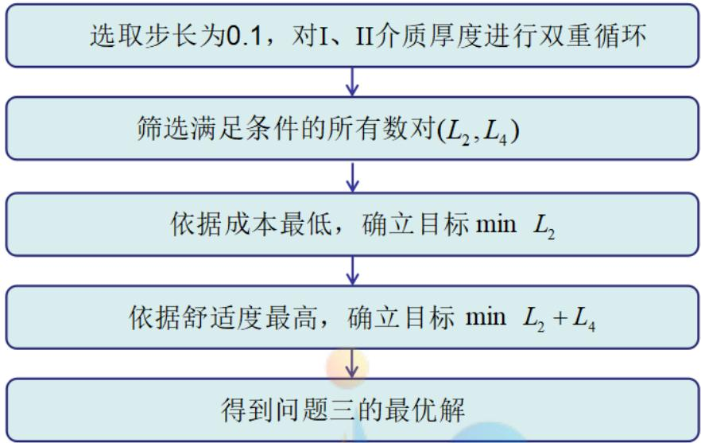  
图 17 问题三算法流程图

首先，设计双重for循环，遍历得到满足所有约束条件的 II介质、IV 介质的厚度数对 $\left( { \cal L } _ { 2 } , { \cal L } _ { 4 } \right)$ 0

其次，因为 IV 层介质为空气层，不计成本。所以，从成本角度出发，如果要达到成本最低，在 I、III介质层厚度已知的情况下，只需要 II介质层的厚度最低即可。

然后，从最佳穿着舒适度的角度出发，衣服越轻薄舒适度越高，则只需要 II、IV 层介质的总厚度最低即可。

最后，得到满足不同优化目标的 II、IV层介质的最优厚度。求得两种目标下的 II，IV层介质的初步最优解如下表3：

表3 II、IV 层最优厚度的多目标优化模型初步求解结果
<table><tr><td rowspan=1 colspan=1>优化目标</td><td rowspan=1 colspan=1>最优解1</td><td rowspan=1 colspan=1>最优解2</td></tr><tr><td rowspan=1 colspan=1>成本最低</td><td rowspan=1 colspan=1> $L _ { 2 } { = } 2 1 . 7 L _ { 4 } { = } 6 . 4$ </td><td rowspan=1 colspan=1></td></tr><tr><td rowspan=1 colspan=1>舒适度最佳</td><td rowspan=1 colspan=1> $L _ { 2 } { = } 2 1 . 7 L _ { 4 } { = } 6 . 4$ </td><td rowspan=1 colspan=1> $L _ { 2 } { = } 2 1 . 8 L _ { 4 } { = } 6 . 3$ </td></tr></table>

比较舒适度最佳的两个最优解，显然最优解 1的服装成本低于最优解 2的服装成本。因此，在相同舒适度情况下，成本较低的最优解 1是多目标优化模型的整体最优解。

因此，问题三的 II、IV 介质最优厚度为： $L _ { 2 } { = } 2 1 . 7 , L _ { 4 } { = } 6 . 4$

## 5.3.5 问题三模型的检验

在问题三中，对最优厚度的变化进行进一步的验证，对 II 层中最优解中的21.8mm 进行适当的降低，同时，保持 IV 层中最优解 6.4mm 不变，可以发现在第25分钟时，假人皮肤表面温度超过了 44℃，不再满足题目中的条件。

同样，II层中保持最优解中 21.8mm不变，降低 IV层中最优解6.4mm，同样发现在第25分钟时，假人皮肤温度已经超过了 $4 4 ^ { \circ } \mathrm { C }$ ，不再满足题目中的条件。

同样，如果同时降低 II 层中最优解和 IV 层中最优解，肯定会导致假人皮肤外侧温度超过44℃的时间超过 5分钟，因此，可以验证最优解的正确性。

## 六、模型评价

## 6.1 模型的优点

（1）根据不同介质的物理性质建立热传导方程，考虑导热临界面上热流量密度与温度相同，提出了多层介质的耦合处理方法，模型创新性好。

（2）问题一中的转化系数 h 的确定和问题二、三中的介质最优厚度的求解均采用变步长多次枚举法遍历求得，模型求解速度快，精度高。

（3）利用隐式向后差分格式对连续的模型进行离散化处理从而进行数值求解，离散格式无条件稳定，求解精度较好 。

## 6.2 模型的缺点

问题三模型求解时，为获得较高精度，采用极小步长遍历搜寻最优解，容易导致程序运行缓慢。

## 6.3 模型的改进方案

在第一问，基于热传导方程的温度分布模型的求解过程中，可以用 C-N格式（Crank-Nicolson 差分格式）代替隐式向后差分格式，获得截断误差更小的数值解。

## 参考文献

[1] 潘斌. 热防护服装热传递数学建模及参数决定反问题[D]. 浙江理工大学,2017.

[2] 卢琳珍, 徐定华, 徐映红. 应用三层热防护服热传递改进模型的皮肤烧伤度预测[J]. 纺织学报, 2018(1):111-118.

[3] 金启胜. 利用 Fourier 变换求解热传导方程的定解问题[J]. 上饶师范学院学报, 2011, 31(3):54-55.

[4] 刘志华, 刘瑞金. 牛顿冷却定律的冷却规律研究[J]. 山东理工大学学报(自然科学版), 2005, 19(6):23-27.

[5] 郑夕健, 张国忠, 费烨. 基于灰色模糊决策的多目标优化模型及应用研究[J]. 组合机床与自动化加工技术, 2007(1):10-13.

[6] Truo, 梁 高 勇 . 生 化 防 护 服 的 材 料 设 计 [J]. 国 外 纺 织 技 术 ,1999(5):11-15.

## 附录

```matlab
clear;%清除工作区变量
clc;%清屏
close all;%关闭所有图形窗口
z=[];
for h=8:0.01:9 %确定空气交换系数范围
%% 材料参数输入
m1=6;m2=60;m3=36;m4=50;% 分别对四种介质分割
m=m1+m2+m3+m4;% 介质分割和
n=5400;% 对时间分割
t=5400;% 总时长
l1=0.6/1000;l2=6/1000;l3=3.6/1000;l4=5/1000;% 四种材料厚度
lam_1=0.082;lam_2=0.37;lam_3=0.045;lam_4=0.028;% 四种材料的热传导率
de_1=300;de_2=862;de_3=74.2;de_4=1.18;% 四种材料的密度
c1=1377;c2=2100;c3=1726;c4=1005;% 四种材料的比热容
%% 计算热扩散率
a1=lam_1/(c1*de_1);% I 层材料的热扩散率
a2=lam_2/(c2*de_2);% II 层材料的热扩散率
a3=lam_3/(c3*de_3);% III 层材料的热扩散率
a4=lam_4/(c4*de_4);% IV 层材料的热扩散率
%% 材料长度分割和时间步长分割求解
derta_x1=l1/m1;% I 层材料的分割长度
derta_x2=l2/m2;% II 层材料的分割长度
derta_x3=l3/m3;% III 层材料的分割长度
derta_x4=l4/m4;% IV 层材料的分割长度
derta_t=t/n;% 时间步长分割
%% 计算各层介质剖分的步长比
r1=derta_t/derta_x1^2*a1;% 第 I 层介质剖分的步长比
r2=derta_t/derta_x2^2*a2;% 第 II 层介质剖分的步长比
r3=derta_t/derta_x3^2*a3;% 第 III 层介质剖分的步长比
r4=derta_t/derta_x4^2*a4;% 第 IV 层介质剖分的步长比
u=zeros(m+1,n+1);% 定义四层耦合介质温度分布矩阵
%% 初始条件和边界条件
u(:,1)=37;%初始条件
u(1,:)=75;%边界条件
%% 差分格式的系数矩阵的构造
A=zeros(m,m);
```

## 附录一：求解问题一中空气系数的范围（matlab 程序）

```matlab
for i=1:m1-1
A(i,i)=1+2*r1;
A(i,i+1)=-r1;
if i>=2
A(i,i-1)=-r1;
end
end
A(m1,m1)=(lam_1/derta_x1+lam_2/derta_x2);
A(m1,m1-1)=-lam_1/derta_x1;
```

## 附录二：在已知空气系数范围下求解问题一中空气系数的精确值（matlab 程序）

clear;%清除工作区变量  
clc;%清屏  
close all;%关闭所有图形窗口

```matlab
z=[];
for h=8.61:0.0001:8.63 %确定空气交换系数
%% 材料参数输入
m1=6;m2=60;m3=36;m4=50;% 分别对四种介质分割
m=m1+m2+m3+m4;% 介质分割和
n=5400;% 对时间分割
t=5400;% 总时长
l1=0.6/1000;l2=6/1000;l3=3.6/1000;l4=5/1000;% 四种材料厚度
lam_1=0.082;lam_2=0.37;lam_3=0.045;lam_4=0.028;% 四种材料的热传导率
de_1=300;de_2=862;de_3=74.2;de_4=1.18;% 四种材料的密度
c1=1377;c2=2100;c3=1726;c4=1005;% 四种材料的比热容
```

a4=lam\_4/(c4\*de\_4);% IV 层材料的热扩散率

%% 材料长度分割和时间步长分割求解

derta\_x1=l1/m1;% I 层材料的分割长度

derta\_x2=l2/m2;% II 层材料的分割长度

derta\_x3=l3/m3;% III 层材料的分割长度

derta\_x4=l4/m4;% IV 层材料的分割长度

derta\_t=t/n;% 时间步长分割

%% 计算各层介质剖分的步长比

```matlab
r1=derta_t/derta_x1^2*a1;% 第 I 层介质剖分的步长比
r2=derta_t/derta_x2^2*a2;% 第 II 层介质剖分的步长比
r3=derta_t/derta_x3^2*a3;% 第 III 层介质剖分的步长比
r4=derta_t/derta_x4^2*a4;% 第 IV 层介质剖分的步长比
u=zeros(m+1,n+1);% 定义四层耦合介质温度分布矩阵
%% 初始条件和边界条件
u(:,1)=37;%初始条件
u(1,:)=75;%边界条件
%% 差分格式的系数矩阵的构造
A=zeros(m,m);
for i=1:m1-1
A(i,i)=1+2*r1;
A(i,i+1)=-r1;
if i>=2
A(i,i-1)=-r1;
end
end
A(m1,m1)=(lam_1/derta_x1+lam_2/derta_x2);
A(m1,m1-1)=-lam_1/derta_x1;
A(m1,m1+1)=-lam_2/derta_x2;
for i=m1+1:m1+m2-1
A(i,i)=1+2*r2;
A(i,i+1)=-r2;
A(i,i-1)=-r2;
end
A(m1+m2,m1+m2+1)=-lam_3/derta_x3;
for i=m1+m2+1:m1+m2+m3-1
A(i,i)=1+2*r3;
A(i,i+1)=-r3;
A(i,i-1)=-r3;
end
A(m1+m2+m3,m1+m2+m3)=(lam_3/derta_x3+lam_4/derta_x4);
A(m1+m2+m3,m1+m2+m3-1)=-lam_3/derta_x3;
A(m1+m2+m3,m1+m2+m3+1)=-lam_4/derta_x4;
for i=m1+m2+m3+1:m1+m2+m3+m4-1
```

```matlab
A(i,i)=1+2*r4;
A(i,i-1)=-r4;
A(i,i+1)=-r4;
end
A(m,m)=h+lam_4/derta_x4;
A(m,m-1)=-lam_4/derta_x4;
%% 构造右端项
for k=2:n+1
b=zeros(m,1);
for i=2:m-1
b(i,1)=u(i+1,k-1);
end
b(1,1)=u(2,k-1)+r1*u(1,k);
b(m1,1)=0;
b(m1+m2,1)=0;
b(m1+m2+m3,1)=0;
b(m,1)=37*h;
%% 追赶法求解
bb=diag(A)';
aa=[0,diag(A,-1)'];
c=diag(A,1)';
N=length(bb);
L=zeros(N);
uu0=0;y0=0;aa(1)=0;
L(1)=bb(1)-aa(1)*uu0;
y(1)=(b(1)-y0*aa(1))/L(1);
for i=2:(N-1) uu(1)=c(1)/L(1);<sub>for</sub> <sub>i=2:(N-1)</sub>
L(i)=bb(i)-aa(i)*uu(i-1);
y(i)=(b(i)-y(i-1)*aa(i))/L(i);
uu(i)=c(i)/L(i);
end
L(N)=bb(N)-aa(N)*uu(N-1);
y(N)=(b(N)-y(N-1)*aa(N))/L(N);
x(N)=y(N);
for i=(N-1):-1:1
x(i)=y(i)-uu(i)*x(i+1);
end
u(2:m+1,k)=x';
end
```

derta\_x1=l1/m1;% I 层材料的分割长度

a2=lam\_2/(c2\*de\_2);% II 层材料的热扩散率

%% 计算热扩散率

derta\_t=t/n;% 时间步长分割

a4=lam\_4/(c4\*de\_4);% IV 层材料的热扩散率

```matlab
q=u(m+1,t+1)-48.08;
z=[z q];
[d p]=min(abs(z));
end
fprintf('空气交换系数：\n')
fprintf(' %.4f\n',8.61+0.0001*p)
附录三：求解问题一中温度分布矩阵，同时绘制温度分布图和部分位置温度分布
图，其中生成题目中所要求的 Excle 文件problem1（matlab 程序）
```

clear;%清除工作区变量  
clc;%清屏  
close all;%关闭所有图形窗口

```csv
z=[];
h=8.6125; %空气交换系数
%% 材料参数输入
m1=6;m2=60;m3=36;m4=50;% 分别对四种介质分割
m=m1+m2+m3+m4;% 介质分割和
n=5400;% 对时间分割
t=5400;% 总时长
l1=0.6/1000;l2=6/1000;l3=3.6/1000;l4=5/1000;% 四种材料厚度
lam_1=0.082;lam_2=0.37;lam_3=0.045;lam_4=0.028;% 四种材料的热传导率
de_1=300;de_2=862;de_3=74.2;de_4=1.18;% 四种材料的密度
c1=1377;c2=2100;c3=1726;c4=1005;% 四种材料的比热容
```

a1=lam\_1/(c1\*de\_1);% I 层材料的热扩散率

%% 计算各层介质剖分的步长比

```matlab
r1=derta_t/derta_x1^2*a1;% 第 I 层介质剖分的步长比
r2=derta_t/derta_x2^2*a2;% 第 II 层介质剖分的步长比
r3=derta_t/derta_x3^2*a3;% 第 III 层介质剖分的步长比
r4=derta_t/derta_x4^2*a4;% 第 IV 层介质剖分的步长比
u=zeros(m+1,n+1);% 定义四层耦合介质温度分布矩阵
%% 初始条件和边界条件
u(:,1)=37;%初始条件
u(1,:)=75;%边界条件
%% 差分格式的系数矩阵的构造
A=zeros(m,m);
for i=1:m1-1
A(i,i)=1+2*r1;
A(i,i+1)=-r1;
if i>=2
A(i,i-1)=-r1;
end
end
A(m1,m1)=(lam_1/derta_x1+lam_2/derta_x2);
A(m1,m1-1)=-lam_1/derta_x1;
A(m1,m1+1)=-lam_2/derta_x2;
for i=m1+1:m1+m2-1
A(i,i)=1+2*r2;
A(i,i+1)=-r2;
A(i,i-1)=-r2;
end
A(m1+m2,m1+m2+1)=-lam_3/derta_x3;
for i=m1+m2+1:m1+m2+m3-1
A(i,i)=1+2*r3;
A(i,i+1)=-r3;
A(i,i-1)=-r3;
end
A(m1+m2+m3,m1+m2+m3)=(lam_3/derta_x3+lam_4/derta_x4);
A(m1+m2+m3,m1+m2+m3-1)=-lam_3/derta_x3;
A(m1+m2+m3,m1+m2+m3+1)=-lam_4/derta_x4;
for i=m1+m2+m3+1:m1+m2+m3+m4-1
```

```matlab
A(i,i)=1+2*r4;
A(i,i-1)=-r4;
A(i,i+1)=-r4;
end
A(m,m)=h+lam_4/derta_x4;
A(m,m-1)=-lam_4/derta_x4;
%% 构造右端项
for k=2:n+1
b=zeros(m,1);
for i=2:m-1
b(i,1)=u(i+1,k-1);
end
b(1,1)=u(2,k-1)+r1*u(1,k);
b(m1,1)=0;
b(m1+m2,1)=0;
b(m1+m2+m3,1)=0;
b(m,1)=37*h;
%% 追赶法求解
bb=diag(A)';
aa=[0,diag(A,-1)'];
c=diag(A,1)';
N=length(bb);
L=zeros(N);
uu0=0;y0=0;aa(1)=0;
L(1)=bb(1)-aa(1)*uu0;
y(1)=(b(1)-y0*aa(1))/L(1);
for i=2:(N-1) uu(1)=c(1)/L(1);<sub>for</sub> <sub>i=2:(N-1)</sub>
L(i)=bb(i)-aa(i)*uu(i-1);
y(i)=(b(i)-y(i-1)*aa(i))/L(i);
uu(i)=c(i)/L(i);
end
L(N)=bb(N)-aa(N)*uu(N-1);
y(N)=(b(N)-y(N-1)*aa(N))/L(N);
x(N)=y(N);
for i=(N-1):-1:1
x(i)=y(i)-uu(i)*x(i+1);
end
u(2:m+1,k)=x';
end
```

```matlab
%% 四个临界面下的部分温度分布表
U=zeros(5401,4);
U(:,1)=u(m1+1,:)';
U(:,2)=u(m1+m2+1,:)';
U(:,3)=u(m1+m2+m3+1,:)';
U(:,4)=u(m1+m2+m3+m4+1,:)';
```

```matlab
%% 绘制不同时刻不同厚度温度分布图
x=1:1:m+1;
t=1:1:t+1;
surf(t,x,u)
shading interp
xlabel('t')
ylabel('x')
zlabel('u')
```

xlswrite('不同时间不同厚度下的温度分布.xlsx',u)% 生成温度分布的 excle 文件

xlswrite('problem1.xlsx',U)% 存 储 生 成 四 个 临 界 面 下 的 部 分 温 度 分 布 表 于problem1

figure subplot(2,2,1) plot(U(:,1),'r') xlabel('t');ylabel('u'); title('临界面 I') subplot(2,2,2) plot(U(:,2),'r') xlabel('t');ylabel('u'); title('临界面 II') axis([0 5400 30 80]) subplot(2,2,3) plot(U(:,3),'r') title('临界面 III') axis([0 5400 30 80]) xlabel('t');ylabel('u'); subplot(2,2,4) plot(U(:,4),'r') title('临界面 IV')

axis([0 5400 30 80])

xlabel('t');ylabel('u');

附录四：求解问题二中的 II层的最优厚度（matlab 程序）

clear;%清除工作区变量

clc;%清屏

close all;%关闭所有图形窗口

%% 材料参数输入

m1=6;m2=60;m3=36;m4=50;%分别对四种介质分割

m=m1+m2+m3+m4;%介质分割和

n=3600;%对时间分割

t=3600;%总时长

h=8.6125;%空气交换系数

l1=0.6/1000;l3=3.6/1000;l4=5.5/1000;%材料厚度

lam\_1=0.082;lam\_2=0.37;lam\_3=0.045;lam\_4=0.028;%四种材料的热传导率

de\_1=300;de\_2=862;de\_3=74.2;de\_4=1.18;%四种材料的密度

c1=1377;c2=2100;c3=1726;c4=1005;%四种材料的比热容

%% 计算热扩散率

a1=lam\_1/(c1\*de\_1);%I 层材料的热扩散率

a2=lam\_2/(c2\*de\_2);%II 层材料的热扩散率

a3=lam\_3/(c3\*de\_3);%III 层材料的热扩散率

a4=lam\_4/(c4\*de\_4);%IV 层材料的热扩散率

optimum=[];%c 存储满足条件的 l2 长度

for l2=(0.6:0.1:25)/1000

%% 材料长度分割和时间步长分割求解

derta\_x1=l1/m1;%I 层材料的分割长度

derta\_x2=l2/m2;%II 层材料的分割长度

derta\_x3=l3/m3;%III 层材料的分割长度

derta\_x4=l4/m4;%IV 层材料的分割长度

derta\_t=t/n;%时间步长分割

%% 计算各层介质剖分的步长比

r1=derta\_t/derta\_x1^2\*a1;%第 I 层介质剖分的步长比

r2=derta\_t/derta\_x2^2\*a2;%第 II 层介质剖分的步长比

r3=derta\_t/derta\_x3^2\*a3;%第 III 层介质剖分的步长比

r4=derta\_t/derta\_x4^2\*a4;%第 IV 层介质剖分的步长比

```matlab
u=zeros(m+1,n+1);%定义四层耦合介质温度分布矩阵
%% 初始条件和边界条件
u(:,1)=37;%初始条件
u(1,:)=65;%边界条件
%% 差分格式的系数矩阵
A=zeros(m1+m2+m3+m4,m1+m2+m3+m4);
for i=1:m1-1
A(i,i)=1+2*r1;
A(i,i+1)=-r1;
if i>=2
A(i,i-1)=-r1;
end
end
A(m1,m1)=(lam_1/derta_x1+lam_2/derta_x2);
A(m1,m1-1)=-lam_1/derta_x1;
A(m1,m1+1)=-lam_2/derta_x2;
for i=m1+1:m1+m2-1
A(i,i)=1+2*r2;
A(i,i+1)=-r2;
A(i,i-1)=-r2;
end
A(m1+m2,m1+m2)=(lam_2/derta_x2+lam_3/derta_x3);
A(m1+m2,m1+m2-1)=-lam_2/derta_x2;
A(m1+m2,m1+m2+1)=-lam_3/derta_x3;
<sup>for</sup> <sup>i=m1+m2+1:m1+m2+m3-1</sup>A(i,i)=1+2*r3;<sub>A(i,i+1)=-r3;</sub> A(i,i+1)=-r3;
A(i,i-1)=-r3;
end
A(m1+m2+m3,m1+m2+m3)=(lam_3/derta_x3+lam_4/derta_x4);
A(m1+m2+m3,m1+m2+m3-1)=-lam_3/derta_x3;
A(m1+m2+m3,m1+m2+m3+1)=-lam_4/derta_x4;
for i=m1+m2+m3+1:m1+m2+m3+m4-1
A(i,i)=1+2*r4;
A(i,i-1)=-r4;
A(i,i+1)=-r4;
end
```

```matlab
A(m,m)=h+lam_4/derta_x4;
A(m,m-1)=-lam_4/derta_x4;
%% 追赶法求解
for k=2:n+1
k;
b=zeros(m,1);
for i=2:m-1
b(i,1)=u(i+1,k-1);
end
b(1,1)=u(2,k-1)+r1*u(1,k);
b(m1,1)=0;
b(m1+m2,1)=0;
b(m1+m2+m3,1)=0;
b(m,1)=37*h;
bb=diag(A)';
aa=[0,diag(A,-1)'];
c=diag(A,1)';
N=length(bb);
L=zeros(N);
uu0=0;y0=0;aa(1)=0;
L(1)=bb(1)-aa(1)*uu0;
y(1)=(b(1)-y0*aa(1))/L(1);
uu(1)=c(1)/L(1);
for i=2:(N-1)
L(i)=bb(i)-aa(i)*uu(i-1);
y(i)=(b(i)-y(i-1)*aa(i))/L(i);
uu(i)=c(i)/L(i);
end 1);
L(N)=bb(N)-aa(N)*uu(N
y(N)=(b(N)-y(N-1)*aa(N))/L(N);
x(N)=y(N);
for i=(N-1):-1:1
x(i)=y(i)-uu(i)*x(i+1);
end
u(2:m+1,k)=x';
end
if u(m+1,3600)<=47&u(m+1,3301)<=44
optimum=[optimum l2*1000];
end
end
```

[p q]=min(optimum);

fprintf('II 层材料的最优厚度：\n')

fprintf(' %.1fmm\n',p)

附录五：求解问题三中第 II层和第IV层的最优厚度（matlab 程序）

clear;%清除工作区变量

clc;%清屏

close all;%关闭所有图形窗口

%% 材料参数输入

m1=6;m2=60;m3=36;m4=50;%分别对四种介质分割

m=m1+m2+m3+m4;%介质分割和

n=1800;%对时间分割

t=1800;%总时长

h=8.6125;%空气交换系数

l1=0.6/1000;l3=3.6/1000;% 材料厚度

lam\_1=0.082;lam\_2=0.37;lam\_3=0.045;lam\_4=0.028;% 四种材料的热传导率

de\_1=300;de\_2=862;de\_3=74.2;de\_4=1.18;% 四种材料的密度

c1=1377;c2=2100;c3=1726;c4=1005;% 四种材料的比热容

%% 计算热扩散率

a1=lam\_1/(c1\*de\_1);% I 层材料的热扩散率

a2=lam\_2/(c2\*de\_2);% II 层材料的热扩散率

a3=lam\_3/(c3\*de\_3);% III 层材料的热扩散率

a4=lam\_4/(c4\*de\_4);% IV 层材料的热扩散率

optimum1=[];%存储满足 II 层材料的长度

optimum2=[];%存储满足 IV 层材料的长度

for l2=(0.6:0.1:25)/1000

for l4=(0.6:0.1:6.4)/1000

%% 材料长度分割和时间步长分割求解

derta\_x1=l1/m1;%I 层材料的分割长度

derta\_x2=l2/m2;%II 层材料的分割长度

derta\_x3=l3/m3;%III 层材料的分割长度

derta\_x4=l4/m4;%IV 层材料的分割长度

derta\_t=t/n;%时间步长分割

%% 计算各层介质剖分的步长比

r1=derta\_t/derta\_x1^2\*a1;%第 I 层介质剖分的步长比

```matlab
r2=derta_t/derta_x2^2*a2;%第 II 层介质剖分的步长比
r3=derta_t/derta_x3^2*a3;%第 III 层介质剖分的步长比
r4=derta_t/derta_x4^2*a4;%第 IV 层介质剖分的步长比
u=zeros(m+1,n+1);%定义四层耦合介质温度分布矩阵
%% 初始条件和边界条件
u(1,:)=80;%边界条件
u(:,1)=37;%初始条件
%% 差分格式的系数矩阵
A=zeros(m1+m2+m3+m4,m1+m2+m3+m4);
for i=1:m1-1
A(i,i)=1+2*r1;
A(i,i+1)=-r1;
if i>=2
A(i,i-1)=-r1;
end
end
A(m1,m1)=(lam_1/derta_x1+lam_2/derta_x2);
A(m1,m1-1)=-lam_1/derta_x1;
A(m1,m1+1)=-lam_2/derta_x2;
for i=m1+1:m1+m2-1
A(i,i)=1+2*r2;
A(i,i+1)=-r2;
A(i,i-1)=-r2;
end
A(m1+m2,m1+m2)=(lam_2/derta_x2+lam_3/derta_x3);
A(m1+m2,m1+m2+1)=-lam_3/derta_x3;
for i=m1+m2+1:m1+m2+m3-1
A(i,i)=1+2*r3;
A(i,i+1)=-r3;
A(i,i-1)=-r3;
end
A(m1+m2+m3,m1+m2+m3)=(lam_3/derta_x3+lam_4/derta_x4);
A(m1+m2+m3,m1+m2+m3-1)=-lam_3/derta_x3;
A(m1+m2+m3,m1+m2+m3+1)=-lam_4/derta_x4;
```

```matlab
for i=m1+m2+m3+1:m1+m2+m3+m4-1
A(i,i)=1+2*r4;
A(i,i-1)=-r4;
A(i,i+1)=-r4;
end
A(m,m)=h+lam_4/derta_x4;
A(m,m-1)=-lam_4/derta_x4;
%% 升横右端项
for k=2:n+1
b=zeros(m,1);
for i=2:m-1
b(i,1)=u(i+1,k-1);
end
b(1,1)=u(2,k-1)+r1*u(1,k);
b(m1,1)=0;
b(m1+m2,1)=0;
b(m1+m2+m3,1)=0;
b(m,1)=37*h;
%% 追赶法求解方程
bb=diag(A)';
aa=[0,diag(A,-1)'];
c=diag(A,1)';
N=length(bb);
L=zeros(N);
uu0=0;y0=0;aa(1)=0;
L(1)=bb(1)-aa(1)*uu0;
y(1)=(b(1)-y0*aa(1))/L(1);
uu(1)=c(1)/L(1);
for i=2:(N-1)
L(i)=bb(i)-aa(i)*uu(i-1);
y(i)=(b(i)-y(i-1)*aa(i))/L(i);
uu(i)=c(i)/L(i);
end
L(N)=bb(N)-aa(N)*uu(N-1);
y(N)=(b(N)-y(N-1)*aa(N))/L(N);
x(N)=y(N);
for i=(N-1):-1:1
x(i)=y(i)-uu(i)*x(i+1);
end
```

```matlab
fprintf('l2+l4 最小厚度最小时介质 II、介质 IV、总厚度：\n')
fprintf(' 12=%.1f %.1f\n',optimum1(1),optimum1(2))
fprintf(' 14=%.1f %.1f\n',optimum2(1),optimum2(2))
fprintf(' 12+l4=%.1f %.1f\n',q(1),q(2))
```

```matlab
u(2:m+1,k)=x';
end
if u(m+1,1800)<=47&u(m+1,1501)<=44%控制条件
optimum1=[optimum1 l2*1000];
optimum2=[optimum2 l4*1000];
end
end
end
q=optimum1+optimum2;
[p e]=min(optimum1);
fprintf('l2 最小成本最低时介质 II、介质 IV、总厚度：\n')
fprintf(' 12=%.1f\n',optimum1(e))
fprintf(' 14=%.1f\n',optimum2(e))
fprintf(' 12+l4=%.1f\n\n',q(e))
```