# 同心鼓最佳协作策略的研究

## 摘要

同心鼓是一个考验团队协作能力的项目，该项目的目标是不违反规则的情况下实现最大数量的连续颠球。但在实践中项目会面临球倾斜、鼓面转动等复杂情况。本文主要从系统的受力分析描述球与鼓的动力学方程出发，建立数学模型求解各种决策。

针对理想状态下最佳策略求解问题，该问题还要确定决策对应的颠球高度。用力的方向、力度和时机视为共同影响策略。同时，还将人数、绳长、鼓较绳水平时下落的高度、排球最高点高度、排球倾角设为环境变量。首先规定最优策略应满足队员的用力方向垂直于受力点在鼓身的切线，并规定所有人发力时机、力度一致。分析时将颠球周期分为碰撞前、碰撞时和碰撞后。研究球的运动时，将该过程视为球动能与势能的相互转换，同时需考虑空气阻力的影响；研究鼓碰撞前的运动时，根据机械能守恒，队员在竖直方向上所有分力的合力做的功将转化为鼓的重力势能与动能。最后得二阶微分方程描述鼓和球的高度与速度、加速度之间的关系。研究碰撞前后球的速度变化时，将碰撞视为瞬时发生的完全弹性碰撞，根据动能守恒、能量守恒求解速度变化。得到颠球高度与力度、时机和各环境变量的关系后，我们以成员总用力最小为目标，以颠球高度大于0.4m，成员间距不小于0.6m，队员均匀分布，队员用力时机一致，力度相同为最优策略的约束条件建立最优化模型。以所有队员同时发力80N为例，发力时机在[0.01,0.16]范围内都视为最优策略，其中时机为0.01s的策略稳定后颠球高度为0.4116m。

针对实际情况下鼓面倾角表征问题，问题二中我们将鼓的运动视为平动、转动两个过程。为表征任意时刻鼓面倾斜程度与队员发力力度、时机之间的关系，将时间离散化，用鼓面法向量与竖直方向的夹角表示鼓面倾角，以鼓面中心为原点建立自然坐标系，分析单位时间内平动、转动对鼓状态变量产生的影响，问题三用鼓的速度、鼓上升的高度、鼓面的法向量这3个变量描述鼓的状态。研究平动时，由竖直方向上分力的合力推导描述鼓运动的二阶微分方程，并计算单位时间内鼓的速度和鼓的上升高度的改变量；研究转动时，将鼓视为空心圆柱体，计算所有力对鼓产生的合力矩，结合空心圆柱体转动惯量计算单位时间内鼓的角加速度，最终得法向量的改变量，由四元数法计算偏转后新的法向量位置。问题二表中前4种情况的倾角为：0.1833°,0.3338°,0.1383°,0.6420°。

针对现实生活中对理想状态模型的改进问题，本问题难点在于最优策略的搜索空间较大。首先规定若反弹后球的倾角不为0，则需要调整问题一策略。分析时仍将颠球周期分为球、鼓碰撞前、碰撞时、碰撞后。利用问题二模型描述碰撞前鼓的倾斜变化，并将问题一的碰撞过程分析扩展到三维空间，描述出球与鼓的动力学方程。调整策略需要搜索各个队员的发力力度、时机。规定所有队员的基础力一致，且至多只有两个队员施加额外的力调整，并规定额外的力的范围，缩小求解空间后以网格遍历的形式求解最优决策。以问题二数据1为例，原来1.99倾角经过调整后倾角变为0.0528°。

针对给定部分数据的最优策略求解问题，题述只给出了球反弹后结果，并为给出采取的策略，包括力度与时机。假设队员发力时机一致，建立最优还原模型，以至多两人参与调整，调整力度小于10N为约束条件，搜索对实验结果还原度最高的策略。还原策略后，可应用问题三的调整模型求解问题四实际问题。从调整后倾角变化和颠球高度变化分析实施效果：调整前后球的倾角从1°变为0.152°，颠球高度从0.6m变为0.5431m。

关键词：动力学方程 二阶微分方程时间离散化 四元数法 最优还原模型

## 一、问题重述

同心鼓是一个锻炼团队合作能力的体育运动。该运动需要的道具包括一面双面鼓，鼓上按均匀分布固定着若干绳子。运动开始前，由不少于8人的参赛选手每人各拉一绳，所有成员只能拉住绳子末端。运动开始时，球从鼓面正中心的上方40cm处竖直下落，要求每次颠球高度大于40cm且各成员之间的间距大于60cm，该项运动以颠球次数尽可能多为目标。已知参数包括球重270g、鼓面直径40cm，鼓高22cm，鼓重3.6kg。

请回答以下问题：

问题一：现考虑参赛成员能精准把握自身行动的理想情况下，请建立数学模型描述团队的最佳决策，并给出对应决策将得到颠球的高度；

问题二：真实情况下，若考虑队友的发力时机与用力情况不能精准把握，对鼓面因此产生的倾斜情况，请建立合适的数学模型，首先描述发力时机、用力情况与特点时刻倾斜角度间的关系，然后请给出不同发力时机和用力情况对应鼓面的倾斜情况；

问题三：同样下真实情况下，对问题二的情况模型，是否需要调整问题一给出的最优决策模型？若是，请给出具体调整方案；

问题四：对于一个球身不再竖直下落的问题，在已知球身下落倾角、队员数量、绳长、球的反弹高度的情况下，请给出可精确把握情况下所有队员发力时机和用力情况，给出调整策略的效果。

## 二、问题分析

## 2.1 问题一的分析

问题一希望给出各种颠球环境下团队的最优决策，并求出对应的颠球高度。同心鼓项目的目标是在不犯规的前提下内实现颠球次数最大化。颠球有效指颠球高度大于40cm。将鼓身重心的初始位置高度记为0，在竖直方向上建立合适的平面直角坐标系。分析整个系统的受力情况时，将球从最高点下落并反弹回到最高点的过程视为一个颠球周期。描述颠球全过程时将颠球周期视为撞击前、撞击时、撞击后三个部分。分析球的运动状态时，由于球的受力面大且质量较小，运动时需要考虑球受到空气阻力作用；分析鼓的运动状态时，鼓受到竖直向上的合力作用由静止向上运动，根据机械能守恒推导鼓的运动方程；分析撞击时，将碰撞看作完全弹性碰撞，不计碰撞时间，由能量守恒与动量守恒计算球碰撞后的速度。

受力分析完成后，建立最佳决策模型时，我们将项目中所有的变量分为环境变量与决策变量。我们认为颠球环境由颠球人数、绳长、鼓较绳水平时的高度、排球最高点高度、排球倾角这5个因素组成;最优决策由用力方向、用力时机与用力情况这3个因素组成，其中用排球下落后经过的时间表示成员的发力时机。为保证鼓面水平、球竖直上升，我们要求所有成员的用力方向需沿着于绳在鼓身受力点的切线方向，且要求成员的用力大小、发力时机相同。建立模型时，我们以队员间距离不小于60cm，颠球高度不小于40cm，发力方向沿绳方向，成员用力相同且同时发力为约束条件，以颠球用力大小最小化为目标函数。建立最优化模型求解最省力的最优决策方案。

## 2.2 问题二的分析

问题二希望我们建立数学模型，在发力时机、力度存在微小偏差情况下，描述成员发力时机、力度与特定时刻鼓面倾斜情况的关系。问题二鼓面倾斜的角度定义为鼓面法向量与竖直方向的夹角。建立模型时，我们仍将问题一提到的5个环境变量与3p个决策变量视为参数。为简化模型，我们要求人始终均匀分布在鼓的周围，且用力方向沿着绳子方向。这样需要待定的决策变量还剩p个人的力度与p个人的发力时机。

鼓在一段时间内运动是一个动态变化的过程，我们考虑通过时间离散化，建立一个单位时间内鼓倾斜角度变化模型。在一个单位时间内，由于鼓受到的力不再均衡，故需要从转动与平动两个角度分析鼓的运动状态。分析平动时与问题一一致，即将力分解为水平、竖直方向上的分力，建立模型计算竖直方向的合力在单位时间内对鼓位置高度的改变。分析鼓转动时，为方便分析我们以鼓面中心为原点建立自然坐标系，计算每个队员用力对鼓面产生的力矩大小，并将所有力矩合成。然后我们将鼓视为空心圆柱体，假设单位时间内鼓匀加速运动，由合力矩与转动惯量可算出单位时间内法向量偏转的角度。最后用四元数法计算鼓面法向量绕力矩方向转动一定角度后法向量的位置变化。最终将单位时间内鼓状态变量的改变量累加到上个阶段的状态变量上，即可得到当前时刻鼓的状态变量。通过迭代的方式，最终建立一个描述队员发力时机与力度在给定时刻的鼓面倾角的关系的模型。

## 2.3 问题三的分析

问题二的模型能表示出鼓面的倾斜情况，而问题一模型只能处理鼓面平行撞击排球的情况，故需要提出新的调整策略。从问题一中我们了解到排球在竖直方向上的夹角越小，排球的水平偏移越小，下一次接球更容易。故对最优调整策略的定义是使排球回弹时倾角最小且回弹高度大于40cm的方案。考虑沿用问题二中提到的环境变量，并要求队员方向保持不变。最优方案搜优时，任然需要确定每个队员的发力时机与发力大小。为缩小搜索空间，从决策的可行性与合理性出发，规定所有队员发力时机一致；并将队员分为参与调整和不参与调整两类，规定参与决策的队员人数为2，不参与决策的队员施加的力度一致。最后为检验算法的实用性与可行性，我们根据问题二鼓面倾斜数据，设计合理的调整决策使排球回到竖直状态。

## 2.4 问题四的分析

问题四只给出了排球碰撞后的倾角与反弹高度，并未给出排球与鼓碰撞的时机与力度。这种情况下我们无法确定排球速度的水平分量，即无法模拟后续排球的运动轨迹。因此先建立排球反弹重现模型，以网格遍历的方式求解出反弹高度、倾斜方向还原度最高的发力时机与力度。成功还原后即可求得排球下落时的运动轨迹，求解这些问题的调整策略时可直接应用问题三建立的模型onZeroDistance-

## 三、模型假设与约定

1、鼓在运动过程中忽略空气阻力带来的影响；

2、假设所有参赛队员的手的高度一致；

3、假设绳子是轻质不可伸长的，并且人牵拉绳子的力沿着绳子的方向；

4、假设鼓面平坦，质地均匀，鼓面的材质本身不会对排球的运动造成影响；

5、假设排球和鼓面碰撞时发生完全弹性碰撞，且不计碰撞时间；

6、假设鼓的外形理为标准的空心圆柱体；

7、假设鼓经碰撞后能立即恢复到初始状态，即下次排球下落时鼓已处于准备状态。

四、符号说明及名词定义
<table><tr><td>符号</td><td>说明</td></tr><tr><td> $\theta _ { i } ( i = 1 , 2 , . . . , p )$ </td><td>各绳子与水平面之间的夹角，即用力方向</td></tr><tr><td>M</td><td>鼓的质量</td></tr><tr><td>m</td><td>排球的质量</td></tr><tr><td> $H _ { 0 }$ </td><td>初始位置较绳子水平时下降的高度</td></tr><tr><td> $H _ { \mathfrak u }$ </td><td>鼓身高度</td></tr><tr><td> $H _ { 2 }$ </td><td>排球的最高高度</td></tr><tr><td> $h _ { 1 }$ </td><td>拉力作用下鼓的重心的高度位置</td></tr><tr><td> $h _ { 2 }$ </td><td>排球的高度位置</td></tr><tr><td>p</td><td>队员数量</td></tr><tr><td>L</td><td>绳长</td></tr><tr><td> $T _ { i } ( i = 1 , 2 , . . . , p )$ </td><td>各队员的用力时机</td></tr><tr><td> $F _ { i } ( i = 1 , 2 , . . . , p )$ </td><td>成员发力力度</td></tr><tr><td>R</td><td>鼓的半径</td></tr><tr><td>r</td><td>排球的半径</td></tr><tr><td>D</td><td>队员之间的最小距离</td></tr><tr><td>α</td><td>队员之间的夹角</td></tr><tr><td>β</td><td>竞赛 排球下落时与垂直方向的夹角</td></tr><tr><td>f</td><td>排球受到的空气阻力 --Competition Zero Distance</td></tr></table>

注：未列出符号及重复的符号以出现处为准

## 五、模型建立

## 5.1 问题一模型的建立与求解

## 5.1.1 问题一的分析

问题一我们希望建立一个能表征颠球高度与各种环境变量、决策变量之间关系的函数模型。建模时我们需要考虑环境变量、决策变量的数量和它们对最终颠球高度的影响。其中待定的环境变量包括排球的初始高度、鼓在初始位置较绳子水平时下降的高度、绳长、颠球人数、球的倾角；研究的影响决策的变量包括发力力度、时机与方向。它们共同影响颠球的高度。因此绘制如下的逻辑框图：

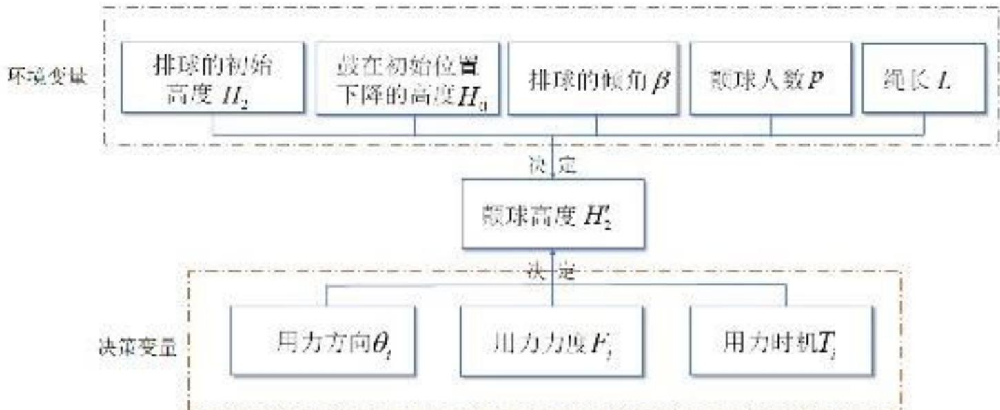  
图1 环境变量、决策变量及颠球结果

框图中颠球环境与决策变量共同影响颠球结果，故表征颠球结果是需要同时考虑以上所有变量。

## 5.1.2 问题一模型的建立

## 5.1.2.1 颠球环境变量与决策变量的组成

问题一考虑建立一个关于颠球高度的函数模型，下文给出模型中各变量的定义说明。

## (1)颠球环境变量

每个颠球周期所处的环境受到多种因素的影响，下面主要讨论颠球人数、绳长、鼓下落距离、排球最高高度、排球下落角度这5个量。在求解最优决策时需先确定它们的取值，它们会对最优决策的选择造成直接影响。

## ●颠球人数 p

问题一中颠球游戏参与的成员人数未知，基于问题本身，我们要求人数p应满足$p \ge 8$ ，并且沿着鼓周围均匀分布。

●绳长L和鼓在初始位置较绳子水平时下降的高度 $H _ { 0 }$

我们用L表示绳长， $H _ { 0 }$ 表示鼓的初始位置较绳子水平时下降的高度， $h _ { 1 }$ 表示拉力作用下鼓上升的高度。为方便后续表示，我们记绳子与水平面的夹角为 $\theta$

## ●排球最高高度 $H _ { 2 }$ 与排球倾角β

项目初始状态的排球高度固定为40cm，但后续颠球过程中，由于具体颠球环境与决策的变化导致排球上升的最高高度不再等于40cm。不同的排球高度直接影响受力分析时排球的机械能，这会对颠球决策造成直接影响。我们分别将排球的最高高度和排球的排球倾角记为 $H _ { 2 } , \beta$ a

为方便后续描述，我们以两个成员拉动鼓的受力分析为例，以鼓静止状态下的几何中心为原点建立二维直角坐标系。下图展现了所有环境变量在鼓运动的过程中的变化情况：

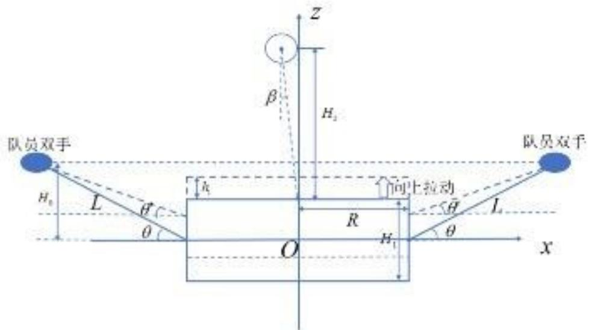  
图2 颠球环境变量与坐标系建立示意图

图中成员拉动绳子的过程中 $h _ { 1 } , \theta$ 在连续变化：若只考虑鼓面的上升过程，鼓的重心高度$h _ { \scriptscriptstyle 1 }$ 不断增大，绳子与水平面的夹角θ逐渐减小。

## (2)决策变量

在给定颠球环境中，每个队员可采取的决策主要体现在他们的用力方向、用力时机与力度上。不同的决策会直接影响最终颠球高度与颠球方向，因此我们引入三个决策变量，将协作策略进行量化。

## ●用力方向和用力力度 $\overrightarrow { F _ { i } } ( i = 1 , 2 , . . . , p )$

最优决策应满足易实现、执行效率高的特点。设计成员的用力方向时，要求每个成员的用力方向的水平分量所在的方向经过鼓的几何中心，此时相邻两个成员之间的夹角相同；设计成员的用力力度时，为提高执行效率，要求每个成员的用力力度相同。

## ●用力时机 $T _ { i } ( i = 1 , 2 , . . . , p )$

在排球下落的过程中，成员的发力时机影响鼓开始运动的时机，进而影响鼓面与排球碰撞时的状态。其中碰撞状态包括排球和鼓的动能与势能、碰撞的位置。为方便理解，我们用排球从最高位置下落经过的时间描述用力时机，记为 $T _ { i } ( i = 1 , 2 , . . . , p )$ 。其中为保证整体协调性，我们要求所有队员的用力实际一致。 \_

## 5.1.2.2 受力分析

问题不仅希望给出给定情况下团队的最优决策，还要我们给出最优决策导致的排球颠球高度。我们将球从最高点下落经鼓面反弹并到达最高点的过程记为一个颠球周期，后续讨论时主要分析排球在一个周期中的状态变化。

在受力分析的整个推导中，本轮的环境变量 $p , L , H _ { 0 } , H _ { 2 } , \beta$ 与决策变量 $F _ { i } , T _ { i }$ 共同影响下一轮的颠球高度 $H _ { 2 } ^ { ' }$ 。虽然无法直接得到显示的函数关系，但是我们希望得到一个颠球高度与这些变量的关系，表示为： $H _ { 2 } ^ { ' } ( p , L , H _ { 0 } , H _ { 2 } , \beta , F _ { i } , T _ { i } ) , ( i = 1 , 2 , . . . , p )$

## (1)球、鼓撞击前

本小节讨论的系统由鼓和球组成，撞击前排球与鼓都从静止开始运动，且它们之间的状态变化是相对独立的。

首先分析排球的运动情况：考虑到排球质量较小且迎风面积较大，此时排球受到重力、空气阻力的共同作用，重力作用竖直向下，阻力与运动方向相反，如下图4所示。

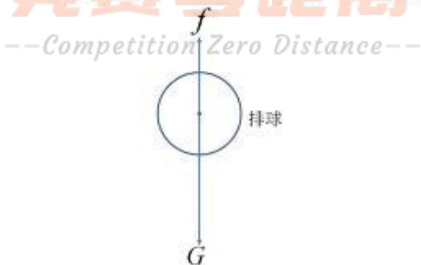  
图3 排球的受力分析

图3中，假设排球竖直下落，此时 $\beta { = } 0 ^ { \circ }$ 。根据文献[1]，我们得到描述空气阻力的经验公式：

$$
f = \frac { 1 } { 2 } c \rho S \nu ^ { 2 }\tag{1}
$$

其中， $c$ 指空气阻力系数，取为0.5， $\rho$ 指空气密度，一般取 $1 . 2 9 k g / m ^ { 3 }$ ，S指迎风面积，ν指物体相对于空气的速度。根据文献[3]，排球直径一般为20.7-21.3cm，因此

可确定迎风面积S，此时空气阻力与速度的平方成正比，我们把该比例系数定为k，空气阻力大小即 $f = k \nu ^ { 2 }$ .排球在下落过程中只受到重力和空气阻力。取向下为正方向，因此由牛顿第二定律可以得到：

$$
m g - k \nu ^ { 2 } = m a _ { \mathit { d o w n } }\tag{2}
$$

将上式简单移项得到排球下落过程的加速度，可得到如下的非线性微分方程：

$$
m g - k \left( { \frac { d x } { d t } } \right) ^ { 2 } = m { \frac { d ^ { 2 } x } { d t ^ { 2 } } }\tag{3}
$$

考虑初始位置 $x _ { 0 } = H _ { 2 }$ ，初始速度 $\frac { d x } { d t } = 0$ ，由文献[2]可得到其运动方程为：

$$
x ( t ) = \frac { m } { k } \ln c h { \sqrt { \frac { k g } { m } } } t + H _ { 2 }\tag{4}
$$

在分析鼓的运动情况时，我们将成员发出的力记为 $\overrightarrow { F } _ { i } ( i = 1 , 2 , . . . , p )$ ，把力分解为水平分力 $\overrightarrow { F _ { 1 i } }$ 与竖直分力 $\overrightarrow { F _ { 2 i } }$ ，将所有水平方向与所有竖直方向上的力合成得到 $F _ { 1 , a l l } , F _ { 2 , a l l } \circ$ 此时鼓的受力分解示意图如图4所示：

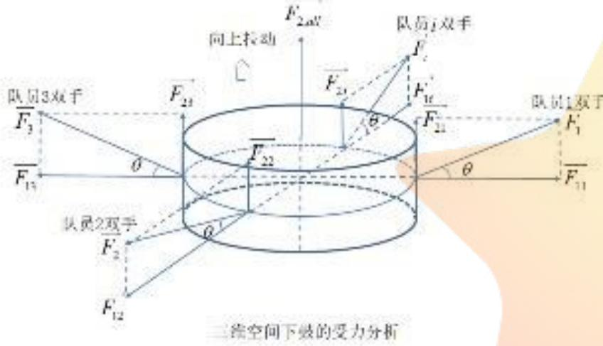

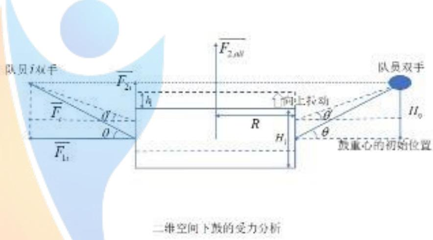  
(a) 三维空间下鼓的受力分析  
(b) 二维空间下鼓的受力分析  
图4 鼓的受力分析

其中， $H _ { \mathfrak { g } }$ 表初始状态鼓下降的高度， $h _ { \scriptscriptstyle 1 }$ 表运动过程中鼓上升的高度，因此绳与水平方向的夹角θ为 竞巷零距离

$$
\sin \theta \equiv \frac { H _ { 0 } - h _ { 1 } } { L }\tag{5}
$$

由于各个水平分力 $\overrightarrow { F _ { 1 i } }$ 的大小相同，相邻力的夹角大小一致，故在水平方向上合力满足 $\stackrel { \longrightarrow } { F _ { 1 , a l l } } = \stackrel { \sim } { 0 }$ ；又由于竖直分力 $\overrightarrow { F _ { 2 i } }$ 方向一致，大小相等。人数为 $p$ ，成员发力大小均为F情况下系统竖直方向上的合力满足

$$
\widehat { F _ { 2 , a l l } } = p \cdot \frac { ( H _ { 0 } - h _ { 1 } ) \widehat { F } } { L }\tag{6}
$$

描述鼓的运动方程时，假设发力全程成员的力度不变。由于鼓向上运动过程中发力方向与水平的夹角θ连续变化，故力在竖直方向上的分量也连续变化。用积分形式表示竖直分力对鼓做的功 $W _ { 1 }$ ，在这个过程中重力做功为 $W _ { z }$ 。由于鼓位移较小且质量较大，故不考虑运动过程中受到的空气阻力。由机械能守恒，最终小球获得的总动能 $E _ { k }$ 为：

$$
\begin{array} { l } { \displaystyle \left[ E _ { k } = W _ { 1 } + W _ { 2 } \right. } \\ { \displaystyle \left. W _ { 1 } = \int _ { 0 } ^ { h } p \cdot \frac { ( H _ { 0 } - x ) F } { L } d x \right. } \\ { \displaystyle \left. W _ { 2 } = - M g h _ { 1 } \right. } \\ { \displaystyle \left. E _ { k } = \frac { 1 } { 2 } m \nu ^ { 2 } \right. } \end{array}\tag{7}
$$

其中， $x$ 指球在竖直方向上的位置变量， $h _ { \scriptscriptstyle 1 }$ 指鼓的重心高度。最终我们确定 $\nu - h _ { \mathrm { 1 } }$ 函数关系如下：

$$
\nu = \sqrt { \frac { 2 p F H _ { 0 } h _ { 1 } } { M L } - \frac { p F h _ { 1 } ^ { 2 } } { M L } - 2 g h _ { 1 } }\tag{8}
$$

在竖直方向上的合力为 $F _ { 2 , a l l } - M g$ ，其为鼓提供加速度 $^ { a }$

$$
a = p \cdot \frac { ( H _ { \circ } - x ) F } { M L } - g\tag{9}
$$

同时可整理得到关于鼓在竖直方向上的位置变量x的微分方程：

$$
\frac { d ^ { 2 } x } { d t ^ { 2 } } + \frac { p F } { M L } x = \frac { p H _ { 0 } F } { M L } - g\tag{10}
$$

初始位置 $x _ { \mathrm { 0 } } = 0$ 和初始速度 $\frac { d x } { d t } = 0$ ，求解可得到

$$
x ( t ) = ( \frac { g M L } { P F } - H _ { \circ } ) \cdot \cos { \sqrt { \frac { P F } { M L } } } t + H _ { \circ } - \frac { g M L } { P F }\tag{11}
$$

上式为式(10)二阶微分方程求解结果，用于描述鼓位置随时间的变化关系,且为标准的简谐振动形式，说明鼓受恒力作用时会以简谐振动形式在空间中周期运动。下面讨论鼓的运动时主要讨论该运动方程中前半个上升周期。

## (2)球、鼓撞击时

在碰撞时，鼓的速度为 $\nu _ { 1 }$ ，满足式(8)；排球的速度为 $\nu _ { 2 }$ ，满足式(3)。我们利用动量守恒与能量守恒描述排球与鼓面发生完全弹性碰撞的过程：

$$
\left\{ \begin{array} { l l } { \displaystyle \vec { z } \mathcal { Y } \mathcal { \boxed { H } } \vec { \in } \dot { \vec { \nabla } } ^ { * } \mathcal { H } : \frac { 1 } { 2 } M \nu _ { 1 } ^ { 2 } + \frac { 1 } { 2 } m \nu _ { 2 } ^ { 2 } = \frac { 1 } { 2 } M \nu _ { 1 } ^ { \prime 2 } + \frac { 1 } { 2 } m \nu _ { 2 } ^ { \prime 2 } } \\ { \displaystyle \vec { z } \mathcal { Y } \mathcal { \boxed { H } } \frac { \vec { \nabla } \vec { \xi } } { \mathrm { E q } } \dot { \vec { \nabla } } ^ { * } \mathcal { H } : M \nu _ { 1 } + m \nu _ { 2 } = M \nu _ { 1 } ^ { \prime } + m \nu _ { 2 } ^ { \prime } } \end{array} \right.\tag{12}
$$

其中， $\nu _ { 1 } , \nu _ { 2 }$ 表示碰撞前鼓和排球的速度， $\nu _ { 1 } ^ { \prime } \ , \nu _ { 2 } ^ { \prime }$ 表示碰撞后鼓和排球的速度。求解得到：

$$
\left\{ \begin{array} { l l } { \displaystyle \nu _ { 1 } ^ { \prime } = \frac { ( M - m ) \nu _ { 1 } + 2 m \nu _ { 2 } } { M + m } } \\ { \displaystyle \nu _ { 2 } ^ { \prime } = \frac { ( m - M ) \nu _ { 2 } + 2 M \nu _ { 1 } } { M + m } } \end{array} \right.\tag{13}
$$

## (3)球、鼓撞击后

碰撞之后，排球以 $\nu _ { 2 } ^ { \prime }$ 的速度垂直向上运动，此时排球只受到空气阻力与重力的影响，方向均向下。排球的加速度为

$$
a _ { _ { u p } } = g + { \frac { k \nu ^ { 2 } } { m } }\tag{14}
$$

可将上式转化为微分方程形式：

$$
m { \frac { d ^ { 2 } x } { d t ^ { 2 } } } = m g + k \left( { \frac { d x } { d t } } \right) ^ { 2 }\tag{15}
$$

该二阶微分方程描述了排球速度、加速度与位置的变化关系。可利用式(13)的初始速度 $\nu _ { 1 } ^ { \prime }$ 和初始位置 $x _ { 0 } = h _ { 2 }$ 求解此二阶微分方程的解析解，形式如式(4)。

## 5.1.2.3 最优决策的目标函数

颠球决策由颠球力度、方向、时机组成，不同的颠球决策将产生不同的颠球高度与颠球周期长度。同心鼓项目要求颠球高度大于40cm，且项目目标为颠球数量最大化。结合同心鼓项目规则，我们将最优策略定义为实现简单、颠球数量尽可能多且不违反规则的决策方案。我们将最优策略的实现简单的目标函数理解为所有队员用的合力最小：

$$
\operatorname* { m i n } \sum _ { i = 1 } ^ { p } F _ { i }\tag{16}
$$

## 5.1.2.4 最优决策的约束条件

根据上文建立的各阶段运动方程能计算出最终颠球高度与队员分布情况，我们要求给定的一组决策策略要满足以下约束条件才能称作一个最优决策：

## ●颠球高度要求

题述要求每次决策后颠球高度离开鼓面0.4m以上，结合鼓的几何结构得到如下约束：

$$
H _ { 2 } ^ { \prime } - \frac { H _ { 1 } } { 2 } \geq 0 . 4\tag{17}
$$

其中 $H _ { 1 }$ 为鼓身高度，由于坐标原点建在鼓的几何中心，故 $\frac { H _ { 1 } } { 2 }$ 为鼓面高度。 $H _ { 2 } ^ { \prime }$ 为排球重心达到的最高点，我们已在5.1.2.2节受力分析中给出了其分析计算过程， $H _ { _ 2 } - \frac { H _ { 1 } } { 2 }$ 是球离开鼓面的最大距离。

## ●队员发力要求

每个队员发力主要包括发力方向、力度、时机三个方面。为使得鼓面保持水平，避免发生水平移动和倾斜，我们有如下约束：

我们记 $T _ { i } ( i = 1 , 2 , . . . , p )$ 为各队员的用力时机，要求所有队员同时发力，故有用力时机约束： 竞费零跑离

$$
T _ { i } = T _ { j } ( \forall i , j = 1 , 2 , . . . , p )\tag{18}
$$

同理，要求所有队员的用力大小相同：

$$
\left| \overrightarrow { F _ { i } } \right| = \left| \overrightarrow { F _ { j } } \right| ( \forall i , j = 1 , 2 , . . . , p )\tag{19}
$$

另外，发力时我们假设所有队员的手的高度一致，因此相同时刻所有队员的绳子与水平方向的夹角 $\theta _ { i } ( i = 1 , 2 , . . . , p )$ 要相同：

$$
\theta _ { i } = \theta _ { , } ( \forall i , j = 1 , 2 , . . . , p )\tag{20}
$$

## ●队员间最小距离要求

根据题述，相邻队员间的间距不得小于0.6m，队员间的距离主要受到鼓较绳水平面的距离和绳长两个变量共同影响。因此根据几何结构我们有如下约束：

下图(a)为同心鼓项目的俯视图，p个队员均匀分布，则两队员的夹角为 $\alpha = 3 6 0 \%$ 。图(b)为同心鼓项目的侧视图，其中θ为绳子与水平面的夹角，由几何结构推出绳长在水平方向上的投影为Lcosθ。为计算队员1和队员 $p$ 间的距离D，可借助等腰三角形AOB

的特性， $\angle A O G = 1 / 2 \angle A O B$ 。由直角三角形AOG，最终推出距离满足：

$$
D = 2 ( R + L \cos \theta ) \cdot \sin { \frac { \alpha } { 2 } } \geq 0 . 6\tag{21}
$$

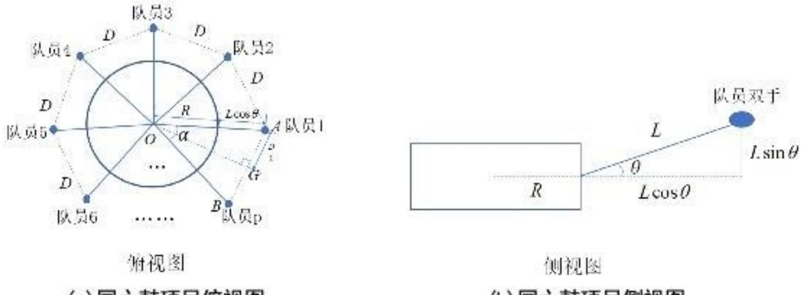  
(a)同心鼓项目俯视图  
图5 队员间距计算示意图  
(b) 同心鼓项目侧视图

## 5.1.2.5 最优决策的优化模型的确定

综上所述，我们可以得到最佳协作策略的优化模型：

$$
\operatorname* { m i n } \sum _ { i = 1 } ^ { p } F _ { i }
$$

颠球高度约束： $H _ { 2 } ^ { \prime } - \frac { H _ { 1 } } { 2 } \geq 0 . 4$

发力时机约束： $T _ { i } = T _ { , } ( \forall i , j = 1 , 2 , . . . , p )$

(22)

发力力度约束 $\left| \overrightarrow { F } _ { i } \right| = \left| \overrightarrow { F } _ { j } \right| ( \forall i , j = 1 , 2 , . . . , p )$

发力方向约束： $\theta _ { i } = \theta _ { , } ( \forall i , j = 1 , 2 , . . . , p )$

队员间距约束 $: D = 2 ( R + L \cos \theta ) \cdot \sin \frac { \alpha } { 2 } \geq 0 . 6$

上式中， $H _ { 2 } ^ { ' }$ 表示本轮排球的颠球高度，上文受力分析过程主要讨论 $H _ { 2 } ^ { ' }$ 的求解，它受变量 $p , L , H _ { 0 } , H _ { 2 } , \beta , F _ { i } , T _ { i }$ 共同影响，可表示为 $H _ { 2 } ^ { ' } ( p , L , H _ { 0 } , H _ { 2 } , \beta , F _ { i } , T _ { i } ) , ( i = 1 , 2 , . . . , p )$ 。

## 5.1.3 问题一模型的求解

求解部分，我们首先根据受力分析推导得到的运动方程设计算法还原整个碰撞过程，其中由于考虑空气阻力影响导致排球的运动方程无法得到解析解，故还原时主要依赖数值解法。为找到用力最省且颠球数量最多的最优策略，我们规定全体力度一致，发力时机一致且方向均垂直于鼓身在受力点处的切线。在这些规定中遍历用力时机与用力大小，最终找到用力最小的方案，并求出对应的颠球高度。

## 5.1.3.1 碰撞过程重现算法主要步骤

Step1：设置初始值。首先为所有环境变量 $p , L , H _ { 0 } , H _ { 2 } , \beta$ 设置合适初始值，并为需要搜优的两个参数设置初始值：全体力度 $F _ { \mathrm { 0 } } = 9 0 N$ ，全体反应时机 ${ \cal T } _ { 0 } { } ^ { } = 0 s$ ，最后初始化整个系统的时间 $t _ { 0 } = 0 s$ …

Step2：计算碰撞前鼓、排球状态。在已知系统时间t、反应时机 $t _ { i }$ $T _ { i }$ 的情况下，根据式(12)(13)计算鼓运动速度的解析解。并根据排球的初始位置 $x _ { 0 } = H _ { 2 }$ ，初始速度 $d x / d t = 0$ 由式(15)计算各时刻排球的位置、速度信息；

Step3：寻找碰撞位置。根据Step2得到的排球与鼓的时空信息，在鼓身长0.22m、球半径[2] $r = 0 . 1 0 5 m$ 情况下，求解两物体相互接触的时刻与位置，得到球与鼓的碰撞位置；

Step4：计算碰撞后排球状态。找到碰撞位置后由 $S t e p 2$ 中提到的运动方程可求出鼓和排球碰撞前的速度 $\nu _ { \mathrm { { i } } }$ 、v，若将它们的碰撞视为完全弹性碰撞，由能量守恒、动量守恒 $\nu _ { 2 }$ 可求出碰撞后速度 $\nu _ { 2 } ^ { ' }$ 。然后用式(15)，根据初始的位置、速度信息求得碰撞后排球速度、位置的数值解，取速度最接近0的时刻对应的位置为策略的颠球高度；

Step5：遍历力度、发力时机。判断当前决策是否可行，若可行说明力还可以继续减少，以 $F _ { _ { i + 1 } } \gets F _ { _ { i } } { + } \Delta F$ 更新全体力度，同时将发力时机置为 $0 s$ 并回到 $S t e p 2$ 模拟撞击过程；若当前决策不可行，判断发力时机 $T _ { i }$ 是否超过上限，若没有则说明遍历未方程，更新发力时机 ${ \cal T } _ { i + 1 } \gets { \cal T } _ { i } + \Delta { \cal T }$ 并回到 $S t e p _ { 4 } ^ { \prime }$ 2继续求解，若 $T _ { i }$ 超过上限说明搜索完毕，进入Step6;

Step6：寻找最小力度，确定最优决策方案。找到决策的最小力度为 $F _ { \mathrm { m i n } } = F _ { i } + \Delta F$ 按最小力度重复多轮模拟颠球过程，设遍历反应时机 $T _ { i }$ 初值 ${ \cal T } _ { i } { = } 0 s$ 。记录所有满足约束条件的方案，这些方案都是最优方案。

## 5.1.3.2 模型结果展示

已知颠球高度由环境变量、决策变量共同影响，可表示 $H _ { 2 } ^ { ' } = f ( p , L , H _ { 0 } , H _ { 2 } , \beta , F _ { i } , T _ { i } )$ 其中 $i { = } 1 , 2 , . . . , p$ 。求解时给定一组环境变量： $( p , L , H _ { \mathrm { o } } , H _ { \mathrm { z } } , \beta ) { = } ( 8 , 1 . 7 , 0 . 1 1 , 0 . 4 , 0 ^ { \circ } )$ 。我们利用上述还原算法求解始终不违反规则且用力最小的决策方案，并按固定的决策方案持续颠球。从结果中了解到按相同方案颠球能在一定轮数后使颠球高度逐渐稳定，更容易控制。利用网格遍历求得最优的决策方案的范围如下：

表1 最优决策表
<table><tr><td rowspan=1 colspan=1>策略内容</td><td rowspan=1 colspan=1>发力方向</td><td rowspan=1 colspan=1>发力力度</td><td rowspan=1 colspan=1>发力时机</td></tr><tr><td rowspan=1 colspan=1>具体方案</td><td rowspan=1 colspan=1>始终与鼓身在绳子连接处的切线垂直</td><td rowspan=1 colspan=1>全体队员发力过程中施加 $F = 8 1 N$ 的恒力</td><td rowspan=1 colspan=1> $T _ { i } \in [ 0 . 0 5 , 0 . 1 1 ] ( s )$ </td></tr></table>

最终得到最省力的击球方案需要全队施加81N的力，发力时机控制在[0.05,0.11](s)范围内。利用上述决策，迭代求解一定轮数，绘制颠球轮数与颠球高度之间的关系：

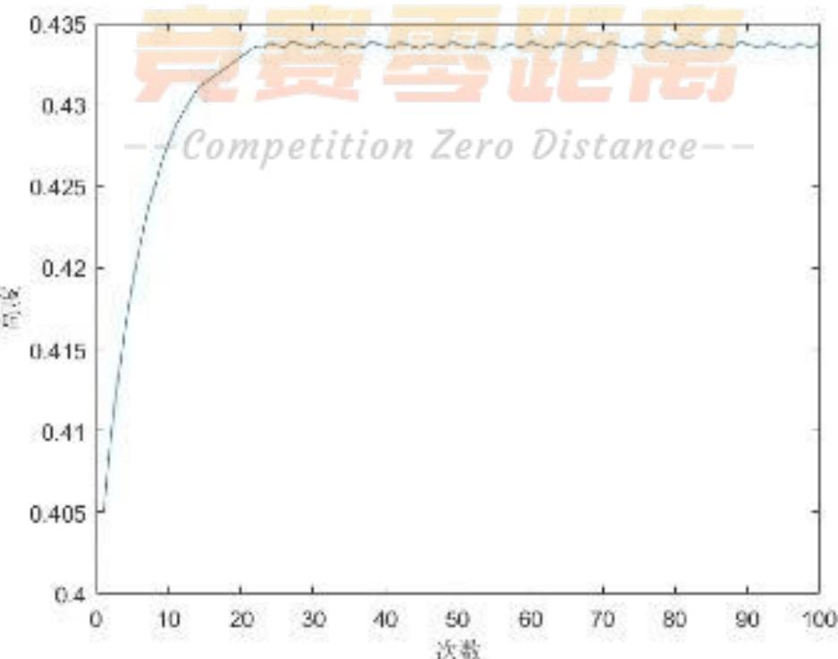  
图6 颠球轮数与颠球高度关系图

结果分析：

从上图中看出若按相同的决策持续颠球，颠球高度会随轮数逐渐趋 $\textstyle H _ { 2 } = 0 . 4 3 4 m$ 。从结果可以看出，我们搜索得到的最优决策不仅能保证用力最小，还能在一定轮数后使颠球高度逐渐稳定，更容易控制。说明模型能得到一个比较合理的结果。

不同的方案稳定后的颠球高度不同，可见下表(完整见问题一附件):

表1 最优方案的颠球高度
<table><tr><td rowspan=1 colspan=1>方案序号</td><td rowspan=1 colspan=1>发力力度/N</td><td rowspan=1 colspan=1>发力时机/s</td><td rowspan=1 colspan=1>稳定后的颠球高度/m</td></tr><tr><td rowspan=1 colspan=1>1</td><td rowspan=1 colspan=1>81</td><td rowspan=1 colspan=1>0.05</td><td rowspan=1 colspan=1>0.4024</td></tr><tr><td rowspan=1 colspan=1>2</td><td rowspan=1 colspan=1>81</td><td rowspan=1 colspan=1>0.06</td><td rowspan=1 colspan=1>0.4040</td></tr><tr><td rowspan=1 colspan=1>3</td><td rowspan=1 colspan=1>81</td><td rowspan=1 colspan=1>0.07</td><td rowspan=1 colspan=1>0.4049</td></tr><tr><td rowspan=1 colspan=1>:</td><td rowspan=1 colspan=1></td><td rowspan=1 colspan=1></td><td rowspan=1 colspan=1>:</td></tr><tr><td rowspan=1 colspan=1>7</td><td rowspan=1 colspan=1>81</td><td rowspan=1 colspan=1>0.11</td><td rowspan=1 colspan=1>0.4213</td></tr></table>

## 5.2 问题二模型的建立与求解

## 5.2.1 问题二的分析

问题二中因各成员发力时机、发力大小不同，鼓面会发生一定倾斜，现要求我们建立合适的模型表征队员发力时机与发力力度与特定时刻鼓面倾斜角度之间关系的模型。我们得知每过一个单位时间，鼓的状态变量都会发生变化，故利用时间离散化处理表示鼓的动态运动过程，以鼓面法向量与竖直方向的夹角描述鼓面倾斜程度。具体研究时将鼓面运动分为平动与转动。在某个阶段中，研究平动时，将力分解为水平、竖直两个方向上的分力，根据动力学方程我们能确定单位时间内鼓高度和速度的改变量 $\Delta h _ { 1 } , \Delta \nu _ { 1 }$ ，并更新 $h _ { 1 } , \nu _ { 1 }$ ，位置 $P _ { i } , Q _ { i }$ ；研究转动时，用鼓面法向量 $\overset {  } { n }$ 较竖直方向的夹角 $\omega$ 衡量鼓面倾角。分析绳子拉力的力矩对鼓面法向量的影响，由合力矩 $\widehat { M _ { a l l } }$ 与鼓的转动惯量I求解单位时间内鼓面的偏转角度 $\omega$ 。并用四元数法[4]，求解法向量 $\vec { n }$ 偏转 $\omega$ 后的状态变化 $\Delta \stackrel {  } { n }$ 结合转动与平动，我们由结合空间解析几何[6]，能推出系统中各个关键点 $Q _ { i } , P _ { i }$ 的改变量，更新 $P _ { i } , Q _ { i } , \stackrel {  } { n _ { i } }$ ，然后进入下一阶段的研究分析。

问题二中我们主要用鼓的上升高度 $h _ { \scriptscriptstyle 1 }$ ，鼓的运动速度v，鼓面法向量 $\vec { n }$ ，绳与鼓的 $p$ 个接触点 $Q _ { i }$ ，p个施力点 $p$ $P _ { i }$ 共 $2 p + 3$ 个变量描述鼓的运动状态。下图为一个单位时间内鼓面倾角求解模型的模型框图：

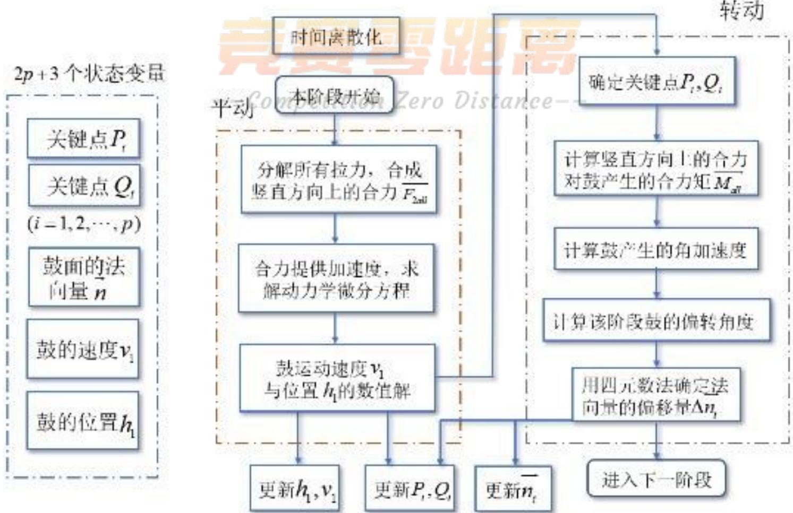  
图7 问题二模型框图

## 5.2.2 问题二模型的建立

## 5.2.2.1 坐标系的建立

为方便讨论，问题二中受力分析时将鼓视为空心圆柱体，我们以鼓面中心为原点建立自然坐标系，具体如下图所示。在后续研究过程中坐标系随鼓面的变化而变化。记鼓面法向量为 $n ( a , b , c )$ ，用来衡量鼓面的倾角。记p个队员的手位置为$P _ { i } ( P _ { x i } , P _ { y i } , P _ { z i } ) , i = 1 , 2 , . . . , p$ ，记绳子与圆柱的接触点坐标为 $\mathscr { Q } _ { i } ( \boldsymbol { Q } _ { x i } , \boldsymbol { Q } _ { y i } , \boldsymbol { Q } _ { z i } )$ 0

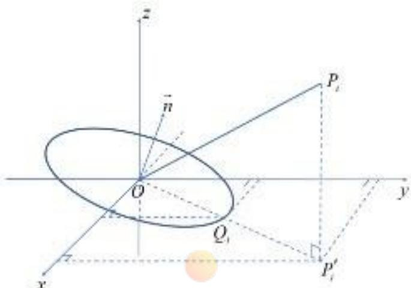  
图8 自然坐标系的建立

## 5.2.2.2 受力分析

我们将鼓的受力分为转动与平动两个过程，在上文建立的自然坐标系中分别分析这两个过程。受力分析的目的是推导本阶段结束鼓面倾角 $\beta ^ { ' }$ 关于本阶段变量之间的关系，由于无法得显示的函数形式，将其表示为： $\beta ^ { \prime } ( p , L , H _ { 0 } , H _ { 2 } , \beta , F _ { i } , T _ { i } ) , ( i = 1 , 2 , . . . , p )$ $\beta ^ { \prime }$ 受到环境变量 $p , L , H _ { 0 } , H _ { 2 } , \beta$ 与决策变量 $F _ { i } , T _ { i }$ 共同作用。

## (1)平动过程

对于运动中的鼓，研究平动时将鼓视为一个质点，所有作用力都作用于质点。我们记每个作用力与水平面的夹角为 $\theta _ { i }$ ，记队员发力为 ${ \overrightarrow { F } } _ { i } , ( i = 1 , 2 , . . . , p )$ 。

以其中一个力 $\overrightarrow { F _ { i } }$ 为例，我们将其分解，并记竖直分力为 $F _ { z i }$ 。结合图中已知量我们将分力 $\overrightarrow { F _ { z } }$ 表示为： 此花

$$
\stackrel {  } { F _ { z i } } = \stackrel { \longrightarrow } { F _ { i } } \frac { P _ { z i } ^ {  } } { \sqrt { P _ { x i } ^ { 2 } + P _ { y i } ^ { 2 } + P _ { z i } ^ { 2 } } } , ( i = 1 , 2 , . . . , p )\tag{23}
$$

式中 $( P _ { x i } , P _ { y i } , P _ { z i } )$ 分别表示 $P _ { i }$ 点在空间直角坐标系中的坐标。另外图中用力方向与水平方向的夹角 $\theta _ { i }$ 满足 $\sin \theta _ { i } = \frac { P _ { z i } } { \sqrt { P _ { x i } ^ { 2 } + P _ { y i } ^ { 2 } + P _ { z i } ^ { 2 } } }$ 。将所有作用力的竖直分力 $\overrightarrow { F _ { z i } }$ 合成为合力 $\overrightarrow { F _ { z } }$ 后便于鼓状态的描述，其中 $\overrightarrow { F } _ { z }$ 可表示为：

$$
\overrightarrow { F _ { z } } = \sum _ { i = 1 } ^ { p } \overrightarrow { F _ { z i } }\tag{24}
$$

受到合力 $\overrightarrow { F _ { z } }$ 的影响，鼓向上运动的加速度为：

$$
\overline { { a _ { u p } } } = \frac { \overline { { F _ { z } } } } { M } - g\tag{25}
$$

在实际计算过程中，主要利用时间离散化的方式表示鼓的运动状态，我们假设鼓在一个

单位时间内做匀加速运动，鼓的位置h、速度ν随时间t的变化关系如下：

$$
h = h _ { \mathrm { 0 } } + \nu _ { \mathrm { 0 } } \cdot d t + \frac { 1 } { 2 } a \cdot d t ^ { 2 }\tag{26}
$$

$$
\nu = \nu _ { \mathrm { 0 } } + a \cdot d t\tag{27}
$$

其中 $h _ { \scriptscriptstyle 0 }$ $\nu _ { \mathrm { 0 } }$ 为上一阶段鼓的位置信息和速度信息，h,ν分别表示经过dt时间后在新阶段物体的位置信息与速度信息。

## (2)转动过程

结合力学与理论力学[7],转动分析时主要考虑外力对鼓中心产生的力矩大小。主要思路是先表示出运动过程中 $P _ { i } ( P _ { x i } , P _ { y i } , P _ { z i } ) , Q _ { i } ( Q _ { x i } , Q _ { y i } , Q _ { z i } )$ 的变化情况，由向量坐标求出队员i对鼓面施力产生的力矩 $\widehat { M _ { i } }$ ，将所有力矩做合成后得到总力矩 $\overrightarrow { M }$ 。然后将时间离散化，以四元数法分析法向量的偏转情况。其中 $i = 1 , 2 , . . . , p$ 。下面我们给出具体的建模过程：

Step1：求解关键点坐标

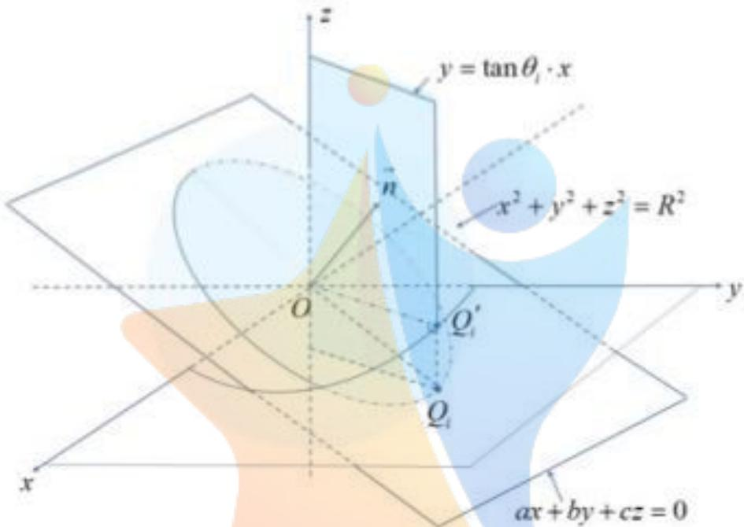  
图9 Q 点所在的3个面

如上图9所示，求解绳在鼓面上的作用点 $\mathcal { Q } _ { i } ( Q _ { x i } , Q _ { y i } , Q _ { z i } )$ 时，自然坐标系中 $Q _ { i }$ 始终位于鼓的边缘上。鼓的边缘线方程可视为鼓面与半径为R的球面的交线； $Q _ { i }$ 点在鼓的边缘上均匀分布，射线 $O Q$ 与x轴正方向的夹角为 $\theta _ { i }$ ,故 $Q _ { i }$ 点位于柱面 $y = \tan ( \theta _ { i } ) x$ 上，满足：

$$
\left\{ \begin{array} { l l } { { \mathbb { E } } { \mathbb { A } } { \overline { { [ { \mathrm { H } } ] } } } : ~ x ^ { 2 } + y ^ { 2 } + z ^ { 2 } = R ^ { 2 } } \\ { { \mathbb { E } } { \mathbb { A } } { \overline { { [ { \mathrm { H } } ] } } } : ~ a x + b y + c z = 0 } \\ { { \mathbb { H } } { \mathbb { H } } : ~ y = \tan ( \theta _ { i } ) x } \end{array} \right.\tag{28}
$$

其中，平面 $x ^ { 2 } + y ^ { 2 } + z ^ { 2 } = R ^ { 2 }$ 表示半径为R的球面，且球心为原点O(0,0,0)；平面$a x + b y + c z = 0$ 表示经过原点O(0,0,0)且法向量为 $\vec { n } ( a , b , c )$ 的平面。

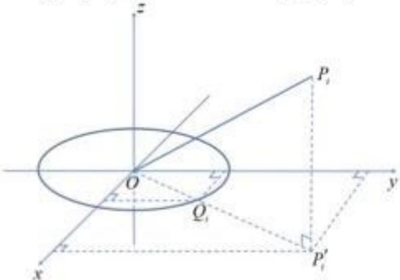  
图10 $O P _ { i } P _ { i } ^ { \prime }$ 截面示意图

另外，我们在求解发力点位置 $P _ { i } ( P _ { x i } , P _ { y i } , P _ { z i } )$ 坐标时，如图10所示，因为 $P _ { i }$ 点在 $x O y$ 面上的投影在射线 $O Q _ { i }$ 上，故可用直线 $O P _ { i } ^ { ' }$ 长度推导 $P _ { i } ^ { ' }$ 点坐标。首先已知 $O Q$ 长度为：

$$
O Q _ { i } { = } \sqrt { { Q _ { x i } } ^ { 2 } + { Q _ { y i } } ^ { 2 } }\tag{29}
$$

对三角形 $Q _ { i } P _ { i } P _ { i } ^ { ' }$ ，已知 $P _ { i } P _ { i } ^ { \prime } = H _ { 0 } - 1 / 2 H _ { 1 } , P _ { i } Q _ { i } = L$ ，勾股定理得 $Q P _ { i } ^ { \prime } = \sqrt { L ^ { 2 } - ( H _ { \circ } - 1 / 2 H _ { 1 } ) ^ { 2 } }$ 可得到 $O P _ { i } ^ { ' }$ 长度：

$$
O P _ { i } ^ { ' = } \sqrt { { { Q _ { x i } } ^ { 2 } } + { { Q _ { y i } } ^ { 2 } } } + \sqrt { L ^ { 2 } - ( H _ { 0 } - 1 / 2 H _ { 1 } ) ^ { 2 } }\tag{30}
$$

又因为 $\mathscr { Q } _ { i } ( \boldsymbol { Q } _ { x i } , \boldsymbol { Q } _ { y i } , \boldsymbol { Q } _ { z i } )$ 与 $P _ { i } ( P _ { x i } , P _ { y i } , P _ { z i } )$ 存在如下比例关系：

$$
\frac { O Q _ { i } } { O P _ { i } ^ { ' } } = \frac { Q _ { x i } } { P _ { x i } } = \frac { Q _ { y i } } { P _ { y i } }\tag{31}
$$

我们最终将 $P _ { i } ( P _ { x i } , P _ { y i } , P _ { z i } )$ 表示为：

$$
\left\{ \begin{array} { l l } { P _ { x } = \frac { \sqrt { L ^ { 2 } - { ( H _ { 0 } - 1 / 2 H _ { 1 } ) } ^ { 2 } } + \sqrt { Q _ { x } ^ { ~ 2 } + Q _ { y } ^ { ~ 2 } } } { \sqrt { Q _ { x } ^ { ~ 2 } + Q _ { y } ^ { ~ 2 } } } \cdot Q _ { x i } } \\ { P _ { y } = \frac { \sqrt { L ^ { 2 } - { ( H _ { 0 } - 1 / 2 H _ { 1 } ) } ^ { 2 } } + \sqrt { Q _ { x i } ^ { ~ 2 } + Q _ { y i } ^ { ~ 2 } } } { \sqrt { Q _ { x i } ^ { ~ 2 } + Q _ { y i } ^ { ~ 2 } } } \cdot Q _ { y } } & { , i = 1 , 2 , \dots , p } \\ { P _ { z i } = H _ { 0 } - 1 / 2 H _ { 1 } } \end{array} \right.\tag{32}
$$

Step2：分析队员施力产生的力矩

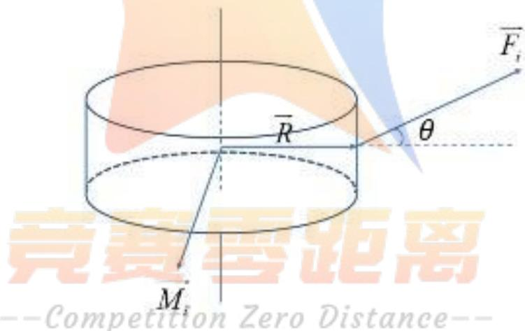  
图11 单个力对圆柱产生的力矩

分析队员施力对鼓面产生的力矩时，我们以单个队员的作用为例，如具体受力分析如上图11所示。图中我们将鼓视为一个空心圆柱体，其受到一个大小为 $F _ { i }$ 的力，力与水平面的夹角为 $\theta _ { i } ( i = 1 , 2 , . . . , p )$ 。

计算力矩 $\overrightarrow { M _ { i } }$ 时，上文求出 $P _ { i } ( P _ { x i } , P _ { y i } , P _ { z i } ) , Q _ { i } ( Q _ { x i } , Q _ { y i } , Q _ { z i } )$ 坐标后，由力矩定义式可得：

$$
\overline { { M _ { i } } } = \overline { { O Q _ { i } } } \times \overline { { Q _ { i } P _ { i } } }\tag{33}
$$

上式中×符号表示叉积。由向量分解可得 $\scriptstyle { \overrightarrow { P _ { i } Q _ { i } } } = O Q _ { i } - O P _ { i }$ ，则力矩 $\widehat { M _ { i } }$ 可表示为

$$
\overrightarrow { M _ { i } } = \overrightarrow { Q _ { i } O } \times \overrightarrow { O Q _ { i } } - \overrightarrow { Q _ { i } O } \times \overrightarrow { O P } M _ { i } = - \overrightarrow { Q _ { i } O } \times \overrightarrow { O P _ { i } }\tag{34}
$$

其中 $P _ { i } ( P _ { x i } , P _ { y i } , P _ { z i } ) , Q _ { i } ( Q _ { x i } , Q _ { y i } , Q _ { z i } )$ 坐标已知，故可求出 $M _ { i }$

Step3：力矩合成及产生的角加速度

在Step2中我们分析了单个作用力对鼓面的力矩影响，在实际系统中共有p个大小不同的作用力，它们的作用点鼓面中心，且作用点在鼓面边缘上均匀分布。由于作用力大小、作用点不同，它们对圆柱的力矩方向、大小都不相同。故我们考虑将8个力矩$M _ { i } ( i = 1 , 2 , . . . , p )$ 合成为对圆柱的合力矩 $M _ { \alpha l l }$ 。另外，考虑到鼓面转动是一个动态的过程，经过时间离散化后上个阶段的状态会对本阶段造成影响。查阅文献[6]，动态分析物体旋转时，物体除受当前时刻合力产生的力矩外，正在旋转的物体还具有回转力矩。因此我们还考虑到上个阶段产生的力矩对本阶段的影响，故最终本阶段的合力矩可表示为：

$$
\overline { { { M _ { a l l } } } } = \sum _ { i = 1 } ^ { p } \overline { { { M _ { i } } } } + \overline { { { M _ { a l l } } } } ^ { \prime }\tag{35}
$$

式中 $\sum _ { i = 1 } ^ { p } \widehat { M _ { i } }$ 表示本阶段 $p$ 个队员产生的力矩的矢量和， $\overline { { { { \cal M } _ { a l l } } } } ^ { \prime }$ 表示上个阶段的总力矩。

我们将鼓视为空心圆柱体，根据 $\widehat { M _ { a l l } } = \stackrel {  } { \alpha } \cdot I , I = \frac { M R ^ { 2 } } { 2 } + \frac { M H _ { 0 } ^ { 2 } } { 1 2 }$ 可计算得单位时间内物体产生的角加速度为

$$
\overrightarrow { \alpha } { = } ( \sum _ { i = 1 } ^ { p } \overrightarrow { M _ { i } } { + } \overrightarrow { M _ { a l l } } ^ { \prime } ) \Bigg / ( \frac { M R ^ { 2 } } { 2 } { + } \frac { M H _ { 0 } ^ { 2 } } { 1 2 } )\tag{36}
$$

其中M指物体的质量，R指鼓面半径。假设在单位时间内鼓呈匀加速运动，进一步可推出角度偏转量 $d \omega$ .

$$
d \omega = \frac { 1 } { 2 } \overline { { \alpha } } \cdot ( d t ) ^ { 2 }\tag{37}
$$

## Step4:四元数法求解法向量偏转

空间坐标系中，本阶段的鼓平面法向量为 $n$ ，由Step3我们了解到dt时间内圆盘法向量 $\overset {  } { n }$ 绕力矩方向发生的偏转为 $d \omega$ 。dω的影响主要体现在法向量 $\vec { n }$ 上。

我们采用四元数法[4]描述法向量从本阶段 $\vec { n }$ 变化到下一阶段的 $\vec { n ^ { \prime } }$ 。四元数法的数学概念可用于解决向量绕任意轴旋转角度ω后新的向量位置的问题。四元数n包括实部与虚部，虚部为一个三维向量，形式如下： 1

$$
\hat { n } = ( n _ { \mathrm { } _ { w } } , n _ { \mathrm { v } } ) = n _ { \mathrm { } _ { w } } + ( i n _ { \mathrm { } _ { x } } + j n _ { \mathrm { } _ { y } } + k n _ { z } )\tag{38}
$$

我们利用四元数来构造一个变换过程，处理鼓面的法向量 $\vec { n }$ 绕着合力矩 $\widehat { M _ { a l l } }$ 旋转一个角度ω的情形 音寒熏贴离

(1)我们利用合力矩 $M _ { a l l } ( M _ { a l l x } , M _ { a l l y } , M _ { a l l z } )$ 和旋转角 $\omega$ 构造一个合力矩的四元数 $\hat { M } _ { a l l }$

$$
\hat { M } _ { a l l } = \cos \frac { \omega } { 2 } + i \sin \frac { \omega } { 2 } \cdot M _ { a l l x } + j \sin \frac { \omega } { 2 } \cdot M _ { a l l y } + k \sin \frac { \omega } { 2 } \cdot M _ { a l l z }\tag{39}
$$

(2)求出四元数 $\hat { M } _ { a l l }$ 的逆

$$
\hat { M } _ { a l l } ^ { - 1 } { = } \hat { M } _ { a l l } ^ { \phantom { \dagger } } \cdot \hat { M } _ { a l l } ^ { \phantom { \dagger } } .\tag{40}
$$

(3) 我们将鼓面的法向量 $\vec { n }$ 转化为四元数n，有

$$
\hat { n } { = } 0 { + } i n _ { x } + j n _ { y } + k n _ { z }\tag{41}
$$

(4)最后利用四元数乘积变换得到旋转后鼓面法向量 $\vec { n ^ { \prime } }$ 所对应的四元数 $\hat { n } ^ { \prime }$ ，且有

$$
\hat { n } ^ { \prime } { = } \hat { M } _ { a l l } \cdot \hat { n } \cdot \hat { M } _ { a l l } { } ^ { - 1 }\tag{42}
$$

四元数 $\hat { n } ^ { \prime }$ 的虚部的三个分量即为旋转变换后鼓面的法向量 $\vec { n ^ { \prime } }$ 对应的各坐标分量。

## 5.2.2 问题二模型的求解

问题二的模型中，我们将时间离散化，并将鼓的运动分为平动、转动两个过程。并分别用鼓重心的高度 $h _ { \mathrm { t } }$ ，速度ν，偏转角度 $\omega$ 三个变量描述鼓的运动状态。研究每经过

一个时间步长，鼓的各变量 $h _ { 1 } , \nu , \omega$ 的变化。从初始状态已知离散迭代求解到0.1s为止，最终求得鼓较水平面的倾斜程度。

## 5.2.3.1 离散迭代算法主要步骤

Step1：系统初始化。根据系统的初始状态初始化模型所需的所有参数，包括开始时刻 $t _ { \mathrm { 0 } } = - 0 . 1 s$ ，鼓面上受力点坐标 $Q _ { i , 0 } ( Q _ { x i , 0 } , Q _ { y i , 0 } , Q _ { z i , 0 } )$ ，手发力点坐标 $P _ { i , 0 } ( P _ { x i , 0 } , P _ { y i , 0 } , P _ { z i , 0 } )$ 法向量坐标 $n _ { \scriptscriptstyle 0 } ( a , b , c )$ ，鼓中心高度 $h _ { \mathrm { 0 } } = 0$ ，其中问题二中 $i { = } 1 , 2 , { \dotsc } , p$ ，上述共 $2 p + 3$ 个状态变量；

## Step2\~Step4:鼓转动分析

Step2：确定关键点坐标。这里从Step2到Step4都属于鼓的转动分析。首先将鼓面中心作为原点建立自然坐标系。再由式(28)(32)结合整个同心鼓受力系统的几何结构求解$Q _ { i }$ $P _ { i }$ 这 $2 p$ 个点的坐标；

Step3：计算合力矩作用。在Step2表示出 $Q _ { i } , P _ { i }$ 的坐标后，我们由式(35)表示出每个作用力对鼓面产生的力矩。然后再由式(35)将p位队员作用于鼓面的力矩合成，得到 $p$ $M _ { a l l , i }$ 方便Step4时分析合力矩对鼓面偏转情况；

Step4：法向量旋转。分析鼓面绕任意轴旋转的运动过程时，已知上一阶段法向量 $\overrightarrow { n _ { i } }$ 坐标，由鼓受到的合力矩与鼓的转动惯量算出鼓的角加速度，得时间间隔 $\Delta t = 0 . 0 0 1 s$ 内角度的偏转量 $\theta$ 。利用MATLAB 软件中自带的 makehgtform函数求解法向量 $n _ { i }$ 绕力矩方向偏转θ后向量的变化；

## Step5：鼓平动分析

Step5：鼓平动分析。Step5部分属于鼓的平动分析，根据式(24)求出 $p$ 个力在竖直方向上的分力的合成结果。由上一阶段鼓的高度 $h _ { i }$ 、鼓的速度 $\nu _ { i }$ 计算当前阶段鼓的高度$h _ { i + 1 }$

Step6：更新时间，计算新阶段鼓的状态。取更新步长为 $\Delta t = 0 . 0 0 1 s$ ，将时间做出如下更新 $t _ { i } + \Delta t  t _ { i + 1 }$ ，并由(26)(27),(38)\~(42)分别计算剩余 $2 p { + } 1$ 个描述鼓状态的状态变量的取值，将求出的这些取值当前阶段鼓的状态。

Step7：判断迭代结束条件。判断当前时间 $t _ { i }$ 是否大于等于0.1s。若否，将当前阶段鼓的所有状态记为过去阶段的状态，回到Step2重新分析鼓的转动、平动运动；若是，说明求解完毕，记录当前法向量与z轴之间的夹角，将它作为鼓的偏转角度 $\omega$

## 5.2.2.2 结果展示

我们利用MATLAB软件编程求解整个离散迭代过程(文件名problem2.m 详见附件问题二程序附件)，应用程度求解问题二表格中给出的9种具体情况对应造成的倾角。其中我们将队员 $0 s$ 发力时机理解为大部分队员一同发力的时刻，而-0.1s发力时机理解为部分队员会比其他成员早0.1s发力，此时其他人用力为68.15N(即保持初始状态鼓的力)。另外我们对用力大小的理解是：当到发力时机时，队员对鼓的作用力会达到表格中给定的数值。

由上述算法离散求解时，我们以表中第一条数据为例，以 $\Delta t = 0 . 0 0 1 s$ 为步长。绘制运动过程中鼓面中心高度、鼓面倾角关于时间的关系图：

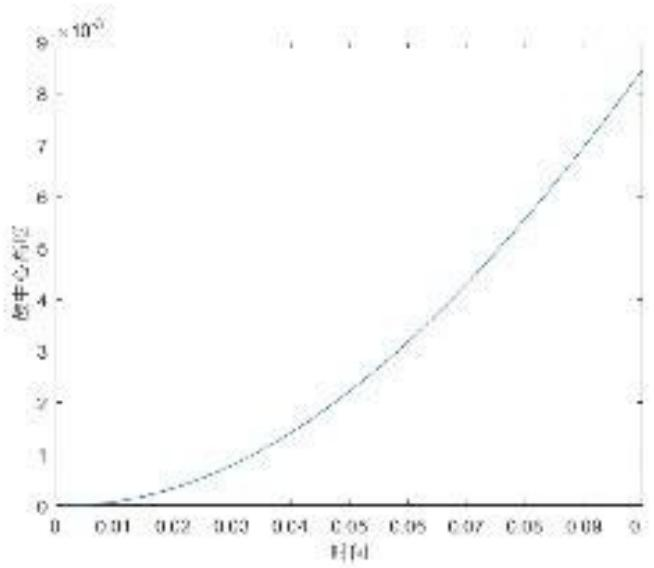  
图12 鼓面中心高度随时间变化图示

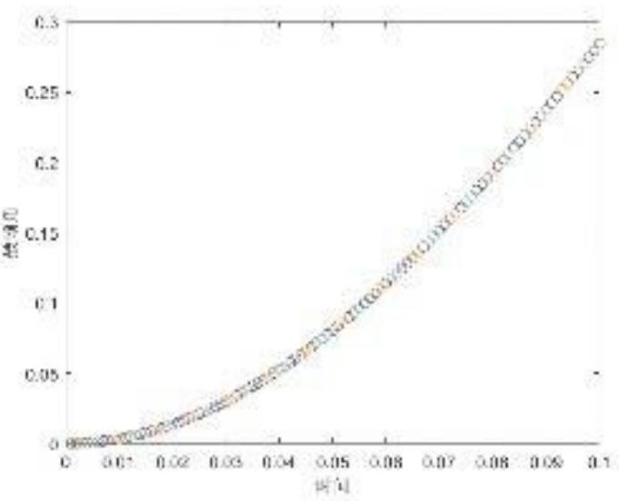  
图13 鼓面倾角随时间变化图示

图中可以看出鼓面中心高度与倾角随时间的变化趋势一致，在0.1s周期内的增长速率逐渐增大。9种情况的具体结果如下表：

表2 问题二模型求解结果
<table><tr><td rowspan=1 colspan=1>序号</td><td rowspan=1 colspan=1>用力参数</td><td rowspan=1 colspan=1>1</td><td rowspan=1 colspan=1>2</td><td rowspan=1 colspan=1>3</td><td rowspan=1 colspan=1>4</td><td rowspan=1 colspan=1>5</td><td rowspan=1 colspan=1>6</td><td rowspan=1 colspan=1>7</td><td rowspan=1 colspan=1>8</td><td rowspan=1 colspan=1>鼓面倾角(度)</td></tr><tr><td rowspan=2 colspan=1>1</td><td rowspan=1 colspan=1>发力时机</td><td rowspan=1 colspan=1>0</td><td rowspan=1 colspan=1>0</td><td rowspan=1 colspan=1>0</td><td rowspan=1 colspan=1>0</td><td rowspan=1 colspan=1>0</td><td rowspan=1 colspan=1>0</td><td rowspan=1 colspan=1>0</td><td rowspan=1 colspan=1>0</td><td rowspan=2 colspan=1>0.1833°</td></tr><tr><td rowspan=1 colspan=1>用力大小</td><td rowspan=1 colspan=1>90</td><td rowspan=1 colspan=1>80</td><td rowspan=1 colspan=1>80</td><td rowspan=1 colspan=1>80</td><td rowspan=1 colspan=1>80</td><td rowspan=1 colspan=1>80</td><td rowspan=1 colspan=1>80</td><td rowspan=1 colspan=1>80</td></tr><tr><td rowspan=2 colspan=1>2</td><td rowspan=1 colspan=1>发力时机</td><td rowspan=1 colspan=1>0</td><td rowspan=1 colspan=1>0</td><td rowspan=1 colspan=1>0</td><td rowspan=1 colspan=1>0</td><td rowspan=1 colspan=1>0</td><td rowspan=1 colspan=1>0</td><td rowspan=1 colspan=1>0</td><td rowspan=1 colspan=1>0</td><td rowspan=2 colspan=1>0.3338°</td></tr><tr><td rowspan=1 colspan=1>用力大小</td><td rowspan=1 colspan=1>90</td><td rowspan=1 colspan=1>90</td><td rowspan=1 colspan=1>80</td><td rowspan=1 colspan=1>80</td><td rowspan=1 colspan=1>80</td><td rowspan=1 colspan=1>80</td><td rowspan=1 colspan=1>80</td><td rowspan=1 colspan=1>80</td></tr><tr><td rowspan=2 colspan=1>3</td><td rowspan=1 colspan=1>发力时机</td><td rowspan=1 colspan=1>0</td><td rowspan=1 colspan=1>0</td><td rowspan=1 colspan=1>0</td><td rowspan=1 colspan=1>0</td><td rowspan=1 colspan=1>0</td><td rowspan=1 colspan=1>0</td><td rowspan=1 colspan=1>0</td><td rowspan=1 colspan=1>0</td><td rowspan=2 colspan=1>0.1383°</td></tr><tr><td rowspan=1 colspan=1>用力大小</td><td rowspan=1 colspan=1>90</td><td rowspan=1 colspan=1>80</td><td rowspan=1 colspan=1>80</td><td rowspan=1 colspan=1>90</td><td rowspan=1 colspan=1>80</td><td rowspan=1 colspan=1>80</td><td rowspan=1 colspan=1>80</td><td rowspan=1 colspan=1>80</td></tr><tr><td rowspan=2 colspan=1>4</td><td rowspan=1 colspan=1>发力时机</td><td rowspan=1 colspan=1>-0.1</td><td rowspan=1 colspan=1>0</td><td rowspan=1 colspan=1>0</td><td rowspan=1 colspan=1>0</td><td rowspan=1 colspan=1>0</td><td rowspan=1 colspan=1>0</td><td rowspan=1 colspan=1>0</td><td rowspan=1 colspan=1>0</td><td rowspan=2 colspan=1>0.6420°</td></tr><tr><td rowspan=1 colspan=1>用力大小</td><td rowspan=1 colspan=1>80</td><td rowspan=1 colspan=1>80</td><td rowspan=1 colspan=1>80</td><td rowspan=1 colspan=1>80</td><td rowspan=1 colspan=1>80</td><td rowspan=1 colspan=1>80</td><td rowspan=1 colspan=1>80</td><td rowspan=1 colspan=1>80</td></tr><tr><td rowspan=2 colspan=1>5</td><td rowspan=1 colspan=1>发力时机</td><td rowspan=1 colspan=1>-0.1</td><td rowspan=1 colspan=1>-0.1</td><td rowspan=1 colspan=1>0</td><td rowspan=1 colspan=1>0</td><td rowspan=1 colspan=1>0</td><td rowspan=1 colspan=1>0</td><td rowspan=1 colspan=1>0</td><td rowspan=1 colspan=1>0</td><td rowspan=2 colspan=1>1.1630°</td></tr><tr><td rowspan=1 colspan=1>用力大小</td><td rowspan=1 colspan=1>80</td><td rowspan=1 colspan=1>80</td><td rowspan=1 colspan=1>80</td><td rowspan=1 colspan=1>80</td><td rowspan=1 colspan=1>80</td><td rowspan=1 colspan=1>80</td><td rowspan=1 colspan=1>80</td><td rowspan=1 colspan=1>80</td></tr><tr><td rowspan=2 colspan=1>6</td><td rowspan=1 colspan=1>发力时机</td><td rowspan=1 colspan=1>-0.1</td><td rowspan=1 colspan=1>0</td><td rowspan=1 colspan=1>0</td><td rowspan=1 colspan=1>-0.1</td><td rowspan=1 colspan=1>0</td><td rowspan=1 colspan=1>0</td><td rowspan=1 colspan=1>0</td><td rowspan=1 colspan=1>0</td><td rowspan=2 colspan=1>0.4817°</td></tr><tr><td rowspan=1 colspan=1>用力大小</td><td rowspan=1 colspan=1>80</td><td rowspan=1 colspan=1>80</td><td rowspan=1 colspan=1>80</td><td rowspan=1 colspan=1>80</td><td rowspan=1 colspan=1>80</td><td rowspan=1 colspan=1>80</td><td rowspan=1 colspan=1>80</td><td rowspan=1 colspan=1>80</td></tr><tr><td rowspan=2 colspan=1>7</td><td rowspan=1 colspan=1>发力时机</td><td rowspan=1 colspan=1>-0.1</td><td rowspan=1 colspan=1>0</td><td rowspan=1 colspan=1>0</td><td rowspan=1 colspan=1>0</td><td rowspan=1 colspan=1>0</td><td rowspan=1 colspan=1>0</td><td rowspan=1 colspan=1>0</td><td rowspan=1 colspan=1>0</td><td rowspan=2 colspan=1>1.3197°</td></tr><tr><td rowspan=1 colspan=1>用力大小</td><td rowspan=1 colspan=1>90</td><td rowspan=1 colspan=1>80</td><td rowspan=1 colspan=1>80</td><td rowspan=1 colspan=1>80</td><td rowspan=1 colspan=1>80</td><td rowspan=1 colspan=1>80</td><td rowspan=1 colspan=1>80</td><td rowspan=1 colspan=1>80</td></tr><tr><td rowspan=2 colspan=1>8</td><td rowspan=1 colspan=1>发力时机</td><td rowspan=1 colspan=1>0</td><td rowspan=1 colspan=1>-0.1</td><td rowspan=1 colspan=1>0</td><td rowspan=1 colspan=1>0</td><td rowspan=1 colspan=1>-0.1</td><td rowspan=1 colspan=1>0</td><td rowspan=1 colspan=1>0</td><td rowspan=1 colspan=1>0</td><td rowspan=2 colspan=1>0.5669°</td></tr><tr><td rowspan=1 colspan=1>用力大小</td><td rowspan=1 colspan=1>90</td><td rowspan=1 colspan=1>80</td><td rowspan=1 colspan=1>80</td><td rowspan=1 colspan=1>90</td><td rowspan=1 colspan=1>80</td><td rowspan=1 colspan=1>80</td><td rowspan=1 colspan=1>80</td><td rowspan=1 colspan=1>80</td></tr><tr><td rowspan=2 colspan=1>9</td><td rowspan=1 colspan=1>发力时机</td><td rowspan=1 colspan=1>0</td><td rowspan=1 colspan=1>0</td><td rowspan=1 colspan=1>0</td><td rowspan=1 colspan=1>0</td><td rowspan=1 colspan=1>-0.1</td><td rowspan=1 colspan=1>0</td><td rowspan=1 colspan=1>0</td><td rowspan=1 colspan=1>-0.1</td><td rowspan=2 colspan=1>0.6393°</td></tr><tr><td rowspan=1 colspan=1>用力大小</td><td rowspan=1 colspan=1>90</td><td rowspan=1 colspan=1>80omp</td><td rowspan=1 colspan=1>80iti</td><td rowspan=1 colspan=1>o90Ze</td><td rowspan=1 colspan=1>ro80ist</td><td rowspan=1 colspan=1>a80e</td><td rowspan=1 colspan=1>80</td><td rowspan=1 colspan=1>80</td></tr></table>

结果分析：  
上表中序号1\~9分别对应着实际可能出现的9种不同情况。由倾斜角结果可发现：  
1、对比数据1、2，我们发现受力越大，最终倾角越大；对比数据2、3，额外发力的队员间的夹角越小，最终鼓角度偏转影响越大；对比数据3、4、5、6，提早同样使偏转角度偏大，且发力越大，角度越大，发力队员夹角越小，角度偏转越大；  
2、数据1\~3是队员同时发力但力度不同的例子，数据4\~6是队员发力时机不同但发力力度相同的例子。从结果可以看出发力时机对偏角的影响大于发力力度的影响。另外，数据3中一号队员与4号队员同时提供较大的力，队员间夹角较大，最后偏转影响较小；  
3、数据7\~9是队员发力时机与力度都不相同的例子，从结果看出，不同的组合对角度的影响也不同。如数据7同一个人力度较大且时机较早，最终偏角较大。而数据9中鼓的两侧分别采取不同的策略，一端提早用力，另一端用力较大，偏转角度相抵消。  
经过分析实际模型我们了解到系统在静止状态下绳子与水平面的夹角θ只有3.71，当成员施加的拉力较小时，鼓的倾斜程度不会超过θ。结果中最大偏转情况出现在第7条测试数据，具体为1.3197°，小于3.71°。可以看出模型的可靠性与合理性。

## 5.3 问题三模型的建立与求解

## 5.3.1 问题三的分析

问题三中我们建立了最优策略搜索模型，求解时首先需要确定颠球问题的环境变量，包括人数、绳长、鼓面较绳子水平时下降高度、球下降倾角、球下落高度。然后通过前提假设、遍历搜优等方式确定决策变量：1、规定调整策略中所有人发力时机一致，基础发力力度相同；2、队伍中存在至多两名队员额外施加一个调整力，且调整力大至多10N。基于以上方法能缩小求解空间，提高求解效率。

## 5.3.2 问题三模型的建立

问题三建立的模型将应用于鼓面倾斜的实际颠球情况。该模型主要处理因鼓面倾斜导致的颠球方向倾斜的问题。下面分析整个颠球周期时仍分为球、鼓撞击前、撞击时、撞击后三个阶段，若部分情况与上文分析相同，将直接引用上文分析结果。

## 5.3.2.1受力分析

整个受力分析的目的是为给出碰撞后球能达到的最高高度 $H _ { 2 }$ ，以及处于最高点的运动状态，包括倾角 $\beta$ 等变量。提出下阶段球倾角 $\beta ^ { ' }$ 关于本阶段变量的关系：

$$
\beta ^ { ' } ( p , L , H _ { 0 } , H _ { 2 } , \beta , F _ { i } , T _ { i } ) , ~ ( i = 1 , 2 , . . . , p ) ~ \circ
$$

## (1)球、鼓碰撞前

分析球的运动时，考虑空气阻力后我们可用如下二阶微分方程描述排球速度、加速度随时间的变化关系：

$$
m { \stackrel {  } { g } } - k ( { \frac { d { \stackrel {  } { x } } } { d t } } ) ^ { 2 } = m { \frac { d ^ { 2 } { \stackrel {  } { x } } } { d t ^ { 2 } } }\tag{43}
$$

上式为问题一结论在三维空间中的扩展，初始状态为 $\overrightarrow { x _ { 0 } } = ( 0 , 0 , H _ { 2 } )$ ，速度 $\overrightarrow { \nu _ { 0 } } = ( \nu _ { x 0 } , \nu _ { y 0 } , 0 )$ 可利用问题一的模型求得球的运动方程。

分析鼓的运动时，由于鼓受到的 $p$ 个队员的发力力度 $F _ { i }$ 与发力时机 $T _ { i }$ 各不相同，鼓面会产生一定倾角。分析时从平动与转动两个角度出发，描述运动方程时将时间离散化，分析平动与转动对鼓状态变量影响的累计。详细结果可直接运用问题二模型。

## (2)球、鼓碰撞时

当球和鼓面碰撞时，球的速度为 $\nu _ { 2 } = ( \nu _ { 2 x } , \nu _ { 2 y } , \nu _ { 2 z } )$ 鼓面的法向量为 $\stackrel {  } { \boldsymbol { n } } = ( a , b , c )$ ，鼓面中 $\therefore L$ 的速度为 $\stackrel { \longrightarrow } { \nu _ { 1 } } = ( 0 , 0 , \nu _ { 1 z } )$ 。为将球与鼓的碰撞分解为一个正碰和两个平行于撞击面的运动，我们将Oxyz坐标系转化成为Omnk坐标系，转化过程和示意图如下：

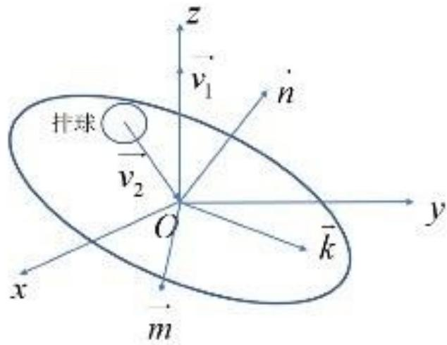  
图14 坐标系变换示意图

利用叉乘，可由 $\overrightarrow { \nu _ { 2 } } \times \overrightarrow { n }$ 得到 $m$ ，再由 $\vec { n } \times \vec { m }$ 得到 $\vec { k }$ ，显然有 $\vec { n } , \vec { m } , \vec { k }$ 相互垂直，且 $\widehat { m } , \widehat { k }$ 所

在的平面为鼓面所在的平面，因此我们完成了坐标系的转换。

作 $\overrightarrow { \nu _ { 2 } }$ 在 $\vec { n } , \vec { m } , \vec { k }$ 三个方向上的投影，可得

$$
\left\{ \begin{array} { l l } { \overrightarrow { \nu _ { 2 n } } = ( \overrightarrow { \nu _ { 2 } } \cdot \overrightarrow { n } ) / | \overrightarrow { n } | } \\ { \overrightarrow { \nu _ { 2 m } } = ( \overrightarrow { \nu _ { 2 } } \cdot \overrightarrow { m } ) / | \overrightarrow { m } | } \\ { \overrightarrow { \nu _ { 2 k } } = ( \overrightarrow { \nu _ { 2 } } \cdot \overrightarrow { k } ) / | \overrightarrow { k } | } \end{array} \right.\tag{44}
$$

同理，我们可以得到 $\overrightarrow { \nu _ { 1 } }$ 在三个方向上的投影 $\widehat { \nu _ { 1 n } } , \widehat { \nu _ { 1 m } } , \widehat { \nu _ { 1 k } }$ 。其中，排球和鼓的碰撞在三个方向上满足动能守恒与动量守恒

$$
\left\{ \begin{array} { l l } { \displaystyle \overrightarrow { z } \mathcal { h } \mathcal { G } \ddot { \star } \ddot { \forall z } \cdot \frac { 1 } { 2 } M \nu _ { 1 n } ^ { 2 } + \frac { 1 } { 2 } m \nu _ { 2 n } ^ { 2 } = \frac { 1 } { 2 } M \nu _ { 1 n } ^ { \prime 2 } + \frac { 1 } { 2 } m \nu _ { 2 n } ^ { \prime 2 } } \\ { \displaystyle \overrightarrow { z } \mathcal { h } \mathcal { G } \ddot { \star } \ddot { \forall z } \cdot M \nu _ { 1 n } + m \nu _ { 2 n } = M \nu _ { 1 n } ^ { \prime } + m \nu _ { 2 n } ^ { \prime } } \end{array} \right.\tag{45}
$$

可可以求得撞击后球在 $\vec { n }$ 方向的速度分量 $\nu _ { 2 n } ^ { \prime }$

$$
\nu _ { 2 n } ^ { \prime } { = } \frac { 2 M \nu _ { 1 n } - ( M - m ) \nu _ { 2 n } } { M + m }\tag{46}
$$

最后，我们将撞击后排球的速度 $\nu _ { 2 } ^ { \prime }$ 还原至Oxyz坐标系下，得到：

$$
\nu _ { 2 } ^ { \prime } = \frac { \nu _ { 2 n } ^ { \prime } \cdot \stackrel {  } { n } } { | \stackrel {  } { n } | } + \frac { \nu _ { 2 m } ^ { \prime } \cdot \stackrel {  } { m } } { | \stackrel {  } { m } | } + \frac { \nu _ { 2 k } ^ { \prime } \cdot \stackrel {  } { k } } { | \stackrel {  } { k } | }\tag{47}
$$

## (3)球、鼓碰撞后

到三击后我们主要研究球的运动方程，考虑空气阻力的情况下，将问题一中结论扩展

$$
m { \frac { d ^ { 2 } { \stackrel {  } { x } } } { d t ^ { 2 } } } = m g + k ( { \frac { d { \stackrel {  } { x } } } { d t } } ) ^ { 2 }\tag{48}
$$

该二阶微分方程描述了排球速度、 加速度与位置的变化关系。求解时利用速度初值和位置初值，利用问题一模型求得球的运动方程。

## 5.3.2.2 最优调整策略的目标函数

对正在下落且倾角为 $\beta$ 的排球，我们希望本轮采取的策略能使排球尽可能以竖直状态回弹，即下一阶段的 $\beta ^ { \prime }$ 尽可能小。故有如下目标：

$$
\operatorname* { m i n } \beta ^ { \prime } ( H _ { 0 } , H _ { 2 } , \beta , p , L , \theta _ { i } , F _ { i } , T _ { i } )\tag{49}
$$

## 5.3.2.3 最优调整策略的约束条件

首先问题三研究的调整策略需要满足问题一给出的部分约束条件，如颠球高度约束与队员间相邻距离约束，故不累述，直接引用问题一约束条件结果。下面主要介绍新增的约束条件：

## ● 调整对象约束

记调整前每个队员计划用力为常量 $F _ { 0 }$ ，记调整时每个队员多施加 $\Delta { \cal F } _ { i }$ 的力用于调整。并不是所有队员都需要参与调整。另外引入决策变量 $y _ { i }$ 表示队员 $i$ 是否参与调整：

$$
\left\{ \begin{array} { l l } { y _ { i } = 0 , } & { \mathbb { B } \land \boxed { \mathscr { D } } i \mathcal { K } \dotsc \square \dotsc \dotsc \dotsc } \\ { y _ { i } = 1 , } & { \mathbb { B } \land \boxed { \mathscr { D } } i \notin \bot } \end{array} \right.\tag{50}
$$

我们发现，对任意两位队员进行调整即可让鼓面发生任意程度的倾斜效果，故我们有如下调整人数的约束：

$$
\sum _ { i = 1 } ^ { p } y _ { i } = 2\tag{51}
$$

该约束表明我们在 $p$ 个队员中任意挑选两名进行发力力度的调整。

●调整发力力度约束

队员的发力力度的调整情况约束为

$$
\left\{ \begin{array} { l l } { F _ { i } ^ { \prime } = F _ { 0 } + y _ { i } \cdot \Delta F _ { i } } \\ { 0 \le \Delta F _ { i } \le 1 0 } \end{array} \right. , i = 1 , 2 , . . . , p\tag{52}
$$

该约束中，结合决策变量 $y _ { i }$ ，对队员发力力度进行了调整，若队员i参与了调整，则 $y _ { i } = 1$ 且在计划用力 $F _ { \mathrm { 0 } }$ 基础上多施加 $\Delta { F _ { i } }$ 的力在0\~10N之间。

●发力时机一致约束

为缩小求解空间，我们规定所有队员同时发力，如此可将 $p$ 个未知变量减少至1个：

$$
T _ { i } = T _ { _ i } ( \forall i , j = 1 , 2 , . . . , p )\tag{53}
$$

## 5.3.2.4 最优调整策略优化模型的确定

综上所述，我们可以得到关于最优调整策略的优化模型：

$$
\begin{array} { r l } & { \quad \operatorname* { m i n } \beta ^ { \prime } ( H _ { 0 } , H _ { 2 } , \beta , p , L , \theta , { F _ { i } } , T _ { i } ) } \\ &  = \{ \begin{array} { l l } { \operatorname* { i n } \frac { \partial ^ { 2 } \beta } { \partial \xi } \mathbb { E } _ { \xi _ { i } ^ { ( j ) } } \mathbb { H } _ { \xi _ { i - 1 } ^ { \prime } } \sum _ { j = 1 } ^ { N } = 2 } \\  \frac { 1 }  \sqrt { | \mathbf { H } _ { 0 } | ^ { 2 } \mathbb { H } _ { \xi _ { i } ^ { ( j ) } } \mathbb { H } _ { \xi _ { i - 1 } ^ { \prime } } \mathbb { H } _ { \xi _ { i - 1 } ^ { \prime } } \mathbb { H } _ { \xi _ { i - 1 } ^ { \prime } } \mathbb { H } _ { \xi _ { i - 1 } ^ { \prime } } \mathbb { A } _ { \xi _ { i - 1 } ^ { \prime } } \mathbb { A } _ { \xi _ { i - 1 } ^ { \prime } , i = 1 , 2 , . . . , p } { p } } \\  \frac { 1 }  \sqrt { | \mathbf { H } _ { 0 } | ^ { 2 } \mathbb { H } _ { \xi _ { i - 1 } ^ { \prime } } \mathbb { H } _ { \xi _ { i - 1 } ^ { \prime } } \mathbb { H } _ { \xi _ { i - 1 } ^ { \prime } } \mathbb { H } _ { \xi _ { i - 1 } ^ { \prime } } \mathbb { H } _ { \xi _ { i - 1 } ^ { \prime } } \mathbb { H } _ { \xi _ { i - 1 } ^ { \prime } } \mathbb { H } _ { \xi _ { i - 1 , 2 , . . . , p } } { p } } \\  \frac { 1 }  \sqrt  | \mathbf { H } _ { 0 } | ^ { 2 } \mathbb { H } _ { \xi _ { i - 1 } ^ { \prime } } \mathbb { H } _ { \xi _ { i - 1 } ^ { \prime } } \mathbb { H } _ { \xi _ { i - 1 } ^ { \prime } } \mathbb { H } _ { \xi _ { i - 1 } ^ { \prime } } \mathbb { H } _  \xi _ { i - 1 }  \end{array} \end{array}\tag{54}
$$

上述模型中， $H _ { 0 } , H _ { 2 } , \beta , p , L$ 表示环境变量， $\theta _ { i } , F _ { i } , T _ { i } , ( i = 1 , 2 , . . . , p )$ 表示决策变量， $\beta ^ { \prime }$ 为下一阶段排球回弹的倾角，是由前文受力分析中推得的倾角与环境变量、决策变量之间的关系，由于推导较为复杂，本文没有给出 $\beta ^ { \prime } ( H _ { 0 } , H _ { 2 } , \beta , p , L , \theta _ { i } , F _ { i } , T _ { i } )$ 的显示形式。

## 5.3.3问题三模型的应用

为检验该模型的实用性，我们以特点数据为例，求出该情况下是否应采取策略。若需要则给出具体策略。并模拟出该情况下后续颠球过程中颠球高度变化：

(1)给出如下数据(数据来自问题二第一条记录)，包括发力力度与发力时机：

表3 研究的具体数据
<table><tr><td rowspan=1 colspan=1>用力参数</td><td rowspan=1 colspan=1>1</td><td rowspan=1 colspan=1>2</td><td rowspan=1 colspan=1>3</td><td rowspan=1 colspan=1>4</td><td rowspan=1 colspan=1>5</td><td rowspan=1 colspan=1>6</td><td rowspan=1 colspan=1>7</td><td rowspan=1 colspan=1>8</td></tr><tr><td rowspan=1 colspan=1>发力时机</td><td rowspan=1 colspan=1>0</td><td rowspan=1 colspan=1>0</td><td rowspan=1 colspan=1>0</td><td rowspan=1 colspan=1>0</td><td rowspan=1 colspan=1>0</td><td rowspan=1 colspan=1>0</td><td rowspan=1 colspan=1>0</td><td rowspan=1 colspan=1>0</td></tr><tr><td rowspan=1 colspan=1>用力大小</td><td rowspan=1 colspan=1>90</td><td rowspan=1 colspan=1>80</td><td rowspan=1 colspan=1>80</td><td rowspan=1 colspan=1>80</td><td rowspan=1 colspan=1>80</td><td rowspan=1 colspan=1>80</td><td rowspan=1 colspan=1>80</td><td rowspan=1 colspan=1>80</td></tr></table>

应用问题三模型模拟受力不均衡情况下鼓与球碰撞的过程。取全体队员的反应时机为 $0 . 0 9 s$ ，根据表中具体方案模拟出颠球结果为：颠球高度0.415m，反弹倾角 $1 . 9 9 ^ { \circ }$

(2)调整方案的确定。通过遍历发力力度与发力对象，以调整后排球的倾角最小为目

标函数，最终得到如下方案：

表4 调整方案
<table><tr><td rowspan=1 colspan=1>用力参数</td><td rowspan=1 colspan=1>1</td><td rowspan=1 colspan=1>2</td><td rowspan=1 colspan=1>3</td><td rowspan=1 colspan=1>4</td><td rowspan=1 colspan=1>5</td><td rowspan=1 colspan=1>6</td><td rowspan=1 colspan=1>7</td><td rowspan=1 colspan=1>8</td></tr><tr><td rowspan=1 colspan=1>发力时机</td><td rowspan=1 colspan=1>0</td><td rowspan=1 colspan=1>0</td><td rowspan=1 colspan=1>0</td><td rowspan=1 colspan=1>0</td><td rowspan=1 colspan=1>0</td><td rowspan=1 colspan=1>0</td><td rowspan=1 colspan=1>0</td><td rowspan=1 colspan=1>0</td></tr><tr><td rowspan=1 colspan=1>用力大小</td><td rowspan=1 colspan=1>80</td><td rowspan=1 colspan=1>80</td><td rowspan=1 colspan=1>80</td><td rowspan=1 colspan=1>80</td><td rowspan=1 colspan=1>90</td><td rowspan=1 colspan=1>90</td><td rowspan=1 colspan=1>80</td><td rowspan=1 colspan=1>80</td></tr></table>

按上述方案调整倾角为 $1 . 9 9 ^ { \circ }$ 的实际情况时，计算得到经过拍击后球的倾角为 $\phantom { - } 1 0 . 0 5 2 8 ^ { \circ }$ 反弹高度为0.4005m。具体对比结果如下表：

表5 调整前后对比表
<table><tr><td rowspan=1 colspan=1></td><td rowspan=1 colspan=1>调整前</td><td rowspan=1 colspan=1>调整后</td><td rowspan=1 colspan=1>改变程度</td></tr><tr><td rowspan=1 colspan=1>反弹高度</td><td rowspan=1 colspan=1>0.415m</td><td rowspan=1 colspan=1>0.4005m</td><td rowspan=1 colspan=1>3.49%</td></tr><tr><td rowspan=1 colspan=1>球的倾角</td><td rowspan=1 colspan=1>1.99°</td><td rowspan=1 colspan=1>0.0528°</td><td rowspan=1 colspan=1>97.35%</td></tr></table>

上述为问题三模型在特定实例中的应用，为研究模型的稳定性与实用性，我们在第6节会进行详细的稳定性分析。

## 5.4 问题四模型的建立与求解

题述中只给出了 $p = 1 0$ $L = 2 m$ 等部分环境变量，还给出球碰撞后颠球结果： $\beta { = } 1 ^ { \circ }$ $H _ { 2 } = 0 . 6 m$ 。由于球在空间中做斜抛运动，故要求表示出球在水平方向上的分量。但题述没有直接给出碰撞前队员的用力及发力时机，故我们考虑先建立反弹重现模型找到还原度最高的决策方案，确定力度及发力时机后求调整策略时即可应用问题三模型。

## 5.4.1 反弹重现模型的建立

## 5.4.1.1 目标函数

题述中具体事例给出反弹结果 $\beta { = } 1 ^ { \circ }$ , $H _ { 2 } = 0 . 6 m$ 。但是未给出队员在该情况下的用力实际与力度，我们搜索时希望找到一组合适的策略，使模拟后的颠球结果与题述的反弹结果尽可能一致。由最小二乘思想得到如下目标函数：

$$
\operatorname* { m i n } \left| H _ { 2 } ^ { * } - 0 . 6 \right|\tag{55}
$$

$$
\operatorname* { m i n } { \left| \beta ^ { * } - 1 \right| }\tag{56}
$$

式中 $\beta ^ { * } , H _ { 2 } ^ { * }$ 模拟得到的理论倾角与理论颠球高度，它们的真实值为 $0 . 6 m , 1 ^ { ' }$ 。我们希望模拟后结果与真实颠球结果一致。故取它们偏离真实结果的程度最小化。

## 5.4.1.2 反弹重现优化模型的确定

在5.3.2.3节中，我们已经对调整对象、调整发力力度、调整所有队员的发力时机约束进行了叙述，这里不再重复说明。

根据目标函数，反弹重现模型是一个多目标规划模型，在实际求解的过程中，我们对重现结果的球倾角 $\beta$ 的取值要求较高，故将该目标放入约束条件，要求其与真实值的偏差小于阈值 $\xi$ 。我们可以得到如下单目标优化模型：

min|H2−0.6调整对象约束： $\sum _ { i = 1 } ^ { \rho } y _ { i } = 2$ 调整发力力度约束： $\left\{ \begin{array} { l l } { F _ { i } ^ { \prime } = F _ { 0 } + y _ { i } \cdot \Delta F _ { i } } \\ { 0 \le \Delta F _ { i } \le 1 0 } \end{array} \right. , i = 1 , 2 , . . . , p$ 调整发力时机约束： $T _ { i } = T _ { j } ( \forall i , j = 1 , 2 , . . . , p )$ 调整发力方向约束： $\theta _ { i } = \theta _ { , } ( \forall i , j = 1 , 2 , . . . , p )$ s.t.队员间距约束： $D = 2 ( R + L \cos \theta ) \cdot \sin { \frac { \alpha } { 2 } } \geq 0 . 6$ 颠球高度约束： $H _ { 2 } ^ { \prime } - \frac { H _ { 1 } } { 2 } \geq 0 . 4$ 角度还原约束： $\vert \beta ^ { * } - 1 \vert \leq \xi$ 球运动方向约束 $: \frac { \nu _ { x } } { \nu _ { y } } = \tan 1 2 ^ { \circ }$

(57)

上式中 $H _ { 2 } ^ { ' } , \beta ^ { \prime }$ 的求解可应用前几问的物体受力分析结论。题述中要求球的方向在水平方向上的投影与两队员的夹角比为1:2，即球反弹后在空间中的两个速度分量的等于tan12°或 $\tan 2 4 ^ { \circ }$ ，我们以 $\tan 1 2 ^ { \circ }$ 情况为准。

## 5.4.2 反弹重现模型的求解

Step1：首先对部分环境变量做出假设，如初始状态鼓较水平的高度记为0.11m；

Step2：遍历求解空间。反弹重现模型寻优时的求解空间包括反应时机 $T _ { i }$ 、参与调整的两个队员发力的力度 $F _ { 1 } , F _ { 2 }$ 不参与调整的队员的发力力度 $F _ { \mathrm { 0 } }$ 。它们的范围与步长具体控制为： $0 \le T _ { i } \le 0 . 2 , \Delta T _ { i } = 0 . 0 1 s$ $9 5 \leq F _ { 0 } \leq 1 1 5 , 9 5 \leq F _ { 1 } , F _ { 2 } \leq 1 1 5 , \Delta F _ { 0 } = \Delta F _ { 1 } = \Delta F _ { 2 } = 1$ 。其中力的遍历上下限主要通过他们对应的颠球高度确定，如全体力大于95N时颠球高度才会达到0.6m，由此确定下限；

Step3：挑选最优还原结果。在求解空间遍历时，将阈值设置为 $\xi = 0 . 0 1$ 。挑选其中误差最小的一组解为最佳还原方案。挑选出最优的方案对应的还原结果为反弹高度0.5817m，球倾角0.9967°。我们最终还原得到的最佳发力决策见下表：

表6 最佳还原决策
<table><tr><td rowspan=1 colspan=1>用力参数</td><td rowspan=1 colspan=1>1</td><td rowspan=1 colspan=1>2</td><td rowspan=1 colspan=1>3</td><td rowspan=1 colspan=1>4</td><td rowspan=1 colspan=1>5</td><td rowspan=1 colspan=1>6</td><td rowspan=1 colspan=1>7</td><td rowspan=1 colspan=1>8</td><td rowspan=1 colspan=1>9</td><td rowspan=1 colspan=1>10</td></tr><tr><td rowspan=1 colspan=1>发力时机</td><td rowspan=1 colspan=1>0</td><td rowspan=1 colspan=1>0 Co</td><td rowspan=1 colspan=1>nopet</td><td rowspan=1 colspan=1>ition</td><td rowspan=1 colspan=1>ZeroDi</td><td rowspan=1 colspan=1>stgnc</td><td rowspan=1 colspan=1>e-0</td><td rowspan=1 colspan=1>0</td><td rowspan=1 colspan=1>0</td><td rowspan=1 colspan=1>0</td></tr><tr><td rowspan=1 colspan=1>用力大小</td><td rowspan=1 colspan=1>121</td><td rowspan=1 colspan=1>119</td><td rowspan=1 colspan=1>117</td><td rowspan=1 colspan=1>117</td><td rowspan=1 colspan=1>117</td><td rowspan=1 colspan=1>117</td><td rowspan=1 colspan=1>117</td><td rowspan=1 colspan=1>117</td><td rowspan=1 colspan=1>117</td><td rowspan=1 colspan=1>117</td></tr></table>

确定如上表所示的决策方案后，由问题三中的排球受力分析，我们可描述出排球撞击后在空间中的状态变化。下图为球撞击后的运动轨迹还原图：

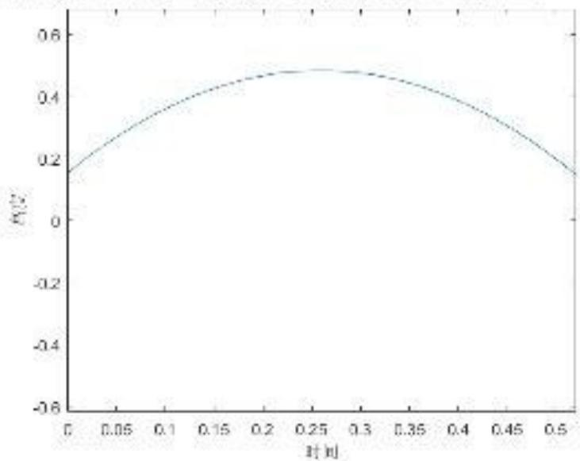  
图15 撞击后球的运动轨迹

图中，经过重现，球与鼓在0.18m左右位置相撞，最终球达到的最大高度为0.5817m，与上一轮颠球高度相差0.1817m。

## 5.4.3 问题四的求解

## 5.4.3.1 调整策略结果展示

应用问题三模型即可求得最佳的调整方案。具体为：

表7最佳调整方案
<table><tr><td rowspan=1 colspan=1>用力参数</td><td rowspan=1 colspan=1>1</td><td rowspan=1 colspan=1>2</td><td rowspan=1 colspan=1>3</td><td rowspan=1 colspan=1>4</td><td rowspan=1 colspan=1>5</td><td rowspan=1 colspan=1>6</td><td rowspan=1 colspan=1>7</td><td rowspan=1 colspan=1>8</td><td rowspan=1 colspan=1>9</td><td rowspan=1 colspan=1>10</td></tr><tr><td rowspan=1 colspan=1>发力时机</td><td rowspan=1 colspan=1>0</td><td rowspan=1 colspan=1>0</td><td rowspan=1 colspan=1>0</td><td rowspan=1 colspan=1>0</td><td rowspan=1 colspan=1>0</td><td rowspan=1 colspan=1>0</td><td rowspan=1 colspan=1>0</td><td rowspan=1 colspan=1>0</td><td rowspan=1 colspan=1>0</td><td rowspan=1 colspan=1>0</td></tr><tr><td rowspan=1 colspan=1>用力大小</td><td rowspan=1 colspan=1>117</td><td rowspan=1 colspan=1>117</td><td rowspan=1 colspan=1>117</td><td rowspan=1 colspan=1>117</td><td rowspan=1 colspan=1>118</td><td rowspan=1 colspan=1>118</td><td rowspan=1 colspan=1>117</td><td rowspan=1 colspan=1>117</td><td rowspan=1 colspan=1>117</td><td rowspan=1 colspan=1>117</td></tr></table>

运动上述调整策略，算的调整后球反弹倾角为0.152°，反弹高度为0.5431m，我们模拟得到的调整前反弹高度0.5817m，球倾角 $0 . 9 9 6 7 ^ { \circ }$ 。下表为调整前后结果对比：

表8 调整对比表
<table><tr><td rowspan=1 colspan=1></td><td rowspan=1 colspan=1>调整前</td><td rowspan=1 colspan=1>调整后</td><td rowspan=1 colspan=1>改变程度</td></tr><tr><td rowspan=1 colspan=1>反弹高度</td><td rowspan=1 colspan=1>0.6m</td><td rowspan=1 colspan=1>0.5431m</td><td rowspan=1 colspan=1>9.48%</td></tr><tr><td rowspan=1 colspan=1>球的倾角</td><td rowspan=1 colspan=1>1°</td><td rowspan=1 colspan=1>0.152°</td><td rowspan=1 colspan=1>84.80%</td></tr></table>

表中结果说明调整策略不仅效率高，而且对反弹高度的改变量不大，实施效果较好。

## 5.4.3.2 调整策略实施效果分析

上小节我们通过调整策略对应的结果对策略效果做出了初略评价。研究策略的实施效果还要从策略的稳定性与通用性考虑，我们在具体调整策略的力度与发力时机上加入一定扰动，具体为均值是0，方差是0.01的正态噪声。重复求解10次并统计采取最优调整策略后排球的倾角如下图：

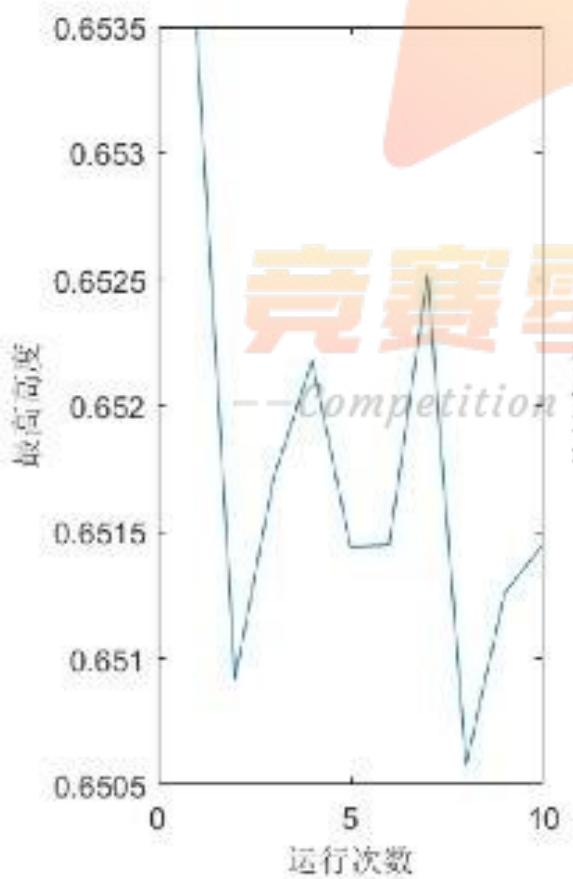

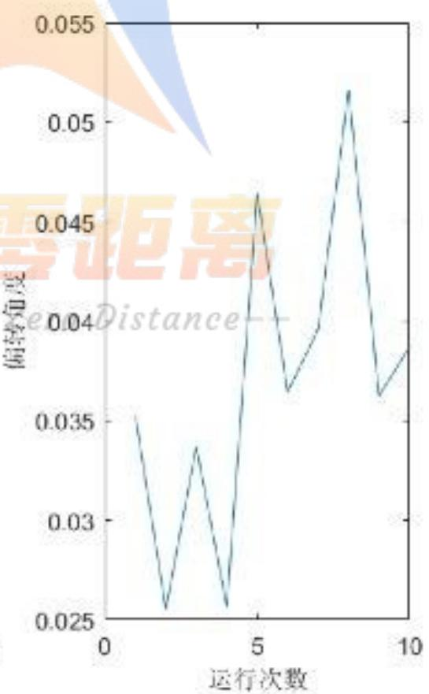  
图16 调整后球的倾角变化

在调整前球的下落角度为0.9967°，经过问题四最优调整方案调整后，倾角降低为 $0 . 0 4 ^ { ^ { \circ } }$ 左右，调整效果好。高度在0.65m上下，与上一轮高度相差不大。说明模型对不同情况的调整效果都较好，稳定性强。

## 六、模型的稳定性分析与灵敏度分析

## 6.1 模型的稳定性分析

## ●问题三模型的稳定性分析

项目在实际过程中队员的决策存在一定误差，所以实际颠球高度、球的倾角会存在偏差。本小节将在数据中加入均值为0，方差为0.01的正态噪声，然后用问题三模型求解击球结果，重复多次求解，对比求得的颠球高度、球的倾角是否存在明显偏差。

这里我们选取问题二中第一条记录的决策数据，以上述方案重复求解10次，绘制问题三模型求解结果：

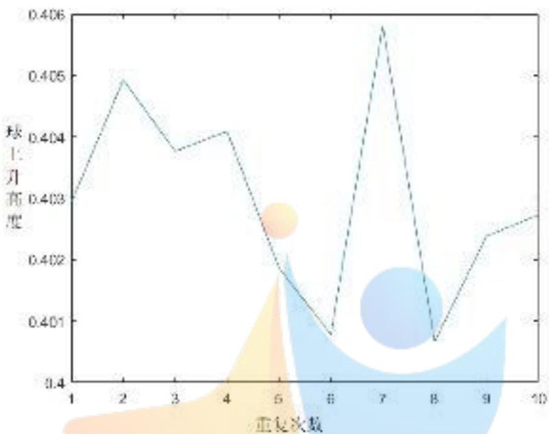  
图17 颠球高度变化

图中可以看出加入随机扰动后，颠球高度的最大波动仅为0.99%，变化控制在0.005m以内。这些浮动在实际项目中是可以接受的，说明问题三倾斜状态下颠球求解模型的稳定性较高。

## 6.2 模型的灵敏度分析

在同心鼓颠球问题中存在大量颠球环境变量，包括绳长L、鼓面较绳子水平时下降高度 $H _ { 0 }$ 、球下落高度 $H _ { 2 }$ 、鼓重M等其他变量。另外颠球决策变量中所有队员的发力力度 $F _ { 0 }$ 也可以做灵敏度分析。它们的初值为： $L = 1 . 7 m$ $H _ { 0 } = 0 . 1 1 m$ $H _ { 2 } = 0 . 4 m$ $m = 0 . 2 7 k g$ $M = 3 . 6 k g$ $F _ { 0 } { = } 8 0 N$ 。令这些变量上下连续波动5%，利用MATLAB软件绘制这5个参数分别与颠球高度之间的示意图（文件名sensity.m，详见灵敏度分析附件）：

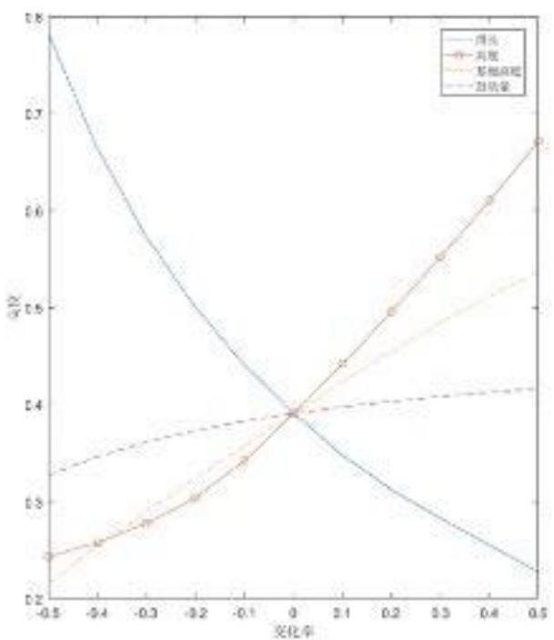  
图18 颠球环境变量

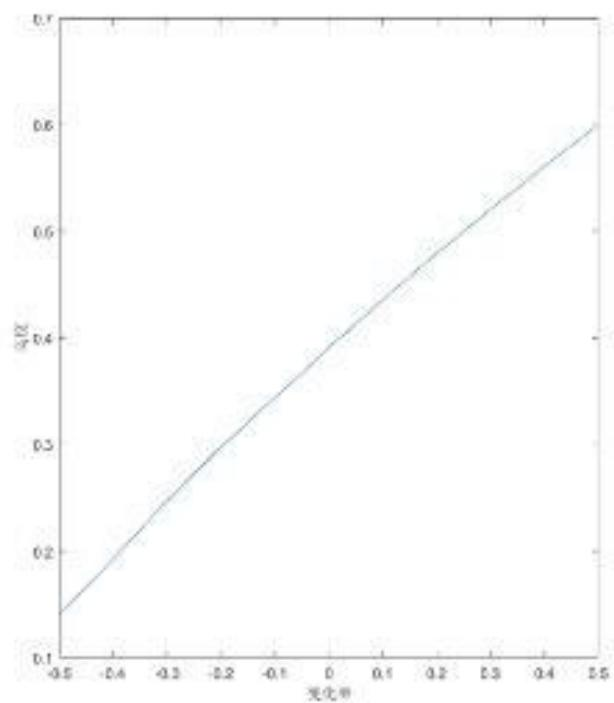  
图19 颠球决策变量

图18中，问题一的颠球高度求解模型对绳长、鼓面较绳子水平时下降高度、球下落高度这3个参数较为敏感，其中绳长与球下落高度的变化会对颠球高度造成较大影响。因此在实际参与项目中应格外注意它们的取值情况。从图19中可以看出假设队员发力一致的情况下，颠球高度求解模型对发力大小也较为敏感，在实际参与项目时队员应格外注意这一点。

## 七、模型的推广与评价

## 7.1 模型的优点

1、在问题一中，我们考虑了排球运动过程中空气阻力的影响，使游戏过程更加符合真实情况。同时，对最优策略做出了队员用力方向与水平面夹角相同、发力时机相同、发力力度相同的规定，且要求最优策略中所有队员的用力最省，该目标容易实现；

2、在问题二中，我们将时间离散化，将游戏的动态过程转化成为各个不同的阶段状态；在分析竖直方向上的合力对鼓产生的合力矩的同时，我们还考虑了上一阶段的合力矩对本阶段的影响，消除了时间离散化带来的误差；

3、在问题三中，我们建立了最优调整策略模型，并应用问题二给出的实例进行测试求解，给出了具体的调整方案。在现实处理过程中，存在变量较多的情况，我们做出了所有队员用力时间一致，仅有一个队员调整发力力度的约定，简化了模型，缩小了求解空间，而且求得的解符合客观规律；

4、在问题四中，仅给出了撞击后排球的倾角和反弹高度，未给出撞击前的队员的发力力度与发力时机，为了准确描述出撞击后球的运动轨迹，我们构建了撞击重现模型，以重现度最高为目标函数，求解得到了球在撞击前队员的用力力度与发力时机，使得后续求解更精准。

## 7.2 模型的不足

1、为便于模型的建立与求解，我们假设了排球与鼓之间的碰撞为完全弹性碰撞，并且认为碰撞是瞬时完成的，忽略了碰撞的时间。而在实际的碰撞过程中，涉及到复杂的能量传递等物理过程，将该过程过于理想化会对结果带来一定的误差；

2、在研究“同心协力”策略时，我们没有具体研究队员和鼓共同的水平移动的过程，只是将其简单假设为每次球下落时，队员和鼓的所在位置能够接住球并发生碰撞；

3、在问题三、四中，需要遍历求解的变量过多，我们只是在所有队员同时发力的前提下，调整了发力的对象和发力的力度。

## 7.3 模型的推广

我们可以将排球与鼓面的碰撞推广至柔性梁的弹塑性碰撞问题，研究其弹性次碰撞行为的发生原因以及碰撞的各个时刻的变化规律；此外，对于碰撞问题，我们可以用于汽车一行人碰撞事故、桥碰撞接触时间的船撞力等研究，结合本文中研究发力策略时所使用的思想，利用物理学中的受力、力矩等知识，进行模拟仿真分析。

## 八、参考文献

[1] https://www.zhihu.com/question/68565717

[2] https://wenku.baidu.com/view/68b1498ad0d233d4b14e6922.html

[3] https://zhidao.baidu.com/question/8649722.html

[4]余国卫，王镜宇.一种绕空间任意动轴做旋转变换的矢量方法[J].微处理机,2010,31(06):49-51+56.

[5]谢敬然,柯媛元.空间解析几何[M].北京:高等教育出版社,2013.5:37-83

[6]秦敢,向守平.力学与理论力学[M].北京:科学出版社,2017.8:132-138

[7]苗国华,崔元福,王永,冯克祥.新型平地机铲刀回转机构及其回转力矩计算[J].筑路机械与施工机械化,2017,34(04):101-103+107.


## 竞赛零距离

--Competition Zero Distance--

## 九、附录

```matlab
附录一问题一程序
文件名：%problem1.m
clc,clear
g=9.8;%重力加速度
dt=0.01;%单位时间 0.01s
h0=40*0.01;%球离鼓面的初始高度
t=0.2;
t=0:dt:t;
global F
global nh
H=0.11;
ah=zeros(length(t)*10,4);
u=0;
%%
for p_t=t
%开始的时机
for F=70:90
%用力力度
nh=0.4;
u=u+1;
hh=solve_problem1(p_t);
ah(u,:)=[hh,F,p_t,0];
if hh<0.4
continue
end
for i=1:20
hh=solve_problem1(p_t);
if hh<0.4
br(a,1)in竞赛零距离
else --Competition Zero Distance--
nh=hh;
end
end
ah(u,4)=nh;
end
end
%
% F=85;
% nh=0.4;
% for i=1:100
% u=u+1;
% hh=solve_problem1(0.09);
% ah(u,:)=[hh,F,0,0];
% nh=hh;
% end
% plot(ah(1:u,1))
```

```matlab
%solve_problem1.m
function hh=solve_problem1(p_t)
%求解第一问运动状态
%p_t,开始的时机
global nh
g=9.8;%重力加速度
[T,P_ball]=s_p(@ball_P,[0,1],[nh,0]');%球的位置
m=3.6;%鼓的重量
mb=0.24;%球的质量
[~,gu]=s_p(@my_fun,[0,1],[0,0]');
dt=0.001;
u=0;
for i=1:length(T)
if T(i)>p_t
u=u+1;
d=abs(P_ball(i,1)-0.105-gu(u,1));
%% plot(i,d,'ko')
hold on
if d<5e-3
t=i;%找到碰撞时机
break
end
end
end
% hold off
v2=P_ball(t,2);
v1=gu(u,2);
V=2*m*v1-(m-mb)*v2;
00零距离
end Competition Zero Distance--
function f=ff(t,x)
m=0.27;%球的质量
R=0.105;%半径
row=1.29;%空气密度
c=0.5;%空气阻力系数
g=9.8;
k=0.5*c*row*pi*R^2;
f=zeros(2,1);
f(1)=x(2);
f(2)=-g-k/m*x(2)^2;
end
附录二 问题二程序
文件名：%problem2.m
```

```matlab
clc,clear
L=1.7;m=3.6;H=0.11;g=9.8;R=0.2;
n_people=8;
F=80*ones(1,n_people);F([1])=90;
error_t=zeros(1,n_people);%发力延迟
error_t([])=-0.1;
F0=F;
dt=0.001;
tt=0.1;
T=(min(error_t)+dt):dt:tt;
T=round(T*1000)/1000;
h=0;
M0=[0,0,1]';
v=0;
P=zeros(length(T),2);
u=1;
w0=[0,0,0]';
W02=[0,0,0]';
I=0.25*m*R^2+m*0.22^2/12;
flag1=0;
for i=T
F=F0;
if flag1=0
flag=0;
for ii=1:n_people
if error_t(ii)<i
for j=1:n_people
if j~=ii && error_t(j)>error_t(ii) && error_t(j)>i
F(j)=(L/H)*m*g/8;
flag=1;
end
end 竞赛零距离
end
end
if flag—0 -Competition Zero Distance
flag1=1;
end
end
u=u+1;
[M,Fy]=solve_M(M0,h,F,n_people);
W02=W02+M;
M=W02;
a=Fy/m-g;
h=h+v*dt+0.5*a*dt^2;
v=v+a*dt;
P(u,:)=[h,v];
alpha=sum(M.^2)^0.5/I;
wk=W0'*M/sum(M.^2)^0.5;
ww=wk*dt*0+0.5*alpha*dt^2;
A= makehgtform('axisrotate',M,ww); % t 是 a 绕 b 旋转的弧度
```

```matlab
u=0;
for p_t=t
%开始的时机
for F=85
%用力力度
nh=0.4;
u=u+1;
hh=solve_problem1(p_t);
ah(u,:)=[hh,F,p_t,0];
if hh<0.4
continue
end
for i=1:20
hh=solve_problem1(p_t);
if hh<0.4
ah(u,1)=inf;
break
else
nh=hh;
end
end
ah(u,4)=nh;
end
end
for i=1:u
if ~isinf(ah(i,1)) &&ah(i,end)>0
p_t=ah(i,3);
break
end
end
%利用第一问模型得到最优方案赛零距离
p_t=0.09; -Competition Zero Distance--
F=80*ones(1,n_people);F([1])=90;
error_t=zeros(1,n_people);%发力延迟
error_t([])=-0.1;
F0=F;
dt=0.001;
tt=0.5;
T=(min(error_t)+dt):dt:tt;
T=round(T*100)/100;
h=0;
M0=[0,0,1]';
v=0;
P=zeros(length(T),2);
u=1;
W0=[0,0,0]';
I=0.25*m*R^2+m*0.22^2/12;
flag1=0;
```

```matlab
M0=A(1:3,1:3)*M0(:);
am=M/sum(M.^2)^0.5;
W0=wk*am+alpha*dt*am;
plot(i,atand(sum(M0(1:2).^2)^0.5/M0(3)),'o')
hold on
end
atand(sum(M0(1:2).^2)^0.5/M0(3))
%solve M.m
function [M,Fy]=solve_M(M0,h,F,n_people)
%求解某一状况下的和力矩，以及竖直方向上的合力
%M0是现在的鼓面的法向量
%h是鼓面（绳与鼓的接触面）的高度
%F是各个人所用的力
%n_people 是人数
L=1.7;m=3.6;H=0.11;g=9.8;R=0.2;
theta=2*pi/n_people;
M=0;
Fy=0;
for i=1:n_people
z=shpe(M0,(i-1)*theta);
h0=h+z(3);
r=[z(1),z(2),h]′;
F0=zeros(3,1);
x=sqrt(L^2-(H-h0)^2);
k=x+(r(1)^2+r(2)^2)^0.5;
F0(1:2)=r(1:2)*k/(r(1)^2+r(2)^2)^0.5;
F0(3)=H-h;
s=sum(F0.^2)^0.5;
F0=F0/s*F(i);
end y y()(赛零距离
end -Competition ZeroDistance--
附录三问题三程序
文件名：%problem3.m
clc,clear
L=1.7;m=3.6;H=0.11;g=9.8;R=0.2;
n_people=8;
h0=40*0.01;%球离鼓面的初始高度
t=0.2;
dt=0.01;
t=0:dt:t;
%%
global F
global nh
H=0.11;
ah=zeros(length(t)*1,4);
```

```matlab
gu=zeros(length(T),5);
for i=T
F=F0;
if flag1=0
flag=0;
for ii=1:n_people
if error_t(ii)<i
for j=1:n_people
if j~=ii && error_t(j)>error_t(ii) && error_t(j)>i
F(j)=(L/H)*m*g/8;
flag=1;
end
end
end
end
if flag==0
flag1=1;
end
end
u=u+1;
[M,Fy]=solve_M(M0,h,F,n_people);
a=Fy/m-g;
h=h+v*dt+0.5*a*dt^2;
v=v+a*dt;
alpha=sum(M.^2)^0.5/I;
wk=W0'*M/sum(M.^2)^0.5;
ww=wk*dt+0.5*alpha*dt^2;
A= makehgtform('axisrotate',M,ww); % t 是 a 绕 b 旋转的弧度
M0=A(1:3,1:3)*M0(:);
am=M/sum(M.^2)^0.5;
gu(u,:)=[h,v,M0'];
end
stance
%利用问题二模型计算现实情况下的鼓的运动情况
%%
[V,Vp]=solve_find(gu,p_t,[0,0,0.4]',[0,0,0]');%利用第三问的三维碰撞模型
后球的运动状态
%%
gama=Vp(2)/Vp(1);
gama=atand(gama);
if Vp(2)>=0
n=floor(gama/(360/n_people));
else
n=floor((gama+180)/(360/n_people));
end
ifn==n_people∥n==0
sel=[1,n_people];
else
sel=[n,n+1];
```

```matlab
V=solve_find(gu,p_t,h0,v0);
if V(5)<0.4
%如果反弹后不符合要求
Vh=inf;
else
Vh=sum(V([1,3]).^2)^0.5;
end
end
%shpe.m
function z=shpe(M,theta)
%求解圆在三维空间中的坐标
R=0.2;
f1=@(x) [sum(x.^2)-R^2;x(2)-tan(theta)*x(1);M'*x];
if theta>=0 && theta<pi/2
beta=[0.1,0.1,0]';
elseif theta>=pi/2 && theta<pi
beta=[-0.1,0.1,0]';
elseif theta>=pi && theta<pi*3/2
beta=[-0.1,-0.1,0]';
elseif theta>=pi*3/2 && theta<2*pi
beta=[0.1,-0.1,0]';
end
opt=optimset('Display','off);
z=fsolve(f1,beta,opt);
end
%s_p.m
function [T,F]=s_p(f,span,x0)
h=0.001;
T=span(1):h:span(2);
for i=T --Competition Zero Distance
k1=f(i,x0);
k2=f(i+h/2,x0+h*k1/2);
k3=f(i+h/2,x0+h*k2/2);
k4=f(i+h,x0+h*k3);
x=x0+h/6*(k1+2*k2+2*k3+k4);
x0=x;
u=u+1;
F(u,:)=x(:)';
end
end
```

```matlab
end
minn=inf;
n=1;
for i=1:n
for F0=81:90
for F1=81:90
F=ones(1,n_people)*80;
F(sel(i,1))=F0;
F(sel(i,2))=F1;
Vh=solve_ad(F,n_people,p_t,[0,0,V(5)]',V(2:2:end)');
if ~isinf(Vh) && Vh<minn
minn=Vh;
a=[sel(i,:),80,F0,F1];
end
end
end
end
solve_ad.m
function [Vh,V]=solve_ad(F,n_people,p_t,h0,v0)
%求解调整策略
%F ad 是指用力策略
%sel 确定那些人特别用力
%F0是理想情况下的用力力度
dt=0.001;m=3.6;R=0.2;g=9.8;
tt=0.5;
T=dt:dt:tt;
h=0;
M0=[0,0,1]';
v=0;
I=0.25*m*R^2+m*0.22^2/12; 2音赛零距离
gu=zeros(length(T),5);--CompetitionZeroDistance
for i=T
u=u+1;
[M,Fy]=solve_M(M0,h,F,n_people);
a=Fy/m-g;
h=h+v*dt+0.5*a*dt^2;
v=v+a*dt;
alpha=sum(M.^2)^0.5/I;
wk=W0'*M/sum(M.^2)^0.5;
ww=wk*dt+0.5*alpha*dt^2;
A= makehgtform('axisrotate',M,ww); % t 是 a 绕 b 旋转的弧度
M0=A(1:3,1:3)*M0(:);
am=M/sum(M.^2)^0.5;
W0=wk*am+alpha*dt*am;
gu(u,:)=[h,v,M0'];
end
```